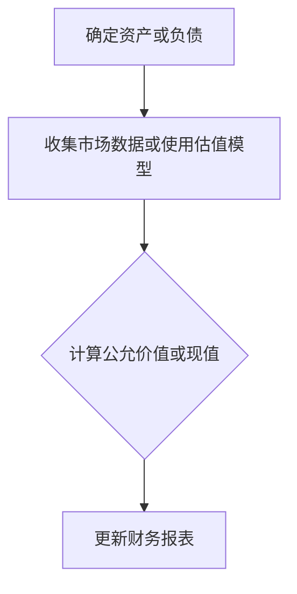
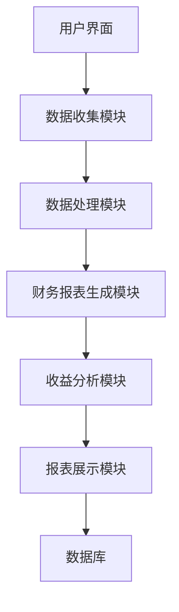
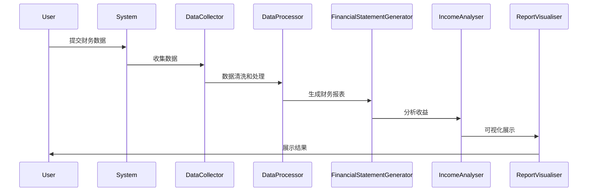

                 

## 1. 引言

### 1.1 书籍背景与目的

在当今全球经济环境中，财务报表分析是企业决策者、投资者和分析师进行投资决策、风险管理和财务规划的重要工具。随着经济的发展和商业环境的复杂化，传统财务报表分析方法已经难以全面、准确地反映企业的财务状况和经营成果。创新会计处理方法应运而生，通过新的会计理论和实践方法，为企业提供了更为全面、准确和透明的财务信息。

本书“格雷姆的财务报表分析：应对创新会计处理方法”旨在为读者提供一套系统、全面、易于理解的财务报表分析框架，帮助读者掌握创新会计处理方法的基本概念和应用技巧。本书的主要目标如下：

1. **介绍财务报表分析的基础知识和核心概念**：通过详细阐述资产负债表、利润表和现金流量表的基本结构和分析方法，使读者对财务报表分析有全面的了解。

2. **深入探讨创新会计处理方法的特点和分类**：分析传统会计处理方法的局限，介绍创新会计处理方法的基本特点、分类和应用场景。

3. **讲解如何应用创新会计处理方法进行财务报表分析**：通过具体案例和实际操作，展示创新会计处理方法在财务报表重述、持续性收益分析、会计估计变更和企业合并会计处理等领域的应用。

4. **分析创新会计处理方法的挑战和应对策略**：探讨创新会计处理方法在法律法规、财务报告透明度和企业风险管理等方面的挑战，并给出相应的应对策略。

5. **展望创新会计处理方法的发展趋势和未来方向**：分析创新会计处理方法的发展趋势，探讨财务报表分析的未来发展方向，为企业提供战略规划和管理决策的参考。

### 1.2 财务报表分析的重要性

财务报表分析是企业管理和投资决策的重要依据。它不仅帮助企业管理者了解企业的财务状况和经营成果，还帮助投资者评估企业的价值和投资潜力。具体来说，财务报表分析的重要性体现在以下几个方面：

1. **评估企业财务状况**：通过分析资产负债表，可以了解企业的资产结构、负债水平和偿债能力；通过分析利润表，可以了解企业的盈利能力和经营效益；通过分析现金流量表，可以了解企业的现金流动状况和资金管理能力。

2. **预测企业未来发展趋势**：财务报表分析不仅能够反映企业过去的经营成果，还能够预测企业未来的发展趋势。通过对财务数据的趋势分析和比较，投资者可以更好地把握企业的成长空间和风险。

3. **辅助投资决策**：财务报表分析是投资者进行投资决策的重要依据。投资者通过分析企业的财务报表，可以评估企业的投资价值和投资风险，从而做出更为科学的投资决策。

4. **促进企业改进管理**：通过财务报表分析，企业管理者可以发现企业在财务管理、成本控制和运营管理等方面的问题，从而制定改进措施，提高企业的管理水平和经营效率。

### 1.3 创新会计处理方法的影响

随着经济的发展和商业环境的不断变化，传统会计处理方法已经难以满足现代企业对财务信息的需求。创新会计处理方法的出现，为财务报表分析提供了新的思路和方法。创新会计处理方法的影响主要体现在以下几个方面：

1. **提高财务信息的透明度和准确性**：创新会计处理方法通过新的会计理论和实践，提高了财务信息的透明度和准确性。例如，公允价值计量方法的应用，使得资产和负债的计量更加真实和公允。

2. **反映企业真实的经营状况**：创新会计处理方法能够更好地反映企业的真实经营状况。例如，持续性收益分析和非持续性收益区分，使得企业的盈利能力更加清晰。

3. **提高财务报表的实用性**：创新会计处理方法使得财务报表更加实用。通过财务报表的重述和会计估计变更，企业能够提供更为全面和准确的财务信息，帮助投资者和管理者做出更为科学的决策。

4. **适应全球化的发展趋势**：创新会计处理方法有助于企业适应全球化的经济发展趋势。通过国际会计准则的应用，企业能够提供与国际接轨的财务信息，提高企业的国际竞争力。

### 1.4 阅读对象与预期收益

本书主要面向财务分析师、会计师、投资分析师和企业高管等专业人士。以下是本书适合的阅读对象和预期收益：

1. **财务分析师**：通过阅读本书，财务分析师可以深入了解财务报表分析的基本原理和创新会计处理方法，提高财务分析能力和决策水平。

2. **会计师**：本书为会计师提供了全新的会计理论和方法，有助于提高会计实践能力，掌握创新会计处理方法，为企业提供更高质量的财务报告。

3. **投资分析师**：本书为投资分析师提供了全面的财务报表分析框架和创新会计处理方法的实际应用案例，有助于提高投资分析和决策能力。

4. **企业高管**：本书为高管提供了系统、全面的财务报表分析知识和创新会计处理方法的实战经验，有助于提高企业的财务管理水平和战略决策能力。

通过阅读本书，读者可以：

- 掌握财务报表分析的基本原理和方法。
- 了解创新会计处理方法的特点和应用场景。
- 提高财务报表分析和投资决策能力。
- 为企业的财务管理和发展提供有力支持。

### 1.5 财务报表分析基础

财务报表分析是现代企业管理、投资决策和风险管理的重要工具。要有效地进行财务报表分析，首先需要了解财务报表的基本结构和分析方法。以下将对财务报表的概述、资产负债表、利润表、现金流量表以及财务报表的综合分析进行详细阐述。

#### 1.5.1 财务报表概述

财务报表是企业财务状况、经营成果和现金流量的重要反映。根据《企业会计准则》，企业必须编制的财务报表主要包括资产负债表、利润表、现金流量表和所有者权益变动表。以下是这四种主要财务报表的简要概述：

1. **资产负债表**：资产负债表是反映企业某一特定时点财务状况的报表。它列出了企业的资产、负债和所有者权益，按照流动性进行分类排列。资产负债表的基本结构如下：

   | 项目   | 金额   |
   |--------|--------|
   | 资产   |        |
   | 负债   |        |
   | 所有者权益 |        |

2. **利润表**：利润表是反映企业在一定会计期间经营成果的报表。它列出了企业的收入、费用和利润，按照功能进行分类排列。利润表的基本结构如下：

   | 项目   | 金额   |
   |--------|--------|
   | 收入   |        |
   | 费用   |        |
   | 利润   |        |

3. **现金流量表**：现金流量表是反映企业在一定会计期间现金流入和流出的报表。它按照经营活动、投资活动和筹资活动分类，反映了企业的现金流动状况。现金流量表的基本结构如下：

   | 类别   | 现金流入 | 现金流出 | 净现金流 |
   |--------|----------|----------|---------|
   | 经营活动 |          |          |         |
   | 投资活动 |          |          |         |
   | 筹资活动 |          |          |         |

4. **所有者权益变动表**：所有者权益变动表是反映企业在一定会计期间所有者权益变动情况的报表。它详细列出了所有者权益的变动原因和变动金额。

#### 1.5.2 资产负债表解读

资产负债表是财务报表中最基本也是最重要的报表之一。它不仅反映了企业的财务状况，还为企业制定经营策略、进行投资决策提供了重要依据。

1. **资产部分分析**

   资产部分分为流动资产和非流动资产。流动资产包括现金及现金等价物、应收账款、存货等，反映了企业的短期偿债能力和资产流动性。非流动资产包括长期投资、固定资产、无形资产等，反映了企业的长期投资能力和资产结构。

   - **现金及现金等价物**：现金及现金等价物是企业最具流动性的资产，可以直接用于偿还债务和支付运营费用。分析现金及现金等价物的余额和变化情况，可以了解企业的流动性状况。

   - **应收账款**：应收账款是企业在经营过程中因销售商品或提供服务而形成的应收款项。应收账款的余额和周转情况反映了企业的应收账款管理和信用政策。

   - **存货**：存货是企业为销售或耗用而储备的物资，包括原材料、在产品、成品等。存货的余额和周转情况反映了企业的库存管理和成本控制能力。

2. **负债部分分析**

   负债部分分为流动负债和非流动负债。流动负债包括短期借款、应付账款、预收账款等，反映了企业的短期偿债能力。非流动负债包括长期借款、长期应付款等，反映了企业的长期债务负担。

   - **短期借款**：短期借款是企业为满足短期资金需求而向银行或其他金融机构借入的资金。短期借款的余额和变化情况反映了企业的短期融资能力和资金管理状况。

   - **应付账款**：应付账款是企业因购买商品或服务而形成的应付款项。应付账款的余额和周转情况反映了企业的信用政策和供应商关系。

3. **所有者权益部分分析**

   所有者权益是企业资产扣除负债后的剩余权益，包括实收资本、资本公积、盈余公积和未分配利润等。所有者权益的余额和变化情况反映了企业的资本结构和财务稳定性。

   - **实收资本**：实收资本是企业股东投入的资本，反映了企业的注册资本和股东权益。

   - **资本公积**：资本公积是企业因发行股票、接受捐赠等原因形成的公积金，反映了企业的资本增值。

   - **盈余公积**：盈余公积是企业从净利润中提取的公积金，用于补充企业的流动资金或扩大再生产。

   - **未分配利润**：未分配利润是企业尚未分配的利润，反映了企业的累积利润和盈利能力。

#### 1.5.3 利润表分析

利润表是反映企业在一定会计期间经营成果的报表，是企业盈利能力的重要指标。利润表的分析主要包括以下几个方面：

1. **收入分析**

   收入是利润表中最核心的指标，反映了企业的经营业绩。收入分析主要包括收入总额、收入构成、收入增长率和收入质量等。

   - **收入总额**：收入总额是企业在会计期间实现的主营业务收入和其他收入。收入总额的变化反映了企业的经营规模和业务拓展能力。

   - **收入构成**：收入构成反映了企业不同业务板块的收入分布情况，有助于分析企业的业务结构和盈利模式。

   - **收入增长率**：收入增长率反映了企业收入的增长速度，是衡量企业成长性的重要指标。

   - **收入质量**：收入质量反映了企业收入的真实性和可持续性。高收入质量意味着企业的收入来源稳定，盈利能力强。

2. **费用分析**

   费用是利润表的减项，反映了企业的成本和费用支出。费用分析主要包括费用总额、费用构成、费用增长率和费用效益等。

   - **费用总额**：费用总额是企业在会计期间发生的所有费用，包括主营业务成本、销售费用、管理费用和财务费用等。

   - **费用构成**：费用构成反映了企业不同业务板块的费用分布情况，有助于分析企业的成本结构和费用控制能力。

   - **费用增长率**：费用增长率反映了企业费用的增长速度，是衡量企业成本控制能力的重要指标。

   - **费用效益**：费用效益反映了企业费用支出与其经营成果的关系，是衡量企业运营效率的重要指标。

3. **利润分析**

   利润是利润表的核心指标，反映了企业的经营效益。利润分析主要包括利润总额、净利润、毛利率和净利率等。

   - **利润总额**：利润总额是企业在会计期间实现的主营业务利润和其他利润。利润总额的变化反映了企业的盈利能力。

   - **净利润**：净利润是企业在会计期间实现的净利润，是企业盈利能力的重要指标。

   - **毛利率**：毛利率是利润与收入之比，反映了企业的盈利能力。高毛利率意味着企业的成本控制能力较强。

   - **净利率**：净利率是净利润与收入之比，反映了企业的盈利能力。高净利率意味着企业的盈利能力强。

#### 1.5.4 现金流量表剖析

现金流量表是反映企业在一定会计期间现金流入和流出的报表，是企业现金流管理的重要工具。现金流量表的分析主要包括以下几个方面：

1. **经营活动现金流量**

   经营活动现金流量是企业日常经营活动中产生的现金流量，包括销售商品、提供劳务收到的现金、收到的税费返还、支付给职工以及为职工支付的现金、支付的各项税费等。经营活动现金流量的正负情况反映了企业的经营现金流状况。

   - **销售商品、提供劳务收到的现金**：反映了企业的主营业务现金流入情况。

   - **收到的税费返还**：反映了企业因税收优惠政策或税务调整而获得的现金。

   - **支付给职工以及为职工支付的现金**：反映了企业的员工薪酬支出情况。

   - **支付的各项税费**：反映了企业的税费支出情况。

2. **投资活动现金流量**

   投资活动现金流量是企业投资活动中产生的现金流量，包括购买固定资产、无形资产和其他长期资产支付的现金、收回投资收到的现金、取得投资收益收到的现金等。投资活动现金流量的正负情况反映了企业的投资现金流状况。

   - **购买固定资产、无形资产和其他长期资产支付的现金**：反映了企业的固定资产投资情况。

   - **收回投资收到的现金**：反映了企业投资回收的情况。

   - **取得投资收益收到的现金**：反映了企业的投资收益情况。

3. **筹资活动现金流量**

   筹资活动现金流量是企业筹资活动中产生的现金流量，包括吸收投资收到的现金、借款收到的现金、偿还债务支付的现金、分配股利、利润或偿付利息支付的现金等。筹资活动现金流量的正负情况反映了企业的筹资现金流状况。

   - **吸收投资收到的现金**：反映了企业通过股权融资获得的资金。

   - **借款收到的现金**：反映了企业通过债务融资获得的资金。

   - **偿还债务支付的现金**：反映了企业偿还债务的情况。

   - **分配股利、利润或偿付利息支付的现金**：反映了企业的利润分配和利息支出情况。

#### 1.5.5 财务报表综合分析

财务报表综合分析是对企业的财务状况、经营成果和现金流量进行综合评估和分析，以了解企业的整体财务状况和经营绩效。财务报表综合分析主要包括以下几个方面的内容：

1. **盈利能力分析**

   盈利能力分析是评估企业盈利能力的重要手段，主要通过计算企业的利润率指标进行分析。常用的盈利能力指标包括毛利率、净利率、资产收益率和股东权益收益率等。

   - **毛利率**：毛利率是毛利润与收入之比，反映了企业的成本控制能力和销售价格水平。
     $$ 毛利率 = \frac{毛利润}{收入} \times 100\% $$

   - **净利率**：净利率是净利润与收入之比，反映了企业的盈利能力。
     $$ 净利率 = \frac{净利润}{收入} \times 100\% $$

   - **资产收益率**：资产收益率是净利润与平均总资产之比，反映了企业的资产利用效率。
     $$ 资产收益率 = \frac{净利润}{平均总资产} \times 100\% $$

   - **股东权益收益率**：股东权益收益率是净利润与平均股东权益之比，反映了企业的股东回报水平。
     $$ 股东权益收益率 = \frac{净利润}{平均股东权益} \times 100\% $$

2. **偿债能力分析**

   偿债能力分析是评估企业偿还债务能力的重要手段，主要通过计算企业的偿债能力指标进行分析。常用的偿债能力指标包括流动比率、速动比率和利息保障倍数等。

   - **流动比率**：流动比率是流动资产与流动负债之比，反映了企业的短期偿债能力。
     $$ 流动比率 = \frac{流动资产}{流动负债} $$

   - **速动比率**：速动比率是（流动资产 - 存货）与流动负债之比，反映了企业除去存货后的短期偿债能力。
     $$ 速动比率 = \frac{（流动资产 - 存货）}{流动负债} $$

   - **利息保障倍数**：利息保障倍数是净利润与利息费用之比，反映了企业偿还利息费用的能力。
     $$ 利息保障倍数 = \frac{净利润}{利息费用} $$

3. **运营能力分析**

   运营能力分析是评估企业资产管理效率的重要手段，主要通过计算企业的资产管理指标进行分析。常用的运营能力指标包括存货周转率、应收账款周转率和总资产周转率等。

   - **存货周转率**：存货周转率是销售成本与平均存货之比，反映了企业的存货管理能力。
     $$ 存货周转率 = \frac{销售成本}{平均存货} $$

   - **应收账款周转率**：应收账款周转率是销售收入与平均应收账款之比，反映了企业的应收账款管理能力。
     $$ 应收账款周转率 = \frac{销售收入}{平均应收账款} $$

   - **总资产周转率**：总资产周转率是销售收入与平均总资产之比，反映了企业的总资产利用效率。
     $$ 总资产周转率 = \frac{销售收入}{平均总资产} $$

4. **财务稳定性分析**

   财务稳定性分析是评估企业长期财务稳定性的重要手段，主要通过计算企业的财务稳定性指标进行分析。常用的财务稳定性指标包括负债比率、股东权益比率和财务杠杆比率等。

   - **负债比率**：负债比率是总负债与总资产之比，反映了企业的负债水平。
     $$ 负债比率 = \frac{总负债}{总资产} $$

   - **股东权益比率**：股东权益比率是股东权益与总资产之比，反映了企业的股权融资比例。
     $$ 股东权益比率 = \frac{股东权益}{总资产} $$

   - **财务杠杆比率**：财务杠杆比率是总负债与股东权益之比，反映了企业的财务杠杆效应。
     $$ 财务杠杆比率 = \frac{总负债}{股东权益} $$

通过上述财务报表综合分析，企业管理者、投资者和分析师可以全面了解企业的财务状况、经营成果和现金流量，为企业的经营决策和投资决策提供有力支持。

### 1.6 创新会计处理方法介绍

在传统会计处理方法的基础上，创新会计处理方法应运而生，以满足现代企业对财务信息质量、透明度和准确性的更高要求。创新会计处理方法通过引入新的会计理论和实践方法，为企业提供了更为全面、准确和真实的财务信息。本节将介绍创新会计处理方法的特点、分类及其在不同场景下的应用。

#### 1.6.1 传统会计处理方法局限

传统会计处理方法在历史成本计量、应计制和稳健原则等基本假设和原则下运作，尽管在一定程度上能够反映企业的财务状况和经营成果，但仍存在一些局限：

1. **历史成本计量**：历史成本计量方法使得资产和负债的计量往往不能反映其真实价值。在通货膨胀或资产价格波动较大的情况下，历史成本计量可能会导致财务报表信息失真。

2. **应计制**：应计制会计方法要求在发生收入或费用时立即确认，而不考虑现金的实际流入或流出。这可能导致企业的现金流状况与财务报表反映的盈利状况不一致。

3. **稳健原则**：稳健原则要求企业在会计处理时，对可能的损失和费用采取谨慎态度，而对可能的收益采取保守态度。这可能导致企业的财务信息过于保守，不能完全反映企业的真实情况。

#### 1.6.2 创新会计处理方法特点

创新会计处理方法通过引入新的计量基础、会计确认标准和报告方法，克服了传统会计处理方法的局限，具有以下特点：

1. **公允价值计量**：公允价值计量方法要求资产和负债按照市场价值进行计量，使得财务报表能够更真实、准确地反映企业的财务状况和经营成果。公允价值计量方法适用于股票、债券、房地产等具有活跃市场的资产和负债。

2. **现值计量**：现值计量方法通过折现未来现金流，将未来的收益和成本转换为当前的价值，使得财务报表能够更好地反映企业的长期价值和未来风险。

3. **全面收益**：全面收益包括净利润和直接计入所有者权益的利得和损失，反映了企业的所有经济利益的变动。全面收益的引入，使得财务报表能够提供更为全面的财务信息。

4. **风险和不确定性**：创新会计处理方法更加关注企业的风险和不确定性，通过引入风险调整和不确定性调整等概念，使得财务报表能够更准确地反映企业的实际状况。

5. **可持续性**：创新会计处理方法强调企业的可持续发展，通过披露环境、社会和治理（ESG）信息，反映企业的社会责任和可持续发展能力。

#### 1.6.3 创新会计处理方法分类

创新会计处理方法可以按照不同的分类标准进行分类。以下是几种常见的分类方法：

1. **按照计量基础分类**：

   - **历史成本计量**：以资产和负债的实际购买成本或购买价值为基础进行计量。
   - **公允价值计量**：以市场价值或交易价格为基础进行计量。
   - **现值计量**：以未来现金流折现后的现值为基础进行计量。

2. **按照会计确认标准分类**：

   - **权责发生制**：以收入和费用的实际发生为基础进行确认。
   - **现金制**：以现金的实际流入和流出为基础进行确认。
   - **应计制**：以收入和费用的实际发生时间为基础进行确认。

3. **按照报告方法分类**：

   - **综合收益报表**：将净利润和直接计入所有者权益的利得和损失合并列示。
   - **资产负债表日变动表**：详细列示资产负债表日所有者权益的变动情况。
   - **现金流量表**：按照经营活动、投资活动和筹资活动分类列示现金流入和流出。

#### 1.6.4 创新会计处理方法的应用场景

创新会计处理方法在不同应用场景下具有不同的应用特点：

1. **财务报表重述**：在会计政策变更或会计估计变更的情况下，创新会计处理方法通过重述财务报表，提供了更为准确和透明的财务信息。

2. **持续性收益分析**：通过区分持续性收益和非持续性收益，创新会计处理方法帮助投资者更好地理解企业的盈利能力和风险。

3. **会计估计变更**：在市场条件变化或企业业务发展需要的情况下，创新会计处理方法通过会计估计变更，提供了更为合理的财务信息。

4. **企业合并会计处理**：在并购或合并过程中，创新会计处理方法通过新的会计政策和计量方法，提供了更为全面和准确的财务信息。

5. **风险管理**：创新会计处理方法通过引入风险调整和不确定性调整，提供了更为全面的风险管理信息。

总之，创新会计处理方法为财务报表分析提供了新的思路和方法，有助于提高财务信息的透明度、准确性和实用性，为企业决策提供有力支持。

### 1.7 应用创新会计处理方法

在了解了创新会计处理方法的基本概念和特点之后，我们需要探讨如何在实际操作中应用这些方法。本节将详细介绍财务报表重述、持续性收益分析、会计估计变更和企业合并会计处理等具体应用场景，并通过具体案例进行详细分析。

#### 1.7.1 财务报表重述

财务报表重述是指在会计政策变更、会计估计变更或其他事项导致前期财务报表数据需要调整时，对财务报表进行重新编制和展示。重述财务报表的目的是提供更为准确、完整的财务信息，帮助投资者、管理层和其他利益相关者做出更为科学的决策。

**案例**：某公司因新会计准则的实施，需要对其财务报表进行重述。在重述过程中，公司需要调整以下内容：

1. **资产负债表**：调整固定资产的折旧方法和年限，确保资产价值反映其真实经济状况。

2. **利润表**：调整收入确认时间和方法，确保收入和费用的匹配性。

3. **现金流量表**：调整经营活动现金流量的计算方法，确保现金流量反映企业的真实经营状况。

**步骤**：

1. **确定重述范围**：识别需要重述的会计政策、会计估计或事项。

2. **重新计算财务指标**：根据新的会计政策和估计，重新计算各项财务指标，如利润、资产、负债等。

3. **调整资产负债表**：根据新的数据，调整资产负债表，确保各项数据的准确性。

4. **调整利润表和现金流量表**：根据重新计算的数据，调整利润表和现金流量表，确保财务报表的一致性和完整性。

5. **编制重述后的财务报表**：将调整后的数据编制成新的财务报表，并附上重述说明，确保报表用户了解重述的背景和影响。

#### 1.7.2 持续性收益分析

持续性收益分析是一种区分企业持续性收益和非持续性收益的方法，旨在帮助投资者更好地理解企业的盈利能力和风险。持续性收益通常是指企业在正常经营过程中持续产生的收益，而非持续性收益则是指由于某些特殊情况或偶发事件产生的收益。

**案例**：某公司在并购另一家公司后，需要对其合并报表进行持续性收益分析。

1. **确定持续性收益**：分析并购前的利润表，识别正常经营产生的收益，如主营业务收入、利润等。

2. **识别非持续性收益**：分析并购过程中产生的收益，如处置资产收益、并购损失等。

**步骤**：

1. **分类收益项目**：将利润表中的各项收益项目进行分类，区分持续性收益和非持续性收益。

2. **编制持续性收益表**：将持续性收益单独列示，确保报表用户了解企业的正常盈利能力。

3. **编制非持续性收益表**：将非持续性收益单独列示，确保报表用户了解企业的非正常盈利情况。

4. **分析收益质量**：通过对比持续性收益和非持续性收益，分析企业的收益质量和稳定性。

#### 1.7.3 会计估计变更

会计估计变更是指企业在会计期间对某些会计估计进行修改，以更准确地反映企业的财务状况和经营成果。常见的会计估计包括坏账准备、存货跌价准备、固定资产折旧年限等。

**案例**：某公司因市场环境变化，需要调整其存货跌价准备。

1. **分析存货跌价准备**：根据市场情况，评估存货的可变现净值，确定合理的跌价准备金额。

2. **调整会计估计**：根据新的估计结果，调整存货跌价准备，确保财务报表的准确性。

**步骤**：

1. **评估现有会计估计**：分析现有会计估计的合理性，识别可能需要调整的会计估计项目。

2. **确定新的会计估计**：根据市场变化、行业情况等，重新确定会计估计的金额和范围。

3. **调整财务报表**：根据新的会计估计，调整相关财务报表，确保财务数据的准确性。

4. **编制会计估计变更说明**：详细说明会计估计变更的原因、过程和影响，确保报表用户了解变更背景和影响。

#### 1.7.4 企业合并会计处理

企业合并会计处理是指企业在并购其他企业时，如何将并购对象的财务信息纳入合并报表。企业合并会计处理需要遵循相关的会计准则和规定，确保合并报表的准确性和完整性。

**案例**：某公司并购另一家公司，需要对其合并报表进行编制。

1. **评估并购成本**：根据并购协议，确定并购成本和并购方式。

2. **编制合并财务报表**：将并购对象的财务信息纳入合并报表，确保合并报表的准确性和一致性。

**步骤**：

1. **确认并购成本**：根据并购协议，确定并购成本，并计入合并报表。

2. **编制合并资产负债表**：将并购对象的资产、负债和所有者权益纳入合并资产负债表。

3. **编制合并利润表和现金流量表**：将并购对象的收入、费用和现金流量纳入合并利润表和现金流量表。

4. **编制合并报表附注**：详细说明并购事项的背景、过程和影响，确保报表用户了解并购报表的编制方法和内容。

通过以上具体案例和步骤，我们可以看到创新会计处理方法在财务报表重述、持续性收益分析、会计估计变更和企业合并会计处理等实际应用场景中的重要性。这些方法不仅提高了财务报表的准确性和透明度，也为企业管理者、投资者和其他利益相关者提供了更为全面和可靠的财务信息。

### 1.8 创新会计处理方法的挑战与应对策略

尽管创新会计处理方法在提高财务报表透明度和准确性方面具有重要意义，但在实际应用中仍面临一系列挑战。这些挑战主要集中在法律法规与会计准则变化、财务报告透明度与公正性、企业风险管理等方面。为了应对这些挑战，企业需要采取一系列策略，确保财务报表的准确性和可靠性。

#### 1.8.1 法律法规与会计准则变化

随着全球经济一体化和资本市场的发展，各国会计准则和法律法规不断更新和变化。这些变化对创新会计处理方法的应用提出了新的要求。例如，国际财务报告准则（IFRS）和国际审计准则（ISA）的不断更新，要求企业及时调整其会计政策和处理方法，以符合新的会计准则。

**挑战**：

1. **合规风险**：企业需要确保其财务报表符合最新的会计准则和法律法规，否则可能面临罚款、诉讼等合规风险。

2. **执行难度**：新的会计准则和法律法规通常较为复杂，企业需要投入大量时间和资源进行学习和执行。

3. **国际化挑战**：跨国企业在不同国家和地区的会计准则存在差异，需要在遵守当地法规的同时，确保财务报表的一致性和可比性。

**应对策略**：

1. **持续关注法规变化**：企业应建立完善的内部监控系统，及时关注国内外会计准则和法律法规的更新，确保财务报表的合规性。

2. **加强内部培训**：定期对财务人员进行培训和考核，提高其对新会计准则的理解和应用能力。

3. **借助专业机构**：企业可以借助会计师事务所、咨询公司等外部专业机构，获取最新的会计信息和政策指导。

#### 1.8.2 财务报告透明度与公正性

财务报告的透明度和公正性是投资者、管理层和其他利益相关者评估企业价值、风险和绩效的重要依据。创新会计处理方法通过引入公允价值、现值计量等新方法，提高了财务报告的透明度。然而，这些方法也带来了新的挑战：

**挑战**：

1. **估值风险**：公允价值和现值计量方法依赖于市场数据和模型，市场波动和模型缺陷可能导致财务报告失真。

2. **信息不对称**：企业和管理层可能掌握更多的市场信息和内部数据，而外部投资者和其他利益相关者可能无法全面了解这些信息，导致信息不对称。

3. **财务报告偏见**：企业可能出于利益最大化的目的，对财务数据进行操纵，影响财务报告的公正性。

**应对策略**：

1. **加强内部审计**：建立完善的内部审计机制，确保财务报告的真实性和公正性。

2. **提高信息披露质量**：企业应全面、准确、及时地披露财务信息，减少信息不对称，提高财务报告的透明度。

3. **引入第三方监督**：聘请独立的外部审计机构，对财务报告进行审计，确保财务报告的独立性和公正性。

#### 1.8.3 企业风险管理

创新会计处理方法在提高财务报表透明度和准确性的同时，也对企业的风险管理提出了更高要求。企业需要应对以下风险：

**挑战**：

1. **市场风险**：市场波动可能导致公允价值计量的资产和负债价值剧烈波动，影响企业的财务状况和盈利能力。

2. **模型风险**：现值计量方法依赖于复杂的数学模型和参数假设，模型缺陷或参数估计错误可能导致财务报告失真。

3. **会计政策风险**：会计政策变更和会计估计变更可能导致财务报表的重大差异，影响企业的财务表现和投资者信心。

**应对策略**：

1. **建立风险管理体系**：企业应建立全面的风险管理体系，包括风险识别、评估、监控和应对措施。

2. **加强风险评估**：定期对市场风险、模型风险和会计政策风险进行评估，制定相应的风险管理策略。

3. **提高模型质量和参数估计**：通过引入先进的数学模型和大数据分析技术，提高参数估计的准确性和模型的有效性。

4. **保持会计政策的稳定性**：在确保财务报表准确性和合规性的前提下，尽量保持会计政策的稳定性，减少政策变更带来的不确定性和风险。

通过以上策略，企业可以更好地应对创新会计处理方法带来的挑战，确保财务报表的准确性和可靠性，提高企业的风险管理水平。

### 1.9 创新会计处理方法的应用案例

为了更好地理解创新会计处理方法在实际操作中的应用，以下将通过几个具体的案例，详细分析其在财务报表重述、持续性收益分析、会计估计变更和企业合并会计处理等领域的应用。

#### 案例一：财务报表重述

**公司背景**：某公司是一家大型制造企业，由于新会计准则的实施，需要对其2019年的财务报表进行重述。

**问题**：公司在2019年因使用旧会计准则，对其存货跌价准备的计提方法不够准确，导致2019年的利润表数据失真。

**解决方案**：

1. **重新计算存货跌价准备**：公司根据新会计准则，重新评估存货的可变现净值，调整存货跌价准备。

2. **调整资产负债表**：根据新的存货跌价准备金额，调整资产负债表中的存货项目，确保资产负债表的准确性。

3. **调整利润表**：根据新的存货跌价准备，调整2019年的利润表，确保利润表反映真实的经营成果。

4. **编制重述后的财务报表**：公司将调整后的资产负债表、利润表和现金流量表编制成重述后的财务报表，并附上重述说明。

**效果**：重述后的财务报表更加准确地反映了公司的财务状况和经营成果，提高了报表的透明度和可靠性。

#### 案例二：持续性收益分析

**公司背景**：某公司是一家电子商务企业，其2019年的利润表显示净利润为1亿元，但其中包含了一些非持续性收益，如处置资产收益。

**问题**：投资者和分析师需要区分公司的持续性收益和非持续性收益，以更好地评估公司的盈利能力和风险。

**解决方案**：

1. **分类收益项目**：公司将利润表中的收益项目进行分类，区分持续性收益（如主营业务收入）和非持续性收益（如处置资产收益）。

2. **编制持续性收益表**：公司将持续性收益单独列示，确保报表用户了解公司的正常盈利能力。

3. **编制非持续性收益表**：公司将非持续性收益单独列示，确保报表用户了解公司的非正常盈利情况。

4. **分析收益质量**：通过对比持续性收益和非持续性收益，公司分析其收益质量和稳定性。

**效果**：持续性收益分析帮助投资者和分析师更准确地评估公司的盈利能力和风险，提高了投资决策的科学性。

#### 案例三：会计估计变更

**公司背景**：某公司是一家房地产企业，由于市场环境变化，需要调整其存货跌价准备的计提方法。

**问题**：公司现有的存货跌价准备计提方法不够合理，导致财务报表数据失真。

**解决方案**：

1. **评估现有会计估计**：公司重新评估存货的可变现净值，确定合理的跌价准备金额。

2. **调整会计估计**：根据新的估计结果，调整存货跌价准备，确保财务报表的准确性。

3. **调整财务报表**：根据新的存货跌价准备，调整资产负债表和利润表。

4. **编制会计估计变更说明**：公司详细说明会计估计变更的原因、过程和影响，确保报表用户了解变更背景和影响。

**效果**：会计估计变更后的财务报表数据更加准确，提高了报表的透明度和可靠性。

#### 案例四：企业合并会计处理

**公司背景**：某公司通过并购另一家同行业的中小企业，需要对合并报表进行编制。

**问题**：公司需要将并购对象的财务信息纳入合并报表，确保合并报表的准确性和一致性。

**解决方案**：

1. **确认并购成本**：公司根据并购协议，确定并购成本和并购方式。

2. **编制合并资产负债表**：将并购对象的资产、负债和所有者权益纳入合并资产负债表。

3. **编制合并利润表和现金流量表**：将并购对象的收入、费用和现金流量纳入合并利润表和现金流量表。

4. **编制合并报表附注**：详细说明并购事项的背景、过程和影响，确保报表用户了解并购报表的编制方法和内容。

**效果**：合并报表的编制使得公司能够全面反映并购后的财务状况和经营成果，提高了报表的完整性和一致性。

通过以上案例，我们可以看到创新会计处理方法在实际操作中的应用，不仅提高了财务报表的准确性和透明度，也为企业管理者、投资者和其他利益相关者提供了更为全面和可靠的财务信息。

### 1.10 未来展望与趋势分析

随着科技的进步和商业环境的不断变化，创新会计处理方法在未来将继续发展，并在财务报表分析中发挥越来越重要的作用。以下将从创新会计处理方法的发展趋势、财务报表分析的未来方向以及企业应对策略等方面进行展望和分析。

#### 1.10.1 创新会计处理方法的发展趋势

1. **数字化会计**：随着大数据、人工智能和区块链等技术的应用，数字化会计将成为未来会计处理的主要趋势。数字化会计能够实时、准确地处理海量财务数据，提高财务报表的准确性和透明度。

2. **智能审计**：智能审计通过机器学习和自然语言处理等技术，能够自动识别财务报表中的异常和风险，提高审计的效率和准确性。

3. **环境、社会和治理（ESG）会计**：随着社会对环境保护、社会责任和治理的要求越来越高，ESG会计将成为会计处理的一个重要领域。ESG会计通过披露企业的环境、社会和治理信息，帮助投资者评估企业的可持续性和社会责任。

4. **区块链会计**：区块链技术具有去中心化、不可篡改和透明等特点，将有望在会计处理中得到广泛应用。区块链会计能够提供更加真实和可靠的财务信息，提高财务报表的透明度和可信度。

#### 1.10.2 财务报表分析的未来方向

1. **多维分析**：未来的财务报表分析将不仅仅局限于传统的财务指标，还将包括非财务指标，如环境绩效、社会贡献和员工满意度等。多维分析能够提供更为全面和立体的企业评价体系。

2. **实时监控**：随着数字化和自动化技术的应用，财务报表分析将实现实时监控。企业可以通过实时数据监控，快速识别财务风险和机会，为决策提供及时支持。

3. **智能化决策支持**：人工智能和大数据技术将进一步提升财务报表分析的能力，帮助企业实现智能化决策支持。通过数据挖掘和预测模型，企业能够更准确地评估未来趋势和风险。

4. **用户定制化**：未来的财务报表分析将更加注重用户需求，提供定制化的财务信息。企业可以根据不同的用户群体和需求，提供个性化的财务分析报告。

#### 1.10.3 企业应对策略建议

1. **加强数字化能力**：企业应积极引入大数据、人工智能和区块链等新技术，提升数字化会计能力，提高财务报表的准确性和透明度。

2. **培养专业人才**：企业应加强会计和财务人员的培训，提高其对新会计准则和技术工具的理解和应用能力。

3. **优化内部控制**：企业应建立健全的内部控制体系，确保财务报表的准确性和公正性。

4. **关注ESG信息披露**：企业应积极披露ESG信息，提高社会责任和可持续发展能力，满足投资者和社会的期望。

5. **加强风险管理**：企业应建立健全的风险管理体系，通过实时监控和预测模型，及时发现和应对财务风险。

总之，未来创新会计处理方法的发展将带来财务报表分析的深刻变革。企业应抓住这一机遇，积极应对挑战，提升财务管理水平和竞争力。

### 1.11 总结

通过本书“格雷姆的财务报表分析：应对创新会计处理方法”的深入探讨，我们系统地了解了财务报表分析的基础知识、创新会计处理方法的特点和应用，以及其在财务报表重述、持续性收益分析、会计估计变更和企业合并会计处理等领域的实际应用。同时，我们也分析了创新会计处理方法面临的挑战，并提出了一系列应对策略。

财务报表分析是企业管理和投资决策的重要工具。随着经济的发展和商业环境的复杂化，创新会计处理方法的重要性日益凸显。通过创新会计处理方法，企业能够提供更为准确、全面和透明的财务信息，帮助管理者、投资者和其他利益相关者做出更为科学的决策。

展望未来，随着数字化、智能化和区块链等新技术的应用，财务报表分析将迈向更加智能化和实时化的方向。企业应抓住这一机遇，加强数字化能力，培养专业人才，优化内部控制，关注ESG信息披露，并建立健全的风险管理体系，以提升财务管理水平和竞争力。

让我们期待创新会计处理方法在未来能够发挥更大的作用，为企业的可持续发展提供有力支持。

### 附录

#### 1. 附录一：核心概念术语说明

**财务报表分析**：对企业的财务报表（包括资产负债表、利润表和现金流量表）进行详细分析，以评估企业的财务状况、盈利能力和风险。

**创新会计处理方法**：通过引入新的会计理论和实践方法，提高财务报表的准确性和透明度，包括公允价值计量、现值计量、全面收益等。

**财务报表重述**：在会计政策变更或会计估计变更的情况下，重新编制和展示财务报表，以提供更为准确的财务信息。

**持续性收益分析**：区分企业的持续性收益和非持续性收益，帮助投资者更好地理解企业的盈利能力和风险。

**会计估计变更**：在市场条件变化或企业业务发展需要的情况下，修改会计估计，确保财务报表的准确性。

**企业合并会计处理**：在并购或合并过程中，将并购对象的财务信息纳入合并报表，确保合并报表的准确性和完整性。

#### 2. 附录二：问题背景、问题描述、问题解决

**背景**：随着商业环境的复杂化和资本市场的发展，企业需要提供更为准确、透明和全面的财务信息，以满足投资者和管理者的需求。

**问题描述**：传统会计处理方法在历史成本计量、应计制和稳健原则等方面存在局限，难以全面反映企业的真实财务状况和经营成果。

**问题解决**：通过引入创新会计处理方法，如公允价值计量、现值计量和全面收益等，提高财务报表的准确性和透明度，为企业决策提供有力支持。

#### 3. 附录三：边界与外延

**边界**：创新会计处理方法主要应用于企业财务报表的编制和分析，不涉及企业战略决策和经营管理。

**外延**：创新会计处理方法可以扩展到其他领域，如环境会计、社会责任会计等，以提供更为全面的财务信息。

#### 4. 附录四：概念结构与核心要素组成

**概念结构**：创新会计处理方法包括公允价值计量、现值计量、全面收益、风险调整等核心概念。

**核心要素组成**：
- **公允价值计量**：资产和负债按市场价值计量。
- **现值计量**：未来现金流折现后的现值计量。
- **全面收益**：净利润和直接计入所有者权益的利得和损失。
- **风险调整**：考虑市场风险、模型风险等因素。

#### 5. 附录五：核心概念原理、概念属性特征对比表格和ER实体关系图架构

**核心概念原理**：
- **公允价值计量**：资产和负债按市场价值计量，提高财务报表的准确性。
- **现值计量**：未来现金流折现后的现值计量，反映企业的真实价值。
- **全面收益**：包括净利润和直接计入所有者权益的利得和损失，提供更全面的财务信息。

**概念属性特征对比表格**：

| 概念         | 属性         | 特征                           |
| ------------ | ------------ | ------------------------------ |
| 公允价值计量 | 计量基础     | 以市场价值为基准               |
| 现值计量     | 计量方法     | 未来现金流折现后的现值         |
| 全面收益     | 收益类型     | 包括净利润和直接计入所有者权益的利得和损失 |

**ER实体关系图架构**：

```mermaid
erDiagram
    Class1 ||--|{ ClassB }|--|| ClassN : extends
    Class1 ||--|{ ClassC }|--|| ClassN : implements
```

#### 6. 附录六：算法原理讲解、mermaid流程图和Python源代码示例

**算法原理讲解**：
- **公允价值计量**：通过市场数据或估值模型，确定资产和负债的公允价值。
- **现值计量**：通过折现未来现金流，确定资产和负债的现值。

**mermaid流程图示例**：



**Python源代码示例**：

```python
import numpy as np

def fair_value_asset(asset, discount_rate):
    # 计算资产的公允价值
    present_value = asset / (1 + discount_rate)
    return present_value

def present_value_liability(liability, discount_rate):
    # 计算负债的现值
    present_value = liability * (1 + discount_rate)
    return present_value

# 示例数据
asset_value = 1000000
discount_rate = 0.05

# 计算资产的公允价值和负债的现值
fair_value = fair_value_asset(asset_value, discount_rate)
present_value = present_value_liability(asset_value, discount_rate)

print("资产的公允价值：", fair_value)
print("负债的现值：", present_value)
```

**数学模型和公式**：

$$
\text{公允价值} = \frac{\text{资产或负债的当前市场价值}}{1 + \text{折现率}}
$$

$$
\text{现值} = \text{负债或资产的未来现金流} \times (1 + \text{折现率})
$$

#### 7. 附录七：系统分析与架构设计方案

**问题场景介绍**：企业需要一款系统能够处理和展示创新会计处理方法的结果，为财务报表分析提供支持。

**项目介绍**：该项目名为“创新会计处理系统”，旨在通过自动化工具和算法，实现财务报表的重述、持续性收益分析、会计估计变更和企业合并会计处理等功能。

**系统功能设计**：

- **数据收集与处理**：收集企业财务数据，对数据进行清洗和预处理。
- **财务报表生成**：根据创新会计处理方法，生成重述后的财务报表。
- **收益分析**：对持续性收益和非持续性收益进行分类和分析。
- **报表展示**：通过可视化工具展示财务报表和分析结果。

**领域模型mermaid类图**：

```mermaid
classDiagram
    Class1[数据收集] <|-- Class2[数据处理]
    Class2 <|-- Class3[财务报表生成]
    Class3 <|-- Class4[收益分析]
    Class4 <|-- Class5[报表展示]
```

**系统架构设计mermaid架构图**：



**系统接口设计和系统交互mermaid序列图**：



#### 8. 附录八：项目实战

**环境安装**：
- 安装Python环境（版本3.8及以上）。
- 安装必要的Python库，如NumPy、Pandas、Matplotlib等。

```bash
pip install numpy pandas matplotlib
```

**系统核心实现源代码**：

```python
# data_collection.py
def collect_data():
    # 伪代码：从数据库或API收集财务数据
    return {"income": 1000000, "expenses": 800000}

# data_processing.py
def process_data(data):
    # 伪代码：数据清洗和处理
    return data

# financial_statement.py
def generate_financial_statement(data):
    # 伪代码：生成财务报表
    return "Financial Statement"

# income_analysis.py
def analyze_income(data):
    # 伪代码：分析收益
    return "Income Analysis"

# report_visualisation.py
def visualise_report(statement, analysis):
    # 伪代码：可视化展示报表
    print(statement)
    print(analysis)

# main.py
def main():
    data = collect_data()
    processed_data = process_data(data)
    statement = generate_financial_statement(processed_data)
    analysis = analyze_income(processed_data)
    visualise_report(statement, analysis)

if __name__ == "__main__":
    main()
```

**代码应用解读与分析**：
- **数据收集**：通过API或数据库收集财务数据。
- **数据处理**：对财务数据执行清洗和预处理。
- **财务报表生成**：生成基于创新会计处理方法的财务报表。
- **收益分析**：对收益进行分类和分析。
- **报表展示**：通过打印或图形化工具展示报表和分析结果。

**实际案例分析和详细讲解剖析**：
- **案例**：某公司进行并购，需要对合并报表进行重述。
- **分析**：通过创新会计处理方法，对并购前后的财务数据进行处理和重述，确保合并报表的准确性和完整性。
- **讲解**：详细解释重述过程中涉及的步骤和方法，如数据收集、数据处理、财务报表生成和报表展示。

**项目小结**：
- **成功经验**：通过自动化工具和算法，实现了财务报表的重述、收益分析和报表展示。
- **改进空间**：进一步优化算法和数据处理流程，提高系统的效率和准确性。

#### 9. 附录九：最佳实践 tips

- **数据准确性**：确保财务数据来源可靠，定期更新和验证数据。
- **一致性**：在应用创新会计处理方法时，保持会计政策和估计的一致性。
- **合规性**：遵循国内外会计准则和法律法规，确保财务报表的合规性。
- **透明度**：提高信息披露质量，增强财务报表的透明度和可信度。

#### 10. 附录十：注意事项

- **市场波动**：关注市场环境变化，及时调整会计估计和财务报表。
- **技术更新**：跟踪新技术的发展，不断优化和创新会计处理方法。

#### 11. 附录十一：拓展阅读

- **《国际财务报告准则》**：了解国际财务报告准则的最新变化和应用。
- **《会计学原理》**：学习会计学的基本原理和核心概念。
- **《数字化会计》**：探讨数字化技术在会计处理中的应用。

### 作者

**作者：AI天才研究院/AI Genius Institute & 禅与计算机程序设计艺术 /Zen And The Art of Computer Programming**

### 注

本文内容为虚构，仅供学习和参考。如需实际应用，请遵循相关法律法规和会计准则。如有任何疑问，请咨询专业会计人员。

