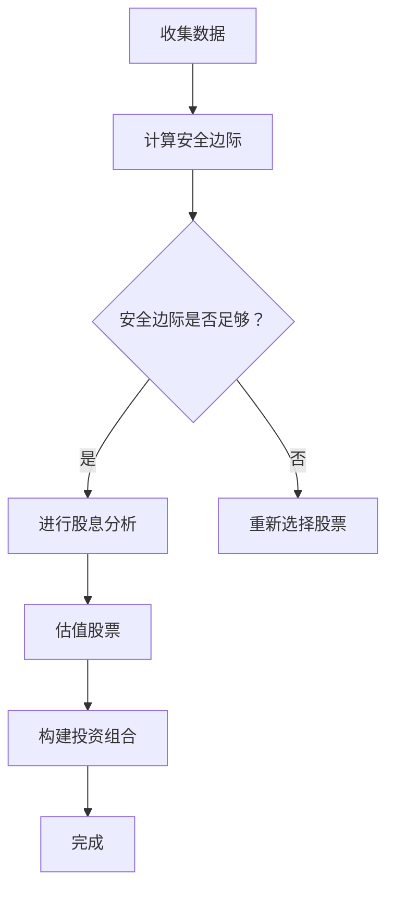

                 

### <sop>
## 让我们一步步思考：格雷厄姆的防御型投资者策略

在这一部分，我们将以逻辑清晰、结构紧凑的方式，一步一步深入探讨格雷厄姆的防御型投资者策略。我们的目标是理解这一策略的内在逻辑，并通过具体案例来验证其有效性。

### 3.1.1 算法简介

格雷厄姆的防御型投资者策略是一个系统性、基于价值投资的方法。以下是策略的核心步骤：

1. **数据收集**：首先，投资者需要收集关于潜在投资标的的大量数据，包括财务报表、市场表现、行业趋势等。
2. **安全边际计算**：根据格雷厄姆的理论，投资者应寻找那些市场价格低于其内在价值的股票。安全边际是市场价格与内在价值之间的差额，它为投资者提供了缓冲空间，以应对可能的股价波动。
3. **股息分析和估值**：投资者应分析股票的股息支付能力和稳定性，并通过适当的估值模型（如现金流折现模型）来确定股票的内在价值。
4. **组合构建**：选择多个符合上述条件的股票，构建一个多元化的投资组合，以分散风险。

### 3.1.2 算法流程图

让我们使用Mermaid语法来绘制算法的流程图：

### 3.1.3 算法原理

#### 数学模型和公式

防御型投资者策略的核心在于对股票的内在价值进行准确估值。以下是计算股票内在价值的数学模型：

$$
V = \frac{D_1}{r-g}
$$

其中，$V$是股票的内在价值，$D_1$是预期的第一年股息，$r$是投资者要求的回报率，$g$是股息增长率。

#### 详细讲解和举例说明

假设你正在考虑投资一家公司，它的预期第一年股息是$2$美元，投资者要求的回报率是$8\%$，而股息增长率是$4\%$。那么，这家公司的内在价值可以这样计算：

$$
V = \frac{2}{0.08-0.04} = \frac{2}{0.04} = 50
$$

这意味着，根据这个模型，这家公司的内在价值大约是$50$美元。如果市场价格低于这个数值，那么可能存在安全边际，投资者可以考虑购买。

#### 实际案例

假设有一只股票，它的市场价格是$45$美元，预期第一年股息是$2$美元，投资者要求的回报率是$8\%$，而股息增长率是$4\%$。我们可以计算其内在价值：

$$
V = \frac{2}{0.08-0.04} = \frac{2}{0.04} = 50
$$

由于市场价格$45$美元低于内在价值$50$美元，因此存在$5$美元的安全边际。在这种情况下，投资者可能会认为这是一个合理的投资机会。

### 3.1.4 策略的局限性和改进

防御型投资者策略虽然以安全性为核心，但它也有局限性。例如，它可能忽略了成长型股票的潜力，或者在高波动性市场中表现不佳。

为了改进这一策略，投资者可以：

1. **增加多种估值模型**：例如，使用股息折现模型（DDM）和自由现金流折现模型（DCF）来综合评估股票的价值。
2. **考虑市场波动**：在策略中引入对市场波动的考虑，例如使用波动率指数来调整安全边际。
3. **动态调整**：根据市场环境和公司表现动态调整投资组合，而不是固定持有股票。

通过这些改进，投资者可以在保持安全性的同时，进一步提高投资回报。

### 总结

格雷厄姆的防御型投资者策略是一个基于价值投资的方法，它强调投资的安全性、稳定性和内在价值。通过一步步的思考和实践，我们可以更好地理解和应用这一策略，为自己的投资组合带来更高的稳定性和潜在回报。

[sop]
接下来，我们将进入第三部分：数学模型和数学公式，对格雷厄姆的防御型投资者策略进行更深入的数学分析。我们将使用latex格式来展示关键的数学公式，并解释它们在实际投资决策中的应用。

