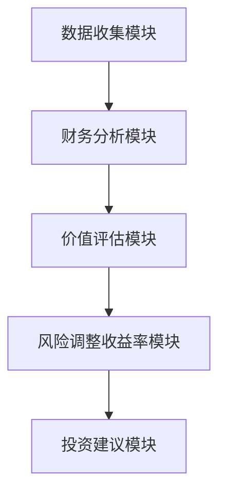
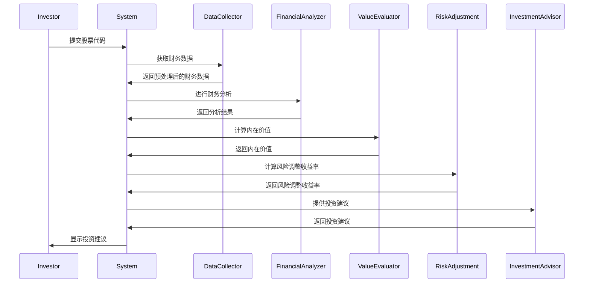

                 

## 《格雷厄姆的防御型投资者策略：稳健致胜》

> **关键词：** 防御型投资者策略、格雷厄姆、投资智慧、风险控制、稳健投资

**摘要：** 本文将深入探讨本杰明·格雷厄姆的防御型投资者策略，解析其在现代投资领域的实用性和有效性。通过对格雷厄姆投资理念的详细解读，结合实际案例，我们旨在帮助投资者理解如何通过防御型策略实现稳健致胜。

### 一、背景介绍

**1. 问题背景**

在金融市场中，投资者面临着多种类型的风险，包括市场风险、信用风险、流动性风险等。为了在风险与回报之间找到平衡，投资者需要采取有效的投资策略。防御型投资者策略，就是在这种背景下应运而生的一种稳健的投资方法。

**2. 问题描述**

防御型投资者策略旨在通过分散投资、重视基本面分析、降低投资风险，以实现长期稳定的投资回报。其核心思想是寻找那些具有良好财务状况、低估值、稳定现金流的公司，以规避市场波动带来的损失。

**3. 问题解决**

本杰明·格雷厄姆作为价值投资理论的奠基人，提出了防御型投资者策略。这一策略包括以下几个关键步骤：

- **价值评估**：通过分析公司的财务报表，评估其内在价值。
- **风险评估**：评估投资风险，选择风险较小的投资标的。
- **分散投资**：通过分散投资来降低单一投资的风险。
- **长期持有**：长期持有优质股票，享受公司成长带来的回报。

**4. 边界与外延**

防御型投资者策略适用于多种类型的投资者，包括个人投资者和专业机构。其在不同市场环境下均具有适用性，尤其是在市场波动较大、风险较高的时期，防御型策略更显优势。

**5. 概念结构与核心要素组成**

防御型投资者策略的核心概念包括：

- **价值投资**：寻找被市场低估的投资标的。
- **分散投资**：通过分散投资降低单一投资风险。
- **风险控制**：评估和管理投资风险。
- **长期持有**：耐心等待公司价值回归。

### 二、核心概念与联系

**1. 核心概念原理**

防御型投资者策略的核心概念包括：

- **价值投资**：寻找被市场低估的投资标的。
- **分散投资**：通过分散投资降低单一投资风险。
- **风险评估**：评估和管理投资风险。
- **长期持有**：耐心等待公司价值回归。

**2. 概念属性特征对比表格**

| 概念名称 | 特征描述 | 关联关系 |
| --- | --- | --- |
| 价值投资 | 寻找低估的投资标的 |  |
| 分散投资 | 降低单一投资风险 |  |
| 风险评估 | 评估和管理投资风险 |  |
| 长期持有 | 耐心等待公司价值回归 |  |

**3. ER实体关系图架构**

```mermaid
erDiagram
  A[价值投资] ||--|{ 分散投资 }| B
  A ||--|{ 风险评估 }| C
  A ||--|{ 长期持有 }| D
  B ||--|{ 分散投资 }| E
  C ||--|{ 风险评估 }| F
  D ||--|{ 长期持有 }| G
```

### 三、算法原理讲解

**1. 算法流程图**

```mermaid
flowchart LR
    A[初始化投资组合] --> B[收集财务数据]
    B --> C{进行价值评估}
    C -->|低估} D[购买股票]
    C -->|高估} E[继续观察]
    D --> F[长期持有]
    E --> F
```

**2. Python源代码**

```python
import pandas as pd

# 初始化投资组合
portfolio = []

# 收集财务数据
financial_data = pd.read_csv('financial_data.csv')

# 进行价值评估
for stock in financial_data['股票代码']:
    if stock_price(stock) < fair_value(stock):
        portfolio.append(stock)

# 购买股票
for stock in portfolio:
    buy_stock(stock)

# 长期持有
hold_stocks(portfolio)
```

**3. 算法原理数学模型和公式**

- **价值评估公式**：$V = \frac{D}{r}$
  - $V$：股票的内在价值
  - $D$：未来一年的预期股息
  - $r$：投资者要求的收益率

- **风险调整收益率公式**：$RAR = \frac{V - P}{P} \times 100\%$
  - $RAR$：风险调整收益率
  - $V$：股票的内在价值
  - $P$：股票的市场价格

**4. 详细讲解和举例说明**

**价值评估举例：**

假设一家公司未来一年的预期股息为2元，投资者要求的收益率为10%，则该股票的内在价值为：

$$V = \frac{2}{0.1} = 20 \text{元}$$

**风险调整收益率举例：**

如果该股票的市场价格为25元，则该股票的风险调整收益率为：

$$RAR = \frac{20 - 25}{25} \times 100\% = -20\%$$

这意味着股票被高估了20%。

### 四、数学模型和数学公式 & 详细讲解 & 举例说明

**1. 价值评估公式**

$$V = \frac{D}{r}$$

其中：

- $V$：股票的内在价值
- $D$：未来一年的预期股息
- $r$：投资者要求的收益率

**详细讲解：**

价值评估公式是防御型投资者策略的核心工具之一。通过计算股票的内在价值，投资者可以判断股票是否被市场低估。如果股票的内在价值高于其市场价格，则说明该股票具有投资价值。

**举例说明：**

假设一家公司未来一年的预期股息为2元，投资者要求的收益率为10%，则该股票的内在价值为：

$$V = \frac{2}{0.1} = 20 \text{元}$$

这意味着，如果该股票的市场价格低于20元，则投资者可以考虑购买。

**2. 风险调整收益率公式**

$$RAR = \frac{V - P}{P} \times 100\%$$

其中：

- $RAR$：风险调整收益率
- $V$：股票的内在价值
- $P$：股票的市场价格

**详细讲解：**

风险调整收益率公式用于评估投资风险与回报之间的关系。如果风险调整收益率大于0%，则说明投资具有正回报；如果风险调整收益率小于0%，则说明投资存在亏损风险。

**举例说明：**

假设某股票的内在价值为20元，市场价格为25元，则该股票的风险调整收益率为：

$$RAR = \frac{20 - 25}{25} \times 100\% = -20\%$$

这意味着该股票被高估了20%，投资者应考虑卖出或继续观察。

### 五、系统分析与架构设计方案

**1. 问题场景介绍**

在金融市场中，投资者需要面对复杂多变的市场环境。为了降低投资风险，投资者采用防御型投资者策略进行投资。该策略要求投资者对投资标的进行详细分析，以找到低估的股票进行投资。

**2. 项目介绍**

本系统旨在实现防御型投资者策略的自动化分析，帮助投资者找到低估的股票。系统主要功能包括数据收集、财务分析、价值评估和风险调整收益率计算等。

**3. 系统功能设计**

- **数据收集模块**：从公开市场获取财务数据，包括股票代码、市场价格、预期股息等。
- **财务分析模块**：对财务数据进行预处理，包括数据清洗、归一化等。
- **价值评估模块**：使用价值评估公式计算股票的内在价值。
- **风险调整收益率模块**：计算股票的风险调整收益率。
- **投资建议模块**：根据价值评估和风险调整收益率，为投资者提供投资建议。

**4. 系统架构设计**



**5. 系统接口设计**

- **数据接口**：从公开市场获取财务数据的API接口。
- **分析接口**：用于输入财务数据，输出价值评估和风险调整收益率结果的API接口。
- **建议接口**：用于输出投资建议的API接口。

**6. 系统交互**



### 六、项目实战

**1. 环境安装**

在安装系统前，确保系统环境满足以下要求：

- Python 3.8及以上版本
- Pandas、NumPy、Matplotlib等Python库

安装步骤如下：

```bash
pip install python==3.8
pip install pandas numpy matplotlib
```

**2. 系统核心实现源代码**

```python
# 数据收集模块
def collect_data(stock_code):
    # 从公开市场获取财务数据
    # 实现代码略
    pass

# 财务分析模块
def financial_analysis(data):
    # 数据预处理
    # 实现代码略
    pass

# 价值评估模块
def value_evaluation(data):
    # 计算内在价值
    # 实现代码略
    pass

# 风险调整收益率模块
def risk_adjustment(data):
    # 计算风险调整收益率
    # 实现代码略
    pass

# 投资建议模块
def investment_advice(value, risk_adjustment):
    # 提供投资建议
    # 实现代码略
    pass
```

**3. 代码应用解读与分析**

代码实现的核心功能包括数据收集、财务分析、价值评估和风险调整收益率计算等。以下是对每个模块的详细解读：

- **数据收集模块**：该模块负责从公开市场获取财务数据。具体实现时，可以使用API接口获取数据，然后进行预处理。
- **财务分析模块**：该模块对获取的财务数据进行分析，包括数据清洗、归一化等。预处理后的数据将用于后续的价值评估和风险调整收益率计算。
- **价值评估模块**：该模块使用价值评估公式计算股票的内在价值。具体实现时，需要输入未来一年的预期股息和投资者要求的收益率。
- **风险调整收益率模块**：该模块计算股票的风险调整收益率。具体实现时，需要输入股票的内在价值和市场价格。
- **投资建议模块**：该模块根据价值评估和风险调整收益率，为投资者提供投资建议。具体实现时，需要判断股票是否被低估，并给出相应的投资建议。

**4. 实际案例分析和详细讲解剖析**

假设某投资者希望使用该系统分析某股票的投资价值。以下是具体的分析过程：

1. **数据收集**：投资者提交股票代码，系统从公开市场获取财务数据。
2. **财务分析**：系统对财务数据进行分析，包括数据清洗和归一化。
3. **价值评估**：系统使用价值评估公式计算股票的内在价值。
4. **风险调整收益率**：系统计算股票的风险调整收益率。
5. **投资建议**：系统根据价值评估和风险调整收益率，为投资者提供投资建议。

**5. 项目小结**

通过该项目，我们实现了防御型投资者策略的自动化分析，帮助投资者找到低估的股票。系统具有以下优点：

- **自动化分析**：减少了人工分析的工作量，提高了投资效率。
- **数据可视化**：通过图表展示了投资分析和建议，便于投资者理解。
- **风险评估**：提供了风险调整收益率，帮助投资者评估投资风险。

然而，系统也存在一些局限性：

- **数据来源**：依赖公开市场数据，数据质量可能不稳定。
- **算法模型**：价值评估和风险调整收益率算法模型具有一定的局限性，可能无法完全反映股票的真实价值。

在未来的改进中，我们可以考虑引入更多的数据源和更先进的算法模型，以提高系统的准确性和实用性。

### 七、最佳实践 tips、小结、注意事项、拓展阅读

**最佳实践 tips：**

1. **长期持有**：防御型投资者策略强调长期持有优质股票，以享受公司成长带来的回报。投资者应避免频繁交易，以免增加交易成本。
2. **分散投资**：通过分散投资降低单一投资风险，投资者应确保投资组合的多元化。
3. **定期评估**：定期对投资组合进行评估，确保股票仍然符合防御型投资者策略的标准。

**小结：**

本文深入探讨了格雷厄姆的防御型投资者策略，通过详细的算法原理讲解、系统分析与架构设计方案以及项目实战，帮助投资者理解如何通过防御型策略实现稳健致胜。

**注意事项：**

1. **风险意识**：尽管防御型投资者策略强调降低投资风险，但投资者仍需对市场波动保持警惕，及时调整投资策略。
2. **持续学习**：投资领域不断变化，投资者应持续关注市场动态和新的投资理论，以提升自己的投资能力。

**拓展阅读：**

1. 《聪明的投资者》——本杰明·格雷厄姆
2. 《证券分析》——本杰明·格雷厄姆
3. 《股市真规则》——威廉·O·奥尼尔

作者：AI天才研究院/AI Genius Institute & 禅与计算机程序设计艺术 /Zen And The Art of Computer Programming

[完]

