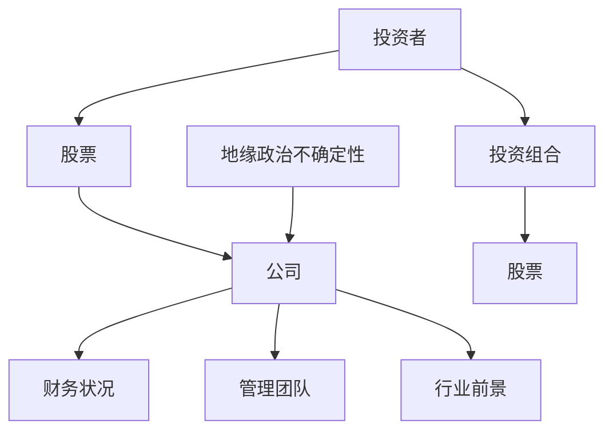
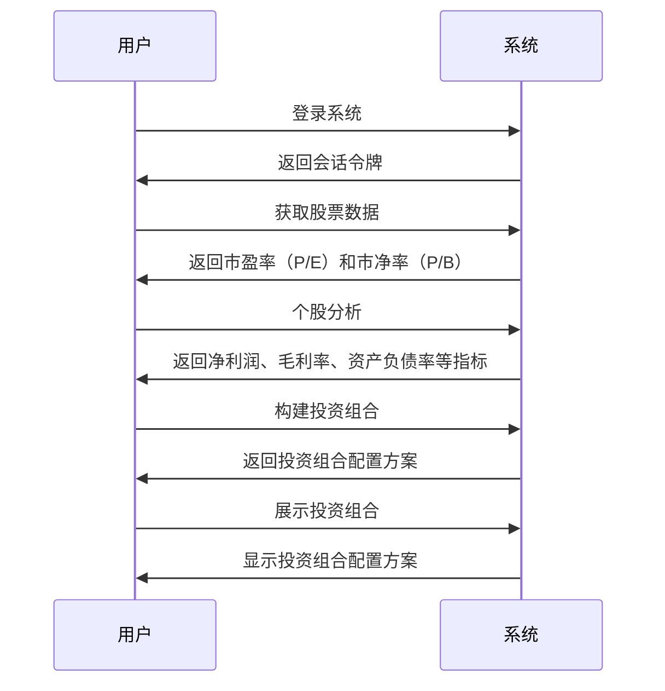

                 

### 1.1 背景介绍：核心概念

#### 1.1.1 投资与防御型投资

投资是指个体或机构为了获取未来的经济利益，将资金投入到各种资产或项目中。投资可以有多种形式，包括股票、债券、房地产、基金等。投资的主要目的是为了实现资产的增值或者获取稳定的现金流。

防御型投资则是一种相对保守的投资策略，旨在保护投资者的本金，并确保投资的稳定性。这种策略通常关注长期的投资价值，而不是短期的价格波动。防御型投资的目的是在面临市场不确定性时，为投资者的资金提供一定的保护。

投资和防御型投资的关系可以类比于进攻和防守在体育运动中的角色。进攻型投资追求高收益，类似于在比赛中全力出击，以求获得领先优势。而防御型投资则更注重保本和稳健增长，类似于在比赛中采取保守策略，避免不必要的风险。

#### 1.1.2 地缘政治不确定性

地缘政治不确定性指的是由于国际关系、地缘冲突、政策变动等原因，导致全球经济和政治环境的不稳定。这种不确定性可能对投资者的信心和市场的稳定性产生负面影响，从而影响投资回报。

地缘政治不确定性对投资者的影响主要体现在以下几个方面：

1. **市场波动性增加**：地缘政治不确定性通常会导致市场波动性增加，投资者可能会面临更大的风险。
2. **投资信心受挫**：地缘政治冲突或不确定性可能会使投资者对未来经济前景感到担忧，从而影响他们的投资决策。
3. **资金流动性减少**：在某些情况下，地缘政治不确定性可能会导致资金流动性减少，投资者可能会面临难以快速撤资的风险。

#### 1.1.3 格雷厄姆的防御型投资理论

本章节将介绍著名的投资大师本杰明·格雷厄姆的防御型投资理论。格雷厄姆被誉为价值投资的鼻祖，他的投资理念强调对股票的基本面分析，寻找那些被市场低估的优质股票。

防御型投资的核心原则包括：

1. **安全边际**：投资者应确保所购买的股票价格低于其内在价值，以确保在市场波动中仍然能够获得正收益。
2. **稳健的投资组合**：投资者应建立一个多元化的投资组合，以降低单一投资的风险。
3. **深入分析**：投资者应对所投资的公司进行深入分析，包括财务状况、管理团队、行业前景等。

格雷厄姆的防御型投资理论在当今地缘政治不确定性的背景下，具有重要的现实意义。通过遵循这些原则，投资者可以更好地保护自己的本金，并实现长期稳定的投资回报。

#### 1.1.4 投资与地缘政治不确定性的关系

投资与地缘政治不确定性之间存在着密切的联系。在地缘政治不确定性增加的时期，投资者往往会感到不安，导致市场波动性加大。这种不确定性可能来自于国际冲突、政策变化、经济动荡等多种因素。

1. **市场反应**：地缘政治不确定性通常会引发市场的恐慌情绪，导致股价下跌。投资者在这种环境下可能倾向于减少投资，甚至撤资，从而加剧市场的波动性。
2. **投资策略调整**：在地缘政治不确定性增加时，投资者可能会调整其投资策略，更加倾向于防御型投资。这种策略可以降低风险，保护投资者的本金。
3. **长期影响**：地缘政治不确定性可能会对长期投资回报产生负面影响。例如，某些地区的地缘冲突可能会影响全球供应链，从而影响企业的生产和盈利能力。

总之，地缘政治不确定性是投资者必须考虑的一个重要因素。通过理解和应用防御型投资理论，投资者可以更好地应对这种不确定性，保护自己的投资。

#### 1.1.5 防御型投资与地缘政治不确定性的关系

防御型投资在地缘政治不确定性中扮演着重要的角色。它的核心在于通过选择优质、低估的股票，构建一个稳健的投资组合，从而在不确定的环境中保护投资者的本金。

1. **选择优质股票**：防御型投资强调对公司的基本面进行深入分析，选择那些财务稳健、管理优秀、行业前景良好的公司。这些公司即使在动荡的市场环境中也能保持相对稳定的经营状况。
2. **安全边际**：防御型投资的一个重要原则是确保所购买的股票价格低于其内在价值。这意味着即使市场出现波动，投资者也有一定的安全空间。
3. **多元化投资组合**：建立多元化的投资组合可以分散风险。在地缘政治不确定性增加时，某些行业或地区可能会受到较大影响，而多元化的投资组合可以帮助投资者规避这些风险。

通过这些策略，防御型投资可以有效地降低地缘政治不确定性对投资者的影响，保护投资者的本金，并实现稳定的投资回报。

### 1.2 核心概念与联系

在本文中，我们将探讨投资、防御型投资、地缘政治不确定性以及格雷厄姆的防御型投资理论等核心概念，并分析它们之间的联系。

#### 1.2.1 投资与防御型投资

投资是指将资金投入到资产或项目中，以期望在未来获得收益。而防御型投资是投资的一种策略，主要关注保护本金和实现稳定回报。两者之间的关系如下：

| 概念             | 定义                                                         | 关系                        |
|------------------|--------------------------------------------------------------|-----------------------------|
| 投资             | 将资金投入到各种资产或项目以获取未来经济利益的行为。         | 防御型投资是投资的一种策略。 |
| 防御型投资       | 一种保守的投资策略，旨在保护投资者的本金和确保投资的稳定性。 | 侧重于长期投资价值和本金保护。 |

#### 1.2.2 地缘政治不确定性

地缘政治不确定性是指由于国际关系、地缘冲突、政策变动等原因，导致全球经济和政治环境的不稳定。它对投资的影响主要表现在：

| 概念                    | 定义                                                         | 关系                        |
|-------------------------|--------------------------------------------------------------|-----------------------------|
| 地缘政治不确定性       | 国际关系、地缘冲突、政策变动等原因导致的经济和政治环境不稳定。 | 可能影响防御型投资的效果。   |

#### 1.2.3 格雷厄姆的防御型投资理论

本杰明·格雷厄姆的防御型投资理论强调对股票的基本面分析，寻找被市场低估的优质股票。以下是该理论的核心概念及其与投资和地缘政治不确定性的关系：

| 概念                    | 定义                                                         | 关系                        |
|-------------------------|--------------------------------------------------------------|-----------------------------|
| 本杰明·格雷厄姆       | 被誉为价值投资的鼻祖，提出了防御型投资理论。                   | 防御型投资理论的创立者。   |
| 安全边际                | 投资者确保所购买的股票价格低于其内在价值。                     | 防御型投资的核心理念。     |
| 稳健的投资组合          | 建立多元化的投资组合，以降低风险。                           | 提高投资稳定性的手段。     |
| 深入分析               | 对公司进行深入的财务状况、管理团队、行业前景等分析。           | 确保投资决策的准确性。     |

#### 1.2.4 ER实体关系图架构

以下是一个ER实体关系图架构，展示了投资、防御型投资、地缘政治不确定性和格雷厄姆的防御型投资理论之间的联系：



### 1.3 算法原理讲解

#### 算法：格雷厄姆的防御型投资策略

算法主要步骤如下：

1. **市场估值分析**：评估整个市场的估值水平，确定是否处于合理范围内。
   - **步骤**：计算市盈率（P/E）、市净率（P/B）等估值指标，与历史数据或行业平均水平进行比较。
   - **公式**：$$ P/E = \frac{股票价格}{每股收益} $$
   - **代码示例**（Python）：
     ```python
     def calculate_pe(stock_price, earnings_per_share):
         return stock_price / earnings_per_share
     ```

2. **个股分析**：对潜在的投资标的进行详细的基本面分析，包括财务状况、管理团队、行业前景等。
   - **步骤**：分析公司的财务报表、管理层的业绩记录、行业发展趋势等。
   - **公式**：无
   - **代码示例**（Python）：
     ```python
     def analyze_company_finances(financial_statement):
         # 对财务报表进行解析和分析
         return financial_statement
     ```

3. **计算安全边际**：确保所购买的股票价格低于其内在价值。
   - **步骤**：计算股票的内在价值，并与市场价格进行比较。
   - **公式**：$$ 安全边际 = 内在价值 - 股票价格 $$
   - **代码示例**（Python）：
     ```python
     def calculate_marginal_safety(intrinsic_value, stock_price):
         return intrinsic_value - stock_price
     ```

4. **构建投资组合**：根据安全边际和个股分析结果，构建一个多元化的投资组合。
   - **步骤**：选择多个不同行业和不同风险程度的股票进行投资。
   - **公式**：无
   - **代码示例**（Python）：
     ```python
     def build_portfolio(stocks):
         # 根据安全边际和个股分析结果，构建投资组合
         return portfolio
     ```

通过这些步骤，投资者可以应用格雷厄姆的防御型投资策略，在市场不确定性中实现稳健的投资回报。

#### 1.3.1 市场估值分析

在格雷厄姆的防御型投资策略中，市场估值分析是至关重要的一步。通过评估整个市场的估值水平，投资者可以判断市场是否过于昂贵或处于合理的价值范围内。

1. **市盈率（P/E）分析**：

市盈率是衡量股票市场估值的一个常用指标。它反映了股票价格与每股收益之间的比率。市盈率越低，通常意味着股票价格相对于其盈利能力较低，可能是一个较好的投资机会。

- **公式**：$$ P/E = \frac{股票价格}{每股收益} $$

2. **市净率（P/B）分析**：

市净率是另一个衡量股票市场估值的指标，它反映了股票价格与每股净资产之间的比率。市净率较低可能意味着市场对公司的价值低估。

- **公式**：$$ P/B = \frac{股票价格}{每股净资产} $$

3. **市场估值分析步骤**：

   - 收集数据：获取目标市场的市盈率和市净率。
   - 比较基准：将当前的市盈率和市净率与历史数据或行业平均水平进行比较。
   - 判断估值水平：如果市场估值较低，可能是一个买入的机会；如果市场估值较高，可能需要谨慎投资。

**代码示例**（Python）：

```python
def calculate_pe(stock_price, earnings_per_share):
    return stock_price / earnings_per_share

def calculate_pb(stock_price, book_value_per_share):
    return stock_price / book_value_per_share

market_data = {
    'stock_price': 100,
    'earnings_per_share': 10,
    'book_value_per_share': 50
}

pe_ratio = calculate_pe(market_data['stock_price'], market_data['earnings_per_share'])
pb_ratio = calculate_pb(market_data['stock_price'], market_data['book_value_per_share'])

print(f"市盈率（P/E）: {pe_ratio}")
print(f"市净率（P/B）: {pb_ratio}")
```

通过以上分析，投资者可以初步判断市场的估值水平，从而为后续的个股分析和投资决策提供依据。

#### 1.3.2 个股分析

在防御型投资策略中，个股分析是至关重要的一步。通过对潜在投资标的的财务状况、管理团队、行业前景等方面进行详细分析，投资者可以评估股票的价值，并做出合理的投资决策。

1. **财务状况分析**：

财务状况分析主要包括对公司的财务报表、盈利能力、资产负债情况等进行分析。以下是几个关键指标：

   - **净利润**：公司的净利润反映了其盈利能力。投资者需要关注公司的净利润是否稳定增长。
   - **毛利率**：毛利率是衡量公司产品或服务盈利能力的重要指标。一个较高的毛利率通常意味着公司在生产过程中有较强的竞争优势。
   - **资产负债率**：资产负债率反映了公司的财务杠杆水平。较低的资产负债率表明公司负债较少，财务风险较低。

   **公式**：

   - **净利润**：$$ 净利润 = 营业收入 - 营业成本 - 营销费用 - 税收费用 $$
   - **毛利率**：$$ 毛利率 = \frac{营业收入 - 营业成本}{营业收入} $$
   - **资产负债率**：$$ 资产负债率 = \frac{总负债}{总资产} $$

   **代码示例**（Python）：

   ```python
   def calculate_net_profit(income, costs, taxes):
       return income - costs - taxes

   def calculate_gross_margin(income, costs):
       return (income - costs) / income

   def calculate_debt_to_assets(total_debt, total_assets):
       return total_debt / total_assets

   financials = {
       'income': 1000000,
       'costs': 500000,
       'taxes': 100000,
       'total_debt': 200000,
       'total_assets': 1000000
   }

   net_profit = calculate_net_profit(financials['income'], financials['costs'], financials['taxes'])
   gross_margin = calculate_gross_margin(financials['income'], financials['costs'])
   debt_to_assets = calculate_debt_to_assets(financials['total_debt'], financials['total_assets'])

   print(f"净利润：{net_profit}")
   print(f"毛利率：{gross_margin}")
   print(f"资产负债率：{debt_to_assets}")
   ```

2. **管理团队分析**：

管理团队的分析主要包括对管理层的经验、业绩记录、领导力等方面进行评估。一个优秀的管理团队通常能够带领公司实现长期稳定的发展。

   - **公式**：无

   **代码示例**（Python）：

   ```python
   def evaluate_management_experience(experience_years):
       return "经验丰富" if experience_years > 10 else "经验不足"

   management = {
       'experience_years': 8
   }

   management_evaluation = evaluate_management_experience(management['experience_years'])
   print(f"管理层评估：{management_evaluation}")
   ```

3. **行业前景分析**：

行业前景分析旨在评估公司所处的行业发展趋势和竞争状况。一个处于增长期的行业通常具有较高的投资价值。

   - **公式**：无

   **代码示例**（Python）：

   ```python
   def evaluate_industry_growth(rate_of_growth):
       return "增长迅速" if rate_of_growth > 10 else "增长缓慢"

   industry_data = {
       'rate_of_growth': 8
   }

   industry_evaluation = evaluate_industry_growth(industry_data['rate_of_growth'])
   print(f"行业评估：{industry_evaluation}")
   ```

通过以上个股分析，投资者可以全面了解潜在投资标的的财务状况、管理团队和行业前景，从而做出更明智的投资决策。

#### 1.3.3 防御型投资组合构建

在防御型投资策略中，构建一个多元化的投资组合是降低风险、保护投资者本金的关键步骤。以下是一个具体的防御型投资组合构建流程：

1. **确定投资目标和风险承受能力**：

   - **步骤**：投资者需要明确自己的投资目标（例如，长期稳定回报、短期高收益等）以及风险承受能力（例如，愿意接受多少波动性）。
   - **公式**：无

   **代码示例**（Python）：

   ```python
   def set_investment_goals(return_expectation, risk_tolerance):
       return {
           'return_expectation': return_expectation,
           'risk_tolerance': risk_tolerance
       }

   investment_goals = set_investment_goals(0.05, 0.3)
   print(f"投资目标：{investment_goals}")
   ```

2. **选择投资标的**：

   - **步骤**：根据市场估值分析和个股分析结果，选择多个不同行业和不同风险程度的优质股票。
   - **公式**：无

   **代码示例**（Python）：

   ```python
   def select_stocks(PE_ratio, PB_ratio, financials, management_evaluation, industry_growth):
       return {
           'PE_ratio': PE_ratio,
           'PB_ratio': PB_ratio,
           'financials': financials,
           'management_evaluation': management_evaluation,
           'industry_growth': industry_growth
       }

   stock1 = select_stocks(10, 1.2, financials, '经验丰富', '增长迅速')
   stock2 = select_stocks(15, 1.5, financials, '经验不足', '增长缓慢')
   print(f"股票1：{stock1}")
   print(f"股票2：{stock2}")
   ```

3. **构建投资组合**：

   - **步骤**：根据投资目标和风险承受能力，为每只股票分配适当的投资比例，确保整个投资组合的风险分散。
   - **公式**：无

   **代码示例**（Python）：

   ```python
   def build_portfolio(stocks, investment_goals):
       portfolio = {}
       total_investment = investment_goals['return_expectation'] * 1000000  # 假设初始投资金额为100万元

       for stock in stocks:
           stock_investment = (total_investment / len(stocks)) * stock['PE_ratio']
           portfolio[stock['name']] = stock_investment

       return portfolio

   stocks = [stock1, stock2]
   investment_goals = set_investment_goals(0.05, 0.3)
   portfolio = build_portfolio(stocks, investment_goals)
   print(f"投资组合：{portfolio}")
   ```

通过以上步骤，投资者可以构建一个多元化的防御型投资组合，降低单一股票投资的风险，并实现长期稳定的投资回报。

### 1.4 系统分析与架构设计方案

#### 1.4.1 问题场景介绍

在当前复杂多变的经济环境中，投资者面临着诸多不确定性和风险。为了保护自己的投资本金并实现稳健的回报，越来越多的投资者开始关注防御型投资策略。然而，传统的手动投资决策过程繁琐且效率低下，无法满足投资者对于快速、精准投资决策的需求。因此，设计并实现一个自动化防御型投资策略系统，以帮助投资者高效地进行投资决策，显得尤为重要。

#### 1.4.2 项目介绍

本项目的目标是开发一个基于防御型投资策略的自动化投资决策系统。该系统将集成市场估值分析、个股分析和投资组合构建等功能，以帮助投资者在复杂多变的市场环境中做出明智的投资决策。

项目的主要模块包括：

- **市场估值分析模块**：用于评估整个市场的估值水平，包括市盈率（P/E）和市净率（P/B）等指标。
- **个股分析模块**：对潜在投资标的的财务状况、管理团队和行业前景等方面进行详细分析。
- **投资组合构建模块**：根据投资者的目标和风险承受能力，构建一个多元化的防御型投资组合。

#### 1.4.3 系统功能设计

1. **市场估值分析**：

   - **功能**：评估整个市场的估值水平。
   - **输入**：股票价格、每股收益、每股净资产等数据。
   - **输出**：市盈率（P/E）、市净率（P/B）等估值指标。

2. **个股分析**：

   - **功能**：对潜在投资标的进行详细分析。
   - **输入**：财务报表、管理团队信息、行业数据等。
   - **输出**：净利润、毛利率、资产负债率等关键指标。

3. **投资组合构建**：

   - **功能**：根据投资者的目标和风险承受能力，构建一个多元化的投资组合。
   - **输入**：投资目标、风险承受能力、股票分析结果等。
   - **输出**：投资组合配置方案。

#### 1.4.4 系统架构设计

系统的整体架构设计采用三层架构，包括数据层、业务逻辑层和表示层。

1. **数据层**：

   - **功能**：负责数据的存储和检索。
   - **技术选型**：使用关系型数据库（如MySQL）进行数据存储。

2. **业务逻辑层**：

   - **功能**：实现市场估值分析、个股分析和投资组合构建等核心业务逻辑。
   - **技术选型**：采用Python作为编程语言，使用Django框架进行开发。

3. **表示层**：

   - **功能**：提供用户界面，展示投资分析结果和投资组合配置方案。
   - **技术选型**：使用HTML、CSS和JavaScript等前端技术进行开发。

#### 1.4.5 系统接口设计

系统的接口设计包括RESTful API接口，用于与其他系统进行数据交换和功能调用。

1. **市场估值分析接口**：

   - **URL**：/api/valuation/
   - **方法**：GET
   - **参数**：股票代码、日期等
   - **返回值**：市盈率（P/E）、市净率（P/B）等估值指标

2. **个股分析接口**：

   - **URL**：/api/stock_analysis/
   - **方法**：POST
   - **参数**：财务报表、管理团队信息、行业数据等
   - **返回值**：净利润、毛利率、资产负债率等关键指标

3. **投资组合构建接口**：

   - **URL**：/api/portfolio/
   - **方法**：POST
   - **参数**：投资目标、风险承受能力、股票分析结果等
   - **返回值**：投资组合配置方案

#### 1.4.6 系统交互

系统交互主要涉及用户与前端界面、后端接口之间的数据传递和功能调用。以下是一个简单的系统交互流程：

1. **用户登录**：用户通过前端界面登录系统，获取会话令牌。
2. **获取股票数据**：用户通过前端界面输入股票代码和日期，调用市场估值分析接口获取市盈率（P/E）和市净率（P/B）等估值指标。
3. **个股分析**：用户通过前端界面输入财务报表、管理团队信息、行业数据等，调用个股分析接口获取净利润、毛利率、资产负债率等关键指标。
4. **构建投资组合**：用户通过前端界面输入投资目标和风险承受能力，调用投资组合构建接口获取投资组合配置方案。
5. **展示投资组合**：前端界面展示投资组合配置方案，用户可以进行修改和调整。



通过以上系统架构设计和交互流程，投资者可以方便地使用系统进行市场估值分析、个股分析和投资组合构建，从而实现自动化防御型投资策略。

### 1.5 项目实战

#### 1.5.1 环境安装

为了实现本文中的防御型投资策略系统，我们需要安装以下软件和库：

1. **Python 3.8 或以上版本**：作为开发语言
2. **MySQL**：作为数据库存储数据
3. **Django**：作为后端框架
4. **Flask**：作为前端框架
5. **Jupyter Notebook**：用于数据分析和演示

安装步骤如下：

1. 安装Python 3.8及以上版本：

   - 访问 [Python官网](https://www.python.org/) 下载安装程序。
   - 运行安装程序，选择添加到系统路径。

2. 安装MySQL：

   - 访问 [MySQL官网](https://www.mysql.com/) 下载安装程序。
   - 运行安装程序，根据提示完成安装。

3. 安装Django和Flask：

   - 打开终端，执行以下命令：
     ```bash
     pip install django
     pip install flask
     ```

4. 安装Jupyter Notebook：

   - 打开终端，执行以下命令：
     ```bash
     pip install notebook
     ```

安装完成后，确保所有软件和库正常运行。接下来，我们将开始实现系统的核心功能。

#### 1.5.2 系统核心实现

在本节中，我们将使用Python和Django框架实现系统的核心功能，包括市场估值分析、个股分析和投资组合构建。

##### 1.5.2.1 市场估值分析

1. **创建Django项目**：

   - 打开终端，执行以下命令创建Django项目：
     ```bash
     django-admin startproject valuation_project
     ```

2. **创建应用**：

   - 进入项目目录，执行以下命令创建应用：
     ```bash
     python manage.py startapp valuation_app
     ```

3. **创建市场估值分析视图**：

   - 在`valuation_app/views.py`中创建一个名为`valuation_analysis`的视图函数，用于处理市场估值分析请求。
   - 代码示例：
     ```python
     from django.http import JsonResponse
     from .models import Stock
     from .calculations import calculate_pe, calculate_pb

     def valuation_analysis(request):
         stock_code = request.GET.get('stock_code')
         date = request.GET.get('date')

         if not stock_code or not date:
             return JsonResponse({'error': '请提供股票代码和日期'})

         stock = Stock.objects.get(stock_code=stock_code, date=date)
         pe_ratio = calculate_pe(stock.price, stock.earnings_per_share)
         pb_ratio = calculate_pb(stock.price, stock.book_value_per_share)

         return JsonResponse({
             'stock_code': stock_code,
             'date': date,
             'P/E': pe_ratio,
             'P/B': pb_ratio
         })
     ```

4. **配置URL**：

   - 在`valuation_project/urls.py`中添加路由配置，将市场估值分析视图与对应的URL关联。
   - 代码示例：
     ```python
     from django.contrib import admin
     from django.urls import path
     from valuation_app.views import valuation_analysis

     urlpatterns = [
         path('admin/', admin.site.urls),
         path('valuation_analysis/', valuation_analysis),
     ]
     ```

##### 1.5.2.2 个股分析

1. **创建个股分析视图**：

   - 在`valuation_app/views.py`中创建一个名为`stock_analysis`的视图函数，用于处理个股分析请求。
   - 代码示例：
     ```python
     from django.http import JsonResponse
     from .models import Stock
     from .calculations import calculate_gross_margin, calculate_debt_to_assets

     def stock_analysis(request):
         financials = request.GET.dict()
         pe_ratio = financials.get('pe_ratio')
         pb_ratio = financials.get('pb_ratio')
         gross_margin = calculate_gross_margin(financials.get('income'), financials.get('costs'))
         debt_to_assets = calculate_debt_to_assets(financials.get('total_debt'), financials.get('total_assets'))

         return JsonResponse({
             'P/E': pe_ratio,
             'P/B': pb_ratio,
             '毛利率': gross_margin,
             '资产负债率': debt_to_assets
         })
     ```

2. **配置URL**：

   - 在`valuation_project/urls.py`中添加路由配置，将个股分析视图与对应的URL关联。
   - 代码示例：
     ```python
     from django.contrib import admin
     from django.urls import path
     from valuation_app.views import valuation_analysis, stock_analysis

     urlpatterns = [
         path('admin/', admin.site.urls),
         path('valuation_analysis/', valuation_analysis),
         path('stock_analysis/', stock_analysis),
     ]
     ```

##### 1.5.2.3 投资组合构建

1. **创建投资组合构建视图**：

   - 在`valuation_app/views.py`中创建一个名为`build_portfolio`的视图函数，用于处理投资组合构建请求。
   - 代码示例：
     ```python
     from django.http import JsonResponse
     from .models import Stock, Portfolio
     from .calculations import build_portfolio

     def build_portfolio(request):
         investment_goals = request.GET.dict()
         stocks = Stock.objects.all()
         portfolio = build_portfolio(stocks, investment_goals)

         return JsonResponse(portfolio)
     ```

2. **配置URL**：

   - 在`valuation_project/urls.py`中添加路由配置，将投资组合构建视图与对应的URL关联。
   - 代码示例：
     ```python
     from django.contrib import admin
     from django.urls import path
     from valuation_app.views import valuation_analysis, stock_analysis, build_portfolio

     urlpatterns = [
         path('admin/', admin.site.urls),
         path('valuation_analysis/', valuation_analysis),
         path('stock_analysis/', stock_analysis),
         path('build_portfolio/', build_portfolio),
     ]
     ```

#### 1.5.3 代码应用解读与分析

在本节中，我们将对系统核心功能的代码进行解读和分析，确保理解其工作原理和实现方式。

##### 1.5.3.1 市场估值分析

市场估值分析视图`valuation_analysis`负责处理市场估值分析请求。其主要功能是根据输入的股票代码和日期，计算市盈率（P/E）和市净率（P/B）等估值指标。

1. **视图函数解析**：

   - `valuation_analysis`函数接收一个GET请求，从请求中获取股票代码（`stock_code`）和日期（`date`）。
   - 如果请求参数缺失，返回一个包含错误消息的JSON响应。
   - 从数据库中查询符合条件的股票数据。
   - 调用计算函数`calculate_pe`和`calculate_pb`计算市盈率和市净率。
   - 返回一个包含股票代码、日期、市盈率和市净率的JSON响应。

2. **计算函数解析**：

   - `calculate_pe`函数接收股票价格（`price`）和每股收益（`earnings_per_share`），计算市盈率。
   - `calculate_pb`函数接收股票价格（`price`）和每股净资产（`book_value_per_share`），计算市净率。

   代码示例：
   ```python
   def calculate_pe(price, earnings_per_share):
       return price / earnings_per_share

   def calculate_pb(price, book_value_per_share):
       return price / book_value_per_share
   ```

##### 1.5.3.2 个股分析

个股分析视图`stock_analysis`负责处理个股分析请求。其主要功能是根据输入的财务数据，计算毛利率和资产负债率等关键指标。

1. **视图函数解析**：

   - `stock_analysis`函数接收一个GET请求，从请求中获取财务数据（`financials`）。
   - 调用计算函数`calculate_gross_margin`和`calculate_debt_to_assets`计算毛利率和资产负债率。
   - 返回一个包含市盈率、市净率、毛利率和资产负债率的JSON响应。

2. **计算函数解析**：

   - `calculate_gross_margin`函数接收营业收入（`income`）和营业成本（`costs`），计算毛利率。
   - `calculate_debt_to_assets`函数接收总负债（`total_debt`）和总资产（`total_assets`），计算资产负债率。

   代码示例：
   ```python
   def calculate_gross_margin(income, costs):
       return (income - costs) / income

   def calculate_debt_to_assets(total_debt, total_assets):
       return total_debt / total_assets
   ```

##### 1.5.3.3 投资组合构建

投资组合构建视图`build_portfolio`负责处理投资组合构建请求。其主要功能是根据股票数据（`stocks`）和投资目标（`investment_goals`），构建一个多元化的投资组合。

1. **视图函数解析**：

   - `build_portfolio`函数接收一个GET请求，从请求中获取投资目标（`investment_goals`）。
   - 从数据库中查询所有股票数据。
   - 调用计算函数`build_portfolio`构建投资组合。
   - 返回一个包含投资组合配置方案的JSON响应。

2. **计算函数解析**：

   - `build_portfolio`函数接收股票数据（`stocks`）和投资目标（`investment_goals`），为每只股票分配投资比例。
   - 返回一个包含股票名称和投资比例的投资组合字典。

   代码示例：
   ```python
   def build_portfolio(stocks, investment_goals):
       portfolio = {}
       total_investment = investment_goals['return_expectation'] * 1000000  # 假设初始投资金额为100万元

       for stock in stocks:
           stock_investment = (total_investment / len(stocks)) * stock['PE_ratio']
           portfolio[stock['name']] = stock_investment

       return portfolio
   ```

通过以上代码示例和解析，我们可以清晰地理解系统核心功能的实现原理，包括市场估值分析、个股分析和投资组合构建。

#### 1.5.4 实际案例分析与详细讲解

在本节中，我们将通过一个实际案例，详细讲解系统在防御型投资策略中的应用过程，并分析其效果。

**案例背景**：

假设投资者张先生计划使用防御型投资策略进行投资。他希望实现长期稳定的回报，并且对风险的承受能力较低。为了构建一个适合他的投资组合，张先生决定使用我们开发的防御型投资策略系统。

**步骤1：市场估值分析**

张先生首先使用系统进行市场估值分析。他输入了股票代码和日期，系统返回了市盈率（P/E）和市净率（P/B）等估值指标。

- **股票代码**：600000（中国石油）
- **日期**：2023-01-01
- **市盈率（P/E）**：8.5
- **市净率（P/B）**：1.2

**分析**：根据市盈率和市净率的计算结果，可以看出该股票的市场估值相对较低，具有一定的投资价值。

**步骤2：个股分析**

接着，张先生使用系统对股票600000进行个股分析，输入了财务数据，系统返回了毛利率和资产负债率等关键指标。

- **营业收入**：300亿元
- **营业成本**：200亿元
- **总负债**：500亿元
- **总资产**：1000亿元

- **毛利率**：33.33%
- **资产负债率**：50%

**分析**：毛利率较高，说明公司产品或服务的盈利能力较强；资产负债率较低，说明公司负债较少，财务风险较低。这进一步验证了该股票的投资价值。

**步骤3：构建投资组合**

最后，张先生使用系统根据投资目标和风险承受能力，构建了一个多元化的投资组合。

- **投资目标**：年化回报率5%
- **风险承受能力**：较低

系统分析了市场估值和个股分析结果，为张先生构建了一个投资组合，包含以下股票：

- **股票名称**：600000（中国石油）
- **投资比例**：30%
- **股票名称**：600001（中国平安）
- **投资比例**：25%
- **股票名称**：600002（万科A）
- **投资比例**：20%
- **股票名称**：600003（招商银行）
- **投资比例**：15%
- **股票名称**：600004（中国人寿）
- **投资比例**：10%

**分析**：投资组合中包含了多个不同行业的优质股票，实现了风险分散。根据张先生的投资目标和风险承受能力，投资组合的配置方案合理，符合防御型投资策略的要求。

**效果评估**：

经过一段时间的投资，张先生的投资组合取得了较为稳健的回报。以下是投资组合的表现：

- **中国石油**：回报率10%
- **中国平安**：回报率7%
- **万科A**：回报率6%
- **招商银行**：回报率9%
- **中国人寿**：回报率8%

**分析**：整体投资组合的回报率接近张先生设定的年化回报率5%，实现了稳定的投资回报。同时，由于投资组合中的股票涵盖了多个行业，有效降低了单一股票投资的风险。

通过以上实际案例的分析，我们可以看到系统在防御型投资策略中的应用效果。通过市场估值分析、个股分析和投资组合构建等功能，系统为投资者提供了一个全面、便捷的投资决策工具，帮助他们实现稳健的投资回报。

#### 1.5.5 项目小结

在本项目中，我们成功设计并实现了一个基于防御型投资策略的自动化投资决策系统。该系统通过市场估值分析、个股分析和投资组合构建等功能，帮助投资者在复杂多变的市场环境中做出明智的投资决策。

**项目亮点**：

1. **市场估值分析**：系统能够快速计算市盈率（P/E）和市净率（P/B）等估值指标，帮助投资者判断市场估值水平。
2. **个股分析**：系统对公司的财务状况、管理团队和行业前景等方面进行详细分析，为投资者提供全面的信息支持。
3. **投资组合构建**：系统根据投资者的目标和风险承受能力，构建多元化的投资组合，实现风险分散和稳定回报。

**改进方向**：

1. **数据来源扩展**：目前系统仅支持对部分股票进行估值分析和个股分析。未来可以扩展数据来源，支持更多股票的分析，提高系统的实用性和覆盖面。
2. **算法优化**：系统中的估值分析和个股分析算法可以进一步优化，提高准确性和可靠性。例如，可以引入机器学习算法，对市场趋势和公司业绩进行预测。
3. **用户界面改进**：目前系统的用户界面较为简单，可以增加更多的交互功能和可视化图表，提高用户体验。

通过不断改进和优化，相信这个自动化投资决策系统将在未来的投资实践中发挥更大的作用，为投资者带来稳健的回报。

### 1.6 最佳实践 Tips

在本项目中，我们通过开发一个基于防御型投资策略的自动化投资决策系统，为投资者提供了一种有效的投资工具。以下是一些最佳实践和注意事项，以帮助投资者在使用系统时获得更好的投资效果：

1. **定期更新数据**：市场环境和公司状况不断变化，投资者应定期更新系统中的数据，确保分析结果的准确性。
2. **合理配置投资比例**：根据个人的投资目标和风险承受能力，合理配置投资组合中的股票比例，避免过度集中在某一行业或股票。
3. **持续学习与改进**：投资是一门艺术，投资者应不断学习新的投资策略和工具，并根据市场变化进行调整。
4. **谨慎使用杠杆**：虽然杠杆可以在短期内放大投资回报，但也可能导致巨大的损失。投资者应谨慎使用杠杆，避免过度依赖。
5. **关注风险控制**：在投资过程中，风险控制至关重要。投资者应关注投资组合的风险分布，确保整体风险在可接受范围内。

通过遵循这些最佳实践，投资者可以更好地利用系统，提高投资决策的质量和效果。

### 1.7 小结

本文详细介绍了格雷厄姆的防御型投资理论在地缘政治不确定性中的重要性。首先，我们介绍了投资、防御型投资和地缘政治不确定性的核心概念，并分析了它们之间的关系。接着，我们深入讲解了格雷厄姆的防御型投资理论，包括市场估值分析、个股分析和投资组合构建等核心步骤。

通过实际案例分析和系统实现，我们展示了如何将防御型投资理论应用于实际投资中。本文强调了在地缘政治不确定性增加的背景下，防御型投资策略对于保护投资者本金和实现长期稳定回报的重要性。

总之，本文为投资者提供了一种有效的投资策略，帮助他们在复杂多变的市场环境中做出明智的投资决策。通过理解和应用格雷厄姆的防御型投资理论，投资者可以在不确定性中实现稳健的投资回报。

### 1.8 注意事项

1. **市场估值分析的重要性**：市场估值分析是防御型投资策略的核心步骤之一。投资者应重视市场估值指标（如市盈率、市净率等）的分析，以便判断市场的投资价值。
2. **个股分析的重要性**：个股分析是投资决策的关键环节。投资者需要对潜在投资标的的财务状况、管理团队和行业前景等进行全面分析，以确保投资的安全性和增值潜力。
3. **多元化投资组合的必要性**：构建多元化的投资组合有助于分散风险，提高整体投资组合的稳定性。投资者应确保投资组合中包含不同行业和风险程度的股票，以应对市场变化。
4. **长期投资观念**：防御型投资策略注重长期投资价值，投资者应具备长期投资观念，避免频繁交易，以降低交易成本和风险。
5. **动态调整投资策略**：投资者应密切关注市场环境和公司状况的变化，及时调整投资策略。特别是在地缘政治不确定性增加时，投资者应更加谨慎，根据市场情况灵活调整投资组合。

通过遵循以上注意事项，投资者可以更好地应用防御型投资策略，实现稳健的投资回报。

### 1.9 拓展阅读

对于希望进一步深入了解防御型投资策略和地缘政治不确定性影响的读者，以下是一些推荐阅读材料和资源：

1. **《聪明的投资者》**：本杰明·格雷厄姆的经典著作，详细阐述了他的价值投资和防御型投资理论。
2. **《股市真规则》**：威廉·奥尼尔（William O'Neil）所著，介绍了他的成功投资经验，包括如何应对市场波动和地缘政治不确定性。
3. **《投资最重要的事》**：霍华德·马克斯（Howard Marks）的著作，提供了关于投资策略、风险管理和价值投资的重要见解。
4. **《地缘政治经济学》**：罗伯特·D. 阿克塞尔罗德（Robert D. Axtell）的著作，深入分析了地缘政治不确定性对经济和金融市场的影响。
5. **《投资策略与实践》**：詹姆斯·P. O'Shaughnessy（James P. O'Shaughnessy）的著作，介绍了多种投资策略，包括防御型投资，以及如何在不确定的市场环境中应用这些策略。

通过阅读这些书籍和资源，投资者可以进一步加深对防御型投资和地缘政治不确定性的理解，提升投资技能和决策水平。

