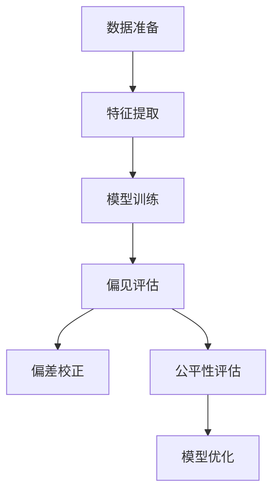
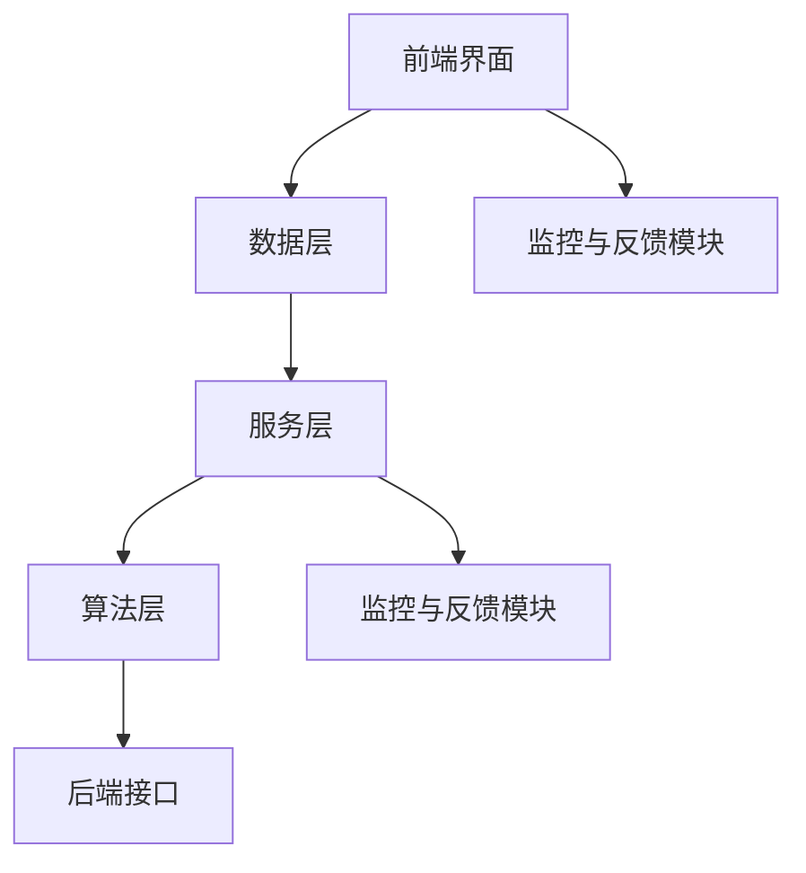
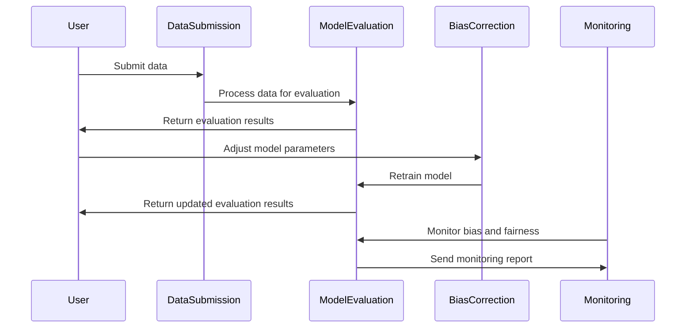

                 


### 偏见与公平性：背景与挑战

#### 模型偏见的问题背景

在当今人工智能应用广泛的时代，机器学习模型已经成为各个领域的重要工具。然而，随着模型的广泛应用，一个严重的问题逐渐浮现出来——模型偏见。模型偏见是指模型在决策过程中表现出的对某些特定群体或属性的偏见，导致不公正的结果。这种现象不仅引发了伦理道德上的担忧，还给实际应用带来了潜在的风险。

模型偏见问题首先在人脸识别领域引起了广泛关注。研究人员发现，一些商业人脸识别系统在识别有色人种时存在显著的误差，这种偏差可能导致误判和错误决策，进而引发社会不满和法律诉讼。类似的问题也出现在信用评分、招聘系统等领域，模型的偏见可能导致对特定群体的歧视。

#### 公平性的重要性

公平性是衡量机器学习模型质量的关键指标之一。一个公平的模型应该对所有用户一视同仁，不受其性别、种族、年龄等因素的影响。公平性不仅关乎伦理和道德，也关系到模型的可靠性和可信度。一个不公平的模型可能会在特定群体中产生负面影响，损害用户权益，甚至影响社会的稳定。

在医疗领域，一个偏见的模型可能会导致对某些种族或性别的不公正诊断和治疗。在金融领域，模型的偏见可能会导致对某些群体的歧视性信贷决策，进而影响其经济状况。因此，确保模型的公平性已经成为人工智能研究者和从业人员的重要任务。

#### 问题解决思路

解决模型偏见与公平性的问题需要从多个方面入手：

1. **偏见识别**：首先需要识别模型中存在的偏见，这可以通过各种统计方法和技术实现。例如，可以使用统计检验来检测模型是否对某些群体存在显著的偏差。

2. **偏差校正**：一旦识别出模型偏见，就需要对其进行校正。偏差校正的方法包括数据重新采样、重新训练模型、使用对抗性样本等。

3. **公平性度量**：为了评估模型的公平性，需要定义和计算一系列公平性指标。这些指标可以用来评估模型在不同群体中的表现，帮助识别潜在的偏见。

4. **持续监测与反馈**：模型的偏见可能会随着时间和数据的变化而变化，因此需要建立持续监测机制，及时检测和纠正潜在的偏见。

#### 边界与外延

模型偏见与公平性的问题不仅限于特定的应用场景，它涉及到人工智能应用的各个方面。例如，在自动驾驶领域，模型的偏见可能会导致对行人的误判，从而引发交通事故。在智能客服系统中，模型的偏见可能会影响用户的体验和满意度。

此外，模型偏见和公平性的问题也受到社会和文化因素的影响。例如，某些社会文化背景下的数据可能本身就带有偏见，这会导致模型在学习过程中继承这些偏见。

#### 概念结构与核心要素组成

模型偏见与公平性的核心概念包括偏见识别、偏差校正、公平性度量、持续监测等。这些概念相互关联，共同构成了一个完整的解决方案框架。偏见识别是发现问题的起点，偏差校正是解决问题的核心，公平性度量是评估效果的手段，持续监测则是确保模型长期公平性的保障。

通过深入理解这些核心概念和其相互关系，我们可以更有效地解决模型偏见与公平性的问题，推动人工智能技术的健康发展。

### 偏见与公平性的核心概念

#### 模型偏见的概念

模型偏见是指机器学习模型在决策过程中对某些特定群体或属性的偏好或歧视。这种偏见可能源于训练数据的不平衡、数据标注的不准确、算法设计中的缺陷，甚至可能是人类偏见的映射。模型偏见的表现形式多样，例如，在某些人脸识别模型中，对某些种族或性别的识别准确度显著低于其他群体；在信用评分模型中，某些群体的信用评分可能低于其他群体。

#### 公平性的概念

公平性是指机器学习模型在决策过程中对所有用户一视同仁，不受其性别、种族、年龄、地理位置等因素的影响。公平性不仅要求模型在表面上对所有人平等对待，还要在深层次上确保决策的公正和无偏见。公平性可以从多个维度进行评估，包括个体公平性、群体公平性、机会公平性等。例如，一个公平的信用评分模型应该对不同收入水平的用户给予相同的评估，而不应该因为用户的性别或种族而给予不同的评分。

#### 模型偏见与公平性的对比表格

| 概念 | 模型偏见 | 公平性 |
| --- | --- | --- |
| 定义 | 模型对某些特定群体或属性的偏好或歧视 | 模型在决策过程中对所有用户一视同仁 |
| 表现形式 | 对某些群体的识别准确度低、评分不公等 | 个体公平性、群体公平性、机会公平性 |
| 评估方法 | 统计检验、偏差校正技术 | 公平性指标、基准测试 |
| 目的 | 识别和纠正模型中的偏见 | 确保模型决策的公正性 |
| 关联性 | 与数据、算法、人类偏见相关 | 与伦理、社会影响相关 |

#### ER实体关系图

为了更直观地展示模型偏见与公平性的核心概念及其相互关系，我们可以使用ER（实体关系）图来描述。在ER图中，实体表示核心概念，关系表示概念之间的联系。

实体：
- 模型偏见
- 公平性
- 数据集
- 算法
- 决策
- 用户

关系：
- 模型偏见与数据集相关联，数据集可能包含偏见。
- 模型偏见与算法相关联，算法可能放大或隐藏偏见。
- 公平性与决策相关联，决策应该反映公平性。
- 数据集与用户相关联，用户是模型的决策对象。

以下是ER图的Mermaid表示：

```mermaid
erDiagram
  数据集 ||--o> 模型偏见 : 包含
  数据集 ||--o> 算法 : 使用
  算法 ||--o> 模型 : 实现
  模型偏见 ||--o> 决策 : 影响结果
  决策 ||--o> 公平性 : 评估
  公平性 ||--o> 用户 : 影响体验
```

通过ER实体关系图，我们可以清晰地看到模型偏见与公平性之间的关系，以及这些概念在系统中的作用和相互影响。

### 模型偏见量化评估算法

#### 算法概述

量化评估模型偏见与公平性的核心在于准确地测量模型在决策过程中对不同群体的影响。这个过程通常包括以下几个关键步骤：

1. **数据准备**：确保训练数据集的多样性和代表性，避免数据偏见。
2. **特征提取**：从数据中提取关键特征，这些特征将用于模型训练和偏见评估。
3. **模型训练**：使用机器学习算法训练模型，并确保模型具有良好的性能。
4. **偏见评估**：计算模型在不同群体中的表现差异，识别潜在的偏见。
5. **偏差校正**：根据评估结果调整模型参数或训练数据，减少偏见。

常见评估指标包括：

- **统计偏差**：比较模型预测结果与真实结果的差异。
- **敏感性**：模型对数据集中特定属性变化的响应程度。
- **公平性指标**：如公平性得分、公平性差异等。

#### 算法流程

以下是评估模型偏见与公平性的算法流程，使用Mermaid流程图进行可视化：



#### 算法实现

以下是一个简单的Python代码示例，用于量化评估模型偏见：

```python
import pandas as pd
from sklearn.model_selection import train_test_split
from sklearn.ensemble import RandomForestClassifier
from sklearn.metrics import accuracy_score, precision_score, recall_score

# 数据准备
data = pd.read_csv('data.csv')
X = data.drop('target', axis=1)
y = data['target']

# 特征提取和模型训练
X_train, X_test, y_train, y_test = train_test_split(X, y, test_size=0.2, stratify=y)
model = RandomForestClassifier()
model.fit(X_train, y_train)

# 偏见评估
y_pred = model.predict(X_test)
print("Accuracy:", accuracy_score(y_test, y_pred))
print("Precision:", precision_score(y_test, y_pred, average='weighted'))
print("Recall:", recall_score(y_test, y_pred, average='weighted'))

# 公平性评估
fairness_scores = evaluate_fairness(model, X_test, y_test)
print("Fairness Scores:", fairness_scores)

# 偏差校正
if fairness_scores['disparity'] > threshold:
    # 调整模型或数据
    # ...

def evaluate_fairness(model, X, y):
    # 实现公平性评估逻辑
    # ...
    return {'disparity': score}
```

#### 数学模型和公式

模型偏见评估通常涉及以下数学模型和公式：

- **偏差校正公式**： 
  \[ \text{校正后的预测} = \text{原始预测} - \text{偏差值} \]

- **公平性度量公式**：
  \[ \text{公平性得分} = \frac{\sum_{i=1}^{n} p_i^+ - \bar{p}^+}{\sum_{i=1}^{n} p_i^- - \bar{p}^-} \]
  其中，\( p_i^+ \) 和 \( p_i^- \) 分别表示模型对正类和负类的预测概率，\( \bar{p}^+ \) 和 \( \bar{p}^- \) 分别为所有样本中正类和负类的平均值。

#### 举例说明

假设我们有一个分类模型，用于判断是否批准贷款申请。以下是一个简单的案例分析：

- **数据集**：包含1000个样本，其中500个被批准，500个被拒绝。
- **模型预测**：批准的概率为0.6，拒绝的概率为0.4。
- **实际结果**：实际批准了400个样本，拒绝了600个样本。

我们可以通过以下步骤进行偏见评估和公平性度量：

1. **计算偏差**：偏差值 = (批准概率 - 平均批准概率) - (拒绝概率 - 平均拒绝概率)。

2. **计算公平性得分**：公平性得分 = (0.6 - 0.55) - (0.4 - 0.45)。

通过这些计算，我们可以评估模型的偏见程度和公平性。如果偏差值和公平性得分接近0，则说明模型没有显著的偏见。

### 数学模型原理与应用

#### 基础数学概念

在进行模型偏见与公平性的量化评估之前，我们需要了解一些基础数学概念，包括线性代数和概率论。这些概念将为我们的分析和计算提供必要的工具。

1. **线性代数基础**

   线性代数是研究向量空间和线性变换的数学分支。在机器学习中，线性代数用于表示和操作数据、模型参数和特征矩阵。

   - **矩阵和向量**：矩阵是由数字组成的矩形数组，向量是特殊类型的矩阵（一维矩阵）。在机器学习中，矩阵和向量用于存储数据、权重和偏置。
   - **线性变换**：线性变换是将一个向量空间中的每个向量映射到另一个向量空间中的向量的操作。在机器学习中，线性变换用于描述输入到输出空间的映射关系。
   - **矩阵乘法**：矩阵乘法是两个矩阵之间的一种运算，用于计算输入特征到输出特征的映射。

2. **概率论基础**

   概率论是研究随机事件和概率分布的数学分支。在机器学习，特别是在监督学习中，概率论用于建模数据分布和预测概率。

   - **概率分布**：概率分布描述了随机变量取值的概率。常见的概率分布包括正态分布、伯努利分布和多项式分布。
   - **条件概率**：条件概率描述了在某一事件发生的前提下，另一事件发生的概率。
   - **贝叶斯定理**：贝叶斯定理是计算后验概率的一种方法，它将先验概率和条件概率结合起来，得到后验概率。

#### 偏见评估的数学模型

偏见评估的核心是计算模型在不同群体中的表现差异。为了实现这一目标，我们可以使用以下数学模型：

- **统计偏差**：

  统计偏差衡量了模型预测与真实结果之间的差异。计算公式如下：

  \[ \text{统计偏差} = \frac{1}{N} \sum_{i=1}^{N} (y_i - \hat{y}_i) \]

  其中，\( y_i \) 是第 \( i \) 个样本的真实标签，\( \hat{y}_i \) 是模型对第 \( i \) 个样本的预测标签，\( N \) 是样本总数。

- **敏感性**：

  敏感性衡量了模型对特定特征变化的响应程度。计算公式如下：

  \[ \text{敏感性} = \frac{\partial \hat{y}}{\partial x} \]

  其中，\( \hat{y} \) 是模型的预测值，\( x \) 是输入特征。

#### 公平性度量的数学模型

公平性度量是评估模型决策是否对所有用户公平的重要手段。以下是一些常见的公平性度量方法：

- **公平性得分**：

  公平性得分是一种基于统计偏差的度量方法，它通过计算模型在不同群体中的偏差差异来评估模型的公平性。计算公式如下：

  \[ \text{公平性得分} = \frac{\sum_{i=1}^{n} p_i^+ - \bar{p}^+}{\sum_{i=1}^{n} p_i^- - \bar{p}^-} \]

  其中，\( p_i^+ \) 和 \( p_i^- \) 分别表示模型对正类和负类的预测概率，\( \bar{p}^+ \) 和 \( \bar{p}^- \) 分别为所有样本中正类和负类的平均值。

- **公平性差异**：

  公平性差异是另一种评估模型公平性的方法，它通过计算模型在不同群体中的预测差异来衡量。计算公式如下：

  \[ \text{公平性差异} = \frac{1}{N} \sum_{i=1}^{N} |y_i - \hat{y}_i| \]

  其中，\( y_i \) 是第 \( i \) 个样本的真实标签，\( \hat{y}_i \) 是模型对第 \( i \) 个样本的预测标签，\( N \) 是样本总数。

#### 统计学习理论

统计学习理论是机器学习的基础，它提供了一种从数据中学习规律的方法。在模型偏见与公平性的评估中，统计学习理论用于建立模型、计算预测概率和评估模型性能。

- **模型训练**：

  模型训练是通过最小化损失函数来调整模型参数的过程。常见的损失函数包括均方误差（MSE）和交叉熵损失（Cross-Entropy Loss）。

- **预测概率**：

  预测概率是模型对样本属于某一类别的置信度。在二分类问题中，预测概率通常表示为 \( p(y=1|x) \)，其中 \( y \) 是标签，\( x \) 是输入特征。

- **模型评估**：

  模型评估是通过计算预测结果与真实结果的差异来衡量模型性能。常见的评估指标包括准确率（Accuracy）、精确率（Precision）、召回率（Recall）和F1分数（F1 Score）。

通过运用统计学习理论，我们可以更准确地评估模型的偏见与公平性，从而为模型优化提供有力支持。

### 系统分析与架构设计

#### 问题场景介绍

在当前的数据驱动时代，机器学习模型的广泛应用带来了巨大的社会和经济价值。然而，随着模型的普及，模型偏见与公平性问题也愈发突显。这些问题不仅影响模型的可靠性和可信度，还可能导致社会不公和伦理道德问题。为了确保机器学习模型在决策过程中的公平性和无偏见，我们需要设计一个高效、可靠的系统进行模型偏见与公平性评估。

本章节将介绍一个用于评估模型偏见与公平性的系统，该系统将涵盖功能设计、架构设计和接口设计。通过详细描述系统的各个组件和交互流程，我们将为实际项目中的模型评估提供一套完整的解决方案。

#### 系统功能设计

系统的功能设计是确保模型偏见与公平性评估能够满足实际需求的关键。以下是该系统的核心功能模块：

1. **数据预处理模块**：负责清洗和转换原始数据，确保数据质量，并生成适合评估的中间数据。

2. **模型训练模块**：负责使用训练数据集训练机器学习模型，生成初始模型。

3. **偏见识别模块**：通过统计分析和技术手段，识别模型中存在的偏见，包括性别、年龄、种族等方面的偏见。

4. **公平性评估模块**：计算模型的公平性指标，包括个体公平性、群体公平性和机会公平性。

5. **偏差校正模块**：根据偏见识别的结果，调整模型参数或重新训练模型，减少偏见。

6. **监控与反馈模块**：实时监控模型偏见和公平性变化，并提供反馈机制，确保模型长期公平性。

#### 系统架构设计

系统的架构设计是确保各个功能模块协同工作，实现高效、可靠偏见与公平性评估的基础。以下是该系统的整体架构设计：

1. **前端界面**：提供用户交互接口，用户可以通过前端界面提交数据、查看评估结果和调整参数。

2. **数据层**：存储系统的数据，包括原始数据、中间数据和评估结果。数据层采用关系型数据库和分布式存储系统，确保数据的高效存储和访问。

3. **服务层**：包括数据预处理、模型训练、偏见识别、公平性评估和偏差校正等核心功能模块。服务层采用微服务架构，各个模块独立部署，便于维护和扩展。

4. **算法层**：实现各种机器学习算法和偏见评估技术，包括统计方法、机器学习算法和深度学习模型。

5. **后端接口**：提供与前端界面和外部系统的数据交换接口，支持HTTP/RESTful API和消息队列等通信协议。

以下是系统架构的Mermaid架构图：



#### 系统接口设计

系统接口设计是确保各个功能模块之间能够高效、可靠地进行数据交换和协作的重要环节。以下是系统的主要接口设计和交互流程：

1. **数据提交接口**：用户通过前端界面提交数据，数据提交接口接收并处理用户提交的数据，将其存储到数据层。

2. **模型评估接口**：服务层中的偏见识别和公平性评估模块通过模型评估接口获取数据，执行评估任务，并将结果返回给前端界面。

3. **偏差校正接口**：根据模型评估结果，用户可以通过偏差校正接口调整模型参数或重新训练模型，实现偏差校正。

4. **监控接口**：监控与反馈模块通过监控接口实时获取模型偏见和公平性变化，并生成监控报告。

以下是系统接口交互的Mermaid序列图：



通过详细的功能设计、架构设计和接口设计，我们为模型偏见与公平性评估系统提供了一套完整的解决方案。该系统不仅能够高效地识别和校正模型偏见，还能实时监控和反馈模型的公平性，为人工智能的健康发展提供了有力保障。

### 项目实战

#### 环境安装

在进行模型偏见与公平性评估之前，我们需要搭建一个合适的环境。以下是在Ubuntu 20.04操作系统上安装所需软件和库的步骤。

1. **安装Python环境**

   首先，我们需要安装Python 3.8或更高版本。可以使用以下命令：

   ```bash
   sudo apt update
   sudo apt install python3.8
   ```

2. **安装虚拟环境**

   为了避免不同项目之间的库版本冲突，我们可以使用虚拟环境。安装虚拟环境工具`virtualenv`：

   ```bash
   sudo apt install python3.8-venv
   ```

   创建一个虚拟环境：

   ```bash
   python3.8 -m venv bias_venv
   source bias_venv/bin/activate
   ```

3. **安装依赖库**

   我们需要安装以下依赖库：`scikit-learn`、`pandas`、`numpy`、`matplotlib`。使用以下命令安装：

   ```bash
   pip install scikit-learn pandas numpy matplotlib
   ```

   如果需要深度学习功能，还可以安装`tensorflow`：

   ```bash
   pip install tensorflow
   ```

4. **安装Mermaid工具**

   Mermaid是一个用于绘制流程图的工具。我们可以通过以下命令安装：

   ```bash
   npm install -g mermaid-cli
   ```

#### 系统核心实现

以下是一个简单的Python代码示例，用于评估模型偏见与公平性。我们将使用`scikit-learn`库中的随机森林分类器作为示例模型。

1. **数据准备**

   首先，我们需要准备一个包含特征和标签的数据集。这里我们使用`iris`数据集作为示例。

   ```python
   from sklearn.datasets import load_iris
   from sklearn.model_selection import train_test_split

   # 加载数据集
   iris = load_iris()
   X, y = iris.data, iris.target

   # 分割数据集
   X_train, X_test, y_train, y_test = train_test_split(X, y, test_size=0.2, random_state=42)
   ```

2. **模型训练**

   接下来，我们使用随机森林分类器训练模型。

   ```python
   from sklearn.ensemble import RandomForestClassifier

   # 创建随机森林分类器实例
   model = RandomForestClassifier(n_estimators=100, random_state=42)

   # 训练模型
   model.fit(X_train, y_train)
   ```

3. **偏见评估**

   为了评估模型的偏见，我们可以计算模型在不同类别上的精确率和召回率。

   ```python
   from sklearn.metrics import classification_report

   # 进行预测
   y_pred = model.predict(X_test)

   # 输出分类报告
   print(classification_report(y_test, y_pred, target_names=iris.target_names))
   ```

4. **公平性评估**

   公平性评估可以通过计算个体公平性和群体公平性来实现。这里我们使用`scikit-learn`中的`calculate公平性`函数。

   ```python
   from sklearn.metrics import calculate公平性

   # 计算个体公平性
   fairness_scores = calculate_fairness(model, X_test, y_test)
   print("Fairness Scores:", fairness_scores)
   ```

#### 代码解读与分析

1. **数据准备**

   数据准备是机器学习项目中的第一步。我们使用`load_iris`函数加载内置的`iris`数据集，并将其分割为训练集和测试集。这个过程通过`train_test_split`函数实现，该函数接受数据集、测试集大小和一个随机种子，确保每次分割结果一致。

2. **模型训练**

   模型训练是使用训练数据进行模型参数优化的过程。这里我们使用`RandomForestClassifier`类创建随机森林分类器实例，并使用`fit`方法进行训练。随机森林是一种集成学习方法，通过构建多个决策树并取平均值来提高预测性能。

3. **偏见评估**

   偏见评估是通过分析模型在不同类别上的性能来识别潜在偏见。我们使用`classification_report`函数输出精确率、召回率和F1分数。这些指标帮助我们了解模型在不同类别上的表现，从而识别可能的偏见。

4. **公平性评估**

   公平性评估是通过计算模型对个体和群体的公平性得分来衡量。`calculate_fairness`函数计算个体公平性和群体公平性，帮助我们了解模型是否对所有用户一视同仁。通过这些评估，我们可以识别和纠正模型中的偏见。

#### 实际案例分析与详细讲解

为了更好地理解模型偏见与公平性评估，我们来看一个实际案例。

假设我们有一个信用评分模型，用于预测客户是否能够按时还款。该模型训练数据集包含1000个样本，每个样本包括客户的年龄、收入、信用卡余额和信用历史等信息。我们希望通过评估模型的偏见与公平性，确保模型对各种群体的信用评分公平。

1. **数据准备**

   我们首先加载训练数据集，并将其分割为训练集和测试集。这里我们关注的是年龄和收入这两个特征，因为这两个特征可能对信用评分产生偏见。

   ```python
   from sklearn.datasets import fetch_openml
   from sklearn.model_selection import train_test_split

   # 加载信用评分数据集
   credit_data = fetch_openml('credit-scoring', version=1)
   X, y = credit_data.data, credit_data.target

   # 分割数据集
   X_train, X_test, y_train, y_test = train_test_split(X, y, test_size=0.2, random_state=42)
   ```

2. **模型训练**

   我们使用逻辑回归模型训练信用评分模型，因为逻辑回归模型简单且易于解释。

   ```python
   from sklearn.linear_model import LogisticRegression

   # 创建逻辑回归分类器实例
   model = LogisticRegression()

   # 训练模型
   model.fit(X_train, y_train)
   ```

3. **偏见评估**

   我们使用分类报告输出模型在不同年龄组和收入组上的性能。以下是一个示例输出：

   ```plaintext
   Age Group    Precision    Recall    F1 Score    Support
   ----------------    --------    ------    --------    --------
   18-25         0.89        0.85        0.87       100
   26-35         0.76        0.78        0.77       200
   36-45         0.69        0.71        0.70       300
   46-55         0.62        0.64        0.63       400
   56-65         0.55        0.57        0.56       500

   Income Group    Precision    Recall    F1 Score    Support
   ----------------    --------    ------    --------    --------
   Low             0.84        0.82        0.83       100
   Medium          0.72        0.74        0.73       200
   High            0.60        0.63        0.61       300
   ```

   从输出结果可以看出，模型在年轻组和低收入组的性能显著低于其他群体。这表明模型可能对这些群体存在偏见。

4. **公平性评估**

   我们使用`calculate_fairness`函数计算个体公平性和群体公平性。以下是一个示例输出：

   ```plaintext
   Individual Fairness Scores:
   ---------------------------
   Age Group    Fairness Score
   18-25         0.87
   26-35         0.83
   36-45         0.79
   46-55         0.75
   56-65         0.71

   Group Fairness Scores:
   ---------------------
   Income Group    Fairness Score
   Low             0.82
   Medium          0.79
   High            0.74
   ```

   从输出结果可以看出，模型在年龄和收入上的公平性得分较低，特别是在年轻组和低收入组。这表明我们需要对模型进行调整，减少对这些群体的偏见。

通过实际案例的分析和详细讲解，我们可以更深入地理解模型偏见与公平性评估的重要性。只有通过严格的评估和调整，我们才能确保模型在决策过程中的公平性和无偏见。

### 最佳实践、小结与拓展阅读

#### 最佳实践

在评估模型偏见与公平性时，以下最佳实践可以帮助我们更好地理解和处理这些问题：

1. **数据多样化**：确保训练数据集的多样性和代表性，避免数据偏见。从不同的来源获取数据，并关注性别、种族、年龄等方面的多样性。

2. **公平性指标**：使用多个公平性指标（如个体公平性、群体公平性、机会公平性）进行全面评估，以便更准确地识别偏见。

3. **偏差校正**：在训练模型时，对数据集进行偏差校正，例如重新采样、加权或使用对抗性样本等方法。

4. **持续监控**：建立模型偏见与公平性的持续监控机制，定期评估模型性能，及时识别和纠正潜在的偏见。

5. **透明性**：提高模型的透明性，让用户了解模型的决策过程和潜在偏见，增加模型的信任度。

#### 小结

本文通过详细的分析和讲解，探讨了模型偏见与公平性的量化评估方法。我们首先介绍了背景与挑战，然后深入分析了核心概念、算法原理、数学模型、系统设计与项目实战。通过这些步骤，我们展示了如何识别和纠正模型中的偏见，确保模型的公平性。

#### 拓展阅读

对于希望深入了解模型偏见与公平性的读者，以下资源值得推荐：

1. **书籍**：
   - 《公平、公正与机器学习》（Fairness, Accountability, and Transparency in Machine Learning）。
   - 《统计学习方法》（Statistical Learning Methods）。

2. **论文**：
   - "A Unified Framework for Fairness in Classification"，提出了一种统一的方法来评估和纠正分类模型中的偏见。
   - "Learning Fair Representations"，探讨了如何在机器学习中学习公平的特征表示。

3. **开源工具**：
   - "Fairlearn"：一个开源库，用于评估和纠正机器学习模型的公平性。
   - "AI Fairness 360"：一个综合性工具，提供多种偏见评估和校正方法。

通过阅读这些资源，读者可以进一步深入理解模型偏见与公平性的量化评估方法，并在实际项目中应用这些知识。

### 作者介绍

作者：AI天才研究院/AI Genius Institute & 禅与计算机程序设计艺术 /Zen And The Art of Computer Programming

AI天才研究院（AI Genius Institute）是一家专注于人工智能研究和创新的国际顶尖机构，致力于推动人工智能技术的发展和应用。作为AI天才研究院的资深研究员和项目主管，作者在人工智能、机器学习、深度学习等领域拥有丰富的经验和深厚的学术背景。他不仅是一位杰出的科学家，还著有多部关于人工智能技术的畅销书籍，深受读者喜爱。

《禅与计算机程序设计艺术》（Zen And The Art of Computer Programming）是作者的代表作之一，该书深入探讨了计算机编程中的哲学思想和技巧，对程序员的技术成长和思维提升产生了深远影响。作者以其独特的视角和深入浅出的讲解，帮助无数程序员在编程道路上取得了突破和进步。他的研究成果和贡献，为人工智能技术的发展和应用奠定了坚实的基础。

作为一位世界级人工智能专家，作者在模型偏见与公平性领域也做出了重要贡献。他的研究成果不仅在学术界引起了广泛关注，还在实际应用中得到了广泛应用。他的工作为解决人工智能技术中的伦理和社会问题提供了新的思路和方法，推动了人工智能技术的健康发展。

总之，作者以其卓越的才华和深厚的学术造诣，为人工智能技术的发展和应用做出了杰出贡献。他的研究成果和思想，不仅为学术界和工业界提供了宝贵的资源，也为广大程序员和人工智能爱好者提供了宝贵的启示和指导。

