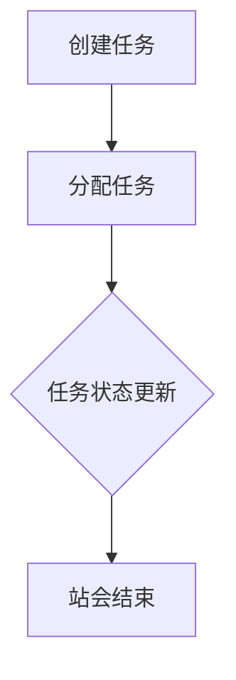
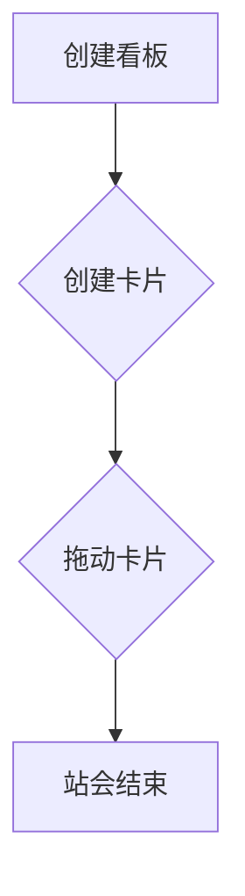
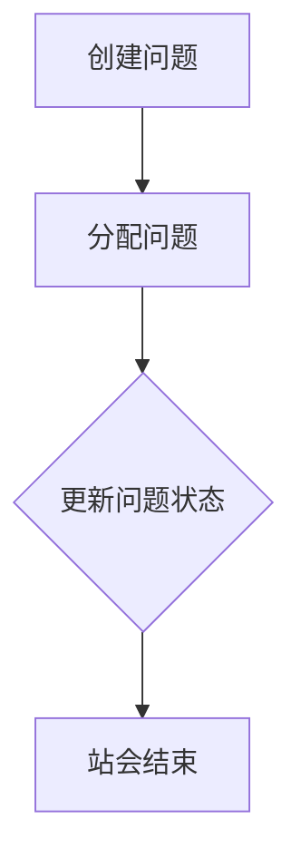
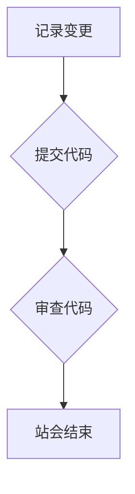
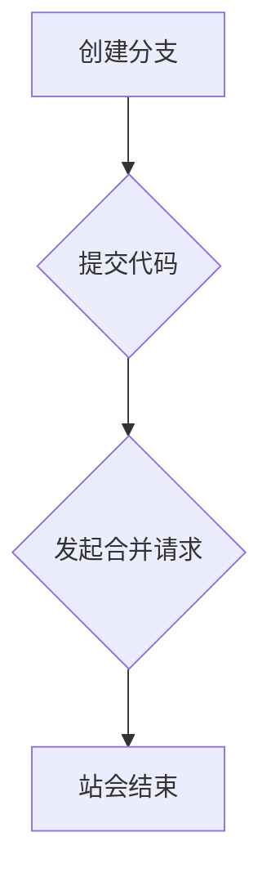
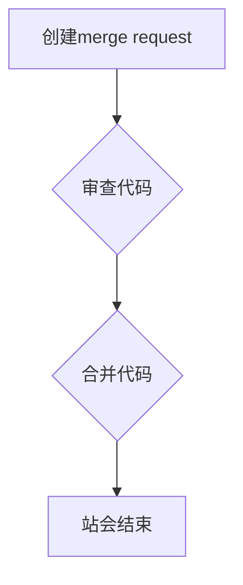
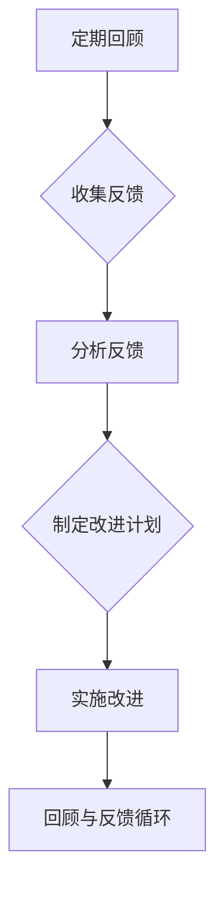
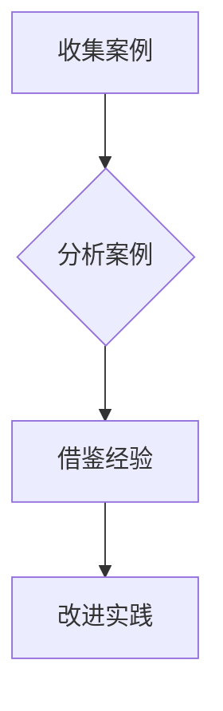

                 

## 第一部分：AI团队协作的挑战

### 第1章：AI团队协作的现状与问题

#### 1.1 AI团队协作面临的挑战

##### 1.1.1 团队沟通障碍

在AI领域，团队成员往往来自不同的专业背景，包括数据科学家、机器学习工程师、软件工程师等。由于专业知识的差异，团队成员在沟通时可能会遇到理解上的障碍。此外，语言和文化的差异也可能导致误解和信息失真。例如，一位数据科学家可能在描述一个算法时使用了特定的术语，而另一位软件工程师可能无法立即理解其含义。

##### 1.1.2 目标不一致

AI项目的复杂性可能导致团队成员对于项目的目标有不同的理解。数据科学家可能专注于模型的准确性和性能，而机器学习工程师可能更关注模型的训练速度和资源消耗。如果团队成员的目标不一致，将会导致合作效率低下，甚至可能使项目偏离正确的方向。

##### 1.1.3 信息传递效率低下

在大型AI项目中，信息的传递和共享是至关重要的。然而，现有的沟通工具和流程可能不够高效。团队成员可能需要花费大量时间来查找信息或者等待回复。这种低效的信息传递会拖慢项目的进度，增加项目的风险。

#### 1.2 AI项目管理的特殊性

##### 1.2.1 项目进度的可预测性

由于AI项目的复杂性和不确定性，项目进度往往难以预测。AI算法的性能可能受到数据质量、计算资源、模型设计等多种因素的影响，这使得项目管理变得更加困难。

##### 1.2.2 需求的快速迭代

在AI项目中，需求可能会快速变化。数据科学家和业务团队可能会在项目进行中发现新的需求，这要求团队成员能够快速响应并调整计划。快速迭代的需求可能导致团队成员感到压力，增加项目风险。

##### 1.2.3 技术风险的应对

AI技术的快速进步带来了新的挑战，如算法过时、数据隐私和安全问题等。团队成员需要时刻关注技术风险，并采取相应的措施来降低风险。然而，这可能会分散团队成员的注意力，影响项目的核心进度。

### 第2章：站会：AI团队协作的利器

#### 2.1 站会的起源与发展

##### 2.1.1 站会的定义

站会，又称每日站会或每日例会，是一种简短、高频的团队沟通会议，通常持续15-30分钟。其目的是让团队成员分享前一天的工作进展，讨论遇到的问题，并计划当天的工作任务。

##### 2.1.2 站会在软件开发中的应用

站会最早起源于软件开发领域，特别是在敏捷开发方法中得到了广泛应用。通过定期的站会，团队成员可以保持信息的同步，及时发现和解决问题，从而提高团队的协作效率和项目的进展速度。

##### 2.1.3 站会在AI团队中的重要性

在AI团队中，站会的重要性更为显著。首先，AI项目的复杂性和不确定性要求团队成员能够及时沟通和协作，确保项目目标的实现。其次，站会可以帮助团队成员保持对项目进度的清晰认识，避免项目偏离方向。最后，站会提供了一个平台，让团队成员可以分享最新的研究成果和发现，促进知识的传播和团队的创新。

#### 2.2 站会的最佳实践

##### 2.2.1 站会的时间与频率

站会的时间通常安排在每天工作开始时，这样可以确保团队成员在开始一天的工作之前了解项目的最新进展。站会的频率可以根据项目的具体情况进行调整，但建议每天至少进行一次。

##### 2.2.2 站会的内容与议程

站会的内容应该简洁明了，主要包括前一天的工作进展、遇到的问题、当天的计划等。为了确保站会的有效性，可以提前准备一个简短的议程，并在会上按议程进行讨论。

##### 2.2.3 站会的参与人员与角色

站会的参与人员应包括项目的所有相关成员，如数据科学家、机器学习工程师、软件工程师等。每个成员在会上都有特定的角色，如报告工作进展、提出问题、分配任务等。

#### 2.3 站会的效果评估

##### 2.3.1 站会的反馈机制

为了评估站会的效果，可以建立反馈机制，让团队成员对站会的内容和形式提出建议和意见。通过定期的反馈，可以不断优化站会的流程，提高其有效性。

##### 2.3.2 站会的改进措施

根据反馈结果，可以采取一系列改进措施，如调整站会的时间、内容、议程等。此外，还可以引入新的工具和技术，提高站会的效率和效果。

### 第3章：制定有效的站会议程

#### 3.1 站会议程的设计

##### 3.1.1 会议目标

站会议程的设计应该明确会议的目标，如信息同步、问题解决、任务分配等。明确的目标可以帮助团队成员更好地准备和参与会议。

##### 3.1.2 会议内容

会议内容应该简洁明了，包括前一天的工作进展、遇到的问题、当天的计划等。为了提高会议的效率，可以提前准备一个简短的议程，并在会上按议程进行讨论。

##### 3.1.3 会议时间

站会的时间应该控制在15-30分钟之间，确保会议不会过于冗长，影响团队成员的工作效率。会议时间应该固定，并在每天工作开始时进行。

#### 3.2 站会议程的调整与优化

##### 3.2.1 根据项目进度调整

站会议程应该根据项目进度进行动态调整。在项目初期，可以增加对项目目标和计划的讨论；在项目后期，可以增加对项目风险和问题的讨论。

##### 3.2.2 处理突发情况

在会议中，可能会遇到一些突发情况，如紧急任务、突发事件等。这时，可以临时调整会议议程，确保重要事务得到及时处理。

##### 3.2.3 保持会议的高效性

为了保持会议的高效性，可以采取一些措施，如限制发言时间、提前准备材料、避免离题等。通过这些措施，可以提高会议的效率，确保团队成员能够在有限的时间内获得最大收益。

### 第4章：提高站会的参与度

#### 4.1 站会氛围的营造

##### 4.1.1 尊重与信任

在站会上，团队成员应该互相尊重，建立信任。这样可以促进开放性的讨论，减少误解和冲突。

##### 4.1.2 鼓励开放性讨论

鼓励团队成员在站会上提出问题和建议，无论问题的大小。这样可以激发团队的活力，提高问题的解决效率。

##### 4.1.3 及时反馈与激励

对于团队成员在站会上提出的建议和问题，应该及时给予反馈。这样可以增强团队成员的参与感和积极性，激励他们更加积极地参与站会。

#### 4.2 提升个人参与感的策略

##### 4.2.1 提前准备

为了提升个人在站会上的参与感，团队成员应该提前准备，如梳理前一天的工作进展、准备问题清单等。这样可以在会议上更加从容地发言。

##### 4.2.2 积极发言

在站会上，团队成员应该积极发言，分享自己的观点和经验。这样可以促进团队成员之间的交流和合作。

##### 4.2.3 倾听与学习

在站会上，团队成员不仅要发言，还要倾听其他成员的意见和经验。这样可以拓宽自己的视野，提高自己的专业素养。

### 第5章：站会的技术工具选择

#### 5.1 站会工具的评估标准

##### 5.1.1 功能性

站会工具应该具备基本的功能，如会议预约、会议记录、任务分配等。同时，工具应该支持多种平台，如桌面、移动设备等，以满足团队成员的不同需求。

##### 5.1.2 易用性

站会工具应该易于使用，不需要过多的培训和技术支持。这样可以确保团队成员能够快速上手，提高会议的效率。

##### 5.1.3 扩展性

站会工具应该具备良好的扩展性，能够与现有的项目管理工具、代码管理工具等集成。这样可以确保站会工具能够与团队的现有工作流程无缝对接。

#### 5.2 常见站会工具介绍

##### 5.2.1 Zoom

Zoom是一款流行的视频会议工具，支持实时聊天、屏幕共享、会议录制等功能。它具有优秀的视频和音频质量，适合进行远程站会。

##### 5.2.2 Microsoft Teams

Microsoft Teams是一款集成通讯、协作和会议的云端服务，支持实时聊天、视频会议、文件共享等功能。它是微软生态系统的一部分，与Office 365等工具集成良好。

##### 5.2.3 Slack

Slack是一款团队协作工具，支持实时聊天、文件共享、任务分配等功能。它具有高度的可定制性，可以根据团队的需求进行配置。

## 第二部分：站会的实施与组织

### 第6章：站会的实施与组织

#### 6.1 站会的实施步骤

##### 6.1.1 确定站会议程

在实施站会之前，首先需要确定站会议程。议程应包括会议目标、会议内容、会议时间和参与人员等。议程的制定应考虑项目的特点和团队成员的需求。

##### 6.1.2 选择合适的工具

选择合适的站会工具是确保站会成功的关键。工具应具备良好的功能性、易用性和扩展性。常见的站会工具包括Zoom、Microsoft Teams和Slack等。

##### 6.1.3 培训团队成员

为了确保团队成员能够顺利参与站会，需要对其进行培训。培训内容应包括工具的使用方法、站会的流程和规范等。

##### 6.1.4 制定站会反馈机制

站会结束后，应收集团队成员的反馈，了解他们对站会的意见和建议。通过反馈机制，可以不断优化站会的流程，提高其效果。

#### 6.2 站会的组织策略

##### 6.2.1 明确会议目标

在组织站会时，首先要明确会议的目标。会议目标应与项目的目标和团队成员的需求紧密相关。明确的目标有助于提高会议的针对性和有效性。

##### 6.2.2 确保会议质量

为了确保会议的质量，需要控制会议的时间。通常，站会的持续时间应控制在15-30分钟之间。此外，应鼓励团队成员在会上积极发言，避免长时间的讨论和无意义的闲聊。

##### 6.2.3 建立良好的会议氛围

建立良好的会议氛围是确保站会成功的重要因素。会议氛围应鼓励团队成员积极参与，尊重他人的意见，避免争吵和冲突。

##### 6.2.4 定期回顾与反馈

为了不断提高站会的效果，应定期回顾和反馈。通过回顾和反馈，可以了解团队成员对站会的满意度和改进建议，从而优化站会的流程和内容。

### 第7章：站会的持续改进

#### 7.1 站会效果评估

为了评估站会的效果，可以采用以下方法：

1. **问卷调查**：通过问卷调查收集团队成员对站会的满意度和反馈。
2. **会议记录分析**：分析会议记录，了解会议的内容和效果。
3. **项目进展评估**：评估站会是否对项目的进展产生了积极的影响。

#### 7.2 站会改进措施

根据评估结果，可以采取以下改进措施：

1. **调整会议时间**：根据团队成员的反馈，调整站会的时间，使其更符合团队成员的工作节奏。
2. **优化会议内容**：根据项目进展和团队成员的需求，优化会议的内容，确保会议的目标明确、内容紧凑。
3. **引入新的工具和技术**：引入新的工具和技术，提高站会的效率和效果。

#### 7.3 持续改进的重要性

持续改进是确保站会有效性的关键。通过不断改进，可以：

1. **提高团队协作效率**：通过优化站会流程，提高团队协作效率，减少项目风险。
2. **提升团队成员的满意度**：通过持续改进，提高团队成员对站会的满意度，增强团队的凝聚力。
3. **促进项目成功**：通过持续改进，确保站会能够为项目的成功做出贡献。

## 第三部分：站会的拓展应用

### 第8章：站会与其他协作工具的结合使用

#### 8.1 站会与项目管理工具的结合

##### 8.1.1 Asana

Asana是一款流行的项目管理工具，它可以帮助团队跟踪任务进度、分配任务、设置截止日期等。将站会与Asana结合使用，可以确保站会的任务分配和进度更新更加清晰和高效。

**步骤**：

1. **创建任务**：在站会期间，根据讨论的内容创建任务。
2. **分配任务**：将任务分配给相关团队成员。
3. **更新任务状态**：在站会结束后，更新任务的状态和进度。

**Mermaid流程图**：

##### 8.1.2 Trello

Trello是一款基于看板（Kanban）的项目管理工具，它可以帮助团队可视化项目进度和任务分配。将站会与Trello结合使用，可以更好地管理任务和工作流程。

**步骤**：

1. **创建看板**：根据项目需求创建看板。
2. **创建卡片**：在站会期间，根据讨论的内容创建卡片。
3. **拖动卡片**：根据任务进度，拖动卡片到不同的列。

**Mermaid流程图**：

##### 8.1.3 Jira

Jira是一款功能强大的项目管理工具，它支持敏捷开发方法，可以跟踪和管理软件项目的需求、任务和缺陷。将站会与Jira结合使用，可以确保任务和进度管理更加精细化。

**步骤**：

1. **创建问题**：在站会期间，根据讨论的内容创建问题。
2. **分配问题**：将问题分配给相关团队成员。
3. **更新问题状态**：在站会结束后，更新问题的状态和进度。

**Mermaid流程图**：

#### 8.2 站会与代码管理工具的结合

##### 8.2.1 Git

Git是一款流行的分布式版本控制系统，它可以帮助团队协作开发和管理代码。将站会与Git结合使用，可以确保代码变更和任务管理的一致性。

**步骤**：

1. **记录变更**：在站会期间，记录代码变更和任务进展。
2. **提交代码**：在站会结束后，将代码提交到Git仓库。
3. **审查代码**：在站会后，团队成员可以审查代码，确保代码质量和任务完成情况。

**Mermaid流程图**：

##### 8.2.2 GitHub

GitHub是一款基于Git的代码托管和协作平台，它提供了丰富的协作工具和功能，如分支管理、合并请求、代码审查等。将站会与GitHub结合使用，可以更好地管理代码变更和任务分配。

**步骤**：

1. **创建分支**：在站会期间，为特定的任务创建分支。
2. **提交代码**：在站会结束后，将代码提交到GitHub仓库。
3. **发起合并请求**：在站会后，发起合并请求，合并分支代码。

**Mermaid流程图**：

##### 8.2.3 GitLab

GitLab是一款自建版的Git代码托管和协作平台，它提供了与GitHub类似的功能，同时还支持持续集成和持续部署等特性。将站会与GitLab结合使用，可以更好地管理代码和任务，提高开发效率。

**步骤**：

1. **创建merge request**：在站会期间，为特定的任务创建merge request。
2. **审查代码**：在站会结束后，团队成员审查代码，确保代码质量和任务完成情况。
3. **合并代码**：在审查通过后，合并代码到主分支。

**Mermaid流程图**：

### 第9章：站会文化的建立与维护

#### 9.1 站会文化的核心要素

##### 9.1.1 团队价值观

建立良好的站会文化需要明确的团队价值观。这些价值观应包括透明性、开放性、尊重和信任。通过明确的价值观，团队成员可以更好地理解站会的目标和意义，从而更积极地参与会议。

##### 9.1.2 沟通透明度

沟通透明度是站会文化的重要组成部分。团队成员应能够自由地分享信息、问题和想法，确保信息的流通无障碍。透明的沟通有助于减少误解和冲突，提高团队协作效率。

##### 9.1.3 创新氛围

鼓励创新是建立站会文化的重要一环。通过站会，团队成员可以分享新的思路和创意，促进知识的传播和团队的创新。一个鼓励创新的文化氛围有助于团队在快速变化的环境中保持竞争力。

#### 9.2 站会文化的持续建设

##### 9.2.1 定期回顾与反馈

为了持续建设站会文化，应定期回顾站会的效果和流程。通过回顾和反馈，可以识别问题，提出改进措施，确保站会始终符合团队的需求。

**步骤**：

1. **定期回顾**：每季度或每半年，组织一次站会回顾会议。
2. **收集反馈**：通过问卷调查、小组讨论等方式收集团队成员的反馈。
3. **分析反馈**：分析反馈内容，识别问题和改进点。
4. **制定改进计划**：根据分析结果，制定具体的改进计划。

**Mermaid流程图**：

##### 9.2.2 培训与交流

为了提高团队成员的站会参与度和效果，应定期组织培训和交流活动。这些活动可以包括：

1. **站会技巧培训**：培训团队成员如何有效地参与和主持站会。
2. **经验分享会**：邀请经验丰富的团队成员分享他们的站会经验和技巧。
3. **跨部门交流会**：组织不同部门的团队进行交流，促进知识的传播和团队协作。

##### 9.2.3 案例分析与借鉴

通过案例分析和借鉴，可以了解其他团队在站会实践中的成功经验和挑战。这有助于团队从中吸取教训，改进自身的站会流程。

**步骤**：

1. **收集案例**：收集不同团队的站会案例，包括成功和失败的案例。
2. **分析案例**：分析案例中的关键因素，识别成功和失败的原因。
3. **借鉴经验**：根据分析结果，借鉴成功案例中的经验，改进自身的站会实践。

**Mermaid流程图**：

### 第10章：案例分析

#### 10.1 案例一：高效AI团队的站会实践

**案例背景**：

一个由数据科学家、机器学习工程师和软件工程师组成的AI团队，在项目初期遇到了沟通障碍和进度不协调的问题。为了提高团队的协作效率，团队决定引入站会机制。

**实施过程**：

1. **确定站会议程**：团队确定了站会议程，包括会议目标、会议内容和会议时间。
2. **选择站会工具**：团队选择了Zoom作为站会工具，因为其具有优秀的视频和音频质量，适合远程协作。
3. **培训团队成员**：团队组织了一次培训，培训内容包括Zoom的使用方法和站会的最佳实践。
4. **实施站会**：团队开始每天进行站会，会议时间控制在15分钟以内，确保高效。

**效果评估**：

1. **沟通效率提升**：团队成员之间的沟通变得更加流畅，误解和冲突减少。
2. **进度协调**：通过站会，团队成员能够及时了解项目的进展，协调任务分配，避免进度偏差。
3. **问题解决**：站会提供了一个平台，让团队成员可以及时分享问题和解决方案，提高了问题解决效率。

**总结**：

通过站会的实施，团队克服了沟通障碍和进度不协调的问题，提高了协作效率，确保了项目的顺利进行。

#### 10.2 案例二：面对挑战的站会优化

**案例背景**：

一个AI团队在项目进展过程中遇到了技术风险和需求变化的问题，导致站会效率低下。为了提高站会的效果，团队决定对站会流程进行优化。

**优化方案**：

1. **调整会议时间**：团队将站会时间调整为每天上午9:30，确保团队成员在状态最佳时参加会议。
2. **简化会议议程**：团队简化了会议议程，只保留关键内容，如工作进展、问题和计划，避免冗长的讨论。
3. **引入反馈机制**：团队建立了反馈机制，让团队成员可以在会后提交反馈，提出改进建议。
4. **优化工具使用**：团队优化了Zoom的使用，增加了屏幕共享和实时聊天功能，提高了会议的互动性。

**实施过程**：

1. **实施新流程**：团队按照优化方案实施新的站会流程。
2. **收集反馈**：在实施新流程后，团队收集了团队成员的反馈，了解他们对新流程的看法和建议。
3. **持续优化**：根据反馈结果，团队不断优化站会流程，确保其符合团队成员的需求。

**效果评估**：

1. **会议效率提高**：站会时间缩短，会议内容更加紧凑，提高了会议的效率。
2. **问题解决速度加快**：通过实时聊天和屏幕共享，团队成员可以更快地分享信息和解决问题。
3. **团队满意度提升**：团队成员对新的站会流程表示满意，认为其提高了工作效率和团队协作。

**总结**：

通过优化站会流程，团队克服了技术风险和需求变化带来的挑战，提高了站会的效果，确保了项目的顺利进行。

## 第五部分：总结与展望

### 第11章：站会在未来AI团队协作中的应用

#### 11.1 新技术的应用

随着科技的不断发展，新技术如虚拟现实（VR）、人工智能（AI）和增强现实（AR）等将逐步应用于站会中。这些新技术可以为团队提供更丰富的交互方式和更高效的协作体验。

**发展趋势**：

1. **虚拟现实会议**：通过VR技术，团队成员可以在虚拟会议室中面对面交流，提高会议的真实感和参与度。
2. **人工智能助手**：AI助手可以帮助团队成员记录会议内容、提醒会议议程和提供实时分析，提高会议的效率和效果。
3. **增强现实辅助**：AR技术可以为团队成员提供实时的信息展示和交互，如将会议内容投影到真实环境中，提高会议的实用性和直观性。

#### 11.2 站会文化的建设

站会文化的建设是确保站会长期有效的重要保障。一个健康的站会文化应包括以下要素：

1. **开放性**：鼓励团队成员自由地分享信息和意见，避免权威压制和封闭氛围。
2. **透明性**：确保会议内容和决策过程的公开透明，让团队成员了解项目的进展和问题。
3. **尊重与信任**：尊重团队成员的意见和贡献，建立信任和合作关系，减少冲突和误解。
4. **持续改进**：定期回顾和反馈，不断优化站会流程和内容，确保站会始终符合团队的需求。

#### 11.3 跨团队协作与全球化视角

随着项目的规模和复杂度的增加，AI团队需要与其他团队和部门进行更广泛的协作。站会作为团队协作的重要工具，可以在跨团队协作和全球化视角中发挥重要作用。

**实践建议**：

1. **建立跨团队站会**：定期组织跨团队的站会，让不同团队的项目负责人和关键成员参与，确保项目的整体进展和协调。
2. **国际化站会**：对于跨国团队，可以考虑使用多语言支持的视频会议工具，确保团队成员能够顺利沟通。
3. **文化融合**：在跨文化和全球化背景下，鼓励团队成员了解和尊重不同文化的差异，建立包容性的团队文化。

### 第12章：总结与展望

站会作为AI团队协作的重要工具，已经在实践中证明了其价值。通过定期的站会，团队成员可以保持信息的同步，及时发现和解决问题，提高协作效率，确保项目顺利进行。

**总结**：

1. **站会的核心作用**：站会有助于信息同步、问题解决和任务分配，提高团队的协作效率。
2. **站会的最佳实践**：通过明确的议程、合适的时间和工具，确保站会的有效性和效率。
3. **持续改进的重要性**：通过定期回顾和反馈，不断优化站会流程，确保站会始终符合团队的需求。

**展望**：

随着新技术的应用和全球化的发展，站会在未来AI团队协作中将扮演更加重要的角色。通过持续改进和跨团队协作，站会将为团队提供更高效、更灵活的协作方式，助力AI项目的成功。

