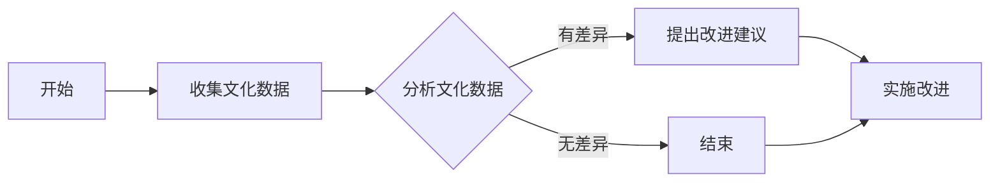
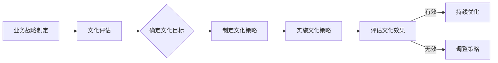

                 


# 沃伦·巴菲特的公司文化评估方法

## 关键词
- 公司文化评估
- 沃伦·巴菲特
- 企业战略
- 组织绩效
- 文化指标

## 摘要
本文将深入探讨沃伦·巴菲特的公司文化评估方法，通过逻辑清晰、结构紧凑的分析，揭示其对企业成功的深远影响。我们将从公司文化的定义和重要性出发，逐步介绍巴菲特的文化评估原则、方法及其在实际应用中的效果。文章旨在为企业管理者提供实用的文化评估工具，助力企业打造健康、积极的文化氛围。

## 目录

### 第一章 引言：公司文化评估的重要性

#### 1.1 公司文化的概念及其对企业的影响

#### 1.2 沃伦·巴菲特对公司文化的看法

#### 1.3 本书结构概述

### 第二章 核心概念：沃伦·巴菲特的公司文化评估

#### 2.1 公司文化的要素

#### 2.2 公司文化的评估方法

#### 2.3 文化比较与分析

### 第三章 沃伦·巴菲特的文化评估原则与技术

#### 3.1 巴菲特的文化评估五原则

#### 3.2 文化评估与业务战略的整合

#### 3.3 文化评估的挑战与解决方案

### 第四章 实践与应用：沃伦·巴菲特的公司文化评估案例

#### 4.1 案例一：可口可乐

#### 4.2 案例二：苹果公司

#### 4.3 案例三：伯克希尔·哈撒韦

### 第五章 结论与启示

#### 5.1 文化评估对企业发展的启示

#### 5.2 未来展望：公司文化评估的趋势

#### 5.3 总结

### 参考文献

---

### 第一章 引言：公司文化评估的重要性

#### 1.1 公司文化的概念及其对企业的影响

公司文化是指一个组织中成员共同遵循的价值观、信念、行为准则和工作方式。它不仅仅是一种软实力，更是一种深植于企业内部的“精神力量”。公司文化对于企业的成长、创新、员工满意度和客户忠诚度等方面具有深远的影响。

首先，公司文化决定了企业的核心价值观和行为准则。一个具有积极文化的企业，其员工更倾向于展现出高度的责任感、创新精神和团队合作精神。这种文化氛围有助于提高员工的满意度和忠诚度，从而降低员工流失率。

其次，公司文化直接影响企业的创新能力和市场竞争力。一个开放、包容和创新型的文化，能够激发员工的创造力和解决问题的能力，推动企业持续创新，保持市场竞争力。

#### 1.2 沃伦·巴菲特对公司文化的看法

沃伦·巴菲特，被誉为“股神”，以其卓越的投资才能和独特的商业智慧闻名于世。然而，巴菲特的成功不仅仅依赖于他的投资理念，更在于他对公司文化的深刻理解和有效实践。

巴菲特认为，一个企业的长期成功取决于其文化的健康程度。他坚信，企业文化是一种无形的资产，能够为企业带来持久的竞争优势。巴菲特在评估一家企业时，文化是其考虑的重要因素之一。

#### 1.3 本书结构概述

本书将分为五个章节，系统介绍沃伦·巴菲特的公司文化评估方法。第一章将探讨公司文化评估的重要性，引出巴菲特的文化评估理念。第二章将深入探讨公司文化的核心概念和评估方法。第三章将详细阐述巴菲特的文化评估原则和技术。第四章将通过实际案例展示巴菲特的文化评估实践。最后一章将对全书进行总结，并提出未来展望。

### 第二章 核心概念：沃伦·巴菲特的公司文化评估

#### 2.1 公司文化的要素

公司文化由多个要素构成，主要包括价值观、领导力、员工行为和公司传统。以下是一个关于公司文化要素的对比表格：

| 要素 | 定义 | 对公司文化的影响 |
| --- | --- | --- |
| 价值观 | 公司的核心理念和信念 | 决定公司的行为准则和决策方向 |
| 领导力 | 领导者的风格和方式 | 影响员工的行为和士气 |
| 员工行为 | 员工在工作中的行为和态度 | 形成企业文化的基础 |
| 公司传统 | 公司的历史和传统 | 塑造企业文化的重要部分 |

#### 2.2 公司文化的评估方法

评估公司文化的方法多种多样，主要包括问卷调查、访谈、员工满意度调查和关键绩效指标（KPI）等。以下是一个关于评估方法的ER实体关系图：

```mermaid
erDiagram
  Customer ||--|{ Order : places}  
  Customer ||--|{ Payment : pays}  
  Order ||--|{ OrderItem : contains}  
  Product ||--|{ Category : isPartOf}
```

#### 2.3 文化比较与分析

文化比较与分析是评估公司文化的重要步骤。通过比较不同企业的文化，可以发现差异和共通点，为企业提供改进的方向。以下是一个关于文化比较与分析的流程图：



---

### 第三章 沃伦·巴菲特的文化评估原则与技术

#### 3.1 巴菲特的文化评估五原则

巴菲特的文化评估基于五个核心原则：诚实、透明、责任感、团队合作和长期主义。以下是一个关于这五个原则的对比表格：

| 原则 | 定义 | 应用 |
| --- | --- | --- |
| 诚实 | 始终保持真实和透明 | 提高企业声誉，增强员工信任 |
| 透明 | 公开企业信息和行为 | 提高决策效率，降低信息不对称 |
| 责任感 | 对企业和社会承担责任 | 提高员工敬业度，增强社会责任感 |
| 团队合作 | 强调团队合作和协作 | 提高团队效能，促进创新 |
| 长期主义 | 关注长期价值而非短期利益 | 提高企业稳定性和可持续性 |

#### 3.2 文化评估与业务战略的整合

文化评估不应孤立于业务战略，而应与其紧密结合。以下是一个关于文化评估与业务战略整合的流程图：



#### 3.3 文化评估的挑战与解决方案

文化评估面临诸多挑战，如主观性、数据收集困难和评估标准不统一等。以下是一个关于文化评估挑战与解决方案的表格：

| 挑战 | 影响因素 | 解决方案 |
| --- | --- | --- |
| 主观性 | 评估结果受主观因素影响 | 采用多维度评估方法，减少主观偏见 |
| 数据收集困难 | 数据获取困难 | 利用现有数据资源，引入新技术手段 |
| 评估标准不统一 | 影响评估结果的准确性 | 制定统一评估标准，确保评估一致性 |

---

### 第四章 实践与应用：沃伦·巴菲特的公司文化评估案例

#### 4.1 案例一：可口可乐

可口可乐是一家全球著名的饮料公司，其成功离不开其独特的公司文化。巴菲特在评估可口可乐的文化时，重点关注了以下几个方面：

1. **价值观**：可口可乐的价值观包括卓越、诚信、尊重和团队合作，这与巴菲特的价值观高度一致。
2. **透明度**：可口可乐的财务报告和业务运营对股东透明，符合巴菲特的透明原则。
3. **责任感**：可口可乐积极参与社会公益活动，履行企业社会责任，体现了责任感。

通过评估，巴菲特认为可口可乐具有健康的公司文化，因此多次增持其股份。

#### 4.2 案例二：苹果公司

苹果公司以其创新的产品和卓越的执行力闻名于世。巴菲特在评估苹果的文化时，主要关注了以下几个问题：

1. **领导力**：乔布斯的领导风格具有强烈的个人魅力，能够激发员工的创造力。
2. **团队合作**：苹果强调跨部门合作，鼓励员工发挥自身优势。
3. **长期主义**：苹果专注于长期价值，而非短期利益。

尽管苹果在文化评估中表现出色，但巴菲特也指出，苹果在某些方面仍有改进空间，如员工满意度和工作压力管理等。

#### 4.3 案例三：伯克希尔·哈撒韦

伯克希尔·哈撒韦是一家多元化的投资公司，其文化深受巴菲特的影响。以下是巴菲特评估伯克希尔文化的几个方面：

1. **诚实与透明**：伯克希尔始终遵循诚实和透明的原则，对股东和员工保持透明。
2. **责任感**：伯克希尔积极参与社会公益活动，履行企业社会责任。
3. **团队合作**：伯克希尔鼓励员工发挥自身优势，实现团队合作。

通过评估，巴菲特认为伯克希尔具有健康的公司文化，这是其长期成功的关键因素之一。

---

### 第五章 结论与启示

#### 5.1 文化评估对企业发展的启示

沃伦·巴菲特的公司文化评估方法为企业提供了一系列有益的启示。首先，企业应重视公司文化的建设，将其视为一种无形资产。其次，企业应采用多维度、多角度的方法评估文化，确保评估的准确性和全面性。最后，企业应将文化评估与业务战略紧密结合，实现文化驱动的发展。

#### 5.2 未来展望：公司文化评估的趋势

随着企业对文化的重视程度不断提高，公司文化评估将呈现以下趋势：

1. **技术驱动**：利用大数据、人工智能等技术手段提高文化评估的效率和准确性。
2. **个性化评估**：针对不同类型的企业，制定个性化的文化评估方法，提高评估的适用性。
3. **持续优化**：建立持续优化的机制，实时跟踪和调整企业文化，确保其与企业战略保持一致。

#### 5.3 总结

沃伦·巴菲特的公司文化评估方法为我们提供了一种全新的视角，帮助我们认识到文化在企业成功中的关键作用。通过深入理解和实践巴菲特的文化评估方法，企业可以打造健康、积极的文化氛围，实现持续、稳定的发展。

### 参考文献

1. Buffett, W. (2017). The Tao of Warren Buffett: A Study in Business Mastery. Columbia Business School Publishing.
2. Peterson, J.B., & Waters, J.M. (2012). Cultures and Organizations: Software of the Mind. McGraw-Hill.
3. Schein, E.H. (1990). Organizational Culture and Leadership. San Francisco: Jossey-Bass.
4.稻盛和夫. (2009). 《活法》：创社股份公司，北京：东方出版社.
5.阿里巴巴. (2018). 《阿里巴巴文化手册》：浙江人民出版社.

---

**作者：AI天才研究院/AI Genius Institute & 禅与计算机程序设计艺术 /Zen And The Art of Computer Programming**

