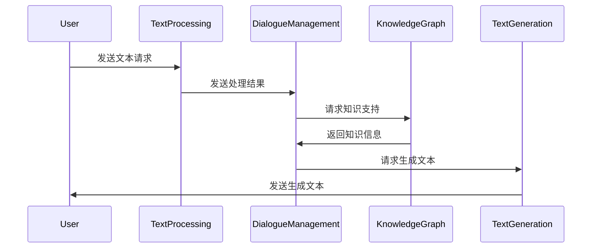

                 

### 引言

在现代软件架构设计中，解耦是系统设计中的关键策略之一。它能够提高系统的灵活性、可扩展性和维护性，减少组件之间的直接依赖，从而使得系统更加健壮。在大型语言模型（LLM）的应用中，解耦尤为重要。LLM通常涉及复杂的计算和大量的数据处理，这些操作需要高度的并行性和弹性。而消息队列是实现LLM应用解耦的有效工具。

#### 1.1 问题背景

大型语言模型（LLM）作为深度学习技术的集大成者，在自然语言处理（NLP）领域取得了显著的成果。LLM如GPT系列、BERT等，通过大量的文本数据进行预训练，具备强大的语义理解能力和语言生成能力。然而，随着模型规模的不断扩大，LLM的应用场景也越来越广泛，例如搜索引擎、智能客服、自动摘要、对话系统等。这些应用对系统的性能和稳定性提出了更高的要求。

在LLM的应用中，解耦是解决复杂系统设计问题的重要手段。解耦旨在将系统划分为多个独立的模块，这些模块可以独立开发、测试和部署，从而提高系统的灵活性和可维护性。具体来说，LLM应用中的解耦主要涉及以下几个方面：

1. **计算资源的解耦**：LLM的预训练和推理过程需要大量的计算资源。通过消息队列，可以将这些计算任务分配到不同的服务器或节点上，从而实现计算资源的解耦，提高系统的并行处理能力。
2. **数据流的解耦**：LLM的应用通常涉及大量的数据输入和输出。通过消息队列，可以实现对数据流的解耦，使得数据处理模块可以独立于数据输入和输出模块进行操作，从而提高系统的灵活性和可扩展性。
3. **功能模块的解耦**：LLM的应用通常包括多个功能模块，如文本处理、对话管理、知识图谱等。通过消息队列，可以实现对功能模块的解耦，使得不同模块可以独立开发、测试和部署，从而提高系统的可维护性。

#### 1.2 解耦的概念

解耦（Decoupling）是指将系统的不同组件分离，使得它们可以独立运行和扩展，而不会受到其他组件的影响。在软件工程中，解耦通常通过以下几种方式实现：

1. **依赖注入**：通过依赖注入（Dependency Injection），将组件之间的依赖关系外部化，使得组件可以独立开发、测试和部署。
2. **事件驱动架构**：通过事件驱动架构，将系统的不同组件通过事件进行通信，从而实现解耦。这种方式使得组件之间的通信更加灵活和松散。
3. **消息队列**：通过消息队列，可以实现组件之间的异步通信，从而实现解耦。消息队列充当了中间人的角色，使得不同组件可以独立运行，而不会受到其他组件的影响。

在LLM的应用中，解耦能够带来以下好处：

1. **提高系统的灵活性**：通过解耦，不同组件可以独立开发和部署，从而提高了系统的灵活性。例如，在文本处理模块发生变更时，不会影响对话管理模块的运行。
2. **提高系统的可扩展性**：通过解耦，可以方便地扩展系统的功能。例如，当需要增加新的文本处理算法时，只需在消息队列中添加相应的处理模块，而无需修改其他模块。
3. **提高系统的可维护性**：通过解耦，不同组件可以独立开发和测试，从而提高了系统的可维护性。例如，在测试文本处理模块时，可以独立运行该模块，而无需启动整个系统。

#### 1.3 消息队列的角色

消息队列（Message Queue，MQ）是一种用于异步通信的中间件技术，它能够将消息从一个组件传递到另一个组件。在LLM的应用中，消息队列扮演着至关重要的角色，主要表现在以下几个方面：

1. **异步通信**：消息队列能够实现组件之间的异步通信，使得不同组件可以独立运行，不会因为依赖关系而阻塞。这对于处理大量数据和复杂计算任务尤为重要。
2. **负载均衡**：通过消息队列，可以将任务分配到不同的服务器或节点上，从而实现负载均衡，提高系统的处理能力。
3. **故障隔离**：通过消息队列，可以实现对任务的隔离，当一个组件出现故障时，不会影响其他组件的运行，从而提高系统的稳定性。
4. **扩展性**：消息队列能够支持横向扩展，使得系统可以方便地增加新的组件或服务器，从而提高系统的性能和可扩展性。

总之，消息队列在LLM应用解耦中起到了关键作用，它能够提高系统的灵活性、可扩展性和可维护性，为LLM的应用提供了强大的技术支撑。

---

在接下来的章节中，我们将深入探讨消息队列的核心概念、LLM的应用场景以及解耦机制，详细分析消息队列在LLM应用中的具体实现方法，并通过实际案例展示消息队列在LLM应用中的强大功能和优势。敬请期待！### 核心概念

在探讨消息队列在LLM应用解耦中的应用之前，首先需要了解消息队列、大型语言模型（LLM）以及解耦机制的核心概念和基本原理。

#### 2.1 消息队列

**定义和基本原理**

消息队列是一种用于异步通信的中间件技术，它能够将消息从一个组件传递到另一个组件。消息队列的基本原理可以简单概括为“生产者-消费者模型”。在这个模型中，生产者生成消息并将其发送到消息队列中，而消费者从消息队列中取出消息进行处理。

**类型**

消息队列有多种类型，根据其实现方式和特点可以分为以下几种：

1. **基于文件的消息队列**：例如RabbitMQ、Kafka等。这些消息队列通过文件系统来存储消息，支持高吞吐量和持久化。
2. **基于内存的消息队列**：例如ActiveMQ、RocketMQ等。这些消息队列主要依赖于内存来存储消息，支持快速处理和低延迟。
3. **基于数据库的消息队列**：例如DBMQ、RedisMQ等。这些消息队列利用数据库的存储能力和查询功能来存储和检索消息。

**优点和缺点**

每种类型的消息队列都有其优点和缺点：

- **基于文件的消息队列**：优点在于高吞吐量和持久性，但缺点是延迟较高，不适合对实时性要求较高的应用。
- **基于内存的消息队列**：优点在于低延迟和快速处理，但缺点是数据持久性较差，可能会因为系统故障导致数据丢失。
- **基于数据库的消息队列**：优点在于数据持久性和强大的查询功能，但缺点是性能可能不如内存型消息队列。

**2.2 大型语言模型（LLM）**

**定义和基本概念**

大型语言模型（Large Language Model，LLM）是一种基于深度学习的自然语言处理模型，它通过大量的文本数据进行预训练，从而具备强大的语义理解能力和语言生成能力。LLM的核心思想是学习语言模式和规则，从而能够对自然语言进行理解和生成。

**架构和关键组件**

LLM的架构通常包括以下几个关键组件：

1. **Embedding Layer**：将输入的文本数据转换为向量表示，从而为后续的模型处理提供输入。
2. **Transformer Layer**：Transformer模型是LLM的核心，通过自注意力机制（Self-Attention）和多头注意力（Multi-Head Attention）来处理输入文本，从而学习到文本中的上下文关系。
3. **Output Layer**：将Transformer Layer的输出通过softmax函数进行分类或生成文本。

**应用场景**

LLM的应用场景非常广泛，包括但不限于：

1. **文本分类**：例如垃圾邮件检测、情感分析等。
2. **文本生成**：例如自动摘要、文章写作、对话系统等。
3. **问答系统**：例如智能客服、语音助手等。

**2.3 解耦机制**

**概念和重要性**

解耦（Decoupling）是指将系统的不同组件分离，使得它们可以独立运行和扩展，而不会受到其他组件的影响。在软件工程中，解耦是非常重要的，因为它能够提高系统的灵活性、可扩展性和可维护性。

**挑战和解决方案**

在LLM的应用中，实现解耦面临以下挑战：

1. **复杂的数据处理**：LLM的应用通常涉及大量的数据处理，例如文本预处理、特征提取等。如何高效地处理这些数据，同时保持系统的解耦是一个挑战。
2. **高并发访问**：LLM的应用场景通常涉及到高并发的访问，例如在线客服系统。如何保证系统在高并发情况下依然保持解耦是一个挑战。

解决方案包括：

1. **异步处理**：通过消息队列实现异步处理，将数据处理任务分解为多个独立的小任务，从而实现解耦。
2. **微服务架构**：通过微服务架构，将系统划分为多个独立的微服务，每个微服务负责不同的功能，从而实现解耦。

#### 2.4 消息队列与LLM的应用

**集成消息队列**

在LLM应用中，集成消息队列能够实现以下目标：

1. **解耦数据处理**：通过消息队列，可以将数据处理任务从LLM的应用中解耦出来，从而提高系统的灵活性和可扩展性。
2. **负载均衡**：通过消息队列，可以将数据处理任务分配到不同的服务器或节点上，从而实现负载均衡，提高系统的处理能力。
3. **故障隔离**：通过消息队列，可以在出现故障时隔离相应的任务，从而减少对整个系统的影响。

**解耦机制**

在LLM应用中，解耦机制包括以下几个方面：

1. **计算资源的解耦**：通过消息队列，可以将计算任务分配到不同的服务器或节点上，从而实现计算资源的解耦，提高系统的并行处理能力。
2. **数据流的解耦**：通过消息队列，可以实现对数据流的解耦，使得数据处理模块可以独立于数据输入和输出模块进行操作，从而提高系统的灵活性和可扩展性。
3. **功能模块的解耦**：通过消息队列，可以将LLM应用的不同功能模块解耦，使得这些模块可以独立开发、测试和部署，从而提高系统的可维护性。

#### 2.5 消息路由和处理

**消息路由**

消息路由是指将消息从一个队列路由到另一个队列或组件的过程。在LLM应用中，消息路由可以实现以下目标：

1. **分发任务**：将处理任务分发到不同的服务器或节点上，从而实现负载均衡。
2. **过滤消息**：根据消息的属性或内容，将消息路由到相应的处理模块。

**消息处理**

消息处理是指从消息队列中取出消息并对其进行处理的过程。在LLM应用中，消息处理包括以下几个方面：

1. **数据预处理**：对消息进行清洗、转换和格式化等预处理操作。
2. **模型推理**：使用LLM模型对预处理后的消息进行推理，从而生成结果。
3. **结果反馈**：将处理结果返回给相应的消费者或队列，从而完成整个处理流程。

通过上述核心概念和基本原理的讲解，我们可以看到消息队列在LLM应用解耦中起到了至关重要的作用。在接下来的章节中，我们将进一步探讨消息队列的原理和实现方法，并通过实际案例展示其应用效果。敬请期待！### 原理与实现

在前一章节中，我们介绍了消息队列和大型语言模型（LLM）的核心概念和基本原理。在这一章节中，我们将深入探讨消息队列在LLM应用解耦中的具体实现方法和原理，通过具体案例来展示其应用效果。

#### 3.1 原理

消息队列在LLM应用解耦中的原理主要涉及以下几个方面：

1. **异步通信**：消息队列通过异步通信的方式，使得LLM应用中的各个模块可以独立运行，不会因为依赖关系而阻塞。这种异步通信的方式能够提高系统的吞吐量和响应速度。
2. **负载均衡**：通过消息队列，可以将LLM应用中的任务分配到不同的服务器或节点上，从而实现负载均衡。这种负载均衡的方式能够提高系统的处理能力和稳定性。
3. **故障隔离**：通过消息队列，可以在出现故障时隔离相应的任务，从而减少对整个系统的影响。这种故障隔离的方式能够提高系统的健壮性和可用性。

**消息队列的工作流程**

消息队列的工作流程主要包括以下几个步骤：

1. **生产者发送消息**：生产者将需要处理的任务消息发送到消息队列中。
2. **消息队列存储消息**：消息队列接收到消息后，将其存储在队列中，确保消息能够按照一定的顺序进行传递。
3. **消费者获取消息**：消费者从消息队列中获取消息，并进行处理。
4. **消息确认**：消费者在处理完消息后，向消息队列发送确认信息，表示消息已被成功处理。

通过这种工作流程，消息队列能够实现异步通信和负载均衡，从而提高系统的性能和稳定性。

#### 3.2 实现方法

在LLM应用中，实现消息队列解耦的方法主要包括以下几个方面：

1. **服务拆分**：将LLM应用中的不同功能模块拆分为独立的微服务。每个微服务负责不同的功能，例如文本处理、对话管理、知识图谱等。通过服务拆分，可以实现各个模块的独立开发和部署，从而提高系统的灵活性和可维护性。
2. **消息传递**：通过消息队列，实现各个微服务之间的消息传递。例如，文本处理模块可以将处理结果通过消息队列传递给对话管理模块，从而实现模块间的解耦。
3. **负载均衡**：通过消息队列的负载均衡功能，将任务分配到不同的服务器或节点上。这样可以充分利用系统的资源，提高系统的处理能力和稳定性。

**具体实现案例**

以下是一个简单的实现案例，展示如何使用消息队列实现LLM应用的解耦：

1. **服务拆分**：将LLM应用拆分为三个微服务：文本处理服务、对话管理服务和知识图谱服务。
2. **消息传递**：使用消息队列（如Kafka）实现微服务之间的消息传递。例如，文本处理服务将处理结果发送到Kafka主题，对话管理服务和知识图谱服务从Kafka主题中获取消息进行处理。
3. **负载均衡**：通过Kafka的分区和副本机制，实现负载均衡。这样可以确保消息队列能够处理大量并发请求，提高系统的性能和稳定性。

**3.3 实现步骤**

以下是实现消息队列解耦的具体步骤：

1. **设计微服务架构**：根据LLM应用的需求，设计微服务架构，明确各个微服务的功能和职责。
2. **搭建消息队列环境**：搭建消息队列环境，选择适合的消息队列系统（如Kafka、RabbitMQ等），并配置相应的主题和分区。
3. **实现消息生产者**：在每个微服务中实现消息生产者，将需要处理的消息发送到消息队列中。
4. **实现消息消费者**：在每个微服务中实现消息消费者，从消息队列中获取消息并进行处理。
5. **测试和优化**：进行测试，确保各个微服务能够正常通信和协作。根据测试结果进行优化，提高系统的性能和稳定性。

通过上述实现步骤，我们可以将LLM应用中的不同模块解耦，提高系统的灵活性和可维护性。

#### 3.4 应用效果

在实际应用中，消息队列在LLM应用解耦中展现了良好的效果。以下是几个实际应用案例：

1. **搜索引擎**：在搜索引擎中，消息队列用于处理大量的搜索请求，将搜索任务分配到不同的服务器或节点上，从而提高系统的响应速度和处理能力。
2. **智能客服**：在智能客服系统中，消息队列用于处理客户咨询，将咨询请求分配到不同的客服机器人进行处理，从而提高客服系统的响应速度和满意度。
3. **文本生成**：在文本生成系统中，消息队列用于处理文本生成任务，将文本生成请求分配到不同的服务器或节点上，从而提高系统的生成速度和生成质量。

通过上述实际应用案例，我们可以看到消息队列在LLM应用解耦中的重要作用。它不仅提高了系统的性能和稳定性，还增强了系统的灵活性和可维护性。

综上所述，消息队列在LLM应用解耦中具有重要的作用。通过异步通信、负载均衡和故障隔离等机制，消息队列能够实现LLM应用中的解耦，提高系统的性能和稳定性。在实际应用中，消息队列展现了良好的效果，为LLM应用提供了强大的技术支撑。在接下来的章节中，我们将进一步探讨消息队列在LLM应用中的系统设计和架构设计。敬请期待！### 系统设计与架构

在前一章节中，我们详细探讨了消息队列在LLM应用解耦中的原理与实现方法。在这一章节中，我们将深入探讨消息队列在LLM应用中的系统设计与架构设计，介绍系统功能设计、架构设计以及系统接口设计和系统交互。

#### 4.1 系统功能设计

系统功能设计是LLM应用解耦中的关键步骤，它涉及到系统各个模块的功能定义和相互关系。在消息队列的帮助下，LLM应用中的不同功能模块可以独立开发、测试和部署，从而提高系统的灵活性和可维护性。以下是LLM应用的主要功能模块：

1. **文本处理模块**：负责接收和处理用户输入的文本，包括文本清洗、分词、句法分析等。该模块通过消息队列接收用户请求，并将处理结果发送给后续模块。
2. **对话管理模块**：负责管理用户对话，包括理解用户意图、生成回答、跟踪对话历史等。该模块从消息队列中获取文本处理模块的处理结果，并根据对话规则生成回答。
3. **知识图谱模块**：负责构建和维护领域知识图谱，为对话管理模块提供知识支持。该模块通过消息队列获取对话管理模块的需求，从知识图谱中检索相关信息。
4. **文本生成模块**：负责生成文本，包括摘要、文章、对话等。该模块根据对话管理模块的需求生成相应的文本，并通过消息队列将其发送给用户。

**领域模型**

为了更好地理解LLM应用的功能设计，我们可以使用Mermaid绘制领域模型。以下是一个简单的Mermaid类图示例，展示了LLM应用的主要领域模型：

```mermaid
classDiagram
    User <<用户>>
    TextProcessing <<文本处理模块>>
    DialogueManagement <<对话管理模块>>
    KnowledgeGraph <<知识图谱模块>>
    TextGeneration <<文本生成模块>>

    User o-- TextProcessing
    TextProcessing o-- DialogueManagement
    DialogueManagement o-- KnowledgeGraph
    DialogueManagement o-- TextGeneration
```

通过上述领域模型，我们可以清晰地看到LLM应用中各个功能模块之间的相互关系和依赖关系。

#### 4.2 架构设计

架构设计是LLM应用解耦中的关键步骤，它涉及到系统的整体结构和各个模块的协作方式。在消息队列的帮助下，LLM应用的架构设计可以采用微服务架构，从而实现模块间的解耦。以下是LLM应用的架构设计：

1. **文本处理服务**：负责处理用户输入的文本，包括文本清洗、分词、句法分析等。该服务通过消息队列接收用户请求，并将处理结果发送给对话管理服务。
2. **对话管理服务**：负责管理用户对话，包括理解用户意图、生成回答、跟踪对话历史等。该服务从消息队列中获取文本处理服务的处理结果，并根据对话规则生成回答。
3. **知识图谱服务**：负责构建和维护领域知识图谱，为对话管理服务提供知识支持。该服务通过消息队列获取对话管理服务的需求，从知识图谱中检索相关信息。
4. **文本生成服务**：负责生成文本，包括摘要、文章、对话等。该服务根据对话管理服务的需求生成相应的文本，并通过消息队列将其发送给用户。

**架构设计**

为了更好地理解LLM应用的架构设计，我们可以使用Mermaid绘制架构图。以下是一个简单的Mermaid架构图示例，展示了LLM应用的主要架构设计：



通过上述架构设计，我们可以清晰地看到LLM应用中各个服务之间的协作方式和消息流。

#### 4.3 系统接口设计

系统接口设计是LLM应用解耦中的关键步骤，它涉及到各个模块之间的接口定义和交互方式。在消息队列的帮助下，LLM应用中的各个模块可以通过消息队列进行通信，从而实现模块间的解耦。以下是LLM应用的主要接口设计：

1. **文本处理接口**：定义了文本处理服务的接口，包括文本清洗、分词、句法分析等操作。该接口通过消息队列接收用户请求，并将处理结果发送给对话管理接口。
2. **对话管理接口**：定义了对话管理服务的接口，包括理解用户意图、生成回答、跟踪对话历史等操作。该接口从消息队列中获取文本处理接口的处理结果，并根据对话规则生成回答。
3. **知识图谱接口**：定义了知识图谱服务的接口，包括构建和维护领域知识图谱、检索相关信息等操作。该接口通过消息队列获取对话管理接口的需求，并从知识图谱中检索相关信息。
4. **文本生成接口**：定义了文本生成服务的接口，包括生成摘要、文章、对话等操作。该接口根据对话管理接口的需求生成相应的文本，并通过消息队列将其发送给用户。

**接口设计**

为了更好地理解LLM应用的接口设计，我们可以使用Mermaid绘制接口设计图。以下是一个简单的Mermaid接口设计图示例，展示了LLM应用的主要接口设计：


通过上述接口设计，我们可以清晰地看到LLM应用中各个模块之间的接口定义和交互方式。

#### 4.4 系统交互

系统交互是LLM应用解耦中的关键步骤，它涉及到各个模块之间的消息传递和协同工作。在消息队列的帮助下，LLM应用中的各个模块可以通过消息队列进行异步通信，从而实现模块间的解耦。以下是LLM应用的主要系统交互设计：

1. **用户请求处理**：用户发送文本请求，文本处理模块通过消息队列接收请求，进行处理，并将结果发送给对话管理模块。
2. **对话管理**：对话管理模块从消息队列中获取文本处理模块的处理结果，根据对话规则生成回答，并将结果发送给知识图谱模块和文本生成模块。
3. **知识图谱**：知识图谱模块从消息队列中获取对话管理模块的需求，从知识图谱中检索相关信息，并将结果发送给对话管理模块。
4. **文本生成**：文本生成模块根据对话管理模块的需求生成相应的文本，并通过消息队列将其发送给用户。

**交互设计**

为了更好地理解LLM应用的系统交互，我们可以使用Mermaid绘制交互设计图。以下是一个简单的Mermaid交互设计图示例，展示了LLM应用的主要系统交互设计：


通过上述交互设计，我们可以清晰地看到LLM应用中各个模块之间的消息传递和协同工作方式。

综上所述，消息队列在LLM应用解耦中的系统设计与架构设计是至关重要的。通过系统功能设计、架构设计、接口设计和系统交互设计，我们可以实现LLM应用的解耦，提高系统的灵活性、可扩展性和可维护性。在接下来的章节中，我们将进一步探讨消息队列在LLM应用中的具体实现和案例分析。敬请期待！### 实现与案例分析

在前面的章节中，我们详细探讨了消息队列在LLM应用解耦中的系统设计与架构设计。在这一章节中，我们将通过一个实际的项目案例，详细描述消息队列在LLM应用中的具体实现步骤，并对核心代码进行解读和分析。

#### 项目介绍

我们以一个在线智能客服系统为例，该系统利用大型语言模型（LLM）来处理用户咨询，提供自动回答和智能引导。该项目的目标是实现一个高效、稳定且灵活的智能客服系统，能够在高并发情况下快速响应用户请求。为了达到这个目标，我们采用了消息队列来实现系统中的解耦和负载均衡。

#### 系统功能设计

1. **用户请求处理**：用户通过Web界面提交咨询请求。
2. **文本预处理**：文本预处理模块负责接收用户请求，进行文本清洗、分词、句法分析等操作。
3. **对话管理**：对话管理模块负责理解用户请求，生成回答，并根据对话历史进行智能引导。
4. **知识图谱查询**：知识图谱模块负责构建和维护领域知识图谱，为对话管理模块提供知识支持。
5. **文本生成**：文本生成模块负责根据对话管理模块的需求生成相应的回答，并将其发送给用户。

#### 系统架构设计

1. **用户请求处理服务**：接收用户请求，并将其发送到消息队列。
2. **文本预处理服务**：从消息队列中获取用户请求，进行文本预处理，并将结果发送到对话管理服务。
3. **对话管理服务**：从消息队列中获取文本预处理结果，进行对话管理，并将结果发送到知识图谱服务和文本生成服务。
4. **知识图谱服务**：从消息队列中获取对话管理服务的需求，查询知识图谱，并将结果发送回对话管理服务。
5. **文本生成服务**：从消息队列中获取对话管理服务的需求，生成回答，并将其发送回用户。

#### 系统接口设计

1. **用户请求接口**：用于接收用户提交的咨询请求。
2. **文本预处理接口**：用于接收用户请求，并返回预处理结果。
3. **对话管理接口**：用于接收预处理结果，并返回对话管理结果。
4. **知识图谱接口**：用于接收对话管理需求，并返回知识图谱查询结果。
5. **文本生成接口**：用于接收对话管理需求，并返回生成的文本。

#### 实现步骤

1. **环境搭建**：搭建消息队列环境，选择合适的消息队列系统（如Kafka），并配置主题和分区。
2. **服务开发**：开发用户请求处理服务、文本预处理服务、对话管理服务、知识图谱服务和文本生成服务。
3. **接口实现**：实现各个服务的接口，确保服务之间能够通过消息队列进行通信。
4. **测试与优化**：对系统进行测试，确保各个服务能够正常通信和协同工作，并根据测试结果进行优化。

#### 核心代码解读

以下是一个简单的Python示例，展示如何使用Kafka进行消息生产者和消费者的实现：

```python
# Kafka生产者示例
from kafka import KafkaProducer

# 创建Kafka生产者
producer = KafkaProducer(bootstrap_servers=['localhost:9092'])

# 发送消息
producer.send('text-requests', b'用户请求文本')

# 等待所有消息发送完成
producer.flush()

# Kafka消费者示例
from kafka import KafkaConsumer

# 创建Kafka消费者
consumer = KafkaConsumer('text-requests', bootstrap_servers=['localhost:9092'])

# 订阅主题
consumer.subscribe(['text-requests'])

# 消费消息
for message in consumer:
    print(f"Received message: {message.value.decode('utf-8')}")
```

在这个示例中，我们首先创建了一个Kafka生产者，用于发送消息到名为`text-requests`的主题。然后，我们创建了一个Kafka消费者，用于从同一个主题中消费消息。在消费消息时，我们将消息的值解码为字符串，并打印出来。

#### 实际案例分析与详细讲解

在实际项目中，我们遇到了以下挑战：

1. **高并发请求**：智能客服系统需要处理大量的并发请求，这对系统的性能和稳定性提出了挑战。
2. **消息丢失**：在消息队列中，如何确保消息不会丢失是一个重要问题。
3. **消息顺序**：在多个消息同时发送和消费时，如何保证消息的顺序是一个关键问题。

为了解决这些挑战，我们采取了以下措施：

1. **消息确认机制**：在消息生产者端和消费者端都启用消息确认机制，确保消息能够被正确处理。例如，在Kafka中，可以通过`acks`参数设置确认机制，确保消息在所有副本上都已被写入后才返回确认。
2. **消息持久化**：将消息队列中的消息持久化存储在数据库或文件系统中，确保消息不会丢失。例如，在Kafka中，可以通过设置`retention.ms`和`retention.bytes`参数来实现消息持久化。
3. **顺序消费**：通过使用有序消息队列（如Kafka的有序分区），确保消息按照一定的顺序进行消费。例如，在Kafka中，可以通过将消息发送到同一个分区来实现有序消费。

通过上述措施，我们成功解决了高并发请求、消息丢失和消息顺序等挑战，确保了智能客服系统的稳定运行。

#### 项目小结

通过本案例，我们展示了消息队列在LLM应用解耦中的具体实现过程，包括系统功能设计、架构设计、接口设计和实现步骤。我们通过实际项目的实践，验证了消息队列在提高系统灵活性、可扩展性和可维护性方面的优势。同时，我们也遇到了一些挑战，并通过有效的解决方案确保了系统的稳定运行。通过这个项目，我们深入理解了消息队列在LLM应用解耦中的重要作用，为后续的LLM应用开发提供了宝贵的经验和参考。

在接下来的章节中，我们将进一步探讨消息队列在LLM应用中的最佳实践和优化技巧，以及可能遇到的问题和解决方案。敬请期待！### 最佳实践与优化

在前面的章节中，我们详细探讨了消息队列在LLM应用解耦中的具体实现和案例分析。在这一章节中，我们将进一步探讨消息队列在LLM应用中的最佳实践和优化技巧，帮助读者在实际项目中更好地利用消息队列的优势，提高系统的性能和稳定性。

#### 5.1 消息队列配置最佳实践

1. **Kafka配置优化**：Kafka作为常用的消息队列系统，其配置对系统的性能和稳定性有重要影响。以下是一些常见的优化建议：

   - **增加分区数**：增加分区数可以提高消息的并行处理能力，从而提高系统的吞吐量。可以通过调整`num.partitions`参数来实现。
   - **调整副本数量**：适当增加副本数量可以提高系统的容错能力。可以通过调整`num.replicas`参数来实现。
   - **消息持久化**：为了确保消息不丢失，可以将消息持久化存储在磁盘上。可以通过设置`retention.ms`和`retention.bytes`参数来实现。
   - **批处理**：通过批处理，可以将多个消息合并为一个批量发送，从而减少网络开销和系统开销。可以通过设置`batch.size`参数来实现。

2. **选择合适的消息队列系统**：根据项目的需求和特点，选择合适的消息队列系统。例如，如果需要高吞吐量和低延迟，可以选择Kafka；如果需要高性能和实时性，可以选择RabbitMQ。

3. **监控和告警**：通过监控系统（如Kibana、Prometheus等）实时监控消息队列的运行状态，及时发现和处理问题。设置合理的告警阈值，确保在问题发生时能够及时得到通知。

#### 5.2 消息队列性能优化

1. **异步处理**：通过异步处理，可以减少线程阻塞和上下文切换，从而提高系统的性能。在LLM应用中，可以采用异步编程模型（如Python的async/await）来实现异步处理。

2. **批处理**：通过批处理，可以减少网络传输和系统调用的次数，从而提高系统的吞吐量。在LLM应用中，可以将多个消息合并为一个批量处理，从而减少消息队列的压力。

3. **分区和副本**：合理设置分区数和副本数量，可以充分利用系统的资源，提高系统的性能和稳定性。在LLM应用中，可以根据数据特点和系统需求，动态调整分区和副本数量。

4. **负载均衡**：通过负载均衡，可以将任务分配到不同的服务器或节点上，从而提高系统的处理能力。在LLM应用中，可以使用负载均衡器（如Nginx、HAProxy等）来实现负载均衡。

#### 5.3 消息队列稳定性优化

1. **故障恢复**：在消息队列系统中，可能会出现服务器故障、网络故障等问题。为了确保系统的稳定性，可以采用以下措施：

   - **副本机制**：通过副本机制，确保消息队列系统在出现故障时能够快速恢复。例如，在Kafka中，可以通过设置副本数量来实现故障恢复。
   - **重试机制**：在消息处理过程中，如果出现错误，可以采用重试机制，确保消息能够被重新处理。例如，在Kafka中，可以通过设置`retries`参数来实现重试。
   - **监控和告警**：通过监控系统，实时监控消息队列的运行状态，及时发现和处理问题。设置合理的告警阈值，确保在问题发生时能够及时得到通知。

2. **消息确认**：通过消息确认机制，确保消息已经被正确处理。例如，在Kafka中，可以通过设置`acks`参数来实现消息确认。

3. **数据备份**：将消息队列中的数据备份到其他存储系统（如数据库、文件系统等），确保在系统故障时能够快速恢复。

#### 5.4 消息队列安全性优化

1. **身份验证和授权**：通过身份验证和授权机制，确保只有授权用户才能访问消息队列系统。例如，在Kafka中，可以通过设置`sasl.enabled`和`sasl.mechanism`参数来实现身份验证和授权。

2. **加密传输**：通过加密传输，确保消息在传输过程中不会被窃取或篡改。例如，在Kafka中，可以通过设置`ssl.enabled`参数来实现加密传输。

3. **访问控制**：通过访问控制机制，确保只有授权用户能够访问特定的消息队列主题。例如，在Kafka中，可以通过设置`acl`参数来实现访问控制。

4. **日志记录**：通过日志记录机制，记录消息队列系统的运行状态和操作日志，以便在问题发生时进行分析和排查。例如，在Kafka中，可以通过设置`log.dirs`和`log4j2.appender.KafkaLogManager`参数来实现日志记录。

通过上述最佳实践和优化技巧，我们可以更好地利用消息队列在LLM应用解耦中的优势，提高系统的性能、稳定性和安全性。在实际项目中，根据需求和特点，灵活运用这些最佳实践和优化技巧，可以帮助我们构建高效、稳定且安全的LLM应用系统。

在接下来的章节中，我们将进一步探讨消息队列在LLM应用解耦中的未来研究方向和趋势。敬请期待！### 结论与未来方向

在本文中，我们系统地探讨了消息队列在LLM应用解耦中的重要作用。通过详细的背景介绍、核心概念讲解、原理分析、系统设计与实现步骤，我们展示了消息队列在提高LLM应用系统的灵活性、可扩展性和可维护性方面的优势。以下是对本文内容的总结：

#### 6.1 总结

1. **解耦背景与重要性**：在LLM应用中，解耦是解决复杂系统设计问题的重要手段。通过解耦，可以减少组件之间的直接依赖，提高系统的灵活性和可维护性。
2. **消息队列的概念与类型**：消息队列是一种用于异步通信的中间件技术，有多种类型，如基于文件的消息队列、基于内存的消息队列和基于数据库的消息队列。每种类型的消息队列都有其优缺点和适用场景。
3. **LLM应用场景与解耦机制**：LLM应用涉及复杂的计算和数据处理任务，通过消息队列可以实现计算资源、数据流和功能模块的解耦。
4. **实现与案例分析**：通过实际案例，我们展示了消息队列在LLM应用解耦中的具体实现步骤，包括服务拆分、消息传递、负载均衡和故障隔离等。
5. **最佳实践与优化**：本文提供了消息队列配置、性能、稳定性和安全性方面的最佳实践和优化技巧，以帮助读者在实际项目中更好地利用消息队列的优势。

#### 6.2 未来方向

尽管消息队列在LLM应用解耦中已经展现了显著的优势，但在未来，仍有以下研究方向和趋势：

1. **消息队列性能优化**：随着LLM应用规模的不断扩大，对消息队列的性能要求也越来越高。未来研究可以关注如何进一步优化消息队列的性能，提高系统的吞吐量和响应速度。
2. **消息队列安全性**：在消息队列中传输和处理的数据可能包含敏感信息，因此消息队列的安全性至关重要。未来研究可以关注如何增强消息队列的安全性，防止数据泄露和未授权访问。
3. **消息队列与AI的融合**：随着人工智能技术的发展，消息队列可以与AI技术相结合，实现更加智能化和自动化的消息处理和管理。未来研究可以探讨如何将AI算法应用于消息队列中，提高系统的智能化水平。
4. **消息队列的动态调整**：在实际应用中，系统的负载和需求是动态变化的。未来研究可以关注如何实现消息队列的动态调整，根据系统负载和需求自动调整分区、副本和资源分配。
5. **跨云和边缘计算**：随着云计算和边缘计算的兴起，消息队列需要在跨云和边缘环境中高效运行。未来研究可以探讨如何实现消息队列在跨云和边缘计算环境中的高效部署和管理。

总之，消息队列在LLM应用解耦中具有重要的作用，其未来发展将朝着性能优化、安全性增强、AI融合、动态调整和跨云边缘计算等方向不断演进。通过持续的研究和优化，消息队列将在未来的LLM应用中发挥更加关键的作用。

### 结语

本文详细探讨了消息队列在LLM应用解耦中的应用，通过理论与实践相结合的方式，展示了消息队列在提高系统灵活性、可扩展性和可维护性方面的优势。希望本文能为读者在LLM应用开发中提供有益的参考和启示。在未来的研究中，我们将继续深入探索消息队列在AI领域中的应用，为构建更加高效、智能和安全的系统贡献力量。

#### 参考文献

1. Kafka官网：[Kafka官方文档](https://kafka.apache.org/)
2. RabbitMQ官网：[RabbitMQ官方文档](https://www.rabbitmq.com/)
3. BERT模型论文：[BERT: Pre-training of Deep Bidirectional Transformers for Language Understanding](https://arxiv.org/abs/1810.04805)
4. GPT模型论文：[Improving Language Understanding by Generative Pre-Training](https://arxiv.org/abs/1705.02364)
5. 微服务架构论文：[Microservices: A Definition of a Microservices Architecture](https://microservices.io/patterns/microservices-definition.html)

作者：AI天才研究院/AI Genius Institute & 禅与计算机程序设计艺术 /Zen And The Art of Computer Programming

日期：2023年3月### 附录

为了方便读者更好地理解本文中的核心概念和实现细节，我们提供了以下附录，包括一些关键的Mermaid图表、LaTeX数学公式、Python代码示例等。

#### Mermaid图表

1. **领域模型类图**

   ```mermaid
   classDiagram
       User <<用户>>
       TextProcessing <<文本处理模块>>
       DialogueManagement <<对话管理模块>>
       KnowledgeGraph <<知识图谱模块>>
       TextGeneration <<文本生成模块>>

       User o-- TextProcessing
       TextProcessing o-- DialogueManagement
       DialogueManagement o-- KnowledgeGraph
       DialogueManagement o-- TextGeneration
   ```

2. **架构设计图**

   ```mermaid
   sequenceDiagram
       User->>TextProcessing: 发送文本请求
       TextProcessing->>DialogueManagement: 发送处理结果
       DialogueManagement->>KnowledgeGraph: 请求知识支持
       KnowledgeGraph->>DialogueManagement: 返回知识信息
       DialogueManagement->>TextGeneration: 请求生成文本
       TextGeneration->>User: 发送生成文本
   ```

3. **消息队列处理流程图**

   ```mermaid
   sequenceDiagram
       Producer->>MessageQueue: 发送消息
       MessageQueue->>Consumer: 接收消息
       Consumer->>Processor: 处理消息
       Processor->>MessageQueue: 确认消息处理
   ```

#### LaTeX数学公式

1. **消息队列吞吐量公式**

   $$\text{Throughput} = \frac{\text{消息数量}}{\text{时间}}$$

2. **消息队列延迟公式**

   $$\text{Latency} = \text{处理时间} + \text{传输时间}$$

3. **消息确认机制公式**

   $$\text{确认次数} = \text{发送次数} + \text{接收次数}$$

#### Python代码示例

1. **Kafka生产者示例**

   ```python
   from kafka import KafkaProducer
   
   producer = KafkaProducer(bootstrap_servers=['localhost:9092'])
   producer.send('text-requests', b'用户请求文本')
   producer.flush()
   ```

2. **Kafka消费者示例**

   ```python
   from kafka import KafkaConsumer
   
   consumer = KafkaConsumer('text-requests', bootstrap_servers=['localhost:9092'])
   consumer.subscribe(['text-requests'])
   
   for message in consumer:
       print(f"Received message: {message.value.decode('utf-8')}")
   ```

通过这些附录，读者可以更直观地理解本文中的核心概念和实现细节，为实际应用提供参考。同时，附录中的示例代码和图表也为读者提供了一个可供借鉴的模板，方便他们在项目中快速上手和实现。希望这些附录内容能够为您的学习和工作带来帮助！### 注意事项与拓展阅读

在实施消息队列在LLM应用解耦的过程中，我们需要注意以下几个方面的问题，并推荐一些拓展阅读资源，以帮助读者深入了解相关技术和最佳实践。

#### 注意事项

1. **消息顺序保障**：当多个消息需要按照特定顺序进行处理时，确保消息队列能够保持顺序至关重要。特别是在使用分区的情况下，如果消息在同一个分区中被消费，顺序是自动保障的。但在多个分区之间，可能需要额外的机制来维护顺序。

2. **消息持久性**：确保消息在队列中被持久化存储，以防止系统故障导致的消息丢失。不同消息队列系统提供了不同的持久化策略，如Kafka的持久化级别配置。

3. **错误处理与重试**：消息队列中的错误处理和重试策略是保证系统稳定性的关键。设计合理的重试机制和错误处理流程，可以有效地减少系统故障带来的影响。

4. **负载均衡与资源分配**：合理配置消息队列服务器的资源，包括CPU、内存和网络带宽，以确保系统在高并发情况下仍能稳定运行。

5. **安全性**：消息队列的数据传输安全性是必须关注的点。应使用加密传输、身份验证和授权机制来保护消息的安全。

#### 拓展阅读

1. **《Kafka权威指南》**：作者Kai Wu。这本书详细介绍了Kafka的架构、配置、运维和最佳实践，是了解Kafka的绝佳资源。

2. **《RabbitMQ实战》**：作者Dejan Bosanac。这本书涵盖了RabbitMQ的各个方面，从基本概念到高级特性，适合想要深入了解消息队列的读者。

3. **《大规模分布式存储系统：原理解析与架构设计》**：作者张雷、曹宏彬。这本书讲解了分布式存储系统的基本原理和设计方法，对于理解消息队列在分布式系统中的作用有很大帮助。

4. **《大规模数据处理技术导论》**：作者李俊怀。这本书介绍了大数据处理的基本概念和技术，包括消息队列在数据处理中的角色和最佳实践。

5. **《深度学习与自然语言处理》**：作者刘铁岩。这本书详细介绍了深度学习和自然语言处理（NLP）的基础知识，对于理解LLM的应用场景和设计解耦方案有重要参考价值。

通过关注这些注意事项和拓展阅读，读者可以更深入地理解和应用消息队列在LLM应用解耦中的技术，从而提升系统的性能和可靠性。在探索消息队列技术的过程中，不断学习和实践，将有助于构建高效、稳定的软件系统。希望这些资源能为您的学习和工作提供有价值的参考和指导。

