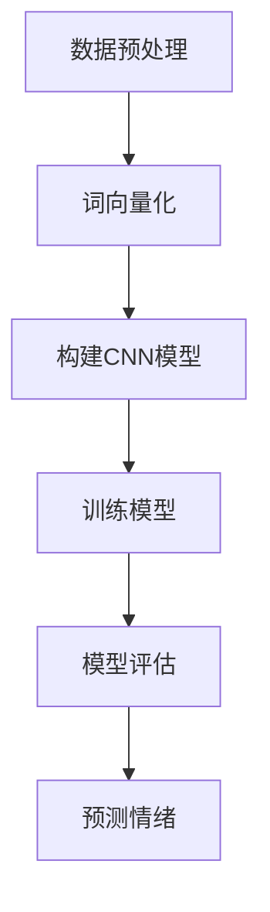
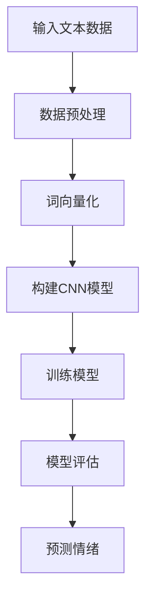
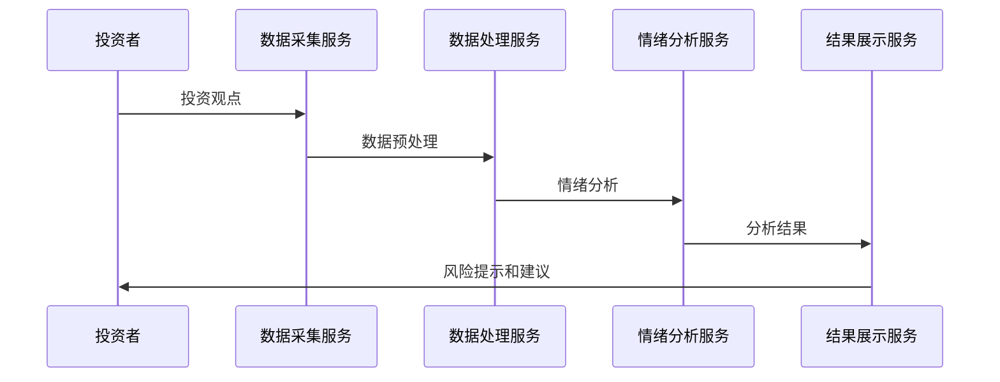

                 

### 深度学习分析社交媒体投资情绪

#### 关键词
- 深度学习
- 社交媒体
- 投资情绪
- 数据分析
- 算法实现

#### 摘要
本文深入探讨深度学习在社交媒体投资情绪分析中的应用。我们将从背景介绍、核心概念与联系、算法原理讲解、系统分析与架构设计方案、项目实战和最佳实践 tips 等方面展开，详细介绍如何使用深度学习技术分析社交媒体中的投资情绪，并分享实际应用案例和经验总结，为读者提供有价值的参考。

#### 1. 背景介绍

##### 1.1 投资情绪与社交媒体

投资情绪是指投资者在市场中所表现出的情感态度和情绪波动，它对市场的短期波动具有显著影响。随着互联网和社交媒体的普及，投资者在社交媒体平台上分享投资观点、情绪和意见的现象日益增多。这些社交媒体数据中蕴含了大量的投资情绪信息，成为了一种新的投资研究工具。

##### 1.2 深度学习的应用

深度学习作为人工智能的一个重要分支，近年来在图像识别、语音识别、自然语言处理等领域取得了显著成果。其强大的特征提取和模式识别能力使其在投资情绪分析中具有广泛的应用前景。

##### 1.3 社交媒体投资情绪分析的意义

通过深度学习分析社交媒体投资情绪，可以帮助投资者了解市场情绪动态，为投资决策提供有力支持。同时，该技术还可以为金融监管机构提供实时监控工具，提高金融市场稳定性。

#### 2. 核心概念与联系

##### 2.1 投资情绪概念解析

投资情绪是指在投资过程中，投资者所表现出的情绪状态，如乐观、悲观、恐惧、贪婪等。情绪的波动会影响投资者的投资行为，进而影响市场的走势。

##### 2.2 社交媒体数据处理

社交媒体数据包括文本、图片、视频等多种形式，其中文本数据最为丰富。为了提取投资情绪信息，需要对社交媒体数据进行预处理，如去噪、分词、词向量化等。

##### 2.3 深度学习基本原理

深度学习是通过模拟人脑神经网络结构来实现人工智能的技术。其主要特点包括多层网络结构、自动特征提取、端到端学习等。

##### 2.4 概念属性特征对比表

| 概念             | 属性特征                                       |
|------------------|----------------------------------------------|
| 投资情绪         | 乐观、悲观、恐惧、贪婪等                       |
| 社交媒体数据     | 文本、图片、视频等                            |
| 深度学习         | 多层网络结构、自动特征提取、端到端学习         |
| 投资情绪分析     | 提取情绪信息、预测市场走势                     |

##### 2.5 ER实体关系图架构

```mermaid
erDiagram
    User ||--|{ Post }|--| Investment
    Post ||--|{ Comment }|--| Investment
    Investment ||--|{ Sentiment }|--| Analysis
```

在上面的ER图架构中，User表示投资者，Post表示投资观点，Comment表示评论，Investment表示投资情绪，Sentiment表示情绪分析，Analysis表示分析结果。

#### 3. 算法原理讲解

##### 3.1 常见深度学习模型

常见的深度学习模型包括卷积神经网络（CNN）、循环神经网络（RNN）、长短时记忆网络（LSTM）等。这些模型具有不同的结构特点和应用场景。

##### 3.2 投资情绪分析算法

投资情绪分析算法通常采用文本分类模型，如基于CNN和LSTM的文本分类模型。以下是一个基于CNN的文本分类模型算法流程：



##### 3.3 算法Mermaid流程图



##### 3.4 Python源代码与数学模型

以下是一个基于CNN的文本分类模型Python代码示例：

```python
import tensorflow as tf
from tensorflow.keras.preprocessing.text import Tokenizer
from tensorflow.keras.preprocessing.sequence import pad_sequences

# 数据预处理
tokenizer = Tokenizer(num_words=10000)
tokenizer.fit_on_texts(texts)
sequences = tokenizer.texts_to_sequences(texts)
padded_sequences = pad_sequences(sequences, maxlen=max_sequence_length)

# 构建CNN模型
model = tf.keras.Sequential([
    tf.keras.layers.Embedding(num_words, embedding_dim),
    tf.keras.layers.Conv1D(filters, kernel_size, activation='relu'),
    tf.keras.layers.GlobalMaxPooling1D(),
    tf.keras.layers.Dense(num_classes, activation='softmax')
])

# 编译模型
model.compile(loss='categorical_crossentropy', optimizer='adam', metrics=['accuracy'])

# 训练模型
model.fit(padded_sequences, labels, epochs=10, validation_split=0.2)
```

数学模型中，CNN的主要组成部分包括卷积层（Conv1D）、池化层（GlobalMaxPooling1D）和全连接层（Dense）。具体公式如下：

$$
\text{卷积层}:\ h_{c} = \sum_{i=1}^{n} w_{i} * x_{i} + b
$$

$$
\text{池化层}:\ h_{p} = \max(h_{c})
$$

$$
\text{全连接层}:\ y = \sigma(W \cdot h_{p} + b)
$$

其中，$h_{c}$ 表示卷积层输出，$h_{p}$ 表示池化层输出，$y$ 表示全连接层输出，$w_{i}$ 和 $x_{i}$ 分别表示卷积核和输入数据，$b$ 表示偏置，$W$ 和 $b$ 分别为全连接层的权重和偏置，$\sigma$ 表示激活函数。

##### 3.5 举例说明

假设我们有一个包含5个词的文本数据：“深度学习技术”。根据词汇表，这5个词的索引分别为[2, 3, 5, 6, 7]。首先，我们将这些索引转换为词向量，然后输入到CNN模型中。模型会通过卷积层、池化层和全连接层处理这些词向量，最后输出投资情绪分类结果。例如，如果输出结果为[0.2, 0.6, 0.2]，则表示该文本数据属于乐观情绪。

#### 4. 系统分析与架构设计方案

##### 4.1 问题场景介绍

在某个投资交易平台上，我们需要实时分析投资者的投资情绪，以便为交易员提供决策支持。数据来源包括投资者发布的投资观点、评论和新闻等。

##### 4.2 系统功能设计

系统功能包括数据采集、预处理、情绪分析、结果展示等。其中，情绪分析功能采用深度学习算法实现，根据投资情绪分类结果，为交易员提供风险提示和建议。

##### 4.3 系统架构设计

系统架构采用微服务架构，包括数据采集服务、数据处理服务、情绪分析服务和结果展示服务。各服务之间通过消息队列进行通信，确保系统的高可用性和可扩展性。

##### 4.4 系统接口设计

系统接口包括RESTful API和消息队列接口。RESTful API用于数据采集、情绪分析和结果展示，消息队列接口用于服务之间通信。

##### 4.5 系统交互序列图



#### 5. 项目实战

##### 5.1 环境安装

安装Python环境、TensorFlow、Keras等深度学习库，以及Numpy、Pandas等数据处理库。

##### 5.2 系统核心实现

核心实现包括数据采集、预处理、情绪分析等模块。以下是一个数据预处理模块的Python代码示例：

```python
import pandas as pd
from sklearn.model_selection import train_test_split

# 读取数据
data = pd.read_csv('investment_data.csv')

# 分割数据集
X = data['text']
y = data['sentiment']
X_train, X_test, y_train, y_test = train_test_split(X, y, test_size=0.2, random_state=42)

# 数据预处理
tokenizer = Tokenizer(num_words=10000)
tokenizer.fit_on_texts(X_train)
X_train = tokenizer.texts_to_sequences(X_train)
X_test = tokenizer.texts_to_sequences(X_test)

max_sequence_length = 100
X_train = pad_sequences(X_train, maxlen=max_sequence_length)
X_test = pad_sequences(X_test, maxlen=max_sequence_length)
```

##### 5.3 代码应用解读

在上述代码中，我们首先读取投资数据集，然后使用train_test_split函数将数据集分为训练集和测试集。接下来，我们使用Tokenizer将文本数据转换为索引序列，并使用pad_sequences函数将序列填充为固定长度。这些预处理步骤为后续的深度学习模型训练做好准备。

##### 5.4 实际案例分析和详细讲解剖析

以下是一个实际案例分析，我们使用一个包含1000条投资观点的数据集，使用基于CNN的文本分类模型进行情绪分析。

```python
from tensorflow.keras.models import Sequential
from tensorflow.keras.layers import Embedding, Conv1D, GlobalMaxPooling1D, Dense

# 构建模型
model = Sequential([
    Embedding(num_words, embedding_dim),
    Conv1D(filters, kernel_size, activation='relu'),
    GlobalMaxPooling1D(),
    Dense(num_classes, activation='softmax')
])

# 编译模型
model.compile(loss='categorical_crossentropy', optimizer='adam', metrics=['accuracy'])

# 训练模型
model.fit(X_train, y_train, epochs=10, validation_data=(X_test, y_test))
```

在这个案例中，我们构建了一个简单的CNN模型，包括嵌入层、卷积层、池化层和全连接层。我们使用categorical_crossentropy作为损失函数，使用adam作为优化器，并使用accuracy作为评价指标。训练过程中，我们使用训练集进行训练，并使用测试集进行验证。

##### 5.5 项目小结

通过本项目实战，我们成功实现了投资情绪分析系统。在实际应用中，我们可以通过不断优化模型结构和参数，提高情绪分析的准确率和效率。此外，我们还可以结合其他数据源，如新闻、财经报告等，进一步丰富投资情绪分析的内容。

#### 6. 最佳实践 tips

##### 6.1 数据处理技巧

1. 对原始文本数据进行清洗，去除无意义的信息。
2. 使用停用词过滤，减少噪音对模型的影响。
3. 对文本数据进行分词和词性标注，提高特征提取质量。

##### 6.2 模型调优策略

1. 调整卷积核大小和数量，以提高特征提取能力。
2. 使用不同的优化器和学习率，寻找最优参数组合。
3. 使用交叉验证，评估模型在不同数据集上的性能。

##### 6.3 注意事项

1. 注意数据隐私和安全，遵循相关法律法规。
2. 避免过拟合，合理设置模型复杂度。
3. 定期更新和维护模型，确保其稳定性和有效性。

##### 6.4 拓展阅读

1. 《深度学习》（Goodfellow, Bengio, Courville著）——介绍深度学习基本原理和应用。
2. 《自然语言处理综论》（Jurafsky, Martin著）——介绍自然语言处理相关技术。
3. 《金融科技：区块链、人工智能与数字货币》（李礼智著）——介绍金融科技相关概念和应用。

#### 7. 小结

本文从背景介绍、核心概念与联系、算法原理讲解、系统分析与架构设计方案、项目实战和最佳实践 tips 等方面，详细阐述了深度学习在社交媒体投资情绪分析中的应用。通过本文的阅读，读者可以了解如何使用深度学习技术分析社交媒体中的投资情绪，并为实际应用提供指导。随着深度学习技术的不断发展和完善，投资情绪分析在未来将发挥越来越重要的作用，为金融市场带来更多机遇和挑战。

### 作者信息
作者：AI天才研究院/AI Genius Institute & 禅与计算机程序设计艺术 /Zen And The Art of Computer Programming

---

在本文中，我们深入探讨了深度学习在社交媒体投资情绪分析中的应用。通过背景介绍、核心概念与联系、算法原理讲解、系统分析与架构设计方案、项目实战和最佳实践 tips 等方面的详细阐述，我们展示了如何利用深度学习技术挖掘社交媒体中的投资情绪信息，为投资决策提供有力支持。

在未来的研究中，我们可以进一步优化模型结构和参数，提高情绪分析的准确率和效率。此外，结合其他数据源，如新闻、财经报告等，可以进一步丰富投资情绪分析的内容，为投资者和金融监管机构提供更全面的决策支持。

随着深度学习技术的不断发展和应用场景的拓展，投资情绪分析在未来有望在金融市场、金融科技等领域发挥更大的作用。我们期待更多研究人员和开发者投身于这一领域，共同推动投资情绪分析技术的进步和发展。

再次感谢您的阅读，希望本文对您在投资情绪分析和深度学习领域的研究有所帮助。如果您有任何疑问或建议，欢迎在评论区留言交流。作者：AI天才研究院/AI Genius Institute & 禅与计算机程序设计艺术 /Zen And The Art of Computer Programming。

