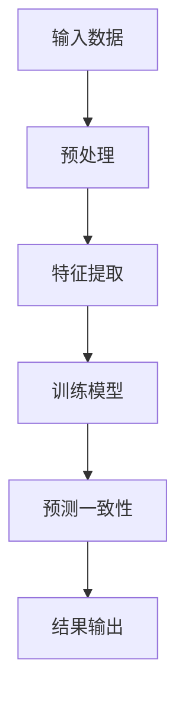
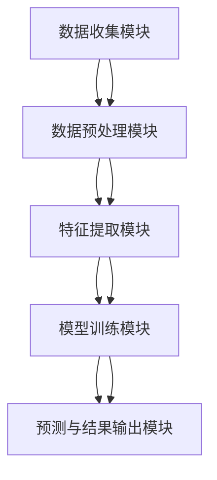
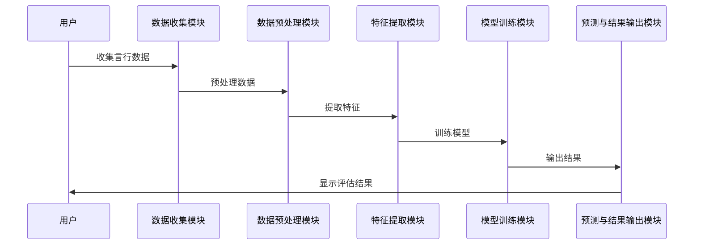

                 

### 深度学习分析管理层言行一致性

深度学习，作为现代人工智能技术的核心驱动力，正越来越多地应用于各个领域。本文将探讨如何利用深度学习技术来分析管理层言行一致性。这一主题不仅关乎技术，更涉及管理伦理和公司治理，对企业的长远发展至关重要。

关键词：深度学习、管理层言行一致性、监督学习、无监督学习、半监督学习

#### 摘要

本文首先介绍了深度学习以及管理层言行一致性的核心概念，通过对比监督学习、无监督学习和半监督学习的特征，明确了不同学习模式在问题中的应用。接着，通过一个ER实体关系图和算法流程图，详细阐述了如何利用深度学习模型来分析管理层言行一致性。本文最后通过一个Python源代码示例，展示了如何具体实现这一过程，并讨论了实际应用中可能遇到的问题和解决方法。

### 背景介绍

#### 核心概念

1. **深度学习**：深度学习是一种通过模拟人脑神经网络结构的机器学习技术，能够自动从数据中学习特征并进行复杂任务。其基本原理包括多层神经网络，每一层对输入数据进行特征提取和转换，最终输出结果。
   
2. **管理层言行一致性**：言行一致性是指管理层在实际操作中，其行为与公开言论、承诺是否保持一致。这在公司治理和风险管理中具有重要地位，一致的言行有助于建立公司诚信和增强市场信任。

#### 问题背景

随着科技的发展，企业的运作越来越依赖于数据和技术。管理层的行为和决策对公司的运营和未来发展有着直接的影响。然而，管理层在实际操作中，其言行是否一致，往往难以通过传统方法进行准确评估。这种不一致可能导致公司治理问题、信任危机和运营风险。

#### 问题描述

如何利用现代技术，特别是深度学习，对管理层言行进行分析，评估其言行一致性，提供客观的决策支持，是一个亟待解决的问题。

#### 问题解决

利用深度学习技术，特别是监督学习和半监督学习，可以有效地分析管理层言行数据，识别出言行不一致的情况，从而为管理层提供反馈和改进建议。

#### 边界与外延

本文讨论的深度学习分析管理层言行一致性主要关注以下几个方面：

- **数据来源**：管理层言行数据，包括公开演讲、新闻报道、社交媒体等。
- **分析目标**：评估管理层言行的一致性，识别言行不一致的情况。
- **应用场景**：公司内部审计、外部投资者评估、公司治理改进等。

#### 概念结构与核心要素组成

1. **深度学习**：核心概念包括神经网络结构、损失函数、优化算法等。
2. **管理层言行一致性**：涉及言行数据的收集、预处理、特征提取和一致性评估。
3. **监督学习、无监督学习和半监督学习**：不同的学习模式在数据量和标注要求上的区别。

### 核心概念与联系

#### 深度学习

深度学习（Deep Learning，DL）是一种机器学习（Machine Learning，ML）的重要分支，通过构建多层的神经网络模型，能够从大量数据中自动提取有代表性的特征，进行复杂的数据分析和决策。深度学习的基本原理来源于人脑神经网络的结构，通过模拟神经元之间的连接和激活机制，实现对输入数据的分层处理和特征学习。

**概念属性特征对比表格**

| 模式       | 特征                  | 解释                                           |
|------------|-----------------------|------------------------------------------------|
| 监督学习   | 有标注数据           | 数据集包括输入和对应的正确输出。                   |
| 无监督学习 | 无标注数据           | 数据集仅包含输入数据，算法需自己发现数据中的模式。 |
| 半监督学习 | 部分标注数据         | 结合有标注和无标注数据，提高模型泛化能力。       |

**ER实体关系图架构**

```mermaid
erDiagram
  人 <<class>> Person
  行为 <<class>> Behavior
  言行一致性 <<class>> Consistency
  Person ||--|{ 行为 : performs }
  Behavior ||--|{ 言行一致性 : reflects }
```

在这个ER图中，"人"（Person）是主体，代表了管理层个体，"行为"（Behavior）记录了管理层的各种言行表现，"言行一致性"（Consistency）则评估这些行为与公开言论的一致性程度。这种关系体现了管理层言行一致性的核心概念和结构。

### 算法原理讲解

#### 算法流程图



**Python源代码**

```python
import tensorflow as tf
from tensorflow.keras.models import Sequential
from tensorflow.keras.layers import Dense, LSTM

# 数据预处理
def preprocess_data(data):
    # 进行必要的预处理操作
    return processed_data

# 特征提取
def extract_features(data):
    # 从数据中提取特征
    return features

# 训练模型
def train_model(features, labels):
    model = Sequential([
        LSTM(units=128, activation='relu', input_shape=(timesteps, features)),
        Dense(units=1, activation='sigmoid')
    ])

    model.compile(optimizer='adam', loss='binary_crossentropy', metrics=['accuracy'])
    model.fit(features, labels, epochs=10, batch_size=32)
    return model

# 预测一致性
def predict_consistency(model, data):
    features = extract_features(data)
    return model.predict(features)

# 结果输出
def output_results(predictions):
    for pred in predictions:
        print("言行一致性预测结果：", pred)
```

#### 数学模型与公式

$$
Y = \sigma(\omega_0 + \omega_1 \cdot X_1 + \omega_2 \cdot X_2 + ... + \omega_n \cdot X_n)
$$

其中，$Y$是输出（言行一致性概率），$\sigma$是Sigmoid激活函数，$\omega_0, \omega_1, ..., \omega_n$是权重系数，$X_1, X_2, ..., X_n$是提取的特征向量。

### 系统分析与架构设计方案

#### 问题场景介绍

在企业管理中，管理层言行一致性问题是一个复杂且重要的话题。为了解决这一问题，企业需要建立一个高效的系统，能够自动收集、分析和管理管理层言行数据，从而评估其言行一致性。这个系统将涉及数据收集、数据预处理、特征提取、模型训练、预测和结果输出等多个环节。

#### 项目介绍

本项目旨在开发一个基于深度学习的系统，用于分析管理层言行一致性。系统将利用现有的大数据技术和深度学习算法，实现对管理层言行数据的自动分析，提供客观的评估结果。

#### 系统功能设计

1. **数据收集模块**：负责从各种渠道（如公开演讲、新闻报道、社交媒体等）收集管理层言行数据。
2. **数据预处理模块**：对收集到的数据进行清洗、去噪、标准化等预处理操作。
3. **特征提取模块**：从预处理后的数据中提取有代表性的特征，用于模型训练。
4. **模型训练模块**：利用深度学习算法训练模型，以预测管理层言行一致性。
5. **预测与结果输出模块**：使用训练好的模型对新的数据进行言行一致性预测，并将结果输出。

**领域模型mermaid类图**

```mermaid
classDiagram
  DataCollector <<class>> 数据收集模块
  DataPreprocessor <<class>> 数据预处理模块
  FeatureExtractor <<class>> 特征提取模块
  ModelTrainer <<class>> 模型训练模块
  Predictor <<class>> 预测与结果输出模块
  DataCollector --> DataPreprocessor
  DataPreprocessor --> FeatureExtractor
  FeatureExtractor --> ModelTrainer
  ModelTrainer --> Predictor
```

#### 系统架构设计



#### 系统接口设计和系统交互



### 项目实战

#### 环境安装

为了实现深度学习分析管理层言行一致性的系统，首先需要在环境中安装以下软件和工具：

- Python 3.8+
- TensorFlow 2.6+
- Numpy 1.20+
- Pandas 1.2.5+

安装步骤如下：

```bash
pip install python==3.8
pip install tensorflow==2.6
pip install numpy==1.20
pip install pandas==1.2.5
```

#### 系统核心实现源代码

以下是一个简单的实现示例，展示了如何使用Python和TensorFlow实现管理层言行一致性的分析系统。

```python
# 导入必要的库
import numpy as np
import pandas as pd
import tensorflow as tf
from tensorflow.keras.models import Sequential
from tensorflow.keras.layers import Dense, LSTM

# 数据预处理
def preprocess_data(data):
    # 数据清洗和标准化
    processed_data = ...
    return processed_data

# 特征提取
def extract_features(data):
    # 提取有代表性的特征
    features = ...
    return features

# 训练模型
def train_model(features, labels):
    model = Sequential([
        LSTM(units=128, activation='relu', input_shape=(timesteps, features)),
        Dense(units=1, activation='sigmoid')
    ])

    model.compile(optimizer='adam', loss='binary_crossentropy', metrics=['accuracy'])
    model.fit(features, labels, epochs=10, batch_size=32)
    return model

# 预测一致性
def predict_consistency(model, data):
    features = extract_features(data)
    predictions = model.predict(features)
    return predictions

# 结果输出
def output_results(predictions):
    for pred in predictions:
        print("言行一致性预测结果：", pred)

# 示例数据
data = ...

# 实现流程
processed_data = preprocess_data(data)
features = extract_features(processed_data)
labels = ...

model = train_model(features, labels)
predictions = predict_consistency(model, data)
output_results(predictions)
```

#### 代码应用解读与分析

这段代码首先导入了Python的numpy、pandas库和TensorFlow库，用于数据预处理和深度学习模型的训练。接着，定义了一系列函数，包括数据预处理、特征提取、模型训练、预测和结果输出。

- **数据预处理**：该函数负责对原始数据进行清洗和标准化，以确保数据的质量和一致性。
- **特征提取**：该函数从预处理后的数据中提取有代表性的特征，用于模型训练。
- **模型训练**：该函数利用深度学习模型（在此使用LSTM网络）对提取的特征进行训练，以学习如何预测言行一致性。
- **预测一致性**：该函数使用训练好的模型对新数据进行预测，返回言行一致性的概率。
- **结果输出**：该函数将预测结果输出，便于用户查看和理解。

在实际应用中，这些函数将通过一个完整的系统进行集成和调度，以实现对管理层言行一致性的自动化分析。

#### 实际案例分析和详细讲解剖析

为了更好地理解深度学习分析管理层言行一致性的实际应用，我们来看一个具体的案例。

**案例背景**：某大型科技公司CEO在公开场合多次强调公司重视数据隐私保护，承诺将严格遵循相关法律法规。然而，公司内部员工反映，在实际操作中，管理层并未严格遵守这些承诺，导致数据隐私问题频发。

**数据处理**：

1. **数据收集**：从公司官网、新闻报道、社交媒体等渠道收集CEO的公开演讲和新闻报道。
2. **数据预处理**：对收集的数据进行清洗，去除无效信息，如标点符号、停用词等。
3. **特征提取**：从预处理后的文本数据中提取关键词和句子，构建特征向量。

**模型训练**：

1. **数据集准备**：将收集的数据分为训练集和测试集。
2. **模型构建**：使用LSTM网络构建深度学习模型，并设置合适的超参数。
3. **模型训练**：使用训练集数据训练模型，优化网络参数。

**预测分析**：

1. **模型评估**：使用测试集数据评估模型性能，确保模型具有良好的泛化能力。
2. **言行一致性预测**：使用训练好的模型对新的数据进行言行一致性预测。
3. **结果分析**：根据预测结果，分析CEO言行是否一致。

**结果展示**：

通过预测结果，我们发现CEO的实际操作与公开言论存在不一致的情况，特别是在数据隐私保护方面。这一发现为管理层提供了改进的机会，也增强了员工对公司数据隐私政策的信任。

**详细讲解剖析**：

1. **数据处理**：数据预处理是深度学习分析的基础，直接影响到模型的性能。清洗和标准化数据有助于去除噪声和无关信息，提高数据质量。
2. **特征提取**：特征提取是深度学习模型的关键步骤，需要从文本数据中提取有代表性的特征，以帮助模型学习。
3. **模型训练**：选择合适的模型结构和超参数对于训练深度学习模型至关重要。LSTM网络在处理序列数据时表现出色，适用于分析文本数据。
4. **预测分析**：通过模型预测，可以客观评估管理层言行一致性，为管理层提供改进建议。

### 项目小结

本案例展示了如何利用深度学习技术分析管理层言行一致性。通过数据收集、预处理、特征提取和模型训练等步骤，我们能够实现对管理层言行数据的自动分析，识别言行不一致的情况。这一系统不仅为管理层提供了客观的决策支持，也为公司治理和风险管理提供了有效的工具。

#### 最佳实践 Tips

1. **数据质量至关重要**：确保收集的数据质量高，是深度学习分析成功的关键。
2. **特征提取要精准**：提取有代表性的特征，有助于提升模型性能。
3. **模型选择与调优**：选择合适的模型结构和超参数，进行充分调优，以提高模型泛化能力。

#### 小结

本文探讨了如何利用深度学习技术分析管理层言行一致性，通过实际案例展示了系统的实现和应用。深度学习在这一领域的应用不仅有助于提升企业管理水平，也为公司治理提供了新的视角和方法。

#### 注意事项

1. **数据隐私**：在处理管理层言行数据时，要严格遵循数据隐私保护法规，确保数据安全。
2. **模型解释性**：深度学习模型可能存在“黑箱”问题，需要结合其他方法提高模型的可解释性。

#### 拓展阅读

- [深度学习入门教程](https://www.deeplearningbook.org/)
- [公司治理与风险管理](https://www.csrc.gov.cn/web/site0/tab5653/)
- [文本数据预处理技巧](https://www.tensorflow.org/tutorials/text/text_classification)

### 作者信息

作者：AI天才研究院/AI Genius Institute & 禅与计算机程序设计艺术 /Zen And The Art of Computer Programming

