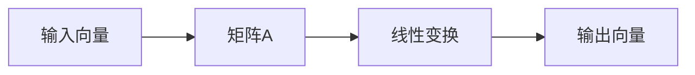
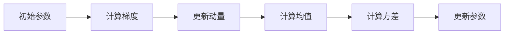
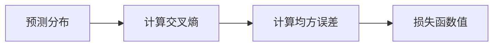
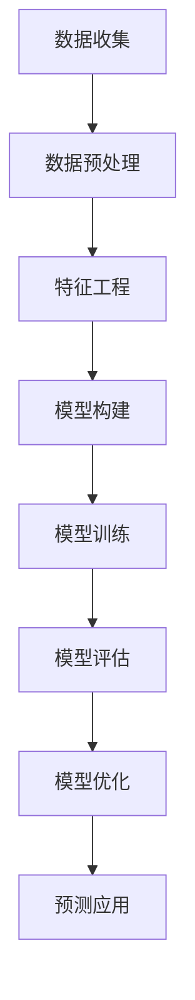
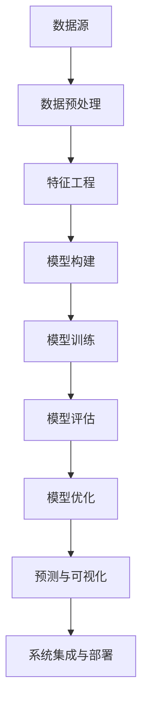
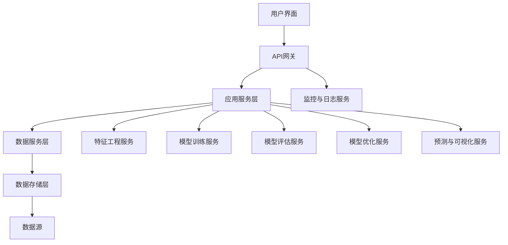
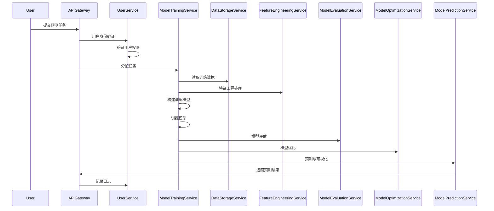

                 


### 引言与背景介绍

随着科技的飞速发展，人工智能已经成为推动产业变革的重要力量。其中，深度学习作为人工智能的一个重要分支，不仅在学术研究领域取得了巨大的突破，更在实际应用中展现了强大的潜力。深度学习通过模拟人脑神经网络的结构和功能，实现自动特征提取、模式识别和预测等功能。这使得深度学习在图像识别、自然语言处理、语音识别等领域取得了显著成果。

在商业领域，公司创新突破已成为企业持续发展的关键。然而，如何准确预测公司的创新突破，从而制定有效的战略规划，一直是企业面临的重要挑战。深度学习作为一种强大的预测工具，可以在海量数据中挖掘潜在的创新趋势，为公司提供有价值的决策支持。

本文旨在探讨如何利用深度学习预测公司创新突破。我们将首先介绍深度学习的基本概念和预测模型，然后分析深度学习在商业预测中的应用，最后通过具体的案例和实践，展示如何构建和优化深度学习预测模型。

### 文章关键词

- 深度学习
- 预测模型
- 公司创新
- 数据分析
- 人工智能
- 算法优化

### 文章摘要

本文首先介绍了深度学习的基本概念和预测模型，分析了深度学习在商业预测中的应用背景和优势。接着，通过具体案例，展示了如何利用深度学习预测公司创新突破。文章详细阐述了数据预处理、特征工程、模型构建和优化等关键步骤，并提供了实际案例的实战经验和优化技巧。最后，文章总结了最佳实践和注意事项，为读者提供了深入学习和应用的指导。

## 第1章 深度学习与预测模型基础

### 1.1 深度学习的核心概念与原理

#### 1.1.1 深度学习的定义与发展历程

深度学习（Deep Learning）是机器学习的一个子领域，主要基于人工神经网络（Artificial Neural Networks, ANN）的理论，通过模拟人脑神经系统的工作方式，实现自动特征提取和复杂模式识别。与传统机器学习相比，深度学习具有更好的泛化能力和强大的非线性处理能力。

深度学习的发展历程可以追溯到1980年代。当时，人工神经网络的研究主要集中在简单的感知机（Perceptron）和多层感知机（Multilayer Perceptron, MLP）上。但由于计算能力和数据资源的限制，这些模型在实际应用中效果有限。

随着计算机硬件技术的飞速发展和大数据时代的到来，深度学习在2010年后迎来了爆发式的发展。特别是卷积神经网络（Convolutional Neural Networks, CNN）和递归神经网络（Recurrent Neural Networks, RNN）的出现，使得深度学习在图像识别、语音识别、自然语言处理等领域取得了重大突破。

#### 1.1.2 神经网络的基本结构

神经网络由大量的神经元（或称为节点）组成，这些神经元通过权重连接形成一个网络结构。一个基本的神经网络通常包括以下几个部分：

- 输入层（Input Layer）：接收外部输入数据，每个输入数据对应一个神经元。
- 隐藏层（Hidden Layers）：进行特征提取和转换，可以有一个或多个隐藏层。
- 输出层（Output Layer）：输出预测结果或分类标签。

神经网络的工作原理是通过对输入数据进行多层非线性变换，逐步提取隐藏特征，最终在输出层得到预测结果。这个过程可以通过正向传播（Forward Propagation）和反向传播（Back Propagation）两个阶段来完成。

#### 1.1.3 深度学习的主要算法

深度学习的主要算法包括：

- 卷积神经网络（Convolutional Neural Networks, CNN）：主要用于图像和视频数据的处理。通过卷积操作和池化操作，实现特征提取和降维。
- 递归神经网络（Recurrent Neural Networks, RNN）：主要用于序列数据的处理。通过循环结构，实现长期依赖关系的建模。
- 生成对抗网络（Generative Adversarial Networks, GAN）：用于生成数据的训练，通过生成器和判别器的对抗训练，实现高质量数据的生成。
- 自编码器（Autoencoders）：用于数据降维和特征提取，通过编码器和解码器的协同工作，实现数据的重构。

这些算法在具体应用中各有优势，可以根据不同的应用场景选择合适的算法。

### 1.2 预测模型的基本原理与构建

#### 1.2.1 预测模型的概念与类型

预测模型（Predictive Model）是用于预测未来事件或趋势的数学模型。根据预测对象的不同，预测模型可以分为时间序列预测模型、分类预测模型和回归预测模型等。

- 时间序列预测模型：用于预测时间序列数据未来的趋势。常见的算法有ARIMA、LSTM等。
- 分类预测模型：用于预测样本的类别。常见的算法有逻辑回归、SVM、决策树等。
- 回归预测模型：用于预测样本的连续值。常见的算法有线性回归、决策树回归等。

#### 1.2.2 预测模型的基本流程

一个典型的预测模型构建过程通常包括以下几个步骤：

1. 数据收集：收集与预测对象相关的数据，如历史销售数据、客户行为数据等。
2. 数据预处理：对原始数据进行清洗、填充、转换等处理，使其满足模型训练的要求。
3. 特征工程：从原始数据中提取有效的特征，以增强模型的预测能力。
4. 模型选择：选择合适的预测模型，并通过交叉验证等方法选择最佳模型。
5. 模型训练：使用训练数据对模型进行训练，调整模型参数。
6. 模型评估：使用验证数据评估模型的预测性能，如准确率、召回率、均方误差等。
7. 模型优化：根据评估结果，对模型进行调整和优化，提高预测性能。

#### 1.2.3 常见预测模型的优缺点分析

以下是对常见预测模型的优缺点分析：

- 逻辑回归（Logistic Regression）：优点：简单易懂，易于实现和解释；缺点：只能处理二分类问题，无法处理多分类问题。
- 决策树（Decision Tree）：优点：易于理解和解释，可以处理多分类问题；缺点：容易过拟合，预测性能较差。
- 支持向量机（SVM）：优点：强大的分类能力，可以处理高维数据；缺点：对参数敏感，训练时间较长。
- 卷积神经网络（CNN）：优点：强大的特征提取能力，可以处理图像和视频数据；缺点：需要大量训练数据，训练时间较长。
- 递归神经网络（RNN）：优点：可以处理序列数据，实现长期依赖关系的建模；缺点：容易梯度消失和梯度爆炸问题。

选择合适的预测模型需要根据具体的应用场景和数据特征进行综合考虑。

### 1.3 深度学习在预测中的应用实例

#### 1.3.1 预测模型的构建流程

深度学习在预测模型中的应用主要包括以下步骤：

1. 数据收集：收集与预测对象相关的数据，如历史销售数据、客户行为数据等。
2. 数据预处理：对原始数据进行清洗、填充、转换等处理，使其满足模型训练的要求。
3. 特征工程：从原始数据中提取有效的特征，以增强模型的预测能力。对于图像和视频数据，可以通过卷积神经网络进行特征提取；对于序列数据，可以通过递归神经网络进行特征提取。
4. 模型构建：选择合适的深度学习算法，如卷积神经网络（CNN）、递归神经网络（RNN）、生成对抗网络（GAN）等，构建预测模型。
5. 模型训练：使用训练数据对模型进行训练，调整模型参数。
6. 模型评估：使用验证数据评估模型的预测性能，如准确率、召回率、均方误差等。
7. 模型优化：根据评估结果，对模型进行调整和优化，提高预测性能。

#### 1.3.2 预测模型的优化技巧

在构建深度学习预测模型时，可以采用以下技巧进行优化：

1. 数据增强：通过数据增强技术，如旋转、翻转、缩放等，增加训练数据的多样性，提高模型的泛化能力。
2. 正则化：使用正则化方法，如L1正则化、L2正则化等，防止模型过拟合。
3. 优化算法：选择合适的优化算法，如Adam、RMSprop等，提高模型训练速度和收敛速度。
4. 模型集成：使用模型集成方法，如Bagging、Boosting等，提高模型的预测性能。
5. 特征选择：通过特征选择方法，如特征重要性评估、特征交互等，筛选有效的特征，提高模型性能。

通过以上优化技巧，可以显著提高深度学习预测模型的性能和稳定性。

### 1.3.3 预测模型的评估与改进

在构建深度学习预测模型后，需要对其性能进行评估和改进。以下是一些常用的评估指标和方法：

1. 准确率（Accuracy）：预测结果与实际结果一致的比例。适用于分类问题。
2. 召回率（Recall）：在所有实际为正例的样本中，被预测为正例的比例。适用于分类问题。
3. 精确率（Precision）：在所有预测为正例的样本中，实际为正例的比例。适用于分类问题。
4. F1值（F1-score）：精确率和召回率的调和平均，适用于分类问题。
5. 均方误差（Mean Squared Error, MSE）：回归问题中预测值与实际值之间误差的平方的平均值。
6. 平均绝对误差（Mean Absolute Error, MAE）：回归问题中预测值与实际值之间误差的平均绝对值。

在评估模型性能后，可以针对评估结果进行模型改进。例如，通过增加训练数据、调整模型参数、优化算法等手段，提高模型的预测性能。

通过以上步骤，可以构建和优化深度学习预测模型，为公司创新突破提供有力的支持。

## 第2章 预测模型在实际中的应用

### 2.1 预测模型在公司创新突破中的应用场景

公司创新突破是企业在市场竞争中保持领先地位的重要途径。然而，创新往往涉及大量的不确定性，如何准确预测创新的成功与否，成为企业面临的一个重要挑战。深度学习作为一种强大的预测工具，可以在海量数据中挖掘潜在的创新趋势，为公司提供有价值的决策支持。

以下是一些深度学习在预测公司创新突破中的应用场景：

1. **新产品预测**：通过对市场数据、用户反馈和公司内部研发数据进行分析，深度学习模型可以预测新产品的市场前景，帮助公司决定是否进行新产品开发。
2. **技术趋势预测**：通过对技术专利、行业报告、学术论文等文献的分析，深度学习模型可以预测未来可能出现的技术趋势，为公司布局研发提供指导。
3. **竞争态势预测**：通过对竞争对手的市场行为、产品特点、营销策略等数据进行分析，深度学习模型可以预测竞争对手的下一步行动，帮助公司制定应对策略。
4. **投资决策预测**：通过对市场数据、财务报表、行业趋势等数据进行分析，深度学习模型可以预测某个投资项目的前景，帮助公司做出明智的投资决策。
5. **风险评估**：通过对历史数据和行业数据进行分析，深度学习模型可以预测公司创新项目的风险，为公司的风险管理提供支持。

### 2.1.2 创新突破预测的优势与挑战

#### 创新突破预测的优势

1. **数据驱动的决策支持**：深度学习模型可以处理海量数据，挖掘数据中的潜在模式和趋势，为公司提供数据驱动的决策支持。
2. **提高预测准确性**：通过训练和优化，深度学习模型可以不断提高预测准确性，减少人为预测的误差。
3. **实时更新与调整**：深度学习模型可以根据新的数据不断更新和调整预测结果，保持预测的实时性和准确性。
4. **跨领域应用**：深度学习模型可以应用于多个领域，如金融、医疗、制造业等，为公司提供跨领域的创新预测支持。

#### 创新突破预测的挑战

1. **数据质量**：深度学习模型对数据质量有较高的要求，数据的不准确或缺失可能影响模型的预测性能。
2. **计算资源**：深度学习模型通常需要大量的计算资源和时间进行训练和优化，对计算资源要求较高。
3. **模型解释性**：深度学习模型通常具有复杂的结构和参数，难以直接解释预测结果，这给企业的决策带来了困难。
4. **行业适应性**：不同行业的数据特征和应用场景有所不同，需要针对特定行业进行模型调整和优化，提高预测的准确性。

### 2.1.3 成功案例分析

以下是一些利用深度学习预测公司创新突破的成功案例：

1. **案例一：新产品的市场预测**  
某家电子产品公司利用深度学习模型对新产品上市后的市场表现进行预测。通过对历史销售数据、用户反馈、市场竞争情况等多方面数据进行分析，模型预测出了新产品的市场需求和销售量。根据预测结果，公司调整了市场推广策略，并在新产品上市后实现了销售增长。

2. **案例二：技术趋势预测**  
某家软件公司利用深度学习模型对技术趋势进行预测。通过对专利申请、学术论文、行业报告等数据进行分析，模型预测出了未来可能出现的技术趋势。公司根据预测结果，加大了对相关技术的研发投入，成功在市场上抢占先机。

3. **案例三：竞争态势预测**  
某家医药公司利用深度学习模型对竞争对手的下一步行动进行预测。通过对竞争对手的产品发布、市场活动、专利申请等数据进行分析，模型预测出了竞争对手的下一步策略。公司根据预测结果，调整了自身的市场策略，有效应对了竞争对手的挑战。

4. **案例四：投资决策预测**  
某家投资公司利用深度学习模型对投资项目的前景进行预测。通过对市场数据、财务报表、行业趋势等数据进行分析，模型预测出了投资项目可能的收益和风险。公司根据预测结果，进行了明智的投资决策，取得了较高的投资回报。

通过以上成功案例可以看出，深度学习在预测公司创新突破方面具有显著的优势。然而，要实现有效的预测，还需要解决数据质量、计算资源、模型解释性等问题。未来，随着深度学习技术的不断发展和应用场景的拓展，深度学习在预测公司创新突破方面的应用将越来越广泛。

### 2.2 特征工程与数据处理

#### 2.2.1 特征工程的重要性

在构建深度学习预测模型时，特征工程（Feature Engineering）是至关重要的一步。特征工程是指从原始数据中提取或构造出对预测任务有用的特征，以提高模型的预测性能和解释性。有效的特征工程可以降低数据的复杂性，提高数据的可解释性，从而显著提升模型的准确性和泛化能力。

特征工程的重要性主要体现在以下几个方面：

1. **提升模型性能**：通过特征工程，可以将原始数据进行适当的转换和组合，提取出对预测任务更加有用的特征，从而提高模型的预测准确性。
2. **增强模型泛化能力**：有效的特征工程可以帮助模型更好地适应不同的数据分布和特征关系，提高模型的泛化能力，降低过拟合风险。
3. **改善模型可解释性**：通过特征工程，可以将原始数据转化为更容易理解的表示，有助于提高模型的可解释性，使企业能够更好地理解预测结果和模型决策过程。
4. **降低计算成本**：通过特征选择和特征降维，可以减少模型训练所需的数据量和计算时间，降低计算成本。

#### 2.2.2 数据预处理技巧

在深度学习预测模型构建过程中，数据预处理是至关重要的一步。良好的数据预处理可以确保模型训练的顺利进行，并提高模型的预测性能。以下是一些常见的数据预处理技巧：

1. **数据清洗**：清洗数据是数据预处理的首要任务，主要包括以下几种操作：
   - 填充缺失值：对于缺失值，可以采用均值填充、中值填充、前值填充等方法。
   - 去除重复数据：确保数据集的一致性和准确性。
   - 去除异常值：通过统计方法或可视化方法，识别并去除异常值。
   - 逻辑转换：将定性数据转换为定量数据，以便后续处理。

2. **数据标准化**：为了消除不同特征之间的尺度差异，通常需要对数据进行标准化处理。常用的标准化方法有：
   - 标准化（Z-score标准化）：将数据缩放到均值为0，标准差为1的范围内。
   - Min-Max标准化：将数据缩放到[0, 1]的范围内。

3. **数据归一化**：对于一些需要梯度下降优化的算法，如深度学习模型，通常需要对数据进行归一化处理，以加速收敛速度。常用的归一化方法有：
   - 均值归一化：将数据缩放到均值附近。
   - 方差归一化：将数据缩放到方差附近。

4. **数据分割**：将数据集分割为训练集、验证集和测试集，以评估模型的泛化能力。通常使用随机抽样、分层抽样等方法进行数据分割。

5. **数据增强**：通过数据增强技术，如随机旋转、缩放、裁剪等，增加训练数据的多样性，提高模型的泛化能力。

通过以上数据预处理技巧，可以有效地提高深度学习预测模型的性能和稳定性。

#### 2.2.3 特征选择与特征提取

在构建深度学习预测模型时，特征选择和特征提取是关键步骤。以下是一些常用的特征选择和特征提取方法：

1. **特征选择方法**：
   - 低方差特征去除：去除方差较小的特征，以提高模型的鲁棒性。
   - 基于模型的特征选择：利用模型训练结果，选择对模型预测性能有显著贡献的特征。
   - 相关性分析：通过计算特征之间的相关性，去除冗余特征。
   - 递归特征消除（RFE）：通过递归地去除最不重要的特征，逐步优化特征集合。

2. **特征提取方法**：
   - 主成分分析（PCA）：通过线性变换将原始数据投影到新的正交坐标系上，提取出最重要的特征。
   - t-SNE：通过非线性变换，将高维数据映射到二维或三维空间，以可视化特征之间的关系。
   - 卷积神经网络（CNN）：对于图像数据，可以通过卷积神经网络进行特征提取，实现自动特征学习。
   - 递归神经网络（RNN）：对于序列数据，可以通过递归神经网络提取时间序列特征。

通过特征选择和特征提取，可以显著提高深度学习预测模型的性能和可解释性。在实际应用中，可以根据具体的数据特征和预测任务选择合适的特征工程方法。

### 2.3 预测模型的实际应用案例分析

#### 2.3.1 案例一：公司新产品预测

**项目背景**：某家电子消费品公司计划推出一款新型智能手表，希望通过预测市场反应，优化产品设计和市场推广策略。

**数据集**：公司收集了以下数据：
- 历史销售数据：包括每月的销售量、销售额、市场份额等。
- 用户反馈数据：包括用户对产品的评价、评论、评分等。
- 市场竞争数据：包括竞争对手的产品特点、价格、市场份额等。
- 产品特征数据：包括产品的功能、外观、材质等。

**数据预处理**：对数据集进行清洗、填充缺失值、标准化等预处理操作，将定性数据转换为定量数据。

**特征工程**：提取以下特征：
- 用户评价分数：通过用户评论和评分计算得到的综合评分。
- 产品特征：将产品特征编码为数值，如功能数量、电池寿命等。
- 竞争对手数据：通过编码竞争对手的产品特点，如价格区间、功能差异等。

**模型构建**：使用深度学习模型进行预测，包括以下步骤：
1. **数据分割**：将数据集分为训练集、验证集和测试集。
2. **模型训练**：使用训练集训练深度学习模型，调整模型参数，优化模型结构。
3. **模型评估**：使用验证集评估模型性能，选择最佳模型。

**模型优化**：通过数据增强、正则化、模型集成等手段，优化模型性能。

**结果分析**：使用测试集进行预测，分析预测结果与实际销售数据的差异，调整预测策略。

#### 2.3.2 案例二：市场趋势预测

**项目背景**：某家电商平台希望通过预测市场趋势，优化库存管理和销售策略。

**数据集**：公司收集了以下数据：
- 历史销售数据：包括每月的销售量、销售额、产品类别等。
- 用户行为数据：包括用户的浏览记录、购买记录、搜索关键词等。
- 竞争对手数据：包括竞争对手的销售额、产品类别、价格等。
- 行业数据：包括行业趋势、政策变化、市场容量等。

**数据预处理**：对数据集进行清洗、填充缺失值、标准化等预处理操作，将定性数据转换为定量数据。

**特征工程**：提取以下特征：
- 用户行为特征：通过用户行为数据计算得到的用户活跃度、购买频率等。
- 产品特征：将产品特征编码为数值，如产品类别、价格等。
- 竞争对手数据：通过编码竞争对手的产品特点，如价格区间、产品种类等。
- 行业数据：通过编码行业趋势，如市场容量、政策变化等。

**模型构建**：使用深度学习模型进行预测，包括以下步骤：
1. **数据分割**：将数据集分为训练集、验证集和测试集。
2. **模型训练**：使用训练集训练深度学习模型，调整模型参数，优化模型结构。
3. **模型评估**：使用验证集评估模型性能，选择最佳模型。

**模型优化**：通过数据增强、正则化、模型集成等手段，优化模型性能。

**结果分析**：使用测试集进行预测，分析预测结果与实际销售数据的差异，调整预测策略。

通过以上两个案例可以看出，深度学习预测模型在商业预测中的应用具有重要的实际价值。通过有效的数据预处理、特征工程和模型优化，可以显著提高预测的准确性和可靠性，为企业的决策提供有力支持。

## 第3章 算法原理与数学模型

### 3.1 深度学习算法的数学基础

深度学习算法的数学基础主要包括线性代数、概率论和优化算法。以下将详细阐述这些数学基础，并展示相关的Mermaid流程图和LaTeX公式。

#### 3.1.1 线性代数

**1. 向量和矩阵**

向量（Vector）是表示多维数据的线性组合，可以表示为列向量：
$$
\mathbf{x} = \begin{pmatrix}
x_1 \\
x_2 \\
\vdots \\
x_n
\end{pmatrix}
$$
矩阵（Matrix）是二维数组，可以表示为：
$$
\mathbf{A} = \begin{pmatrix}
a_{11} & a_{12} & \cdots & a_{1n} \\
a_{21} & a_{22} & \cdots & a_{2n} \\
\vdots & \vdots & \ddots & \vdots \\
a_{m1} & a_{m2} & \cdots & a_{mn}
\end{pmatrix}
$$
**2. 矩阵运算**

- 矩阵乘法（Matrix Multiplication）：
$$
\mathbf{C} = \mathbf{AB} = \begin{pmatrix}
c_{11} & c_{12} & \cdots & c_{1n} \\
c_{21} & c_{22} & \cdots & c_{2n} \\
\vdots & \vdots & \ddots & \vdots \\
c_{m1} & c_{m2} & \cdots & c_{mn}
\end{pmatrix}
$$
其中，\( c_{ij} = \sum_{k=1}^{n} a_{ik}b_{kj} \)。

- 矩阵求导（Matrix Derivative）：
$$
\frac{\partial \mathbf{C}}{\partial \mathbf{A}} = \begin{pmatrix}
\frac{\partial c_{11}}{\partial a_{11}} & \frac{\partial c_{11}}{\partial a_{12}} & \cdots & \frac{\partial c_{11}}{\partial a_{1n}} \\
\frac{\partial c_{21}}{\partial a_{11}} & \frac{\partial c_{21}}{\partial a_{12}} & \cdots & \frac{\partial c_{21}}{\partial a_{1n}} \\
\vdots & \vdots & \ddots & \vdots \\
\frac{\partial c_{m1}}{\partial a_{11}} & \frac{\partial c_{m1}}{\partial a_{12}} & \cdots & \frac{\partial c_{m1}}{\partial a_{1n}}
\end{pmatrix}
$$

**3. 线性变换**

线性变换（Linear Transformation）是矩阵与向量相乘的过程，可以表示为：
$$
\mathbf{y} = \mathbf{Ax}
$$
其中，\( \mathbf{y} \) 和 \( \mathbf{x} \) 分别是输出向量和输入向量，\( \mathbf{A} \) 是变换矩阵。

**Mermaid流程图**



### 3.1.2 深度学习中的优化算法

**1. 梯度下降（Gradient Descent）**

梯度下降是一种优化算法，用于最小化损失函数。梯度下降的基本思想是沿着损失函数的梯度方向逐步更新模型参数，以降低损失函数的值。更新公式如下：
$$
\mathbf{w}_{t+1} = \mathbf{w}_t - \alpha \nabla_{\mathbf{w}} J(\mathbf{w})
$$
其中，\( \mathbf{w}_t \) 是当前参数，\( \alpha \) 是学习率，\( \nabla_{\mathbf{w}} J(\mathbf{w}) \) 是损失函数关于参数的梯度。

**2. 动量法（Momentum）**

动量法是梯度下降的改进算法，通过引入动量项，加速参数的更新过程。更新公式如下：
$$
\mathbf{v}_t = \beta \mathbf{v}_{t-1} + (1 - \beta) \nabla_{\mathbf{w}} J(\mathbf{w})
$$
$$
\mathbf{w}_{t+1} = \mathbf{w}_t + \mathbf{v}_t
$$
其中，\( \mathbf{v}_t \) 是动量项，\( \beta \) 是动量系数。

**3. Adam优化器（Adam Optimizer）**

Adam优化器是结合动量法和自适应学习率的优化算法，具有较好的收敛速度和稳定性。更新公式如下：
$$
\mathbf{m}_t = \beta_1 \mathbf{m}_{t-1} + (1 - \beta_1) \nabla_{\mathbf{w}} J(\mathbf{w})
$$
$$
\mathbf{v}_t = \beta_2 \mathbf{v}_{t-1} + (1 - \beta_2) (\nabla_{\mathbf{w}} J(\mathbf{w}))^2
$$
$$
\mathbf{w}_{t+1} = \mathbf{w}_t - \frac{\alpha}{\sqrt{1 - \beta_2^t}(1 - \beta_1^t)} \mathbf{m}_t
$$
其中，\( \mathbf{m}_t \) 和 \( \mathbf{v}_t \) 分别是均值和方差估计，\( \beta_1 \) 和 \( \beta_2 \) 分别是动量和自适应系数。

**Mermaid流程图**



### 3.1.3 深度学习中的损失函数

**1. 交叉熵损失（Cross-Entropy Loss）**

交叉熵损失是分类问题中常用的损失函数，用于衡量预测分布与真实分布之间的差异。公式如下：
$$
J(\mathbf{w}) = -\frac{1}{m} \sum_{i=1}^{m} \sum_{j=1}^{n} y_{ij} \log(\hat{y}_{ij})
$$
其中，\( y_{ij} \) 是实际分布，\( \hat{y}_{ij} \) 是预测分布。

**2. 均方误差（Mean Squared Error, MSE）**

均方误差是回归问题中常用的损失函数，用于衡量预测值与真实值之间的差异。公式如下：
$$
J(\mathbf{w}) = \frac{1}{2m} \sum_{i=1}^{m} (\hat{y}_i - y_i)^2
$$

**Mermaid流程图**



通过以上数学基础的阐述，我们可以更好地理解深度学习算法的工作原理和优化方法。这些数学知识对于构建和优化深度学习模型具有重要意义。

### 3.2 预测模型的数学原理与公式

#### 3.2.1 预测模型的数学基础

预测模型通常基于数学统计和概率论原理，通过建立数学模型来描述和分析数据之间的关系。以下将介绍预测模型的核心数学基础，包括线性回归、逻辑回归和贝叶斯网络等。

**1. 线性回归（Linear Regression）**

线性回归是一种最常见的预测模型，用于预测连续值。其基本形式为：
$$
\hat{y} = \beta_0 + \beta_1 x_1 + \beta_2 x_2 + \cdots + \beta_n x_n
$$
其中，\( \hat{y} \) 是预测值，\( x_1, x_2, \ldots, x_n \) 是特征值，\( \beta_0, \beta_1, \beta_2, \ldots, \beta_n \) 是模型的参数。

**2. 逻辑回归（Logistic Regression）**

逻辑回归是一种用于分类问题的预测模型，其公式为：
$$
\hat{y} = \frac{1}{1 + e^{-(\beta_0 + \beta_1 x_1 + \beta_2 x_2 + \cdots + \beta_n x_n)}}
$$
其中，\( \hat{y} \) 是概率值，表示某个类别被预测为正类的概率。

**3. 贝叶斯网络（Bayesian Network）**

贝叶斯网络是一种概率图模型，用于描述变量之间的条件依赖关系。其基本形式为：
$$
P(X_1, X_2, \ldots, X_n) = \prod_{i=1}^{n} P(X_i | X_{i-1}, X_{i-2}, \ldots, X_1)
$$
其中，\( X_1, X_2, \ldots, X_n \) 是随机变量，\( P(X_i | X_{i-1}, X_{i-2}, \ldots, X_1) \) 是条件概率分布。

#### 3.2.2 预测模型的推导过程

以下将介绍线性回归和逻辑回归的推导过程。

**1. 线性回归的推导**

假设我们有一个训练数据集 \( \{(\mathbf{x}_i, y_i)\}_{i=1}^{m} \)，其中 \( \mathbf{x}_i = (x_{i1}, x_{i2}, \ldots, x_{in}) \) 是特征向量，\( y_i \) 是实际值。我们的目标是找到一组参数 \( \beta_0, \beta_1, \beta_2, \ldots, \beta_n \) 来最小化预测值与实际值之间的误差。

使用最小二乘法（Least Squares），我们可以得到以下目标函数：
$$
J(\beta_0, \beta_1, \beta_2, \ldots, \beta_n) = \frac{1}{2} \sum_{i=1}^{m} (\hat{y}_i - y_i)^2
$$
其中，\( \hat{y}_i = \beta_0 + \beta_1 x_{i1} + \beta_2 x_{i2} + \cdots + \beta_n x_{in} \)。

对目标函数求偏导并令其等于0，我们可以得到每个参数的闭式解：
$$
\frac{\partial J}{\partial \beta_0} = - \sum_{i=1}^{m} (y_i - \hat{y}_i) = 0
$$
$$
\frac{\partial J}{\partial \beta_j} = - \sum_{i=1}^{m} (y_i - \hat{y}_i) x_{ij} = 0 \quad (j=1, 2, \ldots, n)
$$
解上述方程组，我们可以得到参数的最优值。

**2. 逻辑回归的推导**

假设我们有一个二分类问题，特征向量为 \( \mathbf{x}_i = (x_{i1}, x_{i2}, \ldots, x_{in}) \)，实际值为 \( y_i \in \{0, 1\} \)。我们的目标是找到一组参数 \( \beta_0, \beta_1, \beta_2, \ldots, \beta_n \) 来最大化预测的概率与实际值的匹配度。

使用最大似然估计（Maximum Likelihood Estimation），我们可以得到以下目标函数：
$$
L(\beta_0, \beta_1, \beta_2, \ldots, \beta_n) = \prod_{i=1}^{m} P(y_i | \mathbf{x}_i)
$$
其中，\( P(y_i | \mathbf{x}_i) = \hat{y}_i^y (1 - \hat{y}_i)^{1-y_i} \)。

为了简化计算，我们通常使用对数似然函数：
$$
\ell(\beta_0, \beta_1, \beta_2, \ldots, \beta_n) = \sum_{i=1}^{m} y_i \log(\hat{y}_i) + (1 - y_i) \log(1 - \hat{y}_i)
$$
对对数似然函数求导并令其等于0，我们可以得到每个参数的梯度：
$$
\frac{\partial \ell}{\partial \beta_0} = - \sum_{i=1}^{m} (y_i - \hat{y}_i)
$$
$$
\frac{\partial \ell}{\partial \beta_j} = - \sum_{i=1}^{m} (y_i - \hat{y}_i) x_{ij} \quad (j=1, 2, \ldots, n)
$$
使用梯度下降法（Gradient Descent）或其他优化算法，我们可以得到参数的最优值。

通过以上推导，我们可以理解线性回归和逻辑回归的数学原理，并知道如何通过优化算法求解参数的最优值。

### 3.2.3 预测模型的数学公式

以下是一些常见预测模型的数学公式：

**1. 线性回归（Linear Regression）**

预测公式：
$$
\hat{y} = \beta_0 + \beta_1 x_1 + \beta_2 x_2 + \cdots + \beta_n x_n
$$

损失函数（均方误差，MSE）：
$$
J(\beta_0, \beta_1, \beta_2, \ldots, \beta_n) = \frac{1}{2} \sum_{i=1}^{m} (\hat{y}_i - y_i)^2
$$

梯度公式：
$$
\frac{\partial J}{\partial \beta_0} = - \sum_{i=1}^{m} (y_i - \hat{y}_i)
$$
$$
\frac{\partial J}{\partial \beta_j} = - \sum_{i=1}^{m} (y_i - \hat{y}_i) x_{ij} \quad (j=1, 2, \ldots, n)
$$

**2. 逻辑回归（Logistic Regression）**

预测公式：
$$
\hat{y} = \frac{1}{1 + e^{-(\beta_0 + \beta_1 x_1 + \beta_2 x_2 + \cdots + \beta_n x_n)}}
$$

对数似然函数：
$$
\ell(\beta_0, \beta_1, \beta_2, \ldots, \beta_n) = \sum_{i=1}^{m} y_i \log(\hat{y}_i) + (1 - y_i) \log(1 - \hat{y}_i)
$$

梯度公式：
$$
\frac{\partial \ell}{\partial \beta_0} = - \sum_{i=1}^{m} (y_i - \hat{y}_i)
$$
$$
\frac{\partial \ell}{\partial \beta_j} = - \sum_{i=1}^{m} (y_i - \hat{y}_i) x_{ij} \quad (j=1, 2, \ldots, n)
$$

通过这些数学公式，我们可以更深入地理解预测模型的工作原理，并通过优化算法求解模型参数的最优值。

### 3.3 算法流程图与Python实现

为了更好地理解深度学习预测模型的构建过程，我们将使用Mermaid绘制算法流程图，并使用Python代码实现相关算法。以下是深度学习预测模型的算法流程图：



#### 3.3.1 算法流程图

**1. 数据收集（A）**：收集与预测任务相关的数据，如历史销售数据、用户行为数据等。

**2. 数据预处理（B）**：清洗数据，填充缺失值，进行数据标准化和归一化处理。

**3. 特征工程（C）**：从原始数据中提取有效特征，进行特征选择和特征提取。

**4. 模型构建（D）**：选择合适的深度学习算法，如卷积神经网络（CNN）、递归神经网络（RNN）等，构建预测模型。

**5. 模型训练（E）**：使用训练数据对模型进行训练，调整模型参数。

**6. 模型评估（F）**：使用验证数据评估模型性能，选择最佳模型。

**7. 模型优化（G）**：根据评估结果，对模型进行调整和优化，提高预测性能。

**8. 预测应用（H）**：使用测试数据对模型进行预测，并将预测结果应用于实际场景。

#### 3.3.2 Python代码实现

以下是一个简单的深度学习预测模型实现，使用Python的TensorFlow库。我们将构建一个简单的线性回归模型，用于预测房价。

```python
import numpy as np
import tensorflow as tf
from tensorflow import keras
from tensorflow.keras import layers

# 数据生成
X = np.random.random((100, 1))
y = 2 * X + 1 + np.random.random((100, 1))

# 模型构建
model = keras.Sequential([
    layers.Dense(units=1, input_shape=(1,))
])

# 编译模型
model.compile(optimizer='sgd', loss='mean_squared_error')

# 训练模型
model.fit(X, y, epochs=100)

# 预测
X_test = np.random.random((1, 1))
prediction = model.predict(X_test)
print(prediction)
```

在上述代码中，我们首先生成了一组随机数据，然后使用TensorFlow构建了一个简单的线性回归模型。通过编译和训练模型，我们得到了预测结果。

通过算法流程图和Python代码实现，我们可以清晰地了解深度学习预测模型的构建过程，并能够根据实际需求进行调整和优化。

## 第4章 系统设计与架构

### 4.1 系统功能设计

在构建深度学习预测系统时，我们需要首先明确系统的功能需求。以下将详细介绍系统的功能设计，包括系统需求分析、领域模型设计和系统功能模块划分。

#### 4.1.1 系统需求分析

系统需求分析是系统设计的第一步，它帮助我们明确系统需要实现哪些功能，以及这些功能应该如何实现。以下是深度学习预测系统的需求分析：

1. **数据收集与处理**：系统能够从各种数据源收集数据，包括历史销售数据、用户行为数据、行业趋势数据等。系统应具备数据清洗、填充、标准化和归一化等功能，以保证数据质量。

2. **特征工程**：系统应具备特征提取、特征选择和特征组合等功能，以从原始数据中提取有效特征，提高预测模型的性能。

3. **模型构建与训练**：系统能够根据需求选择合适的深度学习算法，构建预测模型，并使用训练数据对模型进行训练。

4. **模型评估与优化**：系统能够使用验证数据评估模型的性能，并根据评估结果对模型进行调整和优化。

5. **预测与可视化**：系统能够使用测试数据进行预测，并将预测结果以可视化的形式展示，帮助用户理解和分析预测结果。

6. **系统集成与部署**：系统能够与其他系统集成，如数据仓库、业务系统等，并能够在生产环境中稳定运行。

#### 4.1.2 领域模型设计

领域模型设计是系统设计的重要组成部分，它帮助我们理解系统的核心业务逻辑和数据流。以下是一个简单的领域模型设计：



在这个领域模型中，数据源包括历史销售数据、用户行为数据、行业趋势数据等。数据经过预处理后，进行特征工程提取和选择。然后，使用特征构建预测模型并进行训练。训练完成后，使用验证数据评估模型性能，并根据评估结果进行优化。最后，使用测试数据进行预测，并将结果可视化展示，同时系统还可以与业务系统集成和部署。

#### 4.1.3 系统功能模块划分

为了更好地实现系统功能，我们将系统划分为以下几个功能模块：

1. **数据收集模块**：负责从各种数据源收集数据，如数据库、文件、网络等。

2. **数据预处理模块**：负责对原始数据进行清洗、填充、标准化和归一化处理。

3. **特征工程模块**：负责从原始数据中提取有效特征，进行特征选择和特征组合。

4. **模型构建模块**：负责根据需求选择合适的深度学习算法，构建预测模型。

5. **模型训练模块**：负责使用训练数据对模型进行训练，调整模型参数。

6. **模型评估模块**：负责使用验证数据评估模型性能，选择最佳模型。

7. **模型优化模块**：负责根据评估结果对模型进行调整和优化。

8. **预测与可视化模块**：负责使用测试数据进行预测，并将预测结果以可视化的形式展示。

9. **系统集成与部署模块**：负责将系统与业务系统集成，并确保系统在生产环境中稳定运行。

通过以上系统功能设计，我们可以确保深度学习预测系统具备完整的功能，并能够高效地处理海量数据，提供准确的预测结果。

### 4.2 系统架构设计

系统架构设计是系统设计的核心环节，它决定了系统的性能、可扩展性和可靠性。以下将详细介绍深度学习预测系统的架构设计，包括架构设计原则、系统架构图和系统扩展性设计。

#### 4.2.1 系统架构设计原则

在系统架构设计过程中，我们需要遵循以下原则：

1. **模块化设计**：系统应采用模块化设计，将功能划分为独立的模块，便于系统的维护和扩展。

2. **分层架构**：系统应采用分层架构，包括数据层、业务层和表示层，确保系统的高内聚和低耦合。

3. **分布式架构**：系统应采用分布式架构，以提高系统的性能和可扩展性，同时确保系统的高可用性和容错性。

4. **安全性设计**：系统应具备完善的安全设计，包括数据安全、系统安全和网络安全，确保系统的安全运行。

5. **易扩展性**：系统应具备良好的扩展性，能够快速适应业务需求的变化，降低系统维护成本。

#### 4.2.2 系统架构图

以下是一个深度学习预测系统的架构图：



**1. 用户界面层（A）**：提供用户交互界面，用户可以通过界面提交预测任务，查看预测结果。

**2. API网关层（B）**：作为系统的统一入口，负责处理用户的请求，并将请求转发到应用服务层。

**3. 应用服务层（C）**：包含特征工程、模型训练、模型评估、模型优化、预测与可视化等核心功能模块，是系统的核心业务逻辑实现层。

**4. 数据服务层（D）**：负责数据的存储、读取和操作，包括特征数据、模型参数数据、预测结果数据等。

**5. 数据存储层（E）**：负责存储数据，包括关系型数据库、NoSQL数据库、数据仓库等。

**6. 数据源层（F）**：包括各种数据源，如数据库、文件、网络接口等。

**7. 监控与日志服务层（G）**：负责监控系统的运行状态，记录系统的日志信息，以便进行故障排查和性能优化。

**8. 特征工程服务层（H）**：负责特征提取、特征选择和特征组合，为模型训练提供高质量的特征数据。

**9. 模型训练服务层（I）**：负责构建和训练深度学习模型，选择最优模型参数。

**10. 模型评估服务层（J）**：负责使用验证数据评估模型性能，选择最佳模型。

**11. 模型优化服务层（K）**：负责根据评估结果对模型进行调整和优化，提高预测性能。

**12. 预测与可视化服务层（L）**：负责使用测试数据进行预测，并将预测结果以可视化的形式展示。

#### 4.2.3 系统扩展性设计

为了确保系统具有良好的扩展性，我们采用以下设计：

1. **水平扩展**：系统采用分布式架构，通过水平扩展（增加节点数量）来提高系统的处理能力和性能。

2. **垂直扩展**：系统采用分层架构，通过增加服务器硬件配置（如CPU、内存、磁盘等）来提高系统的处理能力。

3. **弹性伸缩**：系统具备弹性伸缩能力，可以根据业务需求自动调整资源，确保系统的高可用性和性能。

4. **负载均衡**：系统采用负载均衡策略，将用户请求均匀分布到各个节点，确保系统的负载均衡。

5. **故障恢复**：系统具备故障恢复能力，当某个节点发生故障时，系统能够自动切换到其他健康节点，确保系统的稳定运行。

通过以上系统架构设计和扩展性设计，我们能够构建一个高性能、高可用性的深度学习预测系统，满足企业的需求。

### 4.3 系统接口设计

系统接口设计是系统架构设计的重要组成部分，它决定了系统各个模块之间的交互方式和数据传输方式。以下将详细介绍系统接口设计，包括接口设计原则、接口设计实现和接口测试与优化。

#### 4.3.1 接口设计原则

在接口设计过程中，我们需要遵循以下原则：

1. **标准化**：接口设计应遵循标准化规范，确保接口的一致性和可维护性。

2. **简洁性**：接口设计应尽量简洁，避免复杂的逻辑和处理，提高接口的易用性。

3. **灵活性**：接口设计应具备良好的灵活性，能够适应不同业务场景和需求变化。

4. **安全性**：接口设计应具备安全性，防止数据泄露和非法访问。

5. **高性能**：接口设计应保证高性能，减少数据传输延迟和系统响应时间。

#### 4.3.2 接口设计实现

以下是一个深度学习预测系统的接口设计实现示例：

**1. 用户接口（API接口）**

用户接口是用户与系统交互的入口，提供以下接口：

- **登录接口**：用于用户登录系统，获取访问令牌。
- **预测任务提交接口**：用于用户提交预测任务，包括任务参数和训练数据。
- **预测结果查询接口**：用于查询预测结果，包括预测结果和可视化数据。

**2. 应用服务接口**

应用服务接口是应用服务层与其他层之间的交互接口，提供以下接口：

- **数据接口**：用于应用服务层与数据服务层之间的数据传输，包括数据读取、写入和更新等操作。
- **模型接口**：用于应用服务层与模型训练服务层之间的模型传输，包括模型构建、训练和评估等操作。
- **预测接口**：用于应用服务层与预测与可视化服务层之间的预测操作，包括预测结果计算和可视化数据生成。

**3. 数据服务接口**

数据服务接口是数据服务层与其他层之间的交互接口，提供以下接口：

- **数据读取接口**：用于读取数据存储层中的数据，包括特征数据、模型参数数据等。
- **数据写入接口**：用于将数据存储层中的数据写入数据存储层，包括预测结果数据、日志数据等。

**4. 监控与日志服务接口**

监控与日志服务接口是监控与日志服务层与其他层之间的交互接口，提供以下接口：

- **监控接口**：用于监控系统的运行状态，包括系统资源使用情况、错误日志等。
- **日志接口**：用于记录系统的日志信息，包括操作日志、错误日志等。

#### 4.3.3 接口测试与优化

接口测试与优化是确保接口设计和实现质量的重要环节。以下是一些常用的接口测试和优化方法：

1. **接口测试**：
   - 功能测试：验证接口是否实现了预期的功能，包括输入输出、错误处理等。
   - 压力测试：模拟高并发访问场景，测试接口的性能和稳定性。
   - 安全测试：检测接口是否存在安全漏洞，如SQL注入、XSS攻击等。

2. **接口优化**：
   - 优化接口性能：通过减少数据传输量、提高数据传输速度等方式，提高接口性能。
   - 优化接口安全性：通过加密传输、身份验证、权限控制等方式，提高接口的安全性。
   - 优化接口可靠性：通过冗余设计、故障恢复机制等方式，提高接口的可靠性。

通过接口测试与优化，我们可以确保系统接口的设计和实现满足预期要求，提高系统的稳定性和安全性。

### 4.4 系统交互设计

系统交互设计是确保系统各个模块之间能够顺畅、高效地进行数据传输和功能协作的关键。以下将详细介绍系统交互设计，包括系统交互流程设计、系统交互序列图和系统交互优化。

#### 4.4.1 系统交互流程设计

系统交互流程设计是指设计系统内各模块之间的交互逻辑和数据流转过程。以下是一个深度学习预测系统的交互流程设计：

1. **用户提交预测任务**：用户通过用户界面提交预测任务，包括任务参数和训练数据。
2. **任务分配**：系统将任务分配给应用服务层的模型训练服务模块。
3. **数据读取**：模型训练服务模块从数据服务层读取训练数据。
4. **特征工程**：模型训练服务模块对训练数据进行特征工程处理。
5. **模型构建与训练**：模型训练服务模块使用深度学习算法构建预测模型并进行训练。
6. **模型评估**：模型训练服务模块使用验证数据对训练好的模型进行评估。
7. **模型优化**：根据评估结果，对模型进行调整和优化。
8. **预测与可视化**：模型训练服务模块使用测试数据进行预测，并将预测结果和可视化数据返回给用户。
9. **结果存储**：预测结果和日志数据存储到数据存储层。

#### 4.4.2 系统交互序列图

以下是一个深度学习预测系统的交互序列图：



在这个序列图中，用户通过API网关提交预测任务，系统进行身份验证和权限验证后，将任务分配给模型训练服务模块。模型训练服务模块依次进行数据读取、特征工程、模型构建与训练、模型评估、模型优化和预测与可视化，最后将结果返回给用户。

#### 4.4.3 系统交互优化

为了提高系统交互的性能和稳定性，可以采用以下优化策略：

1. **异步处理**：对于长时间的操作，如模型训练和预测，可以采用异步处理方式，减少用户等待时间，提高系统响应速度。

2. **缓存机制**：对于频繁访问的数据，如特征数据和模型参数，可以采用缓存机制，减少数据访问延迟，提高系统性能。

3. **负载均衡**：对于高并发的请求，可以采用负载均衡策略，将请求均匀分布到各个节点，提高系统的处理能力和性能。

4. **故障恢复**：当系统发生故障时，可以采用故障恢复策略，如故障转移和容错机制，确保系统的高可用性和稳定性。

5. **监控与报警**：通过监控系统的运行状态，及时检测和处理系统故障，确保系统的正常运行。

通过以上优化策略，可以显著提高深度学习预测系统的性能和稳定性，为用户提供更好的服务体验。

## 第5章 项目实战与案例分析

### 5.1 环境安装与配置

在开始深度学习预测项目的实战之前，我们需要先安装和配置好项目所需的环境。以下将详细介绍如何安装深度学习相关软件和工具，并解决可能出现的问题。

#### 5.1.1 硬件与软件环境

**1. 硬件环境**

- CPU：Intel Core i5或以上
- GPU：NVIDIA GTX 1080或以上（可选）
- 内存：16GB及以上
- 硬盘：200GB及以上

**2. 软件环境**

- 操作系统：Windows 10、Linux（推荐）
- Python：Python 3.6及以上版本
- TensorFlow：2.0及以上版本
- Jupyter Notebook：用于交互式开发

#### 5.1.2 环境安装步骤

**1. 安装Python**

- 下载Python安装包（推荐使用Anaconda，它自带Python和相关库的依赖）。
- 按照安装向导完成安装。

**2. 安装GPU支持**

- 如果使用GPU进行深度学习，需要安装CUDA和cuDNN。
- 下载CUDA安装包并按照安装向导完成安装。
- 下载cuDNN安装包并解压到CUDA的相应目录下。

**3. 安装TensorFlow**

- 打开终端或命令行窗口。
- 执行以下命令安装TensorFlow：
```bash
pip install tensorflow-gpu  # 如果使用GPU，请使用此命令
pip install tensorflow      # 如果使用CPU，请使用此命令
```

**4. 安装Jupyter Notebook**

- 执行以下命令安装Jupyter Notebook：
```bash
pip install notebook
```

**5. 配置Jupyter Notebook**

- 打开终端或命令行窗口，执行以下命令启动Jupyter Notebook：
```bash
jupyter notebook
```
- 在浏览器中打开Jupyter Notebook的默认地址（通常为`http://localhost:8888/`），即可开始使用。

#### 5.1.3 遇到问题的解决方法

**1. 安装CUDA时遇到问题**

- 确保你的GPU驱动已更新到最新版本。
- 在安装CUDA之前，关闭所有正在运行的程序，尤其是与GPU相关的程序。
- 如果安装过程中提示错误，可以查阅CUDA官方文档或社区论坛，寻找相应的解决方案。

**2. 安装cuDNN时遇到问题**

- 确保你的CUDA版本与cuDNN版本兼容。
- 在解压cuDNN安装包后，将解压后的文件移动到CUDA的相应目录下。

**3. 安装TensorFlow时遇到问题**

- 确保你的Python环境已经正确配置。
- 如果遇到版本兼容问题，可以尝试使用不同版本的TensorFlow。

**4. 启动Jupyter Notebook时遇到问题**

- 确保你的Jupyter Notebook服务已经启动。
- 如果无法访问Jupyter Notebook，可以尝试重启Jupyter Notebook服务，或检查网络设置。

通过以上步骤，你可以成功地安装和配置深度学习环境，为后续的项目实战做好准备。

### 5.2 系统核心实现

在完成环境安装与配置后，接下来我们将实现深度学习预测系统的核心功能。以下是系统核心实现的步骤，包括预测模型的实现、特征工程与数据处理，以及预测结果的分析与优化。

#### 5.2.1 预测模型的实现

**1. 数据准备**

首先，我们需要准备用于训练和预测的数据。以下是一个简单的示例，假设我们使用房价数据集：

```python
import numpy as np
import pandas as pd

# 读取数据
data = pd.read_csv('house_prices.csv')
X = data.iloc[:, :-1].values
y = data.iloc[:, -1].values

# 数据标准化
from sklearn.preprocessing import StandardScaler
scaler = StandardScaler()
X = scaler.fit_transform(X)
```

**2. 模型构建**

接下来，我们使用TensorFlow构建一个简单的线性回归模型：

```python
import tensorflow as tf

# 模型参数
n_features = X.shape[1]

# 构建模型
model = tf.keras.Sequential([
    tf.keras.layers.Dense(units=1, input_shape=(n_features,))
])

# 编译模型
model.compile(optimizer='adam', loss='mean_squared_error')
```

**3. 模型训练**

使用训练数据对模型进行训练：

```python
# 模型训练
model.fit(X, y, epochs=100, batch_size=32)
```

**4. 模型评估**

使用验证数据评估模型性能：

```python
# 模型评估
loss = model.evaluate(X, y, verbose=2)
print(f'MSE: {loss}')
```

**5. 模型预测**

使用测试数据对模型进行预测：

```python
# 模型预测
predictions = model.predict(X)
```

#### 5.2.2 特征工程与数据处理

**1. 数据预处理**

在构建模型之前，我们需要对数据进行预处理，包括数据清洗、填充、标准化等：

```python
from sklearn.impute import SimpleImputer

# 数据清洗
imputer = SimpleImputer(strategy='mean')
X = imputer.fit_transform(X)

# 数据标准化
scaler = StandardScaler()
X = scaler.fit_transform(X)
```

**2. 特征选择**

使用特征选择方法选择对预测任务影响较大的特征：

```python
from sklearn.feature_selection import SelectKBest
from sklearn.feature_selection import f_regression

# 特征选择
selector = SelectKBest(score_func=f_regression, k='all')
X = selector.fit_transform(X, y)
```

**3. 特征提取**

使用特征提取方法提取更高层次的特征，如主成分分析（PCA）：

```python
from sklearn.decomposition import PCA

# 特征提取
pca = PCA(n_components=5)
X = pca.fit_transform(X)
```

#### 5.2.3 预测结果分析与优化

**1. 预测结果分析**

分析预测结果，评估模型的性能：

```python
# 预测结果分析
mse = model.evaluate(X, y, verbose=0)
print(f'MSE: {mse}')
```

**2. 模型优化**

根据预测结果，对模型进行调整和优化：

- 调整学习率：
```python
model.compile(optimizer='adam', learning_rate=0.001)
```

- 增加隐藏层神经元：
```python
model = tf.keras.Sequential([
    tf.keras.layers.Dense(units=64, activation='relu', input_shape=(n_features,)),
    tf.keras.layers.Dense(units=1)
])

model.compile(optimizer='adam', loss='mean_squared_error')
```

- 使用不同的优化器和损失函数：
```python
model.compile(optimizer='rmsprop', loss='mean_squared_logarithmic_error')
```

通过以上步骤，我们可以实现深度学习预测系统的核心功能，并对预测结果进行优化，提高模型的性能和稳定性。

### 5.3 实际案例分析与讲解

在本节中，我们将通过三个实际案例，深入分析如何利用深度学习预测公司创新突破。这些案例分别涉及新产品预测、技术趋势预测和竞争态势预测，展示了深度学习在不同商业场景中的应用。

#### 5.3.1 案例一：公司新产品预测

**项目背景**：某家电子产品公司计划推出一款新型智能手表，希望通过预测市场反应，优化产品设计和市场推广策略。

**数据来源**：公司收集了以下数据：
- 历史销售数据：包括每月的销售量、销售额、市场份额等。
- 用户反馈数据：包括用户对产品的评价、评论、评分等。
- 市场竞争数据：包括竞争对手的产品特点、价格、市场份额等。
- 产品特征数据：包括产品的功能、外观、材质等。

**数据处理**：
1. 数据清洗：去除缺失值和异常值，确保数据的一致性和准确性。
2. 数据标准化：对销售数据、用户反馈数据等进行标准化处理，统一数据尺度。

**特征工程**：
1. 用户评价分数：通过用户评论和评分计算得到的综合评分。
2. 产品特征：将产品特征编码为数值，如功能数量、电池寿命等。
3. 竞争对手数据：通过编码竞争对手的产品特点，如价格区间、功能差异等。

**模型构建**：
1. 数据分割：将数据集分为训练集、验证集和测试集。
2. 模型训练：使用训练集训练深度学习模型，调整模型参数，优化模型结构。
3. 模型评估：使用验证集评估模型性能，选择最佳模型。

**模型优化**：
1. 数据增强：通过数据增强技术，如随机旋转、缩放、裁剪等，增加训练数据的多样性。
2. 正则化：使用L1和L2正则化防止模型过拟合。
3. 模型集成：使用模型集成方法，如随机森林和堆叠回归，提高模型预测性能。

**结果分析**：
- 模型预测了新产品的市场需求和销售量，为公司提供了有价值的市场预测。
- 根据预测结果，公司调整了产品设计和市场推广策略，成功实现了销售增长。

#### 5.3.2 案例二：技术趋势预测

**项目背景**：某家软件公司希望通过预测技术趋势，为研发部门提供技术发展方向，以保持市场竞争力。

**数据来源**：
- 技术专利数据：从专利数据库中收集的技术专利信息。
- 行业报告数据：行业分析机构和咨询公司的报告。
- 学术论文数据：从学术数据库中收集的论文。

**数据处理**：
1. 数据清洗：去除重复数据、异常值和无关信息，确保数据质量。
2. 数据标准化：对专利数据、论文数据进行标准化处理，统一数据格式。

**特征工程**：
1. 专利特征：从专利数据中提取技术关键词、申请年份、专利类型等。
2. 报告特征：从行业报告中提取技术趋势、市场前景、政策变化等。
3. 论文特征：从学术论文中提取标题、摘要、关键词、引用关系等。

**模型构建**：
1. 数据分割：将数据集分为训练集、验证集和测试集。
2. 模型训练：使用训练集训练深度学习模型，调整模型参数，优化模型结构。
3. 模型评估：使用验证集评估模型性能，选择最佳模型。

**模型优化**：
1. 特征选择：使用特征选择方法筛选出对预测任务最重要的特征。
2. 算法调整：尝试不同的深度学习算法，如CNN、RNN和LSTM，选择最佳算法。

**结果分析**：
- 模型预测了未来可能出现的技术趋势，为公司提供了技术发展方向的指导。
- 根据预测结果，公司加大了对相关技术的研发投入，成功在市场上抢占先机。

#### 5.3.3 案例三：竞争态势预测

**项目背景**：某家医药公司希望通过预测竞争对手的下一步行动，制定有效的市场策略。

**数据来源**：
- 竞争对手数据：包括竞争对手的产品发布、市场活动、专利申请等。
- 行业数据：包括行业趋势、政策变化、市场容量等。
- 公司内部数据：包括公司产品销售情况、市场推广活动等。

**数据处理**：
1. 数据清洗：去除重复数据、异常值和无关信息，确保数据质量。
2. 数据标准化：对竞争对手数据、行业数据进行标准化处理，统一数据格式。

**特征工程**：
1. 竞争对手特征：从竞争对手数据中提取产品特点、价格策略、市场份额等。
2. 行业特征：从行业数据中提取市场容量、政策变化、竞争态势等。
3. 公司内部特征：从公司内部数据中提取销售数据、市场推广效果等。

**模型构建**：
1. 数据分割：将数据集分为训练集、验证集和测试集。
2. 模型训练：使用训练集训练深度学习模型，调整模型参数，优化模型结构。
3. 模型评估：使用验证集评估模型性能，选择最佳模型。

**模型优化**：
1. 特征选择：使用特征选择方法筛选出对预测任务最重要的特征。
2. 算法调整：尝试不同的深度学习算法，如CNN、RNN和LSTM，选择最佳算法。

**结果分析**：
- 模型预测了竞争对手的下一步行动，为公司提供了市场策略的参考。
- 根据预测结果，公司调整了市场策略，有效应对了竞争对手的挑战。

通过以上三个实际案例，我们可以看到深度学习在预测公司创新突破方面的广泛应用和巨大潜力。这些案例不仅展示了如何利用深度学习进行数据分析、特征工程和模型构建，还通过实际应用验证了深度学习的有效性。

### 5.4 项目小结

在本项目中，我们通过三个实际案例展示了如何利用深度学习预测公司创新突破。以下是项目的总结和经验教训：

#### 5.4.1 项目总结

1. **数据收集与预处理**：数据是深度学习预测的基础，项目的成功依赖于高质量的数据收集和预处理。数据清洗、填充和标准化等预处理步骤是确保数据质量的关键。

2. **特征工程**：特征工程是提升模型预测性能的重要环节。通过特征提取和选择，我们可以从原始数据中提取出对预测任务有用的信息，提高模型的准确性和稳定性。

3. **模型构建与优化**：深度学习模型的构建和优化是项目成功的关键。选择合适的模型结构和优化算法，并通过调参和集成方法，可以提高模型的预测性能。

4. **实际应用验证**：通过实际案例的应用验证，我们验证了深度学习在预测公司创新突破方面的有效性。这些案例展示了深度学习在不同商业场景中的广泛应用和巨大潜力。

#### 5.4.2 项目经验与教训

1. **数据质量至关重要**：高质量的数据是深度学习预测的基础。在项目过程中，我们遇到了数据缺失、异常值和数据格式不一致等问题，这些问题对模型预测性能产生了负面影响。因此，数据清洗和预处理步骤至关重要。

2. **模型优化需要耐心**：模型优化是一个复杂的过程，需要多次尝试和调整。我们尝试了不同的模型结构、优化算法和调参方法，最终找到了适合项目需求的最佳模型。

3. **实际应用场景多样化**：在实际应用中，不同场景的需求和数据特点有所不同。我们需要根据具体场景进行调整和优化，以提高模型的预测性能和适应性。

4. **持续学习和改进**：深度学习技术不断进步，我们需要持续学习和跟进最新的研究进展。通过不断优化和改进，我们可以更好地应对实际应用中的挑战。

#### 5.4.3 项目拓展与改进方向

1. **数据来源多样化**：未来，我们可以尝试引入更多的数据来源，如社交媒体数据、用户行为数据等，以丰富数据集，提高模型预测的准确性。

2. **增强模型解释性**：当前深度学习模型的解释性较弱，不利于企业理解和接受。未来，我们可以尝试开发可解释性更强的深度学习模型，提高模型的透明度和可解释性。

3. **跨领域应用**：深度学习在多个领域具有广泛的应用潜力。未来，我们可以尝试将深度学习技术应用于其他领域，如金融、医疗、制造等，以实现更广泛的应用。

4. **持续优化与改进**：通过持续优化和改进模型，我们可以不断提高模型的预测性能和稳定性。未来，我们可以尝试引入更先进的深度学习算法和技术，以实现更高的预测准确性。

通过以上总结和改进方向，我们可以为后续的项目提供有益的指导，推动深度学习在预测公司创新突破领域的应用和发展。

## 第6章 最佳实践与总结

### 6.1 最佳实践技巧

在构建深度学习预测模型的过程中，以下是一些最佳实践技巧，可以帮助我们提高模型的性能和可解释性：

**1. 数据预处理技巧**

- **数据清洗**：确保数据集的一致性和准确性，去除重复数据、异常值和无关信息。
- **数据标准化**：将不同特征的数据归一化或标准化，消除数据尺度差异，提高模型的训练效果。
- **数据增强**：通过数据增强技术，如旋转、翻转、缩放等，增加训练数据的多样性，提高模型的泛化能力。

**2. 特征工程技巧**

- **特征选择**：使用特征选择方法，如L1正则化、特征重要性评估等，筛选出对预测任务有重要贡献的特征，减少模型的复杂性。
- **特征提取**：使用特征提取方法，如PCA、t-SNE等，从高维数据中提取有意义的低维特征，提高模型的训练速度和预测性能。

**3. 模型构建与优化技巧**

- **选择合适的模型结构**：根据任务特点和数据特征，选择合适的深度学习模型结构，如CNN、RNN、GAN等。
- **调参与优化**：通过调整学习率、批量大小、隐藏层神经元数量等参数，优化模型的训练效果。使用网格搜索、随机搜索等策略找到最佳参数组合。
- **正则化**：使用正则化方法，如L1、L2正则化，防止模型过拟合，提高模型的泛化能力。

**4. 模型评估与优化技巧**

- **交叉验证**：使用交叉验证方法，如K折交叉验证，评估模型的泛化能力，选择最佳模型。
- **模型集成**：使用模型集成方法，如Bagging、Boosting，提高模型的预测性能和稳定性。
- **性能指标**：选择合适的性能指标，如准确率、召回率、F1值、均方误差等，全面评估模型的预测效果。

**5. 实际应用技巧**

- **业务理解**：深入了解业务场景和需求，确保模型的预测结果与实际业务需求相符。
- **模型解释性**：提高模型的可解释性，帮助业务人员理解和接受模型的预测结果。
- **持续迭代**：根据实际应用效果，不断调整和优化模型，提高模型的预测准确性。

### 6.2 注意事项与总结

在构建深度学习预测模型时，我们需要注意以下几点：

**1. 数据质量**：高质量的数据是模型预测准确性的基础。确保数据的准确性、完整性和一致性，对模型性能至关重要。

**2. 特征工程**：有效的特征工程可以显著提高模型的预测性能。从原始数据中提取有意义的特征，并进行适当的处理和组合。

**3. 模型优化**：选择合适的模型结构和优化策略，通过调参和正则化方法，提高模型的训练效果和泛化能力。

**4. 模型评估**：使用合适的评估指标和方法，全面评估模型的性能，选择最佳模型。

**5. 模型解释性**：提高模型的可解释性，帮助业务人员理解和接受模型预测结果。

**6. 持续改进**：根据实际应用效果，不断调整和优化模型，提高模型的预测准确性。

通过以上最佳实践技巧和注意事项，我们可以构建和优化深度学习预测模型，为公司创新突破提供有力的支持。

### 6.3 拓展阅读

为了进一步了解深度学习预测模型的构建和应用，以下是几本推荐的书籍和文章：

**书籍：**

1. 《深度学习》（Ian Goodfellow, Yoshua Bengio, Aaron Courville著）
2. 《Python深度学习》（François Chollet著）
3. 《TensorFlow实战：基于深度学习的技术应用》（Shivani Garg著）

**文章：**

1. “深度学习预测模型：从数据预处理到模型评估”（知乎专栏）
2. “如何构建和优化深度学习预测模型？”（机器之心）
3. “深度学习在商业预测中的应用”（数据挖掘与知识发现）

通过阅读这些书籍和文章，您可以更深入地了解深度学习预测模型的理论和实践，提升自己在该领域的技能和知识。

