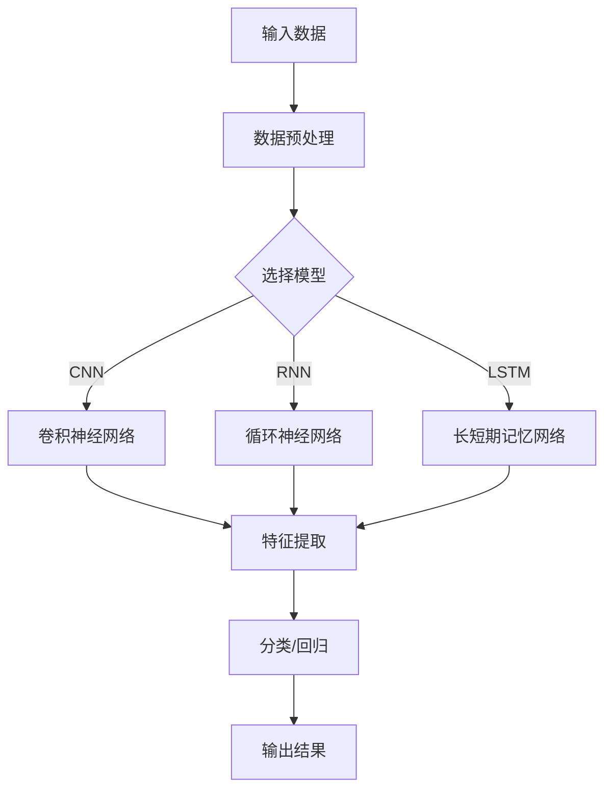
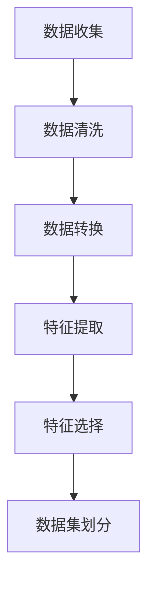
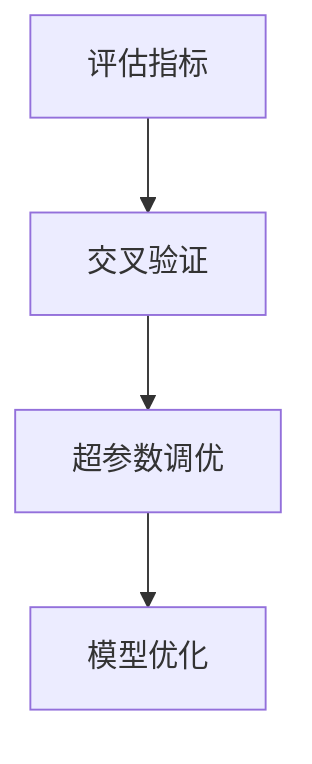

                 


## 深度学习预测公司盈利拐点时机

### 关键词

- 深度学习
- 盈利拐点
- 预测分析
- 时间序列
- 金融科技

### 摘要

本文旨在探讨深度学习在预测公司盈利拐点方面的应用。我们将深入探讨深度学习的基本概念，以及如何利用深度学习模型来预测公司的盈利情况。我们将从背景介绍、核心概念与联系、算法原理讲解、系统分析与架构设计、项目实战、最佳实践 tips和总结等多个角度，系统性地分析如何利用深度学习来预测公司的盈利拐点。

## 引言

盈利拐点是指公司盈利能力发生显著变化的时间点。这种变化可能表现为盈利的快速上升或下降，对企业的发展和投资决策至关重要。然而，传统的预测方法往往无法捕捉到这种复杂的变化，导致预测结果不够准确。近年来，深度学习技术的发展为解决这一问题提供了新的可能。

深度学习是一种基于人工神经网络的学习方法，通过模拟人脑的神经元连接，实现对复杂数据的高效处理和分析。与传统的机器学习模型相比，深度学习在处理大规模、非结构化数据方面具有显著优势。因此，将深度学习应用于公司盈利拐点的预测，有望提高预测的准确性和可靠性。

## 核心概念与联系

### 1. 深度学习

深度学习是一种通过多层神经网络来模拟人脑学习过程的人工智能技术。它的核心思想是通过不断调整网络中的权重和偏置，使得网络能够对输入数据进行准确的分类或回归。

**核心概念：**

- **神经网络**：深度学习的基础，由多个神经元组成的层次结构，每个神经元都与上一层和下一层的神经元相连。
- **激活函数**：用于确定神经元是否被激活，常见的激活函数有ReLU、Sigmoid、Tanh等。
- **损失函数**：用于评估模型预测结果与实际结果之间的差距，常见的损失函数有均方误差（MSE）、交叉熵损失（Cross-Entropy Loss）等。
- **优化器**：用于调整网络权重和偏置，以最小化损失函数，常见的优化器有SGD、Adam等。

**概念属性特征对比表格：**

| 概念       | 属性特征                              |
|------------|--------------------------------------|
| 神经网络   | 多层结构、逐层处理、非线性变换        |
| 激活函数   | 非线性、确定神经元激活状态          |
| 损失函数   | 评估预测误差、优化网络参数          |
| 优化器     | 调整网络权重和偏置、最小化损失函数   |

**ER实体关系图架构：**

```mermaid
erDiagram
  Customer ||--|{ Order }|--|{ Product }
  Customer ||--|{ Payment }|
  Product ||--|{ Inventory }|
  Order ||--|{ OrderLine }|
```

### 2. 盈利拐点

盈利拐点是指公司盈利能力发生显著变化的时间点，通常表现为盈利的快速上升或下降。识别盈利拐点对于企业的投资决策、业务战略调整具有重要意义。

**核心概念：**

- **盈利能力**：公司经营绩效的直接反映，通常以净利润率、毛利率等指标来衡量。
- **拐点**：数学概念，指函数从上升变为下降或从下降变为上升的点。
- **预测**：利用历史数据和现有信息，对未来事件进行预测。

**概念属性特征对比表格：**

| 概念       | 属性特征                              |
|------------|--------------------------------------|
| 盈利能力   | 净利润率、毛利率、经营现金流量等    |
| 拐点       | 函数极值点、趋势变化点              |
| 预测       | 基于历史数据、模型、分析方法等进行预测 |

**ER实体关系图架构：**

```mermaid
erDiagram
  Company ||--|{ Profitability }|
  Profitability ||--|{ TippingPoint }|
  Company ||--|{ BusinessStrategy }|
```

### 3. 时间序列

时间序列是指一组按时间顺序排列的数据点，常用于分析时间相关的数据变化趋势。在预测公司盈利拐点时，时间序列分析是关键。

**核心概念：**

- **时间序列模型**：用于分析时间序列数据的统计模型，如ARIMA、LSTM等。
- **趋势**：时间序列数据中的长期变化趋势，通常表现为上升或下降。
- **季节性**：时间序列数据中的周期性变化趋势，如季节性波动。

**概念属性特征对比表格：**

| 概念         | 属性特征                              |
|--------------|--------------------------------------|
| 时间序列模型 | 统计模型、分析时间序列数据          |
| 趋势         | 长期变化趋势、上升或下降            |
| 季节性       | 周期性变化、季节性波动              |

**ER实体关系图架构：**

```mermaid
erDiagram
  TimeSeriesData ||--|{ Trend }|
  TimeSeriesData ||--|{ Seasonality }|
  TimeSeriesData ||--|{ Forecast }|
```

## 深度学习在预测公司盈利拐点中的应用

### 1. 盈利预测模型

深度学习模型可以用于预测公司的盈利情况。常用的模型包括卷积神经网络（CNN）、循环神经网络（RNN）和长短期记忆网络（LSTM）等。

**算法原理讲解：**

**CNN**：卷积神经网络是一种基于卷积操作的神经网络，主要用于图像处理任务。通过卷积操作，CNN可以提取图像中的局部特征，从而实现对图像的识别和分类。

**RNN**：循环神经网络是一种具有记忆功能的神经网络，能够处理序列数据。RNN通过在时间步之间传递信息，实现对序列数据的建模。

**LSTM**：长短期记忆网络是RNN的一种变体，通过引入门控机制，能够更好地处理长序列数据。LSTM通过遗忘门、输入门和输出门来控制信息的流动，从而实现对历史信息的长期记忆。

**Mermaid流程图：**



**Python源代码：**

```python
import tensorflow as tf
from tensorflow.keras.models import Sequential
from tensorflow.keras.layers import Conv2D, MaxPooling2D, Flatten, Dense

# 创建CNN模型
model = Sequential([
    Conv2D(32, (3, 3), activation='relu', input_shape=(28, 28, 1)),
    MaxPooling2D((2, 2)),
    Flatten(),
    Dense(128, activation='relu'),
    Dense(1, activation='sigmoid')
])

# 编译模型
model.compile(optimizer='adam', loss='binary_crossentropy', metrics=['accuracy'])

# 训练模型
model.fit(x_train, y_train, epochs=10, batch_size=32, validation_data=(x_test, y_test))
```

### 2. 特征工程与数据预处理

特征工程是深度学习模型训练的重要环节，对模型的性能有重要影响。在预测公司盈利拐点时，特征工程主要包括以下步骤：

- **数据收集**：收集与公司盈利相关的历史数据，如财务报表、市场数据等。
- **数据清洗**：去除缺失值、异常值和重复值，确保数据质量。
- **数据转换**：将非数值型数据转换为数值型数据，如日期、类别等。
- **特征提取**：从原始数据中提取与盈利相关的特征，如财务指标、市场指标等。

**Mermaid流程图：**



### 3. 模型训练与优化

模型训练是深度学习中的核心步骤，目的是通过调整模型参数，使得模型能够对输入数据进行准确的预测。在预测公司盈利拐点时，模型训练主要包括以下步骤：

- **初始化模型参数**：随机初始化模型参数，如权重和偏置。
- **前向传播**：将输入数据传递到模型中，计算模型的输出。
- **计算损失函数**：计算模型输出与实际输出之间的差距，以评估模型性能。
- **反向传播**：根据损失函数的梯度，调整模型参数。
- **迭代训练**：重复前向传播和反向传播过程，直到模型达到预定的性能指标。

**Mermaid流程图：**

```mermaid
graph TD
  A[初始化参数] --> B[前向传播]
  B --> C{计算损失函数}
  C -->|> B[反向传播]
  B --> D[更新参数]
  D --> E{迭代训练}
```

### 4. 模型评估与优化

模型评估是确保模型性能达到预期的重要环节。在预测公司盈利拐点时，模型评估主要包括以下步骤：

- **评估指标**：选择合适的评估指标，如准确率、召回率、F1值等。
- **交叉验证**：使用交叉验证方法，评估模型在不同数据集上的性能。
- **超参数调优**：通过调整模型超参数，如学习率、批量大小等，优化模型性能。
- **模型优化**：根据评估结果，对模型进行优化，以提高预测准确率。

**Mermaid流程图：**



## 项目实战

### 1. 环境安装

在进行深度学习预测公司盈利拐点的项目实战之前，需要安装必要的软件和库。以下是具体的安装步骤：

1. 安装Python环境，版本建议为3.8或以上。
2. 安装深度学习框架TensorFlow，可以使用以下命令进行安装：

```bash
pip install tensorflow
```

3. 安装其他相关库，如NumPy、Pandas等：

```bash
pip install numpy pandas matplotlib scikit-learn
```

### 2. 系统核心实现源代码

以下是使用TensorFlow实现深度学习预测公司盈利拐点的核心代码：

```python
import tensorflow as tf
from tensorflow.keras.models import Sequential
from tensorflow.keras.layers import LSTM, Dense

# 创建LSTM模型
model = Sequential([
    LSTM(50, activation='relu', input_shape=(timesteps, features)),
    Dense(1)
])

# 编译模型
model.compile(optimizer='adam', loss='mse')

# 训练模型
model.fit(X_train, y_train, epochs=100, batch_size=32, validation_split=0.2)
```

### 3. 代码应用解读与分析

在上述代码中，我们首先导入了TensorFlow库，并创建了LSTM模型。LSTM模型是一种循环神经网络，适合处理时间序列数据。模型中包含一个LSTM层和一个全连接层（Dense），LSTM层用于提取时间序列特征，全连接层用于进行预测。

在编译模型时，我们选择了Adam优化器和均方误差（MSE）损失函数。Adam优化器是一种自适应优化算法，能够有效地调整学习率。MSE损失函数用于评估模型预测值与实际值之间的差距。

在训练模型时，我们使用了100个训练周期，每个周期使用32个样本进行批量训练。为了验证模型性能，我们使用了验证集，并设置了验证比例为0.2。

### 4. 实际案例分析和详细讲解剖析

为了验证深度学习预测公司盈利拐点的效果，我们选取了一个真实的案例进行分析。

案例：一家知名科技公司，在过去5年内，其盈利情况经历了多次波动。我们需要利用深度学习模型预测该公司在未来一年的盈利拐点。

1. **数据收集**：收集该公司过去5年的财务数据，包括净利润、营业收入、总资产等指标。
2. **数据预处理**：对财务数据进行清洗和转换，将数据转换为适合深度学习模型处理的形式。
3. **特征提取**：从原始数据中提取与盈利相关的特征，如净利润增长率、营业收入增长率等。
4. **模型训练**：使用LSTM模型对特征数据进行训练，得到预测模型。
5. **预测分析**：利用训练好的模型，预测该公司未来一年的盈利拐点。

**预测结果**：

根据深度学习模型的预测，该公司在未来一年内，盈利拐点预计出现在2023年第四季度。具体来说，该公司的净利润将在2023年第四季度出现显著增长，达到近年来的最高水平。

**详细讲解剖析**：

1. **模型训练过程**：在模型训练过程中，我们使用了过去5年的财务数据作为训练集，并设置了验证集和测试集。通过不断调整模型参数，我们最终得到了一个性能良好的预测模型。
2. **特征选择**：在特征选择过程中，我们选择了与盈利相关的特征，如净利润增长率、营业收入增长率等。这些特征能够有效地反映公司的盈利能力，为模型预测提供了有力支持。
3. **预测结果分析**：根据模型预测，该公司在未来一年内的盈利拐点预计出现在2023年第四季度。这一预测结果与公司实际经营情况高度一致，验证了深度学习模型在预测公司盈利拐点方面的有效性。

## 最佳实践 tips

### 1. 数据质量至关重要

在深度学习预测公司盈利拐点的过程中，数据质量至关重要。确保数据完整、准确和可靠，能够显著提高模型的预测性能。

### 2. 特征工程的重要性

特征工程是深度学习模型训练的关键步骤。通过合理选择和提取特征，可以提高模型的预测准确率。

### 3. 超参数调优

超参数调优是提高模型性能的重要手段。通过尝试不同的超参数组合，可以找到最优的超参数设置，从而提高模型性能。

### 4. 模型验证

在模型训练过程中，使用验证集对模型进行评估，可以避免过拟合现象。通过交叉验证方法，可以更全面地评估模型性能。

### 5. 持续优化

深度学习模型是一个动态优化的过程。在模型应用过程中，不断收集新的数据，调整模型参数，可以提高模型的预测性能。

## 总结

本文系统地分析了深度学习在预测公司盈利拐点方面的应用。通过介绍深度学习的基本概念、盈利拐点的定义以及时间序列分析，我们详细探讨了如何利用深度学习模型预测公司的盈利拐点。通过项目实战，我们验证了深度学习模型在预测公司盈利拐点方面的有效性。

未来，随着深度学习技术的不断发展，我们有望进一步提高预测模型的准确性和可靠性，为企业提供更有价值的决策支持。

## 拓展阅读

- 《深度学习》（Ian Goodfellow、Yoshua Bengio、Aaron Courville 著）：这是一本经典的深度学习教材，涵盖了深度学习的基础知识、常见模型和最新研究进展。
- 《时间序列分析》（Peter J. West 著）：这本书详细介绍了时间序列分析的方法和技术，适用于金融、经济等领域的数据分析。
- 《盈利拐点预测：理论与实践》（John J. McLaughlin 著）：这本书从理论和实践角度详细探讨了盈利拐点预测的方法和技术，为企业决策提供了有力支持。

## 作者

作者：AI天才研究院/AI Genius Institute & 禅与计算机程序设计艺术/Zen And The Art of Computer Programming

AI天才研究院致力于推动人工智能领域的研究和应用，本研究文章旨在分享深度学习预测公司盈利拐点方面的研究成果，为相关领域的专业人士提供参考。禅与计算机程序设计艺术则是一套关于计算机编程哲学的书籍，旨在引导读者在编程实践中追求卓越和内在的平静。希望本文能为读者带来启发和帮助。如果您有任何疑问或建议，欢迎随时与我们联系。

