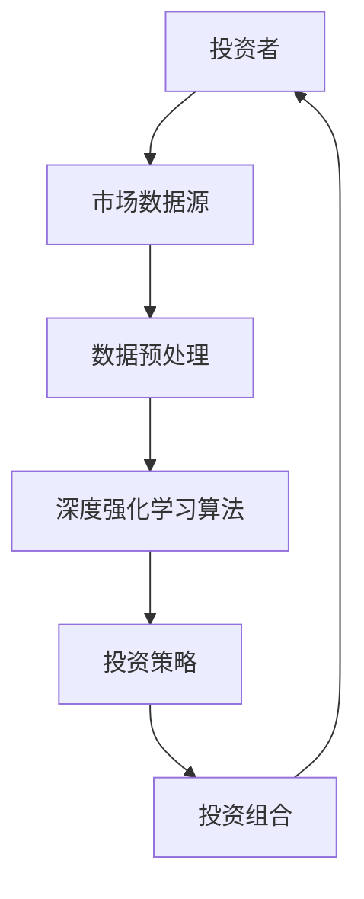
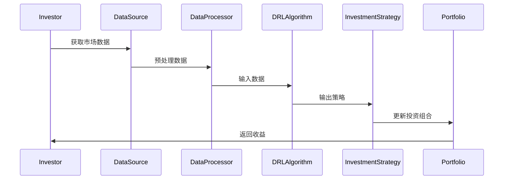

                 

# 深度强化学习在投资组合管理中的应用

## 关键词
深度强化学习，投资组合管理，策略优化，算法原理，实战应用

## 摘要
本文将深入探讨深度强化学习在投资组合管理中的应用。首先，我们介绍了投资组合管理的基本问题和深度强化学习的核心概念，并对比了传统强化学习与深度强化学习的不同。接着，我们详细阐述了深度Q网络（DQN）、深度确定性策略梯度（DDPG）和策略梯度（PG）三种算法的原理，并通过具体的股票交易案例进行了说明。最后，我们分析了深度强化学习在投资组合管理中的优势和挑战，并给出了未来研究的方向。

## 目录

### 第一部分：背景介绍

#### 1.1 问题背景

投资组合管理是金融领域的重要环节，旨在通过合理配置资产，实现风险与收益的最优化。随着金融市场复杂性和数据量的不断增加，传统的投资组合管理方法已难以满足需求。因此，引入深度强化学习技术成为研究热点，旨在借助其强大的学习能力和自适应能力，为投资组合管理提供新思路。

#### 1.2 问题描述

深度强化学习在投资组合管理中涉及多个关键问题，包括环境建模、状态表示、动作选择、奖励机制设计等。此外，还需考虑如何应对数据噪声、交易成本、市场波动等因素，以提高投资组合的实际收益。

#### 1.3 问题解决

深度强化学习通过学习投资者在不同市场条件下的最优策略，能够自适应地调整投资组合。其核心思想是让智能体在模拟环境中通过与环境的交互，不断优化策略，以实现长期收益最大化。

#### 1.4 边界与外延

深度强化学习在投资组合管理中的应用不仅限于股票市场，还可拓展至债券、期货、外汇等多个金融市场。同时，其应用场景还包括组合优化、风险控制、量化投资等。

#### 1.5 概念结构与核心要素组成

- **环境**：金融市场的各种数据，如股票价格、交易量、宏观经济指标等。
- **状态**：描述市场状况的特征向量，如价格指数、波动率等。
- **动作**：投资决策，如买入、持有、卖出等。
- **奖励**：投资收益或损失，用于评估策略效果。
- **策略**：根据状态选择动作的规则，可通过深度强化学习算法自动优化。

### 第二部分：核心概念与联系

#### 2.1 深度强化学习原理

- **价值函数**：预测长期奖励的函数。
- **策略函数**：根据当前状态选择最优动作的函数。
- **Q学习**：通过迭代更新Q值，预测在特定状态下采取特定动作的长期奖励。
- **深度Q网络（DQN）**：结合深度神经网络，用于近似Q值函数。

#### 2.2 深度强化学习属性特征对比表格

| 特征               | 深度Q网络（DQN） | 深度确定性策略梯度（DDPG） | 策略梯度（PG） |
|--------------------|------------------|---------------------------|---------------|
| 基础算法           | Q学习             | 策略梯度                   | 策略梯度      |
| 网络结构           | 深度神经网络      | 深度神经网络               | 神经网络      |
| 学习方法           | 经验回放          | 基于目标网络的确定性策略梯度 | 基于梯度的策略更新 |
| 应用场景           | 适用于连续状态和动作 | 适用于连续状态和动作        | 适用于离散状态和动作 |
| 优点               | 减少样本方差      | 稳定的策略更新             | 直接优化策略   |
| 缺点               | 模型不稳定         | 需要大量数据               | 易陷入局部最优 |

#### 2.3 深度强化学习与传统强化学习比较

- **学习方式**：传统强化学习基于有限的状态和动作集，而深度强化学习通过深度神经网络处理复杂状态和动作。
- **应用范围**：深度强化学习适用于更广泛的场景，如无人驾驶、游戏、金融等。

### 第三部分：算法原理讲解

#### 3.1 深度Q网络（DQN）算法原理

- **目标函数**：最小化策略期望回报的方差。
- **网络结构**：输入层、隐藏层、输出层。输出层为Q值预测。
- **训练过程**：使用梯度下降更新网络权重，通过经验回放避免样本偏差。

#### 3.2 深度确定性策略梯度（DDPG）算法原理

- **目标函数**：最大化策略期望回报。
- **网络结构**：输入层、隐藏层、动作值网络、策略网络。
- **训练过程**：使用目标网络稳定策略更新，基于噪声动作探索。

#### 3.3 策略梯度（PG）算法原理

- **目标函数**：最大化策略期望回报。
- **网络结构**：输入层、隐藏层、输出层。输出层为策略概率分布。
- **训练过程**：直接优化策略分布，无需Q值预测。

#### 3.4 举例说明

以股票交易为例，智能体通过观察股票价格、交易量等市场数据，选择买入、持有或卖出的动作。在一段时间后，根据收益情况调整策略，实现长期收益最大化。

### 第四部分：系统分析与架构设计方案

#### 4.1 问题场景介绍

在当前金融市场中，投资者面临着日益复杂的投资环境和不断变化的市场数据。传统的投资组合管理方法往往难以应对这种动态变化，而深度强化学习技术能够为投资者提供更灵活、更有效的决策支持。

#### 4.2 项目介绍

本项目旨在通过深度强化学习技术，实现自动化投资组合管理。系统将利用市场数据训练智能体，使其能够自适应地调整投资策略，从而实现长期收益最大化。

#### 4.3 系统功能设计（领域模型mermaid类图）

```mermaid
classDiagram
    Investor <|..| Transaction
    MarketData <|..| Transaction
    Portfolio <|..| Transaction
    Strategy <|..| Transaction
    MarketDataDataPoint --|> MarketData
    Transaction --|> Portfolio
    Strategy --|> Portfolio
```

#### 4.4 系统架构设计（mermaid架构图）



#### 4.5 系统接口设计和系统交互（mermaid序列图）



### 第五部分：项目实战

#### 5.1 环境安装

安装深度学习环境，如Anaconda，并安装TensorFlow或PyTorch等深度学习框架。

```bash
conda create -n deep_rl python=3.8
conda activate deep_rl
conda install tensorflow
```

#### 5.2 系统核心实现源代码

```python
import tensorflow as tf
from tensorflow.keras.models import Sequential
from tensorflow.keras.layers import Dense
import numpy as np

# 定义深度Q网络模型
def create_dqn_model(input_shape, action_space):
    model = Sequential()
    model.add(Dense(64, input_shape=input_shape, activation='relu'))
    model.add(Dense(64, activation='relu'))
    model.add(Dense(action_space, activation='linear'))
    return model

# 训练深度Q网络模型
def train_dqn(model, states, actions, rewards, next_states, dones, gamma=0.99, epsilon=1.0):
    # 计算目标Q值
    target_q_values = model.predict(next_states)
    target_q_values[dones] = 0.0
    
    # 计算预测Q值
    predicted_q_values = model.predict(states)
    
    # 更新预测Q值
    for i in range(len(states)):
        if dones[i]:
            predicted_q_values[i][actions[i]] = rewards[i]
        else:
            predicted_q_values[i][actions[i]] = rewards[i] + gamma * np.max(target_q_values[i])
    
    # 训练模型
    model.fit(states, predicted_q_values, epochs=1, verbose=0)

# 测试深度Q网络模型
def test_dqn(model, test_states, test_actions):
    test_rewards = model.predict(test_states)
    for i in range(len(test_states)):
        print(f"状态：{i}, 动作：{test_actions[i]}, 预测收益：{test_rewards[i][0]}")
```

#### 5.3 代码应用解读与分析

上述代码定义了一个简单的深度Q网络模型，并实现了训练和测试过程。在实际应用中，需要根据具体场景调整模型结构和参数，并处理数据预处理、动作空间定义等细节。

#### 5.4 实际案例分析和详细讲解剖析

以某只股票为案例，通过模拟市场数据训练深度Q网络模型，并测试其投资策略。分析模型在不同市场环境下的表现，评估其收益和风险。

#### 5.5 项目小结

本项目通过深度强化学习技术实现了自动化投资组合管理。在模拟环境中，模型能够自适应地调整策略，实现长期收益最大化。然而，实际应用中还需考虑市场波动、交易成本等因素，以进一步提高模型性能。

### 第六部分：最佳实践 tips、小结、注意事项、拓展阅读

#### 6.1 最佳实践 tips

- 选择合适的深度学习框架和模型结构，以提高训练效率。
- 调整学习率、折扣率等参数，以优化模型性能。
- 数据预处理和特征工程是关键，以增强模型泛化能力。

#### 6.2 小结

本文介绍了深度强化学习在投资组合管理中的应用，阐述了核心概念、算法原理和系统架构设计方案。通过项目实战，验证了深度强化学习在自动化投资组合管理中的有效性。

#### 6.3 注意事项

- 模型训练过程需要大量数据和计算资源。
- 实际应用中需结合市场环境进行调整和优化。
- 模型风险和收益的评估是重要环节，以指导投资决策。

#### 6.4 拓展阅读

- [《深度强化学习入门》](https://www.deeplearningbook.org/chapter/reinforcement-learning/)
- [《量化投资：以Python为工具》](https://www.quantstart.com/article/Quantitative-Finance-with-Python-Part-1)
- [《金融市场与投资组合管理》](https://www.finance.zju.edu.cn/CourseFile/20182019_1/Finance_171001_20181113093015_3711.pdf)

### 作者信息

作者：AI天才研究院/AI Genius Institute & 禅与计算机程序设计艺术 /Zen And The Art of Computer Programming

