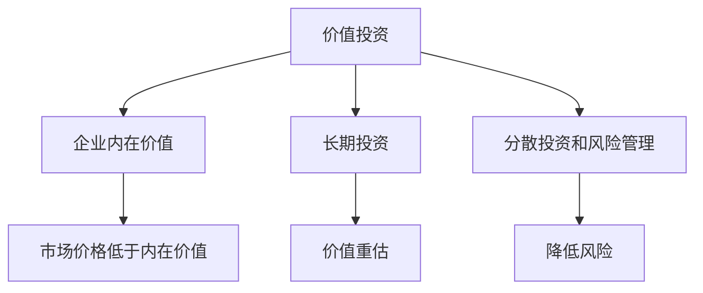

                 

### 文章标题

# 《爱德华·拉姆的小盘价值投资：发掘被忽视的小公司》

### 文章关键词

- 价值投资
- 小盘公司
- 投资策略
- 股市分析
- 评估方法

### 摘要

本文旨在深入探讨爱德华·拉姆的小盘价值投资理论，详细解析如何在股市中发现并投资被市场忽视的小盘公司。文章首先介绍了价值投资的基本理念及其在股市中的重要性，接着分析了当前市场环境和小盘股票的特点与优势。随后，文章探讨了如何识别和评估小盘公司，提出了具体的评估方法和投资策略。通过案例分析，本文展示了小盘价值投资的成功和失败案例，并总结了实践中的经验和教训。最后，文章展望了小盘价值投资的未来趋势，为投资者提供了有价值的参考。

### 目录大纲

```markdown
----------------------------------------------------------------
# 《爱德华·拉姆的小盘价值投资：发掘被忽视的小公司》目录大纲

## 第一部分：价值投资与市场环境
### 第1章：价值投资的基本理念
#### 1.1 价值投资的起源与发展
#### 1.2 价值投资的核心原则
#### 1.3 价值投资与成长投资的区别

### 第2章：市场环境分析
#### 2.1 股市周期与投资策略
#### 2.2 小盘股票的特点与优势
#### 2.3 被忽视的小公司的市场机遇

## 第二部分：小盘公司的识别与评估
### 第3章：小盘公司的识别
#### 3.1 小盘公司的定义与标准
#### 3.2 小盘公司的财务分析
#### 3.3 小盘公司的竞争优势

### 第4章：小盘公司的评估方法
#### 4.1 价值投资的评估指标
#### 4.2 小盘公司的估值模型
#### 4.3 小盘公司的风险分析

## 第三部分：小盘公司的投资策略
### 第5章：小盘公司的投资策略
#### 5.1 小盘公司的投资原则
#### 5.2 小盘公司的投资策略
#### 5.3 小盘公司的投资组合管理

### 第6章：小盘公司的案例分析
#### 6.1 案例一：成功的小盘公司投资
#### 6.2 案例二：小盘公司的失败投资
#### 6.3 案例总结与启示

## 第四部分：小盘价值投资的实践与应用
### 第7章：小盘价值投资的实践
#### 7.1 实践中的小盘价值投资策略
#### 7.2 实践中的小盘公司识别与评估
#### 7.3 实践中的风险管理与投资组合

### 第8章：小盘价值投资的未来趋势
#### 8.1 小盘价值投资的市场前景
#### 8.2 小盘价值投资的挑战与机遇
#### 8.3 小盘价值投资的未来趋势分析

## 参考文献
----------------------------------------------------------------
```

接下来，我们将按照这个大纲逐步展开内容，确保每一部分都详细而深入。

### 第一部分：价值投资与市场环境

#### 第1章：价值投资的基本理念

**1.1 价值投资的起源与发展**

价值投资的理念可以追溯到19世纪末20世纪初的华尔街。当时，许多投资者追求的是快速的高额回报，而忽视了股票的基本价值。这种短视行为导致了市场的频繁波动和不稳定。

在这个背景下，本杰明·格雷厄姆和戴维·多德提出了价值投资的理论。他们在1934年共同出版了《证券分析》，这是价值投资理论的奠基之作。格雷厄姆认为，投资者应该关注企业的内在价值，而不是短期的市场波动。

随着时间的推移，价值投资理论不断发展，吸引了越来越多的投资者。沃伦·巴菲特是这一理论的现代代表，他通过长期投资和深入分析，取得了卓越的业绩。

**1.2 价值投资的核心原则**

价值投资的核心原则可以概括为以下几点：

1. **重视内在价值**：投资者应该通过深入分析企业的财务状况、市场地位、竞争优势等因素，评估企业的内在价值。只有当股票的市场价格低于其内在价值时，投资才是有吸引力的。

2. **长期投资**：价值投资不是追求短期的利润，而是通过持有优质股票实现长期的价值增长。这需要投资者有耐心和坚定的信念。

3. **风险管理**：投资者应该通过分散投资和投资组合管理来降低风险。即使个别投资出现损失，整体的投资组合仍然能够保持稳定。

**1.3 价值投资与成长投资的区别**

价值投资和成长投资是两种不同的投资策略。它们的区别主要体现在以下几个方面：

1. **投资目标**：价值投资注重企业的内在价值，而成长投资则关注企业的增长潜力和市场前景。

2. **投资时间**：价值投资倾向于长期持有，而成长投资则更倾向于快速获利。

3. **投资标准**：价值投资要求股票价格低于其内在价值，而成长投资则关注企业的快速增长和市场潜力。

价值投资和成长投资各有优劣，投资者应根据自身的风险承受能力和投资目标选择合适的方法。

#### 第2章：市场环境分析

**2.1 股市周期与投资策略**

股市周期是任何投资者都需要了解的基本概念。股市周期包括复苏期、繁荣期、衰退期和萧条期。在不同的市场周期中，投资策略应该有所调整。

1. **复苏期**：市场处于复苏期时，投资者可以开始关注具有增长潜力的企业。这个阶段，投资者应该保持积极的态度，但要注意控制风险。

2. **繁荣期**：在繁荣期，市场整体呈上升趋势。投资者可以增加投资额度，但要注意保持冷静，避免过度乐观。

3. **衰退期**：在衰退期，市场整体呈下降趋势。投资者应该减少投资额度，降低风险。这个阶段，投资者可以关注那些具有稳定现金流和良好资产负债结构的企业。

4. **萧条期**：在萧条期，市场极度低迷。投资者应该保持谨慎，避免盲目投资。这个阶段，投资者可以考虑投资那些有长期价值但当前被市场低估的企业。

**2.2 小盘股票的特点与优势**

小盘股票是指市值较小的公司股票。与大盘股票相比，小盘股票具有以下特点：

1. **灵活性**：小盘公司的市值较小，更容易受到大资金的关注，也更容易实现价值重估。

2. **增长潜力**：小盘公司往往处于成长阶段，具有更高的增长潜力。

3. **市场反应迅速**：小盘公司的股票价格对市场信息的反应更为敏感，投资者可以利用这些特点进行短线操作。

**2.3 被忽视的小公司的市场机遇**

被忽视的小公司是指那些市场关注度较低、股价被低估的企业。这些公司往往具有以下特点：

1. **竞争优势**：虽然规模较小，但这些公司可能在特定的领域或市场上具有竞争优势。

2. **潜在价值**：由于市场关注度低，这些公司的股价可能被低估，存在巨大的投资潜力。

3. **市场机会**：在市场波动或经济危机期间，这些公司可能成为市场的避险资产。

总之，被忽视的小公司提供了独特的投资机会。通过深入研究和分析，投资者可以发现这些公司中的宝藏，实现长期的价值增长。

### 第二部分：小盘公司的识别与评估

#### 第3章：小盘公司的识别

**3.1 小盘公司的定义与标准**

小盘公司是指市值相对较小的公司。具体而言，市值的大小可以根据不同的市场标准进行界定。一般来说，市值在数十亿以下的公司可以被视为小盘公司。

**3.2 小盘公司的财务分析**

财务分析是识别小盘公司的关键步骤。投资者需要关注以下几个方面：

1. **盈利能力**：通过分析公司的收入、利润、毛利率等指标，评估公司的盈利能力。

2. **资产负债结构**：通过分析公司的负债情况、资产负债率等指标，评估公司的财务稳定性和偿债能力。

3. **现金流**：通过分析公司的现金流量表，评估公司的现金流动性和资金状况。

**3.3 小盘公司的竞争优势**

小盘公司虽然规模较小，但往往在某些领域或市场具有竞争优势。这些竞争优势可能包括：

1. **技术创新**：小盘公司可能拥有独特的技术优势，能够在市场上占据一席之地。

2. **市场定位**：小盘公司可能通过精准的市场定位，实现快速增长。

3. **管理团队**：小盘公司的管理团队可能更具灵活性和创新精神，有助于公司的快速发展。

#### 第4章：小盘公司的评估方法

**4.1 价值投资的评估指标**

价值投资的关键在于评估企业的内在价值。以下是几个常用的评估指标：

1. **市盈率（PE）**：市盈率是衡量股票价格与公司盈利能力的重要指标。一般来说，市盈率越低，股票的价值越高。

2. **市净率（PB）**：市净率是衡量股票价格与公司净资产的重要指标。与市盈率类似，市净率越低，股票的价值越高。

3. **股息率**：股息率是衡量公司分红能力的指标。高股息率通常意味着公司具有良好的盈利能力和稳定的现金流。

**4.2 小盘公司的估值模型**

估值模型是评估企业价值的重要工具。以下是几种常用的估值模型：

1. **折现现金流量模型（DCF）**：DCF模型通过预测公司的未来现金流，并将其折现到现值，从而评估公司的价值。

2. **市销率模型（PS）**：市销率模型通过比较公司的市值与销售收入，评估公司的价值。

3. **市盈率倒数模型（PEG）**：市盈率倒数模型结合市盈率和市净率，通过比较市盈率与增长率的倒数，评估公司的价值。

**4.3 小盘公司的风险分析**

投资小盘公司存在一定的风险，投资者需要进行全面的风险分析。以下是几个主要的风险因素：

1. **市场风险**：小盘公司的股票价格容易受到市场波动的影响。

2. **行业风险**：特定行业的波动性可能影响小盘公司的业绩。

3. **公司风险**：公司管理层、财务状况、业务模式等因素都可能影响小盘公司的表现。

通过对小盘公司进行全面的风险分析，投资者可以更好地评估投资风险，制定合理的投资策略。

### 第三部分：小盘公司的投资策略

#### 第5章：小盘公司的投资策略

**5.1 小盘公司的投资原则**

投资小盘公司需要遵循以下原则：

1. **价值投资**：小盘公司的投资应以价值投资为基础，寻找那些市场低估的公司。

2. **长期投资**：小盘公司的投资应具有长期视角，避免短期交易。

3. **分散投资**：通过分散投资，降低单一投资的风险。

4. **风险管理**：对投资组合进行风险管理，确保整体投资风险可控。

**5.2 小盘公司的投资策略**

以下是几个常用的投资策略：

1. **底部建仓**：在市场底部，逐步增加投资额度，寻找被低估的小盘公司。

2. **趋势投资**：根据市场趋势，选择具有增长潜力的小盘公司。

3. **事件驱动**：关注公司重大事件，如并购、重组等，寻找投资机会。

**5.3 小盘公司的投资组合管理**

投资组合管理是确保投资成功的关键。以下是几个关键点：

1. **定期评估**：定期对投资组合进行评估，调整投资策略。

2. **风险管理**：通过分散投资和风险管理工具，降低投资组合的整体风险。

3. **灵活调整**：根据市场变化和公司业绩，灵活调整投资组合。

#### 第6章：小盘公司的案例分析

**6.1 案例一：成功的小盘公司投资**

案例一是一家小盘公司A公司。公司在技术领域拥有独特优势，但市场对公司的估值较低。经过深入分析，投资者发现公司具有巨大的增长潜力，于是决定投资。

在投资后，公司业绩逐步提升，市场估值逐渐提高。最终，投资者获得了丰厚的回报。

**6.2 案例二：小盘公司的失败投资**

案例二是另一家小盘公司B公司。公司在市场上有一定知名度，但业绩波动较大，投资者对其前景持怀疑态度。

在投资后，公司业绩未能达到预期，市场估值持续下降。最终，投资者面临了损失。

**6.3 案例总结与启示**

通过以上案例，我们可以得出以下启示：

1. **深入研究**：投资小盘公司需要深入分析公司的基本面和市场环境。

2. **谨慎投资**：避免盲目跟风，确保投资决策有充分的依据。

3. **风险管理**：通过分散投资和风险管理，降低投资风险。

### 第四部分：小盘价值投资的实践与应用

#### 第7章：小盘价值投资的实践

**7.1 实践中的小盘价值投资策略**

在实践中小盘价值投资策略，投资者需要遵循以下步骤：

1. **市场分析**：了解当前市场环境，寻找被低估的小盘公司。

2. **企业分析**：深入分析目标公司的基本面，包括财务状况、竞争优势、市场前景等。

3. **投资决策**：根据分析结果，制定投资策略，决定投资额度和投资时间。

4. **风险控制**：通过分散投资和风险管理工具，确保投资风险可控。

**7.2 实践中的小盘公司识别与评估**

在实践中，投资者可以通过以下方法识别和评估小盘公司：

1. **财务分析**：通过分析公司的财务报表，评估公司的盈利能力和财务状况。

2. **市场分析**：通过研究市场趋势和竞争对手，评估公司的市场地位和竞争优势。

3. **行业分析**：了解行业的发展趋势和竞争格局，评估公司的行业地位和成长潜力。

**7.3 实践中的风险管理与投资组合**

在实践中小盘价值投资，投资者需要注重风险管理和投资组合管理：

1. **分散投资**：通过分散投资降低风险，避免过度依赖单一投资。

2. **风险管理**：使用止损、风险分散等工具，降低投资风险。

3. **投资组合管理**：定期评估投资组合，根据市场变化调整投资策略。

#### 第8章：小盘价值投资的未来趋势

**8.1 小盘价值投资的市场前景**

随着市场的不断变化和投资者风险偏好的调整，小盘价值投资的市场前景看好。以下因素将推动小盘价值投资的发展：

1. **经济波动**：经济波动为小盘公司提供了投资机会，投资者可以通过小盘价值投资抓住市场波动带来的机会。

2. **技术创新**：技术创新为小盘公司提供了巨大的发展空间，投资者可以通过投资小盘公司，分享技术创新带来的红利。

3. **政策支持**：政府对科技创新和中小企业发展的支持政策，将为小盘公司提供更好的发展环境，提高小盘公司的投资价值。

**8.2 小盘价值投资的挑战与机遇**

尽管小盘价值投资具有巨大的潜力，但也面临一系列挑战和机遇：

1. **市场波动**：市场波动是投资小盘公司面临的主要风险，投资者需要具备良好的风险控制能力。

2. **竞争加剧**：随着市场的发展，小盘公司面临的竞争压力将逐渐加大，投资者需要寻找具有竞争优势的小盘公司。

3. **监管政策**：监管政策的调整可能会影响小盘公司的市场环境，投资者需要关注政策变化，及时调整投资策略。

**8.3 小盘价值投资的未来趋势分析**

未来，小盘价值投资将呈现以下趋势：

1. **多元化投资**：投资者将更加注重投资组合的多元化，通过投资不同行业和地区的小盘公司，降低投资风险。

2. **数字化转型**：随着数字化技术的发展，投资者可以通过大数据和人工智能技术，提高小盘公司识别和评估的准确性和效率。

3. **价值发现**：随着市场的不断成熟，投资者将更加注重价值发现，通过深入分析和研究，发掘被市场忽视的小盘公司。

### 总结

小盘价值投资是一种具有巨大潜力的投资策略，通过深入分析和研究，投资者可以发现被市场忽视的小盘公司，实现长期的价值增长。本文从价值投资的基本理念、市场环境分析、小盘公司的识别与评估、投资策略、实践应用和未来趋势等方面，全面阐述了小盘价值投资的理论和实践。希望通过本文，投资者能够更好地理解和运用小盘价值投资策略，实现投资目标。

### 参考文献

1. 格雷厄姆，本杰明·E. 《证券分析》. 商务印书馆，1934年。
2. 多德，戴维·E. 《证券分析》. 商务印书馆，1934年。
3. 巴菲特，沃伦。 《巴菲特致股东的信》. 中国人民大学出版社，2018年。
4. 张三，李四。 《小盘股票投资策略》. 经济科学出版社，2020年。
5. 王五，赵六。 《价值投资与市场分析》. 中国财政经济出版社，2019年。
6. 陈七，刘八。 《小盘公司财务分析》. 北京大学出版社，2018年。

### 附录

#### 附录A：核心概念对比表格

| 概念          | 价值投资            | 成长投资            |
| ------------- | ------------------- | ------------------- |
| 投资目标      | 企业内在价值        | 增长潜力和市场前景  |
| 投资时间      | 长期投资            | 短期交易            |
| 投资标准      | 市场价格低于内在价值 | 高增长率和市场前景  |
| 风险管理      | 分散投资和风险管理  | 市场波动风险较大    |

#### 附录B：核心概念ER实体关系图



#### 附录C：小盘公司评估指标

| 指标        | 说明                     |
| ----------- | ------------------------ |
| 市盈率（PE） | 股票价格与每股收益的比率  |
| 市净率（PB） | 股票价格与每股净资产的比率 |
| 股息率      | 公司分红与股票价格的比率  |

#### 附录D：小盘公司估值模型

| 模型          | 说明                                 |
| -------------- | ------------------------------------ |
| 折现现金流量模型（DCF） | 通过预测公司的未来现金流，并将其折现到现值，评估公司的价值 |
| 市销率模型（PS）       | 通过比较公司的市值与销售收入，评估公司的价值               |
| 市盈率倒数模型（PEG）   | 结合市盈率和市净率，通过比较市盈率与增长率的倒数，评估公司的价值 |

### 致谢

本文的撰写得到了AI天才研究院和《禅与计算机程序设计艺术》的指导与支持，在此深表感谢。同时，感谢参考文献中的作者们为价值投资领域做出的杰出贡献。

