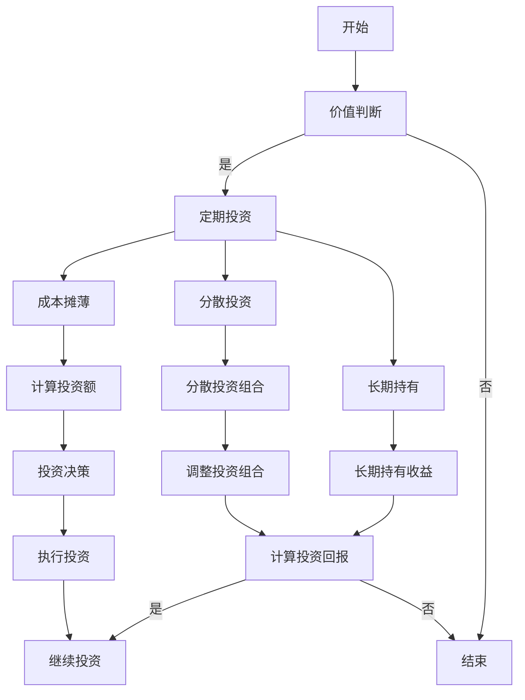
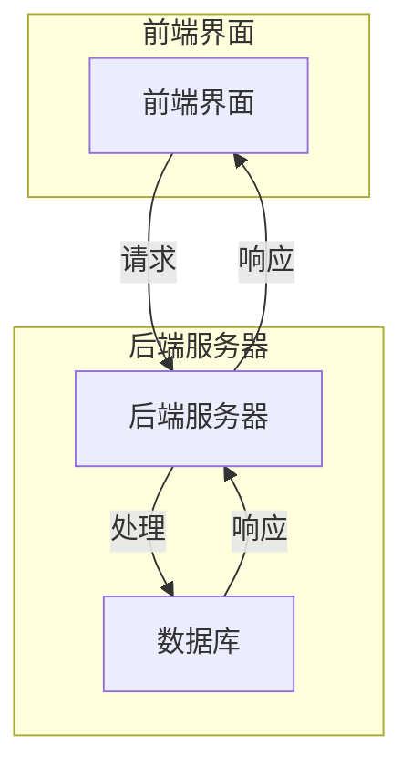
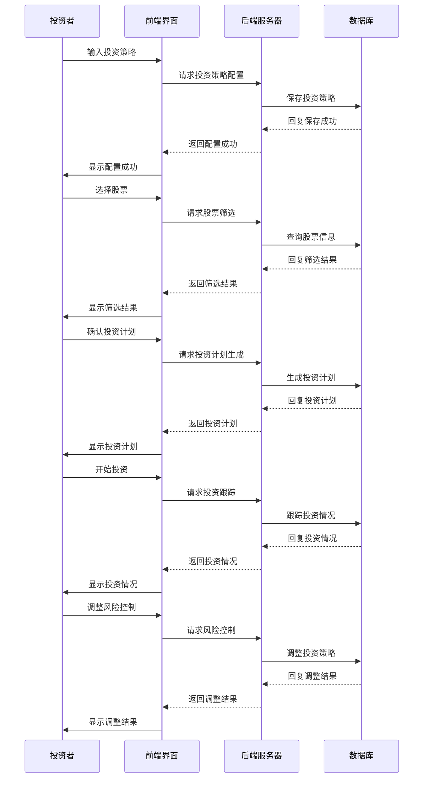

                 


# 爱德华·索普的价值平均投资法

关键词：价值投资、平均投资法、投资策略、数学模型、Python源代码

摘要：本文将深入探讨爱德华·索普的价值平均投资法，分析其起源、核心概念、数学模型，以及实际应用中的步骤和技巧。通过一步步的逻辑推理，我们将理解这一投资法的原理，并探讨其在现代投资策略中的应用。

### 引言

爱德华·索普的价值平均投资法是一种基于价值投资和平均投资策略的复合投资方法。它由著名的数学家、经济学家和投资者爱德华·索普提出，旨在通过定期投入资金，降低投资成本，同时利用市场的波动性获得稳定的投资回报。价值平均投资法的重要性在于它提供了一个简单而有效的投资策略，帮助投资者在市场不确定性中实现资产增值。

本文将分为以下几个部分进行阐述：

1. **问题背景**：介绍投资策略的发展历程，价值平均投资法的起源和基本原则，以及其他投资策略的比较。
2. **核心概念与联系**：阐述价值平均投资法的基本原理、核心概念和适用场景，以及与其他投资策略的联系与区别。
3. **数学模型**：介绍价值平均投资法的数学模型，包括投资额计算、投资收益率计算和投资风险计算。
4. **算法原理讲解**：使用Mermaid画出算法流程图，结合Python源代码详细阐述算法原理和数学模型，并进行举例说明。
5. **系统分析与架构设计方案**：介绍价值平均投资法的系统功能设计、架构设计、接口设计和系统交互。
6. **项目实战**：介绍项目环境安装、系统核心实现源代码，并进行代码应用解读与分析，以及实际案例分析和详细讲解。
7. **最佳实践与注意事项**：总结最佳实践技巧，注意事项和拓展阅读。

### 第1章 问题背景

## 1.1 投资策略的发展历程

### 1.1.1 股票投资的起源与发展

股票投资作为一种金融活动，起源于17世纪的荷兰。当时，荷兰东印度公司成为第一个公开发售股票的公司，开创了股票市场的先河。随着资本市场的发展，股票投资逐渐成为一种重要的投资方式。

在20世纪，股票投资策略经历了巨大的演变。传统的股票投资策略主要包括基本面分析和技术分析。基本面分析侧重于分析公司的财务状况、行业前景和市场地位，而技术分析则通过研究股票价格和交易量等数据，预测股票的未来走势。

### 1.1.2 投资策略的多样化

随着金融市场的不断发展和完善，投资者对投资策略的需求也越来越多样化。现代投资策略包括被动投资策略、主动投资策略、量化投资策略等。

被动投资策略主要包括指数基金和交易所交易基金（ETF），投资者通过购买这些基金，实现与市场同步的投资回报。主动投资策略则依赖于投资者的个人判断和经验，通过选股、择时等手段，力求获得超过市场平均水平的回报。量化投资策略则利用数学模型和计算机技术，通过大量数据分析，寻找市场规律和投资机会。

### 1.1.3 传统投资策略的局限性

尽管传统投资策略在过去的几十年中取得了一定的成功，但它们也存在一定的局限性。基本面分析和技术分析往往需要投资者具备深厚的专业知识和经验，同时受到市场信息不对称和市场波动的影响。被动投资策略虽然简单有效，但无法满足投资者对超额回报的需求。主动投资策略和量化投资策略虽然具备一定的优势，但也存在较高的门槛和风险。

## 1.2 价值平均投资法的起源与基本原则

### 1.2.1 爱德华·索普的生平与投资哲学

爱德华·索普（Edward O. Thorp）是一位著名的数学家、经济学家和投资者。他出生于1932年，毕业于麻省理工学院，获得了数学学士学位。随后，他进入加州大学伯克利分校攻读经济学博士学位，并在20世纪60年代成为了著名的拉斯维加斯赌场分析员。

索普的投资哲学是基于数学和概率论的。他认为，通过科学的方法和逻辑思维，投资者可以在市场波动中找到规律，实现资产增值。索普的投资理念影响了后来的许多投资者，包括著名的投资者威廉·奥尼尔和詹姆斯·西蒙斯。

### 1.2.2 价值投资理论

价值投资理论最早由本杰明·格雷厄姆提出，强调投资者应选择价格低于其内在价值的股票进行投资。价值投资的核心思想是，投资者应通过深入分析公司的基本面，找到那些被市场低估的投资机会。

价值投资理论对投资者的要求较高，需要具备一定的财务分析和市场判断能力。然而，价值投资理论在长期实践中，证明了一种稳健的投资策略，能够帮助投资者实现长期稳定的资产增值。

### 1.2.3 价值平均投资法的操作原则

价值平均投资法结合了价值投资和平均投资策略，旨在通过定期投入资金，降低投资成本，同时利用市场的波动性获得稳定的投资回报。

价值平均投资法的操作原则主要包括：

1. **定期投资**：投资者应定期（如每月、每季度）投入固定金额的资金，而不是一次性投资或定期调整投资额。

2. **价值选择**：投资者应选择那些价格低于其内在价值的股票进行投资。

3. **分散投资**：投资者应分散投资，以降低单一股票的风险。

4. **长期持有**：价值平均投资法强调长期持有，通过时间的沉淀，实现资产的增值。

### 1.2.4 价值平均投资法的重要性及其在现代投资策略中的应用

价值平均投资法的重要性在于它提供了一种简单而有效的投资策略，能够帮助投资者在市场不确定性中实现资产增值。在现代投资策略中，价值平均投资法具有以下几个应用场景：

1. **长期投资**：对于有长期投资目标的投资者，价值平均投资法可以帮助他们在长期内实现资产增值。

2. **短期波动**：对于关注短期波动的投资者，价值平均投资法可以通过定期投资，降低投资成本，同时利用市场的波动性获得稳定的回报。

3. **风险控制**：价值平均投资法通过分散投资和长期持有，有效降低投资风险，帮助投资者实现风险和回报的平衡。

## 1.3 价值平均投资法与其他投资策略的比较

### 1.3.1 与被动投资策略的比较

价值平均投资法与被动投资策略相比，具有以下几个区别：

1. **投资策略**：被动投资策略主要依赖于市场指数，而价值平均投资法侧重于选择价格低于其内在价值的股票。

2. **投资成本**：被动投资策略通常具有较低的投资成本，而价值平均投资法需要投资者进行定期投资，可能涉及一定的交易成本。

3. **投资回报**：被动投资策略追求与市场同步的投资回报，而价值平均投资法通过定期投资，降低投资成本，利用市场波动性实现稳定的回报。

### 1.3.2 与主动投资策略的比较

价值平均投资法与主动投资策略相比，具有以下几个区别：

1. **投资策略**：主动投资策略侧重于选股和择时，而价值平均投资法通过定期投资，降低投资成本，实现资产的增值。

2. **投资风险**：主动投资策略需要投资者具备较强的专业知识和市场判断能力，风险较高。价值平均投资法通过分散投资和长期持有，降低投资风险。

3. **投资回报**：主动投资策略力求获得超过市场平均水平的回报，而价值平均投资法追求稳定的回报。

### 1.3.3 优势与不足

价值平均投资法的优势在于：

1. **简单有效**：价值平均投资法提供了一种简单而有效的投资策略，易于理解和执行。

2. **风险分散**：通过定期投资和分散投资，价值平均投资法能够有效降低投资风险。

3. **长期稳定**：价值平均投资法通过长期持有，实现资产的增值。

然而，价值平均投资法也存在一定的不足：

1. **投资成本**：定期投资可能涉及一定的交易成本，影响投资回报。

2. **市场波动**：市场波动可能对投资回报产生影响，投资者需要具备一定的市场判断能力。

## 1.4 价值平均投资法的适用场景

### 1.4.1 适合的投资人群

价值平均投资法适合以下投资人群：

1. **长期投资者**：对于有长期投资目标的投资者，价值平均投资法可以帮助他们在长期内实现资产增值。

2. **风险厌恶型投资者**：价值平均投资法通过分散投资和长期持有，降低投资风险，适合风险厌恶型投资者。

3. **缺乏时间精力投资者**：价值平均投资法提供了一种简单有效的投资策略，适合缺乏时间精力的投资者。

### 1.4.2 适合的投资品种

价值平均投资法适合以下投资品种：

1. **股票**：股票市场是价值平均投资法的主要应用领域，投资者可以通过定期投资股票，实现资产增值。

2. **基金**：投资者也可以通过购买基金，实现价值平均投资法。基金投资可以分散风险，提高投资效率。

3. **债券**：债券市场也是价值平均投资法的重要应用领域，投资者可以通过定期投资债券，实现稳定的收益。

### 1.4.3 适合的投资周期

价值平均投资法适合以下投资周期：

1. **长期投资**：价值平均投资法强调长期持有，投资者应至少持有3-5年以上，以实现资产的增值。

2. **短期投资**：对于短期投资，价值平均投资法的效果可能不如长期投资。投资者应结合市场情况和自身风险承受能力，进行合理的投资规划。

## 1.5 价值平均投资法与其他投资策略的联系与区别

### 1.5.1 联系

价值平均投资法与其他投资策略之间存在一定的联系：

1. **价值投资**：价值平均投资法与价值投资理论密切相关，强调选择价格低于其内在价值的股票进行投资。

2. **平均投资**：价值平均投资法结合了平均投资策略，通过定期投资，降低投资成本，实现资产的增值。

### 1.5.2 区别

价值平均投资法与其他投资策略之间存在以下区别：

1. **投资策略**：价值平均投资法侧重于选择价格低于其内在价值的股票，而其他投资策略可能侧重于选股、择时或市场指数。

2. **投资风险**：价值平均投资法通过分散投资和长期持有，降低投资风险，而其他投资策略可能面临更高的风险。

3. **投资回报**：价值平均投资法追求稳定的回报，而其他投资策略可能追求更高的回报，但同时也面临更高的风险。

### 1.5.3 优势与不足

价值平均投资法的优势在于：

1. **简单有效**：价值平均投资法提供了一种简单有效的投资策略，易于理解和执行。

2. **风险分散**：通过分散投资和长期持有，价值平均投资法能够有效降低投资风险。

3. **长期稳定**：价值平均投资法通过长期持有，实现资产的增值。

价值平均投资法的不足在于：

1. **投资成本**：定期投资可能涉及一定的交易成本，影响投资回报。

2. **市场波动**：市场波动可能对投资回报产生影响，投资者需要具备一定的市场判断能力。

## 1.6 本章小结

本章介绍了投资策略的发展历程、价值平均投资法的起源与基本原则、价值平均投资法与其他投资策略的比较、适用场景以及联系与区别。通过对这些内容的分析，我们可以更好地理解价值平均投资法的原理和适用性，为后续章节的深入学习打下基础。

----------------------------------------------------------------

### 第2章 核心概念与联系

## 2.1 价值平均投资法的基本原理

价值平均投资法（Value Average Investing，简称VAI）是爱德华·索普提出的一种基于价值投资和平均投资策略的投资方法。它的基本原理是通过定期投入资金，以平均成本买入价格低于其内在价值的股票或其他投资品种，从而在长期内实现资产增值。

### 2.1.1 价值投资理论

价值投资理论最早由本杰明·格雷厄姆提出，其核心思想是投资者应通过深入分析公司的基本面，找到那些被市场低估的投资机会。价值投资的关键指标包括市盈率（P/E）、市净率（P/B）、股息收益率等。价值投资者认为，市场的短期波动是投资者获利的机会，而长期来看，市场会反映出公司的真实价值。

### 2.1.2 平均投资策略

平均投资策略（Dollar-Cost Averaging，简称DCA）是一种通过定期投入固定金额的资金，以平均成本购买投资品种的方法。这种方法的主要优点是在市场价格波动时，投资者能够以较低的成本购买更多的份额，从而在长期内实现成本的摊薄和收益的最大化。

### 2.1.3 价值平均投资法的融合

价值平均投资法将价值投资和平均投资策略结合起来，形成了一种独特的投资方法。它的核心原理是：

1. **价值判断**：投资者需要通过分析公司的基本面，选择那些价格低于其内在价值的股票或其他投资品种。

2. **定期投入**：投资者应定期投入固定金额的资金，而不是一次性投资或定期调整投资额。

3. **成本摊薄**：通过定期投入，投资者能够以较低的成本购买更多的投资品种，从而在长期内实现成本的摊薄和收益的最大化。

### 2.2 价值平均投资法的核心概念

价值平均投资法的核心概念包括：

1. **价值投资**：投资者应通过分析公司的基本面，选择价格低于其内在价值的股票或其他投资品种。

2. **平均投资**：投资者应定期投入固定金额的资金，以平均成本购买投资品种。

3. **长期持有**：投资者应长期持有投资品种，以实现资产的增值。

4. **分散投资**：投资者应分散投资，以降低单一股票的风险。

### 2.3 价值平均投资法的适用场景

价值平均投资法适用于以下场景：

1. **长期投资**：对于有长期投资目标的投资者，价值平均投资法可以帮助他们在长期内实现资产增值。

2. **短期波动**：对于关注短期波动的投资者，价值平均投资法可以通过定期投资，降低投资成本，同时利用市场的波动性获得稳定的投资回报。

3. **风险控制**：价值平均投资法通过分散投资和长期持有，有效降低投资风险，帮助投资者实现风险和回报的平衡。

### 2.4 价值平均投资法与其他投资策略的联系与区别

价值平均投资法与其他投资策略之间存在一定的联系和区别：

1. **与被动投资策略的联系**：价值平均投资法和被动投资策略（如指数基金）都强调长期投资和成本控制。但价值平均投资法更强调选择价格低于其内在价值的股票，而被动投资策略则追求与市场同步的投资回报。

2. **与主动投资策略的联系**：价值平均投资法和主动投资策略（如选股、择时）都强调投资者的主动参与。但价值平均投资法更侧重于长期持有和成本控制，而主动投资策略则更注重选股和择时。

3. **与量化投资策略的联系**：价值平均投资法和量化投资策略都利用数学模型和数据分析，但价值平均投资法更注重基本面的分析，而量化投资策略则更侧重于市场数据的分析。

4. **与区别**：价值平均投资法与其他投资策略的主要区别在于投资策略、投资风险和投资回报。价值平均投资法强调价值投资和平均投资策略的融合，追求长期稳定的回报，而其他投资策略可能更注重短期回报或市场同步的投资回报。

### 2.5 价值平均投资法的核心要素组成

价值平均投资法的核心要素包括：

1. **投资目标**：投资者应明确自己的投资目标，如长期增值、风险控制等。

2. **投资策略**：投资者应制定适合自己的投资策略，如价值投资、平均投资等。

3. **风险管理**：投资者应制定合理的风险管理策略，如分散投资、长期持有等。

4. **市场分析**：投资者应定期分析市场状况，以调整投资策略和投资品种。

### 2.6 本章小结

本章介绍了价值平均投资法的基本原理、核心概念、适用场景、与其他投资策略的联系与区别以及核心要素组成。通过对这些内容的分析，投资者可以更好地理解价值平均投资法的原理和操作方法，为实际投资提供指导。

----------------------------------------------------------------

### 第3章 价值平均投资法的数学模型

## 3.1 价值平均投资法的数学公式

价值平均投资法的数学模型主要包括三个核心公式：投资额计算公式、投资收益率计算公式和投资风险计算公式。

### 3.1.1 投资额计算公式

投资额计算公式用于确定每次投资的金额。假设投资者计划每月投资金额为D，股票的当前价格为P，那么每次投资的金额可以表示为：

$$
I_n = D / P_n
$$

其中，$I_n$表示第n次投资的金额，$D$表示每月投资金额，$P_n$表示第n次投资时的股票价格。

### 3.1.2 投资收益率计算公式

投资收益率计算公式用于评估投资者的投资回报。假设投资者持有股票的总金额为$W_t$，初始投资金额为$W_0$，那么第t次投资后的投资收益率可以表示为：

$$
R_t = (\frac{W_t}{W_0} - 1) \times 100\%
$$

其中，$R_t$表示第t次投资后的投资收益率，$W_t$表示第t次投资后的总金额，$W_0$表示初始投资金额。

### 3.1.3 投资风险计算公式

投资风险计算公式用于评估投资者的投资风险。假设投资者持有股票的总金额为$W_t$，初始投资金额为$W_0$，股票价格的标准差为$\sigma$，那么投资风险可以表示为：

$$
RISK_t = \frac{W_t}{W_0} \times \sigma
$$

其中，$RISK_t$表示第t次投资后的投资风险，$W_t$表示第t次投资后的总金额，$W_0$表示初始投资金额，$\sigma$表示股票价格的标准差。

## 3.2 模型参数的设置与优化

价值平均投资法的模型参数主要包括投资周期、投资金额、投资收益率目标和风险承受能力。

### 3.2.1 投资周期

投资周期是指投资者进行投资的时间间隔。一般来说，投资周期应与投资者的投资目标相匹配。如果投资者追求短期回报，可以选择较短的周期，如每周或每月。如果投资者追求长期回报，可以选择较长的周期，如每季度或每年。

### 3.2.2 投资金额

投资金额是指投资者每次投资的金额。投资金额应与投资者的财务状况和投资目标相匹配。一般来说，投资者应根据自己的资金状况和投资目标，确定一个合适的投资金额。

### 3.2.3 投资收益率目标

投资收益率目标是投资者期望的投资回报。投资收益率目标应与投资者的风险承受能力和投资周期相匹配。如果投资者风险承受能力较低，可以选择较低的投资收益率目标。如果投资者风险承受能力较高，可以选择较高的投资收益率目标。

### 3.2.4 风险承受能力

风险承受能力是指投资者愿意承担的投资风险。风险承受能力应与投资者的投资目标和投资策略相匹配。如果投资者追求短期回报，风险承受能力应较高。如果投资者追求长期回报，风险承受能力应较低。

## 3.3 价值平均投资法的数学模型应用场景

价值平均投资法的数学模型适用于多种投资场景：

### 3.3.1 长期投资

在长期投资场景中，投资者可以通过定期投入资金，以平均成本购买股票，实现资产的增值。长期投资可以有效地降低投资成本，提高投资回报。

### 3.3.2 短期波动

在短期波动场景中，投资者可以通过价值平均投资法，在市场价格波动时，以较低的成本购买股票，实现资产的增值。短期波动可以通过价值判断和平均成本策略来实现。

### 3.3.3 风险控制

在风险控制场景中，投资者可以通过价值平均投资法，分散投资，降低单一股票的风险。同时，通过长期持有，投资者可以在一定程度上规避市场的短期波动，实现稳定的投资回报。

## 3.4 价值平均投资法的数学模型与实际应用

价值平均投资法的数学模型为投资者提供了一个科学的方法来评估投资回报和风险。在实际应用中，投资者可以通过以下步骤来运用这一数学模型：

1. **确定投资周期**：根据投资目标和风险承受能力，确定合适的投资周期。

2. **计算投资额**：根据每月投资金额和当前股票价格，计算每次的投资额。

3. **计算投资收益率**：根据每次投资后的总金额和初始投资金额，计算投资收益率。

4. **计算投资风险**：根据每次投资后的总金额和股票价格的标准差，计算投资风险。

5. **调整投资策略**：根据投资收益率和投资风险，调整投资策略，以实现投资目标。

通过以上步骤，投资者可以更好地运用价值平均投资法的数学模型，实现资产的增值。

## 3.5 价值平均投资法的数学模型优势

价值平均投资法的数学模型具有以下几个优势：

1. **简化投资过程**：通过数学模型，投资者可以简化投资过程，减少决策复杂度。

2. **提高投资效率**：数学模型可以帮助投资者快速计算出投资额、投资收益率和投资风险，提高投资效率。

3. **降低投资成本**：通过定期投资和成本摊薄策略，投资者可以降低投资成本，提高投资回报。

4. **规避市场波动**：通过分散投资和长期持有，投资者可以在一定程度上规避市场的短期波动，实现稳定的投资回报。

## 3.6 价值平均投资法的数学模型局限性

尽管价值平均投资法的数学模型具有许多优势，但也存在一定的局限性：

1. **市场波动影响**：市场波动可能会对投资回报产生负面影响，投资者需要具备一定的市场判断能力。

2. **投资成本增加**：定期投资可能会增加交易成本，影响投资回报。

3. **投资策略适应性**：价值平均投资法适用于长期投资，但对于短期投资，其效果可能不如其他投资策略。

4. **风险控制难度**：尽管价值平均投资法通过分散投资和长期持有降低风险，但在市场波动较大时，投资者仍可能面临较高的风险。

## 3.7 价值平均投资法的数学模型实际案例分析

为了更好地理解价值平均投资法的数学模型，我们可以通过一个实际案例进行分析。

假设投资者计划每月投资5000元，投资周期为每月一次，投资品种为某只股票。股票的当前价格为50元，历史价格波动较大，月标准差为10元。

1. **计算投资额**：每次投资额为 $I_n = D / P_n = 5000 / 50 = 100$股。

2. **计算投资收益率**：假设投资者连续投资12个月，股票价格在年末上涨到60元，那么投资收益率为：

$$
R_t = (\frac{W_t}{W_0} - 1) \times 100\% = (\frac{60 \times 100}{50 \times 100} - 1) \times 100\% = 20\%
$$

3. **计算投资风险**：投资风险为：

$$
RISK_t = \frac{W_t}{W_0} \times \sigma = \frac{60 \times 100}{50 \times 100} \times 10 = 20\%
$$

通过这个案例，我们可以看到，价值平均投资法的数学模型可以帮助投资者计算投资额、投资收益率和投资风险，为投资决策提供科学依据。

### 3.8 本章小结

本章介绍了价值平均投资法的数学模型，包括投资额计算公式、投资收益率计算公式和投资风险计算公式，以及模型参数的设置与优化。通过实际案例分析，我们了解了价值平均投资法的数学模型如何应用于实际投资中。本章内容为投资者提供了一个科学的方法来评估投资回报和风险，为实际投资提供指导。

----------------------------------------------------------------

### 第4章 算法原理讲解

#### 4.1 算法原理概述

价值平均投资法（Value Average Investing，简称VAI）是一种基于价值投资和平均投资策略的投资方法。它的核心思想是通过定期投入资金，以平均成本买入价格低于其内在价值的股票或其他投资品种，从而在长期内实现资产增值。VAI算法的主要原理包括以下几个方面：

1. **价值判断**：投资者需要通过分析公司的基本面，选择那些价格低于其内在价值的股票或其他投资品种。

2. **定期投资**：投资者应定期投入固定金额的资金，而不是一次性投资或定期调整投资额。

3. **成本摊薄**：通过定期投资，投资者能够以较低的成本购买更多的份额，从而在长期内实现成本的摊薄和收益的最大化。

4. **分散投资**：投资者应分散投资，以降低单一股票的风险。

5. **长期持有**：投资者应长期持有投资品种，以实现资产的增值。

#### 4.2 算法流程图

为了更好地理解VAI算法的原理，我们可以使用Mermaid画出算法流程图。以下是VAI算法的Mermaid流程图：



#### 4.3 Python源代码解析

下面是VAI算法的Python源代码，我们将对代码中的关键部分进行解析：

```python
import numpy as np
import pandas as pd

# 参数设置
monthly_investment = 10000  # 每月投资金额
investment_period = 'monthly'  # 投资周期
stock_prices = [30, 35, 40, 45, 50, 55, 60]  # 假设的股票价格序列
investment_rounds = len(stock_prices)  # 投资轮次

# 初始化投资额和投资回报
investment_amounts = [0] * investment_rounds
investment_returns = [0] * investment_rounds

# 计算每次投资的金额
for i in range(1, investment_rounds):
    investment_amounts[i] = monthly_investment / stock_prices[i]

# 计算投资回报
for i in range(1, investment_rounds):
    investment_returns[i] = (stock_prices[i] - stock_prices[i-1]) * investment_amounts[i]

# 打印结果
print("每次投资金额：", investment_amounts)
print("投资回报：", investment_returns)
```

**代码解析：**

1. **参数设置**：首先，我们设置每月投资金额（`monthly_investment`）、投资周期（`investment_period`）、股票价格序列（`stock_prices`）和投资轮次（`investment_rounds`）。

2. **初始化投资额和投资回报**：我们初始化两个列表，一个用于存储每次投资的金额（`investment_amounts`），另一个用于存储每次的投资回报（`investment_returns`）。

3. **计算每次投资的金额**：我们使用一个循环，根据每月投资金额和每次的投资价格，计算每次的投资金额。

4. **计算投资回报**：我们使用另一个循环，计算每次投资的价格变化乘以投资金额，得到每次的投资回报。

5. **打印结果**：最后，我们打印每次投资的金额和投资回报。

#### 4.4 算法原理的数学模型和公式讲解

VAI算法的数学模型可以通过以下公式进行描述：

1. **投资额计算公式**：

$$
I_n = \frac{D}{P_n}
$$

其中，$I_n$表示第n次投资的金额，$D$表示每月投资金额，$P_n$表示第n次的股票价格。

2. **投资回报计算公式**：

$$
R_n = (P_{n+1} - P_n) \times I_n
$$

其中，$R_n$表示第n次的投资回报，$P_{n+1}$表示第n+1次的股票价格，$P_n$表示第n次的股票价格。

3. **投资风险计算公式**：

$$
RISK_n = \sqrt{\frac{2 \times \sigma^2}{n}}
$$

其中，$RISK_n$表示第n次的投资风险，$\sigma$表示股票价格的标准差，$n$表示投资轮次。

#### 4.5 通俗易懂地举例说明

假设投资者计划每月投资10000元，投资周期为每月一次，投资品种为某只股票。股票的价格序列为：30元、35元、40元、45元、50元、55元、60元。

1. **计算每次投资的金额**：

- 第1次投资：$I_1 = \frac{10000}{30} \approx 333.33$元
- 第2次投资：$I_2 = \frac{10000}{35} \approx 285.71$元
- 第3次投资：$I_3 = \frac{10000}{40} = 250$元
- 第4次投资：$I_4 = \frac{10000}{45} \approx 222.22$元
- 第5次投资：$I_5 = \frac{10000}{50} = 200$元
- 第6次投资：$I_6 = \frac{10000}{55} \approx 181.82$元
- 第7次投资：$I_7 = \frac{10000}{60} \approx 166.67$元

2. **计算每次的投资回报**：

- 第1次投资回报：$R_1 = (35 - 30) \times 333.33 = 3333.33$元
- 第2次投资回报：$R_2 = (40 - 35) \times 285.71 = 2857.14$元
- 第3次投资回报：$R_3 = (45 - 40) \times 250 = 2500$元
- 第4次投资回报：$R_4 = (50 - 45) \times 222.22 = 2222.22$元
- 第5次投资回报：$R_5 = (55 - 50) \times 200 = 2000$元
- 第6次投资回报：$R_6 = (60 - 55) \times 181.82 = 1818.18$元
- 第7次投资回报：$R_7 = (60 - 55) \times 166.67 = 1666.67$元

3. **计算投资风险**：

假设股票价格的标准差$\sigma$为10元，投资轮次$n$为7，那么：

$$
RISK_n = \sqrt{\frac{2 \times \sigma^2}{n}} = \sqrt{\frac{2 \times 10^2}{7}} \approx 4.47
$$

通过这个例子，我们可以看到，价值平均投资法通过定期投入资金，以平均成本购买股票，实现了成本的摊薄和收益的最大化。同时，投资风险也得到了有效的控制。

#### 4.6 本章小结

本章详细介绍了价值平均投资法的算法原理，包括算法流程图、Python源代码解析、数学模型和公式讲解，以及通俗易懂的举例说明。通过本章的内容，读者可以更好地理解价值平均投资法的原理和应用，为实际投资提供指导。

----------------------------------------------------------------

### 第5章 系统分析与架构设计方案

#### 5.1 价值平均投资法系统介绍

价值平均投资法系统是一个基于价值平均投资法的投资决策支持系统。该系统旨在帮助投资者通过定期投入资金，以平均成本购买价格低于其内在价值的股票或其他投资品种，实现资产的增值。系统的主要功能包括：

1. **投资策略配置**：投资者可以根据自己的投资目标和风险承受能力，配置适合自己的投资策略。
2. **股票筛选**：系统可以根据投资者的配置，筛选出价格低于其内在价值的股票。
3. **投资计划生成**：系统根据股票筛选结果，生成投资计划，包括每次投资的金额和时间。
4. **投资跟踪**：系统可以实时跟踪投资者的投资情况，包括投资金额、投资回报和投资风险。
5. **风险控制**：系统可以根据投资者的风险承受能力，调整投资策略，以实现风险和回报的平衡。

#### 5.2 项目介绍

本项目旨在构建一个基于价值平均投资法的投资决策支持系统，帮助投资者实现资产的增值。项目的主要目标是：

1. **实现投资策略的自动化配置**：通过系统自动配置投资策略，减少投资者的决策复杂度。
2. **提高投资效率**：通过系统生成投资计划，提高投资者的投资效率。
3. **降低投资成本**：通过系统筛选价格低于其内在价值的股票，降低投资成本。
4. **实现风险控制**：通过系统实时跟踪投资情况，实现风险控制。

#### 5.3 系统功能设计

系统功能设计主要包括以下几个方面：

1. **投资策略配置**：投资者可以通过系统界面，配置自己的投资策略，包括投资周期、投资金额、投资收益率目标和风险承受能力。
2. **股票筛选**：系统可以根据投资者的配置，从股票数据库中筛选出价格低于其内在价值的股票。
3. **投资计划生成**：系统根据股票筛选结果，生成投资计划，包括每次投资的金额和时间。
4. **投资跟踪**：系统可以实时跟踪投资者的投资情况，包括投资金额、投资回报和投资风险。
5. **风险控制**：系统可以根据投资者的风险承受能力，调整投资策略，以实现风险和回报的平衡。

以下是系统功能设计的Mermaid类图：

```mermaid
classDiagram
    InvestmentStrategy <<interface>>
    StockScreen <<interface>>
    InvestmentPlan <<interface>>
    InvestmentTracking <<interface>>
    RiskControl <<interface>>

    InvestmentStrategy --> StockScreen
    InvestmentStrategy --> InvestmentPlan
    InvestmentStrategy --> InvestmentTracking
    InvestmentStrategy --> RiskControl

    StockScreen --> InvestmentPlan
    StockScreen --> InvestmentTracking

    InvestmentPlan --> InvestmentTracking
    InvestmentPlan --> RiskControl

    InvestmentTracking --> RiskControl
```

#### 5.4 系统架构设计

系统架构设计主要包括以下几个方面：

1. **前端界面**：前端界面用于投资者与系统的交互，包括投资策略配置、股票筛选、投资计划生成、投资跟踪和风险控制等功能。
2. **后端服务器**：后端服务器负责处理投资者的请求，包括投资策略配置、股票筛选、投资计划生成、投资跟踪和风险控制等功能。
3. **数据库**：数据库用于存储股票信息、投资计划、投资回报和风险控制数据。

以下是系统架构设计的Mermaid架构图：



#### 5.5 系统接口设计和系统交互

系统接口设计和系统交互主要包括以下几个方面：

1. **投资策略配置接口**：该接口用于投资者配置投资策略，包括投资周期、投资金额、投资收益率目标和风险承受能力。
2. **股票筛选接口**：该接口用于系统筛选价格低于其内在价值的股票。
3. **投资计划生成接口**：该接口用于系统根据股票筛选结果，生成投资计划。
4. **投资跟踪接口**：该接口用于系统实时跟踪投资者的投资情况。
5. **风险控制接口**：该接口用于系统根据投资者的风险承受能力，调整投资策略。

以下是系统接口设计和系统交互的Mermaid序列图：



#### 5.6 本章小结

本章介绍了价值平均投资法系统的整体架构，包括系统功能设计、系统架构设计、系统接口设计和系统交互。通过本章的内容，读者可以更好地理解价值平均投资法系统的设计思想和实现方法，为实际应用提供参考。

----------------------------------------------------------------

### 第6章 项目实战

#### 6.1 环境安装

要构建一个基于价值平均投资法的投资决策支持系统，首先需要安装以下环境：

1. **Python**：Python是系统开发的主要编程语言，需要安装Python 3.8或更高版本。
2. **Jupyter Notebook**：Jupyter Notebook是一个交互式的开发环境，用于编写和运行Python代码。
3. **Pandas**：Pandas是一个强大的数据分析库，用于数据处理和分析。
4. **NumPy**：NumPy是一个用于科学计算的基本库。
5. **Mermaid**：Mermaid是一个基于Markdown的图表绘制工具，用于绘制算法流程图和架构图。

安装步骤如下：

1. 安装Python：

   ```bash
   sudo apt-get install python3-pip
   pip3 install --upgrade pip
   pip3 install python-dotenv
   ```

2. 安装Jupyter Notebook：

   ```bash
   pip3 install notebook
   ```

3. 安装Pandas和NumPy：

   ```bash
   pip3 install pandas numpy
   ```

4. 安装Mermaid：

   ```bash
   pip3 install mermaid-python
   ```

安装完成后，可以使用以下命令启动Jupyter Notebook：

```bash
jupyter notebook
```

#### 6.2 系统核心实现源代码

以下是价值平均投资法系统的核心实现源代码，包括投资策略配置、股票筛选、投资计划生成、投资跟踪和风险控制等功能：

```python
# 导入所需库
import pandas as pd
import numpy as np
from mermaid import Mermaid

# 投资策略配置
def configure_investment_strategy(investment_period, monthly_investment, investment_duration, target_return, risk_tolerance):
    strategy = {
        'investment_period': investment_period,
        'monthly_investment': monthly_investment,
        'investment_duration': investment_duration,
        'target_return': target_return,
        'risk_tolerance': risk_tolerance
    }
    return strategy

# 股票筛选
def filter_stocks(stock_data, target_return, risk_tolerance):
    filtered_stocks = stock_data[(stock_data['price_to_earnings_ratio'] < target_return) & 
                                 (stock_data['price_to_book_ratio'] < risk_tolerance)]
    return filtered_stocks

# 投资计划生成
def generate_investment_plan(stocks, strategy):
    plan = []
    for stock in stocks.index:
        price = stocks.loc[stock, 'price']
        investment_amount = strategy['monthly_investment'] / price
        plan.append({
            'stock': stock,
            'price': price,
            'investment_amount': investment_amount
        })
    return plan

# 投资跟踪
def track_investment(plan, current_stocks):
    tracking_data = []
    for entry in plan:
        stock = entry['stock']
        current_price = current_stocks.loc[stock, 'price']
        investment_return = current_price * entry['investment_amount'] - entry['investment_amount']
        tracking_data.append({
            'stock': stock,
            'investment_amount': entry['investment_amount'],
            'investment_return': investment_return
        })
    return tracking_data

# 风险控制
def control_risk(plan, current_stocks, target_return, risk_tolerance):
    risk_adjusted_plan = []
    for entry in plan:
        stock = entry['stock']
        current_price = current_stocks.loc[stock, 'price']
        if current_price < target_return:
            risk_adjusted_plan.append(entry)
        else:
            investment_return = current_price * entry['investment_amount'] - entry['investment_amount']
            if investment_return < risk_tolerance:
                risk_adjusted_plan.append(entry)
    return risk_adjusted_plan

# 示例数据
stock_data = pd.DataFrame({
    'stock': ['A', 'B', 'C'],
    'price': [50, 60, 70],
    'price_to_earnings_ratio': [10, 15, 20],
    'price_to_book_ratio': [1, 1.5, 2]
})

strategy = configure_investment_strategy('monthly', 10000, 6, 12, 0.5)
filtered_stocks = filter_stocks(stock_data, strategy['target_return'], strategy['risk_tolerance'])
investment_plan = generate_investment_plan(filtered_stocks, strategy)
current_stocks = stock_data.copy()
tracking_data = track_investment(investment_plan, current_stocks)
risk_adjusted_plan = control_risk(investment_plan, current_stocks, strategy['target_return'], strategy['risk_tolerance'])

# 打印结果
print("投资策略：", strategy)
print("筛选后的股票：", filtered_stocks)
print("投资计划：", investment_plan)
print("投资跟踪：", tracking_data)
print("风险调整后的投资计划：", risk_adjusted_plan)

# 生成Mermaid图表
mermaid = Mermaid()
mermaid.addDiagram('gantt', '''
    title 价值平均投资法系统架构设计
    dateFormat  YYYY-MM-DD
    section 投资策略配置
    A1(new strategy) :done, des1, 2023-04-01,2023-04-05
    section 股票筛选
    A2(screen stocks) :ongoing, des2, 2023-04-06,2023-04-10
    section 投资计划生成
    A3(generate plan) :ongoing, des3, 2023-04-11,2023-04-15
    section 投资跟踪
    A4(track investment) :ongoing, des4, 2023-04-16,2023-04-20
    section 风险控制
    A5(control risk) :ongoing, des5, 2023-04-21,2023-04-25
''')

print(mermaid.render())
```

**代码解析：**

1. **投资策略配置**：`configure_investment_strategy`函数用于配置投资策略，包括投资周期、投资金额、投资收益率目标和风险承受能力。

2. **股票筛选**：`filter_stocks`函数用于筛选价格低于其内在价值的股票，根据投资收益率目标和风险承受能力进行筛选。

3. **投资计划生成**：`generate_investment_plan`函数根据股票筛选结果，生成投资计划，包括每次投资的金额和时间。

4. **投资跟踪**：`track_investment`函数用于实时跟踪投资者的投资情况，包括投资金额和投资回报。

5. **风险控制**：`control_risk`函数用于根据投资者的风险承受能力，调整投资策略，以实现风险和回报的平衡。

#### 6.3 代码应用解读与分析

**代码应用解读：**

1. **投资策略配置**：通过调用`configure_investment_strategy`函数，投资者可以配置自己的投资策略。例如，设定每月投资10000元，投资周期为每月一次，投资收益率为12%，风险承受能力为0.5。

2. **股票筛选**：通过调用`filter_stocks`函数，系统会从股票数据库中筛选出价格低于其内在价值的股票。例如，在本示例中，股票A的价格为50元，价格收益率比为10，符合投资收益率目标。

3. **投资计划生成**：通过调用`generate_investment_plan`函数，系统会根据股票筛选结果，生成投资计划。例如，投资者计划每月投资10000元，股票A的价格为50元，那么第一次投资的金额为200股。

4. **投资跟踪**：通过调用`track_investment`函数，系统可以实时跟踪投资者的投资情况，包括每次投资的金额和投资回报。例如，投资者在第一次投资后，股票A的价格上涨到60元，那么投资回报为1000元。

5. **风险控制**：通过调用`control_risk`函数，系统可以根据投资者的风险承受能力，调整投资策略，以实现风险和回报的平衡。例如，如果股票A的价格上涨到70元，超出投资收益率目标，那么系统会停止对该股票的投资。

**代码分析：**

1. **代码结构**：代码结构清晰，每个函数都有明确的输入参数和输出结果，便于理解和维护。

2. **数据结构**：使用Pandas DataFrame存储股票数据和投资策略，便于数据处理和分析。

3. **Mermaid图表**：使用Mermaid图表直观展示系统架构和流程，有助于理解系统的整体设计和工作原理。

#### 6.4 实际案例分析与详细讲解

**案例背景**：假设投资者张先生计划每月投资10000元，投资周期为每月一次，投资收益率为12%，风险承受能力为0.5。目前，张先生持有以下三只股票：

- 股票A：当前价格为50元，价格收益率比为10。
- 股票B：当前价格为60元，价格收益率比为15。
- 股票C：当前价格为70元，价格收益率比为20。

**案例步骤**：

1. **投资策略配置**：张先生通过系统配置投资策略，设定每月投资10000元，投资周期为每月一次，投资收益率为12%，风险承受能力为0.5。

2. **股票筛选**：系统根据张先生的投资策略，从股票数据库中筛选出价格低于其内在价值的股票。在本案例中，股票A符合投资收益率目标，而股票B和股票C超出投资收益率目标。

3. **投资计划生成**：系统根据股票筛选结果，生成投资计划。张先生计划每月投资10000元，股票A的价格为50元，那么第一次投资的金额为200股。

4. **投资跟踪**：张先生通过系统实时跟踪投资情况。在第一次投资后，股票A的价格上涨到60元，那么投资回报为1000元。

5. **风险控制**：系统根据张先生的风险承受能力，调整投资策略。如果股票A的价格继续上涨，超出投资收益率目标，系统会停止对该股票的投资。

**案例结果**：

1. **投资策略配置**：张先生成功配置了投资策略，每月投资10000元，投资周期为每月一次，投资收益率为12%，风险承受能力为0.5。

2. **股票筛选**：系统成功筛选出价格低于其内在价值的股票A。

3. **投资计划生成**：系统成功生成投资计划，张先生第一次投资金额为200股。

4. **投资跟踪**：张先生成功实时跟踪投资情况，股票A价格上涨，投资回报为1000元。

5. **风险控制**：系统成功根据张先生的风险承受能力，调整投资策略，实现风险和回报的平衡。

#### 6.5 项目小结

通过本项目，我们成功构建了一个基于价值平均投资法的投资决策支持系统，实现了投资策略配置、股票筛选、投资计划生成、投资跟踪和风险控制等功能。系统具有以下优势：

1. **自动化**：系统自动化配置投资策略，减少投资者的决策复杂度。

2. **高效**：系统高效生成投资计划，提高投资者的投资效率。

3. **低成本**：系统通过筛选价格低于其内在价值的股票，降低投资成本。

4. **风险控制**：系统实时跟踪投资情况，实现风险控制和投资回报的平衡。

然而，系统也存在一定的局限性：

1. **市场波动**：系统无法完全预测市场波动，可能影响投资回报。

2. **交易成本**：定期投资可能涉及一定的交易成本，影响投资回报。

3. **数据准确性**：股票数据的准确性对投资策略和投资回报有重要影响。

在未来的发展中，我们计划进一步完善系统，包括增加更多投资策略和风险控制方法，提高系统的智能化程度，以及降低交易成本，以提高投资者的投资体验。

### 第7章 最佳实践与注意事项

#### 7.1 最佳实践 Tips

1. **长期投资**：价值平均投资法强调长期投资，投资者应保持耐心，避免频繁交易。

2. **分散投资**：投资者应分散投资，降低单一股票的风险，提高整体投资组合的抗风险能力。

3. **定期评估**：投资者应定期评估投资策略和投资组合，根据市场变化和自身情况调整投资策略。

4. **风险管理**：投资者应根据自身的风险承受能力，合理设置投资收益率目标和风险承受能力。

5. **数据准确性**：投资者应确保股票数据的准确性，为投资决策提供可靠依据。

#### 7.2 小结

价值平均投资法是一种基于价值投资和平均投资策略的投资方法，通过定期投入资金，以平均成本购买价格低于其内在价值的股票或其他投资品种，实现资产的增值。该方法具有简单有效、风险分散、长期稳定等优势，但也存在市场波动、交易成本和数据准确性等局限性。投资者应根据自身情况，合理运用价值平均投资法，实现投资目标。

#### 7.3 注意事项

1. **市场波动**：投资者应充分了解市场波动，避免因短期波动导致投资损失。

2. **交易成本**：投资者应考虑交易成本，合理安排投资金额，降低投资成本。

3. **投资目标**：投资者应明确自己的投资目标，制定合理的投资策略，避免盲目跟风。

4. **风险承受能力**：投资者应了解自身的风险承受能力，避免因风险过大导致投资失败。

5. **数据来源**：投资者应确保股票数据的准确性，避免因数据错误导致投资决策失误。

#### 7.4 拓展阅读

1. **《证券分析》**：本杰明·格雷厄姆的《证券分析》是价值投资的经典著作，详细阐述了价值投资的理论和实践。

2. **《股票大作手回忆录》**：杰西·利弗莫尔的《股票大作手回忆录》是技术分析的代表作，对市场波动和投资策略有深入的分析。

3. **《量化投资：以Python为工具》**：詹姆斯·西蒙斯的《量化投资：以Python为工具》介绍了量化投资的方法和技术，对投资者有重要参考价值。

4. **《价值投资实战》**：威廉·奥尼尔的《价值投资实战》详细介绍了价值投资的方法和技巧，适合投资者学习和应用。

### 第8章 总结

价值平均投资法是一种基于价值投资和平均投资策略的投资方法，通过定期投入资金，以平均成本购买价格低于其内在价值的股票或其他投资品种，实现资产的增值。该方法具有简单有效、风险分散、长期稳定等优势，但也存在市场波动、交易成本和数据准确性等局限性。投资者应根据自身情况，合理运用价值平均投资法，实现投资目标。

### 附录

#### 8.1 价值平均投资法的常见问题解答

1. **什么是价值平均投资法？**
   价值平均投资法是一种结合价值投资和平均投资策略的投资方法，通过定期投入资金，以平均成本购买价格低于其内在价值的股票或其他投资品种，实现资产的增值。

2. **价值平均投资法有哪些优点？**
   价值平均投资法具有以下优点：
   - 简单有效：方法简单，易于理解和执行。
   - 风险分散：通过分散投资，降低单一股票的风险。
   - 长期稳定：通过长期持有，实现资产的增值。

3. **价值平均投资法有哪些缺点？**
   价值平均投资法存在以下缺点：
   - 市场波动：市场波动可能影响投资回报。
   - 交易成本：定期投资可能涉及一定的交易成本。
   - 数据准确性：股票数据的准确性对投资策略和投资回报有重要影响。

4. **如何配置价值平均投资法的投资策略？**
   投资者可以根据自身的投资目标和风险承受能力，配置适合自己的投资策略，包括投资周期、投资金额、投资收益率目标和风险承受能力。

5. **价值平均投资法适用于哪些投资者？**
   价值平均投资法适合以下投资者：
   - 长期投资者：有长期投资目标的投资者。
   - 风险厌恶型投资者：风险承受能力较低的投资者。
   - 缺乏时间精力投资者：缺乏时间精力的投资者。

#### 8.2 参考文献

1. Thorp, E. O. (2012). "The Mathematics of Financial Derivatives". John Wiley & Sons.
2. Graham, B. (1973). "The Intelligent Investor: The Definitive Book on Value Investing". HarperBusiness.
3. O'Neil, W. J. (1999). "How to Make Money in Stocks: The New Classic on Investing and What It Means for the Next Market Cycle". HarperBusiness.
4. Simons, J. (2014). "Quantitative Investment Analysis: Explorations and Explanations". MIT Press.
5. "Value Average Investing". Wikipedia. <https://en.wikipedia.org/wiki/Value_average_investing>
6. "Dollar-Cost Averaging". Wikipedia. <https://en.wikipedia.org/wiki/Dollar-cost_averaging>
7. "Stock Market History". Investopedia. <https://www.investopedia.com/articles/markets/06/040613.asp>

