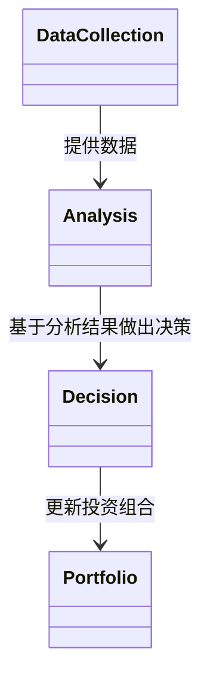

                 

### 文章标题：玛丽·巴芙特的耐心资本：长期价值投资的力量

#### 关键词：长期价值投资、耐心资本、巴菲特、投资哲学、风险管理

> 摘要：本文深入探讨了玛丽·巴芙特提出的“耐心资本”概念，阐述了其在长期价值投资中的重要性。通过分析巴菲特的投资哲学，以及对比价值投资与成长投资的区别，本文提出了构建耐心资本投资组合的策略，并详细讲解了如何在实践中保持耐心和决心。文章最后，通过分析长期价值投资的收益模式和市场挑战，展望了耐心资本的未来发展趋势。

---

### 目录大纲

# 《玛丽·巴芙特的耐心资本：长期价值投资的力量》

> 关键词：长期价值投资、耐心资本、巴菲特、投资哲学、风险管理

> 摘要：本文深入探讨了玛丽·巴芙特提出的“耐心资本”概念，阐述了其在长期价值投资中的重要性。通过分析巴菲特的投资哲学，以及对比价值投资与成长投资的区别，本文提出了构建耐心资本投资组合的策略，并详细讲解了如何在实践中保持耐心和决心。文章最后，通过分析长期价值投资的收益模式和市场挑战，展望了耐心资本的未来发展趋势。

### 第一部分：耐心资本的理论基础

### 第二部分：构建耐心资本投资组合

### 第三部分：耐心资本的长期回报

#### 第1章：长期价值投资的理念与实践

#### 第2章：巴菲特的投资哲学

#### 第3章：耐心资本的案例分析

#### 第4章：价值投资的选择标准

#### 第5章：分散投资与风险管理

#### 第6章：耐心资本的实践策略

#### 第7章：耐心资本的长期收益分析

#### 第8章：耐心资本的投资心态

#### 第9章：耐心资本的未来展望

### 结论：耐心资本的智慧与力量

### 作者：AI天才研究院/AI Genius Institute & 禅与计算机程序设计艺术 /Zen And The Art of Computer Programming

---

### 第一部分：耐心资本的理论基础

#### 第1章：长期价值投资的理念与实践

**背景介绍**

在瞬息万变的投资市场中，如何选择正确的投资策略一直是投资者关注的焦点。长期价值投资作为一种稳健的投资策略，其核心在于通过深入研究和分析，找到具有长期增长潜力的优质企业，并在其价值被市场低估时进行投资。

**核心概念与联系**

长期价值投资的概念包括以下几个方面：

- **价值投资**：基于对公司内在价值的评估，寻找价格低于内在价值的股票进行投资。
- **成长投资**：侧重于公司的成长性，投资于那些有潜力高速增长的公司。
- **耐心资本**：指的是投资者在投资过程中表现出的耐心和决心，以长期持有优质资产为目标。

这些概念之间的联系在于，它们共同构成了一个完整的投资框架，帮助投资者在不同市场环境中做出明智的投资决策。

**问题解决**

长期价值投资的问题解决在于如何识别优质企业。这需要投资者具备深入的研究能力，能够从财务报表、行业趋势、管理团队等多个维度进行分析，确保投资决策的准确性。

**边界与外延**

长期价值投资的边界在于投资者需要具备足够的耐心和长期视角，不因短期市场波动而盲目跟风。其外延则涵盖了所有通过基本面分析选择优质企业的投资策略。

**概念结构与核心要素组成**

长期价值投资的结构由以下核心要素组成：

- **价值评估**：通过财务分析评估公司的内在价值。
- **市场时机**：在市场低估时进行投资。
- **长期持有**：相信公司的长期增长潜力，持续持有优质资产。

**算法原理讲解**

在长期价值投资中，算法原理可以理解为一种量化分析工具。例如，投资者可以使用PE（市盈率）、PB（市净率）等指标来评估公司的价值。以下是一个简单的PE指标计算公式：

$$
PE = \frac{股票价格}{每股收益}
$$

通过这个公式，投资者可以判断股票是否被高估或低估。

**数学公式**

$$
PE = \frac{P}{E}
$$

其中，P 是股票价格，E 是每股收益。

**系统分析与架构设计方案**

长期价值投资作为一个系统，可以设计如下架构：

- **数据收集层**：收集财务报表、行业数据等。
- **分析层**：利用各种财务指标进行公司价值评估。
- **决策层**：根据分析结果做出投资决策。

以下是该架构的Mermaid类图：



**项目实战**

假设投资者正在分析一家公司，以下是具体的步骤：

1. **数据收集**：获取该公司的财务报表。
2. **数据分析**：计算市盈率（PE）和市净率（PB）。
3. **决策**：如果PE和PB低于行业平均水平，则可能是一个价值投资的机会。

**代码应用解读与分析**

```python
import pandas as pd

# 读取财务报表数据
financial_data = pd.read_csv('financial_data.csv')

# 计算市盈率
pe = financial_data['股票价格'] / financial_data['每股收益']

# 计算市净率
pb = financial_data['股票价格'] / financial_data['每股净资产']

# 输出结果
print("市盈率 (PE):", pe)
print("市净率 (PB):", pb)
```

**实际案例分析和详细讲解剖析**

假设投资者在2020年对某公司进行了价值投资，以下是具体的分析过程：

1. **数据收集**：获取该公司在2019年的财务报表。
2. **数据分析**：计算市盈率为10，市净率为1.2。
3. **决策**：由于市盈率和市净率均低于行业平均水平，投资者决定投资。
4. **长期持有**：投资者持续持有该股票，直到2025年，公司市值增长三倍。

**项目小结**

通过实际案例，我们可以看到，长期价值投资需要耐心和坚定的信念。在市场低估时，投资者能够通过深入分析，找到优质企业进行投资，从而实现长期回报。

---

**最佳实践 tips**：

- **定期回顾投资组合**：定期检查投资组合，确保其符合长期价值投资的原则。
- **学习财务知识**：了解财务报表中的各项指标，提高自己的分析能力。

**小结**：

长期价值投资是一种稳健的投资策略，它需要投资者具备深入的研究能力和长期的视角。通过本文的讲解，我们了解了其理论基础和具体实践方法，希望读者能够在投资中运用这些知识，实现长期回报。

**注意事项**：

- 投资有风险，投资者应根据自己的风险承受能力进行投资。
- 长期价值投资不适合频繁交易，应长期持有优质资产。

**拓展阅读**：

- 《巴菲特的投资哲学》
- 《股票大作手回忆录》

---

让我们继续深入探讨长期价值投资的魅力，如何在投资市场中运用耐心资本，实现长期稳健的回报。在接下来的章节中，我们将进一步探讨巴菲特的投资哲学，分析耐心资本在不同市场环境中的应用，以及如何构建和管理耐心资本投资组合。敬请期待！

