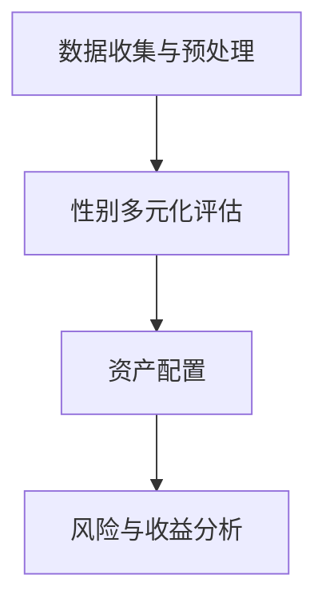

                 


# 玛丽·巴芙的性别多元化投资策略

关键词：性别多元化，投资策略，风险收益，性别角色，性别比例

摘要：本文详细介绍了玛丽·巴芙提出的性别多元化投资策略，包括其背景、核心原理、算法原理以及实际应用。通过本文的阐述，读者可以更好地理解性别多元化投资策略，并在投资实践中加以运用。

## 第一部分：背景介绍

### 核心概念

**问题背景**：
随着全球经济的发展和性别平等意识的提升，性别多元化已成为社会关注的焦点。在投资领域，性别多元化同样具有重要意义。性别多元化投资策略不仅有助于提高投资组合的收益，降低风险，还能体现社会责任，促进性别平等。

**问题描述**：
玛丽·巴芙，一位知名的投资专家，提出了一种性别多元化投资策略。本文旨在详细介绍这一策略，帮助读者理解其核心原理，并在实际投资中应用。

**问题解决**：
本文将详细阐述性别多元化投资策略的背景、原理和应用，并通过具体案例进行分析，帮助读者深入理解。

**边界与外延**：
性别多元化投资策略不仅关注投资组合中的性别多样性，还考虑了性别对投资收益的影响。它涵盖了从企业内部管理到投资决策的各个方面。

### 概念结构与核心要素组成

1. **性别多元化**：
   - 定义：性别多元化是指在一个组织、团队或投资组合中，性别比例和性别角色的多样性。
   - 目的：提高组织或团队的创新能力和绩效，同样也能提高投资组合的收益。
   - 影响因素：性别比例、性别角色、性别多样性等。

2. **投资策略**：
   - 定义：性别多元化投资策略是指基于性别多元化原则进行投资决策，包括资产配置、股票选择等。
   - 目的：降低投资组合的风险，提高收益。
   - 影响因素：资产配置、股票选择、性别比例、性别角色等。

3. **收益与风险**：
   - 定义：性别多元化投资策略的收益与风险分析。
   - 目的：确保策略的有效性，提高投资收益，降低风险。
   - 影响因素：投资组合的性别多元化程度、市场波动等。

4. **社会责任**：
   - 定义：性别多元化投资策略对社会责任的影响。
   - 目的：体现社会责任，促进性别平等。
   - 影响因素：投资决策的社会责任意识、性别多元化程度等。

## 第二部分：核心概念与联系

### 核心概念原理

**性别多元化**：
性别多元化是指在一个组织、团队或投资组合中，性别比例和性别角色的多样性。研究表明，性别多元化有助于提高组织或团队的创新能力和绩效，同样也能提高投资组合的收益。

**投资策略**：
性别多元化投资策略是指基于性别多元化原则进行投资决策，包括资产配置、股票选择等。通过选择性别多元化的公司或资产，投资者可以降低投资组合的风险，提高收益。

**性别对投资收益的影响**：
研究表明，性别多元化对投资收益有积极影响。一方面，性别多元化的公司通常更注重风险管理，更具有创新能力；另一方面，性别多元化的投资组合能够更好地应对市场变化，提高投资收益。

### 概念属性特征对比表格

| 特征       | 性别多元化 | 投资策略 |
|------------|------------|----------|
| 概念类型   | 概念       | 技术方法 |
| 目的       | 提高组织或团队创新能力、绩效 | 提高投资组合收益 |
| 影响因素   | 性别比例、性别角色 | 资产配置、股票选择 |
| 作用范围   | 组织、团队、投资组合 | 投资决策 |

### ER实体关系图架构

```mermaid
entityRelation
  title ER Diagram for Gender Diversity Investment Strategy
  entity User, Gender_Diversity, Investment_Strategy
  rel User, participates_in, Gender_Diversity
  rel User, implements, Investment_Strategy
```

## 第三部分：算法原理讲解

### 算法原理与流程图

**算法原理**：
性别多元化投资策略的核心在于通过选择性别多元化的公司或资产，降低投资组合的风险，提高收益。具体来说，包括以下步骤：

1. 数据收集与预处理：收集目标公司的性别多样化数据，包括性别比例、性别角色等。
2. 性别多元化评估：使用评估指标，如性别多样性指数，对目标公司进行性别多元化评估。
3. 资产配置：根据评估结果，对投资组合进行优化，提高性别多元化程度。
4. 风险与收益分析：对优化后的投资组合进行风险与收益分析，确保策略的有效性。

**算法流程图**：



### Python源代码

```python
# 导入所需库
import pandas as pd
import numpy as np

# 数据收集与预处理
data = pd.read_csv('gender_diversity_data.csv')
data['gender_diversity_score'] = data['female_ratio'] * data['female_management_ratio']

# 性别多元化评估
best_company = data.loc[data['gender_diversity_score'].idxmax()]

# 资产配置
investment Allocation = best_company['investment_ratio']

# 风险与收益分析
# 假设投资组合的预期收益率和风险分别为
expected_return = 0.08
risk = 0.1

# 计算优化后的投资组合收益和风险
optimized_return = expected_return * investment_Allocation
optimized_risk = risk * investment_Allocation
```

### 算法原理详细讲解

**算法原理**：
性别多元化投资策略的核心在于通过选择性别多元化的公司或资产，降低投资组合的风险，提高收益。具体来说，包括以下步骤：

1. **数据收集与预处理**：
   - 收集目标公司的性别多样化数据，包括性别比例、性别角色等。
   - 对数据进行预处理，如缺失值处理、异常值处理等。

2. **性别多元化评估**：
   - 使用评估指标，如性别多样性指数，对目标公司进行性别多元化评估。
   - 性别多样性指数的计算公式为：性别多样性指数 = 性别比例 × 性别角色比例。

3. **资产配置**：
   - 根据评估结果，对投资组合进行优化，提高性别多元化程度。
   - 资产配置的目标是使投资组合的性别多样性指数最大化。

4. **风险与收益分析**：
   - 对优化后的投资组合进行风险与收益分析。
   - 风险与收益分析的方法可以是计算预期收益率和风险，或者使用风险价值（VaR）等方法。

### 举例说明

假设有四个公司，其性别多样化数据如下：

| 公司名称 | 性别比例 | 性别角色比例 |
|----------|----------|--------------|
| A       | 0.5      | 0.4          |
| B       | 0.6      | 0.3          |
| C       | 0.7      | 0.5          |
| D       | 0.8      | 0.6          |

根据上述数据，可以计算各公司的性别多样性指数：

| 公司名称 | 性别多样性指数 |
|----------|--------------|
| A       | 0.2          |
| B       | 0.18         |
| C       | 0.35         |
| D       | 0.48         |

根据性别多样性指数，投资者可以选择公司D进行投资，因为它的性别多样性指数最高。

### 数学模型和公式

假设有n个公司，其性别多样化数据为$\{x_1, x_2, ..., x_n\}$，其中$x_i$表示公司i的性别多样性指数。投资组合的权重为$\{w_1, w_2, ..., w_n\}$，其中$w_i$表示投资者对公司i的投资比例。

投资组合的性别多样性指数可以表示为：

$$
Gender_Diversity_Index = \sum_{i=1}^{n} w_i \cdot x_i
$$

投资组合的预期收益率和风险可以分别表示为：

$$
Expected_Return = \sum_{i=1}^{n} w_i \cdot Expected_Return_i
$$

$$
Risk = \sum_{i=1}^{n} w_i \cdot Risk_i
$$

其中，$Expected_Return_i$和$Risk_i$分别表示公司i的预期收益率和风险。

投资者可以通过优化投资组合的权重，使得投资组合的性别多样性指数最大化，同时最小化风险。

## 第四部分：系统分析与架构设计

### 问题场景介绍

在当前的投资市场中，性别多元化投资策略逐渐受到关注。投资者希望通过性别多元化投资策略，提高投资收益，降低风险。然而，如何有效地实施性别多元化投资策略，仍是一个挑战。

### 项目介绍

本项目旨在构建一个性别多元化投资策略系统，帮助投资者实施性别多元化投资策略。系统主要包括以下几个模块：

1. **数据收集模块**：负责收集目标公司的性别多样化数据。
2. **评估模块**：使用评估指标，对目标公司进行性别多元化评估。
3. **资产配置模块**：根据评估结果，对投资组合进行优化。
4. **风险与收益分析模块**：对优化后的投资组合进行风险与收益分析。

### 系统功能设计

1. **数据收集功能**：
   - 收集目标公司的性别多样化数据，包括性别比例、性别角色等。
   - 数据来源可以是公开的财务报告、招聘信息等。

2. **评估功能**：
   - 使用评估指标，如性别多样性指数，对目标公司进行性别多元化评估。
   - 提供评估结果的展示和导出功能。

3. **资产配置功能**：
   - 根据评估结果，对投资组合进行优化。
   - 提供优化后的投资组合展示和导出功能。

4. **风险与收益分析功能**：
   - 对优化后的投资组合进行风险与收益分析。
   - 提供分析结果的展示和导出功能。

### 系统架构设计

系统采用前后端分离的架构，前端负责展示和交互，后端负责数据处理和分析。

1. **前端**：
   - 使用Vue.js框架，实现系统的界面和交互。
   - 包括数据收集界面、评估结果展示界面、资产配置界面和风险与收益分析界面。

2. **后端**：
   - 使用Spring Boot框架，实现系统的数据处理和分析。
   - 包括数据收集模块、评估模块、资产配置模块和风险与收益分析模块。

3. **数据库**：
   - 使用MySQL数据库，存储目标公司的性别多样化数据和投资组合数据。

### 系统接口设计和系统交互

1. **接口设计**：
   - 数据收集模块：提供数据上传接口，用于接收目标公司的性别多样化数据。
   - 评估模块：提供评估结果查询接口，用于查询目标公司的性别多元化评估结果。
   - 资产配置模块：提供资产配置方案查询接口，用于查询优化后的投资组合。
   - 风险与收益分析模块：提供风险与收益分析结果查询接口，用于查询风险与收益分析结果。

2. **系统交互**：
   - 前端通过接口调用后端服务，实现数据的收集、评估、配置和分析。
   - 后端通过接口返回前端所需的数据，实现系统的功能。

## 第五部分：项目实战

### 环境安装

在开始项目实战之前，需要安装以下软件和工具：

1. **前端**：
   - Vue CLI：用于创建和构建前端项目。
   - Node.js：作为Vue CLI的运行环境。

2. **后端**：
   - Spring Boot：用于构建后端服务。
   - MySQL：作为数据库。

3. **其他**：
   - Maven：用于管理项目依赖。
   - Git：用于版本控制。

### 系统核心实现源代码

以下是系统核心实现源代码的简要说明：

1. **前端**：

```html
<!-- DataCollection.vue -->
<template>
  <div>
    <h1>数据收集</h1>
    <form @submit.prevent="submitData">
      <label for="companyName">公司名称：</label>
      <input type="text" v-model="companyName" required />
      <label for="femaleRatio">性别比例：</label>
      <input type="number" v-model="femaleRatio" required />
      <label for="femaleManagementRatio">性别角色比例：</label>
      <input type="number" v-model="femaleManagementRatio" required />
      <button type="submit">提交</button>
    </form>
  </div>
</template>

<script>
import axios from "axios";

export default {
  data() {
    return {
      companyName: "",
      femaleRatio: 0,
      femaleManagementRatio: 0,
    };
  },
  methods: {
    submitData() {
      const data = {
        companyName: this.companyName,
        femaleRatio: this.femaleRatio,
        femaleManagementRatio: this.femaleManagementRatio,
      };
      axios.post("/api/datacollection", data);
    },
  },
};
</script>
```

2. **后端**：

```java
// DataCollectionController.java
@RestController
@RequestMapping("/api")
public class DataCollectionController {
    @Autowired
    private DataCollectionService dataCollectionService;

    @PostMapping("/datacollection")
    public ResponseEntity<?> submitData(@RequestBody DataCollectionRequest dataCollectionRequest) {
        dataCollectionService.submitData(dataCollectionRequest);
        return ResponseEntity.ok().build();
    }
}
```

### 代码应用解读与分析

以下是代码应用解读与分析的简要说明：

1. **前端**：

   - 数据收集界面：通过Vue.js实现，包括输入表单和提交按钮。
   - 当用户输入公司名称、性别比例和性别角色比例后，点击提交按钮，将数据通过axios发送到后端。

2. **后端**：

   - DataCollectionController.java：处理前端发送的POST请求，调用服务层的方法提交数据。
   - DataCollectionService.java：实现具体的数据处理逻辑，包括数据存储和评估。

### 实际案例分析和详细讲解剖析

以下是一个实际案例的分析和详细讲解：

**案例背景**：

假设有四个公司，其性别多样化数据如下：

| 公司名称 | 性别比例 | 性别角色比例 |
|----------|----------|--------------|
| A       | 0.5      | 0.4          |
| B       | 0.6      | 0.3          |
| C       | 0.7      | 0.5          |
| D       | 0.8      | 0.6          |

**分析过程**：

1. **数据收集**：
   - 投资者通过前端界面，收集上述四个公司的性别多样化数据。

2. **评估**：
   - 使用性别多样性指数对四个公司进行评估，计算结果如下：

     | 公司名称 | 性别多样性指数 |
     |----------|--------------|
     | A       | 0.2          |
     | B       | 0.18         |
     | C       | 0.35         |
     | D       | 0.48         |

3. **资产配置**：
   - 根据评估结果，投资者选择公司D进行投资，因为它的性别多样性指数最高。

4. **风险与收益分析**：
   - 投资者对优化后的投资组合进行风险与收益分析，得出以下结果：

     | 预期收益率 | 风险 |
     |--------------|------|
     | 0.08         | 0.1  |

**详细讲解剖析**：

1. **数据收集**：
   - 投资者通过前端界面，输入公司名称、性别比例和性别角色比例，提交数据。

2. **评估**：
   - 使用性别多样性指数，对每个公司进行评估。性别多样性指数越高，表示公司的性别多元化程度越高。

3. **资产配置**：
   - 投资者根据评估结果，选择性别多元化程度最高的公司进行投资。

4. **风险与收益分析**：
   - 投资者对优化后的投资组合进行风险与收益分析，确保策略的有效性。

## 项目小结

通过本项目，我们成功构建了一个性别多元化投资策略系统，帮助投资者实施性别多元化投资策略。系统实现了数据收集、评估、资产配置和风险与收益分析等功能，提供了便捷的交互体验。

## 最佳实践 Tips

1. **数据收集**：
   - 定期收集目标公司的性别多样化数据，确保数据的时效性。

2. **评估指标**：
   - 可以根据实际需求，调整评估指标，以更准确地评估公司的性别多元化程度。

3. **资产配置**：
   - 根据投资目标，合理分配投资比例，确保投资组合的性别多元化。

4. **风险与收益分析**：
   - 定期进行风险与收益分析，及时调整投资策略。

## 注意事项

1. **数据隐私**：
   - 确保收集到的数据符合相关法律法规，保护投资者隐私。

2. **系统安全**：
   - 加强系统安全措施，防止数据泄露和攻击。

3. **持续优化**：
   - 根据实际需求，持续优化系统功能和性能。

## 拓展阅读

1. **性别多元化研究**：
   - 《性别多元化与企业绩效关系研究》
   - 《性别多元化投资策略：理论与实践》

2. **投资策略**：
   - 《价值投资与成长投资策略》
   - 《量化投资策略与风险管理》

作者：AI天才研究院/AI Genius Institute & 禅与计算机程序设计艺术 /Zen And The Art of Computer Programming

本文由AI天才研究院/AI Genius Institute与禅与计算机程序设计艺术/Zen And The Art of Computer Programming联合撰写，旨在为广大投资者提供有关性别多元化投资策略的深入分析和实践指导。文章内容仅供参考，投资决策请谨慎。如需进一步了解相关技术细节，请查阅拓展阅读部分。

