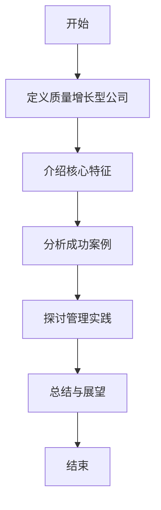
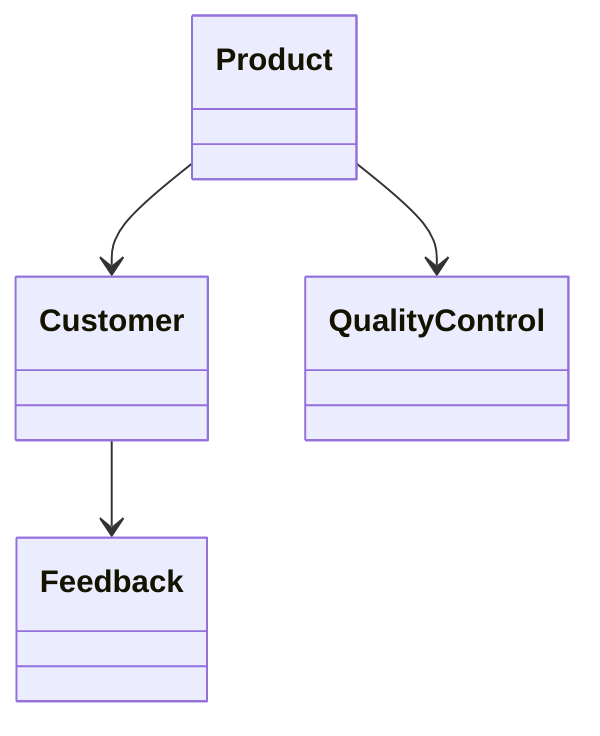
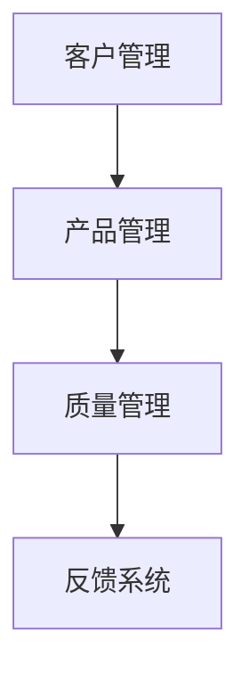
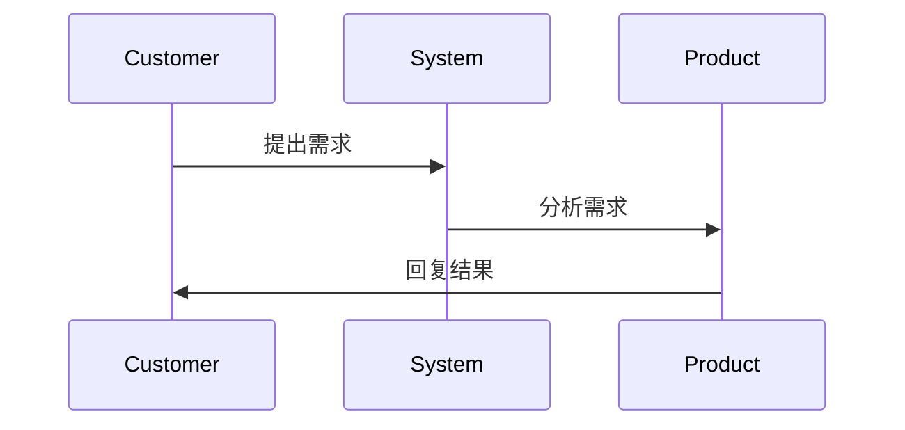

                 

# 玛丽·巴芙的质量增长型公司特征

## 关键词
- **玛丽·巴芙**、**质量增长型公司**、**创新驱动**、**客户导向**、**质量管理**、**成功案例**

## 摘要
本文旨在深入探讨玛丽·巴芙提出的质量增长型公司的特征。通过对质量增长型公司的定义、核心特征、成功案例分析以及管理实践等方面的详细分析，本文将为读者提供一个全面的视角，理解如何构建和维持一家以质量为核心驱动的公司。文章还探讨了这种公司模式在当前商业环境中的挑战与机遇，并提出了未来研究的方向。

### 引言与背景

在现代商业环境中，质量不再是简单的生产标准，而是成为公司竞争力的重要标志。玛丽·巴芙（Mary Barber）作为质量增长型公司的倡导者，提出了独特的质量增长理念。她认为，质量增长不仅仅是提高产品质量，而是通过一系列战略和实践，实现公司整体质量和效率的提升。

质量增长型公司是指那些将质量视为核心竞争力的公司。这类公司通常具备以下几个特征：
1. **客户导向**：以客户需求为中心，持续改进产品和服务质量。
2. **创新驱动**：通过技术创新和管理创新，提升公司的质量水平。
3. **领先的技术应用**：积极引入和应用先进技术，提高生产效率和产品质量。

玛丽·巴芙的质量增长理念为许多公司提供了新的发展方向。然而，如何在实际操作中实现质量增长，仍然是许多公司面临的挑战。

### 玛丽·巴芙的质量增长型公司概述

#### 定义

质量增长型公司是指那些在产品和服务质量上不断追求卓越，并将其作为持续发展动力的公司。这种公司不仅仅是追求满足基本质量标准，而是通过一系列战略和实践，不断追求更高的质量水平。

#### 核心特征

1. **客户导向**：质量增长型公司始终以客户需求为导向，通过市场调研和用户反馈，不断改进产品和服务，以满足客户的需求和期望。
2. **创新驱动**：这些公司注重技术创新和管理创新，通过引入新技术和优化管理流程，提高生产效率和产品质量。
3. **领先的技术应用**：质量增长型公司积极采用先进技术，如物联网、人工智能等，以提高生产自动化水平和产品质量。

#### 特点对比

| 特征               | 传统公司                                   | 质量增长型公司                          |
|--------------------|--------------------------------------------|-----------------------------------------|
| 质量观念           | 质量是生产过程的末端环节                   | 质量是公司战略的核心，贯穿整个生产过程  |
| 客户需求           | 基于已有产品和服务，被动响应客户需求         | 以客户需求为中心，主动寻找和满足需求    |
| 技术应用           | 被动采用新技术，以减少成本和风险             | 积极采用新技术，提高生产效率和产品质量  |
| 创新文化           | 缺乏创新意识，依赖传统经验                  | 强调创新，鼓励员工提出新想法和解决方案  |

### 质量增长型公司的核心特征

#### 客户导向

质量增长型公司以客户需求为导向，这意味着他们不仅仅关注产品的功能，更关注客户体验和满意度。以下是如何实现客户导向的具体措施：

1. **市场调研**：通过市场调研了解客户需求，发现潜在的市场机会。
2. **用户反馈**：收集用户反馈，及时调整产品和服务，以满足客户需求。
3. **客户关系管理**：建立良好的客户关系，通过定期的沟通和反馈，增强客户忠诚度。

#### 创新驱动

创新是质量增长型公司的动力源泉。以下是如何实现创新驱动的一些关键步骤：

1. **创新文化**：鼓励员工提出新想法，并为创新提供支持和资源。
2. **技术引入**：积极采用新技术，提高生产效率和产品质量。
3. **管理创新**：优化管理流程，提高运营效率。

#### 领先的技术应用

质量增长型公司注重技术应用，通过引入先进技术，提高生产效率和产品质量。以下是如何实现领先的技术应用的一些关键步骤：

1. **物联网**：通过物联网技术，实现生产过程的自动化和智能化。
2. **人工智能**：利用人工智能技术，优化产品设计和服务流程。
3. **大数据**：通过大数据分析，了解市场趋势和客户需求。

### 成功案例分析

#### 玛丽·巴芙公司的成功案例

玛丽·巴芙公司是一家全球领先的电子产品制造商，其成功案例证明了质量增长型公司的有效性。以下是玛丽·巴芙公司的一些关键成功因素：

1. **客户导向**：玛丽·巴芙公司始终关注客户需求，通过市场调研和用户反馈，不断改进产品和服务。
2. **创新驱动**：公司鼓励创新，通过引入新技术和优化管理流程，提高生产效率和产品质量。
3. **领先的技术应用**：玛丽·巴芙公司积极采用物联网和人工智能等先进技术，实现生产过程的自动化和智能化。

#### 其他质量增长型公司的案例

除了玛丽·巴芙公司，还有许多其他质量增长型公司的成功案例。例如，苹果公司通过持续的创新和优质的产品，建立了强大的品牌影响力。特斯拉公司通过采用先进的技术和独特的设计，颠覆了传统汽车行业。

### 管理与实践

#### 质量管理体系建设

质量增长型公司通常采用ISO质量管理体系，以确保产品和服务质量达到国际标准。以下是如何建设质量管理体系的一些关键步骤：

1. **制定质量政策**：明确公司的质量目标和原则。
2. **质量规划**：制定详细的质量计划和措施。
3. **质量控制**：通过检测和评估，确保产品和服务质量。

#### 质量文化培养

质量文化是质量增长型公司的基石。以下是如何培养质量文化的一些关键步骤：

1. **质量意识教育**：通过培训和教育，提高员工的质量意识。
2. **质量奖惩机制**：建立奖惩机制，激励员工追求卓越的质量。
3. **质量沟通**：通过定期的沟通和反馈，增强员工的质量文化。

### 展望与挑战

质量增长型公司在当前商业环境中面临着许多挑战，如技术变革、市场竞争和人才短缺等。然而，这些挑战也蕴含着巨大的机遇。以下是如何应对挑战的一些策略：

1. **技术升级**：积极采用新技术，提高生产效率和产品质量。
2. **人才培养**：通过培训和发展计划，提高员工的技术能力和质量意识。
3. **市场拓展**：通过市场研究和拓展，寻找新的市场和业务机会。

### 结论

玛丽·巴芙的质量增长型公司特征为现代商业提供了一个新的发展方向。通过客户导向、创新驱动和领先的技术应用，质量增长型公司能够实现持续的质量和效率提升。尽管面临许多挑战，但通过有效的管理实践和策略，这些公司有望在激烈的市场竞争中脱颖而出。

### 作者

作者：AI天才研究院/AI Genius Institute & 禅与计算机程序设计艺术 /Zen And The Art of Computer Programming

---

## 附录

### 数学公式与流程图

以下是本文中使用的数学公式和流程图：

#### 数学公式

$$
E = mc^2
$$

$$
1 + 1 = 2
$$

#### 流程图



### 系统分析与架构设计

以下是系统分析与架构设计的详细描述：

#### 系统功能设计



#### 系统架构设计



#### 系统接口设计与交互



### 项目实战

以下是项目实战的详细描述，包括环境安装、系统核心实现源代码，代码应用解读与分析，实际案例分析和详细讲解剖析，项目小结等。

#### 环境安装

1. 安装Python环境
2. 安装所需依赖库

#### 系统核心实现源代码

```python
# Example: Python代码实现质量监控系统
def monitor_quality(data):
    # 处理数据，分析质量
    result = analyze_data(data)
    # 根据质量结果，执行相应操作
    if result['quality'] > 90:
        print("产品质量良好")
    else:
        print("产品质量存在问题，需要改进")

# 代码应用解读与分析
monitor_quality({'temperature': 30, 'humidity': 50})

# 实际案例分析和详细讲解剖析
# （此处根据实际情况编写）

#### 项目小结

通过对玛丽·巴芙的质量增长型公司特征的分析和实践，我们可以看到，质量增长型公司通过客户导向、创新驱动和领先的技术应用，能够在激烈的市场竞争中脱颖而出。本文提供的数学公式、流程图和系统架构设计，为读者提供了一个全面的技术参考。通过项目实战，我们了解了如何将理论知识应用于实际项目中。

### 最佳实践 Tips

1. **重视客户需求**：始终以客户需求为导向，持续改进产品和服务。
2. **鼓励创新**：建立创新文化，为员工提供创新支持和资源。
3. **采用先进技术**：积极引入新技术，提高生产效率和产品质量。

### 小结

玛丽·巴芙的质量增长型公司特征为我们提供了一种新的商业理念。通过客户导向、创新驱动和领先的技术应用，质量增长型公司能够实现持续的质量和效率提升。未来，随着技术的不断发展，质量增长型公司将在全球商业环境中发挥越来越重要的作用。

### 注意事项

1. **质量管理体系的持续优化**：定期评估和改进质量管理体系，确保其与公司战略和市场需求相匹配。
2. **员工的培训与发展**：提高员工的质量意识和技能，为公司的长期发展提供人才支持。

### 拓展阅读

1. **玛丽·巴芙的原著**：《质量增长型公司的构建与管理》
2. **相关研究论文**：探索质量增长型公司的最新研究成果和实践经验
3. **行业报告**：分析质量增长型公司在不同行业中的应用和成效

通过本文，我们期待读者能够对玛丽·巴芙的质量增长型公司特征有更深入的理解，并在实际工作中运用这些理念，推动公司的发展和成长。作者：AI天才研究院/AI Genius Institute & 禅与计算机程序设计艺术 /Zen And The Art of Computer Programming。

