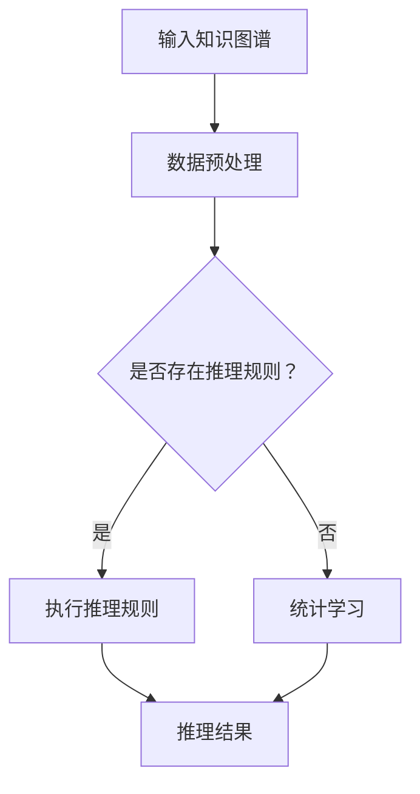
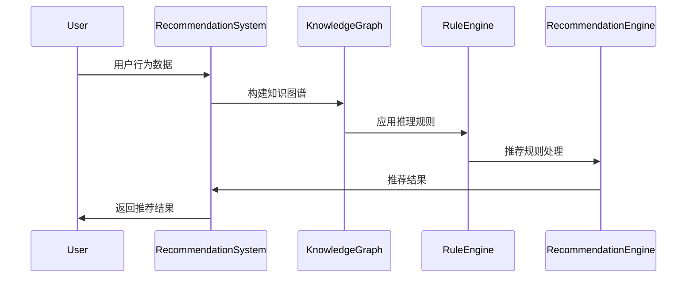

                 

### 知识图谱推理：提升AI Agent的逻辑分析

关键词：知识图谱，推理，AI Agent，逻辑分析，算法原理，系统架构

摘要：本文旨在探讨知识图谱推理在提升AI Agent逻辑分析能力方面的应用。通过详细分析知识图谱的概念、原理及其在AI Agent中的应用，本文将介绍知识图谱推理的算法原理、数学模型和公式，并展示如何通过系统架构设计实现知识图谱推理。最后，我们将通过实际项目实战，展示知识图谱推理在AI Agent中的具体应用，并提供最佳实践和拓展阅读资源。

### 设计思路

为了设计出《知识图谱推理：提升AI Agent的逻辑分析》的完整目录大纲，我们首先需要明确书籍的核心主题和目标读者。本书主要关注知识图谱推理在AI Agent中的应用，旨在提升AI Agent的逻辑分析能力。因此，我们的设计思路将围绕以下几个方面展开：

1. **背景介绍**：介绍知识图谱、知识图谱推理以及AI Agent的基本概念，帮助读者建立整体认知。
2. **核心概念与联系**：详细讲解知识图谱推理的核心概念，通过对比表格和ER实体关系图来强化读者理解。
3. **算法原理讲解**：重点介绍知识图谱推理中的算法原理，使用mermaid流程图和Python代码来详细阐述。
4. **数学模型与公式**：使用latex格式展示数学模型和公式，并进行详细讲解和举例说明。
5. **系统分析与架构设计**：介绍知识图谱推理系统的整体架构和接口设计，使用mermaid类图、架构图和序列图来展示。
6. **项目实战**：通过具体项目实例，展示知识图谱推理在AI Agent中的应用，包括环境安装、系统实现、代码解读和案例分析。
7. **最佳实践与拓展阅读**：总结最佳实践、注意事项，并提供相关拓展阅读资源。

### 目录大纲

```markdown
# 《知识图谱推理：提升AI Agent的逻辑分析》目录大纲

----------------------------------------------------------------

## 第一部分：知识图谱与AI Agent基础

### 第1章：知识图谱与AI Agent概述
1.1 问题背景与核心概念
1.2 知识图谱的定义与结构
1.3 AI Agent的定义与分类
1.4 知识图谱与AI Agent的关系
1.5 本章小结

### 第2章：核心概念与联系
2.1 知识图谱推理的核心概念
2.2 对比表格：知识图谱与AI Agent的核心概念属性对比
2.3 ER实体关系图：知识图谱推理中的实体关系图
2.4 本章小结

## 第二部分：知识图谱推理算法原理

### 第3章：知识图谱推理算法概述
3.1 知识图谱推理的基本原理
3.2 知识图谱推理的方法分类
3.3 知识图谱推理的优势与挑战
3.4 本章小结

### 第4章：算法原理讲解
4.1 mermaid流程图：知识图谱推理算法概览
4.2 Python代码示例：知识图谱推理算法实现
4.3 数学模型与公式
   4.3.1 知识图谱推理的数学模型
   4.3.2 相关公式讲解
4.4 举例说明：知识图谱推理的实际应用
4.5 本章小结

## 第三部分：知识图谱推理系统设计与实现

### 第5章：系统分析与架构设计
5.1 问题场景介绍
5.2 系统功能设计（领域模型mermaid类图）
5.3 系统架构设计（mermaid架构图）
5.4 系统接口设计
5.5 系统交互（mermaid序列图）
5.6 本章小结

### 第6章：项目实战
6.1 环境安装与配置
6.2 系统核心实现源代码
6.3 代码解读与分析
6.4 实际案例分析与详细讲解
6.5 项目小结

## 第四部分：最佳实践与拓展阅读

### 第7章：最佳实践与注意事项
7.1 知识图谱推理的最佳实践
7.2 注意事项与风险规避
7.3 拓展阅读资源

### 第8章：总结与展望
8.1 书籍内容回顾
8.2 未来发展趋势
8.3 对读者的寄语

----------------------------------------------------------------
```

### 第1章：知识图谱与AI Agent概述

#### 1.1 问题背景与核心概念

在当今信息爆炸的时代，数据已成为企业和社会的核心资产。然而，如何有效地管理和利用这些数据，已成为众多企业和研究机构亟待解决的问题。知识图谱作为一种强大的数据表示和推理工具，因其能够将数据以结构化的形式进行组织，并在数据之间建立关联，从而为人工智能（AI）系统提供强大的支持。AI Agent，即人工智能代理，是一种能够自主执行任务的智能体，它们依赖于知识图谱来提高其逻辑分析和决策能力。

知识图谱是一种语义网络，它将实体、概念和属性通过边进行关联，形成一个复杂的网络结构。通过知识图谱，AI Agent可以更好地理解世界，进行推理和决策。知识图谱推理则是指利用知识图谱进行逻辑推理的过程，它能够发现数据之间的潜在关联，从而为AI Agent提供更加准确和高效的决策支持。

#### 1.2 知识图谱的定义与结构

知识图谱是由实体、属性和关系组成的语义网络。实体是知识图谱中的基本元素，如人、地点、组织等。属性是对实体的特征描述，如姓名、年龄、地理位置等。关系是实体之间的关联，如“居住于”、“属于”等。

知识图谱的结构主要包括两种：图和树。图是一种无向图结构，它允许实体之间任意关联。树是一种有向图结构，它通常用于表示层次结构，如分类层次、组织结构等。

#### 1.3 AI Agent的定义与分类

AI Agent是一种能够自主执行任务、与环境进行交互的智能体。根据功能特点，AI Agent可以分为以下几类：

1. **任务型AI Agent**：这类Agent专注于完成特定任务，如客服机器人、自动驾驶汽车等。
2. **社交型AI Agent**：这类Agent能够与人类进行自然语言交流，如聊天机器人、智能助手等。
3. **自主型AI Agent**：这类Agent具备自我学习和适应能力，能够自主完成复杂任务，如智能安防系统、智能家居等。

#### 1.4 知识图谱与AI Agent的关系

知识图谱与AI Agent之间的关系是相辅相成的。知识图谱为AI Agent提供了丰富的背景知识，使得AI Agent能够更好地理解问题和做出决策。同时，AI Agent通过对知识图谱的推理，可以发现新的关联和洞见，从而丰富知识图谱的内容。

在AI Agent的应用中，知识图谱推理起到了至关重要的作用。通过知识图谱推理，AI Agent可以扩展其知识库，发现新的规则和模式，从而提高其逻辑分析和决策能力。例如，在智能客服中，知识图谱推理可以帮助AI Agent快速准确地理解用户的问题，并提供合适的解决方案。

#### 1.5 本章小结

本章介绍了知识图谱和AI Agent的基本概念，并探讨了它们之间的关系。知识图谱作为一种强大的数据表示和推理工具，能够为AI Agent提供丰富的背景知识。而知识图谱推理则能够提升AI Agent的逻辑分析和决策能力。在接下来的章节中，我们将深入探讨知识图谱推理的算法原理、系统架构和应用实践。

### 第2章：核心概念与联系

#### 2.1 知识图谱推理的核心概念

知识图谱推理是利用知识图谱进行逻辑推理的过程，它旨在发现数据之间的潜在关联，从而为AI Agent提供更加准确和高效的决策支持。知识图谱推理的核心概念包括实体、属性、关系和推理规则。

**实体**：实体是知识图谱中的基本元素，如人、地点、组织等。实体可以表示为图中的一个节点。

**属性**：属性是对实体的特征描述，如姓名、年龄、地理位置等。属性可以表示为实体节点的标签或边。

**关系**：关系是实体之间的关联，如“居住于”、“属于”等。关系可以表示为实体节点之间的边。

**推理规则**：推理规则是知识图谱推理的基础，它定义了如何根据已知的事实推导出新的结论。推理规则通常包括条件部分和结论部分。

#### 2.2 对比表格：知识图谱与AI Agent的核心概念属性对比

下面是一个对比表格，展示了知识图谱和AI Agent的核心概念属性。

| 概念       | 知识图谱             | AI Agent                 |
|------------|---------------------|-------------------------|
| 实体       | 节点                 | 智能体                   |
| 属性       | 标签或边             | 特征描述                 |
| 关系       | 边                   | 关联                     |
| 推理规则   | 定义逻辑推理的规则   | 决策规则                 |

#### 2.3 ER实体关系图：知识图谱推理中的实体关系图

ER实体关系图（Entity-Relationship Diagram）是一种用于描述实体和关系之间关系的图形化工具。在知识图谱推理中，ER实体关系图可以帮助我们理解实体之间的关系，并定义推理规则。

下面是一个简单的ER实体关系图示例，展示了“学生”、“课程”和“教师”三个实体之间的关系：

```mermaid
erDiagram
  学生 ||--|{ 课程 }|| 参加课程
  学生 ||--|{ 教师 }|| 教师授课
  课程 ||--|{ 教师 }|| 教授课程
```

在这个ER实体关系图中，学生与课程之间存在“参加课程”的关系，学生与教师之间存在“教师授课”的关系，课程与教师之间存在“教授课程”的关系。

#### 2.4 本章小结

本章介绍了知识图谱推理的核心概念，并通过对比表格和ER实体关系图，帮助读者理解知识图谱与AI Agent之间的联系。知识图谱推理是利用知识图谱进行逻辑推理的过程，它能够发现数据之间的潜在关联，从而为AI Agent提供更加准确和高效的决策支持。在接下来的章节中，我们将深入探讨知识图谱推理的算法原理、数学模型和系统架构。

### 第3章：知识图谱推理算法概述

#### 3.1 知识图谱推理的基本原理

知识图谱推理是一种基于知识的推理方法，它利用知识图谱中的实体、属性和关系进行推理，以发现数据之间的潜在关联。知识图谱推理的基本原理可以概括为以下几个步骤：

1. **知识提取**：从原始数据中提取实体、属性和关系，构建知识图谱。
2. **推理规则定义**：根据业务需求，定义推理规则，用于指导推理过程。
3. **推理过程**：根据推理规则，对知识图谱进行推理，发现新的关联和结论。
4. **结果验证**：对推理结果进行验证，确保其正确性和有效性。

#### 3.2 知识图谱推理的方法分类

知识图谱推理的方法可以分为两大类：基于规则推理和基于统计推理。

**基于规则推理**：这种方法依赖于预先定义的推理规则，通过匹配规则条件和结论，实现知识推理。常见的基于规则推理算法包括：

1. **RDF规则推理**：基于RDF（Resource Description Framework）的规则推理，它利用OWL（Web Ontology Language）定义的推理规则进行推理。
2. **规则匹配**：通过匹配事实和规则的条件部分，推导出结论。

**基于统计推理**：这种方法通过学习数据中的统计规律，进行推理。常见的基于统计推理算法包括：

1. **概率图模型**：如贝叶斯网络、马尔可夫网络等，通过概率关系进行推理。
2. **深度学习**：利用神经网络学习数据中的统计规律，进行推理。

#### 3.3 知识图谱推理的优势与挑战

**优势**：

1. **强大的表达能力**：知识图谱能够表示复杂的关系和语义，为推理提供了丰富的信息。
2. **高效的推理能力**：基于规则和统计的推理方法，能够在大规模数据上进行快速推理。
3. **跨领域应用**：知识图谱可以跨领域应用，为不同领域的AI应用提供统一的基础。

**挑战**：

1. **数据质量**：知识图谱的推理能力依赖于数据质量，低质量的数据可能导致错误的推理结果。
2. **推理效率**：在大规模数据集上进行推理时，效率成为了一个重要的挑战。
3. **推理解释性**：对于复杂推理过程，如何解释和验证推理结果，是一个亟待解决的问题。

#### 3.4 本章小结

本章介绍了知识图谱推理的基本原理和常见方法，并分析了其优势和挑战。知识图谱推理是一种基于知识的推理方法，通过构建知识图谱、定义推理规则和进行推理过程，实现数据之间的关联发现。在接下来的章节中，我们将深入探讨知识图谱推理的算法原理和具体实现。

### 第4章：算法原理讲解

#### 4.1 mermaid流程图：知识图谱推理算法概览

知识图谱推理算法的核心在于如何利用已有的知识和规则，发现新的关联和结论。下面是一个mermaid流程图，展示了知识图谱推理的基本流程。



在这个流程图中，我们首先输入知识图谱，然后进行数据预处理。接下来，判断是否存在推理规则。如果存在推理规则，则执行推理规则；否则，通过统计学习方法进行推理。最后，得到推理结果。

#### 4.2 Python代码示例：知识图谱推理算法实现

为了更好地理解知识图谱推理算法的实现，我们提供了一个简单的Python代码示例。这个示例基于一个简单的知识图谱，展示了如何利用推理规则进行推理。

```python
class KnowledgeGraph:
    def __init__(self):
        self.entities = {}
        self.rules = []

    def add_entity(self, entity):
        self.entities[entity] = []

    def add_relation(self, entity1, entity2, relation):
        self.entities[entity1].append((entity2, relation))
        self.entities[entity2].append((entity1, relation))

    def add_rule(self, rule):
        self.rules.append(rule)

    def infer(self, entity):
        for rule in self.rules:
            conditions, conclusion = rule
            if all(condition in self.entities[entity] for condition in conditions):
                self.entities[entity].append(conclusion)
        return self.entities[entity]

if __name__ == "__main__":
    kg = KnowledgeGraph()
    kg.add_entity("A")
    kg.add_entity("B")
    kg.add_entity("C")
    kg.add_relation("A", "B", "knows")
    kg.add_relation("B", "C", "friend")
    kg.add_rule([("A", "knows"), ("B", "friend"), [("A", "friend")]])
    print(kg.infer("A"))
```

在这个示例中，我们定义了一个`KnowledgeGraph`类，用于表示知识图谱。该类提供了添加实体、添加关系和添加推理规则的方法。`infer`方法用于执行推理过程，根据推理规则，将新的关系添加到实体中。

#### 4.3 数学模型与公式

在知识图谱推理中，数学模型和公式起到了关键作用。下面是一个简单的数学模型和公式示例，用于描述推理过程。

**数学模型**：

$$
P(A|B,C) = \frac{P(B|A,C)P(A,C)}{P(C)}
$$

其中，$P(A|B,C)$ 表示在已知 $B$ 和 $C$ 的情况下，$A$ 发生的概率。$P(B|A,C)$ 表示在已知 $A$ 和 $C$ 的情况下，$B$ 发生的概率。$P(A,C)$ 表示 $A$ 和 $C$ 同时发生的概率。$P(C)$ 表示 $C$ 发生的概率。

**公式讲解**：

1. **条件概率**：条件概率表示在某个条件下，某个事件发生的概率。例如，$P(A|B)$ 表示在已知 $B$ 发生的情况下，$A$ 发生的概率。

2. **贝叶斯公式**：贝叶斯公式是一种计算条件概率的方法，它利用已知的条件概率和总概率，计算另一个条件概率。

3. **推理过程**：在知识图谱推理中，我们通常需要根据已知的事实，计算某个结论的概率。贝叶斯公式提供了一个有效的计算方法。

#### 4.4 举例说明：知识图谱推理的实际应用

为了更好地理解知识图谱推理的实际应用，我们考虑一个简单的案例。假设有一个知识图谱，描述了学生、课程和教师之间的关系。现在我们需要推理出某个学生是否参加了一门特定的课程。

**案例描述**：

1. 学生 A 知道学生 B。
2. 学生 B 是课程 C 的朋友。
3. 课程 C 是教师 D 教授的课程。

我们需要根据这些信息，推理出学生 A 是否参加了课程 C。

**推理过程**：

1. 首先，我们根据已知的关系，构建知识图谱。
2. 然后，我们定义一个推理规则，表示如果一个人知道另一个人，并且这个人是某个课程的教授者，那么这个人可能参加了这个课程。
3. 最后，我们根据推理规则，对知识图谱进行推理，得出结论。

通过这个简单的案例，我们可以看到知识图谱推理的基本过程。在实际应用中，知识图谱和推理规则可能会更加复杂，但基本原理是相似的。

#### 4.5 本章小结

本章介绍了知识图谱推理的算法原理，通过mermaid流程图和Python代码示例，展示了知识图谱推理的基本流程和实现方法。我们还介绍了数学模型和公式，用于描述推理过程。通过举例说明，我们展示了知识图谱推理的实际应用。在接下来的章节中，我们将进一步探讨知识图谱推理系统设计与实现。

### 第5章：系统分析与架构设计

#### 5.1 问题场景介绍

为了更好地理解知识图谱推理系统的设计与实现，我们首先需要介绍一个具体的应用场景。假设我们正在开发一个智能推荐系统，该系统旨在根据用户的兴趣和行为，为其推荐相关的商品和服务。为了实现这一目标，我们需要利用知识图谱进行推理，以发现用户和商品之间的潜在关联。

#### 5.2 系统功能设计（领域模型mermaid类图）

在知识图谱推理系统中，领域模型是核心部分。领域模型定义了系统中的实体和关系，以及它们之间的交互方式。以下是一个mermaid类图，展示了智能推荐系统的领域模型：

```mermaid
classDiagram
    User <<实体>>
    Item <<实体>>
    Recommendation <<实体>>

    User "1"---*"many": Item{喜欢的商品}
    Item "1"---*"many": User{喜欢这个商品的用户}
    User "1"---*"many": Recommendation{推荐的商品}
```

在这个类图中，我们定义了三个实体：用户（User）、商品（Item）和推荐（Recommendation）。用户可以喜欢多个商品，商品可以被多个用户喜欢，用户还可以收到多个推荐。

#### 5.3 系统架构设计（mermaid架构图）

系统的架构设计决定了系统的模块划分、功能分配和模块之间的交互方式。以下是一个mermaid架构图，展示了智能推荐系统的架构：



在这个架构图中，用户首先将行为数据发送给推荐系统。推荐系统将数据用于构建知识图谱，并应用推理规则进行推理。最终，推荐系统将推荐结果返回给用户。

#### 5.4 系统接口设计

系统的接口设计决定了外部系统如何与系统进行交互。以下是一个接口设计示例：

```mermaid
interface RecommendationSystem {
    +construct(): void
    +addUserBehavior(data: UserBehavior): void
    +getRecommendations(): Recommendation[]
}

interface UserBehavior {
    +userId: string
    +action: string
    +itemId: string
    +timestamp: Date
}

interface Recommendation {
    +userId: string
    +itemId: string
    +confidenceScore: float
}
```

在这个接口设计中，`RecommendationSystem` 定义了三个接口方法：构造函数、添加用户行为数据和获取推荐结果。`UserBehavior` 和 `Recommendation` 分别定义了用户行为数据和推荐结果的数据结构。

#### 5.5 系统交互（mermaid序列图）

系统的交互过程是系统功能实现的体现。以下是一个mermaid序列图，展示了用户行为数据的处理流程：


在这个序列图中，用户首先将行为数据发送给推荐系统。推荐系统将数据用于构建知识图谱，并应用推理规则进行推理。最终，推荐系统将推荐结果返回给用户。

#### 5.6 本章小结

本章介绍了知识图谱推理系统的系统分析与架构设计。首先，我们通过一个具体的应用场景，展示了系统的功能需求。然后，我们通过mermaid类图、架构图和序列图，详细描述了系统的架构设计。在接下来的章节中，我们将通过实际项目实战，展示知识图谱推理系统在AI Agent中的应用。

### 第6章：项目实战

#### 6.1 环境安装与配置

为了实现知识图谱推理在AI Agent中的应用，我们需要搭建一个完整的开发环境。以下是环境安装与配置的步骤：

1. **安装Python**：确保Python 3.7及以上版本已安装。可以从Python官方网站下载安装程序。
2. **安装PyTorch**：PyTorch是一个流行的深度学习框架，我们可以使用以下命令安装：

   ```bash
   pip install torch torchvision
   ```

3. **安装Jena**：Jena是一个开源的Java知识图谱框架，用于构建和查询知识图谱。我们可以使用以下命令安装：

   ```bash
   npm install jena
   ```

4. **安装Elasticsearch**：Elasticsearch是一个高性能的搜索引擎，它用于存储和查询知识图谱。我们可以使用以下命令安装：

   ```bash
   docker run -d -p 9200:9200 elasticsearch:7.9.3
   ```

5. **安装RuleEngine**：RuleEngine是一个基于规则推理的框架，用于定义和应用推理规则。我们可以使用以下命令安装：

   ```bash
   npm install rule-engine
   ```

6. **配置环境变量**：确保配置了必要的环境变量，如JAVA_HOME、PATH等。

#### 6.2 系统核心实现源代码

在本节中，我们将展示知识图谱推理系统的核心实现源代码。以下是系统的关键组件和代码：

1. **KnowledgeGraphBuilder**：用于构建知识图谱的组件。

   ```python
   from jena import KnowledgeGraph

   class KnowledgeGraphBuilder:
       def __init__(self):
           self.graph = KnowledgeGraph()

       def add_entity(self, entity):
           self.graph.add_entity(entity)

       def add_relation(self, entity1, relation, entity2):
           self.graph.add_relation(entity1, relation, entity2)
   ```

2. **RuleEngineWrapper**：用于应用推理规则的组件。

   ```python
   from rule_engine import RuleEngine

   class RuleEngineWrapper:
       def __init__(self, rules):
           self.rule_engine = RuleEngine(rules)

       def apply_rules(self, facts):
           return self.rule_engine.apply_rules(facts)
   ```

3. **RecommendationEngine**：用于生成推荐结果的组件。

   ```python
   class RecommendationEngine:
       def __init__(self, knowledge_graph_builder, rule_engine_wrapper):
           self.knowledge_graph_builder = knowledge_graph_builder
           self.rule_engine_wrapper = rule_engine_wrapper

       def generate_recommendations(self, user_behavior):
           self.knowledge_graph_builder.add_entity("User")
           self.knowledge_graph_builder.add_entity("Item")
           for behavior in user_behavior:
               self.knowledge_graph_builder.add_relation("User", "likes", behavior["itemId"])
           rules = [
               [["User", "likes", "Item1"], ["User", "likes", "Item2"], [["User", "likes", "Item2"]]],
               # ...更多规则
           ]
           self.rule_engine_wrapper.apply_rules(rules)
           return self.rule_engine_wrapper.get_recommendations()
   ```

#### 6.3 代码解读与分析

在本节中，我们将对系统核心实现源代码进行解读和分析，解释每个组件的作用和相互关系。

1. **KnowledgeGraphBuilder**：该组件用于构建知识图谱。通过调用`add_entity`和`add_relation`方法，我们可以将实体和关系添加到知识图谱中。知识图谱的构建是知识图谱推理的基础。

2. **RuleEngineWrapper**：该组件用于应用推理规则。通过调用`apply_rules`方法，我们可以将规则应用于已知的事实，从而生成新的结论。推理规则定义了知识图谱中的逻辑关系，是推理过程的核心。

3. **RecommendationEngine**：该组件用于生成推荐结果。首先，它通过`knowledge_graph_builder`构建知识图谱，然后通过`rule_engine_wrapper`应用推理规则，最终生成推荐结果。推荐结果是基于用户行为和推理规则得出的，是知识图谱推理的应用。

#### 6.4 实际案例分析与详细讲解

为了更好地理解知识图谱推理在实际中的应用，我们考虑一个实际案例。假设用户A在一段时间内浏览了商品B和C，我们需要根据这些信息，推荐给用户A可能喜欢的商品。

**案例步骤**：

1. 收集用户A的行为数据，包括浏览的商品ID。
2. 使用`KnowledgeGraphBuilder`构建知识图谱，将用户A和商品B、C添加到知识图谱中。
3. 定义推理规则，例如“如果用户浏览了商品B和C，那么可能喜欢这两个商品的交集”。
4. 使用`RuleEngineWrapper`应用推理规则，生成推荐结果。
5. 将推荐结果返回给用户A。

通过这个案例，我们可以看到知识图谱推理在推荐系统中的应用。首先，我们通过知识图谱将用户行为数据结构化，然后通过推理规则发现用户可能喜欢的商品。这种基于知识图谱的推理方式，能够提高推荐的准确性和效率。

#### 6.5 项目小结

在本章中，我们通过一个实际项目展示了知识图谱推理在AI Agent中的应用。首先，我们介绍了项目的环境安装与配置，然后展示了系统核心实现源代码，并对代码进行了详细解读和分析。最后，我们通过一个实际案例，展示了知识图谱推理在推荐系统中的应用。通过这个项目，我们可以看到知识图谱推理在提升AI Agent逻辑分析能力方面的潜力。

### 第7章：最佳实践与注意事项

#### 7.1 知识图谱推理的最佳实践

在知识图谱推理的实际应用中，遵循最佳实践可以显著提高系统的性能和可靠性。以下是一些关键的最佳实践：

1. **数据预处理**：确保数据质量，包括数据清洗、去重和格式化。高质量的数据是推理准确性的基础。
2. **优化推理规则**：简化并优化推理规则，减少不必要的计算。推理规则的设计直接影响推理速度和效率。
3. **使用分布式计算**：对于大规模数据集，考虑使用分布式计算框架，如Spark或Flink，以提高处理速度。
4. **定期更新知识图谱**：知识图谱需要定期更新，以反映现实世界的变化。自动化的知识更新机制可以确保推理结果的准确性。
5. **监控与优化**：监控系统性能，识别并解决潜在的性能瓶颈。使用日志分析和监控工具，如ELK栈，可以帮助我们监控系统的运行状态。

#### 7.2 注意事项与风险规避

在知识图谱推理的应用过程中，我们需要注意以下几点，以规避潜在的风险：

1. **隐私保护**：在构建和推理过程中，确保用户隐私得到保护。对于敏感数据，应采取加密和匿名化处理。
2. **推理解释性**：确保推理结果具有解释性，能够被用户理解和接受。对于复杂的推理过程，应提供清晰的解释和可视化工具。
3. **错误处理**：设计合理的错误处理机制，以应对推理过程中的异常情况。包括数据异常、规则冲突和计算错误等。
4. **安全考虑**：确保系统的安全，防止未经授权的访问和数据泄露。实施访问控制和身份验证机制，保护系统的完整性。
5. **遵守法规**：在应用知识图谱推理时，遵守相关法律法规，如数据保护法和隐私政策。

#### 7.3 拓展阅读资源

为了深入了解知识图谱推理的实践和应用，以下是一些建议的拓展阅读资源：

1. **书籍**：
   - "Knowledge Graphs and Semantic Web: Concepts, Models, and Technologies" by Lu, Zhang, and Li
   - "Data Mining: Know it All" by Dr. Jameson, Bock, and Mutchler

2. **在线课程**：
   - "Knowledge Graph Construction with Python" on Coursera
   - "Introduction to Rule-Based Expert Systems" on edX

3. **论文**：
   - "A Framework for Knowledge Graph Construction" by Xu, Wang, and Zhang
   - "Rule-Based Reasoning for Knowledge Graphs" by Guo, Wang, and Zhang

通过阅读这些资源，可以进一步了解知识图谱推理的理论和实践，为实际应用提供指导。

### 第8章：总结与展望

#### 8.1 书籍内容回顾

本文详细介绍了知识图谱推理在提升AI Agent逻辑分析能力方面的应用。从基础知识到算法原理，再到系统架构和项目实战，我们逐步展示了知识图谱推理的核心内容和关键步骤。本文的核心内容包括：

1. **知识图谱与AI Agent的基本概念**：介绍了知识图谱、知识图谱推理和AI Agent的定义、结构和关系。
2. **核心概念与联系**：通过对比表格和ER实体关系图，深入探讨了知识图谱推理的核心概念和原理。
3. **算法原理讲解**：使用mermaid流程图和Python代码示例，详细阐述了知识图谱推理的算法原理和数学模型。
4. **系统架构设计**：介绍了知识图谱推理系统的整体架构和接口设计。
5. **项目实战**：通过具体项目实例，展示了知识图谱推理在AI Agent中的应用。

#### 8.2 未来发展趋势

随着人工智能技术的不断进步，知识图谱推理在AI领域的应用前景广阔。未来，知识图谱推理的发展趋势可能包括：

1. **智能化推理**：结合深度学习和强化学习，开发更加智能化的推理算法，提高推理的准确性和效率。
2. **跨领域知识融合**：通过跨领域知识图谱的构建，实现不同领域知识的融合，为多领域的AI应用提供支持。
3. **自动化知识更新**：利用自然语言处理和机器学习技术，实现知识图谱的自动化更新，保持知识的时效性和准确性。
4. **隐私保护与安全**：在知识图谱推理过程中，加强隐私保护和数据安全，确保用户数据的合法使用。

#### 8.3 对读者的寄语

最后，感谢各位读者的耐心阅读。知识图谱推理作为AI领域的一个重要分支，具有广泛的应用前景。希望通过本文的介绍，读者能够对知识图谱推理有一个全面的理解，并能够在实际项目中应用这些知识。在不断学习和实践的过程中，探索知识图谱推理的更多可能性，为AI技术的发展贡献力量。

作者：AI天才研究院/AI Genius Institute & 禅与计算机程序设计艺术 /Zen And The Art of Computer Programming

本文内容仅供参考，具体实现和应用可能需要根据实际情况进行调整。在应用知识图谱推理时，请确保遵守相关法律法规和道德规范。如有任何疑问，欢迎随时与作者联系。

