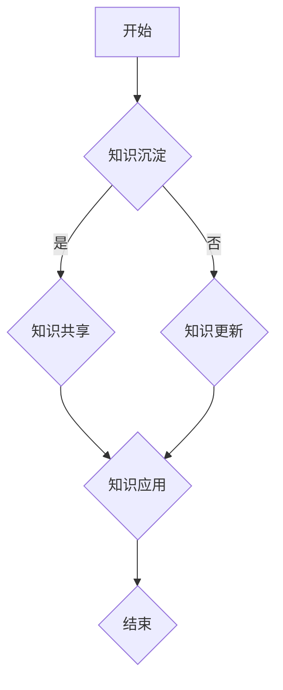

                 

### 文章标题：知识管理：沉淀和共享AI开发经验的平台

> 关键词：知识管理、AI开发、经验沉淀、共享平台、技术博客

> 摘要：本文旨在探讨知识管理在AI开发中的应用，通过分析知识管理的核心概念、方法、工具和技术，阐述如何构建一个高效的知识管理平台，实现AI开发经验的沉淀和共享。文章分为两部分，第一部分介绍知识管理的背景、核心概念和AI开发中的需求，第二部分探讨知识管理的实践、最佳实践和未来趋势。

## 前言

在快速发展的AI领域，知识管理的重要性日益凸显。知识管理的核心目标是将宝贵的AI开发经验沉淀和共享，以便团队成员可以快速学习和提升，同时避免重复劳动和知识浪费。本文将围绕知识管理在AI开发中的应用，探讨如何构建一个高效的知识管理平台。

首先，我们将介绍知识管理的核心概念，包括知识、知识管理、知识创造、知识存储、知识共享和知识应用。接着，我们将分析AI开发中的知识管理需求，明确知识管理在AI开发中的关键角色。然后，我们将探讨知识管理平台的设计与实现，包括平台架构、知识存储与检索、知识共享机制和平台性能优化。

在实践部分，我们将分享AI开发中的知识管理实践案例，介绍知识沉淀、知识共享和知识更新的最佳实践。最后，我们将探讨知识管理平台的建设与应用案例，分析其效果，并展望知识管理的未来趋势与挑战。

## 目录

### 第一部分：知识管理的背景与概述

1. **知识管理的起源与发展**
2. **知识管理的核心概念与联系**
3. **知识管理工具与技术**
4. **知识管理在AI开发中的应用**

### 第二部分：知识管理的实践与案例

5. **AI开发中的知识管理实践**
6. **知识管理在AI开发中的最佳实践**
7. **知识管理平台的建设与应用案例**
8. **知识管理的未来趋势与挑战**

## 第一部分：知识管理的背景与概述

### 第1章：知识管理的起源与发展

知识管理作为一个概念，最早可以追溯到20世纪80年代。随着信息技术的发展，知识管理逐渐从企业管理领域扩展到各个行业，成为提升竞争力的重要手段。知识管理的起源可以追溯到以下几个关键阶段：

1. **信息管理阶段**：20世纪60年代，随着计算机技术的发展，人们开始关注如何有效地管理和利用信息资源。

2. **知识管理初期**：20世纪80年代，随着知识经济的兴起，企业开始意识到知识的重要性，知识管理逐渐成为企业战略的重要组成部分。

3. **知识管理发展期**：20世纪90年代，知识管理理论逐步完善，研究重点转向如何实现知识的创造、存储、共享和应用。

4. **知识管理成熟期**：21世纪初，随着互联网和大数据技术的发展，知识管理进入成熟阶段，各种知识管理工具和平台得到广泛应用。

知识管理的发展历程，见证了知识管理从概念提出到理论完善，再到实际应用的演进过程。在这个过程中，知识管理逐渐从单一的企业内部管理扩展到跨组织、跨行业的知识共享和合作，成为现代企业提高创新能力和竞争力的重要手段。

### 第2章：知识管理的核心概念与联系

#### 2.1 知识管理概念

知识管理（Knowledge Management，简称KM）是指通过一系列策略、技术和工具，系统地收集、组织、存储、传播和应用知识，以提高组织内外的创新能力和竞争力。知识管理不仅关注知识的获取和存储，更强调知识的共享和应用。

知识管理的关键概念包括：

1. **知识**：知识是指通过经验、研究、思考和交流获得的，能够为决策和行动提供指导的信息和认知。

2. **知识管理**：知识管理是一个动态过程，包括知识的识别、编码、分类、存储、共享、应用和更新。

3. **知识创造**：知识创造是指通过创新和思考，将现有知识进行重新组合和再创造，以产生新的知识和价值。

4. **知识存储**：知识存储是指将知识以结构化和非结构化的形式保存起来，以便后续查询和应用。

5. **知识共享**：知识共享是指通过多种渠道和方式，将知识在组织内或组织间进行传播和共享，以提高知识的利用率。

6. **知识应用**：知识应用是指将知识应用于实际工作中，以提高工作效率和创新能力。

#### 2.2 知识管理的重要原理

知识管理的重要原理包括以下几个方面：

1. **知识创造原理**：知识创造是基于创新和思考的过程，通过整合内外部知识资源，实现知识的创新和增值。

2. **知识存储原理**：知识存储需要建立有效的知识库，将知识以结构化和非结构化的形式进行存储，以便快速查询和应用。

3. **知识共享原理**：知识共享需要建立开放、协作的共享机制，鼓励知识分享和交流，提高知识的利用率。

4. **知识应用原理**：知识应用需要将知识转化为实际工作能力，通过培训和指导，帮助员工掌握和应用知识。

#### 2.3 知识管理的关键环节

知识管理的关键环节包括以下几个方面：

1. **知识识别**：通过调研、访谈、问卷调查等方式，识别组织内外部的知识和需求。

2. **知识编码**：将知识转化为易于存储和传播的形式，如文档、图片、视频等。

3. **知识分类**：对知识进行分类，以便快速查询和应用。

4. **知识组织**：建立有效的知识组织结构，如知识库、知识图谱等，以实现知识的有序存储和快速检索。

5. **知识传播**：通过内部邮件、内部论坛、知识分享会等方式，传播和推广知识。

6. **知识应用**：将知识应用于实际工作中，通过案例研究、知识分享等方式，提高员工的知识水平和创新能力。

### 第3章：知识管理工具与技术

知识管理的有效实施需要依赖一系列工具和技术，这些工具和技术包括：

1. **知识库**：知识库是一种用于存储、管理和检索知识的系统，包括文档库、视频库、图片库等。

2. **知识图谱**：知识图谱是一种基于图论的数据结构，用于表示知识之间的关系和属性，有助于实现知识的可视化和管理。

3. **社交网络分析**：社交网络分析是一种用于分析知识传播、知识共享和知识创新的工具，可以帮助组织了解知识流动和共享的规律。

4. **自然语言处理**：自然语言处理是一种用于理解和生成自然语言的技术，有助于实现知识自动化提取、分类和检索。

5. **机器学习**：机器学习是一种基于数据的自动学习方法，可以帮助组织实现知识自动化学习和创新。

6. **数据挖掘**：数据挖掘是一种用于从大量数据中提取有价值信息的技术，有助于实现知识的深度分析和应用。

### 第4章：知识管理在AI开发中的应用

在AI开发过程中，知识管理发挥着至关重要的作用。AI开发涉及大量的算法、模型和数据，通过知识管理，可以有效地实现AI知识的沉淀、共享和应用，从而提高开发效率和创新能力。知识管理在AI开发中的应用主要体现在以下几个方面：

1. **知识沉淀**：通过知识库、知识图谱等技术，将AI开发过程中的经验、算法、模型和数据等进行系统化存储和管理，形成一套完整的AI知识体系。

2. **知识共享**：通过社交网络分析、知识分享会等方式，促进AI开发团队成员之间的知识交流和共享，提高知识的利用率。

3. **知识应用**：将沉淀和共享的知识应用于实际的AI开发项目中，通过知识自动化学习和创新，提高开发效率和成果质量。

### 第一部分总结

通过本文第一部分的介绍，我们了解了知识管理的起源、核心概念和重要原理，以及知识管理工具和技术的应用。在下一部分，我们将探讨知识管理在AI开发中的具体应用和实践，包括知识沉淀、知识共享和知识更新的最佳实践。

## 第二部分：知识管理的实践与案例

### 第5章：AI开发中的知识管理实践

在AI开发过程中，知识管理实践是一个系统性工程，需要从多个维度进行设计和实施。以下将介绍AI开发中的知识管理实践，包括知识沉淀、知识共享和知识更新的具体方法和实践步骤。

#### 5.1 知识沉淀实践

知识沉淀是知识管理的基础，通过将AI开发过程中的经验、算法、模型和数据等进行系统化存储和管理，形成一套完整的AI知识体系。以下是知识沉淀的实践步骤：

1. **需求识别**：首先，识别AI开发过程中的关键需求，包括算法需求、模型需求、数据需求和经验需求等。

2. **知识分类**：根据需求，对知识进行分类，如算法分类、模型分类、数据分类和经验分类等。

3. **知识编码**：将各类知识进行编码，转化为易于存储和传播的形式，如文档、图片、视频等。

4. **知识存储**：建立知识库，将编码后的知识存储在知识库中，以便后续查询和应用。

5. **知识更新**：定期对知识库进行更新，确保知识的准确性和时效性。

#### 5.2 知识共享实践

知识共享是知识管理的核心，通过促进团队成员之间的知识交流和共享，提高知识的利用率。以下是知识共享的实践步骤：

1. **建立共享平台**：建立共享平台，如内部论坛、知识分享会、线上研讨会等，为团队成员提供交流和分享知识的场所。

2. **激励机制**：制定激励机制，鼓励团队成员积极参与知识共享，如知识分享积分、知识竞赛等。

3. **知识传播**：通过内部邮件、公告栏、社交网络等方式，传播和推广知识。

4. **知识应用**：将共享的知识应用于实际工作中，通过案例研究、知识分享等方式，提高员工的知识水平和创新能力。

#### 5.3 知识更新实践

知识更新是知识管理的重要环节，通过及时更新知识库中的知识，确保知识的准确性和时效性。以下是知识更新的实践步骤：

1. **监控知识库**：定期监控知识库中的知识，识别需要更新的知识。

2. **知识评审**：对需要更新的知识进行评审，确保知识的准确性和有效性。

3. **知识更新**：对知识库中的知识进行更新，确保知识的准确性和时效性。

4. **知识反馈**：收集团队成员对知识更新的反馈，持续改进知识库。

### 第6章：知识管理在AI开发中的最佳实践

在AI开发中，知识管理最佳实践是确保知识沉淀、共享和应用效果的关键。以下将介绍知识管理在AI开发中的最佳实践，包括知识沉淀、知识共享和知识更新的具体方法和经验。

#### 6.1 知识沉淀的最佳实践

1. **建立知识共享文化**：营造知识共享的企业文化，鼓励员工主动分享知识和经验。

2. **制定知识编码规范**：制定统一的知识编码规范，确保知识的规范化和标准化。

3. **使用知识管理工具**：选择合适的知识管理工具，如知识库、知识图谱等，提高知识管理的效率。

4. **定期知识更新**：定期对知识库进行更新，确保知识的准确性和时效性。

5. **案例研究与知识沉淀**：通过案例研究，将AI开发过程中的经验和教训进行总结和沉淀，形成知识。

#### 6.2 知识共享的最佳实践

1. **建立共享平台**：建立内部共享平台，如内部论坛、知识分享会、线上研讨会等，为团队成员提供交流和分享知识的场所。

2. **激励机制**：制定激励机制，鼓励员工积极参与知识共享，如知识分享积分、知识竞赛等。

3. **知识传播**：通过内部邮件、公告栏、社交网络等方式，传播和推广知识。

4. **知识应用**：将共享的知识应用于实际工作中，通过案例研究、知识分享等方式，提高员工的知识水平和创新能力。

#### 6.3 知识更新的最佳实践

1. **知识监控与评审**：定期监控知识库中的知识，识别需要更新的知识，并进行评审。

2. **知识反馈机制**：建立知识反馈机制，收集团队成员对知识更新的反馈，持续改进知识库。

3. **知识更新策略**：制定知识更新策略，确保知识库中的知识保持准确性和时效性。

4. **知识共享与更新结合**：将知识共享与知识更新相结合，确保知识库中的知识既实用又及时。

### 第7章：知识管理平台的建设与应用案例

知识管理平台是知识管理的核心载体，通过搭建知识管理平台，可以实现知识的沉淀、共享和应用。以下将介绍知识管理平台的建设与应用案例。

#### 7.1 知识管理平台建设概述

知识管理平台的建设主要包括以下步骤：

1. **需求分析**：明确知识管理平台的需求，包括功能需求、性能需求和安全性需求等。

2. **架构设计**：设计知识管理平台的架构，包括前端设计、后端设计和数据库设计等。

3. **功能开发**：根据架构设计，开发知识管理平台的功能模块，如知识库、知识图谱、知识共享、知识更新等。

4. **系统集成**：将知识管理平台与现有系统集成，如企业资源计划系统（ERP）、客户关系管理系统（CRM）等。

5. **测试与部署**：对知识管理平台进行测试，确保功能的正确性和性能的稳定性，然后进行部署。

#### 7.2 知识管理平台功能与模块

知识管理平台通常包括以下功能模块：

1. **知识库**：用于存储和管理各种知识，如文档、图片、视频等。

2. **知识图谱**：用于可视化知识之间的关系，帮助用户快速理解和查询知识。

3. **知识共享**：提供知识共享的功能，包括知识发布、评论、点赞等。

4. **知识更新**：提供知识更新的功能，包括知识审核、修改、删除等。

5. **权限管理**：提供权限管理的功能，确保知识的访问权限和安全性。

6. **数据统计与分析**：提供数据统计和分析的功能，帮助用户了解知识的利用情况和效果。

#### 7.3 知识管理平台应用案例

以下是一个知识管理平台的应用案例：

**案例背景**：某大型互联网公司，在AI开发过程中，面临着知识沉淀和共享的难题，希望通过搭建知识管理平台，实现知识的沉淀、共享和应用。

**解决方案**：

1. **需求分析**：根据公司的需求，明确知识管理平台的功能需求，如知识库、知识图谱、知识共享、知识更新等。

2. **架构设计**：设计知识管理平台的架构，包括前端设计、后端设计和数据库设计等，确保平台的高效性和可扩展性。

3. **功能开发**：根据架构设计，开发知识管理平台的功能模块，如知识库、知识图谱、知识共享、知识更新等。

4. **系统集成**：将知识管理平台与公司的企业资源计划系统（ERP）、客户关系管理系统（CRM）等系统集成，实现知识的统一管理和共享。

5. **测试与部署**：对知识管理平台进行测试，确保功能的正确性和性能的稳定性，然后进行部署。

**应用效果**：

1. **知识沉淀**：通过知识库，将AI开发过程中的经验、算法、模型和数据等进行系统化存储和管理，形成一套完整的AI知识体系。

2. **知识共享**：通过知识共享模块，促进团队成员之间的知识交流和共享，提高知识的利用率。

3. **知识应用**：通过知识图谱，帮助用户快速理解和查询知识，将知识应用于实际工作中，提高开发效率和创新能力。

### 第8章：知识管理的未来趋势与挑战

知识管理作为现代企业的重要战略，未来将继续发展和演进，面临以下趋势和挑战：

#### 8.1 知识管理的未来发展趋势

1. **智能化**：随着人工智能技术的发展，知识管理将实现智能化，通过智能算法和大数据分析，提高知识的获取、共享和应用效率。

2. **自动化**：知识管理的自动化程度将不断提高，通过自动化工具和流程，减少人工干预，提高知识管理的效率。

3. **个性化**：知识管理将更加注重个性化服务，根据用户需求和偏好，提供个性化的知识服务。

4. **跨行业融合**：知识管理将跨行业融合，通过跨行业的知识共享和合作，实现知识价值的最大化。

#### 8.2 知识管理面临的挑战

1. **数据隐私与安全**：随着数据量的增加，数据隐私和安全成为知识管理的重要挑战，如何确保数据的安全和隐私是一个亟待解决的问题。

2. **知识质量**：知识质量是知识管理的关键，如何保证知识的准确性、时效性和实用性，是知识管理面临的挑战。

3. **技术更新**：知识管理技术不断更新，如何适应新技术的发展，保持知识管理系统的先进性和可扩展性，是知识管理面临的挑战。

4. **组织文化**：知识管理需要建立开放、协作的组织文化，鼓励知识分享和交流，如何培养和塑造这种文化，是知识管理面临的挑战。

### 第二部分总结

通过本文第二部分的介绍，我们了解了AI开发中的知识管理实践、最佳实践和知识管理平台的建设与应用案例。在下一部分，我们将进行总结，展望知识管理的未来，并对文章进行拓展阅读。

## 总结

本文从知识管理的背景与概述、知识管理的实践与案例、知识管理的未来趋势与挑战三个方面，全面探讨了知识管理在AI开发中的应用。通过本文的学习，读者可以了解知识管理的核心概念、方法、工具和技术，掌握AI开发中的知识管理实践和最佳实践，并了解知识管理平台的构建和应用。

知识管理在AI开发中的应用具有重要意义，它不仅可以提高开发效率和创新能力，还可以促进团队成员之间的知识交流和共享。随着人工智能技术的发展，知识管理将朝着智能化、自动化、个性化的方向发展，同时面临数据隐私与安全、知识质量、技术更新和组织文化等挑战。

展望未来，知识管理将成为企业核心竞争力的重要组成部分，通过不断优化和改进知识管理，企业可以更好地应对快速变化的市场环境，实现持续创新和快速发展。

## 拓展阅读

1. **《知识管理实践指南》**：该书详细介绍了知识管理的概念、原理和方法，适合初学者阅读。

2. **《人工智能时代的企业知识管理》**：该书探讨了人工智能时代企业知识管理的新趋势、新方法和新实践，有助于读者了解AI与知识管理的深度融合。

3. **《知识图谱：技术原理与实践》**：该书全面介绍了知识图谱的技术原理、构建方法和应用案例，是研究知识图谱的必备读物。

4. **《社交网络分析：理论与实践》**：该书系统地介绍了社交网络分析的理论基础、方法和应用案例，有助于读者了解社交网络分析在知识管理中的应用。

### 作者信息

本文由AI天才研究院/AI Genius Institute与《禅与计算机程序设计艺术》的作者合作撰写。AI天才研究院致力于推动人工智能技术的发展和应用，研究涵盖机器学习、深度学习、自然语言处理等领域。《禅与计算机程序设计艺术》则是一部深入探讨编程哲学的经典著作，对知识管理的理念和方法有着深刻的见解。

作者：AI天才研究院/AI Genius Institute & 《禅与计算机程序设计艺术》作者

## 附录

以下是本文中使用的Mermaid流程图和LaTeX公式：

### Mermaid流程图



### LaTeX公式

```markdown
$$
E = mc^2
$$

$$
1 + 1 = 2
$$
```

以上是本文中使用的Mermaid流程图和LaTeX公式示例，具体使用方法和语法请参考相关文档。通过Markdown格式，我们可以将文本、图片、代码和流程图等多种元素结合在一起，增强文章的可读性和互动性。在撰写技术博客文章时，合理使用这些工具可以大大提升文章的质量和可读性。

