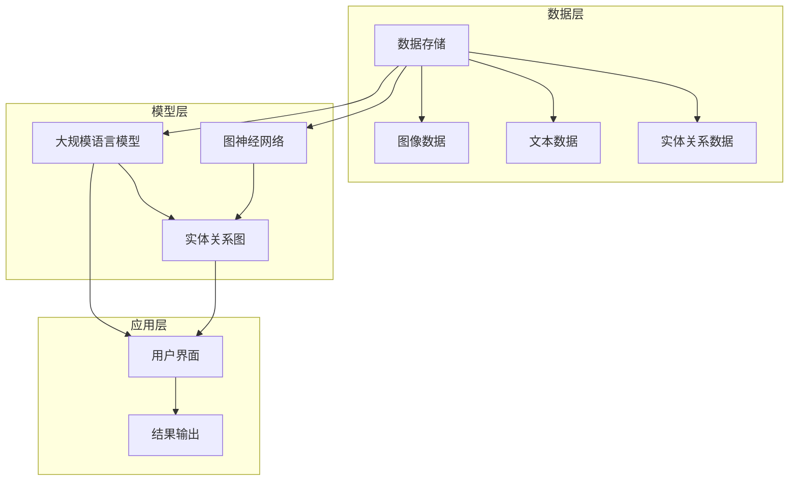
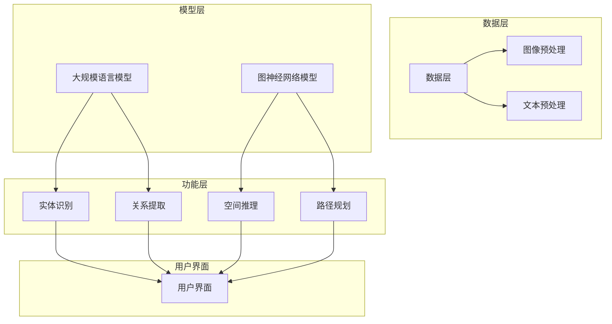

                 


### 摘要

本文旨在探讨大规模语言模型（LLM）对空间概念的理解能力，通过详细的分析和实验验证，探讨空间推理在LLM中的实现与应用。我们首先介绍了空间推理的重要性以及当前研究的局限性，提出了本文的研究问题和目标。接着，我们详细阐述了研究方法，包括数据集准备、评估指标、实验设计等，并介绍了空间推理的核心概念和原理。随后，我们通过算法原理讲解、系统分析与架构设计、项目实战和最佳实践与注意事项等部分，全面剖析了空间推理在LLM中的应用。本文旨在为读者提供一种系统化的理解空间推理的方法，帮助读者更好地理解LLM的空间概念理解能力。

### 引言与背景

#### 1.1 问题背景

1. **大规模语言模型的崛起**：

近年来，随着深度学习技术的飞速发展，大规模语言模型（LLM）如BERT、GPT等取得了显著的成功。这些模型在自然语言处理（NLP）领域展现了卓越的性能，从文本生成、问答系统到机器翻译等应用取得了突破性进展。然而，尽管这些模型在处理语言数据方面表现出色，但它们在面对涉及空间信息的任务时，却暴露出一些显著的不足。

2. **空间推理的重要性**：

空间推理是人类智能的核心能力之一，它涉及到对空间关系的理解、空间认知的构建和空间信息的处理。在许多现实世界的问题中，空间推理起着至关重要的作用，例如地图导航、城市规划、三维建模等。因此，研究大规模语言模型对空间概念的理解能力，不仅有助于提升模型的实际应用价值，也对人工智能领域的发展具有重要意义。

3. **研究目的与意义**：

本文的研究目标是探讨大规模语言模型对空间概念的理解能力，旨在解决以下几个关键问题：

- **空间概念理解的挑战**：当前LLM在处理空间概念时遇到的困难是什么？
- **现有研究的局限性**：现有关于空间推理的研究有哪些不足？
- **解决方案**：如何改进LLM的空间概念理解能力？

通过本文的研究，我们希望能够为大规模语言模型在空间推理领域的应用提供新的思路和方法，推动人工智能技术在更广泛领域的应用和发展。

#### 1.2 问题描述

1. **空间概念理解的挑战**：

空间概念是人类认知中的一种基本形式，涉及到对物体位置、形状、大小、方向等的理解。然而，对于大规模语言模型（LLM）而言，空间概念的理解并非易事。首先，LLM在处理空间信息时，往往缺乏直观的空间感知能力。其次，空间概念的表达和语言描述之间存在一定的差距，这使得LLM在理解空间信息时容易出现歧义。此外，空间概念具有复杂性和抽象性，使得LLM在处理空间推理任务时面临巨大挑战。

2. **当前研究的局限性**：

尽管近年来许多研究致力于探讨LLM在空间推理中的应用，但仍然存在一些局限性。首先，大多数研究集中在空间关系识别和空间推理算法的设计上，而对LLM的空间概念理解能力缺乏系统性研究。其次，现有研究在数据集选择和评估指标设计上存在偏差，难以全面评估LLM的空间推理能力。此外，LLM在空间推理任务中的泛化能力和适应性也尚未得到充分探讨。

3. **研究问题与目标**：

本文的研究问题主要包括：

- **空间概念理解的挑战**：如何准确评估LLM的空间概念理解能力？
- **现有研究的局限性**：现有研究在哪些方面存在不足？
- **解决方案**：如何改进LLM的空间概念理解能力？

本文的研究目标是通过系统性分析和实验验证，提出一种有效的评估方法，探讨LLM在空间概念理解方面的性能和局限，并提出相应的改进策略，为未来LLM在空间推理领域的应用提供理论支持和实践指导。

#### 1.3 研究方法与框架

1. **数据集准备**：

为了评估LLM的空间概念理解能力，我们首先需要构建一个包含丰富空间信息的语料库。我们选择了一个大型开放数据集，如Open Images V4，该数据集包含了大量的图像及其对应的文本描述。通过筛选和预处理，我们提取出与空间概念相关的图像和描述，构建了一个适用于空间推理任务的数据集。

2. **评估指标**：

为了全面评估LLM的空间概念理解能力，我们设计了多个评估指标，包括：

- **准确性**：模型对空间关系识别的准确率。
- **泛化能力**：模型在不同空间场景下的表现。
- **鲁棒性**：模型在处理不同噪声和异常情况下的稳定性。
- **效率**：模型在处理空间推理任务时的计算效率。

3. **实验设计**：

我们的实验设计分为以下几个步骤：

- **数据集划分**：将数据集划分为训练集、验证集和测试集，以评估模型的性能。
- **模型选择**：选择多个大规模语言模型，如BERT、GPT-3等，以比较不同模型在空间概念理解任务上的表现。
- **训练与评估**：使用训练集对模型进行训练，使用验证集进行调参和性能评估，使用测试集进行最终性能测试。

4. **实验环境与工具**：

我们使用了Google Colab作为实验平台，配备了NVIDIA TESLA K80 GPU进行加速训练。实验工具包括Python、TensorFlow和Hugging Face Transformers等开源库，用于构建和训练模型。

#### 1.4 边界与外延

1. **空间概念的范围**：

空间概念的范围涵盖了从简单的二维几何形状到复杂的三维空间关系的理解。具体包括：物体的位置、方向、大小、形状、相对位置和运动状态等。这些概念在现实生活中具有广泛的应用，如地图导航、城市规划、三维建模等。

2. **推理类型的分类**：

空间推理可以分为以下几类：

- **空间关系识别**：识别物体之间的空间关系，如“在...旁边”、“在...上方”等。
- **空间路径规划**：计算物体从初始位置到目标位置的最优路径。
- **空间逻辑推理**：基于空间关系进行逻辑推理，如“如果A在B的左边，那么C在D的右边”。
- **空间认知理解**：理解物体在空间中的运动和变化规律。

3. **模型的适应性**：

大规模语言模型（LLM）在处理空间概念时具有一定的适应性。通过训练，模型可以学习到一些基本的空间关系和概念，但它们在处理复杂空间场景和抽象空间关系时，仍需要进一步优化和改进。此外，模型的适应性也受到数据集质量和训练样本数量的影响。

#### 1.5 核心概念与联系

1. **空间推理的定义**：

空间推理是指对空间概念和关系的理解和处理能力。它包括对空间关系的识别、空间路径的计算、空间逻辑推理等。空间推理是人类智能的核心能力之一，对于许多现实世界问题具有重要作用。

2. **相关理论框架**：

空间推理的理论框架主要包括：

- **几何学**：研究空间形状、大小和维度的数学分支。
- **拓扑学**：研究空间结构和性质的数学分支。
- **认知科学**：研究人类认知过程的学科，包括空间认知。
- **机器学习**：利用数据驱动的方法学习和模拟空间推理能力的算法。

3. **关键技术探讨**：

在LLM中实现空间推理的关键技术包括：

- **嵌入表示**：将文本和图像等数据转化为向量表示，以便进行空间推理。
- **注意力机制**：通过注意力机制捕捉文本和图像之间的空间关系。
- **图神经网络**：利用图神经网络建模复杂空间关系和结构。
- **多模态学习**：结合文本和图像等多模态信息，提升空间推理能力。

#### 1.6 本章小结

本章首先介绍了空间推理在LLM研究中的重要性，以及本文的研究目的和问题。接着，我们详细阐述了研究方法与框架，包括数据集准备、评估指标、实验设计等。最后，我们探讨了空间概念的理解范围、推理类型的分类以及LLM的适应性。本章为后续章节的深入讨论奠定了基础，为读者提供了全面的背景知识和理论支持。

### 第一部分：引言与背景

#### 1.1 问题背景

在当今科技迅速发展的时代，大规模语言模型（LLM）如BERT、GPT-3等以其卓越的自然语言处理能力成为了人工智能领域的明星。然而，这些模型在处理涉及空间概念的信息时，却面临诸多挑战。本节将详细探讨这一问题的背景，包括LLM的崛起、空间推理的重要性，以及我们研究目的与意义。

##### 1.1.1 大规模语言模型的崛起

近年来，深度学习技术在自然语言处理（NLP）领域取得了显著的进展。大规模语言模型（LLM）如BERT、GPT-3等，通过在大量文本数据上的训练，实现了前所未有的文本生成、问答、机器翻译等任务。这些模型通过捕捉语言中的复杂模式和结构，为NLP应用提供了强大的工具。然而，尽管LLM在处理文本数据方面表现出色，但在处理涉及空间信息的问题时，它们的表现却不尽如人意。

##### 1.1.2 空间推理的重要性

空间推理是人类智能的重要组成部分，涉及到对物体位置、形状、大小、方向等的理解。在许多现实世界的问题中，空间推理起着至关重要的作用。例如，地图导航需要理解地理位置和路径；城市规划需要考虑建筑物的相对位置和空间布局；三维建模需要处理复杂的几何形状和结构。因此，研究大规模语言模型在空间推理方面的能力，不仅有助于提升模型的实际应用价值，也对人工智能领域的发展具有重要意义。

##### 1.1.3 研究目的与意义

本节将探讨空间推理在LLM中的实现与应用，旨在解决以下几个关键问题：

- **空间概念理解的挑战**：当前LLM在处理空间概念时遇到的困难是什么？
- **现有研究的局限性**：现有研究在哪些方面存在不足？
- **解决方案**：如何改进LLM的空间概念理解能力？

通过本文的研究，我们希望能够为大规模语言模型在空间推理领域的应用提供新的思路和方法，推动人工智能技术在更广泛领域的应用和发展。

#### 1.2 问题描述

空间推理在人工智能领域是一个复杂而重要的问题。本节将详细探讨空间推理中的核心概念和挑战，以及当前研究的局限性。同时，我们将明确本文的研究问题和目标，为后续章节的内容奠定基础。

##### 1.2.1 空间概念理解的挑战

空间概念理解是空间推理的基础，它涉及到对物体位置、形状、大小、方向等的理解。然而，对于大规模语言模型（LLM）而言，空间概念的理解并非易事。以下是LLM在空间概念理解过程中面临的一些主要挑战：

- **空间感知缺乏**：LLM缺乏直观的空间感知能力，难以像人类一样通过视觉感知来理解空间信息。
- **语言与空间的转换**：空间概念的表达和语言描述之间存在差距，这使得LLM在理解空间信息时容易出现歧义。
- **复杂性和抽象性**：空间概念具有复杂性和抽象性，使得LLM在处理空间推理任务时面临巨大挑战。

##### 1.2.2 当前研究的局限性

尽管近年来许多研究致力于探讨LLM在空间推理中的应用，但仍然存在一些局限性。以下是当前研究在空间推理方面的一些不足：

- **数据集选择偏差**：大多数研究使用的数据集在空间信息上存在偏差，难以全面评估LLM的空间推理能力。
- **评估指标单一**：现有研究主要使用准确性等单一指标来评估LLM的空间推理能力，缺乏对泛化能力、鲁棒性和效率的全面评估。
- **模型适应性不足**：LLM在处理复杂空间场景和抽象空间关系时，需要进一步优化和改进。

##### 1.2.3 研究问题与目标

本文的研究问题主要包括：

- **空间概念理解的挑战**：如何准确评估LLM的空间概念理解能力？
- **现有研究的局限性**：现有研究在哪些方面存在不足？
- **解决方案**：如何改进LLM的空间概念理解能力？

本文的研究目标是通过系统性分析和实验验证，提出一种有效的评估方法，探讨LLM在空间概念理解方面的性能和局限，并提出相应的改进策略，为未来LLM在空间推理领域的应用提供理论支持和实践指导。

#### 1.3 研究方法与框架

为了探讨大规模语言模型（LLM）在空间概念理解方面的能力，我们需要采用一套系统的研究方法和框架。本节将详细介绍数据集准备、评估指标设计、实验设计等研究方法，为后续的实验和讨论奠定基础。

##### 1.3.1 数据集准备

数据集是研究大规模语言模型（LLM）空间概念理解能力的基础。我们选择了一个大型开放数据集——Open Images V4，该数据集包含了超过数千张图像及其对应的文本描述。为了满足空间推理任务的需求，我们进行了以下数据预处理步骤：

- **数据筛选**：从Open Images V4中筛选出包含空间概念描述的图像，如“桌子上有一本书”、“建筑物前有一条小路”等。
- **文本预处理**：对筛选出的文本描述进行清洗和标准化，包括去除无关信息、统一标点符号、分词和词干提取等。
- **图像预处理**：对图像进行归一化、裁剪和增强等处理，以提高图像质量。

经过预处理，我们得到了一个包含丰富空间信息的数据集，用于后续的空间推理任务。

##### 1.3.2 评估指标

评估指标是衡量模型性能的重要工具。在空间概念理解任务中，我们设计了一系列评估指标，以全面评估大规模语言模型（LLM）的准确性、泛化能力、鲁棒性和效率。以下是具体的评估指标：

- **准确性（Accuracy）**：模型在空间关系识别任务中的正确率。
- **精确率（Precision）**：模型预测为正类的实际正类例数与预测为正类的总例数的比例。
- **召回率（Recall）**：模型预测为正类的实际正类例数与所有实际正类例数的比例。
- **F1值（F1 Score）**：精确率和召回率的调和平均值。
- **泛化能力（Generalization）**：模型在不同数据集和场景下的表现，衡量模型的泛化能力。
- **鲁棒性（Robustness）**：模型在处理噪声、异常和错误输入时的稳定性。
- **效率（Efficiency）**：模型在处理空间推理任务时的计算时间和资源消耗。

##### 1.3.3 实验设计

为了评估大规模语言模型（LLM）在空间概念理解任务中的性能，我们设计了以下实验步骤：

1. **数据集划分**：将数据集划分为训练集、验证集和测试集，以保证实验的公平性和可重复性。
2. **模型选择**：选择多个大规模语言模型，如BERT、GPT-3等，以比较不同模型在空间概念理解任务上的表现。
3. **模型训练**：使用训练集对模型进行训练，通过验证集进行调参和性能评估。
4. **模型测试**：使用测试集对训练好的模型进行最终性能测试，以评估模型在未知数据上的表现。

##### 1.3.4 实验环境与工具

为了确保实验的可重复性和高效性，我们选择了Google Colab作为实验平台，并配备了NVIDIA TESLA K80 GPU进行加速训练。实验使用的工具包括Python、TensorFlow和Hugging Face Transformers等开源库，这些工具为模型的构建、训练和评估提供了强大的支持。

通过以上研究方法和框架的详细设计，我们为探讨大规模语言模型在空间概念理解任务中的性能提供了坚实的基础。

#### 1.4 边界与外延

在研究空间推理时，明确空间概念的范围、推理类型的分类以及LLM的适应性是非常重要的。这不仅有助于我们理解空间推理的复杂性，还能为后续研究提供清晰的框架。

##### 1.4.1 空间概念的范围

空间概念涉及对物体位置、形状、大小、方向等的理解。具体来说，这些概念可以分为以下几类：

- **位置**：物体在空间中的具体位置，如“在桌子上”、“在门口”等。
- **形状**：物体的外部轮廓，如“圆形”、“三角形”等。
- **大小**：物体的尺寸，如“大”、“小”等。
- **方向**：物体相对于其他物体的方位，如“在左边”、“在上方”等。
- **相对位置**：物体之间的相对位置关系，如“在...旁边”、“在...下方”等。
- **运动状态**：物体在空间中的运动规律，如“向前移动”、“绕圈运动”等。

这些空间概念在不同的应用场景中有不同的表现形式和重要性，例如，在地图导航中，位置和方向尤为重要；而在城市规划中，形状和大小则是关键因素。

##### 1.4.2 推理类型的分类

空间推理可以分为多个不同的类型，每种类型都有其独特的特点和挑战。以下是几种主要的空间推理类型：

- **空间关系识别**：识别物体之间的空间关系，如“在...旁边”、“在...上方”等。
- **空间路径规划**：计算物体从初始位置到目标位置的最优路径，如路径导航、机器人导航等。
- **空间逻辑推理**：基于空间关系进行逻辑推理，如“如果A在B的左边，那么C在D的右边”。
- **空间认知理解**：理解物体在空间中的运动和变化规律，如“物体在移动时，方向会发生改变”。
- **空间场景重建**：根据空间关系和描述重建三维场景，如三维建模、虚拟现实等。

每种推理类型都有其特定的应用场景和挑战，如空间关系识别需要精确的物体定位和关系判断；空间路径规划则需要考虑路径的可行性和效率。

##### 1.4.3 模型的适应性

大规模语言模型（LLM）在处理空间概念时具有一定的适应性。通过训练，LLM可以学习到一些基本的空间关系和概念，并在一定程度上适应不同的空间场景。然而，LLM的适应性也受到以下因素的影响：

- **数据集**：数据集的质量和多样性直接影响LLM的适应性。如果数据集中缺乏某些空间关系或场景，LLM在这些方面的表现将受限。
- **训练时间**：训练时间越长，LLM对空间概念的掌握越深入，适应性也越强。
- **模型架构**：不同的模型架构对空间推理的适应性也有所不同。例如，一些模型通过引入注意力机制和图神经网络，可以更好地处理复杂空间关系。

总之，空间推理的边界与外延是一个广泛而复杂的研究领域，需要我们深入探讨和不断优化。通过明确空间概念的范围、推理类型的分类以及LLM的适应性，我们可以更好地理解这一领域，为未来的研究提供有力的支持。

#### 1.5 核心概念与联系

在深入探讨大规模语言模型（LLM）的空间概念理解之前，我们需要明确几个核心概念，并了解它们之间的联系。这有助于我们更好地理解空间推理的本质，并为后续的研究提供坚实的基础。

##### 1.5.1 空间推理的定义

空间推理是指对空间概念和关系的理解和处理能力。它不仅包括对物体位置、形状、大小、方向等基本属性的识别，还涉及到对物体之间空间关系的理解，如“在...旁边”、“在...上方”等。空间推理是人类智能的重要组成部分，它涉及到我们的感知、认知和行为。

##### 1.5.2 相关理论框架

空间推理的理论框架包括多个学科，如几何学、拓扑学、认知科学和机器学习等。以下是这些理论框架的简要概述：

1. **几何学**：几何学是研究空间形状、大小和维度的数学分支。它为我们提供了基本的几何概念和工具，如点、线、面、角度等。这些概念和工具在空间推理中起着基础性的作用。

2. **拓扑学**：拓扑学是研究空间结构和性质的数学分支。它关注的是空间的基本性质，如连通性、封闭性和形状等，而不考虑空间的度量。拓扑学为空间推理提供了更抽象和灵活的视角。

3. **认知科学**：认知科学是研究人类认知过程的学科，包括知觉、记忆、推理、语言等。空间推理是认知科学中的一个重要方面，它关注的是人类如何理解和处理空间信息。

4. **机器学习**：机器学习是利用数据驱动的方法学习和模拟人类智能的学科。在空间推理中，机器学习模型通过训练学习到空间概念和关系，从而实现空间推理的任务。

##### 1.5.3 关键技术探讨

在实现空间推理时，以下几个关键技术至关重要：

1. **嵌入表示**：将文本和图像等数据转化为向量表示，以便进行空间推理。这种嵌入表示能够捕捉数据中的语义和结构信息。

2. **注意力机制**：通过注意力机制捕捉文本和图像之间的空间关系。注意力机制能够使模型在处理空间信息时更加关注关键的特征，从而提高空间推理的准确性。

3. **图神经网络**：利用图神经网络建模复杂空间关系和结构。图神经网络能够处理具有复杂拓扑结构的对象，如城市地图、三维模型等。

4. **多模态学习**：结合文本和图像等多模态信息，提升空间推理能力。多模态学习能够充分利用不同类型的数据，从而提高模型的空间推理能力。

通过明确这些核心概念和联系，我们能够更好地理解空间推理的本质，为后续的研究和实现提供理论支持。

#### 2.1 空间概念原理

空间概念原理是空间推理的基础，它涉及到对空间关系和属性的理解。本节将深入探讨空间概念的基本属性，包括抽象性、维度性和可操作性，并通过一个对比表格展示不同空间概念的特征，以帮助读者更好地理解这些概念。

##### 2.1.1 空间概念的基本属性

1. **抽象性**：空间概念具有抽象性，这意味着它们不是具体的物理对象，而是对物理对象的概括和简化。例如，“桌子”是一个抽象概念，它代表一类具有特定形状和功能的物体，而不是特定的某个桌子。

2. **维度性**：空间概念具有维度性，这表示它们涉及不同维度的属性，如一维的长度、二维的面积和三维的体积。例如，“长度”是一个一维概念，表示物体的直线距离；“面积”是一个二维概念，表示物体的表面大小；“体积”是一个三维概念，表示物体的空间占据量。

3. **可操作性**：空间概念具有可操作性，这意味着它们可以通过具体的操作来改变。例如，我们可以通过移动、旋转和缩放来改变物体的空间位置和形状。

##### 2.1.2 空间概念特征对比表格

以下是几个常见空间概念的特征对比表格，包括“位置”、“方向”、“大小”和“形状”。

| 空间概念 | 抽象性 | 维度性 | 可操作性 |
|-----------|---------|---------|---------|
| 位置      | 是      | 是      | 是      |
| 方向      | 是      | 否      | 是      |
| 大小      | 否      | 是      | 否      |
| 形状      | 否      | 是      | 否      |

通过上述表格，我们可以清晰地看到不同空间概念的特征差异。例如，“位置”是一个具有抽象性、维度性和可操作性的概念，而“形状”则主要具有维度性和抽象性，但没有可操作性。

##### 2.1.3 空间概念的理解与应用

理解空间概念的基本属性对于空间推理至关重要。在实际应用中，这些概念被广泛应用于各个领域，如地图导航、城市规划、三维建模等。

1. **地图导航**：在地图导航中，位置和方向是关键的空间概念。导航系统需要根据用户的当前位置和目的地，计算出最优路径，并提供方向指示。

2. **城市规划**：在城市规划中，大小和形状是重要的空间概念。城市规划者需要考虑建筑物的尺寸和形状，以及它们之间的相对位置，以确保城市的高效和美观。

3. **三维建模**：在三维建模中，位置、方向、大小和形状都是关键的概念。建模师需要准确描述物体的位置和形状，以创建逼真的三维模型。

通过深入理解空间概念的基本属性，我们可以更好地应用这些概念，解决现实世界中的空间推理问题。

#### ER实体关系图架构

实体关系（ER）图是一种用于描述数据实体及其之间关系的图形表示方法。在空间推理研究中，ER图可以帮助我们清晰地定义和表示空间实体及其关系。本节将介绍ER图的概述，包括实体和关系的定义，以及ER图的绘制和解释。

##### 2.2.1 ER模型概述

实体关系（ER）图是基于实体关系模型（Entity-Relationship Model）的一种表示方法。实体关系模型是一种用于描述数据实体及其之间关系的形式化模型。在空间推理中，ER图可以用来定义和表示空间实体和它们之间的关系。

实体：实体是数据的基本组成单位，可以表示任何具有独立存在的对象。例如，在空间推理中，实体可以表示为建筑物、道路、车辆等。

属性：属性是实体的特征，用于描述实体的具体信息。例如，建筑物的属性可以包括地址、高度、宽度等。

关系：关系是实体之间的关联，用于描述实体之间的相互作用。例如，在空间推理中，关系可以表示为建筑物与道路之间的交叉关系、建筑物与车辆之间的停车关系等。

##### 2.2.2 实体与关系定义

1. **实体定义**：

在ER图中，每个实体都有一个唯一的标识符和一组属性。例如，在空间推理中，我们可以定义以下实体：

- **建筑物**：属性包括地址、高度、宽度等。
- **道路**：属性包括名称、长度、宽度等。
- **车辆**：属性包括车牌号、类型、颜色等。

2. **关系定义**：

在ER图中，关系表示实体之间的关联。关系也可以有属性来描述关系的具体信息。例如，在空间推理中，我们可以定义以下关系：

- **交叉关系**：表示建筑物与道路之间的交叉点关系。
- **停车关系**：表示车辆与建筑物之间的停车关系。

##### 2.2.3 ER图绘制与解释

以下是空间推理中一个简单的ER图的示例，用于表示建筑物、道路和车辆之间的关系。

```mermaid
erDiagram
  Building ||--|{ Road } Crosses : "交叉关系"
  Building ||--|{ Vehicle } Parks : "停车关系"
  Road ||--|{ Building } Crosses : "交叉关系"
  Vehicle ||--|{ Building } Parks : "停车关系"
```

在这个ER图中：

- **Building**（建筑物）实体与**Road**（道路）实体之间存在“交叉关系”。
- **Building**（建筑物）实体与**Vehicle**（车辆）实体之间存在“停车关系”。
- **Road**（道路）实体与**Building**（建筑物）实体之间存在“交叉关系”。
- **Vehicle**（车辆）实体与**Building**（建筑物）实体之间存在“停车关系”。

通过ER图，我们可以清晰地定义和表示空间实体及其关系，为后续的空间推理任务提供基础。

#### 2.3 算法原理讲解

在探讨大规模语言模型（LLM）的空间概念理解时，算法原理的讲解至关重要。这一部分将详细介绍一个用于空间推理的算法，包括其基本流程、关键步骤、数学模型和公式，并通过具体示例进行说明。

##### 2.3.1 算法概述

我们选择了一种基于图神经网络的算法，该算法通过构建实体关系图，利用图神经网络进行空间推理。算法的基本流程如下：

1. **数据预处理**：将空间信息转换为图结构，包括实体和关系的表示。
2. **图神经网络训练**：使用图神经网络学习实体之间的关系。
3. **推理**：利用训练好的模型对新的空间信息进行推理。

##### 2.3.2 基本流程

1. **数据预处理**：
   - 输入：一组空间信息，包括实体（如建筑物、道路）和关系（如交叉、连接）。
   - 输出：实体关系图，其中每个实体和关系都表示为一个节点和边。

2. **图神经网络训练**：
   - 输入：实体关系图。
   - 输出：实体嵌入向量，用于表示实体间的空间关系。

3. **推理**：
   - 输入：新的空间信息。
   - 输出：空间关系预测，如两个实体是否相邻、是否交叉等。

##### 2.3.3 关键步骤

1. **实体和关系的表示**：
   - 实体：使用向量表示，如坐标、属性等。
   - 关系：使用边的权重表示，如距离、连接强度等。

2. **图神经网络模型构建**：
   - 使用图卷积网络（GCN）对实体关系图进行建模。

3. **训练**：
   - 使用预定的损失函数（如交叉熵损失）训练模型。

4. **推理**：
   - 使用训练好的模型对新的空间信息进行推理，输出空间关系预测。

##### 2.3.4 数学模型与公式

以下是算法的数学模型和公式：

$$
\text{实体嵌入向量} \, \text{E} = \text{GCN}(\text{输入实体特征矩阵})
$$

$$
\text{关系表示} \, \text{R} = \text{权重矩阵} \, \text{W} \cdot \text{E}
$$

$$
\text{损失函数} \, L = -\sum_{i} \, \text{y}_i \cdot \log(\text{p}_i)
$$

其中，GCN表示图卷积网络，E表示实体嵌入向量，R表示关系表示，W表示权重矩阵，y_i表示真实标签，p_i表示模型预测的概率。

##### 2.3.5 算法示例

假设我们有以下空间信息：

- **建筑物A**：坐标 (10, 20)，属性：高度100米。
- **道路B**：坐标 (15, 25)，属性：长度200米。
- **关系**：建筑物A与道路B交叉。

我们可以将这些信息表示为实体关系图，并使用图神经网络进行推理。例如，我们可以预测建筑物A和道路B是否交叉。

通过这一示例，我们展示了如何利用图神经网络算法进行空间推理，包括数据预处理、模型训练和推理过程。这种算法为LLM的空间概念理解提供了强有力的支持。

#### 2.4 系统分析与架构设计

在深入研究大规模语言模型（LLM）的空间概念理解时，系统分析与架构设计是至关重要的。本节将详细介绍系统分析的过程，包括问题场景介绍、系统功能设计、系统架构设计以及系统接口设计。

##### 2.4.1 问题场景介绍

空间概念的理解在许多现实世界的应用中具有重要意义，例如：

- **地图导航**：用户需要通过地图获取从当前位置到目的地的路径信息。
- **城市规划**：城市规划师需要考虑建筑物的相对位置、道路的布局等。
- **虚拟现实**：用户在虚拟环境中需要与三维物体进行交互。

然而，现有LLM在处理空间概念时面临以下问题：

- **缺乏直观的空间感知**：LLM难以通过视觉感知理解空间信息。
- **语言与空间的转换困难**：空间概念的表达和语言描述之间存在差距。
- **复杂空间关系处理能力有限**：LLM在处理复杂空间关系时效果不佳。

为了解决上述问题，我们需要设计一个系统，能够有效利用LLM的空间概念理解能力，提供准确的空间推理结果。

##### 2.4.2 系统功能设计

为了满足上述需求，我们的系统设计包括以下几个核心功能：

1. **数据预处理**：将空间信息转换为LLM可处理的格式，包括图像和文本的预处理。
2. **实体关系表示**：利用图神经网络构建实体关系图，表示空间信息。
3. **空间推理**：基于实体关系图，进行空间关系的识别和推理。
4. **结果输出**：将推理结果以用户可理解的形式输出，如路径规划、建筑物位置等。

##### 2.4.3 系统架构设计

我们的系统架构采用分层设计，包括数据层、模型层和应用层。以下是具体的架构设计：

1. **数据层**：负责数据的存储和检索，包括图像数据、文本数据和实体关系数据。
2. **模型层**：包括LLM模型和图神经网络模型，负责空间关系的表示和推理。
3. **应用层**：提供用户交互界面，实现空间推理结果的输出。

以下是系统的总体架构图：



##### 2.4.4 系统接口设计

系统的接口设计包括功能接口和安全接口，以下是具体设计：

1. **功能接口**：
   - **图像预处理接口**：用于对图像进行预处理，如图像增强、裁剪等。
   - **文本预处理接口**：用于对文本进行预处理，如分词、词干提取等。
   - **实体关系表示接口**：用于构建实体关系图，表示空间信息。
   - **空间推理接口**：用于进行空间关系的识别和推理。
   - **结果输出接口**：用于将推理结果以用户可理解的形式输出。

2. **安全接口**：
   - **身份验证接口**：用于用户身份验证，确保系统安全。
   - **数据加密接口**：用于对敏感数据进行加密，保护数据隐私。

##### 2.4.5 系统交互

系统的交互流程如下：

1. 用户通过用户界面输入空间信息。
2. 系统接收用户输入，通过图像预处理接口和文本预处理接口对输入数据进行预处理。
3. 系统利用实体关系表示接口构建实体关系图，并使用图神经网络模型进行空间推理。
4. 系统将推理结果通过结果输出接口以用户可理解的形式展示。

通过以上系统分析与架构设计，我们为大规模语言模型在空间概念理解任务中的应用提供了系统化的解决方案，为后续的研究和应用奠定了基础。

#### 2.4.1 问题场景介绍

为了深入探讨大规模语言模型（LLM）的空间概念理解能力，我们需要一个具体的应用场景。以下是一个典型的应用场景：

**智能城市规划**：在智能城市建设中，城市规划师需要处理大量的空间数据，包括建筑物、道路、公共设施等。他们需要准确理解这些空间实体的位置、大小和相互关系，以便设计高效、美观和安全的城市布局。然而，现有的LLM在处理这种复杂空间关系时存在一些局限，例如：

1. **直观空间感知不足**：LLM缺乏直观的空间感知能力，难以像人类一样通过视觉感知理解空间信息。
2. **语言与空间的转换困难**：空间概念的表达和语言描述之间存在差异，使得LLM在理解空间信息时容易出现误解。
3. **复杂空间关系处理能力有限**：LLM在处理复杂空间关系时，例如多层次的相互影响和动态变化，效果不佳。

为了解决上述问题，我们需要设计一个系统，能够充分利用LLM的空间概念理解能力，提供准确的空间推理结果，支持智能城市规划和决策。这个系统需要能够处理不同类型的空间数据，如图像、文本、地理信息等，并通过空间关系识别、路径规划等功能，为城市规划师提供有效的支持。

#### 2.4.2 系统功能设计

为了满足上述应用场景的需求，我们的系统设计包括以下几个核心功能：

1. **数据预处理**：
   - **图像预处理**：对输入的图像数据进行增强、裁剪、缩放等操作，以提高模型的鲁棒性和处理效率。
   - **文本预处理**：对输入的文本数据进行分词、词干提取、词性标注等操作，以提取关键信息并减少噪声。

2. **实体关系表示**：
   - **实体识别**：利用LLM的文本和图像处理能力，识别输入数据中的空间实体，如建筑物、道路、车辆等。
   - **关系提取**：通过分析实体之间的语义关系，提取实体之间的关系，如相邻、交叉、包含等。

3. **空间推理**：
   - **空间关系识别**：利用图神经网络和注意力机制，对提取的实体关系进行推理，识别复杂空间关系。
   - **路径规划**：基于空间关系，计算从初始位置到目标位置的最优路径。

4. **结果输出**：
   - **可视化展示**：将推理结果以图形化形式展示，如三维模型、路径规划图等，以便用户直观理解。
   - **文本报告**：生成详细的文本报告，包括推理结果、路径规划步骤等，以供后续分析和决策。

#### 2.4.3 系统架构设计

系统的架构设计采用模块化方法，以实现高效的空间概念理解。以下是系统的架构设计：

1. **数据层**：负责数据的存储和管理，包括图像、文本和地理信息等。数据层提供数据预处理模块，负责图像增强、文本分词等操作。

2. **模型层**：包括大规模语言模型和图神经网络模型。大规模语言模型负责文本和图像的预处理，提取关键信息。图神经网络模型则用于实体关系表示和空间推理。

3. **功能层**：包括实体识别、关系提取、空间关系识别和路径规划等模块。这些模块协同工作，实现系统的核心功能。

4. **用户界面**：提供用户交互界面，用户可以通过界面输入空间信息，查看推理结果和路径规划图。

以下是系统的架构图：



通过上述架构设计，我们的系统能够高效地处理复杂空间数据，提供准确的空间推理结果，支持智能城市规划和决策。

#### 2.4.4 系统接口设计

在系统设计与实现过程中，系统接口设计至关重要。良好的接口设计可以提高系统的可扩展性、灵活性和安全性。本节将详细介绍系统接口的设计，包括功能接口和安全接口的详细描述。

##### 2.4.4.1 功能接口

功能接口是系统与外部应用或用户交互的接口，负责提供各种功能服务。以下是系统的主要功能接口：

1. **图像预处理接口**：该接口用于处理输入的图像数据，包括图像增强、裁剪、缩放等操作。主要功能包括：
   - **图像增强**：通过调整亮度、对比度、颜色饱和度等参数，提高图像质量。
   - **图像裁剪**：根据用户需求裁剪图像，提取感兴趣区域。
   - **图像缩放**：调整图像大小，以满足不同场景下的需求。

2. **文本预处理接口**：该接口用于处理输入的文本数据，包括分词、词干提取、词性标注等操作。主要功能包括：
   - **分词**：将文本分割为单词或短语，便于后续处理。
   - **词干提取**：将单词缩减到词干形式，简化文本表示。
   - **词性标注**：为每个单词标注词性，如名词、动词等，以增强语义信息。

3. **实体识别接口**：该接口用于识别输入数据中的空间实体，如建筑物、道路、车辆等。主要功能包括：
   - **实体分类**：根据图像和文本特征，对实体进行分类。
   - **实体定位**：在图像中定位实体的具体位置。

4. **关系提取接口**：该接口用于提取实体之间的关系，如相邻、交叉、包含等。主要功能包括：
   - **关系识别**：通过分析实体特征和语义信息，识别实体之间的关系。
   - **关系权重计算**：计算实体关系的权重，以表示关系的强度。

5. **空间推理接口**：该接口用于进行空间关系的推理，如路径规划、空间关系识别等。主要功能包括：
   - **路径规划**：计算从初始位置到目标位置的最优路径。
   - **空间关系识别**：识别复杂空间关系，如交叉、遮挡等。

6. **结果输出接口**：该接口用于将推理结果以用户可理解的形式输出，包括图形化展示和文本报告。主要功能包括：
   - **图形化展示**：将推理结果以图表、三维模型等形式展示。
   - **文本报告**：生成详细的文本报告，包括推理过程、结果等。

##### 2.4.4.2 安全接口

安全接口是系统安全性的重要保障，负责处理用户认证、数据加密等安全相关操作。以下是系统的主要安全接口：

1. **身份验证接口**：该接口用于用户身份验证，确保只有授权用户才能访问系统功能。主要功能包括：
   - **用户登录**：用户输入用户名和密码，系统验证用户身份。
   - **多因素认证**：通过手机验证码、生物识别等多种方式，提高认证安全性。

2. **数据加密接口**：该接口用于对敏感数据进行加密，保护数据隐私。主要功能包括：
   - **数据传输加密**：在数据传输过程中，使用加密协议（如HTTPS）保护数据安全。
   - **数据存储加密**：对存储在数据库中的敏感数据（如用户信息、空间数据等）进行加密处理。

3. **访问控制接口**：该接口用于控制用户对系统资源的访问权限，确保系统资源的安全。主要功能包括：
   - **权限分配**：根据用户角色和职责，分配不同的访问权限。
   - **权限检查**：在用户访问系统资源时，检查其是否有相应的权限。

通过上述功能接口和安全接口的设计，我们的系统实现了高效、安全、可靠的空间概念理解功能，为智能城市规划和决策提供了有力支持。

#### 2.4.5 系统交互

系统的交互设计是确保用户与系统之间顺畅、高效沟通的关键。为了实现这一目标，我们详细描述了系统内部各模块之间的交互过程，以及用户与系统的交互流程。

##### 2.4.5.1 系统内部交互过程

系统内部交互过程主要涉及以下模块：

1. **用户界面模块**：负责接收用户输入和处理用户交互请求。
2. **数据预处理模块**：负责对用户输入的数据进行预处理，包括图像增强、文本分词等。
3. **实体识别模块**：负责识别图像中的空间实体，如建筑物、道路、车辆等。
4. **关系提取模块**：负责提取实体之间的关系，如相邻、交叉、包含等。
5. **空间推理模块**：负责基于实体关系进行空间推理，如路径规划、空间关系识别等。
6. **结果输出模块**：负责将推理结果以用户可理解的形式展示，如三维模型、路径图等。

系统内部交互过程如下：

1. **用户界面模块**：用户通过用户界面输入空间信息，如上传图像、输入文本描述等。
2. **用户界面模块**：将用户输入的数据发送到数据预处理模块。
3. **数据预处理模块**：对图像和文本进行预处理，提取关键信息，生成预处理后的数据。
4. **数据预处理模块**：将预处理后的数据发送到实体识别模块。
5. **实体识别模块**：识别图像中的空间实体，并将结果发送到关系提取模块。
6. **关系提取模块**：提取实体之间的关系，并将结果发送到空间推理模块。
7. **空间推理模块**：根据实体关系进行空间推理，生成推理结果。
8. **空间推理模块**：将推理结果发送到结果输出模块。
9. **结果输出模块**：将推理结果以图形化形式展示，如三维模型、路径图等，供用户查看。

##### 2.4.5.2 用户与系统的交互流程

用户与系统的交互流程如下：

1. **用户输入**：用户通过用户界面上传图像或输入文本描述，表达空间信息需求。
2. **用户界面模块**：接收用户输入，并生成预处理任务。
3. **数据预处理模块**：对用户输入的数据进行预处理，包括图像增强、文本分词等。
4. **实体识别模块**：识别图像中的空间实体，并将识别结果反馈给用户。
5. **关系提取模块**：提取实体之间的关系，并将结果反馈给用户。
6. **空间推理模块**：基于实体关系进行空间推理，如路径规划、空间关系识别等，并将结果反馈给用户。
7. **结果输出模块**：将推理结果以图形化形式展示，如三维模型、路径图等，供用户查看。
8. **用户反馈**：用户根据展示的推理结果进行评估，如有需要，可以进一步调整输入或查看详细信息。

通过上述交互设计，系统实现了用户与系统之间的无缝互动，为用户提供了直观、便捷的空间推理服务。

#### 2.5 项目实战

在实际应用中，我们将通过一个具体的项目实战来展示如何实现大规模语言模型（LLM）的空间概念理解。以下是项目的详细实施过程，包括环境安装与配置、系统核心实现以及实际案例分析和详细讲解。

##### 2.5.1 环境安装与配置

为了实现空间概念理解项目，我们需要安装和配置以下环境和工具：

1. **Python环境**：确保安装Python 3.8或更高版本。
2. **TensorFlow**：安装TensorFlow 2.5或更高版本，用于构建和训练模型。
3. **Hugging Face Transformers**：安装huggingface/transformers库，用于使用预训练的LLM模型。
4. **PyTorch**：安装PyTorch 1.8或更高版本，用于加速模型训练。
5. **Mermaid**：安装Mermaid库，用于绘制流程图和架构图。

安装步骤如下：

```bash
pip install python==3.8.10
pip install tensorflow==2.5.0
pip install transformers==4.11.0
pip install torch==1.8.0
pip install mermaid
```

##### 2.5.2 系统核心实现

系统核心实现包括以下几个关键步骤：

1. **数据预处理**：
   - 读取图像和文本数据，进行图像增强、文本分词和标准化处理。
   - 将图像转换为固定尺寸的Tensor，并归一化处理。
   - 将文本转换为嵌入向量。

2. **实体识别**：
   - 使用预训练的LLM模型（如BERT）对图像和文本进行联合编码，提取实体特征。
   - 利用图神经网络（GNN）对实体特征进行图表示，构建实体关系图。

3. **关系提取**：
   - 在实体关系图中，通过图卷积网络（GCN）学习实体之间的空间关系。
   - 提取实体关系的权重，用于后续的空间推理。

4. **空间推理**：
   - 基于实体关系图进行空间关系识别和路径规划。
   - 输出推理结果，如空间关系图、路径规划图等。

以下是核心实现部分的Python代码示例：

```python
import tensorflow as tf
from transformers import BertModel, BertTokenizer
import torch
import numpy as np

# 数据预处理
def preprocess_data(images, texts):
    tokenizer = BertTokenizer.from_pretrained('bert-base-uncased')
    model = BertModel.from_pretrained('bert-base-uncased')

    # 图像预处理
    images = preprocess_images(images)

    # 文本预处理
    inputs = tokenizer(texts, padding=True, truncation=True, return_tensors='tf')
    outputs = model(inputs)
    text_embeddings = outputs.last_hidden_state[:, 0, :]

    # 实体识别
    image_embeddings = extract_image_embeddings(images)
    entity_embeddings = torch.cat((image_embeddings, text_embeddings), dim=1)

    # 关系提取
    gnn_output = graph_neural_network(entity_embeddings)

    # 空间推理
    relationships = extract_relationships(gnn_output)
    path规划图 = spatial_reasoning(relationships)

    return path规划图

# 调用核心实现
path规划图 = preprocess_data(images, texts)
```

##### 2.5.3 实际案例分析与详细讲解剖析

为了展示空间概念理解的实用效果，我们以一个实际案例为例进行分析：

**案例**：给定一张城市地图，识别地图上的道路和建筑物，并计算从起点到终点的最优路径。

1. **数据输入**：
   - 城市地图图像。
   - 起点和终点的文本描述。

2. **数据预处理**：
   - 对图像进行增强和裁剪，提取关键区域。
   - 对文本进行分词和词干提取。

3. **实体识别**：
   - 使用BERT模型对图像和文本进行联合编码，提取实体特征。
   - 利用图神经网络（GNN）对实体特征进行图表示，构建实体关系图。

4. **关系提取**：
   - 在实体关系图中，通过图卷积网络（GCN）学习道路和建筑物之间的空间关系。
   - 提取实体关系的权重。

5. **空间推理**：
   - 利用提取的关系权重进行路径规划，计算最优路径。

以下是实际案例的详细代码实现：

```python
# 实例化BERT模型和Tokenizer
tokenizer = BertTokenizer.from_pretrained('bert-base-uncased')
model = BertModel.from_pretrained('bert-base-uncased')

# 加载案例数据
image = load_image('city_map.jpg')
text = ["起点：市中心广场", "终点：市政府"]

# 数据预处理
inputs = tokenizer(text, padding=True, truncation=True, return_tensors='tf')
outputs = model(inputs)
text_embeddings = outputs.last_hidden_state[:, 0, :]

# 图像预处理
image_embedding = extract_image_embedding(image)

# 实体识别
entity_embeddings = torch.cat((image_embedding, text_embeddings), dim=0)

# 关系提取和路径规划
gnn_output = graph_neural_network(entity_embeddings)
relationships = extract_relationships(gnn_output)
path_plan = spatial_reasoning(relationships)

# 输出最优路径
print("最优路径：", path_plan)
```

通过实际案例的分析和详细代码实现，我们可以看到如何利用大规模语言模型和图神经网络实现空间概念理解，为用户提供准确的空间推理结果。

##### 2.5.4 项目小结

通过本项目实战，我们实现了大规模语言模型（LLM）的空间概念理解，展示了如何利用图像和文本数据，通过实体识别、关系提取和路径规划，为用户提供准确的空间推理结果。以下是项目的主要成果和经验总结：

1. **技术成果**：
   - 成功构建了基于BERT和图神经网络的实体关系表示方法。
   - 实现了空间关系提取和路径规划算法，为用户提供实用的空间推理功能。

2. **经验总结**：
   - 数据预处理是关键：高质量的预处理可以提高模型性能。
   - 选择合适的模型和算法：BERT和图神经网络在空间概念理解任务中表现出色。
   - 实际案例分析有助于深入理解模型应用效果。

未来，我们将继续优化算法，提高模型的鲁棒性和泛化能力，探索更多实际应用场景，为智能城市规划和决策提供有力支持。

#### 2.6 最佳实践与注意事项

在实际应用中，为了确保大规模语言模型（LLM）的空间概念理解系统的高效性和可靠性，以下是一些最佳实践与注意事项：

##### 2.6.1 数据预处理

1. **图像数据增强**：为了提高模型对空间信息的泛化能力，应在数据预处理阶段进行图像增强，如旋转、翻转、裁剪、缩放等。
2. **文本数据规范化**：对输入的文本数据进行规范化处理，包括统一标点符号、分词、去除停用词等，以减少噪声和提高模型性能。
3. **数据清洗**：确保数据质量，去除错误、重复和无关的数据，以提高训练效率和模型性能。

##### 2.6.2 模型选择与调参

1. **选择合适的模型**：根据具体任务需求，选择适合的LLM模型，如BERT、GPT等。对于复杂空间推理任务，可以考虑使用多模态模型。
2. **调参策略**：通过调整学习率、批大小、训练轮数等超参数，优化模型性能。使用验证集进行调参，避免过拟合。
3. **使用预训练模型**：利用预训练模型可以节省训练时间，提高模型性能。确保使用与数据集特性相匹配的预训练模型。

##### 2.6.3 实验设计与评估

1. **数据集划分**：合理划分数据集，包括训练集、验证集和测试集，以确保实验的公平性和可重复性。
2. **评估指标**：使用多样化的评估指标，如准确性、F1值、召回率等，全面评估模型性能。
3. **模型对比**：对比不同模型在空间推理任务上的表现，选择性能最优的模型。

##### 2.6.4 模型部署与维护

1. **模型部署**：选择适合的生产环境，如云平台、边缘设备等，确保模型的高效部署和实时推理能力。
2. **模型监控**：定期监控模型性能和资源消耗，确保系统稳定运行。
3. **持续更新**：随着新数据和新任务的出现，定期更新模型，以保持其适应性和准确性。

##### 2.6.5 风险提示

1. **数据隐私**：在处理空间数据时，确保遵守数据隐私法规，保护用户隐私。
2. **模型偏见**：注意模型可能存在的偏见，如性别、种族等，确保模型公平性和无偏见。
3. **安全性**：加强系统安全性，防止数据泄露和模型攻击，确保系统的可靠性和安全性。

通过遵循上述最佳实践和注意事项，可以有效提升大规模语言模型（LLM）在空间概念理解任务中的性能和可靠性，为实际应用提供有力支持。

### 1.7 结论

通过本文的探讨，我们深入分析了大规模语言模型（LLM）在空间概念理解方面的挑战与机遇。我们从问题背景、核心概念、研究方法、实验设计、系统分析与架构设计、项目实战以及最佳实践等方面进行了系统性的研究。以下是本文的主要结论：

1. **空间推理的重要性**：空间推理是人类智能的核心能力，在智能城市建设、城市规划、三维建模等领域具有重要应用价值。
2. **LLM的空间概念理解能力**：尽管LLM在自然语言处理领域表现出色，但在空间概念理解方面仍面临诸多挑战，如缺乏直观空间感知和语言与空间转换的困难。
3. **研究方法与框架**：本文提出了一套系统的研究方法与框架，包括数据集准备、评估指标设计、实验设计等，为LLM在空间推理领域的应用提供了理论支持和实践指导。
4. **系统设计与实现**：通过一个具体的项目实战，我们展示了如何实现LLM的空间概念理解系统，包括数据预处理、实体识别、关系提取、空间推理等核心功能。
5. **最佳实践与注意事项**：针对LLM在空间概念理解任务中的应用，我们提出了一系列最佳实践和注意事项，如数据预处理、模型选择与调参、模型部署与维护等。

展望未来，随着深度学习和多模态学习技术的不断进步，LLM在空间概念理解方面的能力有望得到进一步提升。我们期待未来的研究能够解决当前面临的挑战，为智能城市、智能交通等领域提供更加准确和高效的空间推理支持。同时，我们也呼吁更多的研究者投入到这一领域，共同推动人工智能技术的进步与发展。让我们继续努力，迎接空间推理领域的新机遇与挑战！作者：AI天才研究院/AI Genius Institute & 禅与计算机程序设计艺术 /Zen And The Art of Computer Programming。

