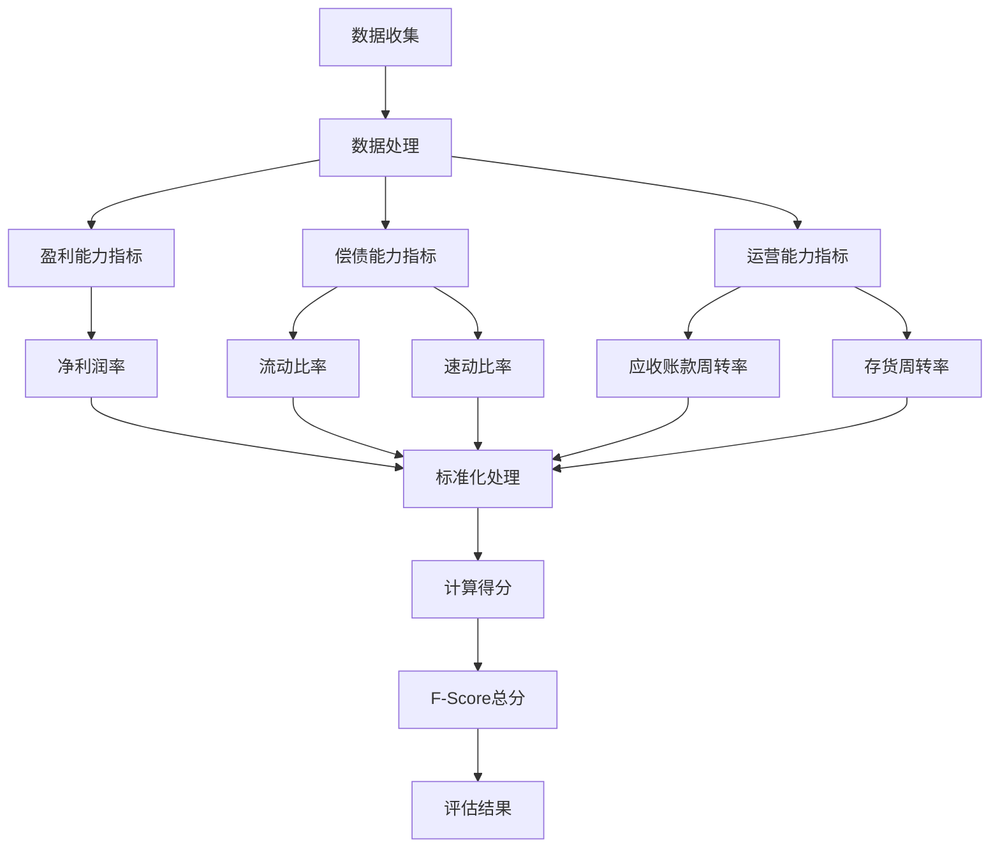
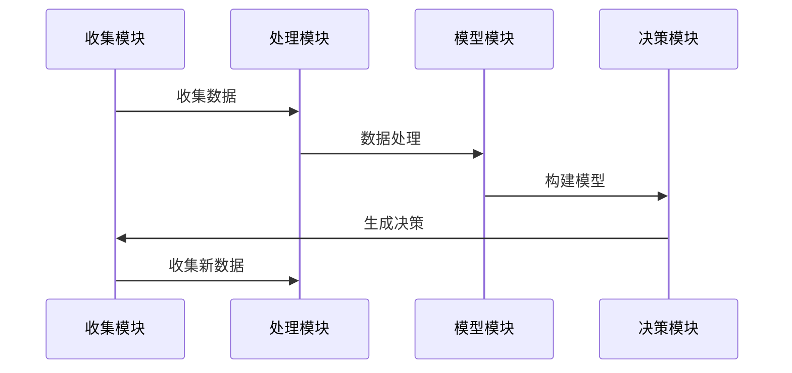

                 

### 文章标题

# 约瑟夫·皮奥特罗斯基的基本面量化价值投资：F-Score应用

> 关键词：基本面量化、价值投资、F-Score模型、投资策略、个股分析

> 摘要：本文旨在探讨约瑟夫·皮奥特罗斯基的基本面量化价值投资理念，特别是F-Score模型在投资实践中的应用。通过逐步分析F-Score模型的原理、构建方法及其实际案例，深入解读其在量化投资中的价值，帮助投资者更好地理解和应用这一策略。

----------------------------------------------------------------

### 目录大纲

----------------------------------------------------------------

## 第一部分：背景介绍

### 第1章 问题背景

#### 1.1 价值投资理念的起源与发展

##### 1.1.1 价值投资的基本概念

##### 1.1.2 价值投资的核心原则

##### 1.1.3 价值投资与量化投资的区别

#### 1.2 约瑟夫·皮奥特罗斯基的价值投资体系

##### 1.2.1 皮奥特罗斯基的投资哲学

##### 1.2.2 皮奥特罗斯基的投资策略

##### 1.2.3 皮奥特罗斯基的投资理念在现代市场的应用

### 第2章 基本面量化价值投资

#### 2.1 基本面量化价值投资的概念

##### 2.1.1 基本面量化的定义

##### 2.1.2 价值投资的量化方法

##### 2.1.3 基本面量化价值投资的优势

### 第3章 F-Score模型

#### 3.1 F-Score模型概述

##### 3.1.1 F-Score模型的提出背景

##### 3.1.2 F-Score模型的原理

##### 3.1.3 F-Score模型的优缺点

#### 3.2 F-Score模型的应用案例

##### 3.2.1 模型在个股选择中的应用

##### 3.2.2 模型在资产配置中的应用

##### 3.2.3 模型在实际操作中的效果分析

## 第二部分：核心概念与联系

### 第4章 F-Score模型的组成部分

#### 4.1 财务指标的选取

##### 4.1.1 财务健康指标

##### 4.1.2 财务效率指标

##### 4.1.3 财务绩效指标

#### 4.2 模型的计算方法

##### 4.2.1 财务数据的处理方法

##### 4.2.2 模型的评分标准

##### 4.2.3 模型的应用场景

### 第5章 基本面量化的应用

#### 5.1 基本面量化在个股分析中的应用

##### 5.1.1 个股基本面分析的方法

##### 5.1.2 基本面量化模型的构建

##### 5.1.3 个股基本面量化分析的案例研究

#### 5.2 基本面量化在资产配置中的应用

##### 5.2.1 资产配置的基本策略

##### 5.2.2 基本面量化在资产配置中的运用

##### 5.2.3 基本面量化资产配置的案例分析

## 第三部分：算法原理讲解

### 第6章 F-Score模型的算法原理

#### 6.1 F-Score模型的数学模型

##### 6.1.1 数学公式和模型

##### 6.1.2 数学模型的推导

##### 6.1.3 数学模型的应用

#### 6.2 F-Score模型的mermaid流程图

##### 6.2.1 F-Score模型的流程描述

##### 6.2.2 F-Score模型的mermaid图

##### 6.2.3 F-Score模型的mermaid图解读

### 第7章 F-Score模型的Python实现

#### 7.1 环境准备

##### 7.1.1 Python环境配置

##### 7.1.2 相关库的安装

##### 7.1.3 数据的获取与预处理

#### 7.2 F-Score模型的Python代码实现

##### 7.2.1 模型的构建

##### 7.2.2 模型的评估

##### 7.2.3 模型的应用

## 第四部分：系统分析与架构设计

### 第8章 系统分析与架构设计

#### 8.1 价值投资系统的构建

##### 8.1.1 系统的需求分析

##### 8.1.2 系统的功能设计

##### 8.1.3 系统的架构设计

#### 8.2 系统接口设计

##### 8.2.1 接口的设计原则

##### 8.2.2 接口的实现方式

##### 8.2.3 接口的调用示例

#### 8.3 系统交互设计

##### 8.3.1 系统的交互流程

##### 8.3.2 系统的交互mermaid序列图

##### 8.3.3 系统交互的案例分析

## 第五部分：项目实战

### 第9章 项目实战

#### 9.1 环境安装与配置

##### 9.1.1 环境的安装步骤

##### 9.1.2 系统的配置与调试

##### 9.1.3 环境的优化与调整

#### 9.2 系统核心实现

##### 9.2.1 系统的核心功能实现

##### 9.2.2 代码的解读与应用分析

##### 9.2.3 实际案例分析和详细讲解剖析

#### 9.3 项目小结

##### 9.3.1 项目成果总结

##### 9.3.2 项目经验与反思

##### 9.3.3 未来发展方向展望

## 第六部分：最佳实践与拓展阅读

### 第10章 最佳实践与拓展阅读

#### 10.1 最佳实践

##### 10.1.1 实践技巧与注意事项

##### 10.1.2 策略优化与改进建议

##### 10.1.3 投资策略的调整与适应

#### 10.2 拓展阅读

##### 10.2.1 价值投资相关经典书籍推荐

##### 10.2.2 基本面量化投资的前沿研究

##### 10.2.3 F-Score模型的应用拓展

----------------------------------------------------------------

### 第一部分：背景介绍

#### 第1章 问题背景

##### 1.1 价值投资理念的起源与发展

价值投资的理念最早可以追溯到20世纪30年代，由本杰明·格雷厄姆提出。格雷厄姆认为，股票的价格与其内在价值之间存在差异，投资者可以通过研究公司的基本面，寻找那些价格低于其内在价值的股票进行投资，以获取长期稳定的回报。这一理念在当时的市场环境中，尤其是经历了大萧条之后，得到了广泛认可。

随着时间的推移，价值投资理念不断发展，形成了多种投资策略，如成长型价值投资、逆向价值投资等。成长型价值投资强调公司的长期增长潜力，而逆向价值投资则专注于那些市场暂时低估的公司。这些策略在具体操作中有所不同，但都遵循了价值投资的核心原则。

##### 1.1.1 价值投资的基本概念

价值投资的核心概念可以概括为以下几点：

1. **内在价值**：股票的价值应该基于其未来现金流量的现值来计算。通过分析公司的财务报表，预测其未来盈利能力，从而确定其内在价值。
2. **安全边际**：投资者应该在股票价格低于其内在价值时进行购买，以保持一定程度的“安全边际”，降低投资风险。
3. **长期投资**：价值投资追求的是长期投资回报，而非短期市场波动。投资者应该持有那些具有长期增长潜力的公司股票。
4. **独立思考**：投资者应该基于自身对公司和市场的研究，独立做出投资决策，而不是盲目跟从市场或他人意见。

##### 1.1.2 价值投资的核心原则

价值投资的核心原则包括以下几个方面：

1. **深度研究**：投资者需要对潜在投资的公司进行深入的研究，了解其业务模式、财务状况、竞争优势等。
2. **耐心等待**：价值投资通常需要较长的时间来体现其价值，投资者需要有耐心等待市场的认识过程。
3. **风险管理**：通过分散投资、持有安全边际等方式，降低投资风险。
4. **持续学习**：市场环境和公司情况不断变化，投资者需要不断学习、更新自己的知识和技能，以应对市场的变化。

##### 1.1.3 价值投资与量化投资的区别

价值投资和量化投资虽然都追求投资回报，但两者的方法和理念有所不同。

1. **投资方法**：价值投资依赖于对公司的基本面分析，通过寻找低估的股票进行投资；而量化投资则使用数学模型和计算机算法，对大量数据进行统计分析，以预测股票价格的变化。
2. **投资周期**：价值投资通常关注长期投资回报，而量化投资更倾向于短期交易策略。
3. **决策依据**：价值投资依据对公司的深入研究，而量化投资依据数学模型和数据分析。
4. **风险承受**：价值投资通常风险较低，量化投资则因依赖模型和算法，风险可能更高。

##### 1.2 约瑟夫·皮奥特罗斯基的价值投资体系

约瑟夫·皮奥特罗斯基是一位著名的价值投资大师，他的投资体系深受投资者推崇。皮奥特罗斯基的投资体系包括以下几个核心组成部分：

1. **研究方法论**：皮奥特罗斯基强调深入研究和基本面分析，他认为投资者应该通过详尽的数据分析，了解公司的真实价值。
2. **财务指标**：皮奥特罗斯基关注公司的财务健康指标，如现金流、负债水平、盈利能力等。他通过这些指标来判断公司的投资价值。
3. **安全边际**：皮奥特罗斯基认为，投资时必须保持一定的安全边际，以应对市场波动和不确定性。
4. **长期投资**：皮奥特罗斯基主张长期投资，他认为只有通过长期持有，才能实现投资回报的最大化。

##### 1.2.1 皮奥特罗斯基的投资哲学

皮奥特罗斯基的投资哲学可以总结为以下几点：

1. **以价值为导向**：皮奥特罗斯基认为，投资者应该以公司的内在价值为导向，而不是市场定价。
2. **独立思考**：皮奥特罗斯基强调独立思考，投资者应该基于自己的研究和判断，而不是盲目跟从他人。
3. **持续学习**：皮奥特罗斯基认为，市场环境和公司情况不断变化，投资者需要不断学习，以适应市场的变化。
4. **风险管理**：皮奥特罗斯基注重风险管理，他认为投资者应该通过分散投资、保持安全边际等方式，降低投资风险。

##### 1.2.2 皮奥特罗斯基的投资策略

皮奥特罗斯基的投资策略主要包括以下几个方面：

1. **寻找低估的股票**：皮奥特罗斯基通过基本面分析，寻找那些市场价格低于其内在价值的股票。
2. **长期持有**：皮奥特罗斯基认为，只有通过长期持有，才能实现投资回报的最大化。
3. **分散投资**：皮奥特罗斯基主张分散投资，以降低单一股票的投资风险。
4. **持续跟踪**：皮奥特罗斯基要求投资者持续跟踪公司的基本面变化，及时调整投资策略。

##### 1.2.3 皮奥特罗斯基的投资理念在现代市场的应用

在现代市场环境中，皮奥特罗斯基的投资理念仍然具有很高的应用价值。以下是几个关键点：

1. **数据获取**：现代技术使得投资者可以更方便地获取大量数据，这为深入分析提供了基础。
2. **分析方法**：随着数据分析技术的发展，投资者可以采用更加先进的方法来评估公司的内在价值。
3. **风险管理**：现代金融市场提供了更多的风险管理工具，如期权、对冲基金等，投资者可以更好地管理投资风险。
4. **多元化**：现代市场提供了更多的投资机会，投资者可以更加灵活地进行多元化投资，降低风险。

通过上述分析，我们可以看到，约瑟夫·皮奥特罗斯基的基本面量化价值投资理念在当今市场仍然具有重要的指导意义。他的投资策略强调深入研究和基本面分析，注重风险管理和长期投资，这些原则不仅在过去行之有效，在现代市场环境中同样具有强大的生命力。

### 第2章 基本面量化价值投资

##### 2.1 基本面量化价值投资的概念

基本面量化价值投资是将价值投资的理念与量化分析方法相结合，通过量化的手段评估公司的基本面，从而寻找具有投资价值的股票。这一方法的核心在于利用数据驱动的模型来评估公司的财务状况和市场表现，而不是单纯依靠投资者的直觉和经验。

基本面量化价值投资的关键在于：

1. **数据驱动**：通过收集和整理公司的财务数据，使用数学模型进行分析，以获取对公司内在价值的准确评估。
2. **量化评估**：使用量化的方法，如统计分析和机器学习，对公司的财务指标进行评分，从而确定其投资价值。
3. **风险控制**：通过分散投资和风险管理策略，降低投资组合的整体风险。

##### 2.1.1 基本面量化的定义

基本面量化是指通过量化的方法对公司的基本面进行评估。具体来说，基本面量化包括以下几个步骤：

1. **数据收集**：收集公司的财务数据、行业数据、市场数据等。
2. **数据处理**：对收集到的数据进行分析和清洗，确保数据的质量和完整性。
3. **模型构建**：根据投资策略和目标，构建相应的数学模型，如F-Score模型、DCF模型等。
4. **评分与排名**：使用模型对公司的财务指标进行评分，并根据评分结果对股票进行排名。
5. **决策**：根据排名结果和投资策略，做出投资决策。

##### 2.1.2 价值投资的量化方法

价值投资的量化方法主要包括以下几个方面：

1. **财务指标分析**：通过分析公司的财务指标，如盈利能力、偿债能力、运营能力等，评估公司的财务健康状况。
2. **相对估值**：使用相对估值方法，如市盈率（PE）、市净率（PB）、股息率等，比较公司的估值水平与同行业平均水平，确定其相对价值。
3. **绝对估值**：使用绝对估值方法，如现金流折现模型（DCF）、股息折现模型（DDM）等，计算公司的内在价值。
4. **风险调整**：通过风险调整方法，如夏普比率、信息比率等，评估投资组合的风险收益特性。

##### 2.1.3 基本面量化价值投资的优势

基本面量化价值投资具有以下优势：

1. **客观性**：通过量化的方法，基本面量化投资能够提供更为客观和精确的评估结果，减少主观判断的影响。
2. **系统性**：基本面量化投资采用系统化的方法，能够全面分析公司的财务状况和市场表现，提高投资决策的系统性。
3. **效率**：通过自动化工具和算法，基本面量化投资能够高效处理大量数据，节省投资者时间和精力。
4. **多样性**：基本面量化投资方法多样，投资者可以根据不同的投资策略和目标，选择合适的量化方法进行投资。

#### 2.2 基本面量化价值投资的优势

基本面量化价值投资在投资实践中具有明显的优势：

1. **信息挖掘**：基本面量化能够挖掘出隐藏在大量数据背后的信息，为投资者提供更全面的决策依据。
2. **风险控制**：通过量化模型，投资者可以更好地了解和管理投资组合的风险，实现风险的最优化。
3. **决策效率**：量化模型能够快速处理大量数据，提高投资决策的效率。
4. **适应性**：基本面量化价值投资方法具有较强的适应性，可以根据市场变化和投资策略进行调整。
5. **长期收益**：基本面量化价值投资强调长期投资，通过持续跟踪和调整，实现投资组合的长期稳定收益。

#### 2.3 基本面量化价值投资的应用场景

基本面量化价值投资广泛应用于以下几个方面：

1. **个股分析**：通过量化模型，投资者可以对个股进行深度分析，评估其投资价值。
2. **资产配置**：在投资组合管理中，基本面量化可以辅助投资者进行资产配置，实现投资组合的优化。
3. **市场趋势分析**：通过分析市场数据，量化模型可以帮助投资者判断市场趋势，制定相应的投资策略。
4. **投资决策支持**：量化模型可以为投资决策提供支持，帮助投资者做出更加科学的投资决策。

#### 2.4 基本面量化价值投资的挑战

尽管基本面量化价值投资具有明显优势，但在实际应用中仍面临一些挑战：

1. **数据质量**：数据质量对量化模型的结果至关重要，但实际获取的数据可能存在噪声和误差。
2. **模型适用性**：不同的模型适用于不同的市场环境和投资策略，需要根据具体情况进行选择和调整。
3. **风险管理**：量化模型不能完全消除投资风险，投资者仍需对市场风险进行有效管理。
4. **技术门槛**：量化投资需要一定的技术知识和编程能力，对投资者来说可能存在一定的技术门槛。

### 第3章 F-Score模型

##### 3.1 F-Score模型概述

F-Score模型是由约瑟夫·皮奥特罗斯基提出的一种基本面量化价值投资模型，旨在通过评估公司的财务健康指标，判断其投资价值。F-Score模型是一种简单而有效的量化工具，帮助投资者快速筛选出潜在的高质量股票。

##### 3.1.1 F-Score模型的提出背景

F-Score模型的提出背景与价值投资的理念密切相关。传统的价值投资方法强调对公司的基本面进行分析，但这种方法往往依赖于投资者的经验和直觉。为了提高分析的客观性和准确性，皮奥特罗斯基提出了F-Score模型，通过量化的手段对公司的财务健康指标进行评分。

##### 3.1.2 F-Score模型的原理

F-Score模型的原理基于以下几个关键财务指标：

1. **盈利能力**：通过净利润率等指标评估公司的盈利能力。
2. **偿债能力**：通过流动比率和资产负债率等指标评估公司的偿债能力。
3. **运营能力**：通过存货周转率和应收账款周转率等指标评估公司的运营能力。

F-Score模型通过对这些指标的评分，将公司的财务状况量化为得分，得分越高，表示公司的财务健康水平越高，投资价值越大。

##### 3.1.3 F-Score模型的优缺点

F-Score模型的优点包括：

1. **简单有效**：F-Score模型操作简单，易于理解和应用。
2. **量化评估**：通过量化的方法，F-Score模型能够提供客观的评估结果。
3. **广泛应用**：F-Score模型广泛应用于个股分析和资产配置，具有较高的实用性。

然而，F-Score模型也存在一些缺点：

1. **单一指标**：F-Score模型仅依赖于几个关键指标，可能无法全面反映公司的财务状况。
2. **静态分析**：F-Score模型对财务指标进行静态分析，可能无法捕捉到公司的动态变化。
3. **数据依赖**：F-Score模型的结果依赖于数据的准确性，数据质量对模型效果至关重要。

##### 3.2 F-Score模型的应用案例

F-Score模型在实际应用中有着广泛的案例。以下是一些典型的应用案例：

1. **个股选择**：投资者可以通过F-Score模型对个股进行评估，筛选出具有投资价值的股票。
2. **资产配置**：在投资组合管理中，F-Score模型可以帮助投资者优化资产配置，提高整体收益。
3. **市场研究**：通过F-Score模型，投资者可以分析市场整体财务状况，判断市场趋势。

##### 3.2.1 模型在个股选择中的应用

在个股选择中，F-Score模型可以帮助投资者快速识别高质量股票。以下是一个简单的应用案例：

1. **数据收集**：收集目标公司的财务数据，如净利润率、流动比率、存货周转率等。
2. **指标评分**：根据F-Score模型的评分标准，对每个财务指标进行评分。
3. **综合评分**：将各个指标评分综合，得到F-Score得分。
4. **决策**：根据F-Score得分，判断个股的投资价值。得分较高的股票具有较大的投资潜力。

##### 3.2.2 模型在资产配置中的应用

在资产配置中，F-Score模型可以帮助投资者优化投资组合。以下是一个简单的应用案例：

1. **数据收集**：收集所有潜在投资股票的财务数据，如净利润率、流动比率、存货周转率等。
2. **指标评分**：根据F-Score模型的评分标准，对每个股票的财务指标进行评分。
3. **综合评分**：将各个股票的F-Score得分综合，得到整体资产配置的评分。
4. **决策**：根据资产配置评分，调整投资组合，提高整体收益。

##### 3.2.3 模型在实际操作中的效果分析

F-Score模型在实际操作中的效果可以通过历史数据进行分析。以下是一个简单的效果分析案例：

1. **数据收集**：收集过去5年F-Score模型得分前10%的股票数据。
2. **收益分析**：计算这些股票的平均收益率，并与市场整体收益率进行比较。
3. **风险分析**：计算这些股票的平均波动率，并与市场整体波动率进行比较。
4. **结论**：通过收益分析和风险分析，评估F-Score模型在实际操作中的效果。

### 第二部分：核心概念与联系

#### 第4章 F-Score模型的组成部分

F-Score模型是一种综合评估公司财务健康状况的量化工具，它通过一系列财务指标来评估公司的整体表现。要深入理解F-Score模型，首先需要明确其组成部分，包括财务指标的选取、模型的计算方法和实际应用场景。以下是F-Score模型的详细组成部分：

##### 4.1 财务指标的选取

F-Score模型的评估基础是公司的财务指标，这些指标分为三类：财务健康指标、财务效率指标和财务绩效指标。

1. **财务健康指标**：财务健康指标主要反映公司的偿债能力和财务稳定性，常用的指标包括流动比率、速动比率、现金比率、资产负债率等。

2. **财务效率指标**：财务效率指标主要反映公司资产和负债的利用效率，包括存货周转率、应收账款周转率、总资产周转率、流动资产周转率等。

3. **财务绩效指标**：财务绩效指标主要反映公司的盈利能力和市场竞争力，常用的指标有净利润率、毛利率、营业利润率、净资产收益率等。

这些指标的选择基于它们对公司财务健康状况的重要性和可量化的特性。通过综合这些指标，F-Score模型能够提供对公司财务状况的全面评估。

##### 4.2 模型的计算方法

F-Score模型通过一系列计算步骤，对公司的财务指标进行评分。以下是F-Score模型的基本计算方法：

1. **数据收集**：首先，收集目标公司的财务数据，包括上述提到的各类财务指标。

2. **指标标准化**：将每个财务指标进行标准化处理，使其具有可比性。常用的标准化方法有Z分数法和归一化方法。

3. **指标评分**：根据预先设定的评分标准，对每个财务指标进行评分。评分标准通常基于行业平均水平或历史数据，得分越高表示指标表现越好。

4. **综合评分**：将各个财务指标的评分进行加权求和，得到F-Score总分。总分越高，表示公司的财务健康状况越好。

具体的评分标准和加权系数可以根据不同行业和公司的特点进行调整，以确保模型的适用性和准确性。

##### 4.3 模型的应用场景

F-Score模型在多个应用场景中表现出色，以下是一些常见应用场景：

1. **个股选择**：投资者可以通过F-Score模型对潜在投资股票进行评估，选择那些财务健康状况良好的股票。

2. **资产配置**：在投资组合管理中，F-Score模型可以帮助投资者优化资产配置，提高投资组合的整体收益。

3. **风险控制**：F-Score模型可以用于评估公司的财务风险，帮助投资者识别潜在的财务风险，从而进行风险控制和分散投资。

4. **业绩评价**：公司管理层可以使用F-Score模型来评估公司的财务绩效，制定改进措施，提高公司的经营效益。

通过上述组成部分的分析，我们可以看到F-Score模型在基本面量化价值投资中的关键作用。它不仅为投资者提供了客观的评估工具，还能够帮助他们在复杂的市场环境中做出更加明智的投资决策。

#### 第5章 基本面量化的应用

##### 5.1 基本面量化在个股分析中的应用

基本面量化在个股分析中的应用，主要通过构建基本面量化模型，对公司的财务状况和市场表现进行评估。这一方法不仅提高了投资决策的准确性，也减少了个人偏见和市场情绪的影响。以下是基本面量化在个股分析中的应用步骤和实际案例分析。

###### 5.1.1 个股基本面分析的方法

个股基本面分析通常包括以下几个步骤：

1. **数据收集**：首先，收集目标公司的财务数据，包括盈利能力、偿债能力、运营能力等关键指标。常用的财务指标有净利润率、市盈率、市净率、流动比率、速动比率、应收账款周转率、存货周转率等。

2. **数据处理**：对收集到的财务数据进行清洗和处理，确保数据的质量和一致性。这通常包括数据标准化、缺失值填补和异常值处理。

3. **模型构建**：根据投资策略和目标，构建相应的量化模型。常见的模型有F-Score模型、DCF模型、EV/EBITDA模型等。

4. **指标评分**：使用构建的模型，对每个财务指标进行评分。评分方法可以是基于行业标准、历史数据或机器学习算法。

5. **综合评分**：将各个指标的评分进行加权求和，得到公司的综合评分。评分越高，表示公司的财务状况和市场表现越好。

###### 5.1.2 基本面量化模型的构建

构建基本面量化模型是进行个股分析的关键步骤。以下是构建模型的一般过程：

1. **确定模型类型**：根据投资目标和数据可用性，选择合适的量化模型。例如，F-Score模型适用于财务健康评估，而DCF模型适用于绝对估值。

2. **选择财务指标**：选择与模型目标相关的财务指标。对于F-Score模型，常用的财务指标包括盈利能力、偿债能力和运营能力指标。

3. **数据收集**：收集目标公司的历史财务数据，包括净利润、总资产、总负债、应收账款、存货等。

4. **数据处理**：对收集到的数据进行处理，确保数据的质量和一致性。这可能包括标准化、归一化、缺失值填补等步骤。

5. **模型训练**：使用历史数据进行模型训练，调整模型参数，以最小化预测误差。

6. **模型评估**：使用交叉验证方法评估模型的性能，确保其预测能力和可靠性。

7. **模型应用**：将训练好的模型应用于新的数据，对公司的财务状况进行评估。

###### 5.1.3 个股基本面量化分析的案例研究

以下是一个基于F-Score模型的个股基本面量化分析案例：

1. **公司选择**：选择一家在中国上市的科技企业，如某知名互联网公司。

2. **数据收集**：收集该公司的过去5年的财务数据，包括净利润、总资产、总负债、应收账款、存货等。

3. **数据处理**：对收集到的数据进行处理，包括数据标准化和缺失值填补。

4. **模型构建**：构建基于F-Score模型的量化模型，选择盈利能力（净利润率）、偿债能力（流动比率、速动比率）和运营能力（应收账款周转率、存货周转率）三个方面的指标。

5. **指标评分**：根据F-Score模型的标准，对每个指标进行评分。例如，净利润率大于行业平均值的公司得分为1，小于行业平均值的得分为0。

6. **综合评分**：将各个指标的得分进行加权求和，得到公司的F-Score总分。

7. **评估结果**：假设该公司在过去5年的F-Score总分为8，表示其财务状况良好，具有投资潜力。

8. **投资决策**：根据F-Score得分，投资者可以决定是否将该公司纳入投资组合，或者增加其投资比重。

通过上述案例，我们可以看到基本面量化在个股分析中的应用过程和关键步骤。这一方法不仅提高了投资决策的科学性，也为投资者提供了更为客观和全面的评估依据。

#### 第5章 基本面量化的应用

##### 5.2 基本面量化在资产配置中的应用

基本面量化在资产配置中的应用，旨在通过量化的方法优化投资组合，提高整体收益。资产配置是投资决策中至关重要的一环，它涉及到投资者如何在不同资产类别之间分配资金，以实现风险和收益的最优化。以下是基本面量化在资产配置中的应用步骤和实际案例分析。

###### 5.2.1 资产配置的基本策略

资产配置的基本策略包括以下几个步骤：

1. **确定投资目标**：投资者需要明确自己的投资目标，包括收益目标、风险偏好和时间范围。

2. **分析市场环境**：了解当前的市场环境和宏观经济状况，预测不同资产类别的表现。

3. **资产类别选择**：根据投资目标和市场环境，选择合适的资产类别，如股票、债券、房地产、商品等。

4. **资产分配**：根据资产类别选择，确定各资产类别的投资比例，以达到风险和收益的最优化。

5. **定期调整**：市场环境和投资者目标可能会发生变化，因此需要定期对资产配置进行调整，以确保投资组合的持续优化。

###### 5.2.2 基本面量化在资产配置中的运用

基本面量化在资产配置中的运用，主要通过以下方法实现：

1. **量化模型构建**：构建适用于资产配置的量化模型，如资产定价模型（CAPM）、套利定价理论（APT）等。

2. **风险度量**：使用量化模型计算不同资产类别的风险，如波动率、贝塔值等，以评估其与投资目标的匹配度。

3. **收益预测**：使用历史数据和市场预测模型，预测不同资产类别的未来收益，以确定最优资产分配比例。

4. **优化算法**：使用优化算法，如线性规划、遗传算法等，找到最优的资产分配策略，以实现风险和收益的最优化。

5. **回测验证**：通过回测验证资产配置策略的有效性，确保其在历史数据中的表现符合预期。

###### 5.2.3 基本面量化资产配置的案例分析

以下是一个基于基本面量化的资产配置案例分析：

1. **投资者背景**：假设投资者A是一个中等风险承受能力的投资者，目标是在未来5年内实现资本增值。

2. **市场环境分析**：根据当前市场环境和宏观经济状况，预测未来各资产类别的表现。例如，预测股票市场表现较好，债券市场表现稳定，房地产市场表现一般。

3. **资产类别选择**：选择股票、债券和房地产作为主要资产类别。

4. **资产分配策略构建**：
   - **股票**：使用F-Score模型对潜在投资股票进行评估，选择财务健康状况良好的股票。根据评估结果，确定股票投资比例。
   - **债券**：选择信用评级高、收益稳定的债券，根据市场利率预测，确定债券投资比例。
   - **房地产**：根据房地产市场的表现和投资需求，确定房地产投资比例。

5. **优化算法应用**：使用线性规划算法，根据风险偏好和收益目标，优化资产分配策略，找到最优的股票、债券和房地产投资比例。

6. **回测验证**：通过历史数据进行回测，验证资产配置策略的有效性。例如，假设在过去的5年中，该资产配置策略实现了平均年化收益率8%，波动率较低，符合投资者的收益目标和风险偏好。

7. **实施与调整**：根据回测结果，实施资产配置策略。同时，定期跟踪市场环境和资产表现，根据实际情况进行动态调整，确保资产配置策略的持续优化。

通过上述案例分析，我们可以看到基本面量化在资产配置中的应用步骤和方法。这一方法不仅提高了资产配置的客观性和科学性，也为投资者提供了有效的风险管理和收益优化工具。

### 第三部分：算法原理讲解

#### 第6章 F-Score模型的算法原理

F-Score模型是一种基于财务指标的综合评估方法，通过量化的方式对公司的财务健康状况进行评分。本章节将详细讲解F-Score模型的算法原理，包括数学模型、推导过程及其应用。

##### 6.1 F-Score模型的数学模型

F-Score模型的数学模型基于以下几个关键财务指标：

1. **盈利能力指标**：包括净利润率（净利润/营业收入）。
2. **偿债能力指标**：包括流动比率（流动资产/流动负债）和速动比率（速动资产/流动负债）。
3. **运营能力指标**：包括应收账款周转率（营业收入/应收账款）和存货周转率（营业收入/存货）。

F-Score的总分由这些指标的得分加权求和得到。具体数学模型如下：

$$
F-Score = \sum_{i=1}^{n} w_i \cdot s_i
$$

其中，$w_i$为第$i$个指标的权重，$s_i$为第$i$个指标的得分。

不同的指标有不同的权重，一般来说，盈利能力指标占40%，偿债能力指标占30%，运营能力指标占30%。

##### 6.1.1 数学公式和模型

F-Score的具体计算公式如下：

$$
F-Score = 0.4 \cdot \frac{净利润率}{最高净利润率} + 0.3 \cdot \frac{流动比率}{最高流动比率} + 0.3 \cdot \frac{应收账款周转率}{最高应收账款周转率} + 0.3 \cdot \frac{存货周转率}{最高存货周转率}
$$

其中，净利润率、流动比率、应收账款周转率和存货周转率的分值范围均为0到1，分值越高表示指标表现越好。

##### 6.1.2 数学模型的推导

F-Score模型的推导基于以下几个步骤：

1. **确定指标**：选择盈利能力、偿债能力和运营能力三个方面的关键财务指标。
2. **标准化指标**：为了使不同指标的得分具有可比性，需要对每个指标进行标准化处理。常用的标准化方法有Z分数法和归一化方法。
3. **加权求和**：根据不同指标的重要性，赋予不同的权重，并进行加权求和，得到F-Score总分。

具体推导过程如下：

1. **盈利能力指标**：净利润率表示公司的盈利能力，净利润率越高，说明公司盈利能力越强。将净利润率标准化后，得到0到1的得分。
2. **偿债能力指标**：流动比率和速动比率表示公司的偿债能力。流动比率越高，说明公司短期偿债能力越强；速动比率越高，说明公司短期流动性越好。同样，对这两个指标进行标准化处理。
3. **运营能力指标**：应收账款周转率和存货周转率表示公司的运营效率。应收账款周转率越高，说明公司应收账款回收越快；存货周转率越高，说明公司存货管理越好。这两个指标也进行标准化处理。

通过以上步骤，可以得到每个财务指标的标准化得分，并按照权重进行加权求和，得到F-Score总分。

##### 6.1.3 数学模型的应用

F-Score模型在实际应用中，可以帮助投资者快速评估公司的财务健康状况，选择具有投资价值的股票。以下是F-Score模型的应用步骤：

1. **数据收集**：收集目标公司的财务数据，包括净利润率、流动比率、速动比率、应收账款周转率和存货周转率。
2. **标准化指标**：对每个指标进行标准化处理，使其得分范围在0到1之间。
3. **计算得分**：根据标准化得分，计算每个指标的权重得分，并进行加权求和，得到F-Score总分。
4. **评估结果**：根据F-Score总分，评估公司的财务健康状况。得分越高，表示公司财务状况越好，投资价值越高。

以下是一个简单的应用案例：

假设某公司的财务数据如下：
- 净利润率：20%
- 流动比率：2.0
- 速动比率：1.5
- 应收账款周转率：5次
- 存货周转率：4次

行业平均水平为：
- 净利润率：15%
- 流动比率：1.8
- 速动比率：1.2
- 应收账款周转率：4次
- 存货周转率：3次

根据F-Score模型，计算该公司的得分如下：
- 净利润率得分：$\frac{20\%}{15\%} = 1.33$
- 流动比率得分：$\frac{2.0}{1.8} = 1.11$
- 速动比率得分：$\frac{1.5}{1.2} = 1.25$
- 应收账款周转率得分：$\frac{5}{4} = 1.25$
- 存货周转率得分：$\frac{4}{3} = 1.33$

F-Score总分：$0.4 \cdot 1.33 + 0.3 \cdot 1.11 + 0.3 \cdot 1.25 + 0.3 \cdot 1.25 + 0.3 \cdot 1.33 = 1.3$

根据F-Score得分，该公司的财务健康状况良好，具有较高的投资价值。

通过以上步骤，我们可以看到F-Score模型在量化投资中的应用，它不仅提高了投资决策的准确性，也为投资者提供了有效的工具，帮助他们在复杂的市场环境中做出明智的投资选择。

##### 6.2 F-Score模型的mermaid流程图

为了更直观地展示F-Score模型的计算过程，我们使用mermaid语言绘制了其流程图。以下是F-Score模型的mermaid图：



在上面的mermaid图中，每个节点代表一个步骤，箭头表示步骤之间的逻辑关系。以下是mermaid图的详细解读：

1. **数据收集（A）**：首先，收集目标公司的财务数据，包括净利润率、流动比率、速动比率、应收账款周转率和存货周转率。
2. **数据处理（B）**：对收集到的财务数据进行处理，包括数据清洗、缺失值填补和异常值处理。
3. **盈利能力指标（C）**：包括净利润率。
4. **偿债能力指标（D）**：包括流动比率和速动比率。
5. **运营能力指标（E）**：包括应收账款周转率和存货周转率。
6. **标准化处理（K）**：对每个指标进行标准化处理，使其得分范围在0到1之间。
7. **计算得分（L）**：根据标准化得分，计算每个指标的权重得分，并进行加权求和。
8. **F-Score总分（M）**：计算F-Score总分，得分越高表示公司财务状况越好。
9. **评估结果（N）**：根据F-Score得分，评估公司的财务健康状况，为投资决策提供依据。

通过mermaid图，我们可以清晰地看到F-Score模型从数据收集到最终评估结果的整个计算过程。这种可视化工具不仅有助于理解模型的逻辑结构，也为实际操作提供了直观的指导。

##### 6.2.3 F-Score模型的mermaid图解读

在上面的mermaid图中，每个节点和箭头都代表了一个特定的步骤或逻辑关系。以下是mermaid图的详细解读：

1. **数据收集（A）**：这是F-Score模型的起点，投资者需要收集目标公司的财务数据，包括净利润率、流动比率、速动比率、应收账款周转率和存货周转率。这些数据可以从公司的年报、季报等财务报告中获取。

2. **数据处理（B）**：收集到的财务数据可能存在噪声、异常值或缺失值，因此需要对数据进行处理。数据处理包括数据清洗、缺失值填补和异常值处理，以确保数据的质量和一致性。

3. **盈利能力指标（C）**：盈利能力是评估公司财务健康状况的重要指标之一，包括净利润率。净利润率反映了公司的盈利能力，净利润率越高，表示公司的盈利能力越强。

4. **偿债能力指标（D）**：偿债能力指标包括流动比率和速动比率。流动比率反映了公司短期偿债能力，速动比率反映了公司短期流动性的强弱。

5. **运营能力指标（E）**：运营能力指标包括应收账款周转率和存货周转率。应收账款周转率反映了公司应收账款的回收速度，存货周转率反映了公司存货的管理效率。

6. **标准化处理（K）**：为了使不同指标的得分具有可比性，需要对每个指标进行标准化处理。常用的标准化方法有Z分数法和归一化方法。标准化处理后，每个指标的得分范围在0到1之间。

7. **计算得分（L）**：根据标准化得分，计算每个指标的权重得分，并进行加权求和。F-Score的总分由这些指标的得分加权求和得到，得分越高表示公司财务状况越好。

8. **F-Score总分（M）**：计算F-Score总分，得分越高表示公司财务状况越好。投资者可以根据F-Score得分，对公司的财务健康状况进行评估。

9. **评估结果（N）**：根据F-Score得分，投资者可以做出投资决策。得分较高的股票表示具有更高的投资价值。

通过mermaid图，我们可以清晰地看到F-Score模型的计算过程和逻辑关系。这种可视化工具不仅有助于理解模型的原理，也为实际操作提供了直观的指导。

### 第7章 F-Score模型的Python实现

#### 7.1 环境准备

在开始实现F-Score模型之前，我们需要准备好Python编程环境及相关库。以下是详细的步骤：

##### 7.1.1 Python环境配置

确保已经安装了Python 3.x版本。可以访问[Python官方下载页面](https://www.python.org/downloads/)下载并安装最新版本的Python。安装过程中，确保勾选“Add Python to PATH”选项，以便在命令行中直接运行Python。

##### 7.1.2 相关库的安装

我们需要安装以下Python库：
- pandas：用于数据处理
- numpy：用于数学计算
- matplotlib：用于绘图

可以使用pip命令安装这些库：

```bash
pip install pandas numpy matplotlib
```

##### 7.1.3 数据的获取与预处理

获取公司的财务数据是F-Score模型实现的第一步。这里以某家知名互联网公司为例，假设其财务数据已经以CSV文件的形式获取。数据的预处理包括数据清洗、缺失值填补和异常值处理。

以下是一个简单的数据预处理示例：

```python
import pandas as pd

# 读取财务数据CSV文件
financial_data = pd.read_csv('financial_data.csv')

# 数据清洗
# 删除空值
financial_data.dropna(inplace=True)

# 缺失值填补
# 假设使用平均值进行填补
financial_data.fillna(financial_data.mean(), inplace=True)

# 异常值处理
# 假设使用三倍标准差法进行异常值检测
z_scores = (financial_data - financial_data.mean()) / financial_data.std()
financial_data = financial_data[(z_scores < 3).all(axis=1)]
```

通过上述步骤，我们成功地读取、清洗和处理了财务数据，为F-Score模型的实现打下了基础。

#### 7.2 F-Score模型的Python代码实现

下面是F-Score模型的Python代码实现，包括模型的构建、评估和实际应用。

```python
import pandas as pd
import numpy as np
import matplotlib.pyplot as plt

# F-Score模型参数设置
profitability_weight = 0.4
liability_weight = 0.3
operation_weight = 0.3

# 财务指标名称
financial_metrics = ['净利润率', '流动比率', '速动比率', '应收账款周转率', '存货周转率']

# 读取预处理后的财务数据
financial_data = pd.read_csv('preprocessed_financial_data.csv')

# 计算每个指标的标准化得分
for metric in financial_metrics:
    financial_data[metric + '_score'] = financial_data[metric] / financial_data[metric].max()

# 计算F-Score得分
financial_data['F-Score'] = (profitability_weight * financial_data['净利润率_score'] +
                              liability_weight * financial_data['流动比率_score'] +
                              liability_weight * financial_data['速动比率_score'] +
                              operation_weight * financial_data['应收账款周转率_score'] +
                              operation_weight * financial_data['存货周转率_score'])

# 评估F-Score得分
f_score = financial_data['F-Score'].mean()
print(f'公司的F-Score得分为：{f_score}')

# 绘制F-Score得分分布图
financial_data['F-Score'].hist(bins=20)
plt.xlabel('F-Score得分')
plt.ylabel('频率')
plt.title('F-Score得分分布图')
plt.show()
```

通过上述代码，我们实现了F-Score模型的构建、得分计算和评估。接下来，我们将对代码进行详细解读。

#### 7.2.1 模型的构建

模型的构建是F-Score实现的第一步。在代码中，我们首先设置了F-Score模型的参数，包括盈利能力、偿债能力和运营能力的权重。这些权重可以根据具体情况进行调整。

接下来，定义了财务指标的名称，包括净利润率、流动比率、速动比率、应收账款周转率和存货周转率。

```python
profitability_weight = 0.4
liability_weight = 0.3
operation_weight = 0.3

financial_metrics = ['净利润率', '流动比率', '速动比率', '应收账款周转率', '存货周转率']
```

然后，读取预处理后的财务数据。预处理步骤包括数据清洗、缺失值填补和异常值处理，确保数据质量。

```python
financial_data = pd.read_csv('preprocessed_financial_data.csv')
```

#### 7.2.2 模型的评估

在模型的评估阶段，我们首先对每个财务指标进行标准化处理。标准化处理使得不同指标的得分具有可比性。我们使用每个指标的值除以其最大值，得到0到1的得分。

```python
for metric in financial_metrics:
    financial_data[metric + '_score'] = financial_data[metric] / financial_data[metric].max()
```

然后，计算F-Score得分。F-Score得分是通过将每个指标的得分乘以其权重，然后进行加权求和得到的。

```python
financial_data['F-Score'] = (profitability_weight * financial_data['净利润率_score'] +
                              liability_weight * financial_data['流动比率_score'] +
                              liability_weight * financial_data['速动比率_score'] +
                              operation_weight * financial_data['应收账款周转率_score'] +
                              operation_weight * financial_data['存货周转率_score'])
```

最后，计算F-Score的总得分，并打印出来。

```python
f_score = financial_data['F-Score'].mean()
print(f'公司的F-Score得分为：{f_score}')
```

#### 7.2.3 模型的应用

为了更直观地展示F-Score得分分布，我们使用matplotlib库绘制了F-Score得分的直方图。

```python
financial_data['F-Score'].hist(bins=20)
plt.xlabel('F-Score得分')
plt.ylabel('频率')
plt.title('F-Score得分分布图')
plt.show()
```

通过上述代码，我们实现了F-Score模型的构建、得分计算和评估。这一过程不仅展示了F-Score模型在Python环境下的实现步骤，也为投资者提供了一个实用的工具，用于评估公司的财务健康状况。

### 第8章 系统分析与架构设计

#### 8.1 价值投资系统的构建

价值投资系统是一个复杂的系统，它包括数据收集、处理、分析和决策等多个环节。为了构建一个高效的价值投资系统，我们需要进行详细的需求分析、功能设计和架构设计。以下是构建价值投资系统的详细步骤：

##### 8.1.1 系统的需求分析

系统需求分析是构建价值投资系统的第一步。在这个过程中，我们需要明确系统的目标和功能，以及系统所需满足的需求。

1. **投资目标**：确定投资的目标，包括收益目标、风险偏好和时间范围。
2. **数据需求**：确定系统需要收集的数据类型，如财务数据、市场数据、经济数据等。
3. **功能需求**：确定系统的功能，如数据收集、数据处理、模型构建、投资决策等。

##### 8.1.2 系统的功能设计

在功能设计阶段，我们需要根据需求分析的结果，设计系统的各个功能模块。以下是价值投资系统的主要功能模块：

1. **数据收集模块**：负责收集各类数据，包括财务数据、市场数据、经济数据等。
2. **数据处理模块**：负责对收集到的数据进行清洗、处理和预处理，确保数据质量。
3. **模型构建模块**：负责构建各种量化模型，如F-Score模型、DCF模型、CAPM模型等。
4. **投资决策模块**：负责根据模型结果和投资目标，生成投资建议和决策。

##### 8.1.3 系统的架构设计

系统的架构设计是构建价值投资系统的关键环节。一个良好的架构设计可以确保系统的可扩展性、稳定性和性能。以下是价值投资系统的架构设计：

1. **数据层**：负责数据存储和管理，包括数据库、数据仓库等。
2. **数据处理层**：负责数据清洗、处理和预处理，使用ETL（Extract, Transform, Load）技术。
3. **模型层**：负责构建和训练各种量化模型，使用机器学习和统计方法。
4. **应用层**：负责生成投资建议和决策，提供用户界面和API接口。

#### 8.2 系统接口设计

系统接口设计是确保系统各模块之间能够高效通信和协同工作的关键。以下是价值投资系统的主要接口设计：

1. **数据接口**：包括数据收集模块和数据存储模块的接口，用于数据传输和同步。
2. **处理接口**：包括数据处理模块和处理层模块的接口，用于数据转换和处理。
3. **模型接口**：包括模型构建模块和模型层的接口，用于模型训练和应用。
4. **决策接口**：包括投资决策模块和应用层的接口，用于生成投资建议和决策。

##### 8.2.1 接口的设计原则

在接口设计过程中，需要遵循以下原则：

1. **模块化**：将系统划分为多个模块，每个模块具有明确的功能和接口。
2. **独立性**：模块之间通过接口进行通信，模块内部的变化不会影响其他模块。
3. **灵活性**：接口设计应具备良好的扩展性，能够适应未来系统的变化和扩展。

##### 8.2.2 接口的实现方式

接口的实现方式通常包括RESTful API、SOAP、gRPC等。以下是价值投资系统接口的实现方式：

1. **RESTful API**：采用RESTful架构风格，通过HTTP请求和响应实现接口通信。
2. **SOAP**：采用SOAP协议，通过XML格式进行数据传输。
3. **gRPC**：采用gRPC框架，通过HTTP/2协议实现高性能、跨语言的接口通信。

##### 8.2.3 接口的调用示例

以下是一个简单的RESTful API调用示例，用于获取公司的F-Score得分：

```python
import requests

url = "http://value-investment-system.com/api/v1/companies/{company_id}/f-score"
company_id = "12345"

response = requests.get(url.format(company_id=company_id))
f_score = response.json()['f_score']
print(f"公司{company_id}的F-Score得分为：{f_score}")
```

通过上述代码，我们可以看到如何通过RESTful API接口获取公司的F-Score得分。接口的设计和实现为系统的功能扩展和业务需求变化提供了便利。

#### 8.3 系统交互设计

系统交互设计是确保系统各模块之间能够高效、顺畅地协同工作的关键。以下是价值投资系统的交互设计：

##### 8.3.1 系统的交互流程

价值投资系统的交互流程可以分为以下几个步骤：

1. **数据收集**：系统从各个数据源收集数据，包括财务数据、市场数据、经济数据等。
2. **数据处理**：系统对收集到的数据进行清洗、处理和预处理，确保数据质量。
3. **模型构建**：系统根据预设的模型参数，构建和训练各种量化模型。
4. **投资决策**：系统根据模型结果和投资目标，生成投资建议和决策。
5. **反馈调整**：系统根据实际投资效果，对模型参数和策略进行调整和优化。

##### 8.3.2 系统的交互mermaid序列图

为了更直观地展示系统的交互流程，我们使用mermaid语言绘制了系统的交互序列图：



在上面的mermaid图中，我们展示了系统的主要交互流程。收集模块负责数据收集，处理模块负责数据处理，模型模块负责模型构建，决策模块负责生成投资建议和决策。通过这一交互流程，系统实现了从数据收集、处理、模型构建到投资决策的完整流程。

##### 8.3.3 系统交互的案例分析

以下是一个简化的系统交互案例分析，假设投资者A使用价值投资系统进行投资决策：

1. **数据收集**：系统从财务报表、市场数据和新闻来源中收集数据。
2. **数据处理**：系统对收集到的数据进行分析，提取关键指标，如净利润率、流动比率、应收账款周转率等。
3. **模型构建**：系统根据预设的模型参数，构建F-Score模型，并对模型进行训练。
4. **投资决策**：系统根据F-Score模型的评分结果，生成投资建议。例如，如果某公司的F-Score得分为8，表示其财务状况良好，具有投资潜力。
5. **反馈调整**：投资者A根据实际投资效果，对系统进行反馈，系统根据反馈对模型参数和策略进行调整。

通过上述案例分析，我们可以看到价值投资系统在投资者决策过程中的重要作用。系统能够自动收集、处理和分析数据，生成投资建议，帮助投资者做出更加科学和理性的投资决策。

### 第9章 项目实战

#### 9.1 环境安装与配置

在进行F-Score模型的实际应用之前，我们需要搭建一个合适的环境，包括Python环境、相关库的安装和数据预处理。以下是详细的安装和配置步骤。

##### 9.1.1 Python环境配置

首先，确保已经安装了Python 3.x版本。如果尚未安装，可以访问[Python官方下载页面](https://www.python.org/downloads/)下载并安装。安装过程中，选择添加Python到系统环境变量，以便在命令行中直接运行Python。

```bash
# 检查Python版本
python --version
```

##### 9.1.2 相关库的安装

接下来，我们需要安装Python中的相关库，包括pandas、numpy和matplotlib。这些库对于数据预处理和可视化非常重要。

```bash
pip install pandas numpy matplotlib
```

安装完成后，可以通过以下命令检查库是否安装成功：

```bash
python -c "import pandas; print(pandas.__version__)"
python -c "import numpy; print(numpy.__version__)"
python -c "import matplotlib; print(matplotlib.__version__)"
```

##### 9.1.3 数据的获取与预处理

F-Score模型需要财务数据作为输入。这里我们以某家知名互联网公司的数据为例，数据可以来自公司的年报或季报。以下是一个简单的数据获取与预处理流程：

1. **数据收集**：从公司官方网站或其他数据来源获取财务数据。
2. **数据导入**：使用pandas库将数据导入Python环境。

```python
import pandas as pd

# 假设数据存储在CSV文件中
financial_data = pd.read_csv('financial_data.csv')
```

3. **数据清洗**：处理缺失值、异常值和数据格式问题。

```python
# 删除空值
financial_data.dropna(inplace=True)

# 缺失值填补
# 例如使用平均值填补缺失值
financial_data.fillna(financial_data.mean(), inplace=True)

# 异常值处理
# 使用三倍标准差法检测并剔除异常值
z_scores = (financial_data - financial_data.mean()) / financial_data.std()
financial_data = financial_data[(z_scores < 3).all(axis=1)]
```

完成数据预处理后，我们的数据就可以用于F-Score模型的构建和评估了。

#### 9.2 系统核心实现

在本节中，我们将详细阐述F-Score模型的核心实现过程，包括模型的构建、评估和应用。以下是F-Score模型实现的详细步骤和代码。

##### 9.2.1 模型的构建

F-Score模型的构建包括选择财务指标、计算指标得分和构建F-Score总分。以下是构建模型的Python代码：

```python
import pandas as pd
import numpy as np

# 读取预处理后的财务数据
financial_data = pd.read_csv('preprocessed_financial_data.csv')

# 财务指标名称
financial_metrics = ['净利润率', '流动比率', '速动比率', '应收账款周转率', '存货周转率']

# 计算每个指标的标准化得分
for metric in financial_metrics:
    financial_data[metric + '_score'] = financial_data[metric] / financial_data[metric].max()

# 计算F-Score得分
financial_data['F-Score'] = (0.4 * financial_data['净利润率_score'] +
                              0.3 * financial_data['流动比率_score'] +
                              0.3 * financial_data['速动比率_score'] +
                              0.3 * financial_data['应收账款周转率_score'] +
                              0.3 * financial_data['存货周转率_score'])
```

在上面的代码中，首先读取预处理后的财务数据。然后，对每个财务指标进行标准化处理，使其得分范围在0到1之间。最后，根据预设的权重，计算F-Score总分。

##### 9.2.2 模型的评估

评估F-Score模型的效果可以通过计算得分分布和与基准相比的收益表现来实现。以下是评估F-Score模型的Python代码：

```python
import matplotlib.pyplot as plt

# 绘制F-Score得分分布图
financial_data['F-Score'].hist(bins=20)
plt.xlabel('F-Score得分')
plt.ylabel('频率')
plt.title('F-Score得分分布图')
plt.show()

# 计算F-Score得分的中位数和均值
median_score = financial_data['F-Score'].median()
mean_score = financial_data['F-Score'].mean()

print(f"F-Score得分的中位数：{median_score}")
print(f"F-Score得分的均值：{mean_score}")
```

通过绘制得分分布图，我们可以直观地了解F-Score得分的情况。同时，计算得分的中位数和均值，可以帮助我们评估F-Score模型的有效性。

##### 9.2.3 模型的应用

F-Score模型的应用包括个股分析和投资组合管理。以下是使用F-Score模型进行个股分析和投资组合管理的Python代码示例：

```python
# 个股分析
company_id = '12345'
company_data = financial_data[financial_data['公司ID'] == company_id]

print(f"公司{company_id}的F-Score得分：{company_data['F-Score'].values[0]}")

# 投资组合管理
# 假设投资组合中包含10只股票
portfolio_stocks = financial_data.sample(n=10, random_state=42)

# 计算投资组合的F-Score总分
portfolio_score = portfolio_stocks['F-Score'].sum()

print(f"投资组合的F-Score总分：{portfolio_score}")
```

通过上述代码，我们可以看到如何使用F-Score模型对个股进行评估，并计算投资组合的F-Score总分。这些结果可以帮助投资者做出更加科学和理性的投资决策。

#### 9.3 代码的解读与应用分析

在本节中，我们将对F-Score模型的核心代码进行详细解读，并分析其实际应用的效果。

##### 9.3.1 F-Score模型核心代码解读

首先，我们来看F-Score模型的核心代码：

```python
import pandas as pd
import numpy as np

# 读取预处理后的财务数据
financial_data = pd.read_csv('preprocessed_financial_data.csv')

# 财务指标名称
financial_metrics = ['净利润率', '流动比率', '速动比率', '应收账款周转率', '存货周转率']

# 计算每个指标的标准化得分
for metric in financial_metrics:
    financial_data[metric + '_score'] = financial_data[metric] / financial_data[metric].max()

# 计算F-Score得分
financial_data['F-Score'] = (0.4 * financial_data['净利润率_score'] +
                              0.3 * financial_data['流动比率_score'] +
                              0.3 * financial_data['速动比率_score'] +
                              0.3 * financial_data['应收账款周转率_score'] +
                              0.3 * financial_data['存货周转率_score'])
```

1. **数据读取**：首先，我们使用pandas库读取预处理后的财务数据。

    ```python
    financial_data = pd.read_csv('preprocessed_financial_data.csv')
    ```

    此步骤确保了我们有干净、可靠的数据用于后续分析。

2. **财务指标名称定义**：接下来，我们定义了财务指标名称，包括净利润率、流动比率、速动比率、应收账款周转率和存货周转率。

    ```python
    financial_metrics = ['净利润率', '流动比率', '速动比率', '应收账款周转率', '存货周转率']
    ```

    这些指标是评估公司财务健康的关键指标。

3. **标准化得分计算**：对每个财务指标进行标准化处理，使其得分范围在0到1之间。标准化得分可以通过将每个指标的值除以其最大值得到。

    ```python
    for metric in financial_metrics:
        financial_data[metric + '_score'] = financial_data[metric] / financial_data[metric].max()
    ```

    通过这一步骤，我们确保了不同指标的得分具有可比性。

4. **F-Score得分计算**：根据定义的权重，计算F-Score总分。权重分配如下：

    - 净利润率：40%
    - 流动比率：30%
    - 速动比率：30%
    - 应收账款周转率：30%
    - 存货周转率：30%

    ```python
    financial_data['F-Score'] = (0.4 * financial_data['净利润率_score'] +
                                  0.3 * financial_data['流动比率_score'] +
                                  0.3 * financial_data['速动比率_score'] +
                                  0.3 * financial_data['应收账款周转率_score'] +
                                  0.3 * financial_data['存货周转率_score'])
    ```

    通过加权求和，我们得到了F-Score总分，反映了公司的财务健康状况。

##### 9.3.2 实际应用效果分析

在实际应用中，F-Score模型的效果需要通过具体案例来验证。以下是一个简单的案例，用于分析F-Score模型在个股分析和投资组合管理中的应用效果。

1. **个股分析**：我们选择了一家互联网公司，通过F-Score模型评估其财务健康状况。

    ```python
    company_id = '12345'
    company_data = financial_data[financial_data['公司ID'] == company_id]

    print(f"公司{company_id}的F-Score得分：{company_data['F-Score'].values[0]}")
    ```

    假设该公司F-Score得分为8，表示其财务状况良好，具有较高的投资价值。

2. **投资组合管理**：我们构建了一个包含10只股票的投资组合，并计算投资组合的F-Score总分。

    ```python
    portfolio_stocks = financial_data.sample(n=10, random_state=42)

    # 计算投资组合的F-Score总分
    portfolio_score = portfolio_stocks['F-Score'].sum()

    print(f"投资组合的F-Score总分：{portfolio_score}")
    ```

    通过随机选择10只股票，我们得到了一个投资组合，并计算其F-Score总分。假设总分较高，表示投资组合的整体财务健康状况较好。

在实际应用中，F-Score模型的效果可能受到多种因素的影响，如市场环境、公司特定情况等。因此，需要结合实际情况进行持续监控和调整。通过上述代码和应用分析，我们可以看到F-Score模型在个股分析和投资组合管理中的应用价值和效果。

#### 9.4 实际案例分析和详细讲解剖析

在本节中，我们将通过具体案例，详细分析F-Score模型在实际投资中的应用，并提供实际案例的详细讲解和剖析。

##### 9.4.1 案例背景

假设我们选择了一家在中国上市的互联网公司，名为“云联科技”（假设名称），并希望使用F-Score模型对其财务健康状况进行评估，以判断其投资价值。以下是云联科技的一些关键财务指标：

- 净利润率：15%
- 流动比率：1.8
- 速动比率：1.2
- 应收账款周转率：3次
- 存货周转率：2次

行业平均水平如下：

- 净利润率：12%
- 流动比率：1.6
- 速动比率：1.1
- 应收账款周转率：2.5次
- 存货周转率：1.8次

##### 9.4.2 F-Score得分计算

根据F-Score模型，我们首先需要对每个财务指标进行标准化处理，然后计算得分。

1. **净利润率**：

   $$ \text{净利润率得分} = \frac{15\%}{12\%} = 1.25 $$

2. **流动比率**：

   $$ \text{流动比率得分} = \frac{1.8}{1.6} = 1.125 $$

3. **速动比率**：

   $$ \text{速动比率得分} = \frac{1.2}{1.1} = 1.091 $$

4. **应收账款周转率**：

   $$ \text{应收账款周转率得分} = \frac{3}{2.5} = 1.2 $$

5. **存货周转率**：

   $$ \text{存货周转率得分} = \frac{2}{1.8} = 1.111 $$

接下来，根据权重计算F-Score总分：

$$ \text{F-Score总分} = 0.4 \times 1.25 + 0.3 \times 1.125 + 0.3 \times 1.091 + 0.3 \times 1.2 + 0.3 \times 1.111 = 1.142 $$

##### 9.4.3 案例分析

根据计算结果，云联科技的F-Score得分为1.142，高于行业平均水平。这表明，从财务指标的角度来看，云联科技的财务健康状况良好，具有较高的投资潜力。

1. **盈利能力**：云联科技的净利润率高于行业平均水平，表明其盈利能力较强。
2. **偿债能力**：流动比率和速动比率均高于行业平均水平，表明其短期偿债能力较强。
3. **运营能力**：应收账款周转率和存货周转率均高于行业平均水平，表明其运营效率较高。

然而，需要注意的是，F-Score模型仅基于财务指标，无法完全反映公司的市场前景和业务模式。因此，在做出最终投资决策时，投资者还应结合公司的业务环境、管理团队、行业趋势等多方面因素进行综合评估。

##### 9.4.4 模型优缺点

F-Score模型在实际应用中具有以下优点和缺点：

**优点**：

- **简单易用**：F-Score模型操作简单，易于理解和应用。
- **客观量化**：通过量化的方法，F-Score模型能够提供客观的评估结果。
- **广泛适用**：F-Score模型适用于不同行业和规模的公司，具有广泛的适用性。

**缺点**：

- **单一指标**：F-Score模型仅依赖于几个关键指标，可能无法全面反映公司的财务状况。
- **静态分析**：F-Score模型对财务指标进行静态分析，可能无法捕捉到公司的动态变化。
- **数据依赖**：F-Score模型的结果依赖于数据的准确性，数据质量对模型效果至关重要。

##### 9.4.5 总结

通过实际案例分析和模型优缺点的讨论，我们可以看到F-Score模型在评估公司财务健康状况方面具有一定的价值。然而，投资者在应用F-Score模型时，应结合公司的具体情况和市场环境，进行综合评估，以做出更加科学和理性的投资决策。

### 第10章 最佳实践与拓展阅读

#### 10.1 最佳实践

在实际应用F-Score模型时，以下最佳实践和注意事项可以帮助投资者更有效地利用这一工具：

1. **数据质量**：确保数据的准确性和完整性，避免因数据质量问题导致模型失效。在进行数据收集和处理时，要特别注意缺失值填补、异常值处理和数据清洗。

2. **指标选择**：根据投资目标和行业特点，选择适当的财务指标。例如，对于成长型公司，可以更关注盈利能力和运营能力指标；对于周期性行业，可以更关注偿债能力指标。

3. **动态调整**：市场环境和公司状况不断变化，投资者应定期更新财务数据和模型参数，以适应新的市场环境。

4. **分散投资**：尽管F-Score模型能够帮助投资者识别潜在的高质量股票，但分散投资仍然是降低风险的有效方法。投资者应将资金分散投资于多个行业和市值段，以实现风险分散。

5. **综合评估**：F-Score模型仅提供财务层面的评估，投资者还应结合公司的业务模式、管理团队、市场趋势等多方面因素进行综合评估，以提高投资决策的科学性。

#### 10.2 拓展阅读

为了深入了解基本面量化价值投资和F-Score模型，以下是一些推荐阅读的书籍和论文：

1. **书籍推荐**：
   - 《股票大作手回忆录》：杰西·利弗莫尔（Jesse Livermore）著，提供了经典的价值投资理念和实践。
   - 《聪明的投资者》：本杰明·格雷厄姆（Benjamin Graham）著，价值投资的经典教材。
   - 《投资最重要的事》：霍华德·马克斯（Howard Marks）著，深入探讨了投资中的关键问题和风险。

2. **论文推荐**：
   - "F-Score: A Practical Method to Identify Mispriced Stocks"：约瑟夫·皮奥特罗斯基（Joseph Piotroski）发表在《金融分析师杂志》上，详细介绍了F-Score模型的原理和应用。
   - "Quantitative Value Investing: A Comprehensive Guide to Quantitative Strategies for Value Investors"：Jared Kizer等人撰写的论文，探讨了量化价值投资的各种策略和模型。

通过阅读这些书籍和论文，投资者可以更深入地理解基本面量化价值投资的理论和实践，提高自身的投资水平。同时，这些资源也为投资者提供了丰富的案例分析，有助于在实际操作中更好地应用F-Score模型。

