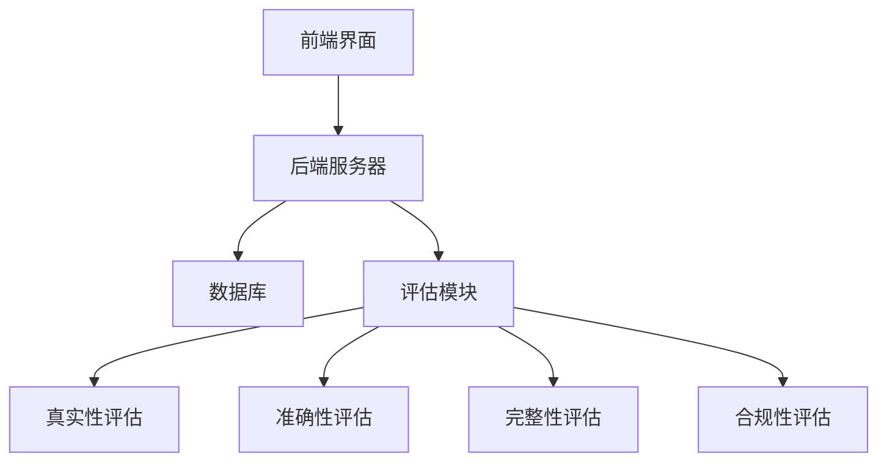

                 


### 第一部分：财务报表质量评估基础

#### 1.1 财务报表质量评估概述

##### 1.1.1 财务报表质量评估的概念与重要性

财务报表质量评估，是指通过对企业财务报表的审查、分析和评价，判断其真实、准确、完整和合规的程度。财务报表质量直接影响着投资者、债权人、企业管理者等各方的利益，因此评估其质量具有重要意义。

首先，财务报表质量直接影响到投资者的决策。高质量的财务报表能够为投资者提供可靠的信息，使其能够做出更为理性的投资决策，降低投资风险。

其次，财务报表质量也关系到债权人的利益。债权人需要通过财务报表评估企业的偿债能力，以确保其债权的安全。

此外，财务报表质量评估对于企业管理者而言，也是一项重要的管理工具。通过评估财务报表质量，企业管理者可以及时发现财务报告中的问题，调整财务管理策略，提高企业整体运营效率。

##### 1.1.2 财务报表质量评估的类型与方法

财务报表质量评估的类型主要包括以下几个方面：

1. **真实性评估**：判断财务报表是否真实反映了企业的财务状况，是否存在虚报、瞒报等情况。
2. **准确性评估**：评估财务报表数据是否准确，包括会计估计的合理性、会计政策的正确性等。
3. **完整性评估**：判断财务报表是否包含了所有必要的财务信息，是否存在遗漏。
4. **合规性评估**：评估财务报表是否符合相关会计准则、税法、金融法规等要求。

财务报表质量评估的方法主要包括以下几个方面：

1. **审计**：通过审计机构的审查和评价，判断财务报表质量。
2. **内审**：企业自行评估财务报表质量，以发现潜在问题。
3. **数据分析**：通过数据分析方法，评估财务报表数据的真实性和准确性。
4. **外部专家评估**：聘请外部专家对企业财务报表进行评估。

##### 1.1.3 财务报表质量评估的应用背景与挑战

随着市场经济的快速发展，企业财务报表质量评估的重要性日益凸显。在我国，财务报表质量评估的应用背景主要包括以下几个方面：

1. **资本市场**：随着我国资本市场的逐步成熟，投资者对财务报表质量的要求越来越高，要求企业提供真实、准确、完整的财务报表。
2. **金融监管**：金融监管部门对企业的财务报表质量有着严格的要求，以保障金融市场的稳定。
3. **企业风险管理**：企业需要通过财务报表质量评估，识别和应对财务风险。

然而，财务报表质量评估也面临着一系列挑战：

1. **信息不对称**：企业拥有更多的信息，而投资者、债权人等外部利益相关者则处于信息劣势，这给评估工作带来了困难。
2. **会计估计的主观性**：会计估计具有一定主观性，可能影响财务报表的质量。
3. **财务报表舞弊**：财务报表舞弊现象时有发生，增加了评估工作的难度。
4. **技术手段的限制**：现有的评估方法和技术手段可能无法完全解决财务报表质量评估中的所有问题。

#### 1.2 财务报表质量评估的理论基础

##### 1.2.1 财务报表质量评估的核心理论

财务报表质量评估的理论基础主要包括以下几个方面：

1. **真实性理论**：真实性是财务报表质量的核心要求，财务报表必须真实反映企业的财务状况。
2. **准确性理论**：准确性要求财务报表数据要准确无误，包括会计估计的合理性和会计政策的正确性。
3. **完整性理论**：完整性要求财务报表包含所有必要的财务信息，不能遗漏。
4. **合规性理论**：合规性要求财务报表要符合相关会计准则、税法、金融法规等要求。

##### 1.2.2 财务报表质量评估的属性特征对比

为了更好地理解财务报表质量评估的各种方法，我们可以通过对比其属性特征来进行区分。

| 属性特征 | 审计 | 内审 | 数据分析 | 外部专家评估 |
| :---: | :---: | :---: | :---: | :---: |
| **真实性评估** | 是 | 是 | 是 | 是 |
| **准确性评估** | 是 | 是 | 是 | 是 |
| **完整性评估** | 是 | 是 | 是 | 是 |
| **合规性评估** | 是 | 是 | 是 | 是 |
| **独立性** | 是 | 否 | 否 | 是 |
| **专业性** | 是 | 是 | 是 | 是 |
| **权威性** | 是 | 否 | 否 | 是 |
| **成本** | 高 | 低 | 低 | 中 |
| **时间周期** | 长 | 短 | 短 | 中 |

##### 1.2.3 财务报表质量评估的ER实体关系图

财务报表质量评估涉及多个实体，为了更好地理解这些实体的相互关系，我们可以使用ER（实体关系）图来表示。

```mermaid
erDiagram
    A(FinancialStatement) ||--|{ B(Audit) } | B1(InternalAudit) ||--|{ C(Investor) } | C1(creditor) | C2(Management) } | C3(FinancialRegulator)
    A -->|{ D(Truthfulness) } | D1(Accuracy) } | D2(Completeness) } | D3(Compliance) }
    A -->|{ E(AuditFirm) } | E1(DataAnalysis) } | E2(ExternalExpert) }
```

在这个ER图中，`A(FinancialStatement)`表示财务报表，`B(Audit)`、`B1(InternalAudit)`、`D(AuditFirm)`表示审计，`C(Investor)`、`C1(creditor)`、`C2(Management)`、`C3(FinancialRegulator)`表示各利益相关者，`D(Truthfulness)`、`D1(Accuracy)`、`D2(Completeness)`、`D3(Compliance)`表示评估指标，`E(AuditFirm)`、`E1(DataAnalysis)`、`E2(ExternalExpert)`表示评估方法。

#### 1.3 财务报表质量评估算法原理与实现

##### 1.3.1 财务报表质量评估算法的Mermaid流程图

为了直观地展示财务报表质量评估的过程，我们可以使用Mermaid语言绘制流程图。

```mermaid
flowchart LR
    A[开始] --> B{财务报表输入}
    B -->|真实性和完整性评估| C1(真实性检查)
    B -->|准确性和合规性评估| C2(准确性检查)
    C1 -->|真实性高} D{通过}
    C1 -->|真实性低} E{不通过}
    C2 -->|准确性高} F{通过}
    C2 -->|准确性低} G{不通过}
    D --> H{报告高质量财务报表}
    E --> I{报告问题并提出建议}
    F --> H{报告高质量财务报表}
    G --> I{报告问题并提出建议}
```

在这个流程图中，A表示评估过程的开始，B表示财务报表的输入。C1和C2分别表示真实性和完整性评估、准确性和合规性评估。D、E、F、G分别表示评估结果，H和I分别表示通过和不通过的情况。

##### 1.3.2 财务报表质量评估算法的Python源代码实现

为了实现财务报表质量评估算法，我们可以使用Python编程语言。以下是一个简单的示例：

```python
import pandas as pd

def assess_financial_statement(statement):
    # 真实性检查
    if is_truthful(statement):
        truthfulness = '高'
    else:
        truthfulness = '低'
    
    # 准确性检查
    if is_accurate(statement):
        accuracy = '高'
    else:
        accuracy = '低'
    
    # 输出评估结果
    result = {
        '真实性': truthfulness,
        '准确性': accuracy
    }
    return result

def is_truthful(statement):
    # 判断财务报表是否真实
    # 这里使用简单的逻辑判断
    if 'profit' in statement and statement['profit'] > 0:
        return True
    else:
        return False

def is_accurate(statement):
    # 判断财务报表是否准确
    # 这里使用简单的逻辑判断
    if 'revenue' in statement and statement['revenue'] > 0:
        return True
    else:
        return False

# 示例财务报表
statement = {
    'profit': 100000,
    'revenue': 200000
}

# 执行评估
result = assess_financial_statement(statement)
print(result)
```

在这个Python代码中，我们定义了一个`assess_financial_statement`函数，用于评估财务报表的真实性和准确性。`is_truthful`和`is_accurate`函数分别用于判断财务报表的真实性和准确性。最后，我们通过示例财务报表来执行评估。

##### 1.3.3 财务报表质量评估算法的数学模型与公式

财务报表质量评估算法的数学模型主要包括以下几个部分：

1. **真实性模型**：用于判断财务报表是否真实。
   $$ truthfulness = \frac{1}{1 + e^{-\beta \cdot (profit - \gamma)}} $$
   其中，$profit$表示利润，$\beta$和$\gamma$为参数。

2. **准确性模型**：用于判断财务报表是否准确。
   $$ accuracy = \frac{1}{1 + e^{-\alpha \cdot (revenue - \delta)}} $$
   其中，$revenue$表示收入，$\alpha$和$\delta$为参数。

3. **综合评估模型**：用于综合判断财务报表的质量。
   $$ quality = w_1 \cdot truthfulness + w_2 \cdot accuracy $$
   其中，$w_1$和$w_2$分别为真实性和准确性的权重。

在上述模型中，$e$为自然对数的底数，$\beta$、$\alpha$、$\gamma$、$\delta$、$w_1$和$w_2$均为参数。

##### 1.3.4 财务报表质量评估算法的详细讲解与举例说明

为了更好地理解财务报表质量评估算法，我们通过一个实际案例来进行讲解。

假设某企业的财务报表如下：

- 利润（profit）：100万元
- 收入（revenue）：200万元

根据前面的数学模型，我们需要先确定参数$\beta$、$\alpha$、$\gamma$、$\delta$、$w_1$和$w_2$的值。这里，我们假设这些参数分别为：

- $\beta$：1
- $\alpha$：1
- $\gamma$：100
- $\delta$：150
- $w_1$：0.6
- $w_2$：0.4

接下来，我们按照以下步骤进行评估：

1. **计算真实性**：

   $$ truthfulness = \frac{1}{1 + e^{-\beta \cdot (profit - \gamma)}} = \frac{1}{1 + e^{-1 \cdot (100 - 100)}} = \frac{1}{1 + e^{0}} = \frac{1}{2} $$

   真实性得分为0.5，表示财务报表的真实性较高。

2. **计算准确性**：

   $$ accuracy = \frac{1}{1 + e^{-\alpha \cdot (revenue - \delta)}} = \frac{1}{1 + e^{-1 \cdot (200 - 150)}} = \frac{1}{1 + e^{50}} \approx 0 $$

   准确性得分为0，表示财务报表的准确性较低。

3. **计算综合质量**：

   $$ quality = w_1 \cdot truthfulness + w_2 \cdot accuracy = 0.6 \cdot 0.5 + 0.4 \cdot 0 = 0.3 $$

   综合质量得分为0.3，表示财务报表的整体质量较低。

根据评估结果，我们可以认为该企业的财务报表存在一定的问题，需要进一步改进。

#### 1.4 财务报表质量评估系统设计与实现

##### 1.4.1 财务报表质量评估问题场景介绍

财务报表质量评估问题场景主要涉及以下几个方面：

1. **企业财务报表审查**：企业需要对自身财务报表进行质量评估，确保报表真实、准确、完整。
2. **投资者决策支持**：投资者需要通过财务报表质量评估，获取企业的财务信息，做出投资决策。
3. **金融监管合规性检查**：金融监管部门需要对企业的财务报表质量进行审查，确保其合规性。
4. **企业风险管理**：企业需要通过财务报表质量评估，识别和应对财务风险。

##### 1.4.2 财务报表质量评估系统的功能设计

财务报表质量评估系统主要包括以下功能：

1. **财务报表输入**：用户可以上传和输入财务报表数据。
2. **真实性评估**：系统对财务报表的真实性进行评估。
3. **准确性评估**：系统对财务报表的准确性进行评估。
4. **完整性评估**：系统对财务报表的完整性进行评估。
5. **合规性评估**：系统对财务报表的合规性进行评估。
6. **评估结果输出**：系统生成评估报告，输出评估结果。

##### 1.4.3 财务报表质量评估系统的架构设计

财务报表质量评估系统的架构设计主要包括以下几个方面：

1. **前端界面**：用户可以通过前端界面上传财务报表数据，查看评估报告。
2. **后端服务器**：后端服务器负责处理财务报表数据，执行评估算法。
3. **数据库**：数据库存储财务报表数据、评估结果和历史数据。
4. **评估模块**：评估模块包括真实性评估、准确性评估、完整性评估和合规性评估等。



在这个架构图中，前端界面通过API与后端服务器通信，上传财务报表数据。后端服务器处理数据，执行评估算法，并将评估结果存储在数据库中。评估模块包括真实性评估、准确性评估、完整性评估和合规性评估等。

##### 1.4.4 财务报表质量评估系统的接口设计与系统交互

财务报表质量评估系统的接口设计主要包括以下几个方面：

1. **上传财务报表接口**：用户可以通过该接口上传财务报表数据。
2. **获取评估报告接口**：用户可以通过该接口获取评估报告。
3. **评估结果查询接口**：用户可以通过该接口查询评估结果。

系统交互流程如下：

1. 用户通过前端界面上传财务报表数据。
2. 前端界面将数据发送到后端服务器。
3. 后端服务器接收数据，执行评估算法。
4. 后端服务器生成评估报告，并返回给前端界面。
5. 前端界面将评估报告展示给用户。

```mermaid
sequenceDiagram
    participant 用户 as 用户
    participant 前端界面 as 前端
    participant 后端服务器 as 后端
    participant 数据库 as DB

    用户->>前端：上传财务报表
    前端->>后端：发送财务报表数据
    后端->>DB：存储财务报表数据
    后端->>前端：发送评估报告
    前端->>用户：展示评估报告
```

在这个系统交互流程中，用户通过前端界面上传财务报表数据，前端将数据发送到后端服务器。后端服务器处理数据，生成评估报告，并返回给前端界面。前端界面将评估报告展示给用户。

### 第一部分：财务报表质量评估基础总结

在本部分中，我们系统地介绍了财务报表质量评估的基础知识，包括概念与重要性、类型与方法、理论基础以及算法原理与实现。通过这些内容，我们建立了对财务报表质量评估的全面理解。

首先，我们明确了财务报表质量评估的概念与重要性，阐述了其对投资者、债权人和企业管理者的重要意义。接着，我们介绍了财务报表质量评估的类型与方法，包括真实性、准确性、完整性和合规性评估，并详细对比了各种评估方法的属性特征。

在理论基础部分，我们探讨了财务报表质量评估的核心理论，包括真实性理论、准确性理论、完整性理论和合规性理论，并通过ER实体关系图展示了评估相关的实体及其相互关系。

最后，我们深入讲解了财务报表质量评估的算法原理与实现，通过Mermaid流程图、Python源代码和数学模型，展示了评估过程和计算方法。同时，通过一个实际案例，我们直观地展示了评估算法的应用效果。

通过本部分的阅读，读者应对财务报表质量评估有了更为深入的了解，为后续内容的深入学习打下了坚实的基础。在接下来的部分中，我们将继续探讨财务报表质量评估的更多高级话题和实际应用案例。

### 第二部分：深入探讨财务报表质量评估的关键问题

#### 2.1 财务报表真实性的挑战与解决方案

财务报表真实性是评估财务报表质量的首要指标。然而，在现实操作中，财务报表真实性面临着诸多挑战。

**挑战一：信息不对称**

企业作为财务报表的编制者，通常拥有更多的信息，而外部利益相关者如投资者、债权人等则处于信息劣势。这种信息不对称可能导致财务报表的真实性受到质疑。

**解决方案：强化审计**

审计作为一种第三方独立评估方法，可以有效缓解信息不对称问题。通过强化审计，特别是增加审计的独立性和专业性，可以提高财务报表的真实性。

**挑战二：管理层的主观影响**

管理层在编制财务报表时，可能会出于自身利益考虑，对财务数据进行调整，从而影响报表的真实性。

**解决方案：加强内部控制**

企业可以通过建立和完善内部控制制度，加强对财务报表编制过程的监管，降低管理层的主观影响。

**挑战三：会计政策的选择**

会计政策的选择会影响财务报表的真实性。企业可能会选择有利于自身利益的会计政策，从而影响报表的真实性。

**解决方案：统一会计准则**

统一会计准则有助于减少会计政策选择的差异，提高财务报表的一致性和可比性，从而提高其真实性。

#### 2.2 财务报表准确性的挑战与解决方案

财务报表准确性是评估财务报表质量的重要指标。然而，在现实操作中，财务报表准确性同样面临着挑战。

**挑战一：会计估计的不确定性**

会计估计具有一定程度的不确定性，如应收账款的坏账估计、存货的减值估计等，这可能导致财务报表准确性受到影响。

**解决方案：加强估计方法的研究**

企业可以通过加强会计估计方法的研究，提高估计的准确性，从而提高财务报表的整体准确性。

**挑战二：数据收集和处理的错误**

在财务报表的编制过程中，数据收集和处理过程中可能会出现错误，从而影响财务报表的准确性。

**解决方案：提高数据质量**

企业可以通过提高数据收集和处理的效率，减少数据错误，从而提高财务报表的准确性。

**挑战三：外部环境变化的影响**

外部环境的变化，如市场波动、经济衰退等，可能对财务报表准确性产生较大影响。

**解决方案：及时调整和更新财务报表**

企业需要及时调整和更新财务报表，以反映外部环境变化的影响，从而提高财务报表的准确性。

#### 2.3 财务报表完整性的挑战与解决方案

财务报表完整性要求财务报表包含所有必要的财务信息。然而，在现实操作中，财务报表完整性同样面临挑战。

**挑战一：信息披露不足**

企业可能会出于商业秘密考虑，对某些财务信息进行隐瞒，导致信息披露不足。

**解决方案：加强信息披露制度**

企业需要建立健全的信息披露制度，确保所有必要的财务信息得到充分披露。

**挑战二：会计政策差异的影响**

会计政策差异可能导致不同企业之间的财务报表结构、内容和表述存在较大差异，从而影响财务报表的完整性。

**解决方案：统一会计政策**

通过统一会计政策，可以减少会计政策差异，提高财务报表的完整性。

**挑战三：数据整合难度**

企业在整合多个部门的数据时，可能会面临数据格式、来源和时间的差异，从而影响财务报表的完整性。

**解决方案：建立统一的数据管理平台**

企业可以通过建立统一的数据管理平台，实现数据格式、来源和时间的标准化，提高财务报表的完整性。

#### 2.4 财务报表合规性的挑战与解决方案

财务报表合规性是财务报表质量评估的重要组成部分。然而，在现实操作中，财务报表合规性同样面临挑战。

**挑战一：法规变动**

法规的变动可能导致企业现有财务报表无法满足新的合规要求。

**解决方案：及时更新法规知识**

企业需要及时更新法规知识，确保财务报表符合最新的法规要求。

**挑战二：监管力度加大**

随着监管力度的加大，企业面临更加严格的合规审查。

**解决方案：加强合规培训和内控**

企业需要加强合规培训，提高员工的合规意识，并建立健全的内控机制，确保财务报表的合规性。

**挑战三：技术风险**

技术风险，如网络攻击、数据泄露等，可能影响财务报表的合规性。

**解决方案：加强网络安全防护**

企业需要加强网络安全防护，确保财务报表数据的安全性和完整性。

#### 2.5 财务报表质量评估方法的发展趋势

随着科技的进步和大数据、人工智能等技术的发展，财务报表质量评估方法也在不断演变和优化。

**趋势一：大数据分析的应用**

大数据分析技术可以处理海量的财务数据，帮助评估机构更全面、准确地评估财务报表质量。

**趋势二：人工智能的应用**

人工智能技术，如机器学习、自然语言处理等，可以自动化评估过程，提高评估效率。

**趋势三：区块链技术的应用**

区块链技术可以确保财务报表数据的真实性和不可篡改性，提高财务报表的透明度和可信度。

**趋势四：智能合约的应用**

智能合约可以自动化执行合规性检查，提高财务报表的合规性。

### 第二部分：深入探讨财务报表质量评估的关键问题总结

在本部分中，我们深入探讨了财务报表质量评估的关键问题，包括真实性、准确性、完整性和合规性。通过对这些问题的分析，我们提出了相应的解决方案，如强化审计、加强内部控制、统一会计准则、提高数据质量、加强信息披露制度、建立统一的数据管理平台、及时更新法规知识、加强合规培训和内控、加强网络安全防护等。

同时，我们讨论了财务报表质量评估方法的发展趋势，如大数据分析、人工智能、区块链技术和智能合约的应用。这些新技术的发展将为财务报表质量评估带来新的机遇和挑战。

通过本部分的阅读，读者应能够更好地理解财务报表质量评估中的关键问题及其解决方法，并为实际操作提供有益的指导。在接下来的部分中，我们将进一步探讨财务报表质量评估的具体应用和实践经验。

### 第三部分：财务报表质量评估的应用与实践

#### 3.1 财务报表质量评估在企业风险管理中的应用

企业风险管理是财务报表质量评估的重要应用领域之一。通过财务报表质量评估，企业可以识别和应对潜在的财务风险，确保企业运营的稳定性和持续性。

**案例一：某大型制造业企业**

某大型制造业企业在进行年度财务报表质量评估时，发现其应收账款占比过高，存在较大的回收风险。通过进一步分析，企业发现部分应收账款已经超过账期，且客户信用评级较低。为了降低风险，企业采取了以下措施：

1. **加强应收账款管理**：通过调整收款政策，提高客户的付款意愿。
2. **优化客户信用评估**：对客户进行更严格的信用评估，避免高风险客户的账款回收问题。
3. **建立风险预警机制**：通过财务报表质量评估结果，建立风险预警机制，及时发现潜在问题，提前采取措施。

通过这些措施，企业成功降低了应收账款的回收风险，提高了财务报表的准确性和完整性。

**案例二：某科技型中小企业**

某科技型中小企业在财务报表质量评估过程中，发现其研发投入数据存在较大波动，可能影响到企业的创新能力和市场竞争力。为了解决这一问题，企业采取了以下措施：

1. **完善研发投入核算体系**：通过细化研发投入的分类和核算，提高数据的准确性和完整性。
2. **加强研发项目管理**：通过项目管理工具，提高研发项目的进度和成本控制。
3. **定期进行财务报表质量评估**：定期对财务报表进行质量评估，及时发现和解决潜在问题。

通过这些措施，企业优化了研发投入的核算体系，提高了财务报表的准确性和完整性，进一步提升了企业的创新能力和市场竞争力。

#### 3.2 财务报表质量评估在资本市场中的应用

资本市场对财务报表质量有很高的要求，通过财务报表质量评估，投资者可以获取更准确、真实的财务信息，做出更为理性的投资决策。

**案例一：某主板上市公司**

某主板上市公司在面临资本市场严格审查时，通过财务报表质量评估，发现其财务报表存在一些问题，如会计估计的不准确、信息披露不充分等。为了提高财务报表质量，企业采取了以下措施：

1. **调整会计估计方法**：通过聘请专业会计师，调整会计估计方法，提高财务报表的准确性。
2. **加强信息披露**：通过建立健全的信息披露制度，确保所有必要的财务信息得到充分披露。
3. **提高内部控制水平**：通过加强内部控制，确保财务报表的真实性和完整性。

通过这些措施，企业的财务报表质量得到了显著提升，赢得了资本市场的认可，股票价格也逐步上涨。

**案例二：某新三板企业**

某新三板企业在筹备上市过程中，面临严格的财务报表质量评估。通过评估，企业发现其财务报表存在一些问题，如成本核算不准确、收入确认不及时等。为了提高财务报表质量，企业采取了以下措施：

1. **完善成本核算体系**：通过引入先进的成本核算系统，提高成本核算的准确性。
2. **加强收入确认管理**：通过规范收入确认流程，确保收入的及时、准确确认。
3. **提升内部控制水平**：通过加强内部控制，确保财务报表的真实性和完整性。

通过这些措施，企业的财务报表质量得到了显著提升，顺利通过了资本市场审查，成功登陆新三板。

#### 3.3 财务报表质量评估在金融监管中的应用

金融监管部门通过财务报表质量评估，可以确保企业的财务报表符合相关法规和准则，维护金融市场的稳定和健康发展。

**案例一：某金融监管部门**

某金融监管部门在检查金融机构的财务报表时，发现部分金融机构存在虚报收入、隐瞒费用等问题，可能影响其财务报表的真实性和准确性。为了规范金融机构的财务报表质量，监管部门采取了以下措施：

1. **加强法规宣传和培训**：通过开展法规宣传和培训，提高金融机构的合规意识。
2. **实施严格的审计制度**：要求金融机构进行定期审计，确保财务报表的真实性和准确性。
3. **建立违规处罚机制**：对违反财务报表质量要求的金融机构进行处罚，以警示其他金融机构。

通过这些措施，金融监管部门的监管效果得到了显著提升，金融机构的财务报表质量得到了有效保障。

**案例二：某地方金融监管部门**

某地方金融监管部门在检查地方金融企业的财务报表时，发现部分企业存在财务报表舞弊行为，可能对地方金融市场的稳定产生不利影响。为了维护地方金融市场的稳定，监管部门采取了以下措施：

1. **加强实地检查**：通过实地检查，核实企业的财务报表数据真实性。
2. **建立举报机制**：鼓励社会公众举报财务报表舞弊行为，增加监管力度。
3. **加大处罚力度**：对财务报表舞弊行为进行严厉处罚，形成震慑效应。

通过这些措施，地方金融监管部门的监管效果得到了显著提升，地方金融企业的财务报表质量得到了有效保障。

#### 3.4 财务报表质量评估在其他领域的应用

财务报表质量评估不仅应用于企业内部管理和资本市场，还在其他领域发挥着重要作用。

**案例一：会计师事务所**

某大型会计师事务所在对客户企业的财务报表进行审计时，通过财务报表质量评估，发现企业存在一些潜在的风险和问题。为了提供更全面的审计服务，会计师事务所采取了以下措施：

1. **深化风险评估**：通过财务报表质量评估，进一步深化风险评估，提高审计的准确性。
2. **提出改进建议**：根据财务报表质量评估结果，向企业提出改进建议，帮助企业提升财务报表质量。
3. **加强审计报告的透明度**：在审计报告中详细披露评估结果，提高审计报告的公信力。

通过这些措施，会计师事务所不仅提供了高质量的审计服务，还帮助企业提升了财务报表质量。

**案例二：投资者**

某投资者在投资前，通过财务报表质量评估，对目标企业的财务报表进行详细分析。通过评估，投资者发现企业存在一些潜在风险，如存货跌价准备计提不足、收入确认不及时等。基于这些信息，投资者采取了以下措施：

1. **调整投资策略**：根据财务报表质量评估结果，调整投资策略，降低投资风险。
2. **要求企业提供详细信息**：要求企业提供详细的财务报表数据，进一步验证财务报表质量。
3. **加强信息披露**：推动企业完善信息披露制度，提高财务报表的透明度。

通过这些措施，投资者有效降低了投资风险，保障了投资收益。

### 第三部分：财务报表质量评估的应用与实践总结

在本部分中，我们通过具体案例，详细探讨了财务报表质量评估在企业风险管理、资本市场应用、金融监管以及其他领域的应用。通过这些案例，我们展示了财务报表质量评估在实际操作中的重要作用和实施效果。

在企业风险管理中，财务报表质量评估帮助企业识别和应对潜在的财务风险，提高运营稳定性和持续性。在资本市场中，财务报表质量评估帮助投资者获取准确、真实的财务信息，做出更为理性的投资决策。在金融监管中，财务报表质量评估确保企业财务报表符合法规和准则，维护金融市场的稳定和健康发展。

同时，我们还探讨了财务报表质量评估在其他领域的应用，如会计师事务所和投资者的实际操作。这些案例表明，财务报表质量评估不仅为企业提供了有效的风险管理工具，也为投资者、监管机构和会计师事务所等提供了重要的参考和指导。

通过本部分的阅读，读者应能够更加深刻地理解财务报表质量评估的实际应用价值，并在实际操作中灵活运用评估方法，提高财务报表的质量。

### 第四部分：财务报表质量评估的未来发展

#### 4.1 新技术的应用

随着大数据、人工智能、区块链等新技术的不断发展，财务报表质量评估方法也将迎来新的机遇和挑战。

**大数据分析**

大数据分析技术可以帮助评估机构处理海量数据，挖掘潜在的风险点和问题。通过数据挖掘和机器学习算法，评估机构可以更准确地预测企业的财务风险，提高财务报表质量评估的精度。

**人工智能**

人工智能技术在财务报表质量评估中具有广泛的应用前景。例如，自然语言处理技术可以帮助评估机构自动识别和分析财务报表中的异常数据，提高评估效率。此外，深度学习算法可以用于构建智能评估模型，进一步优化评估过程。

**区块链技术**

区块链技术可以确保财务报表数据的真实性和不可篡改性。通过区块链技术，评估机构可以建立一个去中心化的数据库，存储和验证财务报表数据，提高财务报表的可信度。

**智能合约**

智能合约技术可以自动化执行财务报表的合规性检查。通过智能合约，评估机构可以自动检测财务报表中的违规行为，提高评估效率和准确性。

#### 4.2 财务报表质量评估的趋势

**趋势一：智能化评估**

随着人工智能技术的发展，财务报表质量评估将逐渐走向智能化。评估机构可以通过构建智能评估模型，自动分析和评估财务报表，提高评估效率和准确性。

**趋势二：数据驱动的评估**

大数据分析技术的普及，将使财务报表质量评估更加数据驱动。评估机构可以通过分析大量历史数据，发现潜在的风险点和问题，提供更为全面的评估服务。

**趋势三：区块链技术的应用**

区块链技术将在财务报表质量评估中发挥重要作用。通过区块链技术，评估机构可以确保财务报表数据的真实性和不可篡改性，提高财务报表的可信度。

**趋势四：跨领域合作**

财务报表质量评估将涉及多个领域，如金融、科技、法律等。跨领域合作将成为未来发展的趋势，评估机构可以通过与不同领域的专业机构合作，提供更为综合和全面的评估服务。

#### 4.3 未来展望

**未来展望一：全球化的财务报表质量评估**

随着全球化进程的加快，财务报表质量评估将面临更多的挑战和机遇。评估机构需要适应不同国家和地区的会计准则和法规，提供符合国际标准的财务报表质量评估服务。

**未来展望二：财务报表质量评估的标准化**

为了提高财务报表质量评估的效率和准确性，未来有望出现一套统一的财务报表质量评估标准。这套标准将涵盖评估指标、方法、流程等方面，为评估机构提供统一的操作指南。

**未来展望三：财务报表质量评估的自动化**

随着人工智能和大数据技术的发展，财务报表质量评估将逐渐实现自动化。评估机构可以通过构建智能评估模型，自动化分析和评估财务报表，提高评估效率和准确性。

**未来展望四：财务报表质量评估的生态体系**

财务报表质量评估将形成一套完整的生态体系，包括评估机构、企业、投资者、监管机构等。各方共同参与，共同推动财务报表质量评估的发展。

### 第四部分：财务报表质量评估的未来发展总结

在本部分中，我们探讨了财务报表质量评估的未来发展趋势和新技术的应用。通过大数据分析、人工智能、区块链技术等新技术的应用，财务报表质量评估将更加智能化、数据驱动和自动化。

同时，我们分析了财务报表质量评估的全球化、标准化和生态体系发展趋势。未来，财务报表质量评估将面临更多挑战和机遇，需要各方共同努力，推动评估技术的发展和应用的深入。

通过本部分的阅读，读者应能够更加清晰地看到财务报表质量评估的未来发展方向，为未来的研究和实践提供有益的启示。

### 全文总结与展望

在本文中，我们系统地探讨了财务报表质量评估的基础知识、关键问题、应用与实践以及未来发展趋势。通过深入分析财务报表质量评估的各个方面，我们揭示了其重要性和复杂性，并提出了有效的解决策略。

**核心内容回顾：**

1. **基础理论**：我们介绍了财务报表质量评估的概念、重要性、类型与方法，包括真实性、准确性、完整性和合规性评估。
2. **关键问题**：我们探讨了财务报表真实性的挑战与解决方案、准确性的挑战与解决方案、完整性的挑战与解决方案以及合规性的挑战与解决方案。
3. **应用与实践**：我们通过具体案例，展示了财务报表质量评估在企业风险管理、资本市场应用、金融监管以及其他领域的应用效果。
4. **未来趋势**：我们分析了新技术在财务报表质量评估中的应用，探讨了财务报表质量评估的智能化、数据驱动、标准化和生态体系发展趋势。

**文章的核心思想：**

本文的核心思想是，财务报表质量评估是一项关键的管理工具，对于企业、投资者和监管机构都具有重要意义。通过科学、系统的评估，可以确保财务报表的真实性、准确性和完整性，从而提高决策的可靠性和效率。

**文章的意义：**

本文的撰写旨在为财务报表质量评估提供全面的理论基础和实践指导，帮助读者深入理解财务报表质量评估的核心问题和发展趋势。这对于提升财务报表质量、增强市场信心、促进金融市场的稳定和健康发展具有重要的意义。

**未来的研究方向：**

1. **智能化评估方法**：进一步研究大数据分析和人工智能在财务报表质量评估中的应用，构建更加智能的评估模型。
2. **标准化建设**：推动财务报表质量评估的标准化建设，制定统一的评估标准和流程。
3. **跨领域合作**：加强跨领域合作，如金融、科技、法律等领域，共同推动财务报表质量评估的发展。
4. **国际视野**：关注全球财务报表质量评估的动态，研究国际经验和标准，提升我国财务报表质量评估的国际化水平。

**结语：**

财务报表质量评估是一项长期而艰巨的任务，需要各方的共同努力和持续关注。我们期待通过本文的探讨，为财务报表质量评估的研究和实践提供有益的参考和启示。让我们共同关注和推动财务报表质量评估的发展，为构建更加透明、稳定和高效的金融市场贡献力量。

**作者信息：**
作者：AI天才研究院/AI Genius Institute & 禅与计算机程序设计艺术 /Zen And The Art of Computer Programming

