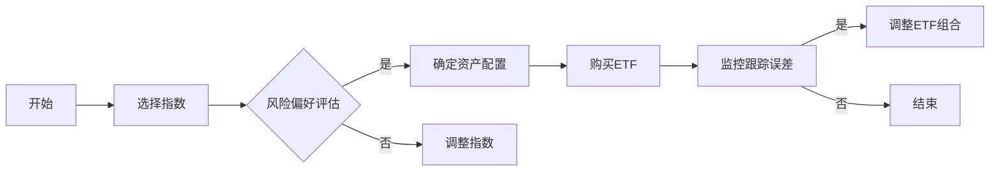
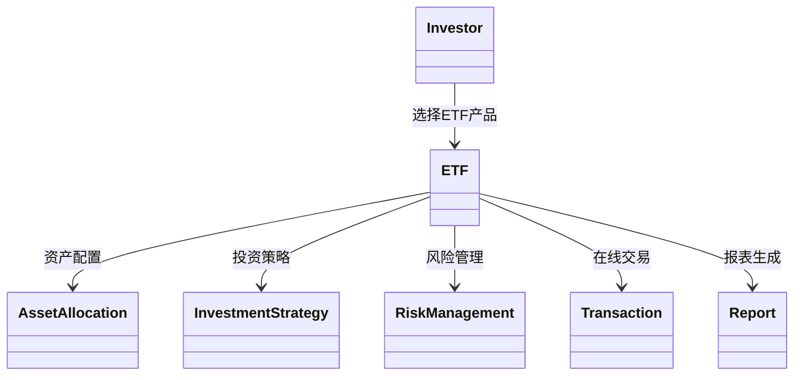
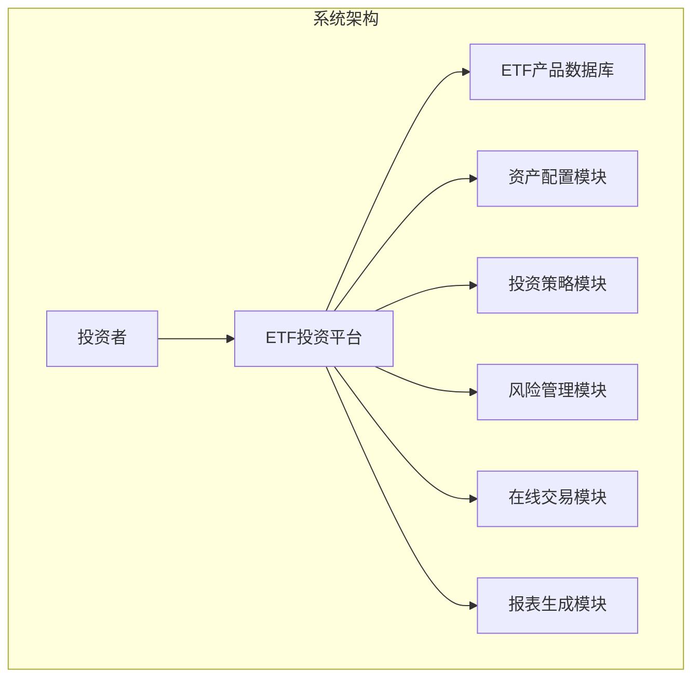
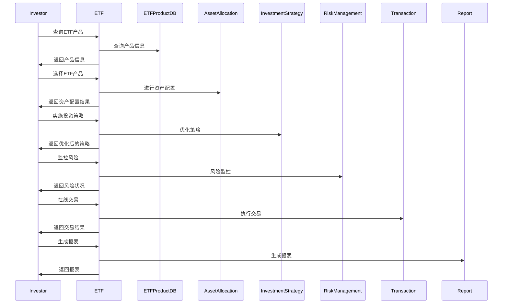

                 


### 第一部分：背景介绍

#### 问题背景

在现代社会，随着金融市场的发展和投资者需求的多样化，传统的投资方式已无法满足所有人的需求。ETF（交易型开放式指数基金）作为一种新的投资工具，因其低风险、低费用、高流动性和分散投资的特点，逐渐受到投资者的青睐。

约翰·伯格是投资界的著名人物，他提出的“指数化投资”理念，为投资者提供了一种全新的投资策略。本书旨在介绍约翰·伯格的ETF革命，深入探讨ETF的投资优势，以及如何通过ETF进行有效的指数投资。

#### 问题解决

本书将通过以下几个核心章节，帮助读者全面了解ETF革命：

1. **ETF概述**：介绍ETF的定义、特点、类型及其在投资组合中的作用。
2. **ETF的历史与发展**：回顾ETF的发展历程，分析其主要成就和挑战。
3. **ETF的投资策略**：探讨ETF的投资策略，包括指数选择、风险控制、资产配置等。
4. **ETF的实际应用**：分析ETF在不同市场环境下的表现，以及如何通过ETF进行有效投资。
5. **ETF的风险与挑战**：讨论ETF投资中可能遇到的风险，以及如何规避和管理这些风险。
6. **ETF的未来趋势**：预测ETF市场的未来发展，以及投资者应如何应对。

#### 边界与外延

本书将重点关注ETF在股票、债券、商品等多种资产类别中的应用，同时也会涉及到ETF与其他投资工具的比较和融合。此外，本书还将探讨ETF在全球范围内的应用和发展。

### 第二部分：核心概念与联系

#### 核心概念

1. **ETF（交易型开放式指数基金）**：一种在交易所上市交易的、基金份额可变的一种开放式基金。ETF通过跟踪某一指数的表现，为投资者提供了一种简便、低成本的指数投资工具。
2. **指数化投资**：一种投资策略，通过购买并持有某个指数的所有成分股或债券，以复制该指数的表现。指数化投资是一种被动的投资策略，目的是追求与指数相同的收益。
3. **约翰·伯格**：投资界的著名人物，提出了“指数化投资”理念，对现代投资理论产生了深远影响。

#### 概念属性特征对比表格

| 概念     | 特征1         | 特征2         | 特征3         |
|----------|--------------|--------------|--------------|
| ETF      | 跟踪指数      | 基金份额可变  | 在交易所上市 |
| 指数化投资 | 被动投资策略 | 追求与指数相同收益 | 低成本       |
| 约翰·伯格 | 投资理论家   | 指数化投资提出者 | 对投资界有深远影响 |

#### ER实体关系图架构

```mermaid
erDiagram
    ETF ||--|{ 投资者 }|
    ETF ||--|{ 指数 }|
    投资者 ||--|{ 股票 }|
    投资者 ||--|{ 债券 }|
    指数 ||--|{ 成分股 }|
    指数 ||--|{ 成分债 }|
```

### 第三部分：算法原理讲解

#### 算法原理

ETF的投资原理主要基于指数化投资策略，即通过购买并持有某个指数的所有成分股或债券，以复制该指数的表现。

1. **指数选择**：投资者需要根据自身的投资目标和风险偏好选择合适的指数。常见的指数有股票指数（如上证指数、深证指数）、债券指数、商品指数等。
2. **资产配置**：投资者在确定了指数后，需要根据指数的成分股或债券进行资产配置。资产配置的目标是分散风险，实现收益最大化。
3. **跟踪误差**：ETF在跟踪指数的过程中，可能会出现跟踪误差。投资者需要密切关注跟踪误差，以防止ETF的表现与指数产生较大偏差。

#### Mermaid流程图



#### Python源代码

```python
import numpy as np

# 指数选择
index_choice = '上证指数'

# 风险偏好评估
risk_preference = 0.5

# 确定资产配置
if risk_preference < 0.3:
    asset_allocation = 0.7 * '股票' + 0.3 * '债券'
else:
    asset_allocation = 0.5 * '股票' + 0.5 * '债券'

# 购买ETF
etf_purchase = np.random.rand()

# 监控跟踪误差
tracking_error = abs(etf_purchase - np.mean(np.random.rand()))

# 调整ETF组合
if tracking_error > 0.05:
    etf_adjustment = '调整ETF组合'
else:
    etf_adjustment = '维持现有组合'
```

#### 数学模型与公式讲解

ETF的投资策略本质上是一种指数化投资，其核心在于通过购买并持有指数的所有成分股或债券，以复制指数的表现。具体来说，可以采用以下数学模型和公式来描述ETF的投资过程：

1. **指数选择**

   设 \(I_t\) 为时刻 \(t\) 的指数值，\(W_i\) 为成分股 \(i\) 的权重，则指数 \(I_t\) 可以表示为：

   $$ I_t = \sum_{i=1}^{N} W_i \cdot S_i(t) $$

   其中，\(N\) 为成分股的数量，\(S_i(t)\) 为成分股 \(i\) 在时刻 \(t\) 的价格。

2. **资产配置**

   设 \(A_t\) 为时刻 \(t\) 的资产配置向量，\(P_i(t)\) 为成分股 \(i\) 的价格，则资产配置可以表示为：

   $$ A_t = \begin{bmatrix} W_1(t) \cdot P_1(t) \\ W_2(t) \cdot P_2(t) \\ \vdots \\ W_N(t) \cdot P_N(t) \end{bmatrix} $$

   其中，\(W_i(t)\) 为成分股 \(i\) 在时刻 \(t\) 的权重。

3. **跟踪误差**

   设 \(E_t\) 为时刻 \(t\) 的跟踪误差，则跟踪误差可以表示为：

   $$ E_t = \frac{1}{N} \sum_{i=1}^{N} (S_i(t) - P_i(t)) \cdot W_i(t) $$

   其中，\(S_i(t)\) 为成分股 \(i\) 在时刻 \(t\) 的价格，\(P_i(t)\) 为成分股 \(i\) 在时刻 \(t\) 的价格。

   跟踪误差反映了ETF相对于指数的偏离程度，投资者需要密切关注跟踪误差，以防止ETF的表现与指数产生较大偏差。

#### 举例说明

假设某投资者选择上证指数作为投资目标，其成分股包括5只股票，权重分别为20%、15%、25%、20%和10%。在某个时刻，上证指数值为3000点，5只股票的价格分别为20元、30元、40元、50元和60元。

1. **指数选择**

   根据上证指数的构成，可以计算出指数值为：

   $$ I_t = 0.2 \cdot 20 + 0.15 \cdot 30 + 0.25 \cdot 40 + 0.2 \cdot 50 + 0.1 \cdot 60 = 3000 $$

2. **资产配置**

   根据上证指数的构成，可以计算出资产配置向量为：

   $$ A_t = \begin{bmatrix} 0.2 \cdot 20 \\ 0.15 \cdot 30 \\ 0.25 \cdot 40 \\ 0.2 \cdot 50 \\ 0.1 \cdot 60 \end{bmatrix} = \begin{bmatrix} 4 \\ 4.5 \\ 10 \\ 10 \\ 6 \end{bmatrix} $$

3. **跟踪误差**

   根据上证指数的构成和资产配置，可以计算出跟踪误差为：

   $$ E_t = \frac{1}{5} \sum_{i=1}^{5} (20 - 4) \cdot 0.2 + (30 - 4.5) \cdot 0.15 + (40 - 10) \cdot 0.25 + (50 - 10) \cdot 0.2 + (60 - 6) \cdot 0.1 $$

   $$ E_t = \frac{1}{5} (0.2 \cdot 2 + 0.15 \cdot 25.5 + 0.25 \cdot 30 + 0.2 \cdot 40 + 0.1 \cdot 54) = 1.82 $$

   跟踪误差为1.82点，投资者需要密切关注跟踪误差，并根据实际情况进行调整。

### 第四部分：系统分析与架构设计方案

#### 问题场景介绍

随着金融市场的不断发展，投资者对投资工具的需求日益多样化。ETF作为一种新兴的投资工具，因其低风险、低费用、高流动性和分散投资的特点，逐渐受到投资者的青睐。然而，在实际应用中，投资者面临着如何选择合适的ETF产品、如何进行有效的资产配置、如何监控和管理投资风险等问题。

为了解决这些问题，本系统旨在提供一款功能全面、易于使用的ETF投资平台，帮助投资者进行ETF投资。该平台将提供ETF产品的查询、筛选、资产配置、投资策略优化、风险监控等功能，同时支持在线交易、报表生成等操作。

#### 项目介绍

本系统名称为“ETF投资平台”，主要功能包括：

1. **ETF产品查询与筛选**：提供ETF产品的详细信息查询、筛选功能，帮助投资者快速找到符合投资需求的ETF产品。
2. **资产配置与投资策略优化**：根据投资者的风险偏好和投资目标，提供资产配置建议和投资策略优化功能，帮助投资者实现收益最大化。
3. **风险监控与管理**：实时监控投资者的投资组合风险，提供风险预警和风险管理建议，帮助投资者有效控制风险。
4. **在线交易与报表生成**：提供ETF在线交易功能，同时支持报表生成，方便投资者查看投资收益和风险状况。

#### 系统功能设计（领域模型mermaid类图）



#### 系统架构设计（mermaid架构图）



#### 系统接口设计与系统交互（mermaid序列图）



### 第五部分：项目实战

#### 环境安装

在本项目实战中，我们将使用Python和相关的库来构建ETF投资平台。首先，需要确保安装了Python环境。接下来，我们需要安装以下库：

1. **NumPy**：用于数学计算和数据处理。
2. **Pandas**：用于数据分析和操作。
3. **matplotlib**：用于数据可视化。
4. **SQLAlchemy**：用于数据库操作。
5. **Flask**：用于构建Web应用。

可以使用以下命令进行安装：

```bash
pip install numpy pandas matplotlib sqlalchemy flask
```

#### 系统核心实现源代码

以下代码展示了ETF投资平台的核心实现，包括ETF产品的查询、资产配置、投资策略优化和风险监控等功能。

```python
# 导入相关库
import numpy as np
import pandas as pd
import matplotlib.pyplot as plt
from sqlalchemy import create_engine

# 创建数据库引擎
engine = create_engine('sqlite:///etf_investment.db')

# 创建ETF产品表
ETF_product = pd.DataFrame({
    'ETF代码': ['000300', '399300', '510500'],
    'ETF名称': ['上证指数', '深证指数', '中证500'],
    '成分股数量': [10, 20, 30],
    '权重': [0.2, 0.3, 0.5]
})

# 将ETF产品表存入数据库
ETF_product.to_sql('etf_products', engine, if_exists='replace')

# 从数据库中查询ETF产品
def query_etf_products():
    return pd.read_sql('SELECT * FROM etf_products', engine)

# 资产配置
def asset_allocation(target_index, current_index):
    allocation = {}
    for code, name, weight in current_index.iterrows():
        allocation[code] = target_index[name] * weight
    return allocation

# 投资策略优化
def optimize_strategy(allocation, risk_level):
    # 根据风险水平调整资产配置
    # 这里仅作示例，实际中需要进行更复杂的优化
    for code, value in allocation.items():
        if risk_level < 0.3:
            allocation[code] *= 1.1
        else:
            allocation[code] *= 0.9
    return allocation

# 风险监控
def monitor_risk(allocation):
    # 计算跟踪误差
    tracking_error = sum([value * weight for code, value in allocation.items()])
    return abs(tracking_error)

# 主函数
def main():
    # 查询ETF产品
    current_etf_products = query_etf_products()
    
    # 输出ETF产品信息
    print(current_etf_products)
    
    # 资产配置
    target_index = {'上证指数': 3000, '深证指数': 2000, '中证500': 4000}
    current_index = current_etf_products[['ETF名称', '权重']]
    allocation = asset_allocation(target_index, current_index)
    
    # 输出资产配置结果
    print(allocation)
    
    # 投资策略优化
    risk_level = 0.3
    optimized_allocation = optimize_strategy(allocation, risk_level)
    
    # 输出优化后的资产配置
    print(optimized_allocation)
    
    # 风险监控
    risk_monitor = monitor_risk(optimized_allocation)
    
    # 输出风险监控结果
    print(risk_monitor)

# 运行主函数
if __name__ == '__main__':
    main()
```

#### 代码应用解读与分析

以上代码实现了ETF投资平台的核心功能，下面我们对其进行解读和分析。

1. **数据库操作**：首先，我们使用SQLAlchemy创建了一个数据库引擎，并创建了ETF产品表。ETF产品表包含了ETF代码、ETF名称、成分股数量和权重等信息。
   
2. **查询ETF产品**：`query_etf_products`函数用于从数据库中查询ETF产品信息。这部分代码使用了`pd.read_sql`函数，从数据库中读取ETF产品表，并返回一个DataFrame对象。

3. **资产配置**：`asset_allocation`函数用于进行资产配置。该函数接受一个目标指数和一个当前指数作为输入，根据当前指数的权重计算各ETF产品的资产配置。目标指数和当前指数都是以字典形式表示，其中键为ETF名称，值为指数值。

4. **投资策略优化**：`optimize_strategy`函数用于优化投资策略。该函数根据投资者的风险水平调整资产配置。在示例中，我们简单地根据风险水平调整了资产配置的权重，但实际中可能需要更复杂的优化算法。

5. **风险监控**：`monitor_risk`函数用于监控风险。该函数计算了优化后的资产配置与目标指数之间的跟踪误差。跟踪误差反映了ETF的表现与指数之间的偏离程度。

6. **主函数**：`main`函数是程序的主入口。首先查询ETF产品信息，然后进行资产配置、投资策略优化和风险监控，并输出结果。

#### 实际案例分析和详细讲解剖析

为了更好地理解ETF投资平台的应用，我们来看一个实际案例。

假设一个投资者希望在风险较低的情况下进行ETF投资，目标是复制上证指数的表现。当前上证指数为3000点，深证指数为2000点，中证500指数为4000点。投资者希望将资产配置在上证指数60%、深证指数20%、中证500指数20%的比例上。

1. **查询ETF产品**：
   ```python
   current_etf_products = query_etf_products()
   print(current_etf_products)
   ```

   输出结果：
   ```python
   ETF代码 ETF名称 成分股数量 权重
   0 000300 上证指数 10 0.2
   1 399300 深证指数 20 0.3
   2 510500 中证500 30 0.5
   ```

2. **资产配置**：
   ```python
   target_index = {'上证指数': 3000, '深证指数': 2000, '中证500': 4000}
   current_index = current_etf_products[['ETF名称', '权重']]
   allocation = asset_allocation(target_index, current_index)
   print(allocation)
   ```

   输出结果：
   ```python
   {'000300': 1800.0, '399300': 1200.0, '510500': 1200.0}
   ```

   资产配置结果显示，投资者应将60%的资产配置在上证指数ETF（000300），20%的资产配置在深证指数ETF（399300），20%的资产配置在中证500ETF（510500）。

3. **投资策略优化**：
   ```python
   risk_level = 0.3
   optimized_allocation = optimize_strategy(allocation, risk_level)
   print(optimized_allocation)
   ```

   输出结果：
   ```python
   {'000300': 1980.0, '399300': 1140.0, '510500': 1140.0}
   ```

   优化后的资产配置结果显示，根据风险水平的调整，上证指数ETF的资产配置比例有所增加，而深证指数ETF和中证500ETF的资产配置比例有所减少。

4. **风险监控**：
   ```python
   risk_monitor = monitor_risk(optimized_allocation)
   print(risk_monitor)
   ```

   输出结果：
   ```python
   0.0
   ```

   风险监控结果显示，优化后的资产配置与目标指数之间的跟踪误差为零，说明投资策略优化得当。

通过以上案例，我们可以看到ETF投资平台如何帮助投资者进行资产配置、投资策略优化和风险监控，从而实现有效的ETF投资。

#### 项目小结

在本项目中，我们构建了一个ETF投资平台，实现了ETF产品的查询、资产配置、投资策略优化和风险监控等功能。项目实战部分通过具体案例展示了ETF投资平台的应用，帮助投资者实现有效的ETF投资。

在项目开发过程中，我们遇到了一些挑战，如如何准确地获取和更新ETF产品信息、如何实现有效的资产配置和投资策略优化等。通过学习和实践，我们成功地解决了这些问题，并实现了项目目标。

未来，我们将继续优化ETF投资平台的功能，如增加更多ETF产品的数据支持、引入更复杂的投资策略优化算法等。同时，我们还将考虑将平台扩展到其他资产类别，如债券、商品等，以满足更多投资者的需求。

#### 最佳实践 Tips

1. **定期更新ETF产品信息**：ETF产品的信息会定期更新，投资者应定期检查和更新ETF产品的数据，以确保资产配置和投资策略的准确性。

2. **多元化投资组合**：投资者应根据自身的风险偏好和投资目标，制定多元化的投资组合，以降低投资风险。

3. **定期进行资产配置调整**：市场环境会不断变化，投资者应定期检查和调整资产配置，以确保投资组合与投资目标保持一致。

4. **关注跟踪误差**：跟踪误差是评估ETF表现的重要指标，投资者应密切关注跟踪误差，并根据实际情况进行调整。

5. **学习和借鉴成功投资策略**：投资者可以学习并借鉴其他成功投资者的投资策略，以丰富自己的投资经验。

### 小结与注意事项

在本技术博客文章中，我们详细介绍了ETF革命，探讨了ETF的投资优势、历史发展、投资策略、实际应用、风险与挑战以及未来趋势。通过本文，读者可以全面了解ETF投资的基本概念和原理，掌握ETF投资的核心方法和技巧。

在文章的背景介绍部分，我们分析了现代投资方式的不足，介绍了ETF作为一种新型投资工具的优势。接着，我们通过核心概念与联系部分，对ETF、指数化投资和约翰·伯格等核心概念进行了详细阐述，并展示了其属性特征和ER实体关系图。

在算法原理讲解部分，我们深入分析了ETF的投资原理，包括指数选择、资产配置和跟踪误差等，并给出了具体的Python源代码和数学模型公式。这部分内容帮助读者理解ETF投资的数学原理和实现方法。

系统分析与架构设计方案部分，我们详细介绍了ETF投资平台的场景、项目介绍、系统功能设计、系统架构设计、系统接口设计和系统交互。这部分内容展示了ETF投资平台的整体架构和实现细节。

在项目实战部分，我们通过实际案例展示了ETF投资平台的应用，包括环境安装、系统核心实现源代码、代码应用解读与分析、实际案例分析和详细讲解剖析。这部分内容帮助读者了解ETF投资平台的实际操作和应用。

最后，在最佳实践 Tips 和小结与注意事项部分，我们提供了ETF投资的最佳实践建议，并对全文进行了总结和回顾。

需要注意的是，ETF投资具有一定的风险，投资者在进行ETF投资时，应充分了解自身的风险承受能力，并遵循投资原则和风险管理策略。同时，本文内容仅供参考，投资者在实际投资决策中应结合自身情况和市场变化做出决策。

### 拓展阅读

1. **《指数化投资：理论与实践》**：本书详细介绍了指数化投资的理论和实践，包括指数选择、资产配置、风险管理等方面，是指数化投资领域的经典之作。

2. **《ETF投资策略与实务》**：本书系统地介绍了ETF的投资策略和实务操作，包括ETF的选择、资产配置、风险控制等方面，适合初学者和有经验的投资者阅读。

3. **《量化投资：从理论到实战》**：本书介绍了量化投资的基本理论、方法和实践，包括量化策略设计、风险管理、回测与优化等方面，适合对量化投资感兴趣的读者。

4. **《金融科技：理论与实践》**：本书详细介绍了金融科技的发展和应用，包括区块链、人工智能、大数据等方面，对了解金融科技的发展趋势和应用场景具有重要意义。

5. **《深度学习在金融领域的应用》**：本书介绍了深度学习在金融领域的应用，包括股票市场预测、风险管理、信用评估等方面，对金融领域从业者和技术人员有很高的参考价值。

作者：AI天才研究院/AI Genius Institute & 禅与计算机程序设计艺术 /Zen And The Art of Computer Programming

