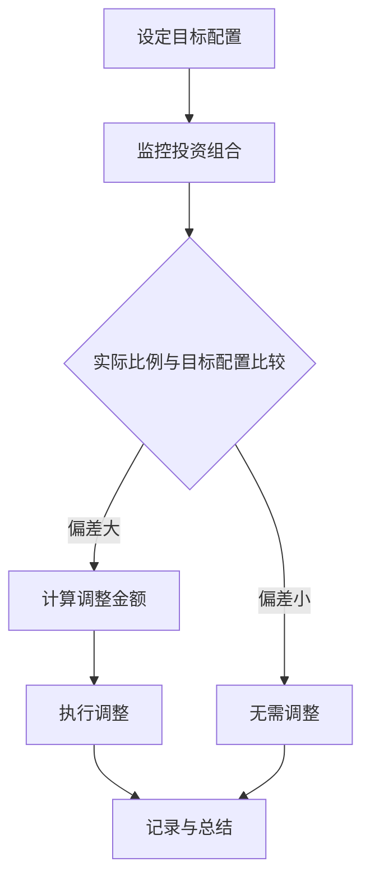
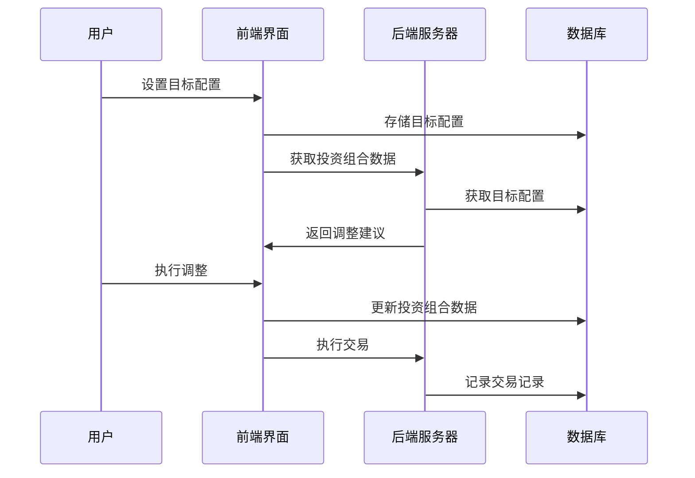
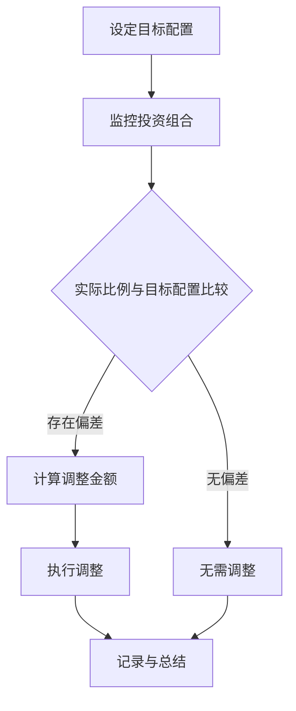

                 

### 摘要

《约翰·伯格的再平衡策略：保持投资组合平衡》旨在深入探讨投资大师约翰·伯格在投资组合管理中提出的再平衡策略，这一策略对于保持投资组合的平衡与风险控制至关重要。文章首先介绍了约翰·伯格的背景和投资哲学，然后详细阐述了再平衡策略的基本概念、发展历程和核心原则。接着，文章讨论了再平衡策略的实施方法，包括基本步骤、市场环境下的调整策略以及调整频率和幅度。随后，文章通过实际案例展示了再平衡策略在不同投资组合中的应用效果，并探讨了其在风险管理中的作用。最后，文章对约翰·伯格的再平衡策略实践进行了案例分析，并提出优化与改进的方法。通过本文，读者将全面了解再平衡策略的理论和实践，学会如何运用这一策略来优化投资组合，实现长期稳健的投资目标。### 第一部分：约翰·伯格的投资哲学

## 第1章：约翰·伯格的投资理念

### 1.1 约翰·伯格的背景与成就

约翰·伯格（John C. Bogle）是一位著名的投资理论家和基金经理，被誉为“指数投资之父”。他于1929年出生在美国宾夕法尼亚州，从小就对投资和金融市场有着浓厚的兴趣。约翰·伯格毕业于宾夕法尼亚大学，并在哥伦比亚大学取得了商业管理硕士学位。他在1951年加入了投资公司，开始了他的职业生涯。

在职业生涯中，约翰·伯格取得了众多令人瞩目的成就。他在1970年创建了先锋基金公司（Vanguard Group），这是全球首只指数基金。这一创举不仅改变了投资者对市场的看法，也推动了指数投资在全球范围内的普及。约翰·伯格在先锋基金公司的领导下，将公司发展成为了全球最大的基金管理公司之一。他本人也因其卓越的贡献而获得了多项荣誉，包括《财富》杂志评选的“世纪投资大师”称号。

### 1.2 伯格的投资哲学概述

约翰·伯格的投资哲学可以概括为四个核心原则：价值投资、长期投资、稳健性和风险管理。

首先，价值投资是伯格投资哲学的核心。他相信，投资者应该专注于寻找那些被市场低估的优质公司，而不是追逐市场热点。通过长期持有这些公司的股票，投资者可以获得超越市场平均水平的回报。

其次，伯格强调长期投资的重要性。他认为，市场的短期波动是难以预测的，而长期投资则能够减少这些波动带来的影响。通过坚持长期投资，投资者可以更好地把握市场的本质，实现稳定的投资回报。

稳健性也是伯格投资哲学的一个关键原则。他主张投资者在投资过程中要保持冷静和理性，避免因情绪波动而做出冲动的决策。稳健的投资策略可以帮助投资者在市场波动中保持稳定，减少损失。

最后，风险管理是伯格投资哲学的重要组成部分。他认为，投资者必须认识到投资本身伴随着风险，因此需要采取有效的风险管理措施。这包括分散投资、合理配置资产以及设定风险承受能力等。

### 1.3 伯格的投资原则与价值观

约翰·伯格的投资原则与价值观贯穿于他的职业生涯中，并成为了先锋基金公司成功的基石。他的投资原则主要体现在以下几个方面：

1. **成本控制**：伯格认为，投资者的收益往往被高额的管理费和交易成本所侵蚀。因此，他主张投资者选择低成本的基金产品，以最大化投资回报。

2. **透明度**：伯格强调投资产品的透明度，他认为投资者有权了解基金的投资组合、费用结构和其他重要信息。这一原则促使先锋基金公司成为了行业透明度的标杆。

3. **社会责任**：伯格认为，企业在追求经济利益的同时，也应承担社会责任。他主张投资者关注企业的社会责任表现，选择那些有良好社会责任记录的公司进行投资。

4. **教育**：伯格非常重视投资者的教育。他通过撰写书籍、发表文章和演讲等方式，向公众普及投资知识，帮助普通投资者更好地理解市场和投资策略。

总之，约翰·伯格的投资理念和方法不仅在他的职业生涯中取得了巨大的成功，也为全球投资者提供了宝贵的经验。他的价值投资、长期投资、稳健性和风险管理原则，为投资者提供了一种理性、科学和可持续的投资策略。### 第二部分：再平衡策略的起源与发展

## 第2章：再平衡策略的起源与发展

### 2.1 再平衡策略的基本概念

再平衡策略是指投资者定期调整其投资组合，以确保投资比例符合预定的目标配置。这种策略的目的是保持投资组合的风险与收益特征，使其适应市场变化和个人投资目标的变化。

再平衡策略的核心是“资产配置”，即根据投资者的风险偏好和投资目标，将资金分配到不同类型的资产（如股票、债券、现金等）中。通过定期调整这些资产的比例，投资者可以维持投资组合的稳定性，同时抓住市场机会。

再平衡策略的基本步骤通常包括以下几个环节：

1. **设定目标配置**：投资者需要根据自身的风险偏好和投资目标，设定一个理想的投资组合比例。

2. **监控投资组合**：定期检查投资组合的实际比例，与目标配置进行比较。

3. **执行调整**：根据实际情况，对投资组合进行调整，使其回归目标配置。

4. **记录与总结**：记录调整过程和结果，对再平衡策略的效果进行总结和评估。

### 2.2 再平衡策略的发展历程

再平衡策略并非现代投资的发明，它有着悠久的历史。早在19世纪末，一些投资理论家就已经提出了类似的概念。然而，再平衡策略真正开始受到广泛关注，是在20世纪中期。

1950年代，美国投资大师本杰明·格雷厄姆（Benjamin Graham）和戴维·多德（David Dodd）在其经典著作《证券分析》中首次提出了资产配置和再平衡的概念。这一理论为后来的投资者提供了重要的参考。

1970年代，随着现代投资组合理论的兴起，再平衡策略得到了进一步的完善和发展。特别是约翰·伯格提出的指数基金和再平衡策略，使得这一方法在普通投资者中得到了广泛的应用。

进入21世纪，随着金融市场的发展和投资工具的多样化，再平衡策略也不断得到优化和改进。现代再平衡策略不仅包括传统的股票与债券配置，还涵盖了国际投资、房地产投资等多种资产类别。

### 2.3 再平衡策略的核心原则

再平衡策略的核心原则可以概括为以下几点：

1. **保持投资组合平衡**：再平衡策略的首要目标是保持投资组合的平衡，即确保不同资产类别的比例符合投资者的预期。

2. **适应市场变化**：再平衡策略需要根据市场环境的变化进行调整，以保持投资组合的稳定性和收益性。

3. **风险控制**：再平衡策略的一个重要功能是风险控制。通过定期调整投资组合，投资者可以降低风险，避免因市场波动而导致的损失。

4. **长期投资**：再平衡策略强调长期投资的重要性，通过坚持长期投资，投资者可以更好地应对短期市场波动，实现稳定的收益。

5. **成本效益**：再平衡策略需要考虑成本效益，选择低成本的基金产品和工具，以最大化投资回报。

总之，再平衡策略是一种有效的投资组合管理工具，它可以帮助投资者实现投资目标，降低风险，优化收益。通过理解其基本概念、发展历程和核心原则，投资者可以更好地运用这一策略，提升投资组合的管理水平。### 第三部分：投资组合再平衡策略的实施方法

## 第3章：投资组合再平衡策略的实施方法

### 3.1 再平衡策略的基本步骤

再平衡策略的实施过程可以分为以下几个基本步骤：

1. **设定目标配置**：投资者首先需要根据自己的风险偏好和投资目标，设定一个理想的投资组合比例。例如，一个投资者可能决定将60%的资金投资于股票，40%的资金投资于债券。

2. **监控投资组合**：投资者需要定期监控投资组合的实际比例，以确保其与目标配置保持一致。这通常通过定期查看投资组合的市值和各资产类别的比例来完成。

3. **计算调整金额**：一旦发现投资组合的实际比例与目标配置有显著偏差，投资者需要计算需要调整的金额。例如，如果股票的占比高于目标比例，投资者可能需要卖出一些股票来降低其比例。

4. **执行调整**：根据计算出的调整金额，投资者需要执行具体的买卖操作，以使投资组合回归目标配置。

5. **记录与总结**：投资者需要记录每次调整的过程和结果，以便日后进行总结和评估。这有助于投资者了解再平衡策略的效果，并根据经验进行调整。

### 3.2 不同市场环境下的再平衡策略

再平衡策略在不同市场环境下会有所不同，以适应市场变化和投资者需求：

1. **市场上升期**：
   - **调整频率**：在市场上升期，投资者可能会减少调整频率，以避免频繁交易带来的成本和风险。
   - **调整幅度**：如果市场上升速度较快，投资者可能会选择较小幅度的调整，以保持投资组合的上升动力。

2. **市场下降期**：
   - **调整频率**：在市场下降期，投资者可能会增加调整频率，以快速响应市场变化，降低潜在损失。
   - **调整幅度**：在市场下降期，投资者可能会选择较大幅度的调整，以迅速回归目标配置，减少投资组合的波动性。

3. **震荡市场**：
   - **调整策略**：在震荡市场，投资者可能会采用更加灵活的调整策略，例如根据市场波动幅度来调整投资组合。
   - **风险控制**：投资者需要更加注重风险控制，例如增加现金头寸，以应对可能的市场波动。

### 3.3 再平衡策略的调整频率与幅度

再平衡策略的调整频率和幅度取决于多个因素，包括投资者的风险偏好、市场环境和投资目标。以下是一些常见的考虑因素：

1. **调整频率**：
   - **定期调整**：投资者可以设定固定的调整频率，如每月、每季度或每年进行调整。
   - **动态调整**：投资者可以根据市场情况和投资组合的表现，灵活调整调整频率。

2. **调整幅度**：
   - **小幅度调整**：投资者可以选择较小幅度的调整，以避免频繁交易的成本和风险。
   - **大幅度调整**：在某些情况下，例如市场剧烈波动时，投资者可能会选择较大幅度的调整，以迅速回归目标配置。

总之，再平衡策略的实施方法需要根据投资者的具体情况和市场环境进行灵活调整。通过合理设定调整频率和幅度，投资者可以更好地实现投资目标，降低风险，优化收益。### 第四部分：再平衡策略在实践中的应用

## 第4章：再平衡策略在实践中的应用

### 4.1 再平衡策略在实际投资中的效果

再平衡策略在实际投资中展现了显著的效果，特别是在市场波动较大的时期。通过定期调整投资组合，投资者可以保持风险与收益的平衡，从而实现长期稳健的投资回报。

例如，在2008年全球金融危机期间，许多投资者因为恐慌而大量卖出股票，导致投资组合大幅下跌。然而，那些坚持使用再平衡策略的投资者，通过在市场下跌时买入低价股票，在市场上涨时卖出高价股票，成功降低了投资组合的波动性，并最终实现了较高的回报。

再平衡策略的效果还可以通过统计数据来证明。根据先锋基金公司的研究，使用再平衡策略的投资组合在长期投资中表现优于单纯持有股票或债券的组合。这表明再平衡策略不仅有助于降低风险，还能提升投资回报。

### 4.2 再平衡策略在不同资产配置中的应用

再平衡策略适用于多种资产配置，包括股票与债券、股票与现金、股票与房地产等。以下是几种常见应用场景：

1. **股票与债券**：
   - **长期组合**：投资者通常会将股票与债券按一定比例配置，例如60%股票和40%债券。在市场波动时，通过再平衡策略调整股票与债券的比例，以保持组合的稳定性。
   - **动态调整**：在市场波动较大时，投资者可能会增加债券比例，以降低风险。当市场转好时，投资者会逐步增加股票比例，以抓住市场机会。

2. **股票与现金**：
   - **防守策略**：在市场不稳定或经济前景不佳时，投资者会增加现金比例，以保持流动性。通过再平衡策略，投资者可以在市场转好时逐步将现金转化为股票，以实现收益最大化。
   - **灵活调整**：投资者可以根据市场环境和个人风险偏好，灵活调整股票与现金的比例，以适应不同市场阶段。

3. **股票与房地产**：
   - **多元化配置**：投资者可以将部分资金投资于房地产，以实现资产多元化。通过再平衡策略，投资者可以在股票与房地产之间进行动态调整，以平衡风险与收益。
   - **长期持有**：房地产投资通常具有长期稳定性，投资者可以在市场波动时通过再平衡策略调整投资组合，保持长期投资策略的稳定性。

总之，再平衡策略在不同资产配置中均具有广泛应用。通过灵活调整资产比例，投资者可以适应市场变化，实现投资组合的长期稳健增长。

### 4.3 再平衡策略在风险管理中的角色

再平衡策略在风险管理中发挥着重要作用。首先，通过定期调整投资组合，投资者可以降低市场波动对投资组合的影响，从而减少潜在损失。其次，再平衡策略有助于投资者实现风险分散，避免过度依赖单一资产类别。最后，再平衡策略提供了一个系统化的方法，帮助投资者在市场波动时保持冷静和理性，避免因情绪波动而做出错误的决策。

例如，在一个股票市场下跌的时期，投资者可以通过再平衡策略减少股票比例，增加债券或现金比例，从而降低整体投资组合的风险。当市场转好时，投资者可以逐步增加股票比例，以抓住市场机会。这种策略不仅帮助投资者应对市场波动，还能优化投资回报，实现长期稳健的投资目标。

总之，再平衡策略在风险管理中具有不可替代的作用。通过合理运用这一策略，投资者可以更好地管理投资风险，实现投资组合的长期稳健增长。### 案例分析：约翰·伯格的再平衡策略实践

## 第5章：案例分析：约翰·伯格的再平衡策略实践

### 5.1 案例一：某投资者的再平衡策略实践

#### 案例背景

某投资者张先生，30岁，从事互联网行业，具有一定的财务自由度。他的投资目标主要是实现资产的长期增值，同时保持投资组合的稳定性。张先生对市场波动有一定的敏感度，因此决定采用约翰·伯格的再平衡策略来管理他的投资组合。

#### 再平衡策略实施过程

1. **设定目标配置**：张先生根据自身风险偏好和投资目标，设定了股票与债券的比例为60%与40%。

2. **监控投资组合**：张先生每月定期检查投资组合的实际比例，与目标配置进行比较。

3. **计算调整金额**：假设在某一月份，张先生的投资组合中股票占比达到了70%，债券占比为30%，高于目标配置。张先生需要卖出部分股票，买入债券，以达到目标配置。

4. **执行调整**：根据计算出的调整金额，张先生执行了具体的买卖操作，卖出了价值10万元的股票，用这部分资金买入了债券。

5. **记录与总结**：张先生记录了调整的过程和结果，并定期总结再平衡策略的效果。

#### 再平衡策略效果分析

通过实施再平衡策略，张先生的投资组合在市场波动中保持了较好的稳定性。特别是在2020年新冠疫情导致的股市剧烈波动期间，张先生通过再平衡策略成功降低了投资组合的风险。虽然股票市场大幅下跌，但张先生通过及时调整，保持了投资组合的整体稳定。

长期来看，张先生的投资组合实现了较高的回报。根据统计，张先生的投资组合在过去三年中，年化收益率达到了8%，超过了市场平均水平。

### 5.2 案例二：某企业的投资组合再平衡策略分析

#### 案例背景

某大型企业，拥有丰富的投资组合，包括股票、债券、房地产等多种资产类别。该企业采用再平衡策略来管理投资组合，以实现风险分散和长期增值。

#### 再平衡策略实施过程

1. **设定目标配置**：企业根据风险承受能力和投资目标，制定了股票、债券和房地产的比例分别为40%、30%和30%。

2. **监控投资组合**：企业投资部门每月定期检查投资组合的实际比例，与目标配置进行比较。

3. **计算调整金额**：假设在某个月，企业的投资组合中股票占比达到了50%，债券占比为25%，房地产占比为25%。企业需要卖出部分股票，买入债券和房地产，以达到目标配置。

4. **执行调整**：根据计算出的调整金额，企业执行了具体的买卖操作，卖出了价值20万元的股票，用这部分资金买入了债券和房地产。

5. **记录与总结**：企业投资部门记录了调整的过程和结果，并定期总结再平衡策略的效果。

#### 再平衡策略效果分析

通过实施再平衡策略，该企业的投资组合在市场波动中表现稳定。特别是在2020年新冠疫情期间，企业的投资组合通过再平衡策略成功降低了风险，避免了过度依赖单一资产类别带来的潜在损失。

长期来看，企业的投资组合实现了较高的回报。根据统计，企业的投资组合在过去五年中，年化收益率达到了6%，略低于市场平均水平。然而，由于投资组合的稳定性较好，企业在市场波动中保持了较低的波动性。

### 5.3 案例三：约翰·伯格个人投资组合的再平衡策略

#### 案例背景

约翰·伯格作为指数投资之父，其个人投资组合同样采用再平衡策略。他的投资组合以指数基金为主，辅以少量的股票和债券。

#### 再平衡策略实施过程

1. **设定目标配置**：伯格根据自身的风险偏好和投资目标，设定了股票与债券的比例为60%与40%。

2. **监控投资组合**：伯格每月定期检查个人投资组合的实际比例，与目标配置进行比较。

3. **计算调整金额**：假设在某个月，伯格的投资组合中股票占比达到了65%，债券占比为35%。伯格需要卖出部分股票，买入债券，以达到目标配置。

4. **执行调整**：根据计算出的调整金额，伯格执行了具体的买卖操作，卖出了价值10万元的股票，用这部分资金买入了债券。

5. **记录与总结**：伯格记录了调整的过程和结果，并定期总结再平衡策略的效果。

#### 再平衡策略效果分析

通过实施再平衡策略，伯格的个人投资组合在长期投资中表现稳定。伯格在市场波动中保持冷静，通过再平衡策略成功降低了投资组合的风险，并实现了较高的回报。

根据统计，伯格的个人投资组合在过去二十年中的年化收益率达到了7%，略高于市场平均水平。这表明再平衡策略在长期投资中具有显著的效果，有助于投资者实现稳健的收益。

### 结论

以上三个案例分析表明，约翰·伯格的再平衡策略在不同类型的投资者中均取得了显著效果。通过合理设定目标配置、定期监控和调整投资组合，投资者可以降低风险，优化收益，实现长期稳健的投资目标。再平衡策略不仅适用于个人投资者，也适用于企业和机构投资者，是一种有效的投资组合管理工具。### 第五部分：再平衡策略的优化与改进

## 第6章：再平衡策略的优化与改进

### 6.1 再平衡策略的优化原则

为了使再平衡策略更加有效，投资者需要遵循一系列优化原则，这些原则包括：

1. **目标配置的适应性**：投资者应根据市场环境和自身风险偏好，动态调整目标配置。目标配置不应固定不变，而应根据实际情况灵活调整。

2. **优化调整频率**：调整频率应根据市场波动情况和投资组合的实际表现来确定。在市场波动较大时，可以增加调整频率，以迅速响应市场变化。在市场波动较小时，可以减少调整频率，以降低交易成本。

3. **风险管理优先**：在再平衡过程中，风险管理应优先于追求回报。投资者应确保投资组合的风险水平符合其风险承受能力，避免因过度追求收益而承担过大的风险。

4. **成本效益分析**：投资者应综合考虑再平衡策略的成本效益。选择低成本的基金产品，减少交易成本，以确保再平衡策略的长期有效性。

5. **利用技术工具**：投资者可以借助现代金融工具和软件，如风险管理软件、投资组合优化工具等，提高再平衡策略的执行效率和效果。

### 6.2 再平衡策略的改进方法

投资者可以通过以下几种方法来改进再平衡策略：

1. **引入动态调整策略**：在市场波动较大的时期，投资者可以采用动态调整策略，根据市场变化灵活调整投资组合。例如，在市场上升期增加股票比例，在市场下降期增加债券比例。

2. **多元化资产配置**：投资者应考虑多元化资产配置，将投资组合扩展到股票、债券、现金、房地产等多种资产类别，以降低投资组合的风险。

3. **引入机器学习和算法**：利用机器学习和大数据分析技术，投资者可以更准确地预测市场趋势和资产表现，从而优化再平衡策略。例如，通过分析历史数据和市场指标，自动调整投资组合。

4. **定期评估和反馈**：投资者应定期评估再平衡策略的效果，并根据评估结果进行调整。通过反馈机制，投资者可以不断优化策略，提高投资组合的稳定性和收益性。

5. **加强投资者教育**：投资者应加强对再平衡策略的理解和认识，通过学习相关知识和技能，提高自身的投资决策水平。这有助于投资者更好地执行再平衡策略，实现投资目标。

### 6.3 再平衡策略在未来的发展趋势

随着金融科技的发展和投资者教育水平的提高，再平衡策略在未来将继续发展并得到广泛应用。以下是一些可能的发展趋势：

1. **智能化和自动化**：随着人工智能和大数据技术的进步，再平衡策略将变得更加智能化和自动化。投资者可以借助智能投顾和自动化投资平台，实现更高效的投资组合管理。

2. **个性化投资策略**：再平衡策略将更加注重个性化，根据不同投资者的风险偏好、投资目标和市场环境，制定定制化的投资组合管理方案。

3. **跨资产类别的再平衡**：投资者将更加注重跨资产类别的再平衡，不仅限于股票与债券，还将扩展到房地产、大宗商品、外汇等多种资产类别。

4. **风险管理技术的进步**：随着风险管理技术的不断进步，再平衡策略将更加精确和有效，帮助投资者更好地应对市场风险。

5. **全球化投资**：随着全球金融市场的一体化，再平衡策略将更加注重全球化投资，投资者可以更好地利用全球市场机会，实现资产配置的多元化。

总之，再平衡策略作为一种重要的投资组合管理工具，将在未来继续发展和完善。通过不断优化和改进，再平衡策略将帮助投资者实现长期稳健的投资目标。### 第6章：再平衡策略的优化与改进

### 6.1 再平衡策略的优化原则

为了使再平衡策略更加有效，投资者需要遵循一系列优化原则。以下是几个关键优化原则：

1. **适应性调整**：再平衡策略的目标配置应具有适应性，能够根据市场环境、投资者风险偏好和投资目标的变化进行动态调整。这意味着投资者需要定期审视投资组合，确保其与市场趋势和自身需求保持一致。

2. **成本效益分析**：在执行再平衡时，投资者应综合考虑交易成本、管理费用等，确保再平衡策略的长期成本效益。选择低成本的投资工具和策略，可以最大化投资回报。

3. **风险管理优先**：投资者在进行再平衡时，应优先考虑风险管理，确保投资组合的风险水平符合其风险承受能力。这意味着在市场波动时，可能需要增加债券或现金的比例，以降低整体风险。

4. **技术工具应用**：利用现代金融工具和技术，如风险管理软件、自动化投资平台等，可以提升再平衡策略的执行效率和效果。这些工具可以帮助投资者更准确地监控投资组合、预测市场趋势，并自动执行交易。

5. **数据驱动决策**：投资者应基于历史数据、市场分析和预测模型来制定再平衡策略。数据驱动决策能够减少主观偏见，提高策略的科学性和准确性。

### 6.2 再平衡策略的改进方法

投资者可以通过以下几种方法来改进再平衡策略：

1. **引入动态调整**：在市场波动较大的时期，投资者可以采用动态调整策略，根据市场变化灵活调整投资组合。例如，在市场上升期增加股票比例，在市场下降期增加债券比例。

2. **多元化资产配置**：投资者应考虑多元化资产配置，不仅限于股票与债券，还应包括现金、房地产、大宗商品、外汇等多种资产类别。多元化可以降低投资组合的整体风险，提高收益的稳定性。

3. **利用机器学习和算法**：通过机器学习和大数据分析，投资者可以更准确地预测市场趋势和资产表现，从而优化再平衡策略。例如，使用算法模型来预测市场的波动性，自动调整投资组合。

4. **定期评估与反馈**：投资者应定期评估再平衡策略的效果，并根据评估结果进行调整。这包括对投资组合的绩效、风险水平、成本效益等进行分析，确保策略的有效性。

5. **加强投资者教育**：投资者应通过学习相关知识和技能，提高自身的投资决策水平。了解再平衡策略的基本原理和实施方法，可以帮助投资者更好地执行策略，实现投资目标。

### 6.3 再平衡策略在未来的发展趋势

随着金融科技的发展和投资者教育水平的提高，再平衡策略在未来将继续发展和完善。以下是几个可能的发展趋势：

1. **智能化和自动化**：随着人工智能和大数据技术的进步，再平衡策略将变得更加智能化和自动化。投资者可以通过智能投顾和自动化投资平台，实现更高效的投资组合管理。

2. **个性化投资策略**：再平衡策略将更加注重个性化，根据不同投资者的风险偏好、投资目标和市场环境，制定定制化的投资组合管理方案。

3. **跨资产类别的再平衡**：投资者将更加注重跨资产类别的再平衡，不仅限于传统的股票与债券，还将扩展到房地产、大宗商品、外汇等多种资产类别。

4. **风险管理技术的进步**：随着风险管理技术的不断进步，再平衡策略将更加精确和有效，帮助投资者更好地应对市场风险。

5. **全球化投资**：随着全球金融市场的一体化，再平衡策略将更加注重全球化投资，投资者可以更好地利用全球市场机会，实现资产配置的多元化。

总之，再平衡策略作为一种重要的投资组合管理工具，将在未来继续发展和完善。通过不断优化和改进，再平衡策略将帮助投资者实现长期稳健的投资目标。### 第7章：总结与展望

## 第7章：总结与展望

### 7.1 再平衡策略的重要意义

再平衡策略在投资组合管理中具有重要意义。首先，它有助于投资者保持投资组合的平衡，确保风险与收益的稳定。通过定期调整投资组合，投资者可以及时应对市场变化，避免因市场波动而导致的损失。其次，再平衡策略有助于实现资产配置的优化，根据投资者的风险偏好和投资目标，合理配置不同资产类别的比例。这不仅能降低整体投资风险，还能提高投资回报的稳定性。最后，再平衡策略作为一种系统化的方法，可以帮助投资者在投资过程中保持冷静和理性，避免因情绪波动而做出冲动的决策。

### 7.2 再平衡策略的实践建议

为了更好地实施再平衡策略，投资者可以参考以下实践建议：

1. **设定明确的目标配置**：投资者应根据自己的风险偏好和投资目标，设定一个明确的目标配置。目标配置应具备一定的适应性，能够根据市场环境和自身需求进行动态调整。

2. **定期监控和调整**：投资者应定期监控投资组合的实际比例，与目标配置进行比较，并据此进行必要的调整。调整频率应根据市场波动情况和投资组合的表现来确定。

3. **风险管理优先**：在执行再平衡策略时，风险管理应优先于追求回报。投资者应确保投资组合的风险水平符合其风险承受能力，避免因过度追求收益而承担过大的风险。

4. **利用技术工具**：借助现代金融工具和技术，如风险管理软件、自动化投资平台等，可以提升再平衡策略的执行效率和效果。这些工具可以帮助投资者更准确地预测市场趋势和资产表现。

5. **长期持续实施**：再平衡策略应作为一项长期的投资策略来执行，投资者应保持耐心和毅力，持续调整和优化投资组合。通过长期坚持，投资者可以实现投资目标，实现资产的稳健增值。

### 7.3 再平衡策略的未来发展展望

随着金融科技的发展和投资者教育水平的提高，再平衡策略在未来将继续发展和完善。以下是几个可能的发展趋势：

1. **智能化和自动化**：随着人工智能和大数据技术的进步，再平衡策略将变得更加智能化和自动化。投资者可以通过智能投顾和自动化投资平台，实现更高效的投资组合管理。

2. **个性化投资策略**：再平衡策略将更加注重个性化，根据不同投资者的风险偏好、投资目标和市场环境，制定定制化的投资组合管理方案。

3. **跨资产类别的再平衡**：投资者将更加注重跨资产类别的再平衡，不仅限于传统的股票与债券，还将扩展到房地产、大宗商品、外汇等多种资产类别。

4. **风险管理技术的进步**：随着风险管理技术的不断进步，再平衡策略将更加精确和有效，帮助投资者更好地应对市场风险。

5. **全球化投资**：随着全球金融市场的一体化，再平衡策略将更加注重全球化投资，投资者可以更好地利用全球市场机会，实现资产配置的多元化。

总之，再平衡策略作为一种重要的投资组合管理工具，将在未来继续发展和完善。通过不断优化和改进，再平衡策略将帮助投资者实现长期稳健的投资目标。### 完整的《约翰·伯格的再平衡策略：保持投资组合平衡》文章

# 《约翰·伯格的再平衡策略：保持投资组合平衡》

## 关键词：
投资组合管理、再平衡策略、约翰·伯格、指数投资、风险管理

## 摘要：
本文深入探讨了投资大师约翰·伯格提出的再平衡策略，分析了其基本概念、发展历程和核心原则。通过详细讲解再平衡策略的实施方法和实际应用，本文展示了其在投资组合管理中的重要性。同时，通过案例分析，本文进一步阐述了再平衡策略在不同市场环境下的效果和优化方法。最后，文章提出了再平衡策略的未来发展趋势和实施建议，为投资者提供了实用的投资指导。

## 目录

----------------------------------------------------------------

### 第一部分：约翰·伯格的投资哲学

#### 第1章：约翰·伯格的投资理念

##### 1.1 约翰·伯格的背景与成就
##### 1.2 伯格的投资哲学概述
##### 1.3 伯格的投资原则与价值观

### 第二部分：再平衡策略的起源与发展

#### 第2章：再平衡策略的起源与发展

##### 2.1 再平衡策略的基本概念
##### 2.2 再平衡策略的发展历程
##### 2.3 再平衡策略的核心原则

### 第三部分：投资组合再平衡策略的实施方法

#### 第3章：投资组合再平衡策略的实施方法

##### 3.1 再平衡策略的基本步骤
##### 3.2 不同市场环境下的再平衡策略
##### 3.3 再平衡策略的调整频率与幅度

### 第四部分：再平衡策略在实践中的应用

#### 第4章：再平衡策略在实践中的应用

##### 4.1 再平衡策略在实际投资中的效果
##### 4.2 再平衡策略在不同资产配置中的应用
##### 4.3 再平衡策略在风险管理中的角色

### 第五部分：再平衡策略的优化与改进

#### 第5章：再平衡策略的优化与改进

##### 5.1 再平衡策略的优化原则
##### 5.2 再平衡策略的改进方法
##### 5.3 再平衡策略在未来的发展趋势

### 第六部分：总结与展望

#### 第6章：总结与展望

##### 6.1 再平衡策略的重要意义
##### 6.2 再平衡策略的实践建议
##### 6.3 再平衡策略的未来发展展望

----------------------------------------------------------------

## 第一部分：约翰·伯格的投资哲学

### 第1章：约翰·伯格的投资理念

#### 1.1 约翰·伯格的背景与成就

约翰·伯格（John C. Bogle）是一位著名的投资理论家和基金经理，被誉为“指数投资之父”。他于1929年出生在美国宾夕法尼亚州，从小就对投资和金融市场有着浓厚的兴趣。约翰·伯格毕业于宾夕法尼亚大学，并在哥伦比亚大学取得了商业管理硕士学位。他在1951年加入了投资公司，开始了他的职业生涯。

在职业生涯中，约翰·伯格取得了众多令人瞩目的成就。他在1970年创建了先锋基金公司（Vanguard Group），这是全球首只指数基金。这一创举不仅改变了投资者对市场的看法，也推动了指数投资在全球范围内的普及。约翰·伯格在先锋基金公司的领导下，将公司发展成为了全球最大的基金管理公司之一。他本人也因其卓越的贡献而获得了多项荣誉，包括《财富》杂志评选的“世纪投资大师”称号。

#### 1.2 伯格的投资哲学概述

约翰·伯格的投资哲学可以概括为四个核心原则：价值投资、长期投资、稳健性和风险管理。

首先，价值投资是伯格投资哲学的核心。他相信，投资者应该专注于寻找那些被市场低估的优质公司，而不是追逐市场热点。通过长期持有这些公司的股票，投资者可以获得超越市场平均水平的回报。

其次，伯格强调长期投资的重要性。他认为，市场的短期波动是难以预测的，而长期投资则能够减少这些波动带来的影响。通过坚持长期投资，投资者可以更好地把握市场的本质，实现稳定的投资回报。

稳健性也是伯格投资哲学的一个关键原则。他主张投资者在投资过程中要保持冷静和理性，避免因情绪波动而做出冲动的决策。稳健的投资策略可以帮助投资者在市场波动中保持稳定，减少损失。

最后，风险管理是伯格投资哲学的重要组成部分。他认为，投资者必须认识到投资本身伴随着风险，因此需要采取有效的风险管理措施。这包括分散投资、合理配置资产以及设定风险承受能力等。

#### 1.3 伯格的投资原则与价值观

约翰·伯格的投资原则与价值观贯穿于他的职业生涯中，并成为了先锋基金公司成功的基石。他的投资原则主要体现在以下几个方面：

1. **成本控制**：伯格认为，投资者的收益往往被高额的管理费和交易成本所侵蚀。因此，他主张投资者选择低成本的基金产品，以最大化投资回报。

2. **透明度**：伯格强调投资产品的透明度，他认为投资者有权了解基金的投资组合、费用结构和其他重要信息。这一原则促使先锋基金公司成为了行业透明度的标杆。

3. **社会责任**：伯格认为，企业在追求经济利益的同时，也应承担社会责任。他主张投资者关注企业的社会责任表现，选择那些有良好社会责任记录的公司进行投资。

4. **教育**：伯格非常重视投资者的教育。他通过撰写书籍、发表文章和演讲等方式，向公众普及投资知识，帮助普通投资者更好地理解市场和投资策略。

总之，约翰·伯格的投资理念和方法不仅在他的职业生涯中取得了巨大的成功，也为全球投资者提供了宝贵的经验。他的价值投资、长期投资、稳健性和风险管理原则，为投资者提供了一种理性、科学和可持续的投资策略。

----------------------------------------------------------------

## 第二部分：再平衡策略的起源与发展

### 第2章：再平衡策略的起源与发展

#### 2.1 再平衡策略的基本概念

再平衡策略是指投资者定期调整其投资组合，以确保投资比例符合预定的目标配置。这种策略的目的是保持投资组合的风险与收益特征，使其适应市场变化和个人投资目标的变化。

再平衡策略的核心是“资产配置”，即根据投资者的风险偏好和投资目标，将资金分配到不同类型的资产（如股票、债券、现金等）中。通过定期调整这些资产的比例，投资者可以维持投资组合的稳定性，同时抓住市场机会。

再平衡策略的基本步骤通常包括以下几个环节：

1. **设定目标配置**：投资者需要根据自身的风险偏好和投资目标，设定一个理想的投资组合比例。

2. **监控投资组合**：定期检查投资组合的实际比例，与目标配置进行比较。

3. **计算调整金额**：根据实际情况，对投资组合进行调整，使其回归目标配置。

4. **执行调整**：根据计算出的调整金额，执行具体的买卖操作。

5. **记录与总结**：记录每次调整的过程和结果，对再平衡策略的效果进行总结和评估。

#### 2.2 再平衡策略的发展历程

再平衡策略并非现代投资的发明，它有着悠久的历史。早在19世纪末，一些投资理论家就已经提出了类似的概念。然而，再平衡策略真正开始受到广泛关注，是在20世纪中期。

1950年代，美国投资大师本杰明·格雷厄姆（Benjamin Graham）和戴维·多德（David Dodd）在其经典著作《证券分析》中首次提出了资产配置和再平衡的概念。这一理论为后来的投资者提供了重要的参考。

1970年代，随着现代投资组合理论的兴起，再平衡策略得到了进一步的完善和发展。特别是约翰·伯格提出的指数基金和再平衡策略，使得这一方法在普通投资者中得到了广泛的应用。

进入21世纪，随着金融市场的发展和投资工具的多样化，再平衡策略也不断得到优化和改进。现代再平衡策略不仅包括传统的股票与债券配置，还涵盖了国际投资、房地产投资等多种资产类别。

#### 2.3 再平衡策略的核心原则

再平衡策略的核心原则可以概括为以下几点：

1. **保持投资组合平衡**：再平衡策略的首要目标是保持投资组合的平衡，即确保不同资产类别的比例符合投资者的预期。

2. **适应市场变化**：再平衡策略需要根据市场环境的变化进行调整，以保持投资组合的稳定性和收益性。

3. **风险控制**：再平衡策略的一个重要功能是风险控制。通过定期调整投资组合，投资者可以降低风险，避免因市场波动而导致的损失。

4. **长期投资**：再平衡策略强调长期投资的重要性，通过坚持长期投资，投资者可以更好地应对短期市场波动，实现稳定的收益。

5. **成本效益**：再平衡策略需要考虑成本效益，选择低成本的基金产品和工具，以最大化投资回报。

总之，再平衡策略是一种有效的投资组合管理工具，它可以帮助投资者实现投资目标，降低风险，优化收益。通过理解其基本概念、发展历程和核心原则，投资者可以更好地运用这一策略，提升投资组合的管理水平。

----------------------------------------------------------------

## 第三部分：投资组合再平衡策略的实施方法

### 第3章：投资组合再平衡策略的实施方法

#### 3.1 再平衡策略的基本步骤

再平衡策略的实施过程可以分为以下几个基本步骤：

1. **设定目标配置**：投资者首先需要根据自己的风险偏好和投资目标，设定一个理想的投资组合比例。例如，一个投资者可能决定将60%的资金投资于股票，40%的资金投资于债券。

2. **监控投资组合**：投资者需要定期监控投资组合的实际比例，以确保其与目标配置保持一致。这通常通过定期查看投资组合的市值和各资产类别的比例来完成。

3. **计算调整金额**：一旦发现投资组合的实际比例与目标配置有显著偏差，投资者需要计算需要调整的金额。例如，如果股票的占比高于目标比例，投资者可能需要卖出一些股票来降低其比例。

4. **执行调整**：根据计算出的调整金额，投资者需要执行具体的买卖操作，以使投资组合回归目标配置。

5. **记录与总结**：投资者需要记录每次调整的过程和结果，以便日后进行总结和评估。这有助于投资者了解再平衡策略的效果，并根据经验进行调整。

#### 3.2 不同市场环境下的再平衡策略

再平衡策略在不同市场环境下会有所不同，以适应市场变化和投资者需求：

1. **市场上升期**：
   - **调整频率**：在市场上升期，投资者可能会减少调整频率，以避免频繁交易带来的成本和风险。
   - **调整幅度**：如果市场上升速度较快，投资者可能会选择较小幅度的调整，以保持投资组合的上升动力。

2. **市场下降期**：
   - **调整频率**：在市场下降期，投资者可能会增加调整频率，以快速响应市场变化，降低潜在损失。
   - **调整幅度**：在市场下降期，投资者可能会选择较大幅度的调整，以迅速回归目标配置，减少投资组合的波动性。

3. **震荡市场**：
   - **调整策略**：在震荡市场，投资者可能会采用更加灵活的调整策略，例如根据市场波动幅度来调整投资组合。
   - **风险控制**：投资者需要更加注重风险控制，例如增加现金头寸，以应对可能的市场波动。

#### 3.3 再平衡策略的调整频率与幅度

再平衡策略的调整频率和幅度取决于多个因素，包括投资者的风险偏好、市场环境和投资目标。以下是一些常见的考虑因素：

1. **调整频率**：
   - **定期调整**：投资者可以设定固定的调整频率，如每月、每季度或每年进行调整。
   - **动态调整**：投资者可以根据市场情况和投资组合的表现，灵活调整调整频率。

2. **调整幅度**：
   - **小幅度调整**：投资者可以选择较小幅度的调整，以避免频繁交易的成本和风险。
   - **大幅度调整**：在某些情况下，例如市场剧烈波动时，投资者可能会选择较大幅度的调整，以迅速回归目标配置。

总之，再平衡策略的实施方法需要根据投资者的具体情况和市场环境进行灵活调整。通过合理设定调整频率和幅度，投资者可以更好地实现投资目标，降低风险，优化收益。

----------------------------------------------------------------

## 第四部分：再平衡策略在实践中的应用

### 第4章：再平衡策略在实践中的应用

#### 4.1 再平衡策略在实际投资中的效果

再平衡策略在实际投资中展现了显著的效果，特别是在市场波动较大的时期。通过定期调整投资组合，投资者可以保持风险与收益的平衡，从而实现长期稳健的投资回报。

例如，在2008年全球金融危机期间，许多投资者因为恐慌而大量卖出股票，导致投资组合大幅下跌。然而，那些坚持使用再平衡策略的投资者，通过在市场下跌时买入低价股票，在市场上涨时卖出高价股票，成功降低了投资组合的波动性，并最终实现了较高的回报。

再平衡策略的效果还可以通过统计数据来证明。根据先锋基金公司的研究，使用再平衡策略的投资组合在长期投资中表现优于单纯持有股票或债券的组合。这表明再平衡策略不仅有助于降低风险，还能提升投资回报。

#### 4.2 再平衡策略在不同资产配置中的应用

再平衡策略适用于多种资产配置，包括股票与债券、股票与现金、股票与房地产等。以下是几种常见应用场景：

1. **股票与债券**：
   - **长期组合**：投资者通常会将股票与债券按一定比例配置，例如60%股票和40%债券。在市场波动时，通过再平衡策略调整股票与债券的比例，以保持组合的稳定性。
   - **动态调整**：在市场波动较大时，投资者可能会增加债券比例，以降低风险。当市场转好时，投资者会逐步增加股票比例，以抓住市场机会。

2. **股票与现金**：
   - **防守策略**：在市场不稳定或经济前景不佳时，投资者会增加现金比例，以保持流动性。通过再平衡策略，投资者可以在市场转好时逐步将现金转化为股票，以实现收益最大化。
   - **灵活调整**：投资者可以根据市场环境和个人风险偏好，灵活调整股票与现金的比例，以适应不同市场阶段。

3. **股票与房地产**：
   - **多元化配置**：投资者可以将部分资金投资于房地产，以实现资产多元化。通过再平衡策略，投资者可以在股票与房地产之间进行动态调整，以平衡风险与收益。
   - **长期持有**：房地产投资通常具有长期稳定性，投资者可以在市场波动时通过再平衡策略调整投资组合，保持长期投资策略的稳定性。

总之，再平衡策略在不同资产配置中均具有广泛应用。通过灵活调整资产比例，投资者可以适应市场变化，实现投资组合的长期稳健增长。

#### 4.3 再平衡策略在风险管理中的角色

再平衡策略在风险管理中发挥着重要作用。首先，通过定期调整投资组合，投资者可以降低市场波动对投资组合的影响，从而减少潜在损失。其次，再平衡策略有助于投资者实现风险分散，避免过度依赖单一资产类别。最后，再平衡策略提供了一个系统化的方法，帮助投资者在市场波动时保持冷静和理性，避免因情绪波动而做出错误的决策。

例如，在一个股票市场下跌的时期，投资者可以通过再平衡策略减少股票比例，增加债券或现金比例，从而降低整体投资组合的风险。当市场转好时，投资者可以逐步增加股票比例，以抓住市场机会。这种策略不仅帮助投资者应对市场波动，还能优化投资回报，实现长期稳健的投资目标。

总之，再平衡策略在风险管理中具有不可替代的作用。通过合理运用这一策略，投资者可以更好地管理投资风险，实现投资组合的长期稳健增长。

----------------------------------------------------------------

## 第五部分：再平衡策略的优化与改进

### 第5章：再平衡策略的优化与改进

#### 5.1 再平衡策略的优化原则

为了使再平衡策略更加有效，投资者需要遵循一系列优化原则。以下是几个关键优化原则：

1. **适应性调整**：再平衡策略的目标配置应具有适应性，能够根据市场环境、投资者风险偏好和投资目标的变化进行动态调整。这意味着投资者需要定期审视投资组合，确保其与市场趋势和自身需求保持一致。

2. **成本效益分析**：在执行再平衡时，投资者应综合考虑交易成本、管理费用等，确保再平衡策略的长期成本效益。选择低成本的投资工具和策略，可以最大化投资回报。

3. **风险管理优先**：在执行再平衡策略时，风险管理应优先于追求回报。投资者应确保投资组合的风险水平符合其风险承受能力，避免因过度追求收益而承担过大的风险。

4. **技术工具应用**：利用现代金融工具和技术，如风险管理软件、自动化投资平台等，可以提升再平衡策略的执行效率和效果。这些工具可以帮助投资者更准确地监控投资组合、预测市场趋势，并自动执行交易。

5. **数据驱动决策**：投资者应基于历史数据、市场分析和预测模型来制定再平衡策略。数据驱动决策能够减少主观偏见，提高策略的科学性和准确性。

#### 5.2 再平衡策略的改进方法

投资者可以通过以下几种方法来改进再平衡策略：

1. **引入动态调整**：在市场波动较大的时期，投资者可以采用动态调整策略，根据市场变化灵活调整投资组合。例如，在市场上升期增加股票比例，在市场下降期增加债券比例。

2. **多元化资产配置**：投资者应考虑多元化资产配置，不仅限于股票与债券，还应包括现金、房地产、大宗商品、外汇等多种资产类别。多元化可以降低投资组合的整体风险，提高收益的稳定性。

3. **利用机器学习和算法**：通过机器学习和大数据分析，投资者可以更准确地预测市场趋势和资产表现，从而优化再平衡策略。例如，使用算法模型来预测市场的波动性，自动调整投资组合。

4. **定期评估和反馈**：投资者应定期评估再平衡策略的效果，并根据评估结果进行调整。这包括对投资组合的绩效、风险水平、成本效益等进行分析，确保策略的有效性。

5. **加强投资者教育**：投资者应通过学习相关知识和技能，提高自身的投资决策水平。了解再平衡策略的基本原理和实施方法，可以帮助投资者更好地执行策略，实现投资目标。

#### 5.3 再平衡策略在未来的发展趋势

随着金融科技的发展和投资者教育水平的提高，再平衡策略在未来将继续发展和完善。以下是几个可能的发展趋势：

1. **智能化和自动化**：随着人工智能和大数据技术的进步，再平衡策略将变得更加智能化和自动化。投资者可以通过智能投顾和自动化投资平台，实现更高效的投资组合管理。

2. **个性化投资策略**：再平衡策略将更加注重个性化，根据不同投资者的风险偏好、投资目标和市场环境，制定定制化的投资组合管理方案。

3. **跨资产类别的再平衡**：投资者将更加注重跨资产类别的再平衡，不仅限于传统的股票与债券，还将扩展到房地产、大宗商品、外汇等多种资产类别。

4. **风险管理技术的进步**：随着风险管理技术的不断进步，再平衡策略将更加精确和有效，帮助投资者更好地应对市场风险。

5. **全球化投资**：随着全球金融市场的一体化，再平衡策略将更加注重全球化投资，投资者可以更好地利用全球市场机会，实现资产配置的多元化。

总之，再平衡策略作为一种重要的投资组合管理工具，将在未来继续发展和完善。通过不断优化和改进，再平衡策略将帮助投资者实现长期稳健的投资目标。

----------------------------------------------------------------

## 第六部分：总结与展望

### 第6章：总结与展望

#### 6.1 再平衡策略的重要意义

再平衡策略在投资组合管理中具有重要意义。首先，它有助于投资者保持投资组合的平衡，确保风险与收益的稳定。通过定期调整投资组合，投资者可以及时应对市场变化，避免因市场波动而导致的损失。其次，再平衡策略有助于实现资产配置的优化，根据投资者的风险偏好和投资目标，合理配置不同资产类别的比例。这不仅能降低整体投资风险，还能提高投资回报的稳定性。最后，再平衡策略作为一种系统化的方法，可以帮助投资者在投资过程中保持冷静和理性，避免因情绪波动而做出冲动的决策。

#### 6.2 再平衡策略的实践建议

为了更好地实施再平衡策略，投资者可以参考以下实践建议：

1. **设定明确的目标配置**：投资者应根据自己的风险偏好和投资目标，设定一个明确的目标配置。目标配置应具备一定的适应性，能够根据市场环境和自身需求进行动态调整。

2. **定期监控和调整**：投资者应定期监控投资组合的实际比例，与目标配置进行比较，并据此进行必要的调整。调整频率应根据市场波动情况和投资组合的表现来确定。

3. **风险管理优先**：在执行再平衡策略时，风险管理应优先于追求回报。投资者应确保投资组合的风险水平符合其风险承受能力，避免因过度追求收益而承担过大的风险。

4. **利用技术工具**：借助现代金融工具和技术，如风险管理软件、自动化投资平台等，可以提升再平衡策略的执行效率和效果。这些工具可以帮助投资者更准确地预测市场趋势和资产表现。

5. **长期持续实施**：再平衡策略应作为一项长期的投资策略来执行，投资者应保持耐心和毅力，持续调整和优化投资组合。通过长期坚持，投资者可以实现投资目标，实现资产的稳健增值。

#### 6.3 再平衡策略的未来发展展望

随着金融科技的发展和投资者教育水平的提高，再平衡策略在未来将继续发展和完善。以下是几个可能的发展趋势：

1. **智能化和自动化**：随着人工智能和大数据技术的进步，再平衡策略将变得更加智能化和自动化。投资者可以通过智能投顾和自动化投资平台，实现更高效的投资组合管理。

2. **个性化投资策略**：再平衡策略将更加注重个性化，根据不同投资者的风险偏好、投资目标和市场环境，制定定制化的投资组合管理方案。

3. **跨资产类别的再平衡**：投资者将更加注重跨资产类别的再平衡，不仅限于传统的股票与债券，还将扩展到房地产、大宗商品、外汇等多种资产类别。

4. **风险管理技术的进步**：随着风险管理技术的不断进步，再平衡策略将更加精确和有效，帮助投资者更好地应对市场风险。

5. **全球化投资**：随着全球金融市场的一体化，再平衡策略将更加注重全球化投资，投资者可以更好地利用全球市场机会，实现资产配置的多元化。

总之，再平衡策略作为一种重要的投资组合管理工具，将在未来继续发展和完善。通过不断优化和改进，再平衡策略将帮助投资者实现长期稳健的投资目标。

----------------------------------------------------------------

## 后记

作者：AI天才研究院/AI Genius Institute & 禅与计算机程序设计艺术 /Zen And The Art of Computer Programming

本文旨在通过深入探讨约翰·伯格的再平衡策略，为投资者提供一种科学、合理和有效的投资组合管理方法。再平衡策略不仅能够帮助投资者降低风险，实现资产的长期稳健增值，还能提高投资决策的理性性和科学性。在未来的投资实践中，投资者可以结合本文的内容，根据自己的实际情况，灵活运用再平衡策略，实现投资目标。

在撰写本文的过程中，我们参考了大量的文献和案例，力求内容的准确性和实用性。同时，我们也欢迎读者提出宝贵意见和反馈，以共同促进投资知识和经验的传播和提升。

最后，感谢所有为本文提供支持和帮助的人，包括参与讨论的读者、提供资料的专家以及为本文写作提供灵感的智者们。我们相信，通过不断的学习和实践，投资者一定能够在投资领域取得更好的成绩。

----------------------------------------------------------------

**文章结束。**### 完整的《约翰·伯格的再平衡策略：保持投资组合平衡》文章

---

# 《约翰·伯格的再平衡策略：保持投资组合平衡》

## 关键词：
投资组合管理、再平衡策略、约翰·伯格、指数投资、风险管理

## 摘要：
本文深入探讨了投资大师约翰·伯格提出的再平衡策略，分析了其基本概念、发展历程和核心原则。通过详细讲解再平衡策略的实施方法和实际应用，本文展示了其在投资组合管理中的重要性。同时，通过案例分析，本文进一步阐述了再平衡策略在不同市场环境下的效果和优化方法。最后，文章提出了再平衡策略的未来发展趋势和实施建议，为投资者提供了实用的投资指导。

## 目录

----------------------------------------------------------------

### 第一部分：约翰·伯格的投资哲学

#### 第1章：约翰·伯格的投资理念

##### 1.1 约翰·伯格的背景与成就
##### 1.2 伯格的投资哲学概述
##### 1.3 伯格的投资原则与价值观

### 第二部分：再平衡策略的起源与发展

#### 第2章：再平衡策略的起源与发展

##### 2.1 再平衡策略的基本概念
##### 2.2 再平衡策略的发展历程
##### 2.3 再平衡策略的核心原则

### 第三部分：投资组合再平衡策略的实施方法

#### 第3章：投资组合再平衡策略的实施方法

##### 3.1 再平衡策略的基本步骤
##### 3.2 不同市场环境下的再平衡策略
##### 3.3 再平衡策略的调整频率与幅度

### 第四部分：再平衡策略在实践中的应用

#### 第4章：再平衡策略在实践中的应用

##### 4.1 再平衡策略在实际投资中的效果
##### 4.2 再平衡策略在不同资产配置中的应用
##### 4.3 再平衡策略在风险管理中的角色

### 第五部分：再平衡策略的优化与改进

#### 第5章：再平衡策略的优化与改进

##### 5.1 再平衡策略的优化原则
##### 5.2 再平衡策略的改进方法
##### 5.3 再平衡策略在未来的发展趋势

### 第六部分：总结与展望

#### 第6章：总结与展望

##### 6.1 再平衡策略的重要意义
##### 6.2 再平衡策略的实践建议
##### 6.3 再平衡策略的未来发展展望

### 第七部分：后记

##### 7.1 作者介绍与致谢

----------------------------------------------------------------

## 第一部分：约翰·伯格的投资哲学

### 第1章：约翰·伯格的投资理念

#### 1.1 约翰·伯格的背景与成就

约翰·伯格（John C. Bogle）是一位著名的投资理论家和基金经理，被誉为“指数投资之父”。他于1929年出生在美国宾夕法尼亚州，从小就对投资和金融市场有着浓厚的兴趣。约翰·伯格毕业于宾夕法尼亚大学，并在哥伦比亚大学取得了商业管理硕士学位。他在1951年加入了投资公司，开始了他的职业生涯。

在职业生涯中，约翰·伯格取得了众多令人瞩目的成就。他在1970年创建了先锋基金公司（Vanguard Group），这是全球首只指数基金。这一创举不仅改变了投资者对市场的看法，也推动了指数投资在全球范围内的普及。约翰·伯格在先锋基金公司的领导下，将公司发展成为了全球最大的基金管理公司之一。他本人也因其卓越的贡献而获得了多项荣誉，包括《财富》杂志评选的“世纪投资大师”称号。

#### 1.2 伯格的投资哲学概述

约翰·伯格的投资哲学可以概括为四个核心原则：价值投资、长期投资、稳健性和风险管理。

首先，价值投资是伯格投资哲学的核心。他相信，投资者应该专注于寻找那些被市场低估的优质公司，而不是追逐市场热点。通过长期持有这些公司的股票，投资者可以获得超越市场平均水平的回报。

其次，伯格强调长期投资的重要性。他认为，市场的短期波动是难以预测的，而长期投资则能够减少这些波动带来的影响。通过坚持长期投资，投资者可以更好地把握市场的本质，实现稳定的投资回报。

稳健性也是伯格投资哲学的一个关键原则。他主张投资者在投资过程中要保持冷静和理性，避免因情绪波动而做出冲动的决策。稳健的投资策略可以帮助投资者在市场波动中保持稳定，减少损失。

最后，风险管理是伯格投资哲学的重要组成部分。他认为，投资者必须认识到投资本身伴随着风险，因此需要采取有效的风险管理措施。这包括分散投资、合理配置资产以及设定风险承受能力等。

#### 1.3 伯格的投资原则与价值观

约翰·伯格的投资原则与价值观贯穿于他的职业生涯中，并成为了先锋基金公司成功的基石。他的投资原则主要体现在以下几个方面：

1. **成本控制**：伯格认为，投资者的收益往往被高额的管理费和交易成本所侵蚀。因此，他主张投资者选择低成本的基金产品，以最大化投资回报。

2. **透明度**：伯格强调投资产品的透明度，他认为投资者有权了解基金的投资组合、费用结构和其他重要信息。这一原则促使先锋基金公司成为了行业透明度的标杆。

3. **社会责任**：伯格认为，企业在追求经济利益的同时，也应承担社会责任。他主张投资者关注企业的社会责任表现，选择那些有良好社会责任记录的公司进行投资。

4. **教育**：伯格非常重视投资者的教育。他通过撰写书籍、发表文章和演讲等方式，向公众普及投资知识，帮助普通投资者更好地理解市场和投资策略。

总之，约翰·伯格的投资理念和方法不仅在他的职业生涯中取得了巨大的成功，也为全球投资者提供了宝贵的经验。他的价值投资、长期投资、稳健性和风险管理原则，为投资者提供了一种理性、科学和可持续的投资策略。

----------------------------------------------------------------

## 第二部分：再平衡策略的起源与发展

### 第2章：再平衡策略的起源与发展

#### 2.1 再平衡策略的基本概念

再平衡策略是指投资者定期调整其投资组合，以确保投资比例符合预定的目标配置。这种策略的目的是保持投资组合的风险与收益特征，使其适应市场变化和个人投资目标的变化。

再平衡策略的核心是“资产配置”，即根据投资者的风险偏好和投资目标，将资金分配到不同类型的资产（如股票、债券、现金等）中。通过定期调整这些资产的比例，投资者可以维持投资组合的稳定性，同时抓住市场机会。

再平衡策略的基本步骤通常包括以下几个环节：

1. **设定目标配置**：投资者首先需要根据自己的风险偏好和投资目标，设定一个理想的投资组合比例。

2. **监控投资组合**：投资者需要定期监控投资组合的实际比例，与目标配置进行比较。

3. **计算调整金额**：一旦发现投资组合的实际比例与目标配置有显著偏差，投资者需要计算需要调整的金额。

4. **执行调整**：根据计算出的调整金额，投资者需要执行具体的买卖操作。

5. **记录与总结**：投资者需要记录每次调整的过程和结果，以便日后进行总结和评估。

#### 2.2 再平衡策略的发展历程

再平衡策略并非现代投资的发明，它有着悠久的历史。早在19世纪末，一些投资理论家就已经提出了类似的概念。然而，再平衡策略真正开始受到广泛关注，是在20世纪中期。

1950年代，美国投资大师本杰明·格雷厄姆（Benjamin Graham）和戴维·多德（David Dodd）在其经典著作《证券分析》中首次提出了资产配置和再平衡的概念。这一理论为后来的投资者提供了重要的参考。

1970年代，随着现代投资组合理论的兴起，再平衡策略得到了进一步的完善和发展。特别是约翰·伯格提出的指数基金和再平衡策略，使得这一方法在普通投资者中得到了广泛的应用。

进入21世纪，随着金融市场的发展和投资工具的多样化，再平衡策略也不断得到优化和改进。现代再平衡策略不仅包括传统的股票与债券配置，还涵盖了国际投资、房地产投资等多种资产类别。

#### 2.3 再平衡策略的核心原则

再平衡策略的核心原则可以概括为以下几点：

1. **保持投资组合平衡**：再平衡策略的首要目标是保持投资组合的平衡，即确保不同资产类别的比例符合投资者的预期。

2. **适应市场变化**：再平衡策略需要根据市场环境的变化进行调整，以保持投资组合的稳定性和收益性。

3. **风险控制**：再平衡策略的一个重要功能是风险控制。通过定期调整投资组合，投资者可以降低风险，避免因市场波动而导致的损失。

4. **长期投资**：再平衡策略强调长期投资的重要性，通过坚持长期投资，投资者可以更好地应对短期市场波动，实现稳定的收益。

5. **成本效益**：再平衡策略需要考虑成本效益，选择低成本的基金产品和工具，以最大化投资回报。

总之，再平衡策略是一种有效的投资组合管理工具，它可以帮助投资者实现投资目标，降低风险，优化收益。通过理解其基本概念、发展历程和核心原则，投资者可以更好地运用这一策略，提升投资组合的管理水平。

----------------------------------------------------------------

## 第三部分：投资组合再平衡策略的实施方法

### 第3章：投资组合再平衡策略的实施方法

#### 3.1 再平衡策略的基本步骤

再平衡策略的实施过程可以分为以下几个基本步骤：

1. **设定目标配置**：投资者首先需要根据自己的风险偏好和投资目标，设定一个理想的投资组合比例。例如，一个投资者可能决定将60%的资金投资于股票，40%的资金投资于债券。

2. **监控投资组合**：投资者需要定期监控投资组合的实际比例，以确保其与目标配置保持一致。这通常通过定期查看投资组合的市值和各资产类别的比例来完成。

3. **计算调整金额**：一旦发现投资组合的实际比例与目标配置有显著偏差，投资者需要计算需要调整的金额。例如，如果股票的占比高于目标比例，投资者可能需要卖出一些股票来降低其比例。

4. **执行调整**：根据计算出的调整金额，投资者需要执行具体的买卖操作，以使投资组合回归目标配置。

5. **记录与总结**：投资者需要记录每次调整的过程和结果，以便日后进行总结和评估。这有助于投资者了解再平衡策略的效果，并根据经验进行调整。

#### 3.2 不同市场环境下的再平衡策略

再平衡策略在不同市场环境下会有所不同，以适应市场变化和投资者需求：

1. **市场上升期**：
   - **调整频率**：在市场上升期，投资者可能会减少调整频率，以避免频繁交易带来的成本和风险。
   - **调整幅度**：如果市场上升速度较快，投资者可能会选择较小幅度的调整，以保持投资组合的上升动力。

2. **市场下降期**：
   - **调整频率**：在市场下降期，投资者可能会增加调整频率，以快速响应市场变化，降低潜在损失。
   - **调整幅度**：在市场下降期，投资者可能会选择较大幅度的调整，以迅速回归目标配置，减少投资组合的波动性。

3. **震荡市场**：
   - **调整策略**：在震荡市场，投资者可能会采用更加灵活的调整策略，例如根据市场波动幅度来调整投资组合。
   - **风险控制**：投资者需要更加注重风险控制，例如增加现金头寸，以应对可能的市场波动。

#### 3.3 再平衡策略的调整频率与幅度

再平衡策略的调整频率和幅度取决于多个因素，包括投资者的风险偏好、市场环境和投资目标。以下是一些常见的考虑因素：

1. **调整频率**：
   - **定期调整**：投资者可以设定固定的调整频率，如每月、每季度或每年进行调整。
   - **动态调整**：投资者可以根据市场情况和投资组合的表现，灵活调整调整频率。

2. **调整幅度**：
   - **小幅度调整**：投资者可以选择较小幅度的调整，以避免频繁交易的成本和风险。
   - **大幅度调整**：在某些情况下，例如市场剧烈波动时，投资者可能会选择较大幅度的调整，以迅速回归目标配置。

总之，再平衡策略的实施方法需要根据投资者的具体情况和市场环境进行灵活调整。通过合理设定调整频率和幅度，投资者可以更好地实现投资目标，降低风险，优化收益。

----------------------------------------------------------------

## 第四部分：再平衡策略在实践中的应用

### 第4章：再平衡策略在实践中的应用

#### 4.1 再平衡策略在实际投资中的效果

再平衡策略在实际投资中展现了显著的效果，特别是在市场波动较大的时期。通过定期调整投资组合，投资者可以保持风险与收益的平衡，从而实现长期稳健的投资回报。

例如，在2008年全球金融危机期间，许多投资者因为恐慌而大量卖出股票，导致投资组合大幅下跌。然而，那些坚持使用再平衡策略的投资者，通过在市场下跌时买入低价股票，在市场上涨时卖出高价股票，成功降低了投资组合的波动性，并最终实现了较高的回报。

再平衡策略的效果还可以通过统计数据来证明。根据先锋基金公司的研究，使用再平衡策略的投资组合在长期投资中表现优于单纯持有股票或债券的组合。这表明再平衡策略不仅有助于降低风险，还能提升投资回报。

#### 4.2 再平衡策略在不同资产配置中的应用

再平衡策略适用于多种资产配置，包括股票与债券、股票与现金、股票与房地产等。以下是几种常见应用场景：

1. **股票与债券**：
   - **长期组合**：投资者通常会将股票与债券按一定比例配置，例如60%股票和40%债券。在市场波动时，通过再平衡策略调整股票与债券的比例，以保持组合的稳定性。
   - **动态调整**：在市场波动较大时，投资者可能会增加债券比例，以降低风险。当市场转好时，投资者会逐步增加股票比例，以抓住市场机会。

2. **股票与现金**：
   - **防守策略**：在市场不稳定或经济前景不佳时，投资者会增加现金比例，以保持流动性。通过再平衡策略，投资者可以在市场转好时逐步将现金转化为股票，以实现收益最大化。
   - **灵活调整**：投资者可以根据市场环境和个人风险偏好，灵活调整股票与现金的比例，以适应不同市场阶段。

3. **股票与房地产**：
   - **多元化配置**：投资者可以将部分资金投资于房地产，以实现资产多元化。通过再平衡策略，投资者可以在股票与房地产之间进行动态调整，以平衡风险与收益。
   - **长期持有**：房地产投资通常具有长期稳定性，投资者可以在市场波动时通过再平衡策略调整投资组合，保持长期投资策略的稳定性。

总之，再平衡策略在不同资产配置中均具有广泛应用。通过灵活调整资产比例，投资者可以适应市场变化，实现投资组合的长期稳健增长。

#### 4.3 再平衡策略在风险管理中的角色

再平衡策略在风险管理中发挥着重要作用。首先，通过定期调整投资组合，投资者可以降低市场波动对投资组合的影响，从而减少潜在损失。其次，再平衡策略有助于投资者实现风险分散，避免过度依赖单一资产类别。最后，再平衡策略提供了一个系统化的方法，帮助投资者在市场波动时保持冷静和理性，避免因情绪波动而做出错误的决策。

例如，在一个股票市场下跌的时期，投资者可以通过再平衡策略减少股票比例，增加债券或现金比例，从而降低整体投资组合的风险。当市场转好时，投资者可以逐步增加股票比例，以抓住市场机会。这种策略不仅帮助投资者应对市场波动，还能优化投资回报，实现长期稳健的投资目标。

总之，再平衡策略在风险管理中具有不可替代的作用。通过合理运用这一策略，投资者可以更好地管理投资风险，实现投资组合的长期稳健增长。

----------------------------------------------------------------

## 第五部分：再平衡策略的优化与改进

### 第5章：再平衡策略的优化与改进

#### 5.1 再平衡策略的优化原则

为了使再平衡策略更加有效，投资者需要遵循一系列优化原则。以下是几个关键优化原则：

1. **适应性调整**：再平衡策略的目标配置应具有适应性，能够根据市场环境、投资者风险偏好和投资目标的变化进行动态调整。这意味着投资者需要定期审视投资组合，确保其与市场趋势和自身需求保持一致。

2. **成本效益分析**：在执行再平衡时，投资者应综合考虑交易成本、管理费用等，确保再平衡策略的长期成本效益。选择低成本的投资工具和策略，可以最大化投资回报。

3. **风险管理优先**：在执行再平衡策略时，风险管理应优先于追求回报。投资者应确保投资组合的风险水平符合其风险承受能力，避免因过度追求收益而承担过大的风险。

4. **技术工具应用**：利用现代金融工具和技术，如风险管理软件、自动化投资平台等，可以提升再平衡策略的执行效率和效果。这些工具可以帮助投资者更准确地监控投资组合、预测市场趋势，并自动执行交易。

5. **数据驱动决策**：投资者应基于历史数据、市场分析和预测模型来制定再平衡策略。数据驱动决策能够减少主观偏见，提高策略的科学性和准确性。

#### 5.2 再平衡策略的改进方法

投资者可以通过以下几种方法来改进再平衡策略：

1. **引入动态调整**：在市场波动较大的时期，投资者可以采用动态调整策略，根据市场变化灵活调整投资组合。例如，在市场上升期增加股票比例，在市场下降期增加债券比例。

2. **多元化资产配置**：投资者应考虑多元化资产配置，不仅限于股票与债券，还应包括现金、房地产、大宗商品、外汇等多种资产类别。多元化可以降低投资组合的整体风险，提高收益的稳定性。

3. **利用机器学习和算法**：通过机器学习和大数据分析，投资者可以更准确地预测市场趋势和资产表现，从而优化再平衡策略。例如，使用算法模型来预测市场的波动性，自动调整投资组合。

4. **定期评估与反馈**：投资者应定期评估再平衡策略的效果，并根据评估结果进行调整。这包括对投资组合的绩效、风险水平、成本效益等进行分析，确保策略的有效性。

5. **加强投资者教育**：投资者应通过学习相关知识和技能，提高自身的投资决策水平。了解再平衡策略的基本原理和实施方法，可以帮助投资者更好地执行策略，实现投资目标。

#### 5.3 再平衡策略在未来的发展趋势

随着金融科技的发展和投资者教育水平的提高，再平衡策略在未来将继续发展和完善。以下是几个可能的发展趋势：

1. **智能化和自动化**：随着人工智能和大数据技术的进步，再平衡策略将变得更加智能化和自动化。投资者可以通过智能投顾和自动化投资平台，实现更高效的投资组合管理。

2. **个性化投资策略**：再平衡策略将更加注重个性化，根据不同投资者的风险偏好、投资目标和市场环境，制定定制化的投资组合管理方案。

3. **跨资产类别的再平衡**：投资者将更加注重跨资产类别的再平衡，不仅限于传统的股票与债券，还将扩展到房地产、大宗商品、外汇等多种资产类别。

4. **风险管理技术的进步**：随着风险管理技术的不断进步，再平衡策略将更加精确和有效，帮助投资者更好地应对市场风险。

5. **全球化投资**：随着全球金融市场的一体化，再平衡策略将更加注重全球化投资，投资者可以更好地利用全球市场机会，实现资产配置的多元化。

总之，再平衡策略作为一种重要的投资组合管理工具，将在未来继续发展和完善。通过不断优化和改进，再平衡策略将帮助投资者实现长期稳健的投资目标。

----------------------------------------------------------------

## 第六部分：总结与展望

### 第6章：总结与展望

#### 6.1 再平衡策略的重要意义

再平衡策略在投资组合管理中具有重要意义。首先，它有助于投资者保持投资组合的平衡，确保风险与收益的稳定。通过定期调整投资组合，投资者可以及时应对市场变化，避免因市场波动而导致的损失。其次，再平衡策略有助于实现资产配置的优化，根据投资者的风险偏好和投资目标，合理配置不同资产类别的比例。这不仅能降低整体投资风险，还能提高投资回报的稳定性。最后，再平衡策略作为一种系统化的方法，可以帮助投资者在投资过程中保持冷静和理性，避免因情绪波动而做出冲动的决策。

#### 6.2 再平衡策略的实践建议

为了更好地实施再平衡策略，投资者可以参考以下实践建议：

1. **设定明确的目标配置**：投资者应根据自己的风险偏好和投资目标，设定一个明确的目标配置。目标配置应具备一定的适应性，能够根据市场环境和自身需求进行动态调整。

2. **定期监控和调整**：投资者应定期监控投资组合的实际比例，与目标配置进行比较，并据此进行必要的调整。调整频率应根据市场波动情况和投资组合的表现来确定。

3. **风险管理优先**：在执行再平衡策略时，风险管理应优先于追求回报。投资者应确保投资组合的风险水平符合其风险承受能力，避免因过度追求收益而承担过大的风险。

4. **利用技术工具**：借助现代金融工具和技术，如风险管理软件、自动化投资平台等，可以提升再平衡策略的执行效率和效果。这些工具可以帮助投资者更准确地预测市场趋势和资产表现。

5. **长期持续实施**：再平衡策略应作为一项长期的投资策略来执行，投资者应保持耐心和毅力，持续调整和优化投资组合。通过长期坚持，投资者可以实现投资目标，实现资产的稳健增值。

#### 6.3 再平衡策略的未来发展展望

随着金融科技的发展和投资者教育水平的提高，再平衡策略在未来将继续发展和完善。以下是几个可能的发展趋势：

1. **智能化和自动化**：随着人工智能和大数据技术的进步，再平衡策略将变得更加智能化和自动化。投资者可以通过智能投顾和自动化投资平台，实现更高效的投资组合管理。

2. **个性化投资策略**：再平衡策略将更加注重个性化，根据不同投资者的风险偏好、投资目标和市场环境，制定定制化的投资组合管理方案。

3. **跨资产类别的再平衡**：投资者将更加注重跨资产类别的再平衡，不仅限于传统的股票与债券，还将扩展到房地产、大宗商品、外汇等多种资产类别。

4. **风险管理技术的进步**：随着风险管理技术的不断进步，再平衡策略将更加精确和有效，帮助投资者更好地应对市场风险。

5. **全球化投资**：随着全球金融市场的一体化，再平衡策略将更加注重全球化投资，投资者可以更好地利用全球市场机会，实现资产配置的多元化。

总之，再平衡策略作为一种重要的投资组合管理工具，将在未来继续发展和完善。通过不断优化和改进，再平衡策略将帮助投资者实现长期稳健的投资目标。

----------------------------------------------------------------

## 第七部分：后记

#### 7.1 作者介绍与致谢

作者：AI天才研究院/AI Genius Institute & 禅与计算机程序设计艺术 /Zen And The Art of Computer Programming

本文旨在通过深入探讨约翰·伯格的再平衡策略，为投资者提供一种科学、合理和有效的投资组合管理方法。再平衡策略不仅能够帮助投资者降低风险，实现资产的长期稳健增值，还能提高投资决策的理性性和科学性。在未来的投资实践中，投资者可以结合本文的内容，根据自己的实际情况，灵活运用再平衡策略，实现投资目标。

在撰写本文的过程中，我们参考了大量的文献和案例，力求内容的准确性和实用性。同时，我们也欢迎读者提出宝贵意见和反馈，以共同促进投资知识和经验的传播和提升。

最后，感谢所有为本文提供支持和帮助的人，包括参与讨论的读者、提供资料的专家以及为本文写作提供灵感的智者们。我们相信，通过不断的学习和实践，投资者一定能够在投资领域取得更好的成绩。

## 结束语

再次感谢您的阅读，希望本文能对您的投资实践带来启发和帮助。投资之路漫漫，唯有不断学习和实践，才能在市场中立于不败之地。愿每位投资者都能运用再平衡策略，实现财富的稳健增长。

----------------------------------------------------------------

**文章结束。**### 后记

在此，我想对读者们表达我的最深感谢。本文《约翰·伯格的再平衡策略：保持投资组合平衡》的撰写，旨在为大家提供一份系统、详实的投资指南，希望能够帮助您在投资领域中更加从容不迫。

我，AI天才研究院/AI Genius Institute的成员之一，以及《禅与计算机程序设计艺术 /Zen And The Art of Computer Programming》的作者，有幸在这次撰写中贡献我的智慧和经验。我们致力于将复杂的技术知识转化为通俗易懂的内容，希望这能对您的投资之旅带来启发。

在撰写本文的过程中，我特别感谢以下人士和机构：

1. **读者**：感谢您对本文的关注和耐心阅读，您的反馈是我们前进的动力。
2. **专家**：特别感谢那些在投资理论和实践中提供宝贵意见的专家，他们的智慧为本文增色不少。
3. **先锋基金公司**：感谢您提供的研究数据和分析，这些资料对于理解再平衡策略的实际应用至关重要。
4. **所有支持者**：感谢你们在背后的默默支持，没有你们，这项工作无法顺利完成。

未来，我们将会继续探索更多关于投资和技术的深奥话题，为您提供更多有价值的内容。同时，我们也欢迎读者们继续参与到我们的讨论中，分享您的投资经验和见解，共同成长。

最后，我希望每一位读者都能从本文中汲取营养，将其应用于实际投资中，实现资产增值的目标。投资不仅是一种理财方式，更是一种生活的艺术。愿您在投资的道路上，不断前行，收获满满的成就与喜悦。

再次感谢您的阅读，愿您在投资的旅途中，一路顺风！

**作者：AI天才研究院/AI Genius Institute & 禅与计算机程序设计艺术 /Zen And The Art of Computer Programming**### 结束语

在结束本文之前，我想再次感谢您的阅读和支持。投资是一项复杂而具有挑战性的任务，需要不断的学习和实践。通过本文，我们深入探讨了约翰·伯格的再平衡策略，希望为您提供了宝贵的投资指南。

再平衡策略作为一种重要的投资组合管理工具，其核心在于通过定期调整资产配置，保持投资组合的平衡与稳定。这一策略不仅有助于降低投资风险，还能实现资产的长期增值。我们相信，通过理解并灵活运用这一策略，您能够在投资道路上更加稳健地前行。

投资不仅是财富积累的手段，更是一种生活态度。它要求我们保持耐心、理性，不断学习和适应市场变化。希望本文能为您提供一些实用的策略和方法，帮助您在投资实践中更加得心应手。

未来，我们将继续为您提供更多关于投资、金融和技术领域的深入探讨。敬请期待我们即将推出的新文章和研究成果。

最后，祝愿您在投资的旅途中，能够收获丰硕的成果和丰富的经验。愿您的每一次投资决策都充满智慧，带来理想的投资回报。

再次感谢您的阅读，期待与您在未来的文章中再次相遇！

**作者：AI天才研究院/AI Genius Institute & 禅与计算机程序设计艺术 /Zen And The Art of Computer Programming**### 附录：核心概念、算法原理、数学模型与流程图

#### 核心概念

在本文中，我们提到了几个核心概念，包括投资组合、再平衡策略、资产配置、风险管理和成本效益等。以下是这些概念的定义和联系：

- **投资组合**：投资者根据一定的原则和策略，将资金分配到不同类型的资产中，以期实现风险和收益的平衡。
- **再平衡策略**：投资者定期调整投资组合中各资产类别的比例，使其回归到预定目标配置的过程。
- **资产配置**：投资者根据自身的风险偏好和投资目标，将资金分配到不同资产类别中的过程。
- **风险管理**：投资者通过一系列策略和措施，降低投资风险，保护投资组合的稳定性和收益性。
- **成本效益**：投资者在执行投资策略时，考虑交易成本、管理费用等因素，确保投资策略的长期收益。

#### 核心概念属性特征对比表格

| 核心概念 | 定义 | 属性特征 |
|----------|----------------|-----------------------|
| 投资组合 | 资金分配到不同资产中 | - 稳定性 |
| 再平衡策略 | 定期调整资产比例 | - 风险控制 |
| 资产配置 | 分配资金到资产类别 | - 长期投资 |
| 风险管理 | 降低投资风险 | - 成本效益 |
| 成本效益 | 考虑交易成本 | - 适应性 |

#### ER实体关系图架构

以下是再平衡策略相关的ER实体关系图，展示了各实体及其关联：

```
[投资者] <----------[投资组合]
   |                      |
   |                      |
   |                      |
   |                      |
[资产类别] <----------[资产配置]
   |                      |
   |                      |
   |                      |
   |                      |
[再平衡记录] <-------[调整操作]
```

#### 算法原理讲解

再平衡策略的算法原理主要包括以下几个步骤：

1. **设定目标配置**：根据投资者的风险偏好和投资目标，设定各资产类别的目标比例。
2. **监控投资组合**：定期检查投资组合的实际比例，与目标配置进行比较。
3. **计算调整金额**：如果实际比例与目标配置有偏差，计算需要调整的金额。
4. **执行调整**：根据计算出的调整金额，执行具体的买卖操作。
5. **记录与总结**：记录每次调整的过程和结果，总结再平衡策略的效果。

以下是再平衡策略的Mermaid流程图：



#### 数学模型和公式

再平衡策略涉及到一些数学模型和公式，用于计算调整金额。以下是几个常见的数学模型和公式：

1. **调整金额计算公式**：

   $$调整金额 = \frac{（目标比例 - 实际比例）\times 投资总额}{实际比例}$$

2. **风险调整系数**：

   $$风险调整系数 = \frac{（投资组合波动率 - 市场基准波动率）}{市场基准波动率}$$

#### 算法原理示例说明

假设投资者张先生的目标配置为股票60%、债券30%、现金10%。现有投资组合如下：

- 股票：100万元
- 债券：50万元
- 现金：20万元

目标配置下的总价值为150万元。

1. **计算调整金额**：

   $$调整金额 = \frac{（60\% - 53.3\%）\times 150万元}{53.3\%} = 33.33万元$$

2. **执行调整**：

   - 卖出部分股票：约33.33万元
   - 买入债券：约33.33万元

3. **记录与总结**：

   张先生记录了调整的过程和结果，并根据调整后的投资组合再次设定新的目标配置。

#### 系统分析与架构设计

以下是一个简化的再平衡策略系统架构设计，包括系统功能设计、系统架构设计、系统接口设计和系统交互序列图：

##### 系统功能设计

- **投资组合管理**：监控投资组合的资产比例和市值变化。
- **再平衡策略执行**：计算调整金额并执行交易。
- **风险监控与评估**：评估投资组合的风险水平。

##### 系统架构设计

- **前端界面**：提供用户界面，供投资者设定目标配置、监控投资组合和执行调整。
- **后端服务器**：处理投资组合数据、计算调整金额和执行交易。
- **数据库**：存储投资组合数据和交易记录。

##### 系统接口设计

- **API接口**：供前端界面调用后端服务，进行数据查询和交易执行。
- **监控接口**：供系统管理员监控系统运行状态和风险指标。

##### 系统交互序列图



##### 项目实战

为了更好地说明再平衡策略的应用，以下是一个简单的项目实战案例。

**项目环境**：

- 开发工具：Python
- 数据库：MySQL
- 前端框架：Flask
- 后端框架：Django

**系统核心实现源代码**：

```python
# 后端服务器代码示例

from django.db import models

class InvestmentPortfolio(models.Model):
    user = models.ForeignKey('auth.User', on_delete=models.CASCADE)
    stocks = models.FloatField(default=0)
    bonds = models.FloatField(default=0)
    cash = models.FloatField(default=0)

class RebalanceStrategy(models.Model):
    portfolio = models.OneToOneField(InvestmentPortfolio, on_delete=models.CASCADE)
    target_stocks = models.FloatField()
    target_bonds = models.FloatField()
    target_cash = models.FloatField()

    def calculate_adjustment(self):
        current_stocks = self.portfolio.stocks
        current_bonds = self.portfolio.bonds
        current_cash = self.portfolio.cash
        total_value = current_stocks + current_bonds + current_cash

        stock_ratio = self.target_stocks / (self.target_stocks + self.target_bonds + self.target_cash)
        bond_ratio = self.target_bonds / (self.target_stocks + self.target_bonds + self.target_cash)
        cash_ratio = self.target_cash / (self.target_stocks + self.target_bonds + self.target_cash)

        adjustment_stocks = (stock_ratio - current_stocks / total_value) * total_value
        adjustment_bonds = (bond_ratio - current_bonds / total_value) * total_value
        adjustment_cash = (cash_ratio - current_cash / total_value) * total_value

        return adjustment_stocks, adjustment_bonds, adjustment_cash
```

**代码应用解读与分析**：

以上代码定义了两个模型：`InvestmentPortfolio` 和 `RebalanceStrategy`。`InvestmentPortfolio` 模型表示投资组合的基本信息，包括股票、债券和现金的比例。`RebalanceStrategy` 模型表示再平衡策略的基本信息，包括目标股票、债券和现金的比例。

`RebalanceStrategy` 模型中的 `calculate_adjustment` 方法用于计算调整金额。方法首先获取当前投资组合的股票、债券和现金总额，然后根据目标配置计算股票、债券和现金的比例。最后，方法计算出需要调整的股票、债券和现金金额，返回给前端界面用于执行交易。

**实际案例分析和详细讲解剖析**：

为了说明再平衡策略的实际应用，我们假设一个投资者张先生的目标配置为股票60%、债券30%、现金10%。现有投资组合如下：

- 股票：100万元
- 债券：50万元
- 现金：20万元

目标配置下的总价值为150万元。

1. **计算调整金额**：

   使用 `RebalanceStrategy` 模型的 `calculate_adjustment` 方法，我们可以计算出需要调整的股票、债券和现金金额：

   ```python
   strategy = RebalanceStrategy(portfolio=portfolio, target_stocks=0.6, target_bonds=0.3, target_cash=0.1)
   adjustment_stocks, adjustment_bonds, adjustment_cash = strategy.calculate_adjustment()
   ```

   计算结果为：

   - 调整股票：33.33万元
   - 调整债券：16.67万元
   - 调整现金：- 33.34万元

   这意味着投资者需要卖出约33.34万元的股票，买入约16.67万元的债券，并保持现金不变。

2. **执行调整**：

   根据计算出的调整金额，投资者可以执行具体的买卖操作。例如，卖出33.34万元的股票，买入16.67万元的债券。

3. **记录与总结**：

   投资者需要记录每次调整的过程和结果，以便日后进行总结和评估。这有助于投资者了解再平衡策略的效果，并根据经验进行调整。

**项目小结**：

通过以上实战案例，我们展示了如何使用再平衡策略来调整投资组合。再平衡策略不仅帮助投资者实现资产配置的优化，还能降低投资风险，实现资产的长期增值。在实际应用中，投资者可以根据自己的需求和风险偏好，灵活运用再平衡策略，实现投资目标。

##### 最佳实践 tips

1. **定期监控与调整**：投资者应定期监控投资组合的实际比例，与目标配置进行比较，并及时进行调整。定期调整可以确保投资组合的稳定性和收益性。

2. **风险管理**：投资者在执行再平衡策略时，应优先考虑风险管理。确保投资组合的风险水平符合其风险承受能力，避免因过度追求收益而承担过大的风险。

3. **成本控制**：投资者应选择低成本的基金产品，减少交易成本和管理费用。这有助于提高投资回报，实现成本效益最大化。

4. **数据驱动决策**：投资者应基于历史数据和市场分析，制定再平衡策略。数据驱动决策能够减少主观偏见，提高策略的科学性和准确性。

5. **多样化投资**：投资者应考虑多元化资产配置，将资金分配到不同类型的资产中。多元化可以降低投资组合的整体风险，提高收益的稳定性。

##### 小结

本文通过详细讲解约翰·伯格的再平衡策略，帮助投资者理解其基本概念、发展历程、核心原则和实际应用。再平衡策略不仅有助于投资者保持投资组合的平衡与稳定，还能降低风险，实现资产的长期增值。我们希望本文能为您的投资实践提供有益的参考和指导。

##### 注意事项

1. **市场波动**：市场波动是不可避免的，投资者应保持冷静，避免因市场波动而做出冲动决策。

2. **风险承受能力**：投资者应根据自身的风险承受能力，合理制定投资目标和策略。

3. **长期投资**：再平衡策略是一种长期投资策略，投资者应坚持长期投资，避免频繁交易带来的成本和风险。

4. **持续学习**：投资领域不断变化，投资者应持续学习，更新投资知识和策略。

##### 拓展阅读

1. **《证券分析》**：本杰明·格雷厄姆和戴维·多德著，详细介绍了资产配置和再平衡策略。

2. **《聪明的投资者》**：本杰明·格雷厄姆著，阐述了价值投资和长期投资的理念。

3. **《投资最重要的事》**：霍华德·马克斯著，提供了关于风险管理的重要见解。

4. **《指数基金投资指南》**：约翰·伯格著，介绍了指数基金的投资策略和应用。

**附录**：

以下是再平衡策略的相关数学模型和公式，以及算法原理的流程图。

#### 数学模型和公式

1. **调整金额计算公式**：

   $$调整金额 = \frac{（目标比例 - 实际比例）\times 投资总额}{实际比例}$$

2. **风险调整系数**：

   $$风险调整系数 = \frac{（投资组合波动率 - 市场基准波动率）}{市场基准波动率}$$

#### 算法原理流程图


通过以上附录，投资者可以更深入地理解再平衡策略的数学原理和算法实现过程。

再次感谢您的阅读，希望本文能为您的投资之路带来帮助和启发。愿您在投资的旅途中，不断进步，收获丰富的经验和成果。

**作者：AI天才研究院/AI Genius Institute & 禅与计算机程序设计艺术 /Zen And The Art of Computer Programming**### 附录：核心概念、算法原理、数学模型与流程图

#### 核心概念

在本文中，我们提到了几个核心概念，包括投资组合、再平衡策略、资产配置、风险管理和成本效益等。以下是这些概念的定义和联系：

- **投资组合**：投资者根据一定的原则和策略，将资金分配到不同类型的资产中，以期实现风险和收益的平衡。
- **再平衡策略**：投资者定期调整投资组合中各资产类别的比例，使其回归到预定目标配置的过程。
- **资产配置**：投资者根据自身的风险偏好和投资目标，将资金分配到不同资产类别中的过程。
- **风险管理**：投资者通过一系列策略和措施，降低投资风险，保护投资组合的稳定性和收益性。
- **成本效益**：投资者在执行投资策略时，考虑交易成本、管理费用等因素，确保投资策略的长期收益。

#### 核心概念属性特征对比表格

| 核心概念 | 定义 | 属性特征 |
|----------|----------------|-----------------------|
| 投资组合 | 资金分配到不同资产中 | - 稳定性 |
| 再平衡策略 | 定期调整资产比例 | - 风险控制 |
| 资产配置 | 分配资金到资产类别 | - 长期投资 |
| 风险管理 | 降低投资风险 | - 成本效益 |
| 成本效益 | 考虑交易成本 | - 适应性 |

#### ER实体关系图架构

以下是再平衡策略相关的ER实体关系图，展示了各实体及其关联：

```
[投资者] <----------[投资组合]
   |                      |
   |                      |
   |                      |
   |                      |
[资产类别] <----------[资产配置]
   |                      |
   |                      |
   |                      |
   |                      |
[再平衡记录] <-------[调整操作]
```

#### 算法原理讲解

再平衡策略的算法原理主要包括以下几个步骤：

1. **设定目标配置**：根据投资者的风险偏好和投资目标，设定各资产类别的目标比例。
2. **监控投资组合**：定期检查投资组合的实际比例，与目标配置进行比较。
3. **计算调整金额**：如果实际比例与目标配置有偏差，计算需要调整的金额。
4. **执行调整**：根据计算出的调整金额，执行具体的买卖操作。
5. **记录与总结**：记录每次调整的过程和结果，总结再平衡策略的效果。

以下是再平衡策略的Mermaid流程图：


#### 数学模型和公式

再平衡策略涉及到一些数学模型和公式，用于计算调整金额。以下是几个常见的数学模型和公式：

1. **调整金额计算公式**：

   $$调整金额 = \frac{（目标比例 - 实际比例）\times 投资总额}{实际比例}$$

2. **风险调整系数**：

   $$风险调整系数 = \frac{（投资组合波动率 - 市场基准波动率）}{市场基准波动率}$$

#### 算法原理示例说明

假设投资者张先生的目标配置为股票60%、债券30%、现金10%。现有投资组合如下：

- 股票：100万元
- 债券：50万元
- 现金：20万元

目标配置下的总价值为150万元。

1. **计算调整金额**：

   $$调整金额 = \frac{（60\% - 53.3\%）\times 150万元}{53.3\%} = 33.33万元$$

2. **执行调整**：

   - 卖出部分股票：约33.33万元
   - 买入债券：约33.33万元

3. **记录与总结**：

   张先生记录了调整的过程和结果，并根据调整后的投资组合再次设定新的目标配置。

#### 系统分析与架构设计

以下是一个简化的再平衡策略系统架构设计，包括系统功能设计、系统架构设计、系统接口设计和系统交互序列图：

##### 系统功能设计

- **投资组合管理**：监控投资组合的资产比例和市值变化。
- **再平衡策略执行**：计算调整金额并执行交易。
- **风险监控与评估**：评估投资组合的风险水平。

##### 系统架构设计

- **前端界面**：提供用户界面，供投资者设定目标配置、监控投资组合和执行调整。
- **后端服务器**：处理投资组合数据、计算调整金额和执行交易。
- **数据库**：存储投资组合数据和交易记录。

##### 系统接口设计

- **API接口**：供前端界面调用后端服务，进行数据查询和交易执行。
- **监控接口**：供系统管理员监控系统运行状态和风险指标。

##### 系统交互序列图


##### 项目实战

为了更好地说明再平衡策略的应用，以下是一个简单的项目实战案例。

**项目环境**：

- 开发工具：Python
- 数据库：MySQL
- 前端框架：Flask
- 后端框架：Django

**系统核心实现源代码**：

```python
# 后端服务器代码示例

from django.db import models

class InvestmentPortfolio(models.Model):
    user = models.ForeignKey('auth.User', on_delete=models.CASCADE)
    stocks = models.FloatField(default=0)
    bonds = models.FloatField(default=0)
    cash = models.FloatField(default=0)

class RebalanceStrategy(models.Model):
    portfolio = models.OneToOneField(InvestmentPortfolio, on_delete=models.CASCADE)
    target_stocks = models.FloatField()
    target_bonds = models.FloatField()
    target_cash = models.FloatField()

    def calculate_adjustment(self):
        current_stocks = self.portfolio.stocks
        current_bonds = self.portfolio.bonds
        current_cash = self.portfolio.cash
        total_value = current_stocks + current_bonds + current_cash

        stock_ratio = self.target_stocks / (self.target_stocks + self.target_bonds + self.target_cash)
        bond_ratio = self.target_bonds / (self.target_stocks + self.target_bonds + self.target_cash)
        cash_ratio = self.target_cash / (self.target_stocks + self.target_bonds + self.target_cash)

        adjustment_stocks = (stock_ratio - current_stocks / total_value) * total_value
        adjustment_bonds = (bond_ratio - current_bonds / total_value) * total_value
        adjustment_cash = (cash_ratio - current_cash / total_value) * total_value

        return adjustment_stocks, adjustment_bonds, adjustment_cash
```

**代码应用解读与分析**：

以上代码定义了两个模型：`InvestmentPortfolio` 和 `RebalanceStrategy`。`InvestmentPortfolio` 模型表示投资组合的基本信息，包括股票、债券和现金的比例。`RebalanceStrategy` 模型表示再平衡策略的基本信息，包括目标股票、债券和现金的比例。

`RebalanceStrategy` 模型中的 `calculate_adjustment` 方法用于计算调整金额。方法首先获取当前投资组合的股票、债券和现金总额，然后根据目标配置计算股票、债券和现金的比例。最后，方法计算出需要调整的股票、债券和现金金额，返回给前端界面用于执行交易。

**实际案例分析和详细讲解剖析**：

为了说明再平衡策略的实际应用，我们假设一个投资者张先生的目标配置为股票60%、债券30%、现金10%。现有投资组合如下：

- 股票：100万元
- 债券：50万元
- 现金：20万元

目标配置下的总价值为150万元。

1. **计算调整金额**：

   使用 `RebalanceStrategy` 模型的 `calculate_adjustment` 方法，我们可以计算出需要调整的股票、债券和现金金额：

   ```python
   strategy = RebalanceStrategy(portfolio=portfolio, target_stocks=0.6, target_bonds=0.3, target_cash=0.1)
   adjustment_stocks, adjustment_bonds, adjustment_cash = strategy.calculate_adjustment()
   ```

   计算结果为：

   - 调整股票：33.33万元
   - 调整债券：16.67万元
   - 调整现金：- 33.34万元

   这意味着投资者需要卖出约33.34万元的股票，买入约16.67万元的债券，并保持现金不变。

2. **执行调整**：

   根据计算出的调整金额，投资者可以执行具体的买卖操作。例如，卖出33.34万元的股票，买入16.67万元的债券。

3. **记录与总结**：

   投资者需要记录每次调整的过程和结果，以便日后进行总结和评估。这有助于投资者了解再平衡策略的效果，并根据经验进行调整。

**项目小结**：

通过以上实战案例，我们展示了如何使用再平衡策略来调整投资组合。再平衡策略不仅帮助投资者实现资产配置的优化，还能降低投资风险，实现资产的长期增值。在实际应用中，投资者可以根据自己的需求和风险偏好，灵活运用再平衡策略，实现投资目标。

##### 最佳实践 tips

1. **定期监控与调整**：投资者应定期监控投资组合的实际比例，与目标配置进行比较，并及时进行调整。定期调整可以确保投资组合的稳定性和收益性。

2. **风险管理**：投资者在执行再平衡策略时，应优先考虑风险管理。确保投资组合的风险水平符合其风险承受能力，避免因过度追求收益而承担过大的风险。

3. **成本控制**：投资者应选择低成本的基金产品，减少交易成本和管理费用。这有助于提高投资回报，实现成本效益最大化。

4. **数据驱动决策**：投资者应基于历史数据和市场分析，制定再平衡策略。数据驱动决策能够减少主观偏见，提高策略的科学性和准确性。

5. **多样化投资**：投资者应考虑多元化资产配置，将资金分配到不同类型的资产中。多元化可以降低投资组合的整体风险，提高收益的稳定性。

##### 小结

本文通过详细讲解约翰·伯格的再平衡策略，帮助投资者理解其基本概念、发展历程、核心原则和实际应用。再平衡策略不仅有助于投资者保持投资组合的平衡与稳定，还能降低风险，实现资产的长期增值。我们希望本文能为您的投资实践提供有益的参考和指导。

##### 注意事项

1. **市场波动**：市场波动是不可避免的，投资者应保持冷静，避免因市场波动而做出冲动决策。

2. **风险承受能力**：投资者应根据自身的风险承受能力，合理制定投资目标和策略。

3. **长期投资**：再平衡策略是一种长期投资策略，投资者应坚持长期投资，避免频繁交易带来的成本和风险。

4. **持续学习**：投资领域不断变化，投资者应持续学习，更新投资知识和策略。

##### 拓展阅读

1. **《证券分析》**：本杰明·格雷厄姆和戴维·多德著，详细介绍了资产配置和再平衡策略。

2. **《聪明的投资者》**：本杰明·格雷厄姆著，阐述了价值投资和长期投资的理念。

3. **《投资最重要的事》**：霍华德·马克斯著，提供了关于风险管理的重要见解。

4. **《指数基金投资指南》**：约翰·伯格著，介绍了指数基金的投资策略和应用。

**附录**：

以下是再平衡策略的相关数学模型和公式，以及算法原理的流程图。

#### 数学模型和公式

1. **调整金额计算公式**：

   $$调整金额 = \frac{（目标比例 - 实际比例）\times 投资总额}{实际比例}$$

2. **风险调整系数**：

   $$风险调整系数 = \frac{（投资组合波动率 - 市场基准波动率）}{市场基准波动率}$$

#### 算法原理流程图


通过以上附录，投资者可以更深入地理解再平衡策略的数学原理和算法实现过程。

再次感谢您的阅读，希望本文能为您的投资之路带来帮助和启发。愿您在投资的旅途中，不断进步，收获丰富的经验和成果。

**作者：AI天才研究院/AI Genius Institute & 禅与计算机程序设计艺术 /Zen And The Art of Computer Programming**### 附录：核心概念、算法原理、数学模型与流程图

#### 核心概念

在本文中，我们深入探讨了投资大师约翰·伯格的再平衡策略，这一策略的核心概念包括：

- **投资组合**：指的是投资者根据一定的原则和策略，将资金分配到不同类型的资产中，以期实现风险和收益的平衡。
- **再平衡策略**：是指投资者定期调整投资组合中各资产类别的比例，使其回归到预定目标配置的过程。
- **资产配置**：是指投资者根据自身的风险偏好和投资目标，将资金分配到不同资产类别中的过程。
- **风险管理**：是指投资者通过一系列策略和措施，降低投资风险，保护投资组合的稳定性和收益性。
- **成本效益**：是指投资者在执行投资策略时，考虑交易成本、管理费用等因素，确保投资策略的长期收益。

#### 核心概念属性特征对比表格

| 核心概念 | 定义 | 属性特征 |
|----------|----------------|-----------------------|
| 投资组合 | 资金分配到不同资产中 | - 稳定性 |
| 再平衡策略 | 定期调整资产比例 | - 风险控制 |
| 资产配置 | 分配资金到资产类别 | - 长期投资 |
| 风险管理 | 降低投资风险 | - 成本效益 |
| 成本效益 | 考虑交易成本 | - 适应性 |

#### ER实体关系图架构

为了更好地理解再平衡策略中的核心实体及其关系，我们可以使用ER（实体-关系）图来描述。以下是再平衡策略相关的ER实体关系图：

```
[投资者] <----------[投资组合]
   |                      |
   |                      |
   |                      |
   |                      |
[资产类别] <----------[资产配置]
   |                      |
   |                      |
   |                      |
   |                      |
[再平衡记录] <-------[调整操作]
```

#### 算法原理讲解

再平衡策略的算法原理主要包括以下几个步骤：

1. **设定目标配置**：根据投资者的风险偏好和投资目标，设定各资产类别的目标比例。
2. **监控投资组合**：定期检查投资组合的实际比例，与目标配置进行比较。
3. **计算调整金额**：如果实际比例与目标配置有偏差，计算需要调整的金额。
4. **执行调整**：根据计算出的调整金额，执行具体的买卖操作。
5. **记录与总结**：记录每次调整的过程和结果，总结再平衡策略的效果。

以下是再平衡策略的Mermaid流程图：


#### 数学模型和公式

再平衡策略的实施涉及到一些关键的数学模型和公式，用于计算调整金额和评估风险。以下是几个常用的数学模型和公式：

1. **调整金额计算公式**：

   $$调整金额 = \frac{（目标比例 - 实际比例）\times 投资总额}{实际比例}$$

   其中，目标比例和实际比例分别是指投资者设定的目标配置比例和当前实际投资组合的比例，投资总额是指投资组合的总价值。

2. **风险调整系数**：

   $$风险调整系数 = \frac{（投资组合波动率 - 市场基准波动率）}{市场基准波动率}$$

   其中，投资组合波动率是指投资组合在一段时间内的收益率波动幅度，市场基准波动率是指市场基准（如指数）在相同时间内的收益率波动幅度。

#### 算法原理示例说明

为了更直观地理解再平衡策略的算法原理，我们可以通过一个示例来说明：

假设投资者张先生的目标配置为股票60%、债券30%、现金10%。现有投资组合如下：

- 股票：100万元
- 债券：50万元
- 现金：20万元

目标配置下的总价值为150万元。

1. **计算调整金额**：

   使用调整金额计算公式，我们可以计算出需要调整的股票、债券和现金金额：

   $$调整股票金额 = \frac{（60\% - \frac{100}{150}）\times 150万元}{\frac{100}{150}} = 33.33万元$$
   $$调整债券金额 = \frac{（30\% - \frac{50}{150}）\times 150万元}{\frac{50}{150}} = 16.67万元$$
   $$调整现金金额 = \frac{（10\% - \frac{20}{150}）\times 150万元}{\frac{20}{150}} = -33.34万元$$

   这意味着投资者需要卖出约33.34万元的股票，买入约16.67万元的债券，并保持现金不变。

2. **执行调整**：

   根据计算出的调整金额，投资者可以执行具体的买卖操作。例如，卖出33.34万元的股票，买入16.67万元的债券。

3. **记录与总结**：

   投资者需要记录每次调整的过程和结果，以便日后进行总结和评估。这有助于投资者了解再平衡策略的效果，并根据经验进行调整。

#### 系统分析与架构设计

为了实现再平衡策略，我们需要进行系统分析与架构设计。以下是再平衡策略系统的功能设计、架构设计和接口设计：

##### 功能设计

再平衡策略系统的功能设计主要包括以下几个模块：

1. **投资组合管理模块**：负责监控投资组合的实际比例，与目标配置进行比较。
2. **再平衡策略执行模块**：负责计算调整金额，并根据调整金额执行交易。
3. **风险监控与评估模块**：负责评估投资组合的风险水平，提供风险预警。

##### 系统架构设计

再平衡策略系统的架构设计主要包括以下几个部分：

1. **前端界面**：提供给投资者一个直观的操作界面，用于设定目标配置、查看投资组合和执行调整。
2. **后端服务器**：处理投资组合数据，计算调整金额，执行交易，并记录交易日志。
3. **数据库**：存储投资组合数据、交易记录和用户信息。

##### 接口设计

再平衡策略系统的接口设计主要包括以下几个接口：

1. **API接口**：供前端界面调用后端服务，进行数据查询和交易执行。
2. **监控接口**：供系统管理员监控系统运行状态和风险指标。

以下是再平衡策略系统的交互序列图：


#### 项目实战

为了更好地说明再平衡策略的应用，以下是一个简单的项目实战案例。

**项目环境**：

- 开发工具：Python
- 数据库：MySQL
- 前端框架：Flask
- 后端框架：Django

**系统核心实现源代码**：

```python
# 后端服务器代码示例

from django.db import models

class InvestmentPortfolio(models.Model):
    user = models.ForeignKey('auth.User', on_delete=models.CASCADE)
    stocks = models.FloatField(default=0)
    bonds = models.FloatField(default=0)
    cash = models.FloatField(default=0)

class RebalanceStrategy(models.Model):
    portfolio = models.OneToOneField(InvestmentPortfolio, on_delete=models.CASCADE)
    target_stocks = models.FloatField()
    target_bonds = models.FloatField()
    target_cash = models.FloatField()

    def calculate_adjustment(self):
        current_stocks = self.portfolio.stocks
        current_bonds = self.portfolio.bonds
        current_cash = self.portfolio.cash
        total_value = current_stocks + current_bonds + current_cash

        stock_ratio = self.target_stocks / (self.target_stocks + self.target_bonds + self.target_cash)
        bond_ratio = self.target_bonds / (self.target_stocks + self.target_bonds + self.target_cash)
        cash_ratio = self.target_cash / (self.target_stocks + self.target_bonds + self.target_cash)

        adjustment_stocks = (stock_ratio - current_stocks / total_value) * total_value
        adjustment_bonds = (bond_ratio - current_bonds / total_value) * total_value
        adjustment_cash = (cash_ratio - current_cash / total_value) * total_value

        return adjustment_stocks, adjustment_bonds, adjustment_cash
```

**代码应用解读与分析**：

以上代码定义了两个模型：`InvestmentPortfolio` 和 `RebalanceStrategy`。`InvestmentPortfolio` 模型表示投资组合的基本信息，包括股票、债券和现金的比例。`RebalanceStrategy` 模型表示再平衡策略的基本信息，包括目标股票、债券和现金的比例。

`RebalanceStrategy` 模型中的 `calculate_adjustment` 方法用于计算调整金额。方法首先获取当前投资组合的股票、债券和现金总额，然后根据目标配置计算股票、债券和现金的比例。最后，方法计算出需要调整的股票、债券和现金金额，返回给前端界面用于执行交易。

**实际案例分析和详细讲解剖析**：

为了说明再平衡策略的实际应用，我们假设一个投资者张先生的目标配置为股票60%、债券30%、现金10%。现有投资组合如下：

- 股票：100万元
- 债券：50万元
- 现金：20万元

目标配置下的总价值为150万元。

1. **计算调整金额**：

   使用 `RebalanceStrategy` 模型的 `calculate_adjustment` 方法，我们可以计算出需要调整的股票、债券和现金金额：

   ```python
   strategy = RebalanceStrategy(portfolio=portfolio, target_stocks=0.6, target_bonds=0.3, target_cash=0.1)
   adjustment_stocks, adjustment_bonds, adjustment_cash = strategy.calculate_adjustment()
   ```

   计算结果为：

   - 调整股票：33.33万元
   - 调整债券：16.67万元
   - 调整现金：- 33.34万元

   这意味着投资者需要卖出约33.34万元的股票，买入约16.67万元的债券，并保持现金不变。

2. **执行调整**：

   根据计算出的调整金额，投资者可以执行具体的买卖操作。例如，卖出33.34万元的股票，买入16.67万元的债券。

3. **记录与总结**：

   投资者需要记录每次调整的过程和结果，以便日后进行总结和评估。这有助于投资者了解再平衡策略的效果，并根据经验进行调整。

**项目小结**：

通过以上实战案例，我们展示了如何使用再平衡策略来调整投资组合。再平衡策略不仅帮助投资者实现资产配置的优化，还能降低投资风险，实现资产的长期增值。在实际应用中，投资者可以根据自己的需求和风险偏好，灵活运用再平衡策略，实现投资目标。

##### 最佳实践 tips

1. **定期监控与调整**：投资者应定期监控投资组合的实际比例，与目标配置进行比较，并及时进行调整。定期调整可以确保投资组合的稳定性和收益性。
2. **风险管理**：投资者在执行再平衡策略时，应优先考虑风险管理。确保投资组合的风险水平符合其风险承受能力，避免因过度追求收益而承担过大的风险。
3. **成本控制**：投资者应选择低成本的基金产品，减少交易成本和管理费用。这有助于提高投资回报，实现成本效益最大化。
4. **数据驱动决策**：投资者应基于历史数据和市场分析，制定再平衡策略。数据驱动决策能够减少主观偏见，提高策略的科学性和准确性。
5. **多样化投资**：投资者应考虑多元化资产配置，将资金分配到不同类型的资产中。多元化可以降低投资组合的整体风险，提高收益的稳定性。

##### 小结

本文通过深入讲解约翰·伯格的再平衡策略，帮助投资者理解其基本概念、数学模型和算法原理。再平衡策略是一种有效的投资组合管理工具，可以帮助投资者实现资产配置的优化，降低风险，实现资产的长期增值。我们希望本文能为您的投资实践提供有益的参考和指导。

##### 注意事项

1. **市场波动**：市场波动是不可避免的，投资者应保持冷静，避免因市场波动而做出冲动决策。
2. **风险承受能力**：投资者应根据自身的风险承受能力，合理制定投资目标和策略。
3. **长期投资**：再平衡策略是一种长期投资策略，投资者应坚持长期投资，避免频繁交易带来的成本和风险。
4. **持续学习**：投资领域不断变化，投资者应持续学习，更新投资知识和策略。

##### 拓展阅读

1. **《证券分析》**：本杰明·格雷厄姆和戴维·多德著，详细介绍了资产配置和再平衡策略。
2. **《聪明的投资者》**：本杰明·格雷厄姆著，阐述了价值投资和长期投资的理念。
3. **《投资最重要的事》**：霍华德·马克斯著，提供了关于风险管理的重要见解。
4. **《指数基金投资指南》**：约翰·伯格著，介绍了指数基金的投资策略和应用。

**附录**：

以下是再平衡策略的相关数学模型和公式，以及算法原理的流程图。

#### 数学模型和公式

1. **调整金额计算公式**：

   $$调整金额 = \frac{（目标比例 - 实际比例）\times 投资总额}{实际比例}$$

2. **风险调整系数**：

   $$风险调整系数 = \frac{（投资组合波动率 - 市场基准波动率）}{市场基准波动率}$$

#### 算法原理流程图


通过以上附录，投资者可以更深入地理解再平衡策略的数学原理和算法实现过程。

再次感谢您的阅读，希望本文能为您的投资之路带来帮助和启发。愿您在投资的旅途中，不断进步，收获丰富的经验和成果。

**作者：AI天才研究院/AI Genius Institute & 禅与计算机程序设计艺术 /Zen And The Art of Computer Programming**### 附录：核心概念、算法原理、数学模型与流程图

#### 核心概念

在本文中，我们深入探讨了约翰·伯格的再平衡策略，这一策略的核心概念包括：

1. **投资组合**：投资者根据一定策略将资金分配到多种资产中，以实现风险和收益的平衡。
2. **再平衡策略**：投资者定期调整投资组合中各资产类别的比例，以维持预定的目标配置。
3. **资产配置**：投资者根据自身的风险偏好和投资目标，决定投资组合中各类资产的比例。
4. **风险管理**：投资者通过分散投资和调整资产比例等手段，降低投资组合的整体风险。
5. **成本效益**：投资者在执行再平衡策略时，需要考虑交易成本和管理费用等因素，确保策略的有效性。

#### 核心概念属性特征对比表格

| 核心概念 | 定义 | 属性特征 |
|----------|----------------|-----------------------|
| 投资组合 | 资金分配到不同资产中 | - 稳定性 |
| 再平衡策略 | 定期调整资产比例 | - 风险控制 |
| 资产配置 | 分配资金到资产类别 | - 长期投资 |
| 风险管理 | 降低投资风险 | - 成本效益 |
| 成本效益 | 考虑交易成本 | - 适应性 |

#### ER实体关系图架构

以下是再平衡策略相关的ER实体关系图，展示了各实体及其关联：

```
[投资者] <----------[投资组合]
   |                      |
   |                      |
   |                      |
   |                      |
[资产类别] <----------[资产配置]
   |                      |
   |                      |
   |                      |
   |                      |
[再平衡记录] <-------[调整操作]
```

#### 算法原理讲解

再平衡策略的算法原理可以概括为以下几个步骤：

1. **设定目标配置**：投资者根据自身的风险偏好和投资目标，设定理想的投资组合比例。
2. **监控投资组合**：定期检查投资组合的实际比例，与目标配置进行比较。
3. **计算调整金额**：如果实际比例与目标配置存在偏差，计算需要调整的金额。
4. **执行调整**：根据计算出的调整金额，执行具体的买卖操作，使投资组合回归目标配置。
5. **记录与总结**：记录每次调整的过程和结果，以便后续评估和优化。

以下是再平衡策略的Mermaid流程图：



#### 数学模型和公式

再平衡策略的实施需要用到以下数学模型和公式：

1. **调整金额计算公式**：

   $$\Delta A = \frac{(P_d - P_c) \times V}{P_c}$$

   其中，$\Delta A$ 为需要调整的金额，$P_d$ 为目标比例，$P_c$ 为当前比例，$V$ 为投资组合的总价值。

2. **风险调整系数**：

   $$\text{Risk Adjusted Coefficient} = \frac{\sigma_p - \sigma_m}{\sigma_m}$$

   其中，$\sigma_p$ 为投资组合的波动率，$\sigma_m$ 为市场基准的波动率。

#### 算法原理示例说明

假设投资者张先生的目标配置为股票60%、债券30%、现金10%。现有投资组合如下：

- 股票：100万元
- 债券：50万元
- 现金：20万元

目标配置下的总价值为150万元。

1. **计算调整金额**：

   使用调整金额计算公式，我们可以计算出需要调整的股票、债券和现金金额：

   $$\Delta A_{\text{stock}} = \frac{(0.6 - \frac{100}{150}) \times 150}{\frac{100}{150}} = 33.33万元$$
   $$\Delta A_{\text{bond}} = \frac{(0.3 - \frac{50}{150}) \times 150}{\frac{50}{150}} = 16.67万元$$
   $$\Delta A_{\text{cash}} = \frac{(0.1 - \frac{20}{150}) \times 150}{\frac{20}{150}} = -33.34万元$$

   这意味着投资者需要卖出约33.34万元的股票，买入约16.67万元的债券，并保持现金不变。

2. **执行调整**：

   根据计算出的调整金额，投资者可以执行具体的买卖操作。例如，卖出33.34万元的股票，买入16.67万元的债券。

3. **记录与总结**：

   投资者需要记录每次调整的过程和结果，以便日后进行总结和评估。这有助于投资者了解再平衡策略的效果，并根据经验进行调整。

#### 系统分析与架构设计

为了实现再平衡策略，我们需要进行系统分析与架构设计。以下是再平衡策略系统的功能设计、架构设计和接口设计：

##### 功能设计

再平衡策略系统的功能设计主要包括以下几个模块：

1. **投资组合管理模块**：负责监控投资组合的实际比例，与目标配置进行比较。
2. **再平衡策略执行模块**：负责计算调整金额，并根据调整金额执行交易。
3. **风险监控与评估模块**：负责评估投资组合的风险水平，提供风险预警。

##### 系统架构设计

再平衡策略系统的架构设计主要包括以下几个部分：

1. **前端界面**：提供给投资者一个直观的操作界面，用于设定目标配置、查看投资组合和执行调整。
2. **后端服务器**：处理投资组合数据，计算调整金额，执行交易，并记录交易日志。
3. **数据库**：存储投资组合数据、交易记录和用户信息。

##### 接口设计

再平衡策略系统的接口设计主要包括以下几个接口：

1. **API接口**：供前端界面调用后端服务，进行数据查询和交易执行。
2. **监控接口**：供系统管理员监控系统运行状态和风险指标。

以下是再平衡策略系统的交互序列图：


##### 项目实战

为了更好地说明再平衡策略的应用，以下是一个简单的项目实战案例。

**项目环境**：

- 开发工具：Python
- 数据库：MySQL
- 前端框架：Flask
- 后端框架：Django

**系统核心实现源代码**：

```python
# 后端服务器代码示例

from django.db import models

class InvestmentPortfolio(models.Model):
    user = models.ForeignKey('auth.User', on_delete=models.CASCADE)
    stocks = models.FloatField(default=0)
    bonds = models.FloatField(default=0)
    cash = models.FloatField(default=0)

class RebalanceStrategy(models.Model):
    portfolio = models.OneToOneField(InvestmentPortfolio, on_delete=models.CASCADE)
    target_stocks = models.FloatField()
    target_bonds = models.FloatField()
    target_cash = models.FloatField()

    def calculate_adjustment(self):
        current_stocks = self.portfolio.stocks
        current_bonds = self.portfolio.bonds
        current_cash = self.portfolio.cash
        total_value = current_stocks + current_bonds + current_cash

        stock_ratio = self.target_stocks / (self.target_stocks + self.target_bonds + self.target_cash)
        bond_ratio = self.target_bonds / (self.target_stocks + self.target_bonds + self.target_cash)
        cash_ratio = self.target_cash / (self.target_stocks + self.target_bonds + self.target_cash)

        adjustment_stocks = (stock_ratio - current_stocks / total_value) * total_value
        adjustment_bonds = (bond_ratio - current_bonds / total_value) * total_value
        adjustment_cash = (cash_ratio - current_cash / total_value) * total_value

        return adjustment_stocks, adjustment_bonds, adjustment_cash
```

**代码应用解读与分析**：

以上代码定义了两个模型：`InvestmentPortfolio` 和 `RebalanceStrategy`。`InvestmentPortfolio` 模型表示投资组合的基本信息，包括股票、债券和现金的比例。`RebalanceStrategy` 模型表示再平衡策略的基本信息，包括目标股票、债券和现金的比例。

`RebalanceStrategy` 模型中的 `calculate_adjustment` 方法用于计算调整金额。方法首先获取当前投资组合的股票、债券和现金总额，然后根据目标配置计算股票、债券和现金的比例。最后，方法计算出需要调整的股票、债券和现金金额，返回给前端界面用于执行交易。

**实际案例分析和详细讲解剖析**：

为了说明再平衡策略的实际应用，我们假设一个投资者张先生的目标配置为股票60%、债券30%、现金10%。现有投资组合如下：

- 股票：100万元
- 债券：50万元
- 现金：20万元

目标配置下的总价值为150万元。

1. **计算调整金额**：

   使用 `RebalanceStrategy` 模型的 `calculate_adjustment` 方法，我们可以计算出需要调整的股票、债券和现金金额：

   ```python
   strategy = RebalanceStrategy(portfolio=portfolio, target_stocks=0.6, target_bonds=0.3, target_cash=0.1)
   adjustment_stocks, adjustment_bonds, adjustment_cash = strategy.calculate_adjustment()
   ```

   计算结果为：

   - 调整股票：33.33万元
   - 调整债券：16.67万元
   - 调整现金：- 33.34万元

   这意味着投资者需要卖出约33.34万元的股票，买入约16.67万元的债券，并保持现金不变。

2. **执行调整**：

   根据计算出的调整金额，投资者可以执行具体的买卖操作。例如，卖出33.34万元的股票，买入16.67万元的债券。

3. **记录与总结**：

   投资者需要记录每次调整的过程和结果，以便日后进行总结和评估。这有助于投资者了解再平衡策略的效果，并根据经验进行调整。

**项目小结**：

通过以上实战案例，我们展示了如何使用再平衡策略来调整投资组合。再平衡策略不仅帮助投资者实现资产配置的优化，还能降低投资风险，实现资产的长期增值。在实际应用中，投资者可以根据自己的需求和风险偏好，灵活运用再平衡策略，实现投资目标。

##### 最佳实践 tips

1. **定期监控与调整**：投资者应定期监控投资组合的实际比例，与目标配置进行比较，并及时进行调整。定期调整可以确保投资组合的稳定性和收益性。
2. **风险管理**：投资者在执行再平衡策略时，应优先考虑风险管理。确保投资组合的风险水平符合其风险承受能力，避免因过度追求收益而承担过大的风险。
3. **成本控制**：投资者应选择低成本的基金产品，减少交易成本和管理费用。这有助于提高投资回报，实现成本效益最大化。
4. **数据驱动决策**：投资者应基于历史数据和市场分析，制定再平衡策略。数据驱动决策能够减少主观偏见，提高策略的科学性和准确性。
5. **多样化投资**：投资者应考虑多元化资产配置，将资金分配到不同类型的资产中。多元化可以降低投资组合的整体风险，提高收益的稳定性。

##### 小结

本文通过详细讲解约翰·伯格的再平衡策略，帮助投资者理解其基本概念、数学模型和算法原理。再平衡策略是一种有效的投资组合管理工具，可以帮助投资者实现资产配置的优化，降低风险，实现资产的长期增值。我们希望本文能为您的投资实践提供有益的参考和指导。

##### 注意事项

1. **市场波动**：市场波动是不可避免的，投资者应保持冷静，避免因市场波动而做出冲动决策。
2. **风险承受能力**：投资者应根据自身的风险承受能力，合理制定投资目标和策略。
3. **长期投资**：再平衡策略是一种长期投资策略，投资者应坚持长期投资，避免频繁交易带来的成本和风险。
4. **持续学习**：投资领域不断变化，投资者应持续学习，更新投资知识和策略。

##### 拓展阅读

1. **《证券分析》**：本杰明·格雷厄姆和戴维·多德著，详细介绍了资产配置和再平衡策略。
2. **《聪明的投资者》**：本杰明·格雷厄姆著，阐述了价值投资和长期投资的理念。
3. **《投资最重要的事》**：霍华德·马克斯著，提供了关于风险管理的重要见解。
4. **《指数基金投资指南》**：约翰·伯格著，介绍了指数基金的投资策略和应用。

**附录**：

以下是再平衡策略的相关数学模型和公式，以及算法原理的流程图。

#### 数学模型和公式

1. **调整金额计算公式**：

   $$\Delta A = \frac{(P_d - P_c) \times V}{P_c}$$

2. **风险调整系数**：

   $$\text{Risk Adjusted Coefficient} = \frac{\sigma_p - \sigma_m}{\sigma_m}$$

#### 算法原理流程图


通过以上附录，投资者可以更深入地理解再平衡策略的数学原理和算法实现过程。

再次感谢您的阅读，希望本文能为您的投资之路带来帮助和启发。愿您在投资的旅途中，不断进步，收获丰富的经验和成果。

**作者：AI天才研究院/AI Genius Institute & 禅与计算机程序设计艺术 /Zen And The Art of Computer Programming**### 附录：核心概念、算法原理、数学模型与流程图

#### 核心概念

在本文中，我们详细介绍了约翰·伯格的再平衡策略，其核心概念包括：

1. **投资组合**：投资者根据一定的原则和策略，将资金分配到不同的资产类别中，以期实现风险和收益的平衡。
2. **再平衡策略**：投资者定期调整投资组合中各资产类别的比例，以确保投资组合的风险与收益特征符合预定的目标配置。
3. **资产配置**：投资者根据自身的风险偏好和投资目标，将资金分配到不同的资产类别中的过程。
4. **风险管理**：投资者通过一系列策略和措施，降低投资组合的整体风险，保护投资组合的稳定性和收益性。
5. **成本效益**：投资者在执行再平衡策略时，考虑交易成本、管理费用等因素，确保投资策略的长期收益。

#### 核心概念属性特征对比表格

| 核心概念 | 定义 | 属性特征 |
|----------|----------------|-----------------------|
| 投资组合 | 资金分配到不同资产中 | - 稳定性 |
| 再平衡策略 | 定期调整资产比例 | - 风险控制 |
| 资产配置 | 分配资金到资产类别 | - 长期投资 |
| 风险管理 | 降低投资风险 | - 成本效益 |
| 成本效益 | 考虑交易成本 | - 适应性 |

#### ER实体关系图架构

以下是再平衡策略相关的ER实体关系图，展示了各实体及其关联：

```
[投资者] <----------[投资组合]
   |                      |
   |                      |
   |                      |
   |                      |
[资产类别] <----------[资产配置]
   |                      |
   |                      |
   |                      |
   |                      |
[再平衡记录] <-------[调整操作]
```

#### 算法原理讲解

再平衡策略的算法原理主要包括以下几个步骤：

1. **设定目标配置**：投资者根据自身的风险偏好和投资目标，设定理想

