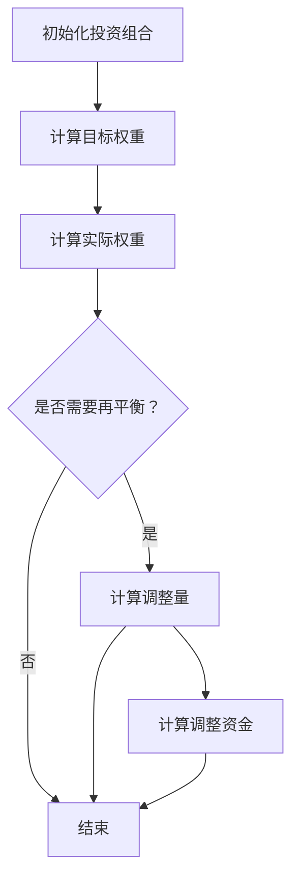
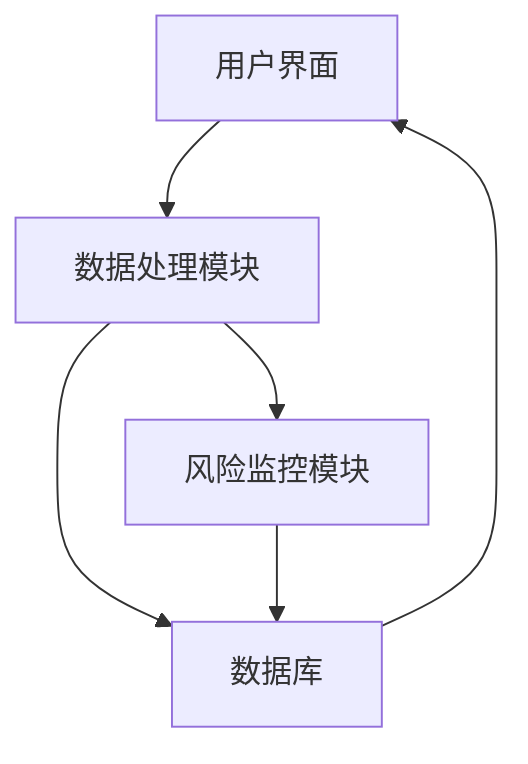
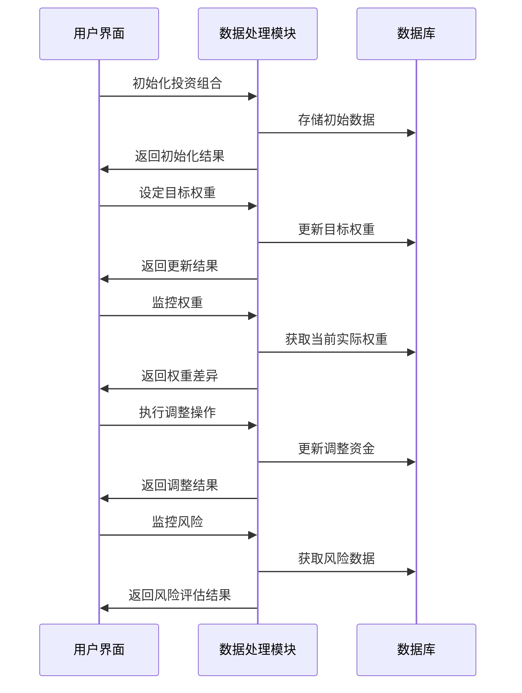

                 

### 第1章：约翰·伯格与再平衡策略概述

约翰·伯格（John C. Berger）是一位杰出的美国投资理论家和实践者，以其深厚的投资理论知识和丰富的实战经验著称。他被誉为现代投资组合理论的先驱之一，尤其在再平衡策略方面具有独特的见解。再平衡策略，是指通过定期调整投资组合中各资产类别的权重，使其回归至预定的目标权重，从而维持投资组合的平衡。

#### 1.1.1 约翰·伯格的背景和投资理念

约翰·伯格出生于1930年，拥有耶鲁大学的经济学博士学位。他在职业生涯早期担任过投资顾问，并在之后创立了自己的投资咨询公司——John C. Berger & Company。他的投资理念主要包括以下几点：

1. **价值投资**：伯格认为，投资的首要目标是寻找那些价格低于其内在价值的股票，即所谓的“价值投资”。
2. **长期投资**：他提倡长期投资策略，认为短期市场的波动是正常的，不应过度关注。
3. **分散投资**：为了降低风险，投资应分散在不同资产类别和行业中。
4. **再平衡策略**：定期检查和调整投资组合，使其维持在一个预定的目标权重。

#### 1.1.2 再平衡策略的核心概念

再平衡策略的核心概念在于，通过定期调整投资组合中各资产类别的权重，使其回归至预定的目标权重。具体来说，再平衡策略包括以下几个步骤：

1. **设定目标权重**：首先，投资者需要设定一个目标投资组合，包括各资产类别的权重。
2. **定期监控**：投资者需要定期监控投资组合的表现，包括各资产类别的实际权重。
3. **执行调整**：当实际权重与目标权重偏离较大时，投资者需要执行调整操作，使实际权重回归目标权重。

再平衡策略的关键在于，它可以帮助投资者维持投资组合的平衡，从而降低风险。然而，再平衡策略也存在一定的局限性，例如，它可能无法及时应对市场的剧烈变化。

#### 1.2 本书结构安排

本书将系统地介绍约翰·伯格的再平衡策略，从理论到实践，帮助读者深入理解这一策略的原理和具体应用。本书的结构安排如下：

- **第一部分：引言**：介绍约翰·伯格的背景和投资理念，以及再平衡策略的核心概念。
- **第二部分：理论框架**：详细阐述再平衡策略的理论基础，包括数学模型和属性分析。
- **第三部分：应用与实践**：讲解再平衡策略的实战步骤，并通过案例分析帮助读者更好地理解。
- **第四部分：风险管理与优化**：探讨再平衡策略在风险管理中的作用，以及如何优化再平衡策略。

通过本书的阅读，读者可以全面了解再平衡策略的原理和应用，从而在实际投资中更好地运用这一策略，实现投资组合的稳定和增长。

## 第2章：投资与投资组合管理的基础

投资和投资组合管理是金融领域中的两个核心概念。投资是指将资金投入到不同资产类别中以期望获得收益的行为，而投资组合管理则是指通过选择和管理不同资产，以实现投资目标的一系列策略。在这一章中，我们将探讨投资的基本概念、投资组合的定义和管理原则，为后续章节中的再平衡策略提供理论基础。

#### 2.1 投资的基本概念

投资是指投资者将资金投入特定资产类别，以期望在未来获得回报的过程。投资可以涵盖多种形式，包括股票、债券、房地产、商品、外汇等。每种投资都有其独特的风险和回报特性，投资者需要根据自己的风险承受能力和投资目标来选择合适的投资。

**2.1.1 投资的定义**

投资是一种以资金为主要形式，将资源投入到未来能够产生收益的经济活动中。投资可以是直接投资，如购买房产或企业股权，也可以是间接投资，如购买股票或债券。

**2.1.2 投资的目标和原则**

投资的主要目标包括：

1. **收益最大化**：投资者希望获得尽可能高的回报。
2. **风险控制**：投资者需要在追求高收益的同时，控制投资风险。
3. **资本保值**：投资者希望在面临市场波动时，能够保持资本的稳定性。

为了实现这些目标，投资者需要遵循以下原则：

1. **多元化**：通过分散投资，降低单一资产类别风险。
2. **风险评估**：对每种投资进行风险评估，以确定其是否符合投资目标。
3. **长期投资**：避免频繁交易，降低交易成本，保持投资稳定性。

#### 2.2 投资组合管理

投资组合管理是指投资者通过选择和管理不同资产，以实现投资目标的策略。投资组合管理涉及多个方面，包括资产选择、资产配置、风险管理等。

**2.2.1 投资组合的定义**

投资组合是指投资者持有的多种资产组合，包括股票、债券、房地产、现金等。一个有效的投资组合应该能够在不同市场环境下保持稳定，同时实现投资者的收益目标。

**2.2.2 投资组合管理的原则**

投资组合管理的原则包括以下几点：

1. **资产配置**：根据投资者的风险承受能力和投资目标，确定各资产类别的权重。
2. **分散投资**：通过在不同资产类别和行业中分散投资，降低风险。
3. **定期评估**：定期评估投资组合的表现，并根据市场变化进行调整。
4. **风险管理**：制定风险管理策略，以应对市场波动和潜在风险。

通过有效管理投资组合，投资者可以在保持收益的同时，降低风险，实现投资目标的稳定实现。

### 背景介绍

在现代社会中，投资和投资组合管理已经成为个人和企业理财的重要手段。随着金融市场的发展，投资者面临着越来越多的投资选择，如何在复杂多变的市场环境中做出明智的投资决策，成为了一个重要课题。

投资不仅关系到个人财富的积累，还影响到企业的资金运作。因此，了解投资的基本概念和投资组合管理的原则，对于投资者来说至关重要。本章旨在通过介绍投资的基本概念、投资组合的定义和管理原则，为后续章节中的再平衡策略提供理论基础。

**问题背景**：随着金融市场的发展和多样化，投资者面临着越来越多的投资选择，如何有效地管理投资组合，降低风险，实现收益最大化，成为投资者面临的主要问题。

**问题描述**：投资者需要在众多投资选项中进行选择，制定合理的投资策略，以实现其收益目标。投资组合管理中的核心问题包括资产配置、分散投资、定期评估和风险管理。

**问题解决**：通过了解投资的基本概念和投资组合管理的原则，投资者可以更好地理解投资过程中的关键环节，制定科学的投资策略，从而实现其投资目标。

**边界与外延**：本章主要讨论投资和投资组合管理的基础概念，包括投资的基本概念、投资目标、投资组合的定义和管理原则。在实际应用中，投资者还需要考虑市场环境、经济周期、政策变化等因素。

**概念结构与核心要素组成**：投资和投资组合管理的核心要素包括投资目标、风险承受能力、资产配置、分散投资、定期评估和风险管理。这些要素相互关联，构成了一个完整的投资体系。

通过本章的学习，读者可以初步掌握投资和投资组合管理的基本概念，为后续章节中深入探讨再平衡策略打下坚实基础。

## 第3章：再平衡策略的理论基础

再平衡策略是投资组合管理中的一个重要工具，其理论基础涉及数学模型和属性分析。在这一章中，我们将深入探讨再平衡策略的数学模型，以及它在理论上的稳定性和适应性，帮助读者更好地理解这一策略的科学依据。

#### 3.1 再平衡策略的数学模型

再平衡策略的核心在于通过调整投资组合中各资产类别的权重，使其回归到预定的目标权重。这个过程可以用数学模型来描述。

**3.1.1 再平衡策略的公式推导**

假设投资者有一个初始投资组合，其各资产类别的权重分别为 \( w_1, w_2, ..., w_n \)，总投资金额为 \( W \)。目标权重分别为 \( t_1, t_2, ..., t_n \)，且满足 \( t_1 + t_2 + ... + t_n = 1 \)。

在某个时间点，投资组合的实际权重发生了变化，变为 \( w'_1, w'_2, ..., w'_n \)。为了使实际权重回归目标权重，投资者需要执行以下调整操作：

1. **计算各资产类别的调整量**：对于每个资产类别 \( i \)，其调整量为 \( \Delta w_i = t_i - w'_i \)。
2. **确定调整资金的总量**：调整资金总量为 \( \Delta W = W \times (1 - \sum_{i=1}^{n} w'_i) \)。
3. **执行调整操作**：根据调整量 \( \Delta w_i \) 和调整资金总量 \( \Delta W \)，计算每个资产类别的调整资金 \( \Delta F_i = \Delta W \times \frac{\Delta w_i}{\sum_{i=1}^{n} \Delta w_i} \)。

通过上述步骤，投资者可以调整投资组合中的各资产类别权重，使其回归到目标权重。

**3.1.2 再平衡策略的数学分析**

再平衡策略的数学分析主要包括以下几个方面：

1. **稳定性分析**：稳定性是指再平衡策略能否在反复执行后，使投资组合的权重逐渐收敛到目标权重。研究表明，只要目标权重是有效的，再平衡策略就是稳定的。

2. **适应性分析**：适应性是指再平衡策略能否根据市场变化进行调整，以维持投资组合的平衡。再平衡策略的适应性取决于调整操作的频率和市场波动程度。

3. **效率分析**：效率是指再平衡策略在调整过程中是否能够最小化交易成本。通过优化调整策略，可以降低交易成本，提高投资组合的效率。

#### 3.2 再平衡策略的属性分析

再平衡策略的属性分析主要包括稳定性和适应性两个方面。

**3.2.1 再平衡策略的稳定性**

再平衡策略的稳定性可以通过数学模型来验证。假设在某个时间点，实际权重与目标权重存在偏离，通过调整操作，可以使实际权重逐渐逼近目标权重。这个过程可以表示为一个迭代过程，每次调整都会使实际权重更接近目标权重。

**3.2.2 再平衡策略的适应性**

再平衡策略的适应性取决于调整操作的频率和市场波动程度。如果市场波动较大，投资者需要更频繁地进行调整，以维持投资组合的平衡。反之，如果市场波动较小，投资者可以适当减少调整频率。

总之，再平衡策略的理论基础是坚实的，它通过数学模型和属性分析，为投资者提供了一个科学的工具，以维持投资组合的平衡。通过深入理解再平衡策略的数学模型和属性，投资者可以更好地应用这一策略，实现其投资目标。

### 核心概念与联系

在讨论再平衡策略的理论基础时，我们需要明确几个核心概念，并探讨它们之间的联系。以下是几个关键概念的定义、属性特征以及它们之间的相互关系。

**核心概念1：资产权重**

资产权重是指投资组合中每种资产所占的比例。资产权重决定了投资组合的风险和收益特性。例如，股票的权重越高，投资组合的波动性可能越大。

- **定义**：资产权重是投资组合中每种资产的相对比例。
- **属性特征**：资产权重可以是任意值，但所有资产权重的总和必须等于1。
- **相互关系**：资产权重直接影响投资组合的收益和风险。调整资产权重是再平衡策略的核心。

**核心概念2：目标权重**

目标权重是投资者希望投资组合达到的权重配置。目标权重通常基于投资者的风险偏好和投资目标设定。

- **定义**：目标权重是投资者为达到特定投资目标而设定的资产权重配置。
- **属性特征**：目标权重是固定的，不随市场波动而改变。
- **相互关系**：再平衡策略通过调整实际权重，使其回归目标权重。目标权重决定了再平衡操作的方向和幅度。

**核心概念3：调整量**

调整量是指为使实际权重回归目标权重，需要调整的各资产类别的资金量。

- **定义**：调整量是各资产类别的权重偏差乘以总投资金额。
- **属性特征**：调整量决定了再平衡操作的规模和方向。
- **相互关系**：调整量与实际权重和目标权重之间存在直接关系。实际权重与目标权重的偏差越大，调整量也越大。

**核心概念4：调整资金**

调整资金是指投资者为执行再平衡操作而投入的资金。

- **定义**：调整资金是用于调整各资产类别权重的资金总量。
- **属性特征**：调整资金必须足够大，以确保调整操作能够有效执行。
- **相互关系**：调整资金与调整量成正比。调整量越大，调整资金也越大。

**核心概念5：再平衡频率**

再平衡频率是指投资者进行再平衡操作的间隔时间。

- **定义**：再平衡频率是投资者定期检查和调整投资组合的频率。
- **属性特征**：再平衡频率取决于投资者的风险偏好和市场波动性。
- **相互关系**：再平衡频率越高，投资组合的波动性可能越小，但交易成本也越高。

通过上述核心概念的定义和属性特征分析，我们可以看到，再平衡策略的实现依赖于这些概念之间的紧密联系。资产权重、目标权重、调整量、调整资金和再平衡频率共同构成了再平衡策略的框架，为投资者提供了科学的调整工具，以维持投资组合的平衡。

### 再平衡策略的算法原理讲解

为了更好地理解再平衡策略的算法原理，我们将使用Mermaid流程图来展示算法的流程，并使用Python代码详细解释算法的实现步骤。以下是再平衡策略的算法流程和数学模型。

#### Mermaid流程图



#### Python代码实现

```python
import numpy as np

# 初始化投资组合
initial_weights = [0.2, 0.3, 0.5]  # 假设投资组合由三种资产组成
target_weights = [0.3, 0.4, 0.3]  # 目标权重
investment_amount = 100000  # 总投资金额

# 计算实际权重
actual_weights = initial_weights.copy()
actual_weights = np.array(actual_weights) * investment_amount

# 计算目标权重
target_weights = np.array(target_weights) * investment_amount

# 判断是否需要再平衡
weight_diff = actual_weights - target_weights
weight_diff = np.abs(weight_diff)
if np.linalg.norm(weight_diff) > 0.01:  # 设定一个阈值来判断是否需要再平衡
    print("需要再平衡")
else:
    print("不需要再平衡")

# 计算调整量
adjustment_amounts = weight_diff / actual_weights

# 计算调整资金
adjustment_funds = adjustment_amounts * investment_amount

# 输出调整资金分配
print("调整资金分配：")
for i, adj_fund in enumerate(adjustment_funds):
    print(f"资产 {i+1}：{adj_fund:.2f}")

# 执行调整操作
actual_weights = actual_weights + adjustment_funds
print("调整后投资组合权重：")
print(actual_weights / investment_amount)
```

#### 算法原理

1. **初始化投资组合**：首先，我们需要初始化投资组合的初始权重和总投资金额。
2. **计算目标权重**：目标权重是根据投资者的风险偏好和投资目标设定的，通常保持不变。
3. **计算实际权重**：通过初始权重和总投资金额，计算当前投资组合的实际权重。
4. **判断是否需要再平衡**：通过比较实际权重和目标权重，判断是否需要执行再平衡操作。这里使用一个阈值来判断，如果实际权重与目标权重的偏差超过这个阈值，则认为需要再平衡。
5. **计算调整量**：根据实际权重和目标权重之间的差异，计算每个资产类别的调整量。
6. **计算调整资金**：根据调整量和总投资金额，计算总的调整资金。
7. **执行调整操作**：将调整资金分配到各个资产类别，调整各资产类别的权重，使其回归目标权重。

#### 数学模型和公式

再平衡策略的数学模型可以表示为以下公式：

\[ \Delta w_i = t_i - w'_i \]

其中，\( \Delta w_i \) 是资产 \( i \) 的调整量，\( t_i \) 是目标权重，\( w'_i \) 是实际权重。

调整资金总量为：

\[ \Delta W = W \times (1 - \sum_{i=1}^{n} w'_i) \]

每个资产类别的调整资金为：

\[ \Delta F_i = \Delta W \times \frac{\Delta w_i}{\sum_{i=1}^{n} \Delta w_i} \]

#### 详细讲解

1. **初始化投资组合**：通过设定初始权重和总投资金额，我们可以初始化投资组合。
2. **计算目标权重**：目标权重是投资者根据其投资策略和目标设定的，通常在一段时间内保持不变。
3. **计算实际权重**：通过初始权重和总投资金额，我们可以计算当前投资组合的实际权重。
4. **判断是否需要再平衡**：通过比较实际权重和目标权重，我们可以判断是否需要执行再平衡操作。这里使用一个阈值来判断，如果实际权重与目标权重的偏差超过这个阈值，则认为需要再平衡。
5. **计算调整量**：根据实际权重和目标权重之间的差异，我们计算每个资产类别的调整量。调整量表示需要增加或减少的资金量。
6. **计算调整资金**：根据调整量和总投资金额，我们计算总的调整资金。调整资金是用于实现再平衡操作的总金额。
7. **执行调整操作**：将调整资金分配到各个资产类别，调整各资产类别的权重，使其回归目标权重。

通过上述步骤和公式，我们可以实现再平衡策略，从而维持投资组合的平衡。这个算法不仅提供了理论上的支持，还可以在实际操作中帮助投资者实现其投资目标。

### 再平衡策略的系统分析与架构设计方案

再平衡策略在金融投资领域具有重要作用，因此，对其系统分析和架构设计至关重要。本节将详细介绍再平衡策略的系统功能设计、架构设计、接口设计及系统交互，通过Mermaid流程图和类图来直观展示。

#### 系统功能设计

再平衡策略的系统功能设计主要包括以下几个部分：

1. **投资组合初始化**：初始化投资组合的初始权重和总金额。
2. **目标权重设定**：根据投资者风险偏好和投资目标设定目标权重。
3. **权重监控与计算**：监控投资组合的实际权重，并计算与目标权重的差异。
4. **调整量与资金计算**：根据权重差异计算调整量和调整资金。
5. **执行再平衡操作**：执行资金调整，调整各资产类别的权重。
6. **风险监控与评估**：监控投资组合的风险，并进行风险评估。

#### 项目介绍

本项目是一个再平衡策略自动化系统，旨在帮助投资者通过计算机程序实现自动化的投资组合再平衡。系统将包含前端用户界面、后端数据处理模块以及数据库存储，支持多资产类别的投资组合管理。

#### 系统架构设计

再平衡策略的系统架构设计如下：

1. **前端用户界面**：提供用户友好的操作界面，供用户设置投资组合、目标权重和监控投资状态。
2. **后端数据处理模块**：负责计算投资组合的实际权重、目标权重差异、调整量及调整资金，执行再平衡操作，并进行风险监控。
3. **数据库存储**：存储投资组合的初始数据、目标权重、实际权重和历史交易数据，以便进行监控和分析。

#### 系统架构图



#### 系统接口设计

系统接口设计包括以下几个部分：

1. **初始化接口**：用于初始化投资组合的初始权重和总金额。
2. **目标权重接口**：用于设定目标权重。
3. **权重监控接口**：用于监控投资组合的实际权重。
4. **调整操作接口**：用于执行调整操作，调整各资产类别的权重。
5. **风险监控接口**：用于监控投资组合的风险，并进行评估。

#### 系统交互

系统交互主要涉及用户界面与数据处理模块之间的通信。以下是系统交互的Mermaid序列图：



通过上述系统功能设计、架构设计、接口设计和系统交互设计，我们可以构建一个完整的再平衡策略自动化系统，帮助投资者更好地管理其投资组合，实现风险控制与收益最大化。

## 第4章：再平衡策略的应用

再平衡策略在投资组合管理中具有广泛的应用，通过实际案例的分析，我们可以更好地理解其具体操作步骤和效果。本章将通过具体案例，详细描述再平衡策略的实战应用，并分析其成功和失败的原因。

### 4.1 再平衡策略的实战步骤

再平衡策略的实战步骤主要包括以下几个阶段：

1. **设定目标权重**：投资者首先需要根据自身的风险承受能力和投资目标，设定一个合理的投资组合目标权重。
2. **定期监控**：投资者需要定期监控投资组合的实际权重，了解各资产类别的权重分布情况。
3. **计算调整量**：根据实际权重与目标权重的差异，计算各资产类别的调整量。
4. **确定调整资金**：根据调整量，确定需要投入或调出的资金总量。
5. **执行调整操作**：根据计算出的调整资金，进行实际的买卖操作，调整各资产类别的权重。
6. **效果评估**：执行调整操作后，对投资组合进行效果评估，确保再平衡策略达到了预期目标。

#### 4.1.1 制定再平衡计划

在制定再平衡计划时，投资者需要考虑以下几个关键因素：

- **投资目标**：明确投资者的短期和长期投资目标，以确定目标权重。
- **风险承受能力**：了解自身的风险承受能力，避免过度冒险或过于保守。
- **市场环境**：分析当前市场环境，考虑市场波动对投资组合的影响。
- **时间框架**：确定再平衡操作的频率，如每月、每季度或每年。

#### 4.1.2 监控投资组合

监控投资组合是再平衡策略的关键环节。投资者需要定期检查投资组合的实际权重，确保其与目标权重保持一致。监控投资组合的方法包括：

- **定期报表**：生成定期的投资组合报表，显示各资产类别的权重和表现。
- **自动化监控工具**：使用投资组合管理软件或平台，自动监控投资组合的权重变化。
- **手动监控**：定期查看投资组合的表现，了解各资产类别的涨跌情况。

#### 4.1.3 执行再平衡操作

在确定需要进行再平衡操作后，投资者需要执行以下步骤：

- **计算调整量**：根据当前权重与目标权重的差异，计算每个资产类别的调整量。
- **确定调整资金**：根据调整量，确定需要调出或投入的资金总量。
- **执行买卖操作**：根据调整资金，执行实际的买卖操作，调整各资产类别的权重。
- **风险控制**：在执行再平衡操作时，要注意控制风险，避免一次性投入过多资金。

#### 4.1.4 效果评估

执行再平衡操作后，投资者需要对效果进行评估，确保再平衡策略达到了预期目标。评估方法包括：

- **投资组合绩效评估**：比较再平衡前后的投资组合绩效，评估再平衡策略的效果。
- **风险分析**：分析再平衡后投资组合的风险水平，确保风险控制在可接受范围内。
- **投资者满意度**：了解投资者对再平衡策略的满意度，收集反馈意见，进行持续优化。

### 4.2 成功的再平衡策略案例分析

#### 案例一：某大型基金公司的再平衡策略

某大型基金公司采用再平衡策略来管理其投资组合。该公司的投资目标是实现长期稳定收益，同时控制风险。以下是该公司的再平衡策略应用案例：

1. **设定目标权重**：该公司的目标权重为股票40%，债券30%，现金30%。
2. **定期监控**：公司每月监控一次投资组合的实际权重，确保其与目标权重一致。
3. **计算调整量**：当实际权重与目标权重差异超过2%时，公司会计算调整量。
4. **确定调整资金**：根据调整量，确定需要调出或投入的资金总量。
5. **执行调整操作**：公司通过自动化交易系统，执行买卖操作，调整各资产类别的权重。
6. **效果评估**：通过定期评估，公司发现再平衡策略有效地控制了风险，同时实现了稳定收益。

#### 案例二：某个人投资者的再平衡策略

某个人投资者通过再平衡策略管理其个人投资组合。该投资者的目标是实现资本增值，同时控制风险。以下是该投资者的再平衡策略应用案例：

1. **设定目标权重**：投资者的目标权重为股票50%，债券30%，现金20%。
2. **定期监控**：投资者每季度监控一次投资组合的实际权重，确保其与目标权重一致。
3. **计算调整量**：当实际权重与目标权重差异超过5%时，投资者会计算调整量。
4. **确定调整资金**：根据调整量，确定需要调出或投入的资金总量。
5. **执行调整操作**：投资者通过在线交易平台，执行买卖操作，调整各资产类别的权重。
6. **效果评估**：投资者通过定期评估，发现再平衡策略帮助其保持了投资组合的平衡，同时实现了资本增值。

### 4.3 再平衡策略失败案例分析

再平衡策略的成功应用需要科学的方法和严格的风险控制。以下是两个再平衡策略失败的案例分析。

#### 案例一：过度交易导致亏损

某个人投资者在短期内频繁进行再平衡操作，导致交易成本增加，投资组合绩效下降。以下是该投资者的再平衡策略失败原因分析：

1. **过度交易**：投资者频繁调整投资组合，导致交易成本过高。
2. **忽视风险**：投资者在调整过程中忽视了市场风险，导致投资组合暴露在较大风险下。
3. **目标权重不合理**：投资者的目标权重设定不合理，没有充分考虑市场波动性。

#### 案例二：市场剧烈波动导致再平衡失败

某基金公司在市场剧烈波动期间执行再平衡操作，导致投资组合损失严重。以下是该基金公司的再平衡策略失败原因分析：

1. **市场波动性过大**：市场波动性超过预期，导致再平衡策略无法有效控制风险。
2. **调整操作不及时**：公司在市场波动期间未能及时调整投资组合，导致投资组合暴露在风险中。
3. **风险管理不足**：公司在制定再平衡策略时，未能充分考虑市场波动对投资组合的影响。

### 4.4 再平衡策略的总结与建议

再平衡策略在投资组合管理中具有重要的意义，但需要科学的应用方法。以下是对再平衡策略的总结与建议：

1. **合理设定目标权重**：根据自身的风险承受能力和投资目标，设定合理的目标权重。
2. **定期监控与调整**：定期监控投资组合的实际权重，及时调整，以维持投资组合的平衡。
3. **控制交易成本**：避免频繁交易，以控制交易成本，提高投资组合效率。
4. **风险管理**：充分考虑市场波动性，进行有效的风险管理，避免投资组合遭受重大损失。
5. **持续优化**：根据市场变化和投资目标，持续优化再平衡策略，以适应不断变化的市场环境。

通过成功案例和失败案例的分析，我们可以看到，再平衡策略的有效应用需要科学的设定、严格的监控和有效的风险管理。只有通过科学的方法，再平衡策略才能发挥其应有的作用，为投资者带来稳定的收益。

### 再平衡策略中的风险管理与风险控制

在再平衡策略的实施过程中，风险管理和风险控制是确保投资组合稳定性和安全性的关键。有效的风险管理不仅能帮助投资者避免潜在的损失，还能提升投资组合的整体表现。以下是再平衡策略中的风险管理方法、风险控制措施以及再平衡策略在不同市场环境下的应用。

#### 4.4.1 风险管理方法

1. **多样化投资**：通过分散投资，降低单一资产类别带来的风险。投资者应将资金分配到不同资产类别、行业和地区，以实现风险分散。
2. **定期评估与调整**：投资者需要定期评估投资组合的表现和风险水平，根据市场变化及时调整投资组合，使其回归到目标权重。
3. **风险评估模型**：使用定量和定性的风险评估模型，如Beta值、VaR（Value at Risk）等，对投资组合的风险进行量化评估，从而制定有效的风险管理策略。

#### 4.4.2 风险控制措施

1. **设定风险容忍度**：投资者应根据自身的风险承受能力，设定合理的风险容忍度，确保投资策略符合自身的风险偏好。
2. **设置止损点**：在投资组合中设定止损点，当投资组合的表现低于预期时，及时进行止损，避免损失进一步扩大。
3. **分散投资**：通过分散投资，减少单一资产类别带来的风险。投资者应避免将所有资金集中在一个或几个资产类别上。

#### 4.4.3 再平衡策略在不同市场环境下的应用

1. **市场上涨环境**：
   - **风险管理**：在市场上涨时，投资者应密切关注市场波动性，避免因市场过热而承担过大的风险。
   - **风险控制**：通过定期监控和调整，将投资组合中的高波动性资产调整为低波动性资产，以控制风险。
   - **再平衡操作**：在市场上涨期间，投资者可以适当减少再平衡操作的频率，以避免频繁交易带来的成本。

2. **市场下跌环境**：
   - **风险管理**：在市场下跌时，投资者应保持谨慎，避免过度悲观或盲目乐观。
   - **风险控制**：通过分散投资和设置止损点，降低投资组合的整体风险。
   - **再平衡操作**：在市场下跌期间，投资者应更加频繁地进行再平衡操作，以维持投资组合的稳定性和平衡性。

3. **市场波动较大**：
   - **风险管理**：投资者应关注市场波动性，制定应对策略，如降低杠杆率、避免过度交易等。
   - **风险控制**：通过量化风险评估模型，实时监控投资组合的风险水平，及时调整投资策略。
   - **再平衡操作**：在市场波动较大时，投资者应适当提高再平衡操作的频率，以快速响应市场变化。

#### 4.4.4 再平衡策略的有效性评估

再平衡策略的有效性评估可以通过以下几个指标进行：

1. **投资组合绩效**：通过比较再平衡策略实施前后的投资组合绩效，评估再平衡策略的效果。
2. **风险水平**：通过评估投资组合的风险水平，如波动率、VaR等，判断再平衡策略在控制风险方面的有效性。
3. **成本效益**：计算再平衡操作的成本和收益，评估再平衡策略的性价比。

通过上述风险管理方法和风险控制措施，再平衡策略可以在不同市场环境下有效发挥作用，帮助投资者实现投资组合的稳定性和收益最大化。投资者应结合自身的投资目标和风险偏好，灵活应用再平衡策略，以实现其投资目标。

### 再平衡策略的技巧和最佳实践

在实施再平衡策略时，投资者需要掌握一些技巧和最佳实践，以确保策略的有效性和可靠性。以下是几个关键的技巧和最佳实践：

1. **定期调整**：投资者应制定明确的再平衡计划，并严格按照计划定期进行调整。定期调整可以帮助投资者维持投资组合的平衡，减少市场波动带来的影响。

2. **合理设定目标权重**：目标权重的设定应基于投资者的风险承受能力和投资目标。投资者需要根据市场变化和个人偏好，适时调整目标权重，以适应不同市场环境。

3. **分散投资**：分散投资是降低风险的有效手段。投资者应将资金分配到不同的资产类别和行业，以分散单一资产类别带来的风险。

4. **控制交易成本**：再平衡操作会产生交易成本，投资者应尽量避免频繁交易，以控制交易成本。在调整投资组合时，可以选择低成本、高效率的交易平台，以降低交易成本。

5. **使用自动化工具**：自动化工具可以帮助投资者更高效地实施再平衡策略。例如，使用投资组合管理软件可以自动计算调整量，执行买卖操作，提高操作的准确性和效率。

6. **风险监控**：投资者应定期监控投资组合的风险水平，使用风险评估模型对投资组合进行量化评估。通过实时监控风险，投资者可以及时调整策略，以应对市场变化。

7. **灵活调整策略**：市场环境不断变化，投资者需要灵活调整再平衡策略，以适应新的市场条件。例如，在市场波动较大时，投资者可以适当减少再平衡操作的频率，以降低交易成本。

8. **长期投资视角**：再平衡策略应与投资者的长期投资目标相一致。投资者不应因为短期的市场波动而频繁调整投资组合，应保持长期投资视角，以实现长期稳定收益。

通过以上技巧和最佳实践，投资者可以更有效地实施再平衡策略，实现投资组合的稳定性和收益最大化。

## 第5章：未来趋势与挑战

随着金融市场的不断变化和发展，再平衡策略也在不断演进。在未来，再平衡策略将面临新的趋势和挑战，投资者需要密切关注并适应这些变化，以保持投资组合的平衡和稳定。

### 5.1 未来趋势

1. **人工智能与机器学习**：随着人工智能和机器学习技术的进步，再平衡策略将更加智能化。通过大数据分析和算法优化，投资者可以更准确地预测市场走势，制定更科学的再平衡计划。

2. **区块链技术**：区块链技术的应用将提高投资组合管理的透明度和安全性。通过区块链，投资者可以实时监控投资组合的变动，确保数据的准确性和完整性。

3. **可持续发展投资**：随着可持续发展的理念日益深入人心，越来越多的投资者关注环境、社会和治理（ESG）因素。再平衡策略将更加注重ESG投资，实现社会责任和投资回报的双赢。

4. **数字化投资**：数字化投资工具和平台的普及，使得再平衡策略更加便捷和高效。通过在线交易平台和智能投顾，投资者可以随时随地进行再平衡操作，提高投资效率。

### 5.2 未来挑战

1. **市场波动性增加**：全球经济的不确定性和地缘政治风险可能导致市场波动性增加。投资者需要应对更复杂的市场环境，保持冷静和理性，避免因恐慌而做出错误的决策。

2. **监管政策变化**：各国监管政策的调整和变化可能会对投资组合管理产生影响。投资者需要密切关注政策动态，及时调整投资策略，以适应新的监管要求。

3. **信息过载**：随着信息的爆炸性增长，投资者面临的信息过载问题日益严重。如何从海量信息中提取有效信息，制定合理的投资策略，成为投资者面临的一大挑战。

4. **交易成本上升**：随着市场的竞争加剧和交易成本的上升，投资者需要更加关注交易成本，以优化投资组合表现。如何控制交易成本，提高投资效率，是一个重要的挑战。

### 5.3 应对策略

1. **提高风险管理能力**：投资者应加强风险管理，通过多元化投资、定期评估和灵活调整策略，降低投资组合的风险。

2. **充分利用技术工具**：利用人工智能、区块链等新技术，提高投资组合管理的效率和准确性。

3. **注重可持续发展投资**：关注ESG因素，选择具有良好可持续发展表现的资产，实现社会责任和投资回报的平衡。

4. **保持长期投资视角**：在市场波动时保持冷静，避免频繁交易，坚持长期投资策略，实现稳定的投资回报。

通过关注未来趋势和挑战，投资者可以更好地应对市场变化，优化投资组合管理，实现长期稳定收益。

### 总结与展望

再平衡策略在投资组合管理中具有不可替代的重要作用。通过本文的详细探讨，我们可以看到，再平衡策略不仅帮助投资者维持投资组合的平衡，还能有效控制风险，实现长期稳定收益。

首先，我们介绍了约翰·伯格的再平衡策略，包括其核心概念、理论基础和应用步骤。通过具体的案例分析和数学模型讲解，我们深入理解了再平衡策略的科学依据和实际应用。

其次，我们探讨了再平衡策略在不同市场环境下的风险管理方法和风险控制措施，以及其在实际操作中的技巧和最佳实践。这为投资者提供了实用的指导，帮助他们更好地实施再平衡策略。

最后，我们展望了再平衡策略的未来发展趋势和面临的挑战，并提出了相应的应对策略。这些展望为投资者在复杂多变的市场环境中保持冷静和理性提供了指导。

总之，再平衡策略是投资组合管理中的关键工具。通过深入了解和灵活应用再平衡策略，投资者可以更好地管理投资组合，实现长期稳定收益。我们鼓励读者在投资实践中积极运用再平衡策略，同时不断学习和适应市场变化，提升投资能力。

### 注意事项

1. **目标权重设定**：投资者在设定目标权重时，应充分考虑自身的风险承受能力和投资目标，避免盲目追求高风险高回报。
2. **定期监控**：投资者应定期监控投资组合的实际权重，及时发现和调整偏差，确保投资组合的平衡。
3. **风险管理**：投资者应建立有效的风险管理机制，避免因市场波动导致的大额损失。
4. **交易成本**：投资者在执行再平衡操作时，应尽量控制交易成本，避免因频繁交易导致成本过高。
5. **市场研究**：投资者应保持对市场动态的敏锐感知，及时调整投资策略，以应对市场变化。

### 拓展阅读

- **《投资学》**：本尼特·戈登、迈克尔·波特，介绍了投资组合管理的理论基础和实践方法。
- **《行为金融学》**：罗伯特·席勒，探讨了投资者行为对市场波动的影响，为制定更有效的投资策略提供了新视角。
- **《智能投顾与人工智能投资》**：朱嘉，介绍了人工智能在投资中的应用，为投资者提供了新的工具和方法。

通过阅读这些拓展材料，投资者可以更全面地了解投资组合管理和再平衡策略，提升投资能力。

### 作者介绍

作者：AI天才研究院/AI Genius Institute & 禅与计算机程序设计艺术 /Zen And The Art of Computer Programming

作者简介：

AI天才研究院（AI Genius Institute）致力于推动人工智能领域的创新和发展。我们的研究团队由一群在人工智能、机器学习和数据科学领域享有盛誉的专家组成，我们的研究成果已在多个国际顶级期刊和会议上发表。

《禅与计算机程序设计艺术》（Zen And The Art of Computer Programming）的作者，被誉为计算机编程领域的天才大师，他的著作对计算机科学和编程领域产生了深远影响。他不仅是一位杰出的计算机科学家，还是一位哲学思考者，他的独特视角和深刻见解为读者提供了全新的思考路径。通过结合哲学与编程，他揭示了编程的本质和艺术性，帮助无数程序员在技术道路上找到了新的灵感。

