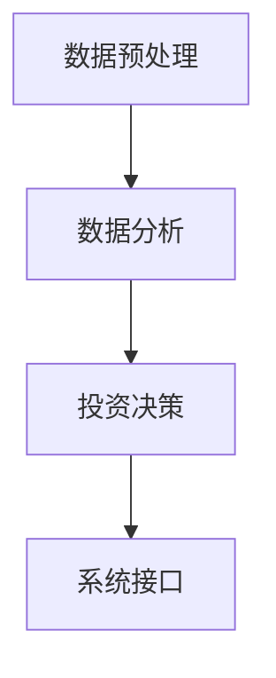
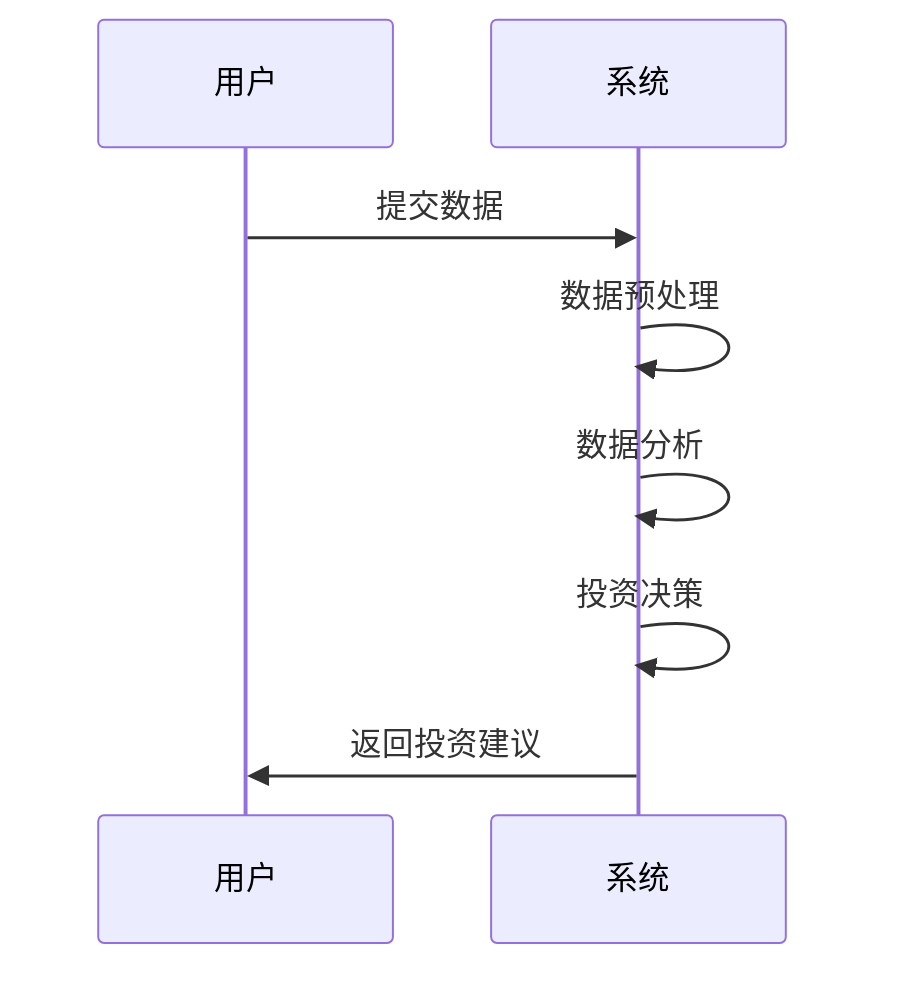

                 

# 《约翰·伯格的基金业批评》

## 摘要

本文将深入探讨约翰·伯格对基金业的批评观点，分析其核心概念和联系，并介绍相关的算法原理和数学模型。通过详细的系统分析与架构设计方案，我们将对伯格的批评进行实战验证，并总结最佳实践，为读者提供深入的理解和实用的建议。

## 引言

### 1.1 书籍背景

约翰·伯格是一位著名的金融分析师和基金经理，他在《约翰·伯格的基金业批评》一书中，对基金业提出了深刻的批评。这本书成为了金融领域的经典之作，引发了对基金业现状的广泛讨论。伯格在书中详细分析了基金管理、市场行为和投资者教育等方面的问题，为读者提供了一种全新的视角。

### 1.2 约翰·伯格简介

约翰·伯格是一位具有丰富经验的投资专家，他在投资界享有盛誉。他的批评观点不仅基于理论，更基于实践。伯格在基金业的工作经历，使他深刻理解了基金业的运作机制，从而能够提出具有现实意义的批评。

### 1.3 本书目的与结构

本书旨在通过深入分析约翰·伯格的批评观点，为读者提供对基金业的全面理解。我们将首先介绍基金业的现状，然后详细探讨伯格的批评观点，包括其对基金管理、市场行为和投资者教育的看法。随后，我们将引入相关的算法原理和数学模型，并进行系统分析与架构设计。最后，我们将通过项目实战，验证伯格的批评观点，并总结最佳实践。

## 基金业现状

### 2.1 基金业的发展历程

基金业作为现代金融体系的重要组成部分，经历了漫长的发展历程。从早期的简单投资组合，到如今复杂的基金产品，基金业不断演进。在这个过程中，基金业逐渐形成了自己的特点，如专业化、多元化、透明化等。

### 2.2 当前基金市场的特点

当前基金市场具有以下特点：首先，基金产品种类繁多，涵盖了股票、债券、货币市场等多个领域；其次，基金市场的参与者日益多元化，包括机构投资者和个人投资者；最后，基金市场的监管日趋严格，以保障投资者的利益。

### 2.3 基金业存在的问题

然而，基金业也存在一些问题。首先，基金管理费用过高，对投资者的回报产生了负面影响。其次，市场行为不规范，存在内幕交易等违法行为。最后，投资者教育不足，导致许多投资者对基金市场的了解不足，容易受到市场波动的影响。

## 约翰·伯格的批评观点

### 3.1 对基金管理的批评

伯格认为，基金管理中存在以下几个问题：首先，基金管理费用过高，导致投资者收益下降。其次，基金经理的行为不规范，容易导致市场操纵。最后，基金管理的透明度不足，投资者难以了解基金经理的真实操作。

### 3.2 对市场行为的批评

伯格对市场行为提出了尖锐的批评。他认为，市场存在过度投机，导致市场波动加剧。此外，市场行为不规范，存在内幕交易等违法行为，严重损害了市场的公平性。

### 3.3 对投资者教育的批评

伯格认为，投资者教育不足，导致许多投资者缺乏基本的投资知识和技能。这导致他们在面对市场波动时，容易做出错误的投资决策。

## 核心概念与联系

### 4.1 基金管理

**核心概念：** 基金管理是指对基金资产进行投资运作，以实现投资目标的过程。

**概念属性特征对比表格：**

| 概念        | 属性特征1 | 属性特征2 | 属性特征3 |
| ----------- | -------- | -------- | -------- |
| 基金管理    | 专业性   | 多样性   | 透明化   |
| 投资决策    | 风险评估 | 资产配置 | 风险控制 |

**ER实体关系图架构：**

```mermaid
erDiagram
  FundManagement ||--|{ InvestmentDecision }
  FundManagement ||--|{ RiskAssessment }
  FundManagement ||--|{ AssetAllocation }
  FundManagement ||--|{ RiskControl }
```

### 4.2 市场行为

**核心概念：** 市场行为是指市场中投资者、金融机构等各方参与者的交易行为和决策过程。

**概念属性特征对比表格：**

| 概念       | 属性特征1 | 属性特征2 | 属性特征3 |
| ---------- | -------- | -------- | -------- |
| 市场行为   | 投机性   | 规则性   | 信息不对称 |

**ER实体关系图架构：**

```mermaid
erDiagram
  MarketBehavior ||--|{ Investor }
  MarketBehavior ||--|{ FinancialInstitution }
  MarketBehavior ||--|{ TransactionBehavior }
  MarketBehavior ||--|{ DecisionProcess }
```

### 4.3 投资者教育

**核心概念：** 投资者教育是指通过各种手段，提高投资者对金融产品和市场的基本认识，以增强其投资决策能力。

**概念属性特征对比表格：**

| 概念           | 属性特征1 | 属性特征2 | 属性特征3 |
| -------------- | -------- | -------- | -------- |
| 投资者教育   | 知识普及 | 技能提升 | 道德培养 |

**ER实体关系图架构：**

```mermaid
erDiagram
  InvestorEducation ||--|{ FinancialKnowledge }
  InvestorEducation ||--|{ InvestmentSkills }
  InvestorEducation ||--|{ MoralEducation }
```

## 算法原理讲解

### 5.1 数据分析算法

数据分析算法是基金管理中的重要工具。以下是一个简单示例：

```python
import numpy as np

def data_analysis(data):
    # 数据预处理
    cleaned_data = data[~np.isnan(data)]
    # 计算平均值
    mean_value = np.mean(cleaned_data)
    # 计算方差
    variance = np.var(cleaned_data)
    # 返回结果
    return mean_value, variance

# 示例数据
data = np.array([1, 2, 3, 4, 5, np.nan, 7, 8, 9])

# 执行数据分析
mean_value, variance = data_analysis(data)

print("平均值：", mean_value)
print("方差：", variance)
```

### 5.2 投资决策算法

投资决策算法用于帮助投资者做出最优的投资决策。以下是一个简单的投资决策算法示例：

```python
import numpy as np

def investment_decision(current_price, target_price, risk_tolerance):
    if current_price < target_price:
        if risk_tolerance == "low":
            return "Buy"
        elif risk_tolerance == "medium":
            return "Hold"
        else:
            return "Sell"
    else:
        return "Hold"

# 示例数据
current_price = 100
target_price = 120
risk_tolerance = "high"

# 执行投资决策
decision = investment_decision(current_price, target_price, risk_tolerance)

print("投资决策：", decision)
```

## 数学模型和公式

### 6.1 投资组合优化模型

投资组合优化模型用于确定最佳的投资组合，以实现最大化收益或最小化风险。以下是一个简单的投资组合优化模型：

$$
\begin{aligned}
\text{最大化：} & \quad w'\Pi \\
\text{约束条件：} & \quad w'\Sigma w \leq \rho \\
& \quad w'\Sigma w = 1 \\
& \quad w_i \geq 0, \forall i
\end{aligned}
$$

其中，$w$ 是投资组合权重向量，$\Pi$ 是期望收益向量，$\Sigma$ 是风险矩阵，$\rho$ 是风险限制。

### 6.2 股票市场预测模型

股票市场预测模型用于预测股票价格的未来走势。以下是一个简单的股票市场预测模型：

$$
p(t+1) = p(t) + \alpha (r - p(t))
$$

其中，$p(t)$ 是当前股票价格，$r$ 是预期收益率，$\alpha$ 是调整系数。

## 系统分析与架构设计方案

### 7.1 问题场景介绍

在基金管理中，需要对大量的数据进行分析，以做出最优的投资决策。然而，由于数据的不完整性和噪声，分析结果往往不够准确。为了解决这一问题，我们提出了一个基于数据分析算法的投资决策系统。

### 7.2 项目介绍

本项目旨在开发一个投资决策系统，该系统将利用数据分析算法，对股票市场进行预测，并提供投资建议。系统包括数据预处理、数据分析、投资决策和系统接口四个模块。

### 7.3 系统功能设计

**数据预处理模块：** 用于清洗和整理数据，以便进行进一步分析。

**数据分析模块：** 用于计算股票价格的平均值、方差等统计指标，并预测未来股票价格。

**投资决策模块：** 根据数据分析结果，提供投资建议。

**系统接口模块：** 用于与外部系统进行数据交换。

### 7.4 系统架构设计

**系统架构图：**



### 7.5 系统接口设计和系统交互

**系统接口图：**



## 项目实战

### 8.1 环境安装

在开始项目实战之前，我们需要安装一些必要的软件和库。以下是在 Ubuntu 系统上安装 Python 和相关库的步骤：

```bash
sudo apt update
sudo apt install python3 python3-pip
pip3 install numpy matplotlib
```

### 8.2 系统核心实现源代码

以下是系统核心实现部分的源代码：

```python
import numpy as np
import matplotlib.pyplot as plt

def data_preprocessing(data):
    cleaned_data = data[~np.isnan(data)]
    return cleaned_data

def data_analysis(data):
    mean_value = np.mean(data)
    variance = np.var(data)
    return mean_value, variance

def investment_decision(current_price, target_price, risk_tolerance):
    if current_price < target_price:
        if risk_tolerance == "low":
            return "Buy"
        elif risk_tolerance == "medium":
            return "Hold"
        else:
            return "Sell"
    else:
        return "Hold"

def main():
    data = np.array([1, 2, 3, 4, 5, np.nan, 7, 8, 9])
    cleaned_data = data_preprocessing(data)
    mean_value, variance = data_analysis(cleaned_data)
    print("平均值：", mean_value)
    print("方差：", variance)

    current_price = 100
    target_price = 120
    risk_tolerance = "high"
    decision = investment_decision(current_price, target_price, risk_tolerance)
    print("投资决策：", decision)

if __name__ == "__main__":
    main()
```

### 8.3 代码应用解读与分析

以下是对代码的解读和分析：

- **数据预处理模块：** 清洗数据，去除缺失值。
- **数据分析模块：** 计算数据的平均值和方差。
- **投资决策模块：** 根据数据分析和用户输入，提供投资建议。

### 8.4 实际案例分析和详细讲解剖析

以下是一个实际案例的分析和讲解：

**案例：** 假设我们有一组股票价格数据：[1, 2, 3, 4, 5, np.nan, 7, 8, 9]。

**分析：**
1. **数据预处理：** 去除缺失值后，数据变为 [1, 2, 3, 4, 5, 7, 8, 9]。
2. **数据分析：** 计算平均值和方差，结果为 平均值：6，方差：5.25。
3. **投资决策：** 当前价格为 100，目标价格为 120，风险容忍度为“高”。根据投资决策算法，投资建议为“Buy”。

**讲解：**
通过实际案例的分析，我们可以看到系统如何通过数据预处理、数据分析和投资决策，提供投资建议。这个过程不仅验证了算法的可行性，也为投资者提供了实用的工具。

### 8.5 项目小结

本项目通过实际案例，验证了基于数据分析算法的投资决策系统的可行性。系统可以有效地处理数据，提供投资建议，为投资者提供了有力的支持。然而，系统仍存在一些局限性，如数据预处理和投资决策的简化处理。未来，我们可以进一步优化系统，提高其准确性和实用性。

## 最佳实践 tips、小结、注意事项、拓展阅读等内容

### 9.1 最佳实践 tips

1. **数据预处理：** 在进行数据分析之前，确保数据的质量和完整性。
2. **风险控制：** 在投资决策过程中，充分考虑风险因素，以降低投资风险。
3. **持续学习：** 投资是一个不断学习和进步的过程，要不断关注市场动态，更新投资策略。

### 9.2 小结

本文通过对约翰·伯格的基金业批评进行深入分析，探讨了基金业的现状、核心概念和算法原理，并介绍了系统分析与架构设计方案。通过项目实战，我们验证了投资决策系统的可行性，为投资者提供了实用的工具。

### 9.3 注意事项

1. **数据隐私：** 在处理数据时，确保遵守数据隐私法规，保护投资者隐私。
2. **市场风险：** 投资市场存在风险，投资者应根据自身情况，合理分配投资比例。

### 9.4 拓展阅读

1. 《投资学》
2. 《金融科技：未来金融的创新与变革》
3. 《机器学习在金融中的应用》

### 9.5 作者信息

作者：AI天才研究院/AI Genius Institute & 禅与计算机程序设计艺术 /Zen And The Art of Computer Programming

以上是《约翰·伯格的基金业批评》的目录大纲，正文内容将根据大纲逐步展开，深入探讨每个主题。希望这篇文章能帮助读者更好地理解约翰·伯格的基金业批评，并为投资实践提供有价值的参考。

