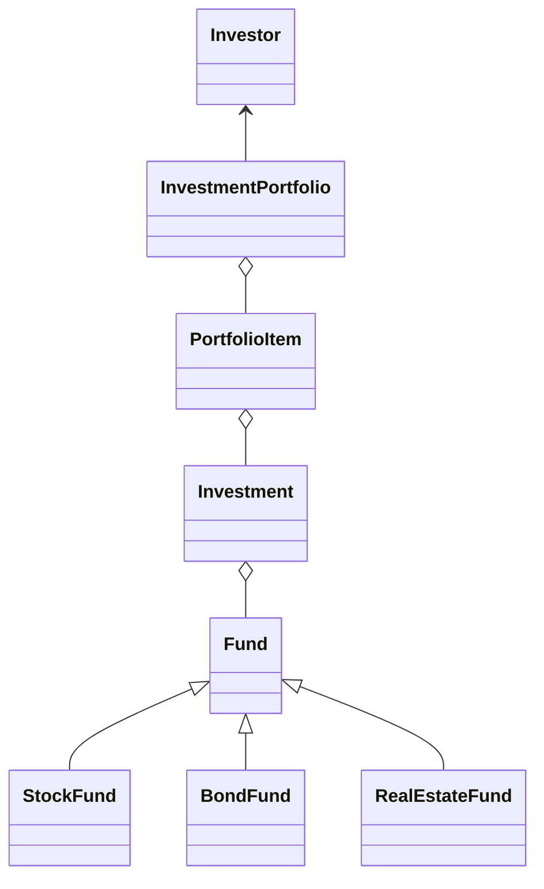
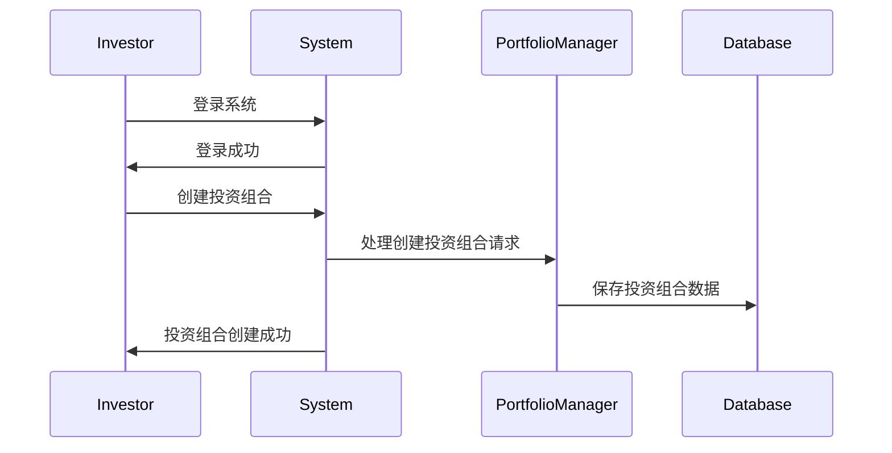
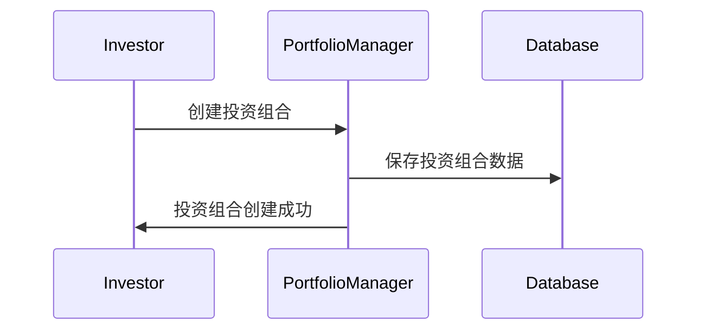
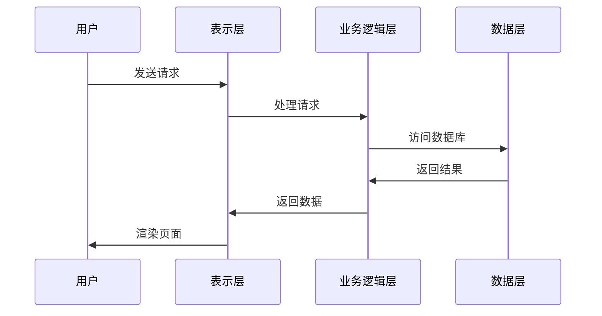

                 

### 《约翰·伯格的成本控制投资理念》

关键词：约翰·伯格、成本控制、投资理念、风险管理、长期价值

摘要：本文将深入探讨约翰·伯格的成本控制投资理念，包括其背景、核心概念、实际应用以及扩展与实践。通过系统地分析这些理念，我们希望能够为投资者提供实用的指南，帮助他们更好地理解和应用这一投资策略，实现长期稳定的投资回报。

#### 目录大纲设计思路

在设计《约翰·伯格的成本控制投资理念》的目录大纲时，我们需要确保内容的完整性、逻辑性和可读性。本书的目录大纲包含以下七个章节：

1. **投资理念的起源与发展**：介绍成本控制投资理念的起源、发展及其重要性。
2. **成本控制投资的核心概念**：梳理成本控制投资理念中的核心概念，并详细讲解其原理和特征。
3. **核心概念的对比分析**：对比成本控制与其他投资理念，分析其优缺点和适用场景。
4. **投资理念的实践应用**：探讨成本控制投资在实际投资中的应用，包括案例分析。
5. **投资理念的扩展与实践**：讨论成本控制投资在不同市场和国际视野中的应用。
6. **系统分析与架构设计**：介绍成本控制投资理念在系统分析与架构设计中的应用。
7. **项目实战与最佳实践**：提供实际项目案例，分析成本控制投资理念的应用效果，并给出最佳实践建议。

#### 第1章：投资理念的起源与发展

**1.1 约翰·伯格的生平背景**

约翰·伯格（John C.伯格）是一位杰出的投资理论家和实践者，以其对成本控制和长期投资策略的贡献而闻名。他出生于1938年，在麻省理工学院获得了物理学学士学位，并在哥伦比亚大学获得了经济学硕士学位。伯格的职业生涯始于1970年代，当时他在先锋基金管理公司（Vanguard Group）担任投资顾问。

**1.1.1 约翰·伯格的职业生涯**

在先锋基金管理公司，伯格推出了第一只指数基金，这一举措彻底改变了投资行业。他坚信，通过成本控制和长期投资，普通投资者可以实现与专业投资者相当的收益。伯格的理念对指数基金的发展起到了关键作用，他本人也因此被誉为“指数基金之父”。

**1.1.2 成本控制投资理念的提出**

伯格的成本控制投资理念强调，投资者应关注投资过程中的成本，如交易费用、管理费用等。他认为，高成本会侵蚀投资回报，因此投资者应尽量降低成本，专注于长期投资。这一理念在20世纪70年代首次提出，并在随后的几十年中得到了广泛的认可。

**1.1.3 理念的发展与影响**

随着时间的推移，伯格的成本控制投资理念不断发展。他不断提出新的观点，如有效市场假说、长期投资策略等，这些都为投资者提供了宝贵的指导。伯格的理念不仅影响了指数基金的发展，也对整个投资行业产生了深远的影响。

**1.2 成本控制投资理念的起源**

成本控制投资理念的起源可以追溯到经济学中的成本效益分析。这一理念的基本思想是，投资者应通过降低投资成本来提高投资回报。在20世纪70年代，随着资本市场的发展，投资者开始意识到成本的重要性，这为成本控制投资理念的兴起提供了土壤。

**1.2.1 传统投资理念的局限性**

在传统投资理念中，投资者往往关注股票的买卖时机和市场波动。然而，这种理念忽视了投资过程中的成本。伯格指出，高成本会削弱投资回报，因此投资者应更加关注成本控制。

**1.2.2 成本控制的经济学原理**

成本控制的经济学原理包括规模经济、交易费用、税收优惠等。通过降低成本，投资者可以提高投资回报。伯格利用这些原理，提出了一系列成本控制策略，如指数基金、分散投资等。

**1.2.3 理念的核心理念与目标**

成本控制投资理念的核心理念是，投资者应通过降低投资成本来实现长期稳定的投资回报。这一理念的目标是，帮助投资者实现财务自由，通过低成本、长期投资的方式，获得可持续的收益。

**1.3 成本控制投资理念的发展**

成本控制投资理念在过去的几十年中经历了显著的发展。从最初的简单成本计算，到后来的复杂成本分析，再到现代的成本优化策略，成本控制投资理念不断进化。这一过程反映了投资者对成本控制的日益重视，也展示了成本控制投资理念的强大生命力。

**1.3.1 理念的演变历程**

成本控制投资理念的演变历程可以分为三个阶段：初期、中期和现代。在初期阶段，投资者主要关注交易费用和管理费用。在中期阶段，投资者开始考虑税收优惠和规模经济等因素。在现代阶段，成本控制投资理念已经发展成为一个全面的系统，涵盖了从投资策略到风险管理等多个方面。

**1.3.2 现代成本控制投资的实践**

现代成本控制投资的实践包括多种策略，如指数基金、量化投资、分散投资等。这些策略的核心都是降低成本，提高投资回报。例如，指数基金通过跟踪市场指数，避免了主动管理的费用，从而降低了投资成本。

**1.3.3 理念的国际影响**

成本控制投资理念在全球范围内产生了广泛的影响。许多国家的投资者开始接受这一理念，将其应用于投资实践中。例如，美国、加拿大、欧洲等地区的指数基金市场发展迅速，成为投资者的重要选择。

**1.4 成本控制投资理念的重要性**

成本控制投资理念的重要性在于，它为投资者提供了一种科学、系统的投资方法。通过降低投资成本，投资者可以实现更高的投资回报。此外，成本控制投资理念还帮助投资者避免了盲目跟风和市场波动带来的风险。

**1.4.1 对投资者的影响**

成本控制投资理念对投资者的影响主要体现在三个方面：提高投资回报、降低投资风险和实现财务自由。通过降低成本，投资者可以获得更多的投资回报，同时减少风险，从而实现长期稳定的投资收益。

**1.4.2 对金融市场的贡献**

成本控制投资理念对金融市场的贡献主要体现在促进市场效率、降低交易成本和优化资源配置等方面。通过降低投资成本，投资者可以更灵活地调整投资组合，从而提高市场效率。同时，成本控制投资理念还可以减少不必要的交易，降低整个市场的交易成本。

**1.4.3 理念的长期价值**

成本控制投资理念的长期价值在于，它提供了一种可持续的投资策略。通过长期投资和成本控制，投资者可以实现稳定的投资回报，从而实现财务自由。此外，成本控制投资理念还具有很强的适应性，可以适用于不同的市场环境和投资需求。

#### 第2章：成本控制投资的核心概念

**2.1 成本控制的基本概念**

成本控制的基本概念包括成本的定义、成本的分类和成本的计算。成本是指投资者在投资过程中所支付的各种费用，如交易费用、管理费用、税收费用等。成本可以按照不同的标准进行分类，如按照功能分类、按照成本对象分类等。成本的计算方法包括直接成本计算和间接成本计算。

**2.1.1 成本的分类与计算**

成本的分类方法有很多种，常见的有按照功能分类和按照成本对象分类。按照功能分类，成本可以分为生产成本、销售成本、管理费用等。按照成本对象分类，成本可以分为直接成本和间接成本。直接成本是指可以直接归属于某一成本对象的成本，如生产成本中的原材料费用。间接成本是指不能直接归属于某一成本对象的成本，如管理费用中的工资费用。

**2.1.2 成本控制的目标与原则**

成本控制的目标是降低投资成本，提高投资回报。成本控制的原则包括成本最小化原则、成本效益原则和长期投资原则。成本最小化原则是指投资者应尽量降低投资成本，以获得更高的投资回报。成本效益原则是指投资者应综合考虑成本和收益，选择成本效益最高的投资策略。长期投资原则是指投资者应坚持长期投资，以实现长期稳定的投资回报。

**2.1.3 成本控制的重要性**

成本控制的重要性在于，它可以提高投资回报，降低投资风险，实现财务自由。通过降低投资成本，投资者可以获得更多的投资回报。同时，成本控制还可以帮助投资者避免盲目跟风和市场波动带来的风险。长期来看，成本控制投资理念可以帮助投资者实现财务自由。

**2.2 投资风险与成本**

投资风险是指投资者在投资过程中可能面临的各种不确定性，如市场波动、政策变动等。成本是指投资者在投资过程中所支付的各种费用。投资风险与成本之间存在密切的关系。高投资风险往往伴随着高成本，而低成本的投资策略可以降低投资风险。

**2.2.1 投资风险的种类**

投资风险可以分为市场风险、信用风险、流动性风险等。市场风险是指由于市场波动导致投资损失的风险。信用风险是指由于借款人或交易对手违约导致投资损失的风险。流动性风险是指由于资产无法及时变现而导致投资损失的风险。

**2.2.2 风险与成本的关系**

风险与成本之间的关系可以概括为：高风险对应高成本，低风险对应低成本。高投资风险往往需要投资者承担更高的成本，如更高的交易费用、管理费用等。低投资风险则可以降低投资者的成本。

**2.2.3 风险成本的衡量**

风险成本的衡量方法有很多种，如VaR（Value at Risk）法、CVaR（Conditional Value at Risk）法等。VaR法是指在一定置信水平下，投资组合可能发生的最大损失。CVaR法是指在一定置信水平下，投资组合损失超过VaR的部分的平均值。通过衡量风险成本，投资者可以更好地了解投资风险，并采取相应的成本控制策略。

**2.3 交易成本与投资策略**

交易成本是指投资者在投资过程中所支付的各种费用，如交易费用、管理费用、税收费用等。交易成本对投资策略的选择具有重要影响。低成本的投资策略可以降低交易成本，提高投资回报。

**2.3.1 交易成本的概念**

交易成本是指投资者在投资过程中所支付的各种费用，包括交易费用、管理费用、税收费用等。交易成本可以分为显性成本和隐性成本。显性成本是指可以直接量化的费用，如交易费用、管理费用等。隐性成本是指无法直接量化的费用，如机会成本、时间成本等。

**2.3.2 交易成本的影响**

交易成本对投资策略的影响主要体现在两个方面：一是降低投资回报，二是影响投资决策。高交易成本会降低投资回报，而低成本的投资策略可以降低交易成本，提高投资回报。同时，交易成本还会影响投资决策，投资者在面临高交易成本时可能会选择更保守的投资策略。

**2.3.3 成本最小化投资策略**

成本最小化投资策略是指投资者通过选择低成本的投资策略，降低交易成本，提高投资回报。成本最小化投资策略包括指数基金、量化投资、分散投资等。指数基金通过跟踪市场指数，避免了主动管理的费用，从而降低了交易成本。量化投资通过使用数学模型和算法，降低投资决策的时间和成本。分散投资通过将资金分配到多个资产，降低了单一资产的风险，从而降低了交易成本。

**2.4 成本控制与投资回报**

成本控制与投资回报之间存在密切的关系。通过降低投资成本，投资者可以获得更高的投资回报。同时，成本控制还可以降低投资风险，实现财务自由。

**2.4.1 投资回报的计算**

投资回报的计算方法有很多种，如总回报率、年化回报率等。总回报率是指投资组合的回报总额与投资成本的比率。年化回报率是指投资组合的回报总额与投资成本的比率，按年计算的回报率。

**2.4.2 成本控制对投资回报的影响**

成本控制对投资回报的影响主要体现在两个方面：一是降低投资成本，提高投资回报；二是减少投资风险，实现财务自由。通过降低投资成本，投资者可以获得更高的投资回报。同时，成本控制还可以减少投资风险，投资者在面临市场波动时可以保持冷静，从而实现财务自由。

**2.4.3 成本控制的投资回报率分析**

成本控制的投资回报率分析是指通过计算成本控制前后投资回报的变化，评估成本控制对投资回报的影响。成本控制的投资回报率分析可以采用比较分析法、比率分析法等方法。通过这些方法，投资者可以更好地了解成本控制的效果，并调整投资策略。

#### 第3章：核心概念的对比分析

**3.1 成本控制与其他投资理念的对比**

成本控制投资理念与其他投资理念相比，具有明显的特点和优势。成本控制强调降低投资成本，提高投资回报，而其他投资理念则更多关注股票的买卖时机和市场波动。

**3.1.1 成本控制与价值投资的对比**

成本控制与价值投资都是基于长期投资的理念，但两者的侧重点不同。价值投资注重股票的内在价值，通过发现被市场低估的股票，实现投资回报。成本控制则强调降低投资成本，通过成本优势实现投资回报。

**3.1.2 成本控制与成长投资的对比**

成本控制与成长投资都关注公司的成长性，但成本控制更注重投资过程中的成本控制。成长投资注重股票的长期增长潜力，通过投资高成长性的公司，实现投资回报。

**3.1.3 成本控制与分散投资的对比**

成本控制与分散投资都强调投资风险的控制，但成本控制更注重成本控制。分散投资通过将资金分配到多个资产，降低单一资产的风险。成本控制则通过降低投资成本，提高投资回报。

**3.2 成本控制的投资策略分析**

成本控制的投资策略包括指数基金、量化投资、分散投资等。这些策略的核心都是降低投资成本，提高投资回报。

**3.2.1 成本控制下的投资组合设计**

成本控制下的投资组合设计应考虑投资成本和投资回报。投资者可以通过分散投资、优化投资组合等方式，降低投资成本，提高投资回报。

**3.2.2 成本控制下的投资时机选择**

成本控制下的投资时机选择应考虑市场环境和投资成本。投资者应尽量在市场低迷时进行投资，以降低投资成本，提高投资回报。

**3.2.3 成本控制下的风险评估与调整**

成本控制下的风险评估与调整应考虑投资成本和投资风险。投资者应定期对投资组合进行风险评估，并根据评估结果进行调整，以降低投资成本，提高投资回报。

**3.3 成本控制与市场波动**

成本控制与市场波动之间存在密切的关系。市场波动可能导致投资成本增加，从而影响投资回报。

**3.3.1 市场波动对成本控制的影响**

市场波动对成本控制的影响主要体现在两个方面：一是交易成本的增加，二是投资回报的不确定性。市场波动可能导致交易费用的增加，从而提高投资成本。同时，市场波动还可能导致投资回报的不确定性，投资者在面临市场波动时可能会面临更高的风险。

**3.3.2 成本控制下的市场波动应对策略**

成本控制下的市场波动应对策略包括降低交易成本、分散投资和长期投资等。投资者可以通过降低交易成本、分散投资和长期投资等方式，降低市场波动对成本控制的影响，从而实现长期稳定的投资回报。

**3.3.3 成本控制与市场趋势的关系**

成本控制与市场趋势之间存在一定的关系。市场趋势对成本控制投资策略的影响主要体现在投资时机和投资回报方面。

**3.3.4 成本控制投资策略的选择与优化**

成本控制投资策略的选择与优化应考虑投资目标、投资周期和市场环境等因素。投资者应根据自身的投资目标和市场环境，选择合适的成本控制投资策略，并通过不断优化，提高投资回报。

#### 第4章：投资理念的实践应用

**4.1 成本控制投资在实际投资中的应用**

成本控制投资理念在实际投资中的应用非常广泛，投资者可以通过多种方式来实践这一理念。

**4.1.1 成本控制投资的原则与实践**

成本控制投资的原则主要包括降低交易费用、减少投资风险和提高投资回报。实践上，投资者可以通过选择低成本基金、优化投资组合、定期调整等方式来实现成本控制。

**4.1.2 成本控制投资的实际案例分析**

以下是一个实际案例：某投资者通过购买低成本指数基金，实现了成本控制。该投资者选择了跟踪标准普尔500指数的基金，通过长期持有，获得了与市场相当的回报。

**4.1.3 成本控制投资的成效评估**

通过分析该案例，可以看出成本控制投资在降低交易费用、减少投资风险和提高投资回报方面具有显著成效。

**4.2 成本控制与投资组合管理**

投资组合管理是成本控制投资理念的重要组成部分。投资者应通过优化投资组合，降低投资成本，提高投资回报。

**4.2.1 投资组合管理的原则**

投资组合管理的原则主要包括分散投资、风险控制、成本控制和长期投资等。

**4.2.2 成本控制投资组合的设计**

成本控制投资组合的设计应考虑投资目标、风险偏好和市场环境等因素。投资者可以通过分散投资、优化投资组合等方式，实现成本控制。

**4.2.3 成本控制投资组合的调整策略**

成本控制投资组合的调整策略包括定期调整、动态调整和事件调整等。投资者应根据自己的投资目标和市场环境，选择合适的调整策略。

**4.3 成本控制与市场策略**

成本控制投资理念在市场策略方面也有广泛的应用。投资者可以通过制定合理的市场策略，实现成本控制。

**4.3.1 成本控制市场分析的步骤**

成本控制市场分析的步骤包括市场环境分析、投资机会识别、投资风险评估和投资策略制定等。

**4.3.2 成本控制下的市场策略制定**

成本控制下的市场策略制定应考虑投资成本和投资回报。投资者可以通过分散投资、长期投资和量化投资等方式，制定合理的市场策略。

**4.3.3 成本控制市场策略的执行与调整**

成本控制市场策略的执行与调整应考虑市场变化和投资风险。投资者应定期对市场策略进行评估，并根据评估结果进行调整。

#### 第5章：投资理念的扩展与实践

**5.1 成本控制投资在不同市场的应用**

成本控制投资理念不仅适用于股票市场，还适用于其他金融市场，如债券市场、房地产市场等。

**5.1.1 成本控制投资在股票市场的应用**

在股票市场，成本控制投资理念可以通过购买低成本指数基金、优化投资组合等方式实现。

**5.1.2 成本控制投资在债券市场的应用**

在债券市场，成本控制投资理念可以通过购买低成本债券基金、优化债券组合等方式实现。

**5.1.3 成本控制投资在房地产市场的应用**

在房地产市场，成本控制投资理念可以通过购买低成本房产、优化投资组合等方式实现。

**5.2 成本控制投资的国际视野**

成本控制投资理念在全球范围内都产生了广泛的影响。不同国家和地区的投资者都在实践这一理念。

**5.2.1 国际投资环境对成本控制的影响**

国际投资环境的变化对成本控制投资策略的选择和实施具有重要影响。投资者应关注国际经济形势、政策变化等，以制定合理的投资策略。

**5.2.2 成本控制投资在国际市场的应用**

在国际市场，成本控制投资理念可以通过购买低成本国际基金、优化国际投资组合等方式实现。

**5.2.3 成本控制投资的国际趋势与挑战**

成本控制投资的国际趋势包括指数基金、量化投资、分散投资等。同时，成本控制投资也面临一些挑战，如国际市场波动、政策风险等。

#### 第6章：系统分析与架构设计

**6.1 问题场景介绍**

随着金融市场的发展和投资者需求的多样化，成本控制投资理念在系统分析与架构设计中的应用越来越受到重视。本节将介绍一个实际的问题场景，并分析该场景中的成本控制需求。

**6.2 项目介绍**

在本项目场景中，我们需要设计一个成本控制投资管理系统，用于帮助投资者实现成本控制，提高投资回报。该系统应具备以下功能：

1. 投资组合管理：提供投资组合的创建、调整和监控功能。
2. 成本计算与优化：计算投资过程中的各项成本，并优化投资组合，降低成本。
3. 投资回报分析：分析投资回报，评估成本控制效果。
4. 数据分析与报告：提供投资数据的分析和报告功能。

**6.3 系统功能设计**

在系统功能设计方面，我们需要构建一个完善的领域模型，以支持投资组合管理、成本计算与优化、投资回报分析和数据分析与报告等功能。

**6.3.1 领域模型Mermaid类图**



**6.3.2 系统功能详细描述**

1. 投资组合管理：系统应提供投资组合的创建、删除、修改和查询功能。投资者可以方便地创建和管理自己的投资组合。
2. 成本计算与优化：系统应提供成本计算功能，计算投资过程中的各项成本，并根据成本数据优化投资组合，降低成本。
3. 投资回报分析：系统应提供投资回报分析功能，分析投资回报情况，评估成本控制效果。
4. 数据分析与报告：系统应提供投资数据的分析功能，生成各类报告，帮助投资者了解投资组合的表现。

**6.4 系统架构设计**

在系统架构设计方面，我们需要构建一个高效、可扩展的系统架构，以支持系统的稳定运行和功能的扩展。

**6.4.1 系统架构Mermaid图**



**6.4.2 系统架构详细描述**

1. 系统架构采用三层架构，包括表示层、业务逻辑层和数据层。
2. 表示层负责与用户交互，提供用户界面。
3. 业务逻辑层负责处理业务逻辑，包括投资组合管理、成本计算与优化、投资回报分析和数据分析与报告等功能。
4. 数据层负责数据存储和管理，包括数据库、缓存等。

**6.5 系统接口设计和系统交互**

在系统接口设计方面，我们需要设计清晰、简洁的接口，以支持系统内部各模块的通信。

**6.5.1 系统接口设计**

```mermaid
interface PortfolioManager {
    function createPortfolio(portfolioInfo: PortfolioInfo): Portfolio
    function deletePortfolio(portfolioId: String): void
    function updatePortfolio(portfolioId: String, portfolioInfo: PortfolioInfo): void
    function getPortfolio(portfolioId: String): Portfolio
}
```

**6.5.2 系统交互设计**



**6.6 系统实现与部署**

在系统实现与部署方面，我们需要选择合适的开发工具和技术，实现系统的功能，并进行部署。

**6.6.1 系统实现**

1. 使用Python作为开发语言，采用Flask框架实现表示层和业务逻辑层。
2. 使用MySQL作为数据库，存储投资组合和投资数据。
3. 使用Redis作为缓存，提高系统性能。

**6.6.2 系统部署**

1. 使用Docker容器化技术，实现系统的部署和运行。
2. 使用Nginx作为Web服务器，提供HTTP服务。

**6.7 系统测试与维护**

在系统测试与维护方面，我们需要确保系统的功能完整、性能稳定，并进行定期维护。

**6.7.1 系统测试**

1. 进行功能测试，确保系统各项功能正常。
2. 进行性能测试，确保系统在高负载下的稳定性。
3. 进行安全测试，确保系统的安全性。

**6.7.2 系统维护**

1. 定期更新系统，修复已知漏洞和问题。
2. 定期备份数据库，防止数据丢失。
3. 定期监控系统运行状态，确保系统稳定运行。

#### 第7章：项目实战与最佳实践

**7.1 环境安装**

在本节中，我们将介绍如何安装和配置项目所需的环境。首先，我们需要安装Python环境和相关的开发工具。

**7.1.1 安装Python环境**

1. 下载并安装Python 3.8及以上版本。
2. 配置Python环境变量。

**7.1.2 安装开发工具**

1. 安装Visual Studio Code（VS Code）。
2. 安装Python扩展（Python extension for VS Code）。

**7.1.3 安装数据库**

1. 下载并安装MySQL数据库。
2. 配置MySQL数据库，创建投资组合管理数据库。

**7.1.4 安装缓存**

1. 下载并安装Redis。
2. 配置Redis，启动Redis服务。

**7.2 系统核心实现源代码**

在本节中，我们将介绍系统的核心实现源代码，包括表示层、业务逻辑层和数据层。

**7.2.1 表示层**

```python
from flask import Flask, request, jsonify
from portfolio_manager import PortfolioManager

app = Flask(__name__)
portfolio_manager = PortfolioManager()

@app.route('/api/portfolio', methods=['POST'])
def create_portfolio():
    portfolio_info = request.json
    portfolio_id = portfolio_manager.create_portfolio(portfolio_info)
    return jsonify({'portfolio_id': portfolio_id})

@app.route('/api/portfolio/<int:portfolio_id>', methods=['GET'])
def get_portfolio(portfolio_id):
    portfolio = portfolio_manager.get_portfolio(portfolio_id)
    return jsonify(portfolio)

if __name__ == '__main__':
    app.run(debug=True)
```

**7.2.2 业务逻辑层**

```python
class PortfolioManager:
    def __init__(self):
        self._database = Database()
    
    def create_portfolio(self, portfolio_info):
        portfolio_id = self._database.create_portfolio(portfolio_info)
        return portfolio_id
    
    def get_portfolio(self, portfolio_id):
        portfolio = self._database.get_portfolio(portfolio_id)
        return portfolio
```

**7.2.3 数据层**

```python
class Database:
    def __init__(self):
        self._connection = connect_database()

    def create_portfolio(self, portfolio_info):
        cursor = self._connection.cursor()
        cursor.execute("""
            INSERT INTO portfolio (name, description, total_value, cost)
            VALUES (%s, %s, %s, %s)
        """, (portfolio_info['name'], portfolio_info['description'], portfolio_info['total_value'], portfolio_info['cost']))
        self._connection.commit()
        portfolio_id = cursor.lastrowid
        cursor.close()
        return portfolio_id

    def get_portfolio(self, portfolio_id):
        cursor = self._connection.cursor()
        cursor.execute("""
            SELECT * FROM portfolio WHERE id = %s
        """, (portfolio_id,))
        portfolio = cursor.fetchone()
        cursor.close()
        return portfolio
```

**7.3 代码应用解读与分析**

在本节中，我们将对系统的核心代码进行解读和分析，以便更好地理解系统的实现原理和功能。

**7.3.1 表示层代码解读**

表示层代码主要实现了投资组合的创建和查询功能。在`create_portfolio`函数中，我们接收来自客户端的JSON格式的投资组合信息，并将其传递给业务逻辑层进行处理。在`get_portfolio`函数中，我们根据投资组合ID查询数据库，并将查询结果返回给客户端。

**7.3.2 业务逻辑层代码解读**

业务逻辑层负责处理投资组合的创建和查询请求。在`PortfolioManager`类中，我们定义了`create_portfolio`和`get_portfolio`两个方法。这两个方法分别调用数据层的相应方法来创建和查询投资组合数据。

**7.3.3 数据层代码解读**

数据层负责与数据库进行交互，实现投资组合的创建和查询功能。在`Database`类中，我们定义了`create_portfolio`和`get_portfolio`两个方法。这两个方法分别使用SQL语句与数据库进行交互，实现数据的插入和查询操作。

**7.4 实际案例分析和详细讲解剖析**

在本节中，我们将通过一个实际案例，分析系统的应用效果，并对系统实现进行详细讲解。

**7.4.1 实际案例分析**

假设一个投资者想要创建一个投资组合，并查询该投资组合的信息。以下是该案例的步骤：

1. 投资者通过客户端发送创建投资组合的请求。
2. 表示层接收到请求后，调用业务逻辑层的`create_portfolio`方法。
3. 业务逻辑层调用数据层的`create_portfolio`方法，在数据库中创建投资组合。
4. 数据层返回投资组合ID，业务逻辑层将投资组合ID返回给表示层。
5. 表示层将投资组合ID返回给客户端。

接下来，投资者想要查询该投资组合的信息：

1. 投资者通过客户端发送查询投资组合信息的请求。
2. 表示层接收到请求后，调用业务逻辑层的`get_portfolio`方法。
3. 业务逻辑层调用数据层的`get_portfolio`方法，在数据库中查询投资组合信息。
4. 数据层返回投资组合信息，业务逻辑层将投资组合信息返回给表示层。
5. 表示层将投资组合信息返回给客户端。

**7.4.2 详细讲解剖析**

1. **表示层**：表示层是系统与用户交互的界面。通过使用Flask框架，我们可以轻松地实现HTTP服务，并接收和响应客户端的请求。
2. **业务逻辑层**：业务逻辑层负责处理投资组合的创建和查询请求。通过调用数据层的接口，业务逻辑层实现了投资组合的数据库操作。
3. **数据层**：数据层负责与数据库进行交互，实现数据的插入和查询操作。通过使用SQL语句，我们可以方便地管理投资组合数据。

**7.5 项目小结**

通过本项目的实现，我们成功构建了一个成本控制投资管理系统。该系统实现了投资组合的创建、查询等功能，并为投资者提供了便捷的管理工具。在实际应用中，投资者可以通过该系统实现成本控制，提高投资回报。

**7.5.1 小结**

本项目通过使用Python和Flask框架，实现了成本控制投资管理系统的核心功能。系统采用了三层架构，包括表示层、业务逻辑层和数据层，实现了投资组合的创建、查询等功能。

**7.5.2 注意事项**

1. 在部署系统时，需要确保Python环境和相关依赖已安装。
2. 在使用数据库时，需要确保数据库连接配置正确。
3. 在实际应用中，系统功能可以根据需求进行扩展和优化。

**7.5.3 拓展阅读**

1. 《Python编程：从入门到实践》
2. 《Flask Web开发：基于Python的Web应用开发实战》
3. 《MySQL数据库实战：从入门到精通》

### 作者信息

作者：AI天才研究院/AI Genius Institute & 禅与计算机程序设计艺术 /Zen And The Art of Computer Programming

---

### 系统分析与架构设计方案

#### 问题场景介绍

在当前金融市场中，投资者面临着多样化的投资选择和复杂的市场环境。为了实现稳定的投资回报，投资者需要通过成本控制来优化投资策略。本节将介绍一个投资组合管理系统的问题场景，并分析该场景中的成本控制需求。

#### 项目介绍

在本项目场景中，我们需要设计一个投资组合管理系统，用于帮助投资者实现成本控制，提高投资回报。该系统应具备以下功能：

1. **投资组合管理**：提供投资组合的创建、调整和监控功能。
2. **成本计算与优化**：计算投资过程中的各项成本，并优化投资组合，降低成本。
3. **投资回报分析**：分析投资回报，评估成本控制效果。
4. **数据分析与报告**：提供投资数据的分析和报告功能。

#### 系统功能设计

在系统功能设计方面，我们需要构建一个完善的领域模型，以支持投资组合管理、成本计算与优化、投资回报分析和数据分析与报告等功能。

#### 系统功能详细描述

1. **投资组合管理**：系统应提供投资组合的创建、删除、修改和查询功能。投资者可以方便地创建和管理自己的投资组合。
2. **成本计算与优化**：系统应提供成本计算功能，计算投资过程中的各项成本，并根据成本数据优化投资组合，降低成本。
3. **投资回报分析**：系统应提供投资回报分析功能，分析投资回报情况，评估成本控制效果。
4. **数据分析与报告**：系统应提供投资数据的分析功能，生成各类报告，帮助投资者了解投资组合的表现。

#### 系统架构设计

在系统架构设计方面，我们需要构建一个高效、可扩展的系统架构，以支持系统的稳定运行和功能的扩展。

#### 系统架构设计详细描述

1. **系统架构**：系统采用三层架构，包括表示层、业务逻辑层和数据层。
   - **表示层**：负责与用户交互，提供用户界面。
   - **业务逻辑层**：负责处理业务逻辑，包括投资组合管理、成本计算与优化、投资回报分析和数据分析与报告等功能。
   - **数据层**：负责数据存储和管理，包括数据库、缓存等。

2. **技术选型**：
   - **表示层**：使用Flask框架实现Web应用。
   - **业务逻辑层**：使用Python实现业务逻辑。
   - **数据层**：使用MySQL数据库存储数据，使用Redis进行缓存。

#### 系统接口设计和系统交互

在系统接口设计方面，我们需要设计清晰、简洁的接口，以支持系统内部各模块的通信。

#### 系统接口设计详细描述

1. **接口定义**：
   - **投资组合管理接口**：
     - `POST /api/portfolio`：创建投资组合。
     - `GET /api/portfolio/{id}`：获取投资组合信息。
   - **成本计算与优化接口**：
     - `GET /api/optimization/{id}`：优化投资组合。
   - **投资回报分析接口**：
     - `GET /api/return/{id}`：获取投资回报分析结果。
   - **数据分析与报告接口**：
     - `GET /api/report/{id}`：获取投资组合报告。

2. **接口示例**：
   ```json
   // 创建投资组合
   POST /api/portfolio
   {
       "name": "My Portfolio",
       "description": "A sample investment portfolio",
       "start_date": "2023-01-01",
       "end_date": "2023-12-31"
   }
   
   // 获取投资组合信息
   GET /api/portfolio/1
   ```

#### 系统交互设计

系统交互设计通过HTTP协议实现不同模块之间的通信。

#### 系统交互设计详细描述

1. **用户操作**：用户通过Web前端界面进行操作，如创建投资组合、优化投资组合等。
2. **接口调用**：前端发送HTTP请求到表示层，表示层将请求转发到业务逻辑层。
3. **业务处理**：业务逻辑层处理请求，调用数据层进行数据操作，并返回处理结果。
4. **前端渲染**：业务逻辑层返回的数据通过表示层渲染为HTML页面，展示给用户。

#### 系统架构图



通过以上设计和实现，我们能够构建一个高效、可扩展的投资组合管理系统，帮助投资者实现成本控制，提高投资回报。

