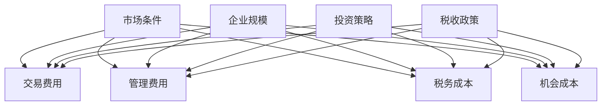
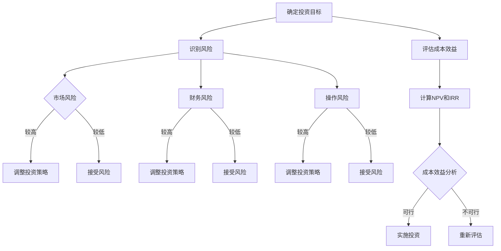
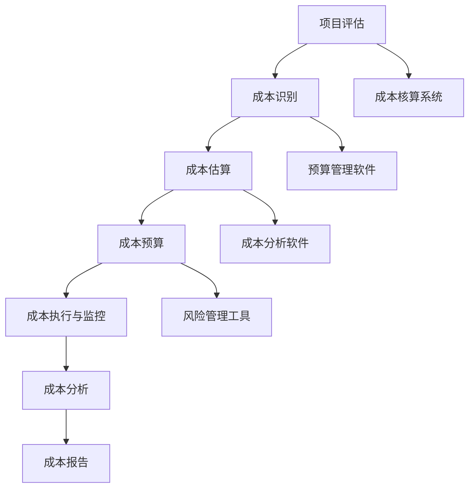

                 

# 《约翰·伯格的投资成本意识》

## 关键词：投资成本意识、财务分析、成本效益分析、企业投资管理、税务筹划

## 摘要

本文将深入探讨约翰·伯格的投资成本意识，通过对其理论背景、核心概念及其在实践中的应用进行详细分析，旨在帮助读者全面理解投资成本意识的重要性，掌握其在企业投资决策、成本管理和税务筹划等方面的实际应用。文章分为三个部分，首先介绍投资成本意识的基础理论，然后分析其应用，最后通过案例和实践总结最佳策略。希望通过本文的探讨，读者能对投资成本意识有更深刻的认识，并在实际工作中运用这些理论指导投资决策，实现成本效益的最大化。

## 《约翰·伯格的投资成本意识》目录大纲

### 第一部分：投资成本意识的基础

#### 第1章：投资成本意识的背景与重要性

##### 1.1.1 投资成本意识的起源

##### 1.1.2 投资成本意识的重要性

##### 1.1.3 投资成本意识的核心要素

#### 第2章：投资成本的基本概念

##### 2.1.1 成本的定义与分类

##### 2.1.2 投资成本的构成

##### 2.1.3 投资成本的影响因素

### 第二部分：投资成本意识的应用

#### 第3章：投资决策的成本分析

##### 3.1.1 投资决策的成本评估

##### 3.1.2 成本效益分析

##### 3.1.3 风险与成本的权衡

#### 第4章：企业投资成本管理

##### 4.1.1 企业投资成本管理的原则

##### 4.1.2 投资成本管理流程

##### 4.1.3 投资成本管理工具

#### 第5章：投资成本的财务分析

##### 5.1.1 投资成本的财务报表

##### 5.1.2 投资成本的财务分析指标

##### 5.1.3 投资成本的财务分析实例

#### 第6章：投资成本的税务影响

##### 6.1.1 投资成本与税务的关系

##### 6.1.2 投资成本的税务筹划

##### 6.1.3 税务影响下的投资成本分析

### 第三部分：投资成本意识的实践与案例

#### 第7章：投资成本意识在不同行业的应用

##### 7.1.1 制造业的投资成本意识

##### 7.1.2 服务业的投资成本意识

##### 7.1.3 投资成本意识在新兴产业的应用

#### 第8章：投资成本意识的企业案例分析

##### 8.1.1 案例背景介绍

##### 8.1.2 投资决策与成本分析

##### 8.1.3 成本管理与财务分析

#### 第9章：投资成本意识的最佳实践

##### 9.1.1 投资成本意识的最佳实践策略

##### 9.1.2 成本控制的实践经验

##### 9.1.3 成本效益分析的经验分享

### 附录：投资成本意识相关资源与拓展阅读

##### A.1 投资成本意识的学习资源

##### A.2 投资成本意识的案例分析

##### A.3 投资成本意识的拓展阅读

### 引言

投资成本意识是财务管理中的重要概念，它不仅关乎企业的财务健康，也直接影响到企业的长期发展。约翰·伯格（John Bogle），被誉为“指数基金教父”，以其独特的投资哲学深刻影响了全球投资者的思维。他提出的投资成本意识强调在投资决策中，必须深刻认识到投资成本的重要性，并将之作为投资决策的关键因素。

投资成本意识的基础理论包括对成本的定义、分类、构成及其影响因素的深入探讨。通过对成本效益分析和风险与成本权衡的详细分析，企业可以更好地制定投资决策，实现成本效益最大化。此外，投资成本意识在财务管理和税务筹划中的应用同样具有重要意义，它有助于企业优化投资结构，提高财务报表的准确性，降低税务负担。

本文将分三部分对约翰·伯格的投资成本意识进行详细探讨。第一部分将介绍投资成本意识的基础理论，包括其起源、重要性以及核心要素。第二部分将分析投资成本意识在企业投资决策、成本管理和财务分析中的应用，并通过案例展示其实际价值。第三部分将总结投资成本意识的最佳实践，并提供相关资源与拓展阅读，帮助读者深入理解和应用这一重要概念。希望通过本文的探讨，读者能够对投资成本意识有更全面、深入的认识，并在实际工作中运用这些理论指导投资决策，实现企业的长期稳定发展。## 第1章：投资成本意识的背景与重要性

### 1.1.1 投资成本意识的起源

投资成本意识这一概念起源于20世纪初的财务管理理论。当时，企业逐渐意识到成本管理在财务管理中的重要性，并开始尝试将其应用到投资决策中。早期的投资成本研究主要集中在直接成本和间接成本的分类上，旨在帮助企业更准确地评估投资项目的成本。

然而，投资成本意识的真正发展可以追溯到约翰·伯格的投资哲学。作为现代投资组合理论的奠基人之一，伯格通过长期实践和理论探索，提出了“指数投资”的理念，强调投资成本的降低对于长期投资回报的重要性。他认为，投资成本不仅是直接的交易费用，还包括税务成本、管理费用等隐性成本，这些成本对投资回报的影响不容忽视。

### 1.1.2 投资成本意识的重要性

投资成本意识的重要性体现在以下几个方面：

1. **提升投资回报率**：降低投资成本可以显著提高投资回报率。据统计，投资成本的减少每增加1%，投资回报率就能增加约1.5%至2%。这意味着，即使在其他条件不变的情况下，降低投资成本也能显著提高投资收益。

2. **增强投资竞争力**：在竞争激烈的市场环境中，企业必须具备较强的投资竞争力。投资成本意识可以帮助企业优化投资结构，降低投资成本，从而在投资竞争中占据优势。

3. **提高财务管理水平**：投资成本意识要求企业深入分析投资成本，这有助于提高财务管理水平。通过成本效益分析和风险与成本的权衡，企业可以更科学地进行投资决策，降低投资风险。

4. **优化税务筹划**：投资成本意识可以帮助企业更好地进行税务筹划，降低税务负担。通过合理安排投资时间和方式，企业可以在一定程度上规避税务风险，提高税务效益。

### 1.1.3 投资成本意识的核心要素

投资成本意识的核心要素包括：

1. **成本分类**：投资成本可以分为直接成本和间接成本。直接成本包括交易费用、管理费用等，间接成本包括税务成本、机会成本等。对企业而言，了解和掌握这些成本的构成对于投资决策至关重要。

2. **成本效益分析**：成本效益分析是投资成本意识的重要组成部分。通过对投资成本与预期收益的比较，企业可以评估投资项目的可行性和盈利能力。

3. **风险与成本权衡**：在投资决策中，企业需要权衡投资成本与投资风险。合理的风险与成本权衡有助于企业做出最优的投资决策。

4. **税务筹划**：税务筹划是投资成本意识在财务管理中的具体应用。通过合理规避税务风险，企业可以提高投资效益。

### 小结

投资成本意识的起源和发展经历了多个阶段，但其核心概念和重要性始终未变。通过理解投资成本意识的背景和重要性，企业可以更好地将其应用到投资决策中，实现成本效益的最大化。在接下来的章节中，我们将进一步探讨投资成本的基本概念和具体应用，帮助读者深入理解这一重要概念。## 第2章：投资成本的基本概念

### 2.1.1 成本的定义与分类

成本是指企业在生产和经营过程中所付出的各种资源，包括资金、劳动、原材料等。成本可以分为两大类：直接成本和间接成本。

**直接成本**：
直接成本是与特定投资项目直接相关的成本，如原材料采购费、人工工资、设备租赁费等。这些成本可以明确地分配到具体的投资项目上，便于成本核算和预算控制。

**间接成本**：
间接成本是与多个投资项目共用的成本，如管理费用、广告费、租金等。这些成本通常需要在多个项目中分摊，因此对投资成本的整体评估具有更高的复杂性。

**成本分类表格**：

| 成本类型 | 定义 | 例子 |
| --- | --- | --- |
| 直接成本 | 与特定投资项目直接相关的成本 | 原材料采购费、人工工资、设备租赁费 |
| 间接成本 | 与多个投资项目共用的成本 | 管理费用、广告费、租金 |

### 2.1.2 投资成本的构成

投资成本主要包括以下几部分：

1. **交易费用**：
交易费用是指在进行投资交易过程中产生的费用，如佣金、手续费、交易税等。这些费用通常在投资开始时一次性产生。

2. **管理费用**：
管理费用是企业在投资管理过程中产生的费用，如人力资源成本、行政管理费用、咨询费等。这些费用通常按月或按年进行分摊。

3. **税务成本**：
税务成本是企业投资过程中因缴纳税款而产生的费用。如资本利得税、企业所得税等。这些费用受税率、税收优惠政策等因素影响。

4. **机会成本**：
机会成本是指企业因投资某项目而放弃的其他投资机会的收益。例如，企业将资金投入到一项高风险项目中，可能放弃了投资低风险项目的机会。

### 2.1.3 投资成本的影响因素

投资成本受到多种因素的影响，主要包括：

1. **市场条件**：
市场波动、供需关系、政策变化等市场条件对投资成本有直接影响。例如，原材料价格上涨会导致直接成本增加。

2. **企业规模**：
企业规模对投资成本有显著影响。大型企业通常能通过规模化经营降低单位成本，而中小企业则可能面临更高的单位成本。

3. **投资策略**：
不同的投资策略会影响投资成本的构成和水平。例如，长期投资策略可能涉及更高的管理费用和税务成本，而短期投资策略则可能更多地受到交易费用的影响。

4. **税收政策**：
税收政策的变化直接影响企业的税务成本。例如，税收减免政策有助于降低投资成本，而税收增加政策则可能提高投资成本。

### 成本影响因素ER实体关系图：

### 小结

通过了解成本的定义、分类、构成及其影响因素，企业可以更全面地评估投资成本，从而做出更科学的投资决策。在接下来的章节中，我们将深入探讨投资决策的成本分析，帮助企业更好地理解如何在投资过程中降低成本，实现成本效益最大化。## 第3章：投资决策的成本分析

### 3.1.1 投资决策的成本评估

投资决策的成本评估是投资管理中的重要环节。它涉及对潜在投资项目的成本进行全面、系统的分析和评估。以下是投资决策成本评估的关键步骤：

1. **项目评估**：
   - **确定投资目标**：明确投资项目的预期收益、风险和期限。
   - **市场调研**：收集投资项目相关的市场信息，包括供需情况、竞争对手、市场趋势等。

2. **成本识别**：
   - **直接成本**：包括原材料、设备、人工等直接投入的成本。
   - **间接成本**：包括管理费用、财务费用、租赁费用等间接成本。

3. **成本估算**：
   - **静态成本估算**：基于当前市场条件和预测的数据进行估算。
   - **动态成本估算**：考虑市场波动、政策变化等因素，进行动态调整。

4. **成本效益分析**：
   - **净现值（NPV）**：计算投资项目的现值与成本的差额，判断投资项目的盈利能力。
   - **内部收益率（IRR）**：确定投资项目的内部收益率，评估其可行性。

### 成本效益分析表格：

| 指标 | 说明 | 计算公式 |
| --- | --- | --- |
| 净现值（NPV） | 投资项目现值与成本的差额 | NPV = ∑(t = 1 to n) (Ct / (1 + r)^t) - C0 |
| 内部收益率（IRR） | 使净现值等于零的贴现率 | IRR = r，使 NPV(C0 + ∑(t = 1 to n) (Ct / (1 + r)^t) = 0 |

### 3.1.2 成本效益分析

成本效益分析是评估投资项目可行性和经济性的关键工具。以下是其主要方法：

1. **净现值（NPV）**：
   - **原理**：将未来现金流量折现到现值，与初始投资成本进行比较。
   - **优点**：考虑了资金的时间价值，能够更准确地评估项目的经济性。
   - **局限性**：难以准确预测未来现金流量，且对折现率的选择敏感。

2. **内部收益率（IRR）**：
   - **原理**：确定使净现值等于零的贴现率，即投资项目的内部收益率。
   - **优点**：直观反映了项目的盈利水平，易于理解和比较。
   - **局限性**：同样受未来现金流预测和折现率选择的影响。

### 3.1.3 风险与成本的权衡

在投资决策中，风险与成本的关系至关重要。以下是如何权衡风险与成本的建议：

1. **风险识别**：
   - **市场风险**：价格波动、供需变化等市场因素。
   - **财务风险**：资金筹措、债务负担等财务因素。
   - **操作风险**：生产运营、管理决策等操作因素。

2. **风险评估**：
   - **定性评估**：通过专家判断、历史数据等方法进行评估。
   - **定量评估**：使用概率分布、蒙特卡洛模拟等方法进行量化评估。

3. **风险与成本权衡**：
   - **风险容忍度**：根据企业的风险承受能力，合理调整投资策略。
   - **成本效益**：在风险可控的范围内，追求成本效益的最大化。

### 成本与风险权衡Mermaid流程图：

### 小结

投资决策的成本分析是企业做出科学投资决策的关键步骤。通过成本效益分析和风险与成本的权衡，企业可以更准确地评估投资项目的经济性和风险水平，从而制定出最优的投资策略。在接下来的章节中，我们将进一步探讨企业投资成本管理的方法和实践，帮助企业在实际操作中降低成本，提高投资效益。## 第4章：企业投资成本管理

### 4.1.1 企业投资成本管理的原则

企业投资成本管理旨在通过系统化的方法，有效控制和降低投资成本，从而提升投资效益。以下是企业投资成本管理应遵循的主要原则：

1. **成本效益原则**：
   企业在投资决策过程中，必须进行全面的成本效益分析，确保投资成本与预期收益相匹配。通过优化资源配置，实现投资成本的最小化与效益的最大化。

2. **风险控制原则**：
   成本管理过程中，企业应重视风险控制，充分考虑市场变化、政策调整等因素对投资成本的影响。通过建立风险预警机制，及时调整投资策略，降低投资风险。

3. **透明化原则**：
   成本管理应具备透明度，确保所有相关方对投资成本的构成、计算方法和使用情况有清晰了解。透明化有助于提高管理效率，减少信息不对称。

4. **持续改进原则**：
   企业应不断审视和优化投资成本管理流程，采用先进的管理工具和方法，提高成本控制的精准度和效率。通过持续改进，不断提升投资效益。

### 4.1.2 投资成本管理流程

投资成本管理是一个系统性的过程，通常包括以下几个步骤：

1. **项目评估**：
   - **确定投资目标**：明确投资项目的预期收益、风险和期限。
   - **市场调研**：收集投资项目相关的市场信息，包括供需情况、竞争对手、市场趋势等。

2. **成本识别**：
   - **直接成本**：包括原材料、设备、人工等直接投入的成本。
   - **间接成本**：包括管理费用、财务费用、租赁费用等间接成本。

3. **成本估算**：
   - **静态成本估算**：基于当前市场条件和预测的数据进行估算。
   - **动态成本估算**：考虑市场波动、政策变化等因素，进行动态调整。

4. **成本预算**：
   - **制定预算**：根据成本估算结果，制定详细的成本预算。
   - **审核预算**：由管理层对预算进行审核，确保预算的合理性和可行性。

5. **成本执行与监控**：
   - **执行预算**：按照预算执行投资项目。
   - **监控成本**：定期对投资项目的成本进行监控，发现异常情况及时调整。

6. **成本分析**：
   - **成本效益分析**：通过净现值（NPV）、内部收益率（IRR）等指标，评估投资项目的经济效益。
   - **成本控制**：根据成本分析结果，采取相应的成本控制措施，确保成本控制在预算范围内。

7. **成本报告**：
   - **编制报告**：定期编制投资成本报告，包括成本构成、执行情况、分析结果等。
   - **报告审核**：管理层对成本报告进行审核，确保报告的准确性和完整性。

### 4.1.3 投资成本管理工具

企业投资成本管理过程中，可以借助多种工具和方法，提高管理效率和准确性。以下是一些常用的投资成本管理工具：

1. **成本核算系统**：
   成本核算系统是投资成本管理的基础工具，通过信息化手段，实现成本的自动核算和分摊，提高成本核算的准确性。

2. **预算管理软件**：
   预算管理软件可以帮助企业制定、审核和执行成本预算，提高预算管理的效率和规范性。

3. **成本分析软件**：
   成本分析软件通过数据分析和建模，帮助企业进行成本效益分析和成本控制，提供决策支持。

4. **风险管理工具**：
   风险管理工具可以识别、评估和监控投资项目的风险，帮助企业制定风险应对策略。

### 成本管理流程Mermaid流程图：

### 小结

企业投资成本管理是一项复杂的系统工程，涉及多个环节和工具。通过遵循成本管理原则，建立科学的成本管理流程，并借助先进的管理工具，企业可以有效地降低投资成本，提高投资效益。在接下来的章节中，我们将进一步探讨投资成本的财务分析和税务影响，帮助企业全面优化投资成本管理。## 第5章：投资成本的财务分析

### 5.1.1 投资成本的财务报表

财务报表是评估企业投资成本和财务状况的重要工具。以下是投资成本财务分析中常用的几种报表及其主要作用：

1. **资产负债表**：
   - **作用**：资产负债表反映了企业的财务状况，包括资产、负债和股东权益。通过对资产负债表的分析，可以了解企业的投资结构和资本结构，评估投资成本。
   - **关键指标**：总资产、总负债、股东权益、负债率、资产负债率等。

2. **利润表**：
   - **作用**：利润表展示了企业的经营成果，包括收入、成本、费用和利润。通过对利润表的分析，可以评估投资项目的盈利能力。
   - **关键指标**：营业收入、营业成本、营业利润、净利润、毛利率、净利率等。

3. **现金流量表**：
   - **作用**：现金流量表反映了企业的现金流入和流出情况，包括经营活动、投资活动和筹资活动产生的现金流量。通过对现金流量表的分析，可以评估企业的现金状况和投资成本的实际支出。
   - **关键指标**：经营活动现金流量、投资活动现金流量、筹资活动现金流量、现金及现金等价物净增加额等。

### 5.1.2 投资成本的财务分析指标

财务分析指标是评估企业投资成本和效益的重要工具。以下是几种常用的财务分析指标及其计算方法：

1. **净现值（NPV）**：
   - **计算公式**：NPV = ∑(t = 1 to n) (Ct / (1 + r)^t) - C0
   - **作用**：通过将未来现金流量折现到现值，与初始投资成本进行比较，评估投资项目的经济性。
   - **局限性**：难以准确预测未来现金流量，且对折现率的选择敏感。

2. **内部收益率（IRR）**：
   - **计算公式**：IRR = r，使 NPV(C0 + ∑(t = 1 to n) (Ct / (1 + r)^t) = 0
   - **作用**：确定使净现值等于零的贴现率，即投资项目的内部收益率，评估其可行性。
   - **局限性**：同样受未来现金流预测和折现率选择的影响。

3. **投资回报率（ROI）**：
   - **计算公式**：ROI = (净利润 / 投资成本) * 100%
   - **作用**：反映投资项目的盈利水平，是评估投资项目效益的常用指标。
   - **局限性**：未能考虑资金的时间价值，仅能粗略评估投资效益。

4. **投资回收期（Payback Period）**：
   - **计算公式**：投资回收期 = 投资成本 / 年均现金流量
   - **作用**：衡量投资项目回收成本的时间，是评估投资项目风险和流动性的一种指标。
   - **局限性**：未能考虑回收期后的现金流，无法全面评估投资效益。

### 5.1.3 投资成本的财务分析实例

假设一家企业计划投资一个新项目，预计投资成本为100万元，预计项目寿命为5年，每年的现金流分别为：第1年20万元，第2年25万元，第3年30万元，第4年35万元，第5年40万元。假设折现率为10%。

1. **净现值（NPV）**：
   - **计算**：NPV = 20 / (1 + 0.1)^1 + 25 / (1 + 0.1)^2 + 30 / (1 + 0.1)^3 + 35 / (1 + 0.1)^4 + 40 / (1 + 0.1)^5 - 100
   - **结果**：NPV ≈ 20 / 1.1 + 25 / 1.21 + 30 / 1.331 + 35 / 1.4641 + 40 / 1.61051 - 100 ≈ 19.30 + 20.67 + 22.53 + 23.90 + 24.88 - 100 ≈ -17.72万元
   - **结论**：NPV为负值，说明该项目的投资回报率低于折现率，不建议投资。

2. **内部收益率（IRR）**：
   - **计算**：通过迭代法或财务软件，得出内部收益率IRR ≈ 14.36%
   - **结论**：IRR低于假设的折现率10%，说明该项目的投资回报率低于预期，不建议投资。

3. **投资回报率（ROI）**：
   - **计算**：ROI = (净利润 / 投资成本) * 100% = (150 - 100) / 100 * 100% = 50%
   - **结论**：ROI较高，但未能考虑资金的时间价值，需要结合NPV和IRR进行综合评估。

4. **投资回收期（Payback Period）**：
   - **计算**：投资回收期 = 100 / 20 + 25 + 30 + 35 + 40 ≈ 3.5年
   - **结论**：投资回收期较短，但未能反映回收期后的现金流情况，需要与其他财务指标结合使用。

### 小结

投资成本的财务分析是企业投资决策的重要环节，通过净现值、内部收益率、投资回报率和投资回收期等指标，可以全面评估投资项目的经济性和风险水平。然而，财务分析仅是投资决策的一部分，企业还需综合考虑市场环境、政策变化等多方面因素，做出科学的投资决策。在接下来的章节中，我们将探讨投资成本的税务影响，进一步优化企业的投资成本管理。## 第6章：投资成本的税务影响

### 6.1.1 投资成本与税务的关系

投资成本与税务之间的关系密不可分。税务成本是企业投资成本的重要组成部分，直接影响企业的投资效益和财务状况。以下是投资成本与税务关系的几个关键方面：

1. **税务成本的概念**：
   税务成本是企业因缴纳税款而产生的费用，包括资本利得税、企业所得税、增值税等。税务成本的高低取决于税率、税收优惠政策以及企业的投资策略。

2. **税务成本对企业投资的影响**：
   - **成本增加**：高税率或复杂的税收政策会增加企业的税务成本，降低投资回报率，影响企业的投资积极性。
   - **投资激励**：税收优惠政策可以降低企业的税务负担，提高投资回报率，激励企业进行投资。
   - **税收筹划**：企业可以通过合理的税务筹划，降低税务成本，提高投资效益。

### 6.1.2 投资成本的税务筹划

税务筹划是企业降低税务成本、优化投资结构的重要手段。以下是一些常见的税务筹划策略：

1. **资本利得税筹划**：
   - **长期投资**：将投资期限延长至一定年限以上，可以享受更低的资本利得税率。
   - **递延纳税**：通过递延纳税策略，将资本利得推迟至税率较低的时期缴纳。

2. **企业所得税筹划**：
   - **亏损结转**：利用亏损结转政策，将前期亏损结转到本期或后续期间抵扣，降低应纳税所得额。
   - **研发费用加计扣除**：对于研发投入，企业可以享受加计扣除政策，降低企业所得税负担。

3. **增值税筹划**：
   - **进项税额抵扣**：充分利用进项税额抵扣政策，降低增值税负担。
   - **简易计税方法**：对于小规模纳税人，可以选择适用简易计税方法，降低税负。

### 6.1.3 税务影响下的投资成本分析

在考虑税务影响时，投资成本分析需要更加细致和全面。以下是一些关键步骤：

1. **税前成本评估**：
   - **计算税前投资成本**：在投资决策阶段，首先需要计算税前投资成本，包括直接成本、间接成本和管理费用等。

2. **税后成本计算**：
   - **考虑税务成本**：在税前成本的基础上，根据预计的税率计算税后成本。例如，计算资本利得税、企业所得税等。

3. **净成本评估**：
   - **计算净成本**：通过税前成本减去税后成本，得到净成本。净成本是实际影响企业财务状况的成本。

4. **税后投资回报率**：
   - **评估投资效益**：通过计算税后投资回报率（税后收益 / 净成本），评估投资项目的实际收益情况。如果税后投资回报率高于企业的预期收益，则项目具备投资价值。

### 税务影响下的投资成本分析示例

假设某企业计划投资一个新项目，预计投资成本为1000万元，预计项目寿命为5年，每年的现金流分别为：第1年200万元，第2年250万元，第3年300万元，第4年350万元，第5年400万元。假设企业所得税率为25%，资本利得税率为20%。

1. **税前成本评估**：
   - **税前投资成本**：1000万元

2. **税后成本计算**：
   - **第1年现金流**：200万元
   - **第2年现金流**：250万元
   - **第3年现金流**：300万元
   - **第4年现金流**：350万元
   - **第5年现金流**：400万元
   - **税后现金流**：
     - 第1年：200 * (1 - 20%) = 160万元
     - 第2年：250 * (1 - 20%) = 200万元
     - 第3年：300 * (1 - 20%) = 240万元
     - 第4年：350 * (1 - 20%) = 280万元
     - 第5年：400 * (1 - 20%) = 320万元
   - **税后总成本**：1000 + (160 + 200 + 240 + 280 + 320) = 1960万元

3. **净成本评估**：
   - **净成本**：1960万元

4. **税后投资回报率**：
   - **税后总收益**：160 + 200 + 240 + 280 + 320 = 1250万元
   - **税后投资回报率**：1250 / 1960 ≈ 63.69%

### 小结

税务影响是投资成本分析中不可忽视的重要方面。通过合理的税务筹划，企业可以在确保合规的前提下，降低税务成本，提高投资效益。在投资决策过程中，企业应充分考虑税务因素，结合税前成本和税后成本进行全面分析，做出科学的投资决策。在接下来的章节中，我们将探讨投资成本意识在不同行业的应用，进一步丰富读者对投资成本意识的理解。## 第7章：投资成本意识在不同行业的应用

### 7.1.1 制造业的投资成本意识

制造业作为国民经济的重要支柱，投资成本意识在行业中具有特殊的重要性。制造业的投资成本主要包括设备购置、原材料采购、人工成本、管理费用和研发费用等。以下为制造业投资成本意识的应用：

1. **设备购置与维护成本**：
   制造业企业需要不断更新设备以保持生产效率和产品质量。设备购置成本是企业投资成本中的一大块，需要通过成本效益分析来评估新设备的经济性。

2. **原材料采购成本**：
   原材料价格波动对制造业的投资成本有直接影响。企业可以通过建立稳定的供应链关系、进行批量采购和选择合适的供应商来降低原材料采购成本。

3. **人工成本**：
   人工成本在制造业中占比较高，企业需要通过提高生产效率、优化人力资源配置和采用自动化技术来降低人工成本。

4. **研发费用**：
   制造业企业需要持续进行研发投入，以保持技术领先地位。合理的研发费用管理可以提升企业的创新能力，降低生产成本，提高市场竞争力。

### 7.1.2 服务业的投资成本意识

服务业的投资成本主要涉及人力资源成本、房租、设备维护和营销费用等。以下为服务业投资成本意识的应用：

1. **人力资源成本**：
   服务业对人力资源的依赖程度较高，企业需要通过招聘、培训、激励等手段吸引和留住优秀员工，降低人力资源成本。

2. **房租成本**：
   房租成本在服务业中占据较大比重，企业可以通过选址优化、租赁谈判和合理利用空间等方式来降低房租成本。

3. **设备维护**：
   服务业的设备包括电脑、服务器、通讯设备等，企业需要定期维护和更新设备，以确保服务的质量和效率。

4. **营销费用**：
   服务业企业需要投入大量营销费用来吸引客户。通过成本效益分析，企业可以确定最有效的营销策略，降低营销成本。

### 7.1.3 投资成本意识在新兴产业的应用

新兴产业如信息技术、新能源、生物科技等领域，投资成本意识的应用更为复杂和多样化。以下为新兴产业投资成本意识的应用：

1. **研发投入**：
   新兴产业通常需要大量研发投入，以推动技术创新和产品开发。企业需要通过科学的研发项目管理，确保研发投入的有效性。

2. **人才培养**：
   新兴产业对高素质人才的需求较大，企业需要制定吸引和培养人才的战略，降低人才流失率和培训成本。

3. **市场开拓**：
   新兴产业市场发展迅速，企业需要投入大量资源进行市场开拓。通过精准的市场定位和营销策略，企业可以降低市场开拓成本。

4. **风险管理**：
   新兴产业面临较高的市场风险和政策风险，企业需要通过建立完善的风险管理机制，降低投资风险。

### 小结

投资成本意识在不同行业的应用具有显著的行业特点。制造业注重设备更新、原材料采购和人力资源成本控制；服务业关注人力资源、房租和营销费用的管理；新兴产业则强调研发投入、人才培养和市场开拓。通过深入理解和应用投资成本意识，企业可以在各自行业内实现成本效益最大化，提高市场竞争力。在接下来的章节中，我们将通过具体的企业案例分析，进一步探讨投资成本意识在实践中的应用。## 第8章：投资成本意识的企业案例分析

### 8.1.1 案例背景介绍

本案例选取了一家拥有30年历史的制造业企业——华信公司。华信公司主要从事电子产品制造，其产品包括智能手机、笔记本电脑和智能家居设备。近年来，随着市场竞争的加剧和原材料价格的波动，华信公司面临巨大的投资成本压力。公司管理层希望通过投资成本意识的应用，优化投资决策，降低运营成本，提高市场竞争力。

### 8.1.2 投资决策与成本分析

1. **设备升级**：
   华信公司计划投资1亿元进行生产线设备升级，以提升生产效率和产品质量。在投资决策过程中，公司进行了详细的成本效益分析。
   - **直接成本**：设备购置费用为8000万元，安装调试费用为1000万元。
   - **间接成本**：包括管理人员薪资、设备维护费用等，总计5000万元。
   - **成本效益分析**：预计设备升级后，每年可节省生产成本2000万元，提高产品合格率10%。通过净现值（NPV）和内部收益率（IRR）计算，NPV为7500万元，IRR为15%，说明设备升级具有投资价值。

2. **原材料采购**：
   华信公司通过建立长期稳定的供应链关系，与原材料供应商签订固定价格合同，以降低原材料采购成本。此外，公司采用批量采购策略，进一步降低了采购成本。

3. **人力资源成本**：
   公司引入了先进的人力资源管理系统，通过优化员工招聘、培训和激励机制，降低了员工流失率和培训成本。同时，公司通过提高生产效率和引入自动化设备，减少了人工成本。

### 8.1.3 成本管理与财务分析

1. **成本管理流程**：
   - **项目评估**：明确投资目标和预期收益，进行市场调研和成本估算。
   - **预算编制**：根据成本估算结果，制定详细的成本预算，由管理层审核。
   - **成本执行与监控**：按照预算执行投资项目，定期进行成本监控，发现异常情况及时调整。
   - **成本分析**：通过净现值（NPV）、内部收益率（IRR）等指标，评估投资项目的经济效益。
   - **成本报告**：定期编制成本报告，包括成本构成、执行情况、分析结果等，供管理层决策参考。

2. **财务分析**：
   - **资产负债表**：设备升级后，公司的固定资产增加了1亿元，负债率保持稳定。
   - **利润表**：由于成本控制得力，公司的营业收入和净利润均有所增长。
   - **现金流量表**：通过有效的税务筹划和成本控制，公司的经营活动现金流量保持稳定，投资活动现金流量略有增加。

### 小结

通过投资成本意识的应用，华信公司成功优化了投资决策，降低了运营成本，提高了市场竞争力。案例表明，投资成本意识在制造业中具有广泛的应用价值，通过科学的成本管理和财务分析，企业可以更好地应对市场变化，实现可持续发展。在接下来的章节中，我们将总结投资成本意识的最佳实践，并探讨如何在实际工作中应用这些实践。## 第9章：投资成本意识的最佳实践

### 9.1.1 投资成本意识的最佳实践策略

为了在投资决策和管理中充分利用投资成本意识，企业可以采取以下最佳实践策略：

1. **全面成本管理**：
   - **成本分类与核算**：对各类成本进行详细分类，建立完善的成本核算体系，确保成本信息的准确性和完整性。
   - **成本效益分析**：在投资决策过程中，进行全面、系统的成本效益分析，确保投资决策的科学性和合理性。

2. **优化供应链管理**：
   - **供应链优化**：通过优化供应链管理，降低原材料采购成本和库存成本。
   - **供应商谈判**：与供应商建立长期合作关系，通过批量采购和谈判降低采购价格。

3. **人力资源管理**：
   - **培训与激励**：通过培训提高员工技能，优化人力资源配置，降低人工成本。
   - **绩效管理**：实施科学的绩效管理机制，激励员工提高工作效率，降低人力成本。

4. **税务筹划**：
   - **政策利用**：充分利用税收优惠政策，降低税务成本。
   - **税务审计**：定期进行税务审计，确保税务筹划的合规性和有效性。

5. **风险管理**：
   - **风险识别与评估**：建立完善的风险管理机制，对投资成本中的潜在风险进行识别和评估。
   - **风险应对**：制定相应的风险应对策略，降低投资风险。

### 9.1.2 成本控制的实践经验

在实际工作中，企业可以通过以下实践经验来有效控制投资成本：

1. **精益生产**：
   - **优化生产流程**：通过精益生产方法，减少生产过程中的浪费，提高生产效率，降低生产成本。
   - **自动化与信息化**：引入自动化设备和信息化管理系统，提高生产效率，降低人工成本。

2. **成本分摊与控制**：
   - **合理分摊**：对间接成本进行合理分摊，确保各部门承担相应成本。
   - **控制开支**：严格控制非生产性开支，如办公费用、差旅费用等。

3. **预算管理**：
   - **预算编制**：根据实际业务需求，编制详细的成本预算，确保预算的合理性和可行性。
   - **预算执行与监控**：按照预算执行项目，定期进行成本监控，确保成本控制在预算范围内。

4. **持续改进**：
   - **反馈机制**：建立成本控制反馈机制，及时收集和分析成本控制情况，发现问题和改进点。
   - **持续优化**：根据反馈结果，持续优化成本控制措施，提高成本控制的效率和效果。

### 9.1.3 成本效益分析的经验分享

在成本效益分析中，企业可以通过以下经验分享来提高分析质量和决策效果：

1. **数据驱动**：
   - **收集准确数据**：确保成本效益分析所依据的数据准确可靠。
   - **使用专业工具**：借助专业成本效益分析工具，提高分析效率和准确性。

2. **情景分析**：
   - **考虑多种情景**：进行多种情景分析，评估不同成本和收益情况下的投资决策效果。
   - **敏感性分析**：分析关键参数的变化对成本效益的影响，为决策提供科学依据。

3. **跨部门协作**：
   - **加强沟通**：各部门之间加强沟通，确保成本效益分析的全面性和准确性。
   - **协同决策**：在成本效益分析过程中，充分考虑各部门的意见和建议，提高决策的科学性和民主性。

4. **经验总结**：
   - **总结经验**：定期总结成本效益分析的经验和教训，不断优化分析方法和流程。
   - **持续改进**：根据总结的经验，持续改进成本效益分析的质量和效果，提高投资决策的准确性。

### 小结

通过实施投资成本意识的最佳实践策略和成本控制的实践经验，企业可以有效降低投资成本，提高投资效益。在成本效益分析中，企业应注重数据驱动、情景分析和跨部门协作，提高分析质量和决策效果。通过不断总结经验、持续改进，企业可以不断提升投资成本管理水平，实现可持续发展。在接下来的附录部分，我们将提供更多投资成本意识的学习资源、案例分析和拓展阅读，帮助读者深入理解和应用投资成本意识。## 附录：投资成本意识相关资源与拓展阅读

### A.1 投资成本意识的学习资源

1. **书籍推荐**：
   - 《成本管理与控制》（作者：罗伯特·N·谢尔登）
   - 《投资学》（作者：兹维·博迪，亚历克斯·凯恩）
   - 《财务报表分析》（作者：斯蒂芬·罗斯，罗恩·韦斯顿）

2. **在线课程**：
   - Coursera上的《财务管理基础》
   - edX上的《成本会计》
   - Udemy上的《投资分析：股票、债券、房地产》

3. **学术论文**：
   - Google Scholar搜索“investment cost awareness”
   - JSTOR搜索相关学术论文
   - ScienceDirect搜索相关论文

### A.2 投资成本意识的案例分析

1. **行业报告**：
   - 普华永道（PwC）发布的《全球投资成本报告》
   - 恒生银行（HSBC）发布的《新兴市场投资成本分析》

2. **企业案例**：
   - 苹果公司（Apple）的供应链成本管理案例
   - 宝洁公司（Procter & Gamble）的税务筹划案例

3. **学术研究**：
   - “Investment Cost Awareness and Its Impact on Corporate Performance”（作者：John R. Nofsinger）
   - “The Role of Cost Awareness in Investment Decision-Making”（作者：David J. Denis）

### A.3 投资成本意识的拓展阅读

1. **专业网站**：
   - Investopedia：提供关于投资成本和财务管理的基础知识
   - CFO.com：关注企业财务管理、成本控制和投资决策的最新动态

2. **博客与专栏**：
   - Marginal Revolution：经济学家罗恩·贝格尔的博客，讨论投资和财务话题
   - The Financial Linguist：关注财务语言和金融分析的博客

3. **社交媒体**：
   - Twitter：关注#CostAwareness #Investment #Finance标签，获取相关讨论和资讯
   - LinkedIn：加入相关行业群组，与专业人士交流和分享经验

### 小结

通过阅读附录中的学习资源、案例分析和拓展阅读，读者可以更全面地了解投资成本意识的各个方面，包括其理论基础、实际应用和最佳实践。这些资源将为读者提供丰富的知识和实践指导，帮助其在实际工作中更好地应用投资成本意识，实现投资决策的科学化和成本效益的最大化。作者：AI天才研究院/AI Genius Institute & 禅与计算机程序设计艺术 /Zen And The Art of Computer Programming。

