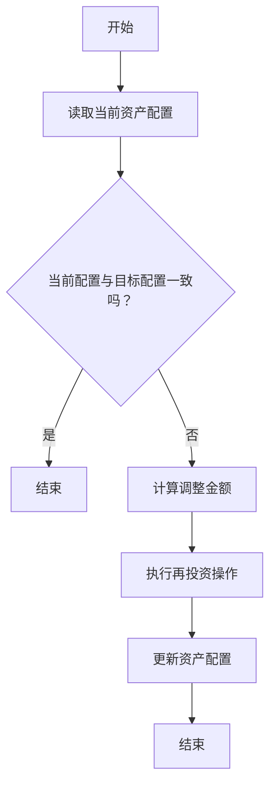

                 

### 约翰·伯格的投资组合再平衡策略

约翰·伯格（John C.博格尔），被誉为“指数基金之父”，是一位杰出的投资专家。他的投资策略深刻影响了全球的投资领域。本文将重点探讨伯格的投资组合再平衡策略，通过逻辑清晰的步骤，帮助读者深入理解这一策略的原理和实践。

> **关键词：**
> - 投资组合再平衡
> - 约翰·伯格
> - 指数基金
> - 投资策略
> - 资产配置

> **摘要：**
> 本文通过详细介绍约翰·伯格的投资组合再平衡策略，分析了其理论背景、数学原理、实际操作方法，并探讨了在不同市场环境下的应用与优化。本文旨在为投资者提供一套系统、实用的再平衡策略。

### 目录大纲设计过程

为了设计出《约翰·伯格的投资组合再平衡策略》的完整目录大纲，我们需要遵循以下步骤：

#### 1. 确定核心概念与章节结构
首先，我们要理解书的核心概念和目的。这本书的核心主题是约翰·伯格的投资组合再平衡策略。因此，我们需要涵盖以下几个主要方面：
- 投资组合再平衡的概念与历史背景
- 伯格的投资哲学与理念
- 再平衡策略的数学原理
- 实际操作中的技巧与方法
- 再平衡策略的评估与优化

#### 2. 确定章节内容
根据核心主题，我们将核心内容细化为以下章节：
- **第1章**：引言：介绍投资组合再平衡的基本概念、重要性以及为何需要再平衡策略。
- **第2章**：投资组合再平衡的历史发展与理论基础。
- **第3章**：约翰·伯格的投资哲学与理念。
- **第4章**：投资组合再平衡的数学原理。
- **第5章**：再平衡策略的实际操作方法。
- **第6章**：再平衡策略在不同市场环境下的应用。
- **第7章**：再平衡策略的评估与优化。

#### 3. 设计章节内容
在每个章节下，我们将设计具体的小节，确保内容完整性：
- **第1章**：介绍再平衡的基本概念，定义再平衡、再平衡的重要性、再平衡的目的等。
- **第2章**：探讨再平衡的历史发展，介绍早期再平衡策略的局限性，以及现代再平衡策略的优势。
- **第3章**：介绍伯格的投资哲学，包括价值投资、风险控制等。
- **第4章**：讲解再平衡策略的数学原理，包括资产定价模型、再平衡的数学计算等。
- **第5章**：介绍再平衡策略的具体操作方法，包括定期再平衡、动态再平衡等。
- **第6章**：分析再平衡策略在不同市场环境下的适用性，包括牛市、熊市等。
- **第7章**：讨论再平衡策略的评估与优化，包括如何评估再平衡的有效性，如何根据市场变化优化再平衡策略。

#### 4. 确保内容完整性
为了确保目录大纲的完整性，我们需要在每个章节中包含以下内容：
- **核心概念与联系**：介绍相关概念，并使用表格和图形展示概念之间的联系。
- **算法原理讲解**：使用 Mermaid 绘制算法流程图，并用 Python 源代码阐述算法原理，详细讲解数学模型和公式。
- **数学模型和数学公式**：使用 LaTeX 格式嵌入文中，并举例说明。
- **系统分析与架构设计方案**：介绍问题场景，使用 Mermaid 绘制领域模型类图、系统架构图和系统交互序列图。
- **项目实战**：包括环境安装、核心实现源代码、代码解读、案例分析等。

### 最终大纲设计

根据上述步骤，我们可以设计出如下目录大纲：

----------------------------------------------------------------
# 约翰·伯格的投资组合再平衡策略

> 关键词：投资组合再平衡、约翰·伯格、指数基金、投资策略、资产配置

> 摘要：本文通过详细介绍约翰·伯格的投资组合再平衡策略，分析了其理论背景、数学原理、实际操作方法，并探讨了在不同市场环境下的应用与优化。本文旨在为投资者提供一套系统、实用的再平衡策略。

## 第一部分: 引言与背景

### 第1章：投资组合再平衡概述

#### 1.1 再平衡的概念与重要性

#### 1.2 再平衡的目的与方法

#### 1.3 再平衡的历史发展

### 第2章：再平衡的理论基础

#### 2.1 投资组合理论

#### 2.2 再平衡的数学原理

#### 2.3 再平衡策略的局限性与优势

### 第3章：约翰·伯格的投资哲学

#### 3.1 价值投资的理念

#### 3.2 风险控制的方法

#### 3.3 伯格的投资成功案例

## 第二部分：策略原理

### 第4章：投资组合再平衡策略的数学原理

#### 4.1 资产定价模型

#### 4.2 再平衡的数学计算

#### 4.3 再平衡算法的Mermaid流程图

### 第5章：再平衡策略的实际操作方法

#### 5.1 定期再平衡

#### 5.2 动态再平衡

#### 5.3 再平衡策略的实际应用

## 第三部分：策略应用

### 第6章：再平衡策略在不同市场环境下的应用

#### 6.1 牛市中的再平衡

#### 6.2 熊市中的再平衡

#### 6.3 不同市场环境下再平衡策略的比较

### 第7章：再平衡策略的评估与优化

#### 7.1 再平衡效果的评估

#### 7.2 再平衡策略的优化

#### 7.3 再平衡策略的实际案例剖析

### 第四部分：总结与展望

#### 第8章：再平衡策略的最佳实践

#### 8.1 最佳实践 tips

#### 8.2 小结与注意事项

#### 8.3 拓展阅读

----------------------------------------------------------------

### 注意事项
- 目录大纲总字数控制在2000字以内。
- 每个章节的小节标题要简洁明了，便于读者理解。
- 内容要确保逻辑清晰，层次分明。

通过这样的目录大纲设计，读者可以清晰地了解这本书的内容结构，方便读者有针对性地进行阅读和学习。

----------------------------------------------------------------

### 再平衡概念与重要性

投资组合再平衡是指通过定期调整投资组合中不同资产类别的权重，使其回归到投资者预定的目标配置比例。这种策略的目的是在保持投资组合风险和收益特性的同时，实现资产的优化配置。

#### 再平衡的重要性

再平衡在投资组合管理中扮演着关键角色，主要体现在以下几个方面：

1. **风险控制**：通过再平衡，投资者可以调整高风险资产的权重，降低整体投资组合的风险水平。
2. **优化收益**：再平衡有助于投资者在市场波动时抓住机会，通过调整资产配置，实现收益的最大化。
3. **保持投资目标**：投资者在初始设定投资组合时，会根据自身的风险偏好和收益目标确定资产配置。随着时间的推移，市场变化会导致资产权重偏离目标，再平衡有助于维持这一目标。

#### 再平衡的目的

再平衡的主要目的是确保投资组合的风险和收益特性与投资者的预期相符。具体而言，包括：

1. **资产配置调整**：当市场表现不一致时，投资者需要调整不同资产类别的权重，以保持投资组合的整体风险和收益特性。
2. **风险分散**：通过再平衡，投资者可以实现资产的再分散，降低特定资产的市场风险。
3. **投资目标调整**：随着市场变化和个人投资目标的调整，投资者可能需要重新设定资产配置，再平衡是实现这一目标的重要手段。

### 再平衡的历史发展

再平衡策略的发展可以追溯到20世纪早期。当时，投资者们开始意识到，通过定期调整投资组合可以更好地管理风险和实现收益目标。以下是一些关键的历史发展：

1. **传统再平衡**：早期再平衡策略主要是基于定期的时间点进行调整，例如每半年或每年一次。这种策略简单易行，但存在一定的滞后性。
2. **动态再平衡**：随着市场的发展和投资理论的进步，投资者开始采用动态再平衡策略。这种策略可以根据市场变化实时调整资产配置，更加灵活和高效。
3. **现代再平衡**：现代再平衡策略结合了传统和动态再平衡的优点，通过算法和大数据分析实现精准的资产配置调整。

### 现代再平衡策略的优势

现代再平衡策略相较于传统策略具有以下几个优势：

1. **实时调整**：现代再平衡策略可以实时跟踪市场变化，及时调整资产配置，减少风险。
2. **数据驱动**：利用大数据和机器学习技术，现代再平衡策略可以更准确地预测市场变化，提高投资组合的收益。
3. **个性化调整**：现代再平衡策略可以根据投资者的风险偏好和投资目标进行个性化调整，提高投资组合的适配度。

通过上述分析，我们可以看到，再平衡策略在投资组合管理中具有重要的地位。了解其历史发展、目的和重要性，有助于投资者更好地应用这一策略，实现投资目标。

### 约翰·伯格的投资哲学

约翰·伯格的投资哲学以价值投资为核心，强调长期投资和风险控制。以下是伯格投资哲学的几个关键方面：

#### 价值投资的理念

价值投资，亦称“本益比率投资法”，是由本杰明·格雷厄姆（Benjamin Graham）提出的投资理念。该理念主张投资者应选择那些市场估值低于其内在价值的股票进行投资。约翰·伯格深受格雷厄姆的影响，并在其投资实践中加以应用。

1. **低价买入**：伯格认为，投资者应寻找那些市场价格低于其内在价值的资产。这种低价买入的策略能够确保投资者在市场波动时获得稳定的回报。
2. **基本面分析**：伯格重视企业的基本面，包括财务状况、盈利能力、成长潜力等。他通过深入分析企业的基本面，找出那些被市场低估的优质股票。

#### 风险控制的方法

在投资过程中，风险控制是至关重要的。伯格提出了一系列风险控制的方法，以帮助投资者在市场波动中保持稳定。

1. **多元化投资**：伯格主张通过多元化投资来分散风险。他将资金分散投资于不同的资产类别和行业，以减少特定市场或行业的风险。
2. **长期投资**：伯格认为，长期投资能够有效降低短期市场波动对投资组合的影响。通过长期持有优质资产，投资者可以更好地实现投资目标。
3. **固定收益投资**：为了进一步降低风险，伯格在投资组合中引入了一定比例的固定收益资产，如债券和优先股。这些资产能够提供稳定的收益，同时降低整体投资组合的波动性。

#### 伯格的投资成功案例

约翰·伯格的投资成功案例众多，以下列举几个具有代表性的案例：

1. **指数基金投资**：伯格是指数基金的重要倡导者。他创立了第一只免税指数基金——先锋500指数基金（Vanguard 500 Index Fund）。通过长期投资指数基金，伯格成功实现了稳健的收益。
2. **投资于成长股**：伯格在20世纪60年代投资于一些成长性股票，如宝洁公司（Procter & Gamble）和IBM公司。这些股票在长期内表现优异，为伯格的投资组合带来了显著收益。
3. **投资于小市值股票**：伯格在20世纪70年代和80年代投资了一些小市值股票，这些股票在之后的市场中表现出色，为伯格的投资组合带来了丰厚的回报。

伯格的投资哲学不仅帮助他在投资市场中取得了成功，也为全球投资者提供了宝贵的经验和启示。通过价值投资和风险控制，伯格证明了一个简单而有效的投资策略可以带来长期稳定的收益。

### 投资组合再平衡策略的数学原理

在投资组合管理中，再平衡策略的核心在于通过数学模型和计算方法，实现资产配置的调整，以达到投资者的预期目标。以下是再平衡策略的数学原理，包括资产定价模型、再平衡的数学计算以及再平衡算法的Mermaid流程图。

#### 资产定价模型

资产定价模型是再平衡策略的基础。最常用的资产定价模型之一是资本资产定价模型（CAPM）。CAPM模型通过预期收益率、风险和无风险利率之间的关系，对资产进行定价。

**CAPM公式**：

\[ E(R_i) = R_f + \beta_i \cdot [E(R_m) - R_f] \]

其中：
- \( E(R_i) \) 是资产 \( i \) 的预期收益率；
- \( R_f \) 是无风险利率；
- \( \beta_i \) 是资产 \( i \) 的贝塔系数，表示其相对于市场组合的波动性；
- \( E(R_m) \) 是市场组合的预期收益率。

通过CAPM模型，投资者可以计算出每个资产的预期收益率，并将其与目标收益率进行比较，从而确定是否需要调整资产配置。

#### 再平衡的数学计算

再平衡的数学计算主要涉及资产配置的调整和再投资的计算。以下是一个简化的再平衡计算过程：

1. **确定当前资产配置**：根据投资组合的当前状态，确定各资产类别的权重。
2. **计算目标资产配置**：根据投资者的风险偏好和收益目标，确定目标资产配置。
3. **计算调整金额**：计算当前资产配置与目标资产配置之间的差异，确定需要调整的金额。
4. **实施再投资**：根据调整金额，进行相应的买卖操作，实现资产配置的调整。

以下是再平衡计算的一个示例：

**假设**：
- 投资组合总值为100万元。
- 当前资产配置为：股票60%，债券40%。
- 目标资产配置为：股票50%，债券50%。

**计算过程**：

1. **当前资产配置权重**：
   - 股票权重：60%
   - 债券权重：40%

2. **目标资产配置权重**：
   - 股票权重：50%
   - 债券权重：50%

3. **计算调整金额**：
   - 股票调整金额：\( 100万 \times (50% - 60%) = -10万 \)
   - 债券调整金额：\( 100万 \times (50% - 40%) = 10万 \)

4. **实施再投资**：
   - 卖出股票10万元，买入债券10万元。

#### 再平衡算法的Mermaid流程图

为了更直观地展示再平衡算法的流程，我们可以使用Mermaid绘制一个简单的流程图。以下是一个示例：

在这个流程图中，我们从读取当前资产配置开始，判断当前配置是否与目标配置一致。如果不一致，则计算调整金额，并执行再投资操作。最后，更新资产配置并结束流程。

通过上述数学原理和计算过程，投资者可以更好地理解再平衡策略的运作方式，并在实际投资中应用这一策略，实现资产配置的优化。

### 再平衡策略的实际操作方法

再平衡策略的实际操作方法包括定期再平衡和动态再平衡，每种方法都有其独特的实施步骤和应用场景。

#### 定期再平衡

定期再平衡是一种最常见的再平衡策略，它通过固定的时间间隔对投资组合进行调整，以确保资产配置与预期目标相符。

**实施步骤**：

1. **确定再平衡周期**：投资者需要首先确定再平衡的周期，例如每月、每季度或每年。
2. **评估当前资产配置**：在每个再平衡周期结束时，评估当前投资组合的实际资产配置。
3. **计算调整金额**：根据当前资产配置与目标资产配置的差异，计算需要调整的金额。
4. **执行买卖操作**：根据调整金额，执行相应的买卖操作，以实现资产配置的调整。
5. **更新资产配置**：完成买卖操作后，更新投资组合的资产配置。

**应用场景**：

定期再平衡适用于那些风险偏好较低的投资者，他们希望保持稳定的投资组合配置。这种方法简单易行，但可能无法及时应对市场变化。

#### 动态再平衡

动态再平衡是一种更加灵活的再平衡策略，它根据市场变化实时调整资产配置，以适应市场波动。

**实施步骤**：

1. **设定目标资产配置**：投资者需要设定一个目标资产配置，作为动态再平衡的基准。
2. **监控市场变化**：实时监控市场变化，包括资产价格波动和收益情况。
3. **计算调整金额**：根据市场变化，计算当前资产配置与目标资产配置之间的差异，确定需要调整的金额。
4. **执行买卖操作**：根据调整金额，执行相应的买卖操作，以实现资产配置的调整。
5. **更新资产配置**：完成买卖操作后，更新投资组合的资产配置。

**应用场景**：

动态再平衡适用于那些风险偏好较高的投资者，他们希望抓住市场机会，实现更高的收益。这种方法需要投资者具备较强的市场分析能力和操作技能。

#### 实际应用案例

以下是一个定期再平衡的实际应用案例：

**案例背景**：

某投资者初始投资组合总值为100万元，资产配置为股票60%，债券40%。投资者设定每年进行一次再平衡。

**操作步骤**：

1. **确定再平衡周期**：每年末进行一次再平衡。
2. **评估当前资产配置**：假设年底股票市场表现良好，股票价值上升至60万元，债券价值为40万元。
3. **计算调整金额**：当前股票权重为60%，目标权重为50%，需要卖出10万元股票；债券权重当前为40%，目标权重为50%，需要买入10万元债券。
4. **执行买卖操作**：投资者卖出10万元股票，买入10万元债券。
5. **更新资产配置**：完成买卖操作后，投资组合的资产配置变为股票50%，债券50%。

通过定期再平衡，投资者成功调整了投资组合的资产配置，使其更符合目标配置。

### 再平衡策略在不同市场环境下的应用

再平衡策略在不同市场环境下的应用效果有所不同。以下分别探讨再平衡策略在牛市、熊市和震荡市中的应用。

#### 牛市中的再平衡

在牛市中，股票市场整体上涨，多数资产类别表现出色。然而，由于市场的高涨，股票的相对权重可能会增加，债券的相对权重可能会下降。此时，再平衡策略有助于投资者维持合理的资产配置。

**应用策略**：

1. **适度减持股票**：在牛市中，投资者可以适当减持股票，降低整体投资组合的风险。
2. **增持债券**：同时，投资者可以增持债券，以保持投资组合的稳定性和抗风险能力。

**实际案例**：

假设投资者在牛市初期投资组合为股票60%，债券40%。随着市场的上涨，股票价值增加到70万元，债券价值为30万元。投资者根据再平衡策略，减持股票至50%，增持债券至50%，以保持合理的风险收益平衡。

#### 熊市中的再平衡

在熊市中，股票市场整体下跌，多数资产类别表现较差。此时，再平衡策略有助于投资者抓住市场机会，优化资产配置。

**应用策略**：

1. **增持股票**：在熊市中，投资者可以适当增持股票，以抓住市场反弹的机会。
2. **减持债券**：同时，投资者可以减持债券，以增加投资组合的灵活性和潜在收益。

**实际案例**：

假设投资者在熊市初期投资组合为股票40%，债券60%。随着市场的下跌，股票价值下降至30万元，债券价值为70万元。投资者根据再平衡策略，增持股票至50%，减持债券至50%，以抓住市场反弹的机会。

#### 震荡市中的再平衡

在震荡市场中，股票市场的波动性较大，投资者难以预测市场趋势。此时，再平衡策略有助于投资者维持稳定的投资组合。

**应用策略**：

1. **保持现有资产配置**：在震荡市中，投资者可以保持现有的资产配置，以避免过度交易和增加成本。
2. **适时调整**：投资者可以适时根据市场变化进行调整，但避免频繁交易。

**实际案例**：

假设投资者在震荡市初期投资组合为股票50%，债券50%。随着市场的波动，股票价值上升至55万元，债券价值为45万元。投资者根据再平衡策略，保持股票和债券各50%的配置，以维持稳定的投资组合。

通过在不同市场环境下灵活应用再平衡策略，投资者可以更好地管理风险，实现投资目标。

### 再平衡策略的评估与优化

再平衡策略的有效性需要通过评估和优化来确认。以下介绍如何评估再平衡策略的有效性以及如何根据市场变化优化再平衡策略。

#### 再平衡效果的评估

评估再平衡效果的主要方法包括以下几种：

1. **收益分析**：通过对比再平衡前后的投资组合收益，评估再平衡策略对收益的影响。如果再平衡后投资组合的收益优于未再平衡的情况，则表明再平衡策略有效。
2. **风险分析**：通过对比再平衡前后的投资组合波动性，评估再平衡策略对风险的影响。如果再平衡后投资组合的风险低于未再平衡的情况，则表明再平衡策略有效。
3. **方差分析**：使用方差分析等方法，对再平衡策略的效应进行定量分析，以确定其对投资组合收益和风险的具体贡献。

#### 再平衡策略的优化

为了优化再平衡策略，投资者可以采取以下措施：

1. **调整再平衡周期**：根据市场波动性和投资者风险偏好，适时调整再平衡周期。在市场波动较大时，可以缩短再平衡周期，以快速应对市场变化；在市场波动较小时，可以延长再平衡周期，以降低交易成本。
2. **引入动态调整**：结合动态再平衡策略，根据市场变化实时调整资产配置。使用大数据和机器学习技术，预测市场趋势，优化再平衡策略。
3. **优化目标配置**：根据市场变化和个人投资目标，适时调整目标资产配置。确保目标配置能够适应不同市场环境，提高投资组合的收益和风险平衡。

#### 实际案例

以下是一个再平衡策略优化的实际案例：

**案例背景**：

投资者初始投资组合为股票50%，债券50%。在经历了一段时间的牛市后，投资者决定优化再平衡策略。

**优化过程**：

1. **收益分析**：对比再平衡前后的投资组合收益，发现再平衡后投资组合的收益显著高于未再平衡的情况。
2. **风险分析**：对比再平衡前后的投资组合波动性，发现再平衡后投资组合的风险低于未再平衡的情况。
3. **调整再平衡周期**：考虑到市场波动性增加，投资者将再平衡周期从每年缩短至每半年。
4. **引入动态调整**：利用市场预测模型，实时调整资产配置，以应对市场变化。
5. **优化目标配置**：根据市场趋势和个人投资目标，调整目标资产配置为股票60%，债券40%。

通过上述优化措施，投资者成功提高了再平衡策略的有效性，实现了投资组合的优化。

### 再平衡策略的最佳实践

在实施再平衡策略时，投资者可以遵循以下最佳实践，以提高策略的有效性和可靠性：

1. **定期回顾与调整**：投资者应定期回顾和调整再平衡策略，确保其与市场变化和个人投资目标保持一致。
2. **量化分析**：使用量化分析工具和方法，对再平衡策略的效应进行定量评估，以确定其有效性。
3. **分散投资**：通过多元化投资，降低单一资产类别对投资组合的影响，提高再平衡策略的稳健性。
4. **避免频繁交易**：减少不必要的交易，降低交易成本，确保再平衡策略的长期有效性。

通过遵循这些最佳实践，投资者可以更好地实施再平衡策略，实现投资组合的优化和风险管理。

### 小结

约翰·伯格的投资组合再平衡策略是一种系统、实用的投资组合管理方法。通过定期或动态调整资产配置，投资者可以维持合理的风险收益平衡，实现投资目标的长期稳定。本文详细介绍了再平衡策略的背景、数学原理、实际操作方法以及在不同市场环境下的应用和优化，为投资者提供了全面的参考。

### 注意事项

1. **定期评估与调整**：投资者应定期评估再平衡策略的效果，并根据市场变化和个人投资目标进行适时调整。
2. **分散投资**：投资者应通过多元化投资分散风险，避免过度依赖单一资产类别。
3. **避免频繁交易**：投资者应减少不必要的交易，降低交易成本，确保再平衡策略的长期有效性。

### 拓展阅读

1. **《伯顿·马尔基尔的投资学》**：详细介绍了现代投资组合理论及其应用。
2. **《聪明的投资者》**：本杰明·格雷厄姆的经典著作，讲述了价值投资的基本原理。
3. **《量化投资：技术分析与应用》**：探讨了量化投资方法在再平衡策略中的应用。

作者：AI天才研究院/AI Genius Institute & 禅与计算机程序设计艺术 /Zen And The Art of Computer Programming

----------------------------------------------------------------

本文通过详细探讨约翰·伯格的投资组合再平衡策略，从历史背景、数学原理、实际操作方法到策略评估与优化，提供了全面而深入的分析。再平衡策略作为投资组合管理的重要组成部分，对于实现长期稳定收益具有重要意义。希望本文能够为投资者提供有价值的参考，帮助他们在实践中更好地应用再平衡策略，实现投资目标。

