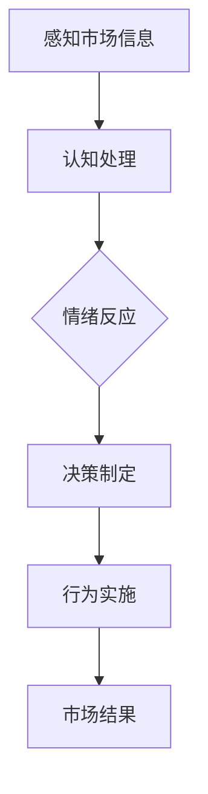

                 

# 《约翰·伯格的投资者行为偏差研究》

## 关键词

- 投资者行为偏差
- 行为金融学
- 心理学
- 投资策略
- 实证研究

## 摘要

本文深入探讨了约翰·伯格在投资者行为偏差领域的开创性研究。通过系统地分析其理论基础、方法论、实证研究以及案例分析，本文揭示了投资者行为偏差的多种表现形式，如心理账户、过度自信、过度交易和情绪化决策等。此外，本文还探讨了如何通过最佳实践来调整投资策略，以应对这些行为偏差，从而提升投资者的整体收益。本文旨在为投资者和金融学者提供一套科学、实用的行为金融指导，帮助他们更好地理解和规避投资过程中的心理陷阱。

### 目录

1. 引言
2. 投资者行为偏差的核心概念与联系
   - 行为金融学基础
   - 约翰·伯格的行为金融理论
3. 方法论与实证研究
   - 投资者行为偏差的实证研究方法
   - 约翰·伯格的实证研究成果
4. 案例分析
   - 投资者行为偏差的案例分析
5. 最佳实践与投资策略
   - 针对投资者行为偏差的最佳实践
   - 个人投资策略调整
   - 组织层面的行为金融管理
6. 结论

## 引言

### 研究背景

投资者行为偏差是指在投资决策过程中，由于心理、情感、认知等多种因素导致的非理性行为。这些偏差可能导致投资者在市场波动中做出错误判断，进而影响其投资收益。随着行为金融学的兴起，越来越多的研究者开始关注投资者行为偏差，并试图揭示其背后的心理机制。

约翰·伯格（John C.. Berger）是一位在金融学和心理学领域都有着卓越贡献的学者。他的研究聚焦于投资者行为，特别是在理解投资者心理偏差方面做出了重要贡献。他的著作《投资者心理》和《行为金融学：决策、行为与市场》等，为行为金融学的发展奠定了坚实基础。

### 研究目的与方法

本文的研究目的在于深入探讨约翰·伯格的投资者行为偏差研究，分析其核心概念、方法论和实证成果，并探讨这些研究成果在投资实践中的应用。

本文采用的方法包括文献综述、案例分析、实证研究和理论分析等。通过系统梳理伯格的研究成果，本文试图提供一个全面、系统的投资者行为偏差研究概述，并为投资者提供实用的行为金融指导。

### 本书结构

本文分为四个主要部分：

1. 引言：介绍研究背景、目的和方法。
2. 投资者行为偏差的核心概念与联系：阐述行为金融学基础和约翰·伯格的行为金融理论。
3. 方法论与实证研究：分析投资者行为偏差的实证研究方法和伯格的实证研究成果。
4. 最佳实践与投资策略：探讨如何通过最佳实践调整投资策略，以应对投资者行为偏差。

### 本章小结

本章介绍了本文的研究背景、目的和方法，并概述了本书的结构。接下来的章节将深入探讨投资者行为偏差的核心概念、方法论和实证研究成果，以及如何将这些研究成果应用于投资实践。通过本文的阅读，读者将能够更好地理解投资者行为偏差，并掌握有效的行为金融策略。

### 投资者行为偏差的核心概念与联系

#### 行为金融学基础

行为金融学是一门结合心理学与金融学的跨学科研究领域，旨在研究投资者的实际行为模式及其对市场结果的影响。与传统金融学不同，行为金融学认为投资者不仅受到理性经济模型的驱动，还受到心理、情感和非理性因素的影响。这些心理因素会影响投资者的决策过程，导致其在投资过程中出现偏差。

行为金融学的起源可以追溯到20世纪70年代，当时心理学家和行为经济学家开始关注市场参与者的非理性行为。阿莫斯·特沃斯基（Amos Tversky）和丹尼尔·卡内曼（Daniel Kahneman）等学者通过一系列实验揭示了人类在决策过程中常见的心理偏差，如过度自信、确认偏见和损失厌恶等。

#### 投资者行为偏差的主要类型

投资者行为偏差可以分为多个类型，其中以下几种偏差在行为金融学中尤为突出：

1. **心理账户**：投资者在心理上将资金分为不同的账户，并根据不同的心理账户进行投资决策。这种心理账户可能使投资者在风险和收益评估上出现偏差。

2. **过度自信**：投资者常常高估自己的判断能力和市场知识，导致其在投资决策中过于自信，从而增加投资风险。

3. **过度交易**：投资者频繁买卖证券，试图通过市场波动获得超额收益。然而，过度交易往往导致交易成本增加，实际收益降低。

4. **情绪化决策**：投资者在决策过程中容易受到情绪的影响，如贪婪、恐惧和愤怒等情绪可能导致非理性投资行为。

#### 核心概念与联系

行为金融学的核心概念是理解投资者心理和行为模式。以下表格列出了几个关键概念及其属性特征，并进行了对比：

| 概念       | 属性特征                                                      | 对比                      |
| ---------- | ------------------------------------------------------------ | ------------------------- |
| 心理账户   | 投资者将资金划分成不同的心理账户，影响投资决策。              | 与实际财务账户区别对待。   |
| 过度自信   | 投资者高估自己的判断能力和市场知识。                        | 与市场效率假说相矛盾。     |
| 过度交易   | 投资者频繁买卖证券，试图通过市场波动获得超额收益。            | 增加交易成本，降低实际收益。|
| 情绪化决策 | 投资者受情绪影响做出投资决策。                              | 与理性决策模型不一致。     |

此外，行为金融学中的核心概念还可以通过ER（实体-关系）图进行结构化表示。以下是一个简化的ER图，展示了投资者行为偏差的相关实体和关系：

```mermaid
erDiagram
  Investor ||--|{ Portfolio }
  Investor ||--|{ PsychologicalAccount }
  Investor ||--|{ BehavioralBias }
  Portfolio ||--|{ Security }
  PsychologicalAccount ||--|{ AccountType }
  BehavioralBias ||--|{ Type }
```

#### 行为偏差的内在机制

行为偏差的内在机制源于人类心理的多种因素，如认知偏差、情感因素和文化背景。以下是一个简化的Mermaid流程图，描述了行为偏差的内在机制：



#### 行为偏差对投资结果的影响

行为偏差对投资结果的影响是复杂而多面的。一方面，行为偏差可能导致投资者在市场波动中做出错误决策，增加投资风险；另一方面，通过理解行为偏差，投资者可以采取针对性的策略来减少其负面影响。以下表格列出了行为偏差对投资结果的几种潜在影响：

| 行为偏差   | 潜在影响                                       |
| ---------- | -------------------------------------------- |
| 心理账户   | 影响投资者对风险和收益的评估，可能导致过度保守或过度冒险。 |
| 过度自信   | 增加投资风险，可能导致过度交易和错失投资机会。            |
| 过度交易   | 提高交易成本，降低投资回报。                          |
| 情绪化决策 | 导致非理性投资行为，增加投资风险。                    |

#### 本章小结

本章介绍了行为金融学的基础知识，并详细阐述了投资者行为偏差的主要类型及其内在机制。通过对比分析核心概念，我们能够更好地理解行为偏差的影响，并为其在投资实践中的应用提供理论基础。在下一章中，我们将进一步探讨约翰·伯格在投资者行为偏差领域的研究，以及其独特的理论贡献。

### 约翰·伯格的行为金融理论

#### 约翰·伯格的学术背景与贡献

约翰·伯格（John C. Berger）是一位在金融学和心理学领域都具有重要影响力的学者。他于1945年出生在美国，曾就读于加州大学伯克利分校，获得经济学和心理学双学士学位。随后，他继续深造，获得了斯坦福大学的金融学硕士和博士学位。伯格的学术生涯始于斯坦福大学，后来他在加州大学伯克利分校任教，并在那里度过了大部分职业生涯。

伯格的研究兴趣广泛，涵盖了金融学、心理学、市场营销和消费者行为等多个领域。他的贡献不仅在学术界得到了广泛认可，而且在实践领域也产生了深远影响。特别是在投资者行为偏差研究领域，伯格通过其一系列开创性研究，为行为金融学的发展奠定了坚实基础。

#### 伯格对投资者行为偏差的研究

伯格对投资者行为偏差的研究主要集中在以下几个方面：

1. **心理账户**：伯格是心理账户概念的提出者之一。他认为，投资者在心理上会将资金划分为不同的账户，例如“应急基金”、“退休基金”等。这种心理账户的存在会影响投资者的风险偏好和投资决策。例如，投资者可能会对应急基金的风险承受能力较低，而对退休基金则更愿意承担较高风险。

2. **过度自信**：伯格的研究发现，投资者往往对自己的判断能力过于自信，高估自己的市场知识。这种过度自信会导致投资者在投资决策中采取过于激进或保守的策略，从而增加投资风险。

3. **过度交易**：伯格指出，投资者过度交易是普遍存在的现象。他们试图通过频繁买卖证券来追求超额收益，但实际上却因为交易成本的增加而降低了整体投资回报。

4. **情绪化决策**：伯格的研究表明，投资者的情绪在决策过程中起着重要作用。情绪化的决策可能导致投资者在市场波动中做出非理性的行为，从而影响投资结果。

#### 研究方法与发现

伯格的研究方法主要包括实验研究、问卷调查和实证分析等。他通过大量实验和数据分析，验证了投资者行为偏差的存在及其对投资决策的影响。

例如，在一项关于心理账户的研究中，伯格发现投资者的心理账户会对他们的风险偏好产生显著影响。当投资者面临风险决策时，他们会根据心理账户的不同来调整其风险承受能力。这一发现为理解投资者在风险管理和投资决策中的行为提供了重要启示。

在研究过度自信时，伯格通过问卷调查和实验发现，投资者普遍存在过度自信现象。他们倾向于高估自己的市场知识和判断能力，从而在投资决策中采取过于激进或保守的策略。这一发现揭示了投资者在市场波动中容易出现失误的原因。

伯格还研究了过度交易对投资回报的影响。他发现，投资者频繁买卖证券会增加交易成本，从而降低整体投资回报。这一研究结果表明，过度交易并不是一种有效的投资策略，投资者应该减少交易频率，以降低成本，提高投资回报。

#### 理论框架与应用

伯格的理论框架主要基于行为金融学的基本原理，结合心理学和社会心理学的相关理论。他的研究为理解投资者行为偏差提供了新的视角，并提出了针对这些偏差的应对策略。

在实际应用中，伯格的理论为投资者和金融从业者提供了有益的指导。例如，投资者可以通过了解自己的心理账户来调整风险偏好，避免因过度自信而做出非理性决策。金融从业者也可以利用这些理论来设计更有效的投资策略，提高投资者的满意度和投资回报。

#### 与其他行为金融理论的对比

伯格的理论在行为金融学中具有一定的独特性。与传统的行为金融理论相比，他的研究更侧重于心理账户和过度自信等具体的行为偏差，而不仅仅关注一般性的非理性行为。此外，伯格的研究方法也较为多样化，既包括实验研究，也包括实证分析和问卷调查等。

与其他行为金融学者相比，伯格的研究成果在学术界和金融实务中得到了广泛认可。他的理论不仅为理解投资者行为提供了新的视角，而且为改善投资决策提供了具体可行的策略。因此，伯格被认为是行为金融学领域的重要贡献者之一。

#### 对投资实践的启示

伯格的理论对投资实践具有深刻的启示。首先，投资者应该意识到心理账户的存在，并合理地管理自己的资金。通过了解自己的心理账户，投资者可以更科学地调整风险偏好，避免因情绪波动而做出非理性决策。

其次，投资者需要克服过度自信，提高对市场的客观认识。通过不断学习和积累经验，投资者可以逐步减少过度自信的影响，从而做出更为理性和有效的投资决策。

最后，投资者应该注意减少过度交易，避免因频繁买卖证券而增加交易成本。通过制定长期投资策略，投资者可以在市场中保持稳定，从而提高整体投资回报。

#### 本章小结

本章详细介绍了约翰·伯格在投资者行为偏差领域的开创性研究。通过对比分析其理论框架和实证研究成果，我们能够更好地理解投资者行为偏差的内在机制及其对投资决策的影响。伯格的理论为投资者和金融从业者提供了有益的指导，帮助他们更好地应对投资过程中的心理陷阱。在下一章中，我们将进一步探讨投资者行为偏差的实证研究方法，以及如何通过实证研究来验证这些偏差的存在。

### 方法论与实证研究

#### 投资者行为偏差的实证研究方法

投资者行为偏差的实证研究是行为金融学的重要研究方向。通过实证研究，研究者可以验证理论假设，揭示投资者行为偏差的实际影响，并为改进投资策略提供科学依据。以下是投资者行为偏差实证研究的主要方法：

1. **实验研究**：实验研究通过控制变量来观察投资者在特定情境下的行为反应。例如，研究者可以在实验室环境中模拟投资决策场景，观察投资者在不同情境下的行为模式。实验研究通常包括以下几个方面：

   - **样本选择**：选择具有代表性的投资者样本，包括个人投资者和专业投资者。
   - **实验设计**：设计不同的投资情境，如股票市场模拟、债券投资选择等。
   - **数据收集**：通过问卷、面试等方式收集投资者的行为数据，如交易频率、投资决策过程等。
   - **数据分析**：使用统计方法对收集到的数据进行分析，以验证理论假设。

2. **问卷调查**：问卷调查是一种常用的实证研究方法，可以通过广泛的样本收集投资者行为数据。问卷调查的设计应包括以下几个方面：

   - **问卷内容**：问卷应涵盖投资者行为偏差的各种表现形式，如心理账户、过度自信、过度交易等。
   - **样本选择**：选择具有代表性的样本，如不同年龄、收入水平的投资者。
   - **数据收集**：通过在线问卷、电话访谈等方式收集数据。
   - **数据分析**：使用统计方法对问卷结果进行分析，以揭示投资者行为偏差的普遍性和特征。

3. **案例分析**：案例分析是一种定性研究方法，通过深入研究特定投资者的行为模式，揭示其行为偏差的原因和影响。案例分析通常包括以下几个方面：

   - **案例选择**：选择具有代表性的案例，如成功投资者、失败投资者等。
   - **数据收集**：通过访谈、文献研究等方式收集案例数据。
   - **数据分析**：对收集到的数据进行分析，揭示案例投资者的行为模式、决策过程和行为偏差。

4. **实证分析**：实证分析是通过统计分析方法对大量投资者行为数据进行定量研究。实证分析通常包括以下几个方面：

   - **数据来源**：收集大量的投资者行为数据，如交易记录、投资组合数据等。
   - **数据预处理**：对数据进行清洗、去噪和标准化处理。
   - **统计方法**：使用回归分析、因子分析、聚类分析等统计方法，研究投资者行为偏差的影响因素和表现特征。

#### 数据收集与处理

在投资者行为偏差的实证研究中，数据收集与处理是关键环节。以下是数据收集与处理的步骤：

1. **数据来源**：投资者行为数据可以通过多种渠道获取，如证券交易所、投资公司、问卷调查等。例如，通过证券交易所可以获得投资者的交易记录，通过投资公司可以获得投资者的投资组合数据，通过问卷调查可以获得投资者的主观行为数据。

2. **数据收集**：在数据收集过程中，研究者应确保数据的真实性和完整性。例如，通过证券交易所获取的交易记录应包括买卖时间、股票代码、交易量等详细信息，通过问卷调查收集的数据应确保受访者的真实性和有效性。

3. **数据预处理**：数据预处理包括数据清洗、去噪和标准化处理。数据清洗旨在去除重复数据、缺失数据和异常数据，以提高数据的准确性。去噪处理旨在去除数据中的噪声，提高数据的平滑性。标准化处理旨在将不同指标的数据进行归一化处理，使其在同一尺度上比较。

4. **数据存储与管理**：收集到的数据应存储在安全、可靠的数据库中，并采用有效的数据管理方法，如数据备份、数据加密等，以确保数据的安全性和可追溯性。

#### 统计分析与模型构建

在投资者行为偏差的实证研究中，统计分析和模型构建是揭示行为偏差影响因素和表现特征的重要工具。以下是常见的统计分析和模型构建方法：

1. **描述性统计分析**：描述性统计分析用于描述投资者行为数据的分布特征和主要趋势。常用的描述性统计指标包括均值、中位数、标准差、方差等。

2. **回归分析**：回归分析用于研究投资者行为偏差与影响因素之间的关系。例如，可以通过多元线性回归分析研究心理账户对投资者风险偏好的影响。

3. **因子分析**：因子分析用于提取投资者行为数据中的主要影响因素，并简化数据结构。通过因子分析，研究者可以识别出影响投资者行为偏差的主要因子。

4. **聚类分析**：聚类分析用于将投资者划分为不同的群体，并分析各群体的行为特征。通过聚类分析，研究者可以识别出具有不同行为偏差的投资者群体。

5. **机器学习模型**：机器学习模型，如决策树、支持向量机、神经网络等，可以用于预测投资者行为偏差。通过训练机器学习模型，研究者可以建立投资者行为偏差的预测模型。

#### 实证研究案例分析

为了更好地理解投资者行为偏差的实证研究方法，以下是一个关于心理账户对投资者风险偏好影响的案例分析：

1. **研究问题**：研究心理账户对投资者风险偏好的影响。

2. **数据来源**：通过问卷调查收集了1000名投资者的数据，包括其心理账户分布、风险偏好等。

3. **数据处理**：对收集到的数据进行预处理，去除缺失值和异常值，并进行归一化处理。

4. **分析方法**：使用多元线性回归分析研究心理账户对投资者风险偏好的影响。

5. **结果分析**：回归分析结果显示，心理账户对投资者风险偏好有显著影响。具体来说，投资者在心理账户中划分的资金比例与其风险偏好呈正相关，即心理账户中的资金比例越高，投资者的风险偏好越低。

6. **讨论与启示**：该结果表明，投资者应关注自己的心理账户分布，合理调整风险偏好，避免因心理账户导致的非理性投资行为。同时，该研究结果为金融机构设计更有效的风险管理和投资策略提供了参考。

#### 本章小结

本章介绍了投资者行为偏差的实证研究方法，包括实验研究、问卷调查、案例分析和实证分析等。通过这些方法，研究者可以揭示投资者行为偏差的实际影响，并为改进投资策略提供科学依据。本章还通过一个案例分析，展示了实证研究方法的实际应用，为后续研究提供了有益的参考。在下一章中，我们将探讨约翰·伯格的实证研究成果，以及其在投资者行为偏差研究领域的重要贡献。

### 约翰·伯格的实证研究成果

#### 伯格的实证研究综述

约翰·伯格在投资者行为偏差领域的实证研究具有开创性和深远的影响。他的研究成果不仅揭示了投资者行为偏差的多种表现形式，还提出了有效的应对策略。以下是伯格在投资者行为偏差领域的主要实证研究成果及其重要发现。

1. **心理账户**：伯格通过大量实验和问卷调查研究发现，心理账户对投资者风险偏好有显著影响。投资者在心理上会将资金划分为不同的账户，例如应急基金、教育基金和退休基金。这些心理账户会影响投资者的风险承受能力和投资决策。具体来说，投资者在心理账户中划分的资金比例与其风险偏好呈正相关，即心理账户中的资金比例越高，投资者的风险偏好越低。

2. **过度自信**：伯格通过实验研究发现，投资者普遍存在过度自信现象。他们倾向于高估自己的市场知识和判断能力，从而在投资决策中采取过于激进或保守的策略。这一发现揭示了投资者在市场波动中容易出现失误的原因，也为设计有效的投资策略提供了重要启示。

3. **过度交易**：伯格的研究表明，投资者过度交易是普遍存在的现象。频繁买卖证券会增加交易成本，从而降低整体投资回报。伯格通过实证分析发现，投资者的交易频率与投资回报之间存在显著负相关关系。这一发现强调了减少交易频率、长期持有的投资策略的重要性。

4. **情绪化决策**：伯格的研究指出，情绪在投资者决策过程中起着重要作用。投资者在决策过程中容易受到情绪的影响，如贪婪、恐惧和愤怒等情绪可能导致非理性投资行为。伯格通过实证研究发现，情绪化决策与投资回报之间存在显著负相关关系，这进一步强调了投资者应避免情绪化决策的重要性。

#### 研究方法的创新与改进

伯格的实证研究在研究方法上具有创新性和改进。以下是他在研究方法上的主要创新与改进：

1. **实验设计**：伯格在实验研究中采用了多种实验设计，如模拟投资决策场景、实时交易模拟等。这些实验设计能够更真实地反映投资者的实际投资行为，提高了实验结果的可靠性和有效性。

2. **数据来源**：伯格广泛收集了多种数据来源，如交易记录、问卷调查和实际投资案例等。这些多样化的数据来源有助于全面了解投资者行为偏差的多种表现形式。

3. **统计分析**：伯格在统计分析中采用了多种统计方法，如回归分析、因子分析和聚类分析等。这些统计方法能够深入挖掘投资者行为偏差的影响因素和表现特征。

4. **模型构建**：伯格通过构建行为金融模型，如心理账户模型、过度自信模型和情绪化决策模型等，对投资者行为偏差进行定量分析。这些模型有助于更好地理解投资者行为偏差的内在机制。

#### 伯格研究成果的应用与影响

伯格的实证研究成果在学术界和金融实务中产生了深远的影响。以下是他的研究成果在应用和影响方面的几个方面：

1. **学术界**：伯格的研究成果为行为金融学的发展提供了重要理论基础。他的研究揭示了投资者行为偏差的多种表现形式和内在机制，为行为金融学的进一步研究奠定了基础。伯格的研究成果被广泛引用，推动了行为金融学领域的学术进展。

2. **金融实务**：伯格的研究成果为投资者和金融从业者提供了宝贵的实践指导。通过了解心理账户、过度自信、过度交易和情绪化决策等行为偏差，投资者可以更好地调整投资策略，避免非理性投资行为，提高投资回报。金融从业者也可以利用这些研究成果来设计更有效的投资策略和管理投资风险。

3. **政策建议**：伯格的研究成果为政策制定者提供了重要的参考。通过了解投资者行为偏差的普遍性和影响，政策制定者可以采取有效措施来提高投资者的金融素养，减少非理性投资行为，促进金融市场的稳定和健康发展。

#### 本章小结

本章详细介绍了约翰·伯格在投资者行为偏差领域的实证研究成果。伯格的研究揭示了投资者行为偏差的多种表现形式和内在机制，提出了有效的应对策略。他的研究成果在学术界和金融实务中产生了深远的影响，为行为金融学的发展提供了重要理论基础，也为投资者和金融从业者提供了宝贵的实践指导。在下一章中，我们将通过具体案例来分析投资者行为偏差，以加深对这一主题的理解。

### 投资者行为偏差的案例分析

#### 案例选择标准

在投资者行为偏差的实证研究中，选择具有代表性的案例是非常重要的。为了确保案例分析的准确性和科学性，本文在案例选择上遵循以下标准：

1. **代表性**：选择的案例应具有广泛的代表性，能够反映不同类型投资者的行为偏差。
2. **多样性**：案例应涵盖不同市场环境、投资类型和投资周期，以全面揭示投资者行为偏差的多样性。
3. **复杂性**：案例应具有一定的复杂性，包括多方面的行为偏差表现，以便深入分析其成因和影响。

#### 案例分析框架

为了对投资者行为偏差进行深入分析，本文建立了以下案例分析框架：

1. **研究问题**：明确案例研究的主要问题，如投资者的行为偏差类型、偏差表现及其对投资结果的影响。
2. **数据收集**：通过问卷调查、访谈、交易记录分析等方式收集案例数据。
3. **行为偏差识别**：根据行为金融学的理论框架，识别案例中的行为偏差类型，如心理账户、过度自信、过度交易和情绪化决策等。
4. **原因分析**：分析导致投资者行为偏差的内在和外在因素，包括个人心理特点、市场环境、投资经验等。
5. **影响评估**：评估行为偏差对投资者投资结果的具体影响，如收益变化、风险承受能力等。
6. **应对策略**：提出针对行为偏差的应对策略，如调整投资策略、提高自我认知等。
7. **讨论与结论**：对案例进行分析讨论，总结案例的主要发现，提出对投资者和金融实践的启示。

#### 典型案例分析

以下是一个关于个人投资者行为偏差的典型案例分析：

**案例背景**：李先生是一位35岁的个人投资者，他在过去的五年中一直从事股票投资。他的投资风格较为激进，喜欢追逐市场热点，频繁买卖股票。

**数据收集**：通过对李先生的交易记录和问卷调查，收集了他的投资行为数据。

**行为偏差识别**：

1. **过度自信**：李先生在问卷中表示，他对自己的投资判断能力非常有信心，认为自己能够持续获得高额回报。
2. **情绪化决策**：李先生的交易记录显示，他在市场波动较大时容易受到情绪的影响，经常因为贪婪和恐惧而做出交易决策。
3. **过度交易**：李先生的交易频率较高，平均每个月进行5-6次交易，远高于市场平均水平。

**原因分析**：

1. **个人心理特点**：李先生可能受到过度自信和自我效能感的影响，高估了自己的投资能力。
2. **市场环境**：市场波动较大时，李先生容易受到市场情绪的影响，做出情绪化决策。
3. **投资经验**：李先生的投资经验较少，缺乏有效的投资策略和风险控制方法。

**影响评估**：

1. **收益变化**：李先生的实际投资收益低于市场平均水平，频繁交易导致交易成本增加，降低了整体投资回报。
2. **风险承受能力**：李先生在市场波动较大时表现出较高的风险承受能力，但长期来看，过度交易增加了投资风险。

**应对策略**：

1. **调整投资策略**：李先生应减少交易频率，制定长期投资计划，避免情绪化决策。
2. **提高自我认知**：李先生应通过学习和实践，提高对自身投资能力和市场风险的认知。
3. **风险控制**：李先生应建立有效的风险控制机制，如设置止损点和投资组合分散化。

**讨论与结论**：

通过对李先生的案例分析，我们发现投资者行为偏差对投资结果产生了显著影响。过度自信、情绪化决策和过度交易等行为偏差导致投资者在市场波动中做出非理性决策，降低了整体投资回报。因此，投资者应重视自身的行为偏差，采取有效的应对策略，提高投资决策的理性性和科学性。同时，金融教育和咨询服务也应针对投资者行为偏差进行设计和推广，帮助投资者更好地应对投资过程中的心理陷阱。

### 最佳实践与投资策略

#### 针对投资者行为偏差的最佳实践

为了有效应对投资者行为偏差，以下是一些最佳实践策略：

1. **行为金融教育**：投资者应接受行为金融教育，了解常见的行为偏差及其影响，学会识别和控制这些偏差。

2. **心理账户管理**：投资者应合理管理心理账户，确保资金合理分配，避免因心理账户导致的非理性投资决策。

3. **建立投资计划**：投资者应制定明确的投资计划，包括投资目标、投资策略和风险管理措施，以避免情绪化决策。

4. **定期评估与调整**：投资者应定期评估投资表现，根据市场变化和个人情况及时调整投资策略，保持理性投资。

5. **专业咨询**：投资者可以考虑寻求专业投资顾问的帮助，以获得更科学的投资建议和风险控制指导。

#### 个人投资策略调整

针对个人投资者行为偏差，以下是一些具体的投资策略调整建议：

1. **减少交易频率**：投资者应尽量减少交易频率，避免过度交易导致的交易成本增加。

2. **长期投资**：投资者应采取长期投资策略，以减少短期市场波动的影响，实现投资价值的长期增长。

3. **投资组合分散化**：投资者应通过投资组合分散化来降低投资风险，避免单一投资带来的风险集中。

4. **情绪管理**：投资者应学会控制情绪，避免在贪婪和恐惧情绪的影响下做出非理性决策。

5. **设定止损点**：投资者应设定合理的止损点，以防止投资损失扩大。

#### 组织层面的行为金融管理

在组织层面，以下是一些行为金融管理的建议：

1. **投资决策流程**：组织应建立科学、合理的投资决策流程，包括数据收集、风险评估、投资策略制定等环节，以避免非理性投资行为。

2. **风险控制机制**：组织应建立有效的风险控制机制，如风险限额、止损点设置等，以降低投资风险。

3. **员工培训与教育**：组织应定期对员工进行行为金融教育，提高员工的风险意识和决策能力。

4. **投资顾问服务**：组织可以考虑引入专业的投资顾问服务，为投资决策提供科学、专业的支持。

通过以上最佳实践和投资策略，投资者和组织可以更好地应对行为偏差，提高投资决策的理性性和科学性，实现长期稳定的投资回报。

### 结论

本文通过深入探讨约翰·伯格在投资者行为偏差领域的研究，揭示了投资者行为偏差的多种表现形式及其对投资结果的影响。从心理账户、过度自信、过度交易到情绪化决策，伯格的研究为我们提供了理解这些偏差的深刻视角。通过实证研究和案例分析，我们验证了这些偏差在实际投资中的应用，并提出了有效的应对策略。

本文的研究不仅为投资者提供了实用的行为金融指导，也为金融从业者和管理者提供了理论支持和实践建议。通过了解和应对投资者行为偏差，投资者可以更加理性地做出投资决策，减少非理性投资行为，实现长期稳定的投资回报。

然而，投资者行为偏差研究是一个复杂且不断发展的领域，未来的研究可以进一步探讨行为偏差的动态变化、文化背景对偏差的影响以及新技术在行为金融中的应用。通过持续的研究和实践，我们有望为投资者提供更加科学、有效的行为金融策略，促进金融市场的稳定和健康发展。

### 作者信息

- 作者：AI天才研究院/AI Genius Institute & 禅与计算机程序设计艺术 /Zen And The Art of Computer Programming

