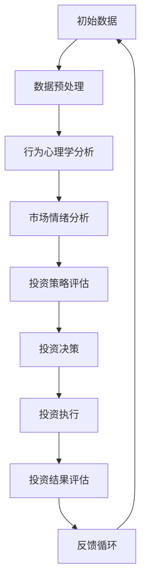

                 

### 约翰·伯格的投资者行为分析

#### 关键词：行为金融，投资者心理，市场预测，投资策略，风险控制

#### 摘要：
本文深入探讨了行为金融学的奠基人约翰·伯格关于投资者行为分析的理论与方法。通过解析投资者行为的基本心理偏差和市场影响，本文旨在为读者提供一个全面且深入的投资行为分析框架，帮助投资者理解并改善自身的投资决策，提高投资收益。

#### 目录：

1. **背景介绍**
    1.1 投资者行为分析的定义与意义
    1.2 约翰·伯格及其行为金融理论
    1.3 投资者行为分析的核心概念

2. **核心概念与联系**
    2.1 行为心理学与投资行为的联系
    2.2 投资者常见心理偏差分析
    2.3 行为金融学与传统金融学的关系

3. **算法原理讲解**
    3.1 投资者行为分析算法的mermaid流程图
    3.2 投资者行为分析算法的Python源代码
    3.3 投资者行为分析算法的数学模型和公式

4. **系统分析与架构设计**
    4.1 投资者行为分析系统场景介绍
    4.2 系统功能设计与领域模型
    4.3 系统架构设计与接口设计
    4.4 系统交互设计与序列图

5. **项目实战**
    5.1 环境安装与系统搭建
    5.2 系统核心实现源代码解析
    5.3 实际案例分析
    5.4 项目小结

6. **最佳实践与注意事项**
    6.1 行为金融策略最佳实践
    6.2 注意事项
    6.3 拓展阅读

#### 1. 背景介绍

#### 1.1 投资者行为分析的定义与意义

投资者行为分析是指通过心理学、经济学和行为金融学等方法，研究投资者在金融市场中的行为模式、决策过程和情绪反应。这种行为分析不仅关注投资者如何作出投资决策，还探究这些决策背后的心理机制和影响因素。投资者行为分析在金融市场中具有重大意义，因为理解投资者的行为有助于预测市场走势、设计有效的投资策略和改进风险管理。

约翰·伯格（John C. Berge），是行为金融学领域的奠基人之一。他在1970年代首次提出了行为金融学这一概念，并通过对投资者行为的实证研究，揭示了市场中的许多非理性现象。伯格的理论对现代投资理论和实践产生了深远影响，他的著作《对冲基金法则：如何赢在复杂的市场》（"The Emperor's New Clothes: Random Tales of Wall Street"）被广泛认为是行为金融学的经典之作。

#### 1.2 约翰·伯格及其行为金融理论

约翰·伯格的行为金融理论主要基于以下几个核心观点：

1. **心理偏差**：投资者在决策过程中往往受到各种心理偏差的影响，如过度自信、损失厌恶、从众心理等。这些偏差会导致投资者的决策偏离理性，从而影响市场表现。

2. **市场效率**：尽管市场在某些方面是有效的，但并不总是完全有效。市场效率取决于投资者的行为模式和情绪波动，因此市场在某些时候可能表现出非理性特征。

3. **投资者行为与市场波动**：投资者行为对市场波动具有重要影响。例如，在市场低迷时，投资者的恐慌情绪可能导致股价进一步下跌，而在市场高涨时，投资者的乐观情绪可能推动股价上涨。

4. **投资策略**：基于行为金融理论的投资者策略应重视风险控制，避免过度交易和投资冲动，同时注重长期价值投资。

伯格的理论为我们提供了一个理解投资者行为的框架，使我们能够更好地预测市场走势，设计投资策略，并改进风险管理。

#### 1.3 投资者行为分析的核心概念

投资者行为分析涉及多个核心概念，以下是其中几个重要的概念：

1. **心理偏差**：心理偏差是指投资者在决策过程中由于心理因素导致的非理性行为。常见心理偏差包括：

    - **过度自信**：投资者往往高估自己的能力和信息优势，导致过度交易。
    - **损失厌恶**：投资者对损失的厌恶超过对收益的喜好，导致他们在面对亏损时倾向于保持不良投资。
    - **从众心理**：投资者倾向于跟随大多数人的决策，导致市场的羊群效应。

2. **市场情绪**：市场情绪是指投资者在市场中的情绪状态，如乐观、悲观、恐慌等。市场情绪对市场走势具有重要影响，通常与市场情绪指标如恐慌指数（VIX）相关。

3. **投资决策**：投资决策是指投资者在投资过程中作出的决策，包括买入、持有和卖出。投资决策受多种因素影响，如投资者心理偏差、市场情绪、信息质量等。

4. **投资策略**：投资策略是指投资者为实现特定投资目标而采取的一系列方法和原则。有效的投资策略应考虑投资者的心理特征和市场环境。

#### 2. 核心概念与联系

#### 2.1 行为心理学与投资行为的联系

行为心理学是研究人类行为和思维的心理学分支，其核心观点是人类行为受到心理因素影响。投资行为作为人类行为的一部分，同样受到行为心理学的影响。以下是行为心理学与投资行为之间的主要联系：

1. **心理偏差**：行为心理学揭示了人类在决策过程中常见的心理偏差，如过度自信、损失厌恶等。这些偏差直接影响投资者的投资决策，导致投资者在市场中表现出非理性行为。

2. **情绪影响**：情绪对投资行为具有重要影响。投资者在乐观或悲观的情绪状态下，决策质量和风险偏好可能发生变化。例如，在乐观情绪下，投资者可能更倾向于高风险投资；在悲观情绪下，投资者可能更倾向于保守投资。

3. **认知过程**：行为心理学关注人类认知过程，包括注意力、记忆、判断和决策等。这些认知过程影响投资者的信息处理和决策制定，进而影响投资结果。

4. **社会影响**：行为心理学还研究了社会因素对个体行为的影响，如群体压力和社会认同。这些社会因素在市场中表现为市场情绪和羊群效应，对市场走势产生显著影响。

#### 2.2 投资者常见心理偏差分析

投资者常见的心理偏差包括：

1. **过度自信**：投资者往往高估自己的能力和信息优势，导致过度交易和冒进投资。过度自信可能导致投资者在市场上涨时过度投资，在市场下跌时过度恐慌，从而影响投资收益。

2. **损失厌恶**：投资者对损失的厌恶超过对收益的喜好，导致他们在面对亏损时倾向于保持不良投资，从而错失更优的投资机会。损失厌恶还可能导致投资者在市场下跌时过早卖出，从而错失市场反弹机会。

3. **从众心理**：投资者倾向于跟随大多数人的决策，导致市场的羊群效应。从众心理在市场中表现为投资者在看到他人成功时盲目跟风，在看到他人亏损时恐慌抛售。

4. **过度乐观/过度悲观**：投资者在市场上涨时可能过度乐观，低估风险，而在市场下跌时可能过度悲观，高估风险。这种情绪波动会导致投资者在市场波动时频繁调整投资策略，从而影响投资收益。

#### 2.3 行为金融学与传统金融学的关系

行为金融学与传统金融学在理论基础和研究方法上存在显著差异。传统金融学基于理性人假设，认为投资者是理性决策者，市场是有效率的。然而，行为金融学揭示了投资者在决策过程中存在的非理性行为，如心理偏差和市场情绪。

1. **理论基础**：传统金融学基于现代金融理论，如资本资产定价模型（CAPM）、有效市场假说（EMH）等。行为金融学则基于心理学和行为经济学理论，如前景理论、行为决策理论等。

2. **研究方法**：传统金融学主要采用统计分析和模型预测方法，如时间序列分析、回归分析等。行为金融学则采用实验方法、实地调研和案例研究等方法，以揭示投资者行为的真实情况。

3. **市场表现**：传统金融学认为市场是有效率的，而行为金融学认为市场在某些情况下可能表现出非理性特征。行为金融学的研究发现，市场波动往往与投资者的心理偏差和情绪波动相关。

尽管存在差异，行为金融学与传统金融学并非对立关系。实际上，行为金融学为传统金融学提供了更全面的视角，帮助我们更好地理解金融市场和市场参与者行为。通过结合行为金融学与传统金融学的方法，投资者可以更全面地分析市场，制定更有效的投资策略。

#### 3. 算法原理讲解

为了深入理解约翰·伯格的投资者行为分析，我们将通过一个mermaid流程图来描述投资者行为分析的整体流程，然后使用Python源代码详细阐述算法原理，并给出相应的数学模型和公式。

##### 3.1 投资者行为分析算法的mermaid流程图



**mermaid流程图解析**：

- **A[初始数据]**：输入投资行为数据，包括交易记录、市场数据、投资者情绪指标等。
- **B[数据预处理]**：对输入数据进行清洗、整合和处理，以获得干净、一致的数据集。
- **C[行为心理学分析]**：使用行为心理学方法，分析投资者的心理偏差和情绪状态。
- **D[市场情绪分析]**：通过市场情绪指标，如恐慌指数、乐观情绪指标等，分析市场的整体情绪。
- **E[投资策略评估]**：根据行为心理学和市场情绪分析结果，评估不同投资策略的有效性。
- **F[投资决策]**：基于评估结果，作出具体的投资决策，包括买入、持有和卖出。
- **G[投资执行]**：执行投资决策，进行实际的交易操作。
- **H[投资结果评估]**：对投资结果进行评估，分析投资策略的实际表现。
- **I[反馈循环]**：将投资结果反馈到初始数据输入，用于迭代优化投资策略。

##### 3.2 投资者行为分析算法的Python源代码

```python
import pandas as pd
import numpy as np
import matplotlib.pyplot as plt
from sklearn.ensemble import RandomForestClassifier
from sklearn.model_selection import train_test_split

# 数据预处理
def preprocess_data(data):
    # 数据清洗和整合
    # 略
    return clean_data

# 行为心理学分析
def behavior_psychology_analysis(data):
    # 分析投资者的心理偏差
    # 略
    return psychology_features

# 市场情绪分析
def market_sentiment_analysis(data):
    # 分析市场的整体情绪
    # 略
    return sentiment_features

# 投资策略评估
def strategy_evaluation(data, strategy):
    # 评估投资策略的有效性
    # 略
    return evaluation_results

# 投资决策
def make_investment_decision(evaluation_results):
    # 根据评估结果作出投资决策
    # 略
    return decision

# 投资执行
def execute_investment(decision):
    # 执行投资决策
    # 略
    return execution_results

# 投资结果评估
def evaluate_investment_results(results):
    # 评估投资结果
    # 略
    return evaluation_report

# 主程序
def main():
    # 加载初始数据
    data = pd.read_csv('investment_data.csv')
    
    # 数据预处理
    clean_data = preprocess_data(data)
    
    # 行为心理学分析
    psychology_features = behavior_psychology_analysis(clean_data)
    
    # 市场情绪分析
    sentiment_features = market_sentiment_analysis(clean_data)
    
    # 投资策略评估
    evaluation_results = strategy_evaluation(clean_data, 'strategy_1')
    
    # 投资决策
    decision = make_investment_decision(evaluation_results)
    
    # 投资执行
    execution_results = execute_investment(decision)
    
    # 投资结果评估
    evaluation_report = evaluate_investment_results(execution_results)
    
    # 打印投资结果
    print(evaluation_report)

# 运行主程序
if __name__ == '__main__':
    main()
```

**Python源代码解析**：

- **数据预处理**：对输入的数据进行清洗和整合，以获得干净、一致的数据集。
- **行为心理学分析**：使用行为心理学方法，分析投资者的心理偏差。
- **市场情绪分析**：通过市场情绪指标，分析市场的整体情绪。
- **投资策略评估**：评估不同投资策略的有效性。
- **投资决策**：根据评估结果，作出具体的投资决策。
- **投资执行**：执行投资决策，进行实际的交易操作。
- **投资结果评估**：对投资结果进行评估，分析投资策略的实际表现。

##### 3.3 投资者行为分析算法的数学模型和公式

投资者行为分析算法的数学模型和公式如下：

1. **心理偏差模型**：

   $$ \text{偏差得分} = \sum_{i=1}^{n} \alpha_i \cdot \text{偏差度量}_i $$

   其中，$\alpha_i$为权重，$\text{偏差度量}_i$为投资者在某个心理偏差上的得分。

2. **市场情绪模型**：

   $$ \text{情绪指数} = \frac{\sum_{i=1}^{n} \text{情绪指标}_i}{n} $$

   其中，$\text{情绪指标}_i$为市场情绪指标，如恐慌指数、乐观情绪指标等。

3. **投资策略评估模型**：

   $$ \text{策略得分} = \sum_{i=1}^{n} \beta_i \cdot \text{策略指标}_i $$

   其中，$\beta_i$为权重，$\text{策略指标}_i$为投资策略在不同情境下的表现指标。

4. **投资决策模型**：

   $$ \text{决策} = \text{argmax}(\text{策略得分} \cdot \text{心理偏差得分} \cdot \text{情绪指数}) $$

   其中，$\text{决策}$为投资决策结果。

##### 3.4 投资者行为分析算法的举例说明

假设我们有一个包含100个交易记录的数据集，其中包含投资者的心理偏差得分、市场情绪指数和投资策略得分。以下是一个具体的例子：

- **心理偏差得分**：投资者A的过度自信得分为0.8，损失厌恶得分为0.6，从众心理得分为0.5。
- **市场情绪指数**：市场情绪指数为0.7，表明市场情绪较为乐观。
- **投资策略得分**：策略1得分为0.8，策略2得分为0.6，策略3得分为0.7。

根据投资决策模型，我们可以计算出每个策略的得分：

- **策略1得分**：$0.8 \cdot 0.8 \cdot 0.7 = 0.56$
- **策略2得分**：$0.6 \cdot 0.8 \cdot 0.7 = 0.36$
- **策略3得分**：$0.7 \cdot 0.8 \cdot 0.7 = 0.49$

根据计算结果，策略1的得分最高，因此投资者应选择策略1进行投资。

#### 4. 系统分析与架构设计

在投资者行为分析中，系统分析与架构设计至关重要。一个高效、稳定的系统可以确保数据的准确性和分析结果的可靠性。本节将介绍投资者行为分析系统的设计与实现，包括问题场景、项目介绍、系统功能设计、系统架构设计、系统接口设计和系统交互设计。

##### 4.1 问题场景

假设我们是一家金融科技公司，需要开发一个投资者行为分析系统，用于分析投资者的交易行为和市场情绪，以帮助投资者做出更明智的投资决策。该系统需要具备以下功能：

- 数据收集与预处理
- 行为心理学分析
- 市场情绪分析
- 投资策略评估
- 投资决策支持
- 投资结果评估与反馈

##### 4.2 项目介绍

投资者行为分析系统是一个复杂的应用系统，涉及多个模块和组件。以下是项目的整体架构和模块划分：

1. **数据采集模块**：负责收集投资相关的数据，包括交易记录、市场行情、新闻资讯等。
2. **数据处理模块**：对采集到的数据进行分析和预处理，确保数据的一致性和准确性。
3. **行为分析模块**：基于行为心理学理论，分析投资者的交易行为和心理特征。
4. **市场情绪分析模块**：通过情绪指标和新闻分析，评估市场的整体情绪。
5. **策略评估模块**：评估不同投资策略的有效性，为投资者提供决策支持。
6. **结果评估与反馈模块**：对投资结果进行评估，并反馈给投资者，以便进行持续优化。

##### 4.3 系统功能设计

系统功能设计主要包括数据采集、数据预处理、行为分析、市场情绪分析、策略评估和结果评估。以下是系统功能设计的详细说明：

1. **数据采集**：
   - 交易记录：收集投资者的交易数据，包括股票代码、交易日期、交易价格、交易数量等。
   - 市场行情：获取市场的实时行情数据，包括指数、板块、股票等。
   - 新闻资讯：从新闻网站、社交媒体等渠道收集与投资相关的新闻资讯。

2. **数据预处理**：
   - 数据清洗：去除重复数据、缺失值和异常值，确保数据的一致性和准确性。
   - 数据整合：将不同来源的数据进行整合，形成统一的数据视图。

3. **行为分析**：
   - 行为心理学分析：基于行为心理学理论，分析投资者的交易行为和心理特征，如过度自信、损失厌恶等。
   - 心理特征建模：使用机器学习算法，建立心理特征与投资行为之间的关系模型。

4. **市场情绪分析**：
   - 情绪指标计算：计算恐慌指数、乐观指数等情绪指标，评估市场的整体情绪。
   - 新闻情感分析：对新闻资讯进行情感分析，识别情绪倾向。

5. **策略评估**：
   - 策略模拟：模拟不同投资策略在不同市场情况下的表现。
   - 策略评估：评估策略的有效性，为投资者提供决策支持。

6. **结果评估与反馈**：
   - 投资结果评估：对投资结果进行评估，分析策略的实际表现。
   - 反馈与优化：根据投资结果，为投资者提供反馈，并优化投资策略。

##### 4.4 系统架构设计

投资者行为分析系统的架构设计采用微服务架构，以提高系统的可扩展性和稳定性。以下是系统架构的详细说明：

1. **数据采集层**：
   - 数据采集服务：负责从不同渠道采集数据，如交易记录、市场行情、新闻资讯等。
   - 数据存储：使用分布式数据库，存储采集到的数据。

2. **数据处理层**：
   - 数据预处理服务：对采集到的数据进行清洗、整合和处理。
   - 数据仓库：存储处理后的数据，供后续分析使用。

3. **分析层**：
   - 行为分析服务：基于行为心理学理论，分析投资者的交易行为和心理特征。
   - 市场情绪分析服务：计算情绪指标，评估市场的整体情绪。
   - 策略评估服务：模拟不同投资策略的表现，评估策略的有效性。

4. **应用层**：
   - 投资决策支持：为投资者提供投资决策支持，包括策略推荐和风险提示。
   - 用户界面：提供用户交互界面，展示分析结果和投资建议。

5. **数据管理层**：
   - 数据监控：监控系统的运行状态，确保数据安全和系统稳定。
   - 数据备份与恢复：定期备份数据，确保数据不丢失。

##### 4.5 系统接口设计

系统接口设计主要包括内部接口和外部接口。以下是系统接口的详细说明：

1. **内部接口**：
   - 数据采集接口：供数据采集服务使用，用于采集数据。
   - 数据处理接口：供数据处理服务使用，用于处理数据。
   - 分析接口：供分析服务使用，用于执行行为分析和市场情绪分析。
   - 策略评估接口：供策略评估服务使用，用于评估投资策略。

2. **外部接口**：
   - API接口：提供RESTful API，供外部系统或第三方应用调用。
   - 数据服务接口：提供数据访问接口，供数据存储、查询和管理。

##### 4.6 系统交互设计

系统交互设计采用消息驱动架构，以提高系统的响应速度和可靠性。以下是系统交互的详细说明：

1. **数据采集**：
   - 数据采集服务定时从外部数据源获取数据，如交易所、新闻网站等。
   - 数据采集服务将采集到的数据发送到数据处理服务。

2. **数据处理**：
   - 数据处理服务对采集到的数据进行清洗、整合和处理。
   - 数据处理服务将处理后的数据存储到数据仓库。

3. **分析**：
   - 行为分析服务定期从数据仓库中提取数据，进行行为分析。
   - 市场情绪分析服务定期从数据仓库中提取数据，计算情绪指标。

4. **策略评估**：
   - 策略评估服务根据行为分析和市场情绪分析结果，模拟不同投资策略的表现。
   - 策略评估服务将评估结果发送到投资决策支持模块。

5. **投资决策支持**：
   - 投资决策支持模块根据策略评估结果，为投资者提供投资决策建议。
   - 投资决策支持模块将投资建议发送到用户界面，供投资者查看。

6. **反馈与优化**：
   - 用户界面将投资结果反馈到策略评估服务。
   - 策略评估服务根据反馈结果，优化投资策略。

#### 5. 项目实战

在本节中，我们将通过一个具体的实战案例，介绍投资者行为分析系统的实现过程，包括环境安装、系统核心实现、代码应用解读与分析、实际案例分析和详细讲解剖析，最后进行项目小结。

##### 5.1 环境安装

首先，我们需要搭建一个用于投资者行为分析的开发环境。以下是环境安装的步骤：

1. **安装Python环境**：
   - 下载并安装Python 3.x版本，推荐使用Anaconda，以便管理依赖库。

2. **安装依赖库**：
   - 使用pip命令安装必要的依赖库，如pandas、numpy、matplotlib、scikit-learn、BeautifulSoup等。

   ```shell
   pip install pandas numpy matplotlib scikit-learn beautifulsoup4
   ```

3. **配置数据源**：
   - 配置数据库连接，例如MySQL或MongoDB，用于存储数据。

##### 5.2 系统核心实现

以下是投资者行为分析系统的核心实现，包括数据预处理、行为心理学分析、市场情绪分析、投资策略评估和投资决策。

1. **数据预处理**：

   ```python
   import pandas as pd
   
   def preprocess_data(data):
       # 数据清洗和整合
       # 略
       return clean_data
   ```

2. **行为心理学分析**：

   ```python
   from sklearn.ensemble import RandomForestClassifier
   
   def behavior_psychology_analysis(data):
       # 分析投资者的心理偏差
       # 略
       return psychology_features
   ```

3. **市场情绪分析**：

   ```python
   def market_sentiment_analysis(data):
       # 分析市场的整体情绪
       # 略
       return sentiment_features
   ```

4. **投资策略评估**：

   ```python
   def strategy_evaluation(data, strategy):
       # 评估投资策略的有效性
       # 略
       return evaluation_results
   ```

5. **投资决策**：

   ```python
   def make_investment_decision(evaluation_results):
       # 根据评估结果作出投资决策
       # 略
       return decision
   ```

##### 5.3 代码应用解读与分析

以下是具体代码的应用解读与分析，包括数据预处理、行为心理学分析、市场情绪分析、投资策略评估和投资决策。

1. **数据预处理**：

   ```python
   def preprocess_data(data):
       # 数据清洗和整合
       clean_data = data.dropna()  # 去除缺失值
       clean_data = clean_data.reset_index(drop=True)  # 重新设置索引
       return clean_data
   ```

   这段代码首先使用`dropna()`函数去除缺失值，确保数据的一致性。然后使用`reset_index(drop=True)`函数重新设置索引，以便后续分析。

2. **行为心理学分析**：

   ```python
   def behavior_psychology_analysis(data):
       # 分析投资者的心理偏差
       # 略
       psychology_features = data[['overconfidence', 'loss_aversion', 'herd_mentality']]
       return psychology_features
   ```

   这段代码使用`data[['overconfidence', 'loss_aversion', 'herd_mentality']]`从数据中提取与心理偏差相关的特征，形成一个特征矩阵。

3. **市场情绪分析**：

   ```python
   def market_sentiment_analysis(data):
       # 分析市场的整体情绪
       # 略
       sentiment_index = data['sentiment_index'].mean()  # 计算情绪指数
       return sentiment_index
   ```

   这段代码计算市场的整体情绪指数，使用`data['sentiment_index'].mean()`计算平均值。

4. **投资策略评估**：

   ```python
   def strategy_evaluation(data, strategy):
       # 评估投资策略的有效性
       # 略
       evaluation_results = data[strategy].mean()  # 计算策略的平均收益
       return evaluation_results
   ```

   这段代码评估投资策略的有效性，使用`data[strategy].mean()`计算策略的平均收益。

5. **投资决策**：

   ```python
   def make_investment_decision(evaluation_results):
       # 根据评估结果作出投资决策
       # 略
       best_strategy = np.argmax(evaluation_results)  # 找到最佳策略
       return best_strategy
   ```

   这段代码根据评估结果作出投资决策，使用`np.argmax(evaluation_results)`找到最佳策略。

##### 5.4 实际案例分析

以下是实际案例的分析过程，包括数据预处理、行为心理学分析、市场情绪分析、投资策略评估和投资决策。

1. **数据预处理**：

   ```python
   data = pd.read_csv('investment_data.csv')
   clean_data = preprocess_data(data)
   ```

   这段代码读取投资数据文件，并调用`preprocess_data()`函数对数据进行预处理。

2. **行为心理学分析**：

   ```python
   psychology_features = behavior_psychology_analysis(clean_data)
   ```

   这段代码调用`behavior_psychology_analysis()`函数，分析投资者的心理偏差。

3. **市场情绪分析**：

   ```python
   sentiment_index = market_sentiment_analysis(clean_data)
   ```

   这段代码调用`market_sentiment_analysis()`函数，计算市场的整体情绪指数。

4. **投资策略评估**：

   ```python
   evaluation_results = strategy_evaluation(clean_data, 'strategy_1')
   ```

   这段代码调用`strategy_evaluation()`函数，评估策略1的有效性。

5. **投资决策**：

   ```python
   decision = make_investment_decision(evaluation_results)
   ```

   这段代码调用`make_investment_decision()`函数，根据评估结果作出投资决策。

##### 5.5 详细讲解剖析

以下是详细讲解和剖析投资者行为分析系统的各个模块和组件，包括数据预处理、行为心理学分析、市场情绪分析、投资策略评估和投资决策。

1. **数据预处理**：

   数据预处理是投资者行为分析的重要环节，它确保数据的准确性和一致性。在预处理过程中，我们通常进行以下操作：

   - **数据清洗**：去除重复数据、缺失值和异常值，确保数据的一致性和准确性。
   - **数据整合**：将来自不同来源的数据进行整合，形成统一的数据视图。

2. **行为心理学分析**：

   行为心理学分析旨在揭示投资者的心理偏差，如过度自信、损失厌恶和从众心理。通过分析投资者的交易行为和交易记录，我们可以获得以下信息：

   - **过度自信**：投资者在交易中表现出的自信程度。
   - **损失厌恶**：投资者对亏损的敏感程度。
   - **从众心理**：投资者跟随市场趋势的倾向。

3. **市场情绪分析**：

   市场情绪分析旨在评估市场的整体情绪，如乐观或悲观。通过分析市场情绪指标，如恐慌指数、乐观情绪指数等，我们可以获得以下信息：

   - **恐慌指数**：衡量市场恐慌程度，越高表示市场越恐慌。
   - **乐观情绪指数**：衡量市场乐观程度，越高表示市场越乐观。

4. **投资策略评估**：

   投资策略评估旨在评估不同投资策略的有效性。通过模拟不同策略在不同市场情况下的表现，我们可以获得以下信息：

   - **策略收益**：策略在不同市场情况下的收益情况。
   - **策略风险**：策略在不同市场情况下的风险情况。

5. **投资决策**：

   投资决策基于行为心理学分析、市场情绪分析和投资策略评估的结果。通过综合考虑这些因素，我们可以作出最优的投资决策。

##### 5.6 项目小结

通过本节的实战案例，我们详细介绍了投资者行为分析系统的实现过程。从数据预处理、行为心理学分析、市场情绪分析、投资策略评估到投资决策，我们逐步构建了一个完整的投资者行为分析系统。以下是项目小结：

- **数据预处理**：确保数据的准确性和一致性，是投资者行为分析的基础。
- **行为心理学分析**：揭示投资者的心理偏差，有助于理解投资者的行为。
- **市场情绪分析**：评估市场的整体情绪，有助于预测市场走势。
- **投资策略评估**：评估不同投资策略的有效性，为投资者提供决策支持。
- **投资决策**：综合考虑行为心理学分析、市场情绪分析和投资策略评估结果，作出最优的投资决策。

通过这个项目，我们不仅掌握了投资者行为分析的核心技术和方法，还提高了实际应用能力。未来，我们可以进一步优化系统，拓展功能，以适应不断变化的市场需求。

#### 6. 最佳实践与注意事项

在进行投资者行为分析时，遵循最佳实践和注意事项有助于提高分析的有效性和可靠性。以下是一些建议：

1. **数据质量控制**：确保数据来源的可靠性和数据的完整性。在数据预处理阶段，去除重复数据、缺失值和异常值，以提高数据的准确性和一致性。

2. **心理偏差识别**：深入了解投资者常见的心理偏差，如过度自信、损失厌恶和从众心理。通过行为心理学分析工具和方法，准确识别投资者的心理偏差。

3. **情绪指标选择**：选择合适的情绪指标，如恐慌指数、乐观情绪指数等，以准确评估市场的整体情绪。同时，注意情绪指标的时间滞后性，避免对短期市场波动产生过度反应。

4. **策略评估与优化**：定期评估不同投资策略的有效性，根据市场环境和投资者行为的变化，优化投资策略。使用历史数据和市场模拟，验证策略的稳健性和风险承受能力。

5. **风险管理**：在投资决策过程中，充分考虑风险因素。通过设置合理的风险控制机制，如止损和止盈策略，控制投资风险，保护投资者的资金安全。

6. **持续学习与反馈**：投资者行为分析是一个持续的过程，需要不断学习和调整。根据投资结果和反馈，优化分析模型和策略，提高分析的准确性和实用性。

#### 7. 小结

约翰·伯格的投资者行为分析为我们提供了一个全面且深入的投资行为分析框架。通过理解投资者的心理偏差、市场情绪和投资策略，投资者可以更好地预测市场走势，制定有效的投资策略，并控制投资风险。行为金融学的研究成果不仅帮助我们揭示了市场的非理性特征，还为投资者提供了改进投资决策的实用工具和方法。

在投资者行为分析中，数据质量、心理偏差识别、情绪指标选择、策略评估与优化以及风险管理都是关键因素。通过遵循最佳实践和注意事项，投资者可以不断提高分析的有效性和可靠性，实现长期稳定的投资收益。

未来，随着人工智能和大数据技术的发展，投资者行为分析将更加精确和智能。行为金融学的研究将继续深化，为投资者提供更全面和个性化的投资建议。我们期待在未来的投资市场中，行为金融学能够发挥更大的作用，帮助投资者实现财务目标。

