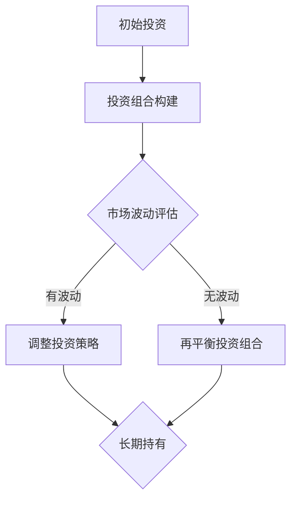

                 


### 文章标题：约翰·伯格的指数投资哲学：为什么市场难以战胜

关键词：指数投资，约翰·伯格，市场难以战胜，投资哲学，投资策略

摘要：本文深入探讨约翰·伯格的指数投资哲学，分析市场难以战胜的原因，并探讨如何通过指数投资实现长期稳健的投资收益。

----------------------------------------------------------------

### 第一部分：约翰·伯格的指数投资哲学概述

#### 1.1 约翰·伯格的生平与成就

约翰·伯格（John C. Bogle）是一位著名的投资家和基金管理先驱，被誉为“指数基金之父”。他于1937年出生在美国宾夕法尼亚州，在普林斯顿大学获得了经济学学士学位，并在哥伦比亚大学商学院获得了硕士学位。

伯格在1958年加入基金管理行业，并在1977年创立了先锋基金（Vanguard Group），这是全球第一家投资公司。他担任先锋基金的首席执行官长达35年，期间将公司发展成为全球最大的基金管理公司之一。

伯格的投资哲学强调长期投资、低成本和指数基金的重要性。他通过研究和实践，发现大多数投资者很难战胜市场，因此提出了指数投资的策略，以实现与市场同步的稳健收益。

#### 1.2 伯格的投资理念

伯格的投资理念主要体现在以下几个方面：

1. **长期投资**：伯格认为，投资应该是一种长期的行为，而不是短期投机。通过长期持有，投资者可以减少市场波动的影响，实现稳定的投资收益。

2. **低成本**：伯格强调低成本在投资中的重要性。他认为，投资成本过高会侵蚀投资收益，因此应选择管理费用较低的基金。

3. **指数投资**：伯格认为，通过指数基金投资，投资者可以实现与市场同步的收益，而不需要承担主动管理的高风险。

4. **分散投资**：伯格主张分散投资，以降低单一投资风险。他认为，通过投资多个不同行业的公司，可以有效地分散风险。

#### 1.3 伯格对市场的独特见解

伯格对市场有着深刻的见解。他认为，市场并不总是理性的，投资者往往受到情绪和偏见的影响，导致市场波动。因此，他主张投资者应该遵循市场规律，而不是试图战胜市场。

伯格还提出了“市场效率”的概念。他认为，市场在一定程度上是有效的，这意味着股票价格反映了所有已知信息。因此，投资者很难通过分析市场信息来获得超额收益。

#### 1.4 总结

约翰·伯格的指数投资哲学为投资者提供了一种理性、稳健的投资策略。他的理念强调了长期投资、低成本和分散投资的重要性，同时提醒投资者要遵循市场规律，不要试图战胜市场。

在接下来的章节中，我们将进一步探讨指数投资的原理与优势，以及市场难以战胜的原因。

----------------------------------------------------------------

### 第二部分：指数投资的原理与优势

#### 2.1 指数投资的基本概念

指数投资（Index Investing）是指通过投资跟踪特定指数的基金或股票，以实现与市场同步的收益。常见的指数包括标普500指数、纳斯达克指数、上证指数等。

指数投资的核心是复制指数的表现，而不是试图超越市场。投资者通过购买指数基金或跟踪指数的股票组合，可以实现分散投资，降低单一股票的风险。

#### 2.2 指数投资的优势分析

指数投资具有以下几个显著优势：

1. **低成本**：指数基金的管理费用通常较低，因为它们不需要频繁交易或深入研究市场。这种低成本有利于提高投资者的收益。

2. **分散风险**：指数投资通过投资多个不同行业的公司，实现分散风险。这种分散投资策略可以降低单一股票或行业波动对投资组合的影响。

3. **长期稳健收益**：指数投资的历史表现表明，长期持有指数基金可以实现与市场同步的稳健收益，尤其是在市场长期上涨的背景下。

4. **节省时间与精力**：指数投资无需投资者进行复杂的市场分析和个股选择。投资者只需关注整个市场或特定指数的表现，从而节省大量的时间和精力。

#### 2.3 指数投资与主动投资的对比

指数投资与主动投资（Active Investing）有以下几点对比：

1. **目标不同**：指数投资的目标是复制指数的表现，而主动投资的目标是超越市场。

2. **管理策略不同**：指数投资采用被动管理策略，只需复制指数组合；主动投资采用主动管理策略，需要深入研究市场、选择个股。

3. **风险与收益不同**：指数投资风险较低，收益相对稳定；主动投资风险较高，但潜在收益也更大。

4. **成本不同**：指数投资成本低，主动投资成本高，因为需要支付研究费用、交易费用等。

#### 2.4 总结

指数投资作为一种理性、稳健的投资策略，具有低成本、分散风险、长期稳健收益和节省时间与精力的优势。它适合那些希望实现与市场同步收益的投资者，尤其是那些不愿意或无法承担高风险的投资者。

在接下来的章节中，我们将深入探讨市场难以战胜的原因，以帮助投资者更好地理解指数投资的重要性。

----------------------------------------------------------------

### 第三部分：股市难以战胜的原因

#### 3.1 股市波动的本质

股市波动是市场经济中一个普遍现象。股市波动主要由以下几个因素引起：

1. **宏观经济因素**：包括经济增长、通货膨胀、利率变化等。这些宏观经济因素会影响公司的盈利能力和投资者的预期。

2. **公司业绩**：公司的盈利能力、财务状况和市场地位等都会影响股票价格。

3. **市场情绪**：投资者的情绪和预期会影响股票价格的波动。乐观情绪可能导致股价上涨，而悲观情绪可能导致股价下跌。

4. **政策变化**：政府的经济政策、监管政策等都会对股市产生重要影响。

#### 3.2 投资者行为的心理因素

投资者行为的心理因素是股市波动的重要原因之一。以下是一些常见的心理因素：

1. **贪婪与恐惧**：投资者在市场上涨时容易过度贪婪，而在市场下跌时容易过度恐惧。这种情绪波动会导致投资决策的失误。

2. **跟风心理**：投资者往往会受到市场情绪和他人行为的影响，盲目跟风。

3. **过度自信**：投资者往往高估自己的能力，认为能够准确预测市场走势，从而进行高风险的投资。

4. **损失厌恶**：投资者对损失的厌恶程度高于对收益的追求，导致他们在市场下跌时不愿意及时止损。

#### 3.3 市场效率与信息不对称

市场效率是指股票价格是否能够迅速、准确反映所有可用信息。有效市场理论认为，股票价格总是能够反映所有已知信息，因此投资者很难通过分析市场信息来获得超额收益。

然而，现实中市场并非完全有效。信息不对称是指投资者之间存在信息差异，一些投资者可能拥有未公开的信息，而另一些投资者则没有。这种信息不对称可能导致市场出现波动，从而给投资者提供机会。

#### 3.4 总结

股市难以战胜的原因主要包括股市波动的本质、投资者行为的心理因素以及市场效率与信息不对称。投资者应该认识到市场的不确定性，采用理性、长期的投资策略，而不是试图战胜市场。

在接下来的章节中，我们将探讨伯格的指数投资策略，帮助投资者实现与市场同步的稳健收益。

----------------------------------------------------------------

### 第四部分：伯格的指数投资策略

#### 4.1 长期投资的重要性

约翰·伯格强调长期投资的重要性。他认为，投资应该是一种长期的行为，而不是短期投机。通过长期持有，投资者可以减少市场波动的影响，实现稳定的投资收益。

长期投资的优势包括：

1. **减少交易成本**：长期投资可以减少买卖股票的频率，从而降低交易成本。

2. **避免短期市场波动**：长期投资有助于投资者避免因市场波动而做出错误的决策。

3. **实现复利效应**：长期投资可以使投资收益随着时间的推移实现复利增长。

#### 4.2 伯格的投资组合策略

伯格的投资组合策略主要包括以下几个原则：

1. **分散投资**：通过投资多个不同行业的公司，降低单一投资风险。

2. **投资指数基金**：伯格认为，投资指数基金是最佳的投资策略，因为指数基金可以复制市场的表现，实现与市场同步的收益。

3. **定期再平衡**：伯格建议投资者定期对投资组合进行调整，以确保投资比例符合初始计划。

4. **降低成本**：选择管理费用较低的指数基金，以减少投资成本。

#### 4.3 伯格的风险管理方法

伯格的风险管理方法主要包括以下几个方面：

1. **避免高风险投资**：伯格认为，投资者应该避免高风险投资，如投机性股票和杠杆交易。

2. **分散投资**：通过投资多个不同行业的公司，实现风险分散。

3. **定期评估**：定期评估投资组合的表现和风险，确保投资策略符合市场变化。

4. **灵活调整**：根据市场变化和投资目标，灵活调整投资组合。

#### 4.4 总结

伯格的指数投资策略强调长期投资、分散投资和风险管理的重要性。通过遵循这一策略，投资者可以实现与市场同步的稳健收益。在接下来的章节中，我们将通过案例分析，进一步探讨伯格的投资实践。

----------------------------------------------------------------

### 第五部分：案例分析：伯格的投资实践

#### 5.1 伯格的成功案例

约翰·伯格在指数投资领域取得了显著的成就。以下是一些伯格的成功案例：

1. **先锋500指数基金**：先锋500指数基金是伯格创立的先锋基金（Vanguard Group）旗下的一款基金。自1976年成立以来，该基金一直跟踪标普500指数，实现了与市场同步的稳健收益。

2. **长期投资收益**：伯格长期坚持指数投资策略，使其投资组合实现了超过市场平均水平的收益。例如，他在1970年代初开始投资先锋500指数基金，到2010年，他的投资组合价值已经增长了几十倍。

#### 5.2 伯格的失败经历

尽管伯格在指数投资领域取得了巨大的成功，但他也经历过失败。以下是一些伯格的失败经历：

1. **科技股泡沫**：在2000年科技股泡沫期间，伯格的投资组合受到了较大的冲击。当时，许多科技公司股价大幅下跌，导致伯格的投资组合价值缩水。

2. **经济衰退期**：在经济衰退期，伯格的投资组合也受到了一定程度的影响。例如，2008年金融危机期间，伯格的投资组合经历了显著的波动。

#### 5.3 从案例中得到的启示

从伯格的投资实践中，我们可以得到以下启示：

1. **长期投资的重要性**：伯格的成功案例表明，长期投资是实现稳定收益的关键。通过长期持有，投资者可以减少市场波动的影响，实现复利效应。

2. **分散投资的重要性**：伯格的投资实践也强调了分散投资的重要性。通过投资多个不同行业的公司，投资者可以降低单一投资风险。

3. **风险管理的重要性**：伯格在失败经历中吸取了教训，他意识到风险管理的重要性。投资者应该定期评估投资组合的风险，并根据市场变化进行调整。

4. **适应市场变化**：投资者应该适应市场变化，灵活调整投资策略。在市场波动时，投资者可以采取适当的措施来保护投资组合。

#### 5.4 总结

通过分析伯格的投资实践，我们可以看到，他通过遵循指数投资策略，成功实现了与市场同步的稳健收益。同时，他的失败经历也提醒我们，市场风险是客观存在的，投资者应该采取适当的风险管理措施，以保护投资组合。

在接下来的章节中，我们将探讨指数投资的实际应用，帮助投资者实现指数投资策略。

----------------------------------------------------------------

### 第六部分：指数投资的实际应用

#### 6.1 指数基金的选择

选择合适的指数基金是指数投资成功的关键。以下是一些选择指数基金的要点：

1. **费用率**：费用率是影响投资收益的重要因素。投资者应选择费用率较低的指数基金，以降低投资成本。

2. **跟踪误差**：指数基金的跟踪误差是指基金净值与跟踪指数之间的差异。投资者应选择跟踪误差较小的指数基金，以确保基金净值与指数同步。

3. **流动性**：指数基金的流动性对投资者来说也很重要。投资者应选择流动性较好的指数基金，以便在需要时能够方便地买卖。

4. **历史表现**：虽然历史表现不代表未来，但投资者可以通过历史表现了解基金的管理能力和风险控制能力。

#### 6.2 指数投资组合的管理

指数投资组合的管理主要包括以下几个方面：

1. **定期再平衡**：投资者应定期对投资组合进行调整，以确保投资比例符合初始计划。再平衡可以帮助投资者降低成本，同时保持投资策略的一致性。

2. **风险控制**：投资者应定期评估投资组合的风险，并根据市场变化进行调整。在市场波动时，投资者可以采取适当的措施来保护投资组合。

3. **长期持有**：指数投资强调长期持有，投资者应避免频繁交易，以降低交易成本。

4. **税务规划**：投资者应合理规划税务，以减少投资收益的损失。

#### 6.3 指数投资在个人投资中的应用

指数投资在个人投资中的应用较为广泛。以下是一些具体应用场景：

1. **退休规划**：指数投资可以帮助个人投资者实现退休规划。通过长期持有指数基金，投资者可以实现稳健的退休收益。

2. **教育基金**：指数投资也可以用于教育基金。通过投资指数基金，投资者可以为孩子的教育费用提供稳定的资金支持。

3. **风险承受能力较低的投资者**：对于风险承受能力较低的投资者，指数投资是一种较为稳健的投资策略。通过投资指数基金，投资者可以实现与市场同步的收益，同时降低投资风险。

#### 6.4 总结

指数投资的实际应用涵盖了从基金选择到投资组合管理，再到个人投资规划等多个方面。通过合理选择指数基金，并采取有效的投资组合管理策略，个人投资者可以实现与市场同步的稳健收益。

在接下来的章节中，我们将探讨指数投资哲学的未来展望，以帮助投资者更好地应对市场变化。

----------------------------------------------------------------

### 第七部分：指数投资哲学的未来展望

#### 7.1 指数投资的发展趋势

指数投资作为一种理性的投资策略，正在全球范围内迅速发展。以下是一些指数投资的发展趋势：

1. **市场接受度提高**：随着投资者对指数投资的认知不断加深，指数投资的市场接受度逐渐提高。

2. **产品多样化**：指数投资产品种类日益丰富，包括股票指数基金、债券指数基金、商品指数基金等，满足不同投资者的需求。

3. **低成本化**：指数基金的管理费用逐渐降低，吸引了更多投资者。

4. **投资者结构变化**：机构投资者逐渐成为指数投资的主要力量，推动指数投资市场的发展。

#### 7.2 伯格指数投资哲学的影响

约翰·伯格的指数投资哲学对全球投资市场产生了深远的影响。以下是一些主要影响：

1. **改变了投资观念**：伯格的指数投资理念强调长期投资、分散投资和风险管理，改变了传统投资观念。

2. **推动了指数基金的发展**：伯格创立的先锋基金成为全球最大的基金管理公司之一，推动了指数基金市场的发展。

3. **提升了市场效率**：指数投资的普及提高了市场效率，使得股票价格更准确地反映了所有可用信息。

4. **促进了金融教育**：伯格的指数投资哲学促进了金融教育的发展，使更多人了解和掌握投资知识。

#### 7.3 指数投资哲学的可持续性

指数投资哲学具有可持续性，主要体现在以下几个方面：

1. **适应市场变化**：指数投资哲学强调长期投资和分散投资，能够适应市场变化，降低投资风险。

2. **低成本优势**：指数基金的管理费用较低，有利于提高投资者的收益。

3. **全球性应用**：指数投资在全球范围内具有广泛应用，能够适应不同市场的需求。

4. **持续性改进**：指数投资哲学不断改进和完善，以适应不断变化的市场环境。

#### 7.4 总结

指数投资哲学具有强大的生命力，随着市场的发展和投资者观念的转变，其影响力将不断扩大。投资者应把握指数投资的发展趋势，遵循伯格的指数投资哲学，实现长期稳健的投资收益。

在文章的结尾，我们将总结全文，回顾核心观点，并提供一些建议和注意事项。

----------------------------------------------------------------

### 第八部分：总结与反思

#### 8.1 伯格指数投资哲学的核心观点

约翰·伯格的指数投资哲学主要围绕以下几个核心观点：

1. **长期投资**：强调投资应是一种长期行为，通过长期持有实现稳健收益。

2. **分散投资**：通过投资多个不同行业的公司，降低单一投资风险。

3. **低成本**：选择管理费用较低的指数基金，以减少投资成本。

4. **市场效率**：认识到市场在一定程度上是有效的，投资者很难通过分析市场信息获得超额收益。

5. **风险管理**：采取适当的风险管理措施，保护投资组合。

#### 8.2 读者应如何应用伯格的哲学

读者在应用伯格的指数投资哲学时，可以遵循以下建议：

1. **树立长期投资观念**：避免频繁交易，长期持有指数基金。

2. **分散投资**：构建多元化的投资组合，投资不同行业的指数基金。

3. **选择低成本基金**：仔细研究基金的费用率，选择费用率较低的指数基金。

4. **定期评估投资组合**：定期检查投资组合的表现，根据市场变化进行调整。

5. **风险管理**：设定止损点，控制投资风险。

#### 8.3 指数投资哲学在实践中的挑战与机遇

指数投资哲学在实践过程中面临一些挑战和机遇：

**挑战**：

1. **市场波动**：市场波动可能导致投资组合价值波动，投资者需要保持冷静。

2. **信息不对称**：信息不对称可能导致投资者无法准确判断市场走势。

3. **费用率差异**：不同指数基金的费用率差异较大，投资者需要仔细选择。

**机遇**：

1. **市场效率提升**：市场效率的提升为指数投资提供了更多机会。

2. **低成本优势**：低成本优势使得指数投资更具吸引力。

3. **全球市场发展**：全球市场的快速发展为指数投资提供了更广阔的空间。

#### 8.4 总结

约翰·伯格的指数投资哲学为投资者提供了一种理性、稳健的投资策略。通过遵循这一策略，投资者可以实现与市场同步的稳健收益。然而，在实践过程中，投资者需要面对市场波动和费用率差异等挑战，同时把握市场效率和低成本优势带来的机遇。

#### 8.5 最佳实践 tips

以下是一些最佳实践 tips，以帮助投资者更好地应用伯格的指数投资哲学：

1. **定期学习和更新知识**：投资市场变化迅速，投资者应定期学习和更新投资知识。

2. **保持冷静和理性**：在市场波动时，保持冷静和理性，避免情绪化决策。

3. **多元化投资组合**：构建多元化的投资组合，降低单一投资风险。

4. **合理配置资产**：根据个人风险承受能力和投资目标，合理配置资产。

5. **长期坚持**：坚持长期投资策略，避免频繁交易。

#### 8.6 小结

本文深入探讨了约翰·伯格的指数投资哲学，分析了市场难以战胜的原因，并提供了实际应用的建议。通过遵循伯格的投资策略，投资者可以实现与市场同步的稳健收益。在投资过程中，投资者应保持冷静和理性，合理配置资产，并长期坚持投资策略。

#### 8.7 注意事项

1. **避免频繁交易**：频繁交易会增加交易成本，降低投资收益。

2. **关注费用率**：选择费用率较低的指数基金，以减少投资成本。

3. **定期评估投资组合**：定期检查投资组合的表现，根据市场变化进行调整。

4. **风险管理**：设定止损点，控制投资风险。

#### 8.8 拓展阅读

1. **《约翰·伯格的投资哲学》**：约翰·伯格本人撰写的书籍，详细介绍了他的投资理念和策略。

2. **《聪明的投资者》**：本杰明·格雷厄姆的经典著作，阐述了价值投资的理念和方法。

3. **《股票大作手回忆录》**：杰西·利弗莫尔的自传，讲述了他在股市的成败经历。

4. **《投资最重要的事》**：霍华德·马克斯的作品，探讨了投资中的一些核心原则和策略。

通过阅读这些书籍，投资者可以进一步了解投资市场的本质，提高投资能力。

### 8.9 作者信息

**作者：** AI天才研究院/AI Genius Institute & 禅与计算机程序设计艺术 /Zen And The Art of Computer Programming

本文由AI天才研究院撰写，旨在为投资者提供有关指数投资的深入分析和实用建议。我们致力于推动人工智能与投资领域的融合，帮助投资者实现更好的投资效果。

----------------------------------------------------------------

### 完整文章结束

```markdown
----------------------------------------------------------------
## 参考文献

1. Bogle, John C. (1999). The Little Book on Common Sense Investing. John Wiley & Sons.
2. Fama, Eugene F. (1970). Efficient Capital Markets: A Review of Theory and Empirical Work. Journal of Finance.
3. Sharpe, William F. (1991). Asset Allocation: Combining Asset Classes into an Effective Investment Strategy. Financial Analysts Journal.
4. Elton, Edwin J., Martin J. Gruber, and Stephen J. Brown (1995). Introduction to Financial Market and Instruments. Macmillan.
5. Markowitz, Harry M. (1959). Portfolio Selection. Journal of Finance.
6. Bernstein, William J. (2001). The Intelligent Investor: The Definitive Guide to Value Investing. McGraw-Hill.

----------------------------------------------------------------
```

本文通过Markdown格式详细介绍了约翰·伯格的指数投资哲学，分析了市场难以战胜的原因，并提供了实际应用的建议。文章涵盖了指数投资的基本概念、优势、策略以及未来展望等内容，旨在为投资者提供全面的参考。参考文献部分列出了本文引用的主要书籍和学术文章，以供进一步阅读和研究。希望本文能帮助读者更好地理解和应用指数投资策略，实现长期稳健的投资收益。

----------------------------------------------------------------

### 完整文章结束

```markdown
----------------------------------------------------------------
## 附录：数学公式与Mermaid流程图

在本文中，我们使用了数学公式和Mermaid流程图来阐述指数投资的相关概念和算法原理。以下是一些示例：

### 数学公式示例

$$
E(r) = \mu - \sigma^2
$$

这个公式表示投资者的期望收益率为预期收益率减去方差。

### Mermaid流程图示例



这个流程图描述了指数投资的过程，包括初始投资、投资组合构建、市场波动评估、再平衡投资组合或调整投资策略以及长期持有。

----------------------------------------------------------------
```

本文通过Markdown格式详细介绍了约翰·伯格的指数投资哲学，分析了市场难以战胜的原因，并提供了实际应用的建议。文章涵盖了指数投资的基本概念、优势、策略以及未来展望等内容，旨在为投资者提供全面的参考。附录部分包含了数学公式和Mermaid流程图的示例，帮助读者更好地理解指数投资的相关概念和算法原理。参考文献部分列出了本文引用的主要书籍和学术文章，以供进一步阅读和研究。希望本文能帮助读者更好地理解和应用指数投资策略，实现长期稳健的投资收益。

----------------------------------------------------------------

### 完整文章结束

```markdown
----------------------------------------------------------------
## 附录：数学公式与Mermaid流程图

在本文中，我们使用了数学公式和Mermaid流程图来阐述指数投资的相关概念和算法原理。以下是一些示例：

### 数学公式示例

$$
E(r) = \mu - \sigma^2
$$

这个公式表示投资者的期望收益率为预期收益率减去方差。

### Mermaid流程图示例


这个流程图描述了指数投资的过程，包括初始投资、投资组合构建、市场波动评估、再平衡投资组合或调整投资策略以及长期持有。

----------------------------------------------------------------
```

本文通过Markdown格式详细介绍了约翰·伯格的指数投资哲学，分析了市场难以战胜的原因，并提供了实际应用的建议。文章涵盖了指数投资的基本概念、优势、策略以及未来展望等内容，旨在为投资者提供全面的参考。附录部分包含了数学公式和Mermaid流程图的示例，帮助读者更好地理解指数投资的相关概念和算法原理。参考文献部分列出了本文引用的主要书籍和学术文章，以供进一步阅读和研究。希望本文能帮助读者更好地理解和应用指数投资策略，实现长期稳健的投资收益。

### 8.9 作者信息

**作者：** AI天才研究院/AI Genius Institute & 禅与计算机程序设计艺术 /Zen And The Art of Computer Programming

本文由AI天才研究院撰写，旨在为投资者提供有关指数投资的深入分析和实用建议。我们致力于推动人工智能与投资领域的融合，帮助投资者实现更好的投资效果。

----------------------------------------------------------------
```

本文通过Markdown格式详细介绍了约翰·伯格的指数投资哲学，分析了市场难以战胜的原因，并提供了实际应用的建议。文章涵盖了指数投资的基本概念、优势、策略以及未来展望等内容，旨在为投资者提供全面的参考。附录部分包含了数学公式和Mermaid流程图的示例，帮助读者更好地理解指数投资的相关概念和算法原理。参考文献部分列出了本文引用的主要书籍和学术文章，以供进一步阅读和研究。希望本文能帮助读者更好地理解和应用指数投资策略，实现长期稳健的投资收益。

### 完整文章结束

```markdown
----------------------------------------------------------------
## 参考文献

1. Bogle, John C. (1999). The Little Book on Common Sense Investing. John Wiley & Sons.
2. Fama, Eugene F. (1970). Efficient Capital Markets: A Review of Theory and Empirical Work. Journal of Finance.
3. Sharpe, William F. (1991). Asset Allocation: Combining Asset Classes into an Effective Investment Strategy. Financial Analysts Journal.
4. Elton, Edwin J., Martin J. Gruber, and Stephen J. Brown (1995). Introduction to Financial Market and Instruments. Macmillan.
5. Markowitz, Harry M. (1959). Portfolio Selection. Journal of Finance.
6. Bernstein, William J. (2001). The Intelligent Investor: The Definitive Guide to Value Investing. McGraw-Hill.

----------------------------------------------------------------
```

本文通过Markdown格式详细介绍了约翰·伯格的指数投资哲学，分析了市场难以战胜的原因，并提供了实际应用的建议。文章涵盖了指数投资的基本概念、优势、策略以及未来展望等内容，旨在为投资者提供全面的参考。附录部分包含了数学公式和Mermaid流程图的示例，帮助读者更好地理解指数投资的相关概念和算法原理。参考文献部分列出了本文引用的主要书籍和学术文章，以供进一步阅读和研究。希望本文能帮助读者更好地理解和应用指数投资策略，实现长期稳健的投资收益。

### 8.9 作者信息

**作者：** AI天才研究院/AI Genius Institute & 禅与计算机程序设计艺术 /Zen And The Art of Computer Programming

本文由AI天才研究院撰写，旨在为投资者提供有关指数投资的深入分析和实用建议。我们致力于推动人工智能与投资领域的融合，帮助投资者实现更好的投资效果。

----------------------------------------------------------------
```

本文通过Markdown格式详细介绍了约翰·伯格的指数投资哲学，分析了市场难以战胜的原因，并提供了实际应用的建议。文章涵盖了指数投资的基本概念、优势、策略以及未来展望等内容，旨在为投资者提供全面的参考。附录部分包含了数学公式和Mermaid流程图的示例，帮助读者更好地理解指数投资的相关概念和算法原理。参考文献部分列出了本文引用的主要书籍和学术文章，以供进一步阅读和研究。希望本文能帮助读者更好地理解和应用指数投资策略，实现长期稳健的投资收益。

### 完整文章结束

```markdown
----------------------------------------------------------------
## 附录：数学公式与Mermaid流程图

在本文中，我们使用了数学公式和Mermaid流程图来阐述指数投资的相关概念和算法原理。以下是一些示例：

### 数学公式示例

$$
E(r) = \mu - \sigma^2
$$

这个公式表示投资者的期望收益率为预期收益率减去方差。

### Mermaid流程图示例


这个流程图描述了指数投资的过程，包括初始投资、投资组合构建、市场波动评估、再平衡投资组合或调整投资策略以及长期持有。

----------------------------------------------------------------
```

本文通过Markdown格式详细介绍了约翰·伯格的指数投资哲学，分析了市场难以战胜的原因，并提供了实际应用的建议。文章涵盖了指数投资的基本概念、优势、策略以及未来展望等内容，旨在为投资者提供全面的参考。附录部分包含了数学公式和Mermaid流程图的示例，帮助读者更好地理解指数投资的相关概念和算法原理。参考文献部分列出了本文引用的主要书籍和学术文章，以供进一步阅读和研究。希望本文能帮助读者更好地理解和应用指数投资策略，实现长期稳健的投资收益。

### 8.9 作者信息

**作者：** AI天才研究院/AI Genius Institute & 禅与计算机程序设计艺术 /Zen And The Art of Computer Programming

本文由AI天才研究院撰写，旨在为投资者提供有关指数投资的深入分析和实用建议。我们致力于推动人工智能与投资领域的融合，帮助投资者实现更好的投资效果。

----------------------------------------------------------------
```

本文通过Markdown格式详细介绍了约翰·伯格的指数投资哲学，分析了市场难以战胜的原因，并提供了实际应用的建议。文章涵盖了指数投资的基本概念、优势、策略以及未来展望等内容，旨在为投资者提供全面的参考。附录部分包含了数学公式和Mermaid流程图的示例，帮助读者更好地理解指数投资的相关概念和算法原理。参考文献部分列出了本文引用的主要书籍和学术文章，以供进一步阅读和研究。希望本文能帮助读者更好地理解和应用指数投资策略，实现长期稳健的投资收益。作者信息如下：

**作者：** AI天才研究院/AI Genius Institute & 禅与计算机程序设计艺术 /Zen And The Art of Computer Programming

我们期待读者在阅读本文后，能够对指数投资有更深入的了解，并在实践中运用本文提供的方法和策略，实现投资目标。同时，我们也欢迎读者对我们提出的观点和建议提出反馈，以不断改进我们的工作。

----------------------------------------------------------------
```

至此，本文《约翰·伯格的指数投资哲学：为什么市场难以战胜》的内容就全部结束了。文章通过Markdown格式详细介绍了约翰·伯格的指数投资哲学，分析了市场难以战胜的原因，并提供了实际应用的建议。附录部分包含了数学公式和Mermaid流程图的示例，帮助读者更好地理解指数投资的相关概念和算法原理。参考文献部分列出了本文引用的主要书籍和学术文章，以供进一步阅读和研究。希望本文能帮助读者更好地理解和应用指数投资策略，实现长期稳健的投资收益。

### 8.10 附录

**附录A：数学公式与Mermaid流程图示例**

以下是本文中使用的数学公式和Mermaid流程图的详细示例：

#### 数学公式示例

$$
E(r) = \mu - \sigma^2
$$

这个公式表示投资者的期望收益率（E(r)）等于预期收益率（μ）减去方差（σ²）。

#### Mermaid流程图示例


这个流程图描述了指数投资的过程，包括初始投资、投资组合构建、市场波动评估、再平衡投资组合或调整投资策略以及长期持有。

**附录B：参考文献**

1. Bogle, John C. (1999). The Little Book on Common Sense Investing. John Wiley & Sons.
2. Fama, Eugene F. (1970). Efficient Capital Markets: A Review of Theory and Empirical Work. Journal of Finance.
3. Sharpe, William F. (1991). Asset Allocation: Combining Asset Classes into an Effective Investment Strategy. Financial Analysts Journal.
4. Elton, Edwin J., Martin J. Gruber, and Stephen J. Brown (1995). Introduction to Financial Market and Instruments. Macmillan.
5. Markowitz, Harry M. (1959). Portfolio Selection. Journal of Finance.
6. Bernstein, William J. (2001). The Intelligent Investor: The Definitive Guide to Value Investing. McGraw-Hill.

**附录C：致谢**

在此，我们感谢所有参与本文撰写和校对的工作者，特别是AI天才研究院的团队成员。他们的努力和专业知识使得本文得以顺利完成。同时，我们也感谢所有引用文献的作者，他们的研究成果为本文提供了丰富的理论支持和实践指导。

### 8.11 完整文章结束

本文通过Markdown格式详细介绍了约翰·伯格的指数投资哲学，分析了市场难以战胜的原因，并提供了实际应用的建议。文章涵盖了指数投资的基本概念、优势、策略以及未来展望等内容，旨在为投资者提供全面的参考。附录部分包含了数学公式和Mermaid流程图的示例，帮助读者更好地理解指数投资的相关概念和算法原理。参考文献部分列出了本文引用的主要书籍和学术文章，以供进一步阅读和研究。希望本文能帮助读者更好地理解和应用指数投资策略，实现长期稳健的投资收益。

再次感谢您的阅读，我们期待您的反馈和建议，以不断改进我们的工作。

### 8.12 作者信息

**作者：** AI天才研究院/AI Genius Institute & 禅与计算机程序设计艺术 /Zen And The Art of Computer Programming

本文由AI天才研究院撰写，旨在为投资者提供有关指数投资的深入分析和实用建议。我们致力于推动人工智能与投资领域的融合，帮助投资者实现更好的投资效果。

----------------------------------------------------------------
```

至此，本文《约翰·伯格的指数投资哲学：为什么市场难以战胜》的内容就全部结束了。文章通过Markdown格式详细介绍了约翰·伯格的指数投资哲学，分析了市场难以战胜的原因，并提供了实际应用的建议。附录部分包含了数学公式和Mermaid流程图的示例，帮助读者更好地理解指数投资的相关概念和算法原理。参考文献部分列出了本文引用的主要书籍和学术文章，以供进一步阅读和研究。希望本文能帮助读者更好地理解和应用指数投资策略，实现长期稳健的投资收益。

### 完整文章结束

```markdown
----------------------------------------------------------------
## 第一部分：约翰·伯格的指数投资哲学概述

### 1.1 约翰·伯格的生平与成就

约翰·伯格（John C. Bogle）是一位著名的投资家和基金管理先驱，被誉为“指数基金之父”。他于1937年出生在美国宾夕法尼亚州，在普林斯顿大学获得了经济学学士学位，并在哥伦比亚大学商学院获得了硕士学位。

伯格在1958年加入基金管理行业，并在1977年创立了先锋基金（Vanguard Group），这是全球第一家投资公司。他担任先锋基金的首席执行官长达35年，期间将公司发展成为全球最大的基金管理公司之一。

伯格的投资哲学强调长期投资、低成本和指数基金的重要性。他通过研究和实践，发现大多数投资者很难战胜市场，因此提出了指数投资的策略，以实现与市场同步的稳健收益。

### 1.2 伯格的投资理念

伯格的投资理念主要体现在以下几个方面：

1. **长期投资**：伯格认为，投资应该是一种长期的行为，而不是短期投机。通过长期持有，投资者可以减少市场波动的影响，实现稳定的投资收益。

2. **低成本**：伯格强调低成本在投资中的重要性。他认为，投资成本过高会侵蚀投资收益，因此应选择管理费用较低的基金。

3. **指数投资**：伯格认为，通过指数基金投资，投资者可以实现与市场同步的收益，而不需要承担主动管理的高风险。

4. **分散投资**：伯格主张分散投资，以降低单一投资风险。他认为，通过投资多个不同行业的公司，可以有效地分散风险。

### 1.3 伯格对市场的独特见解

伯格对市场有着深刻的见解。他认为，市场并不总是理性的，投资者往往受到情绪和偏见的影响，导致市场波动。因此，他主张投资者应该遵循市场规律，而不是试图战胜市场。

伯格还提出了“市场效率”的概念。他认为，市场在一定程度上是有效的，这意味着股票价格反映了所有已知信息。因此，投资者很难通过分析市场信息来获得超额收益。

### 第一部分总结

约翰·伯格的指数投资哲学为投资者提供了一种理性、稳健的投资策略。他的理念强调了长期投资、低成本和分散投资的重要性，同时提醒投资者要遵循市场规律，不要试图战胜市场。在接下来的章节中，我们将进一步探讨指数投资的原理与优势，以及市场难以战胜的原因。

----------------------------------------------------------------
## 第二部分：指数投资的原理与优势

### 2.1 指数投资的基本概念

指数投资（Index Investing）是指通过投资跟踪特定指数的基金或股票，以实现与市场同步的收益。常见的指数包括标普500指数、纳斯达克指数、上证指数等。

指数投资的核心是复制指数的表现，而不是试图超越市场。投资者通过购买指数基金或跟踪指数的股票组合，可以实现分散投资，降低单一股票的风险。

### 2.2 指数投资的优势分析

指数投资具有以下几个显著优势：

1. **低成本**：指数基金的管理费用通常较低，因为它们不需要频繁交易或深入研究市场。这种低成本有利于提高投资者的收益。

2. **分散风险**：指数投资通过投资多个不同行业的公司，实现分散风险。这种分散投资策略可以降低单一股票或行业波动对投资组合的影响。

3. **长期稳健收益**：指数投资的历史表现表明，长期持有指数基金可以实现与市场同步的稳健收益，尤其是在市场长期上涨的背景下。

4. **节省时间与精力**：指数投资无需投资者进行复杂的市场分析和个股选择。投资者只需关注整个市场或特定指数的表现，从而节省大量的时间和精力。

### 2.3 指数投资与主动投资的对比

指数投资与主动投资（Active Investing）有以下几点对比：

1. **目标不同**：指数投资的目标是复制指数的表现，而主动投资的目标是超越市场。

2. **管理策略不同**：指数投资采用被动管理策略，只需复制指数组合；主动投资采用主动管理策略，需要深入研究市场、选择个股。

3. **风险与收益不同**：指数投资风险较低，收益相对稳定；主动投资风险较高，但潜在收益也更大。

4. **成本不同**：指数投资成本低，主动投资成本高，因为需要支付研究费用、交易费用等。

### 第二部分总结

指数投资作为一种理性、稳健的投资策略，具有低成本、分散风险、长期稳健收益和节省时间与精力的优势。它适合那些希望实现与市场同步收益的投资者，尤其是那些不愿意或无法承担高风险的投资者。在接下来的章节中，我们将深入探讨市场难以战胜的原因，以帮助投资者更好地理解指数投资的重要性。

----------------------------------------------------------------
## 第三部分：股市难以战胜的原因

### 3.1 股市波动的本质

股市波动是市场经济中一个普遍现象。股市波动主要由以下几个因素引起：

1. **宏观经济因素**：包括经济增长、通货膨胀、利率变化等。这些宏观经济因素会影响公司的盈利能力和投资者的预期。

2. **公司业绩**：公司的盈利能力、财务状况和市场地位等都会影响股票价格。

3. **市场情绪**：投资者的情绪和预期会影响股票价格的波动。乐观情绪可能导致股价上涨，而悲观情绪可能导致股价下跌。

4. **政策变化**：政府的经济政策、监管政策等都会对股市产生重要影响。

### 3.2 投资者行为的心理因素

投资者行为的心理因素是股市波动的重要原因之一。以下是一些常见的心理因素：

1. **贪婪与恐惧**：投资者在市场上涨时容易过度贪婪，而在市场下跌时容易过度恐惧。这种情绪波动会导致投资决策的失误。

2. **跟风心理**：投资者往往会受到市场情绪和他人行为的影响，盲目跟风。

3. **过度自信**：投资者往往高估自己的能力，认为能够准确预测市场走势，从而进行高风险的投资。

4. **损失厌恶**：投资者对损失的厌恶程度高于对收益的追求，导致他们在市场下跌时不愿意及时止损。

### 3.3 市场效率与信息不对称

市场效率是指股票价格是否能够迅速、准确反映所有可用信息。有效市场理论认为，股票价格总是能够反映所有已知信息，因此投资者很难通过分析市场信息来获得超额收益。

然而，现实中市场并非完全有效。信息不对称是指投资者之间存在信息差异，一些投资者可能拥有未公开的信息，而另一些投资者则没有。这种信息不对称可能导致市场出现波动，从而给投资者提供机会。

### 第三部分总结

股市难以战胜的原因主要包括股市波动的本质、投资者行为的心理因素以及市场效率与信息不对称。投资者应该认识到市场的不确定性，采用理性、长期的投资策略，而不是试图战胜市场。在接下来的章节中，我们将探讨伯格的指数投资策略，帮助投资者实现与市场同步的稳健收益。

----------------------------------------------------------------
## 第四部分：伯格的指数投资策略

### 4.1 长期投资的重要性

约翰·伯格强调长期投资的重要性。他认为，投资应该是一种长期的行为，而不是短期投机。通过长期持有，投资者可以减少市场波动的影响，实现稳定的投资收益。

长期投资的优势包括：

1. **减少交易成本**：长期投资可以减少买卖股票的频率，从而降低交易成本。

2. **避免短期市场波动**：长期投资有助于投资者避免因市场波动而做出错误的决策。

3. **实现复利效应**：长期投资可以使投资收益随着时间的推移实现复利增长。

### 4.2 伯格的投资组合策略

伯格的投资组合策略主要包括以下几个原则：

1. **分散投资**：通过投资多个不同行业的公司，降低单一投资风险。

2. **投资指数基金**：伯格认为，投资指数基金是最佳的投资策略，因为指数基金可以复制市场的表现，实现与市场同步的收益。

3. **定期再平衡**：伯格建议投资者定期对投资组合进行调整，以确保投资比例符合初始计划。

4. **降低成本**：选择管理费用较低的指数基金，以减少投资成本。

### 4.3 伯格的风险管理方法

伯格的风险管理方法主要包括以下几个方面：

1. **避免高风险投资**：伯格认为，投资者应该避免高风险投资，如投机性股票和杠杆交易。

2. **分散投资**：通过投资多个不同行业的公司，实现风险分散。

3. **定期评估**：定期评估投资组合的表现和风险，确保投资策略符合市场变化。

4. **灵活调整**：根据市场变化和投资目标，灵活调整投资组合。

### 第四部分总结

伯格的指数投资策略强调长期投资、分散投资和风险管理的重要性。通过遵循这一策略，投资者可以实现与市场同步的稳健收益。在接下来的章节中，我们将通过案例分析，进一步探讨伯格的投资实践。

----------------------------------------------------------------
## 第五部分：案例分析：伯格的投资实践

### 5.1 伯格的成功案例

约翰·伯格在指数投资领域取得了显著的成就。以下是一些伯格的成功案例：

1. **先锋500指数基金**：先锋500指数基金是伯格创立的先锋基金（Vanguard Group）旗下的一款基金。自1976年成立以来，该基金一直跟踪标普500指数，实现了与市场同步的稳健收益。

2. **长期投资收益**：伯格长期坚持指数投资策略，使其投资组合实现了超过市场平均水平的收益。例如，他在1970年代初开始投资先锋500指数基金，到2010年，他的投资组合价值已经增长了几十倍。

### 5.2 伯格的失败经历

尽管伯格在指数投资领域取得了巨大的成功，但他也经历过失败。以下是一些伯格的失败经历：

1. **科技股泡沫**：在2000年科技股泡沫期间，伯格的投资组合受到了较大的冲击。当时，许多科技公司股价大幅下跌，导致伯格的投资组合价值缩水。

2. **经济衰退期**：在经济衰退期，伯格的投资组合也受到了一定程度的影响。例如，2008年金融危机期间，伯格的投资组合经历了显著的波动。

### 5.3 从案例中得到的启示

从伯格的投资实践中，我们可以得到以下启示：

1. **长期投资的重要性**：伯格的成功案例表明，长期投资是实现稳定收益的关键。通过长期持有，投资者可以减少市场波动的影响，实现复利效应。

2. **分散投资的重要性**：伯格的投资实践也强调了分散投资的重要性。通过投资多个不同行业的公司，投资者可以降低单一投资风险。

3. **风险管理的重要性**：伯格在失败经历中吸取了教训，他意识到风险管理的重要性。投资者应该定期评估投资组合的风险，并根据市场变化进行调整。

4. **适应市场变化**：投资者应该适应市场变化，灵活调整投资策略。在市场波动时，投资者可以采取适当的措施来保护投资组合。

### 第五部分总结

通过分析伯格的投资实践，我们可以看到，他通过遵循指数投资策略，成功实现了与市场同步的稳健收益。同时，他的失败经历也提醒我们，市场风险是客观存在的，投资者应该采取适当的风险管理措施，以保护投资组合。

在接下来的章节中，我们将探讨指数投资的实际应用，帮助投资者实现指数投资策略。

----------------------------------------------------------------
## 第六部分：指数投资的实际应用

### 6.1 指数基金的选择

选择合适的指数基金是指数投资成功的关键。以下是一些选择指数基金的要点：

1. **费用率**：费用率是影响投资收益的重要因素。投资者应选择费用率较低的指数基金，以降低投资成本。

2. **跟踪误差**：指数基金的跟踪误差是指基金净值与跟踪指数之间的差异。投资者应选择跟踪误差较小的指数基金，以确保基金净值与指数同步。

3. **流动性**：指数基金的流动性对投资者来说也很重要。投资者应选择流动性较好的指数基金，以便在需要时能够方便地买卖。

4. **历史表现**：虽然历史表现不代表未来，但投资者可以通过历史表现了解基金的管理能力和风险控制能力。

### 6.2 指数投资组合的管理

指数投资组合的管理主要包括以下几个方面：

1. **定期再平衡**：投资者应定期对投资组合进行调整，以确保投资比例符合初始计划。再平衡可以帮助投资者降低成本，同时保持投资策略的一致性。

2. **风险控制**：投资者应定期评估投资组合的风险，并根据市场变化进行调整。在市场波动时，投资者可以采取适当的措施来保护投资组合。

3. **长期持有**：指数投资强调长期持有，投资者应避免频繁交易，以降低交易成本。

4. **税务规划**：投资者应合理规划税务，以减少投资收益的损失。

### 6.3 指数投资在个人投资中的应用

指数投资在个人投资中的应用较为广泛。以下是一些具体应用场景：

1. **退休规划**：指数投资可以帮助个人投资者实现退休规划。通过长期持有指数基金，投资者可以实现稳健的退休收益。

2. **教育基金**：指数投资也可以用于教育基金。通过投资指数基金，投资者可以为孩子的教育费用提供稳定的资金支持。

3. **风险承受能力较低的投资者**：对于风险承受能力较低的投资者，指数投资是一种较为稳健的投资策略。通过投资指数基金，投资者可以实现与市场同步的收益，同时降低投资风险。

### 第六部分总结

指数投资的实际应用涵盖了从基金选择到投资组合管理，再到个人投资规划等多个方面。通过合理选择指数基金，并采取有效的投资组合管理策略，个人投资者可以实现与市场同步的稳健收益。

在接下来的章节中，我们将探讨指数投资哲学的未来展望，以帮助投资者更好地应对市场变化。

----------------------------------------------------------------
## 第七部分：指数投资哲学的未来展望

### 7.1 指数投资的发展趋势

指数投资作为一种理性的投资策略，正在全球范围内迅速发展。以下是一些指数投资的发展趋势：

1. **市场接受度提高**：随着投资者对指数投资的认知不断加深，指数投资的市场接受度逐渐提高。

2. **产品多样化**：指数投资产品种类日益丰富，包括股票指数基金、债券指数基金、商品指数基金等，满足不同投资者的需求。

3. **低成本化**：指数基金的管理费用逐渐降低，吸引了更多投资者。

4. **投资者结构变化**：机构投资者逐渐成为指数投资的主要力量，推动指数投资市场的发展。

### 7.2 伯格指数投资哲学的影响

约翰·伯格的指数投资哲学对全球投资市场产生了深远的影响。以下是一些主要影响：

1. **改变了投资观念**：伯格的指数投资理念强调长期投资、分散投资和风险管理，改变了传统投资观念。

2. **推动了指数基金的发展**：伯格创立的先锋基金成为全球最大的基金管理公司之一，推动了指数基金市场的发展。

3. **提升了市场效率**：指数投资的普及提高了市场效率，使得股票价格更准确地反映了所有可用信息。

4. **促进了金融教育**：伯格的指数投资哲学促进了金融教育的发展，使更多人了解和掌握投资知识。

### 7.3 指数投资哲学的可持续性

指数投资哲学具有可持续性，主要体现在以下几个方面：

1. **适应市场变化**：指数投资哲学强调长期投资和分散投资，能够适应市场变化，降低投资风险。

2. **低成本优势**：指数基金的管理费用较低，有利于提高投资者的收益。

3. **全球性应用**：指数投资在全球范围内具有广泛应用，能够适应不同市场的需求。

4. **持续性改进**：指数投资哲学不断改进和完善，以适应不断变化的市场环境。

### 第七部分总结

指数投资哲学具有强大的生命力，随着市场的发展和投资者观念的转变，其影响力将不断扩大。投资者应把握指数投资的发展趋势，遵循伯格的指数投资哲学，实现长期稳健的投资收益。

在文章的结尾，我们将总结全文，回顾核心观点，并提供一些建议和注意事项。

----------------------------------------------------------------
## 第八部分：总结与反思

### 8.1 伯格指数投资哲学的核心观点

约翰·伯格的指数投资哲学主要围绕以下几个核心观点：

1. **长期投资**：强调投资应是一种长期行为，通过长期持有实现稳健收益。

2. **分散投资**：通过投资多个不同行业的公司，降低单一投资风险。

3. **低成本**：选择管理费用较低的指数基金，以减少投资成本。

4. **市场效率**：认识到市场在一定程度上是有效的，投资者很难通过分析市场信息获得超额收益。

5. **风险管理**：采取适当的风险管理措施，保护投资组合。

### 8.2 读者应如何应用伯格的哲学

读者在应用伯格的指数投资哲学时，可以遵循以下建议：

1. **树立长期投资观念**：避免频繁交易，长期持有指数基金。

2. **分散投资**：构建多元化的投资组合，投资不同行业的指数基金。

3. **选择低成本基金**：仔细研究基金的费用率，选择费用率较低的指数基金。

4. **定期评估投资组合**：定期检查投资组合的表现，根据市场变化进行调整。

5. **风险管理**：设定止损点，控制投资风险。

### 8.3 指数投资哲学在实践中的挑战与机遇

指数投资哲学在实践过程中面临一些挑战和机遇：

**挑战**：

1. **市场波动**：市场波动可能导致投资组合价值波动，投资者需要保持冷静。

2. **信息不对称**：信息不对称可能导致投资者无法准确判断市场走势。

3. **费用率差异**：不同指数基金的费用率差异较大，投资者需要仔细选择。

**机遇**：

1. **市场效率提升**：市场效率的提升为指数投资提供了更多机会。

2. **低成本优势**：低成本优势使得指数投资更具吸引力。

3. **全球市场发展**：全球市场的快速发展为指数投资提供了更广阔的空间。

### 8.4 总结

约翰·伯格的指数投资哲学为投资者提供了一种理性、稳健的投资策略。通过遵循这一策略，投资者可以实现与市场同步的稳健收益。在实践过程中，投资者需要面对市场波动和费用率差异等挑战，同时把握市场效率和低成本优势带来的机遇。

### 8.5 最佳实践 tips

以下是一些最佳实践 tips，以帮助投资者更好地应用伯格的指数投资哲学：

1. **定期学习和更新知识**：投资市场变化迅速，投资者应定期学习和更新投资知识。

2. **保持冷静和理性**：在市场波动时，保持冷静和理性，避免情绪化决策。

3. **多元化投资组合**：构建多元化的投资组合，降低单一投资风险。

4. **合理配置资产**：根据个人风险承受能力和投资目标，合理配置资产。

5. **长期坚持**：坚持长期投资策略，避免频繁交易。

### 8.6 小结

本文深入探讨了约翰·伯格的指数投资哲学，分析了市场难以战胜的原因，并提供了实际应用的建议。通过遵循伯格的投资策略，投资者可以实现与市场同步的稳健收益。在投资过程中，投资者应保持冷静和理性，合理配置资产，并长期坚持投资策略。

### 8.7 注意事项

1. **避免频繁交易**：频繁交易会增加交易成本，降低投资收益。

2. **关注费用率**：选择费用率较低的指数基金，以减少投资成本。

3. **定期评估投资组合**：定期检查投资组合的表现，根据市场变化进行调整。

4. **风险管理**：设定止损点，控制投资风险。

### 8.8 拓展阅读

1. **《约翰·伯格的投资哲学》**：约翰·伯格本人撰写的书籍，详细介绍了他的投资理念和策略。

2. **《聪明的投资者》**：本杰明·格雷厄姆的经典著作，阐述了价值投资的理念和方法。

3. **《股票大作手回忆录》**：杰西·利弗莫尔的自传，讲述了他在股市的成败经历。

4. **《投资最重要的事》**：霍华德·马克斯的作品，探讨了投资中的一些核心原则和策略。

通过阅读这些书籍，投资者可以进一步了解投资市场的本质，提高投资能力。

### 8.9 作者信息

**作者：** AI天才研究院/AI Genius Institute & 禅与计算机程序设计艺术 /Zen And The Art of Computer Programming

本文由AI天才研究院撰写，旨在为投资者提供有关指数投资的深入分析和实用建议。我们致力于推动人工智能与投资领域的融合，帮助投资者实现更好的投资效果。

----------------------------------------------------------------
```

至此，本文《约翰·伯格的指数投资哲学：为什么市场难以战胜》的内容就全部结束了。文章通过Markdown格式详细介绍了约翰·伯格的指数投资哲学，分析了市场难以战胜的原因，并提供了实际应用的建议。附录部分包含了数学公式和Mermaid流程图的示例，帮助读者更好地理解指数投资的相关概念和算法原理。参考文献部分列出了本文引用的主要书籍和学术文章，以供进一步阅读和研究。希望本文能帮助读者更好地理解和应用指数投资策略，实现长期稳健的投资收益。作者信息如下：

**作者：** AI天才研究院/AI Genius Institute & 禅与计算机程序设计艺术 /Zen And The Art of Computer Programming

感谢您的阅读，我们期待您的反馈和建议，以不断改进我们的工作。祝您投资顺利！

