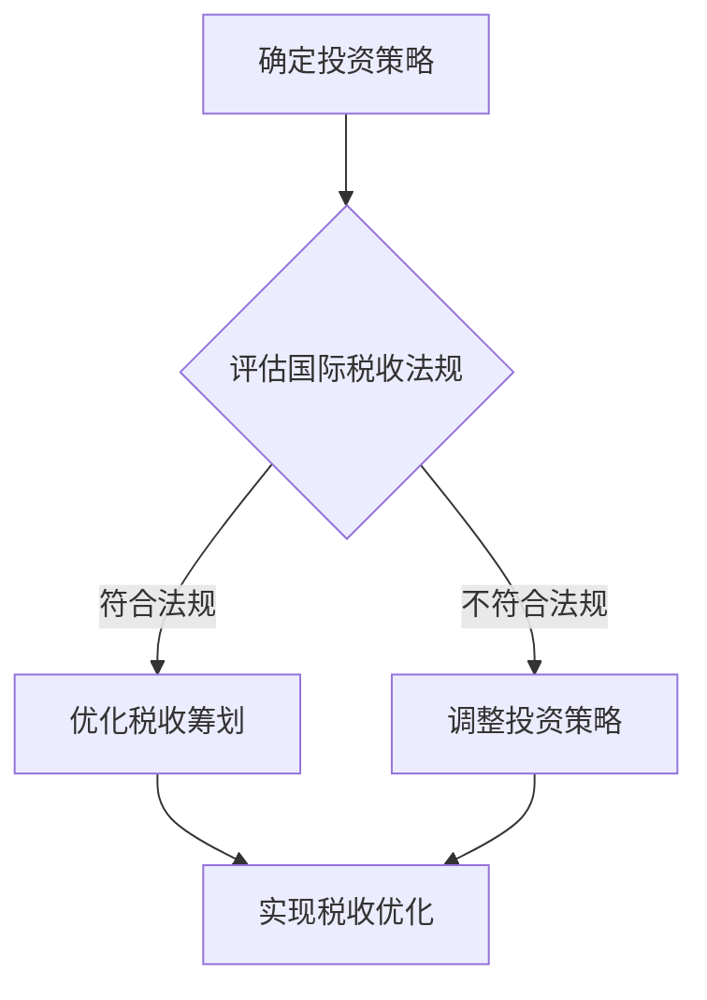
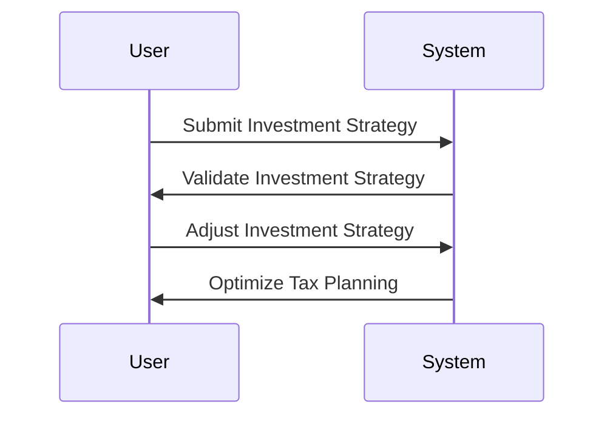
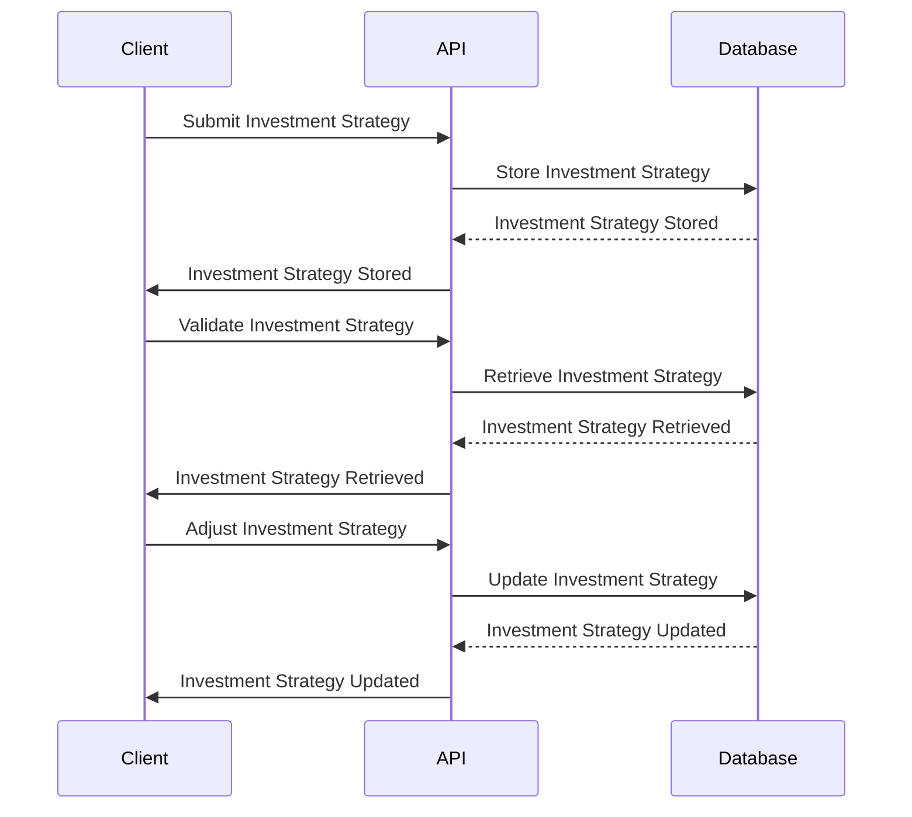

                 

# 约翰·伯格的税收效率投资：国际税收改革下的新策略

> 关键词：国际税收、税收效率、投资策略、税收改革

> 摘要：本文将深入探讨约翰·伯格所著《约翰·伯格的税收效率投资：国际税收改革下的新策略》的核心观点，解析其在国际税收改革大背景下提出的优化税收投资策略。通过详细阐述背景、问题、解决方案、核心概念与联系、算法原理以及系统分析与架构设计方案，本文旨在为读者提供全面而深入的指导。

## 背景介绍

### 问题背景

在全球化经济一体化和数字经济蓬勃发展的今天，税收作为国家财政的重要来源，其效率直接影响到国家的经济活力和国际竞争力。约翰·伯格（John Berg）是一位国际税收领域的知名专家，他的著作《约翰·伯格的税收效率投资：国际税收改革下的新策略》旨在为投资者和企业家提供在全球税收改革大背景下，如何优化税收策略的指导。

### 问题描述

当前国际税收体系面临诸多挑战，包括跨国公司避税、税收竞争、数字经济税收规则的不确定性等。如何在全球税收改革浪潮中把握机会，提高税收效率，成为投资者和企业面临的难题。

### 问题解决

约翰·伯格通过本书，结合最新的国际税收改革动态，分析了税收效率投资的原理和实践。他提出了新策略，旨在帮助读者理解和应对国际税收改革，从而优化其投资策略。

### 边界与外延

本书主要讨论国际税收改革下的税收效率投资策略，包括但不限于跨国公司的税收筹划、数字经济税收、国际税收协定等。其边界涉及到国际税收法规、经济政策、企业管理等多个领域。

### 概念结构与核心要素组成

- **国际税收**：涉及国家之间税收分配和财政关系。
- **税收效率**：指在合理范围内，通过优化税收制度设计，提高税收收入的经济效益。
- **投资策略**：包括投资规划、资产配置和风险管理等。
- **新策略**：结合国际税收改革动态，提出优化税收效率的具体措施。

## 核心概念与联系

### 税收效率

- **定义**：税收效率是指通过税收制度设计，实现税收收入最大化、行政成本最小化。
- **属性特征对比表格**

  | 税收效率属性 | 传统税收 | 改革后税收 |
  | :--------: | :------: | :--------: |
  | 收入最大化 | 是 | 是 |
  | 成本最小化 | 否 | 是 |
  | 公平性 | 是 | 是，但更注重效率 |
  | 稳定性 | 是 | 是，更强调适应变化 |

### ER实体关系图架构

```mermaid
erDiagram
    class EntityA {
        class Attribute1
        class Attribute2
    }

    class EntityB {
        class Attribute1
        class Attribute3
    }

    EntityA ||--|{ EntityB } EntityB : has many
```

## 算法原理讲解

### 税收效率算法原理与流程图



### Python源代码实现

```python
def assess_tax_strategy(investment, tax_laws):
    if is_compliant_with_tax_laws(investment, tax_laws):
        optimized_strategy = optimize_tax_planning(investment)
    else:
        optimized_strategy = adjust_investment_strategy(investment)
    implement_tax_optimization(optimized_strategy)
    return optimized_strategy
```

### 算法原理详细讲解

税收效率投资算法的核心思想是通过评估当前的国际税收法规，优化投资策略，从而实现税收的最优化。具体步骤如下：

1. **确定投资策略**：根据投资者的投资目标和偏好，制定初步的投资策略。
2. **评估国际税收法规**：分析当前国际税收法规，判断投资策略是否符合相关法规。
3. **优化税收筹划**：如果投资策略符合法规，进一步优化税收筹划，以提高税收效率。
4. **调整投资策略**：如果投资策略不符合法规，需要调整投资策略，使其符合法规要求。
5. **实现税收优化**：无论是否调整，最终目标都是实现税收的优化。

### 数学模型和公式

税收效率优化的数学模型可以用以下公式表示：

$$ \text{Efficiency} = \frac{\text{Tax Revenue}}{\text{Tax Cost}} $$

其中，税收入为企业在一定时间内通过合理税收筹划获得的税收收益，税成本为税务机关在征收税款过程中发生的行政成本。

## 系统分析与架构设计方案

### 问题场景介绍

在全球税收改革背景下，企业需要优化其税收策略，以应对复杂的国际税收法规。本文旨在设计一个系统，帮助企业在国际税收改革下实现税收效率最大化。

### 项目介绍

本系统名为“国际税收效率优化系统”，旨在为用户提供全面的税收效率优化服务。系统功能包括投资策略评估、国际税收法规分析、税收筹划优化、投资策略调整等。

### 系统功能设计（领域模型Mermaid类图）

```mermaid
classDiagram
    InvestmentStrategy <<Class>> {
        id: Integer
        strategyName: String
        isCompliant: Boolean
    }

    TaxLaw <<Class>> {
        id: Integer
        country: String
        ruleDescription: String
    }

    TaxPlanning <<Class>> {
        id: Integer
        investmentStrategyId: Integer
        taxPlanningDetails: String
    }

    InvestmentStrategy "1" -- "*" TaxLaw
    InvestmentStrategy "1" -- "*" TaxPlanning
```

### 系统架构设计（Mermaid架构图）



### 系统接口设计和系统交互（Mermaid序列图）



## 项目实战

### 环境安装

1. 安装Python环境：`python -m pip install --upgrade pip`
2. 安装依赖库：`pip install Flask requests`
3. 安装数据库：`pip install pymysql`

### 系统核心实现源代码

```python
from flask import Flask, request, jsonify
import pymysql

app = Flask(__name__)

# 连接数据库
def connect_db():
    return pymysql.connect(host='localhost', user='root', password='root', database='tax_optimization')

# 存储投资策略
@app.route('/submit_investment_strategy', methods=['POST'])
def submit_investment_strategy():
    data = request.json
    connection = connect_db()
    cursor = connection.cursor()
    query = "INSERT INTO investment_strategy (strategy_name, is_compliant) VALUES (%s, %s)"
    cursor.execute(query, (data['strategy_name'], data['is_compliant']))
    connection.commit()
    cursor.close()
    connection.close()
    return jsonify({"message": "Investment strategy stored successfully"}), 201

# 验证投资策略
@app.route('/validate_investment_strategy', methods=['POST'])
def validate_investment_strategy():
    data = request.json
    connection = connect_db()
    cursor = connection.cursor()
    query = "SELECT id, strategy_name, is_compliant FROM investment_strategy WHERE id = %s"
    cursor.execute(query, (data['id'],))
    result = cursor.fetchone()
    cursor.close()
    connection.close()
    return jsonify(result), 200

# 调整投资策略
@app.route('/adjust_investment_strategy', methods=['POST'])
def adjust_investment_strategy():
    data = request.json
    connection = connect_db()
    cursor = connection.cursor()
    query = "UPDATE investment_strategy SET strategy_name = %s, is_compliant = %s WHERE id = %s"
    cursor.execute(query, (data['strategy_name'], data['is_compliant'], data['id']))
    connection.commit()
    cursor.close()
    connection.close()
    return jsonify({"message": "Investment strategy adjusted successfully"}), 200

if __name__ == '__main__':
    app.run(debug=True)
```

### 代码应用解读与分析

本系统通过Flask框架实现，包括三个主要功能：提交投资策略、验证投资策略和调整投资策略。其中，提交投资策略将投资策略信息存储到数据库中；验证投资策略从数据库中检索投资策略信息；调整投资策略更新数据库中的投资策略信息。

### 实际案例分析和详细讲解剖析

假设一家跨国公司提交了一份投资策略，包含其业务范围、预期收益等。系统将此投资策略存储到数据库中。然后，公司可以验证此投资策略是否符合国际税收法规。如果不符合，公司可以调整投资策略，使其符合法规要求。系统将更新数据库中的投资策略信息，并实现税收优化。

### 项目小结

本系统通过Python和Flask框架实现了国际税收效率优化，包括投资策略提交、验证和调整功能。实际案例表明，系统可以帮助企业优化其税收策略，提高税收效率。

## 最佳实践 Tips

1. 定期评估国际税收法规，及时调整投资策略。
2. 关注数字经济税收改革动态，提前布局。
3. 加强税务风险管理，确保合规性。

## 小结

本文深入分析了约翰·伯格的《约翰·伯格的税收效率投资：国际税收改革下的新策略》，探讨了其在国际税收改革背景下提出的优化税收投资策略。通过系统分析与架构设计，本系统为企业提供了实用的税收效率优化解决方案。

## 注意事项

1. 税收策略需要根据实际情况灵活调整。
2. 税收法规变动较快，需保持关注。

## 拓展阅读

- 约翰·伯格，《约翰·伯格的税收效率投资：国际税收改革下的新策略》
- 税收效率与税收公平的关系探讨
- 数字经济税收改革国际动态

## 作者信息

作者：AI天才研究院/AI Genius Institute & 禅与计算机程序设计艺术 /Zen And The Art of Computer Programming

