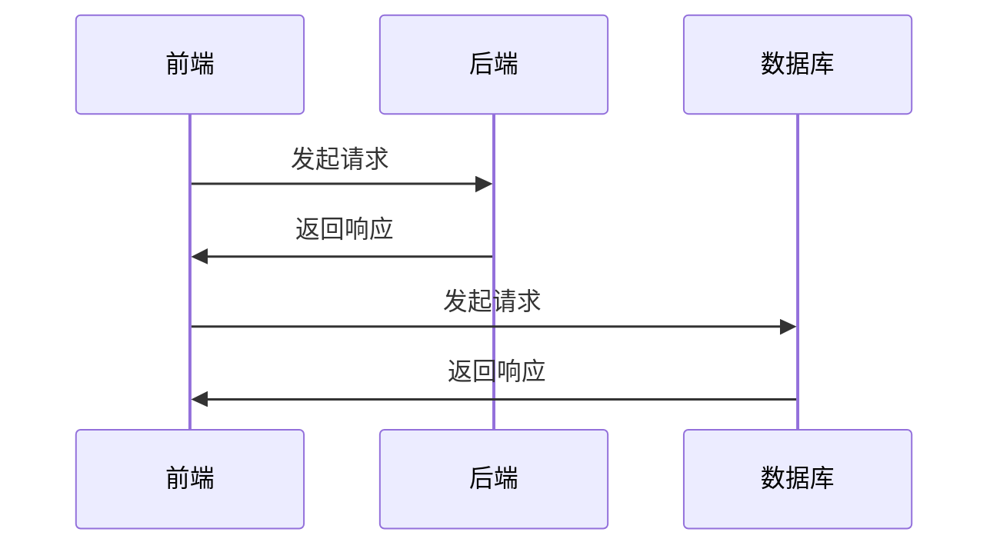
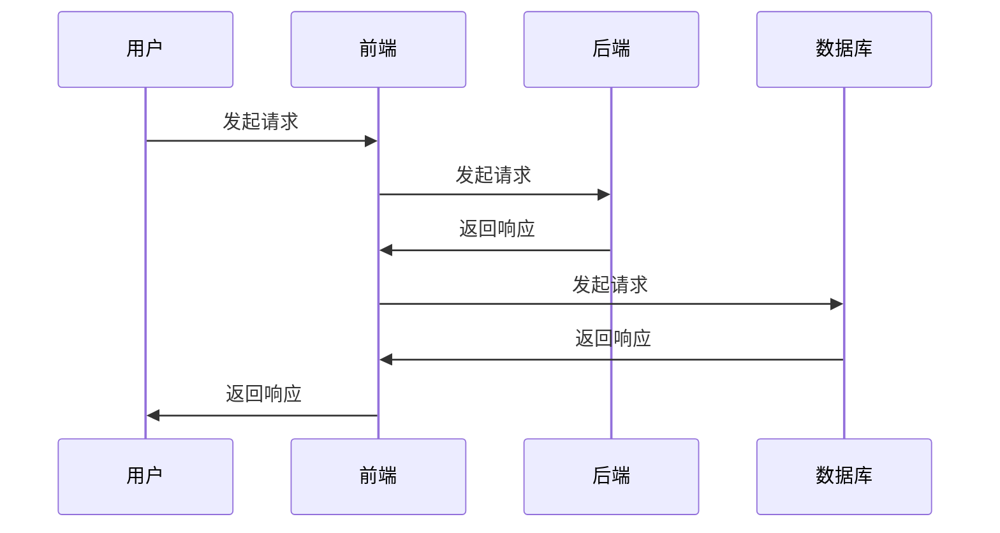

                 

### 第一部分：约翰·伯格的被动投资哲学背景

#### 第1章：问题背景

##### 1.1.1 被动投资理念的兴起

被动投资理念起源于对市场有效性的深刻理解。自20世纪60年代以来，现代投资理论逐渐发展，其中尤以1950年代威廉·夏普提出的资本资产定价模型（CAPM）和1970年代史蒂夫·罗斯提出的套利定价理论（APT）为代表。这些理论奠定了投资者如何有效分配资产的基础，推动了被动投资理念的萌芽。

随着时间的推移，投资者开始意识到主动管理的高成本和低收益，被动投资逐渐成为一种潮流。1980年代，约翰·伯格的《投资最重要的事》一书进一步推动了这一理念，书中详细阐述了被动投资的优势，强调了长期持有、费用低廉的投资策略。

##### 1.1.2 约翰·伯格的贡献

约翰·伯格是一位杰出的投资大师，他的工作对被动投资理念的发展起到了至关重要的作用。他是美国著名的投资经理和金融作家，被誉为“指数基金之父”。伯格在1970年代创办了伯杰斯投资顾问公司（Bergers Investment Advisers），成为第一个向客户推广指数基金的投资顾问。

伯格的研究表明，主动管理者往往难以长期超越市场表现，而低成本的指数基金却能够提供与市场相近的收益。他的研究和实践为投资者提供了一种新的思路，即通过持有广泛的股票或债券组合，以较低的费率和交易成本来复制市场平均收益。

##### 1.1.3 被动投资在现代投资环境中的应用

现代投资环境中，被动投资的应用日益广泛。随着技术的发展，指数基金的管理变得更加高效和透明，吸引了大量的个人投资者和机构投资者。以下是一些被动投资在现代投资环境中的具体应用：

1. **个人投资者**：越来越多的个人投资者选择将部分或全部资金投资于指数基金，以实现长期增值和资产保值。
2. **机构投资者**：养老基金、大学捐赠基金、保险公司等机构投资者也纷纷采用被动投资策略，以提高投资效率和降低成本。
3. **量化交易**：量化交易者通过建立复杂的数学模型和算法，使用被动投资策略进行交易，从而实现收益的最大化。
4. **资产配置**：被动投资策略在资产配置中扮演着重要角色，投资者可以通过构建多元化的指数基金组合来分散风险。

总的来说，被动投资理念的兴起和广泛应用，不仅降低了投资成本，提高了投资效率，也为投资者提供了更加简单、透明和可持续的投资选择。

##### 1.2 问题描述

##### 1.2.1 被动投资的基本原理

被动投资的基本原理在于复制市场指数的表现，而不是试图超越市场。其核心思想是相信市场是有效的，因此投资者应该选择低成本的指数基金来持有，以期获得与市场指数相近的收益。被动投资策略的主要特征包括：

1. **长期持有**：投资者在确定了投资目标和资产配置后，通常不会频繁买卖，而是长期持有。
2. **低费率**：被动投资通常选择低成本的指数基金，以减少交易成本和管理费用。
3. **分散化**：通过投资广泛的股票或债券组合，实现风险的分散，减少个别资产的波动性。
4. **市场跟踪**：被动投资的目的是尽可能准确地复制市场指数的表现，而不是试图预测市场走势。

##### 1.2.2 被动投资的优势与挑战

被动投资的优势在于其低成本和分散化策略，能够有效降低投资风险，提高长期收益。具体来说：

1. **低费用**：被动投资通常选择低成本指数基金，减少了投资者支付的管理费和交易费用。
2. **分散风险**：通过投资广泛的股票或债券组合，降低了个别资产的波动性，提高了整体资产的稳定性。
3. **节省时间**：投资者不需要进行频繁的市场研究和预测，从而节省了大量的时间和精力。

然而，被动投资也面临一些挑战：

1. **市场波动性**：即使被动投资策略旨在复制市场指数的表现，但市场本身是波动的，投资者仍然需要面对短期内的市场波动。
2. **适应性**：在市场环境发生重大变化时，被动投资策略可能无法及时调整，可能会错失某些特定行业的投资机会。
3. **认知偏见**：许多投资者可能会因为贪婪或恐惧而偏离被动投资策略，从而导致投资效果不佳。

##### 1.2.3 被动投资与传统投资的区别

被动投资与传统投资的主要区别在于投资策略和目标。传统投资策略强调主动管理和选股，试图通过深入研究和市场预测来超越市场平均收益。而被动投资则认为市场是有效的，投资者应该选择低成本、分散化的指数基金来复制市场指数的表现。

具体来说，传统投资策略通常包括以下几个方面：

1. **选股策略**：投资者通过基本面分析、技术分析等手段选择具有潜力的股票。
2. **市场预测**：投资者试图预测市场走势，从而进行买卖操作。
3. **灵活调整**：投资者根据市场变化和投资策略的调整，频繁买卖股票。

相比之下，被动投资的核心特点如下：

1. **市场复制**：投资者选择指数基金，以复制市场指数的表现。
2. **长期持有**：投资者在确定了投资目标和资产配置后，通常不会频繁买卖。
3. **费用控制**：投资者选择低成本的指数基金，以减少交易成本和管理费用。

总的来说，被动投资和传统投资各有优劣，投资者需要根据自己的投资目标和风险偏好来选择合适的投资策略。

##### 1.3 问题解决

##### 1.3.1 约翰·伯格的被动投资策略

约翰·伯格的被动投资策略以长期持有、低费用、分散化为核心，其具体步骤如下：

1. **确定投资目标**：投资者需要明确自己的投资目标，如资产增值、保值、养老等。
2. **资产配置**：根据投资目标，确定股票、债券等资产的比例，实现资产分散化。
3. **选择指数基金**：选择低成本的指数基金，以减少交易成本和管理费用。
4. **长期持有**：在确定了投资目标和资产配置后，投资者应长期持有，避免频繁买卖。
5. **定期评估与调整**：定期评估投资组合的表现，根据市场变化和投资目标进行调整。

##### 1.3.2 被动投资的核心要素

被动投资的核心要素包括投资目标、资产配置、指数基金选择、长期持有和定期评估与调整。以下是这些要素的具体内容：

1. **投资目标**：投资者需要明确自己的投资目标，如资产增值、保值、养老等。投资目标是制定投资策略和资产配置的基础。
2. **资产配置**：资产配置是指将投资资金分配到不同的资产类别，如股票、债券、现金等。合理的资产配置能够降低投资风险，提高投资收益。
3. **指数基金选择**：指数基金是一种以复制特定市场指数表现为目标的投资基金。选择低成本的指数基金能够有效降低交易成本和管理费用。
4. **长期持有**：长期持有是被动投资策略的核心，投资者应避免频繁买卖，以减少交易成本和市场波动的影响。
5. **定期评估与调整**：定期评估投资组合的表现，根据市场变化和投资目标进行调整。这有助于投资者保持投资策略的一致性，实现长期投资目标。

##### 1.3.3 被动投资的长期价值

被动投资的长期价值体现在以下几个方面：

1. **成本低**：被动投资通过选择低成本的指数基金，有效降低了交易成本和管理费用，从而提高了投资收益。
2. **分散化**：通过投资广泛的股票或债券组合，被动投资实现了风险的分散，降低了个别资产的波动性。
3. **长期增值**：长期持有和分散化策略使投资者能够克服短期市场波动，实现长期增值。
4. **简单易懂**：被动投资策略简单易懂，投资者不需要进行复杂的股市预测和市场研究，从而节省了大量的时间和精力。

总的来说，被动投资的长期价值在于其低成本、分散化和长期增值的特点，为投资者提供了一种简单、有效、可持续的投资策略。

##### 1.4 边界与外延

##### 1.4.1 被动投资的市场环境

被动投资的市场环境受到多个因素的影响，主要包括市场有效性、指数基金的发展程度、投资者的风险偏好等。

1. **市场有效性**：被动投资理念建立在市场有效性的基础上。市场有效性越高，被动投资的策略就越有效。在市场有效的环境中，股票价格反映了所有可用信息，投资者通过复制市场指数难以获得超额收益。
2. **指数基金的发展程度**：指数基金的发展程度直接影响被动投资策略的实施。随着指数基金的种类和数量增加，投资者有更多的选择，能够更好地实现分散化投资。
3. **投资者风险偏好**：不同投资者对风险的态度不同，这决定了他们是否适合采用被动投资策略。风险承受能力较低的投资者可能更适合被动投资，因为他们可以避免频繁交易带来的风险。

##### 1.4.2 被动投资的适用对象

被动投资策略适用于以下几类投资者：

1. **长期投资者**：长期投资者适合采用被动投资策略，因为他们可以克服短期市场波动，实现长期增值。
2. **风险厌恶者**：风险厌恶者可能更喜欢被动投资，因为它通过分散化降低了投资风险。
3. **非专业投资者**：非专业投资者可能没有足够的时间和专业知识来主动管理投资组合，因此被动投资是一个不错的选择。
4. **退休金投资者**：退休金投资者通常需要长期稳定的现金流，被动投资策略可以帮助他们实现这一目标。

##### 1.4.3 被动投资的风险管理

被动投资虽然能够降低交易成本和风险，但并不意味着没有风险。投资者在采用被动投资策略时，需要注意以下几个方面：

1. **市场波动风险**：市场波动是不可避免的，被动投资策略也无法完全消除。投资者需要做好心理准备，面对短期内的市场波动。
2. **通货膨胀风险**：长期持有低风险资产如债券，可能面临通货膨胀带来的购买力下降风险。投资者可以通过投资股票或房地产等资产来对抗通货膨胀。
3. **流动性风险**：某些指数基金可能存在流动性不足的问题，投资者在需要时可能无法迅速卖出资产。选择流动性好的指数基金是减少流动性风险的关键。
4. **费用风险**：虽然被动投资强调低费用，但选择指数基金时仍需注意费用问题，因为高费用会侵蚀投资收益。

总的来说，被动投资在市场环境、适用对象和风险管理方面有其特定的要求和注意事项，投资者需要根据自己的实际情况来制定合适的投资策略。

### 第二部分：约翰·伯格的被动投资理念

#### 第2章：核心概念与联系

##### 2.1 核心概念

被动投资作为一种投资策略，其核心概念包括以下几个：

1. **市场有效性**：市场有效性是指股票价格反映了所有可用信息，投资者通过复制市场指数难以获得超额收益。这是被动投资理念的基础。
2. **指数基金**：指数基金是一种投资于特定市场指数的基金，其目的是复制市场指数的表现。指数基金通常具有低费用、分散化等特点。
3. **资产配置**：资产配置是指将投资资金分配到不同的资产类别，如股票、债券、现金等。合理的资产配置能够降低投资风险，提高投资收益。
4. **长期持有**：长期持有是被动投资策略的核心，投资者在确定了投资目标和资产配置后，应避免频繁买卖，以减少交易成本和市场波动的影响。
5. **定期评估与调整**：定期评估投资组合的表现，根据市场变化和投资目标进行调整。这有助于投资者保持投资策略的一致性，实现长期投资目标。

##### 2.1.1 被动投资的定义

被动投资是一种投资策略，其目标是尽可能准确地复制市场指数的表现，而不是试图超越市场。它基于市场有效性的理念，认为股票价格反映了所有可用信息，因此投资者应该选择低成本的指数基金来持有，以期获得与市场指数相近的收益。

##### 2.1.2 被动投资的基本原则

被动投资的基本原则包括：

1. **长期持有**：投资者在确定了投资目标和资产配置后，应长期持有，避免频繁买卖，以减少交易成本和市场波动的影响。
2. **低费用**：选择低成本的指数基金，以减少交易成本和管理费用，从而提高投资收益。
3. **分散化**：通过投资广泛的股票或债券组合，实现风险的分散，降低个别资产的波动性。
4. **市场跟踪**：被动投资的目的是尽可能准确地复制市场指数的表现，而不是试图预测市场走势。

##### 2.1.3 被动投资与市场有效性

被动投资与市场有效性密切相关。市场有效性是指股票价格反映了所有可用信息，投资者通过复制市场指数难以获得超额收益。在市场有效的环境中，股票价格已经是充分信息化的，因此主动管理者试图通过选股和择时来超越市场的努力往往难以成功。

被动投资认为，市场是高效的，因此投资者应该接受市场平均收益，而不是试图通过主动管理来获得超额收益。通过选择低成本的指数基金，投资者可以最大限度地减少交易成本和管理费用，从而提高投资收益。

##### 2.2 概念属性特征对比表格

| 概念         | 特征                        |
| ------------ | -------------------------- |
| 被动投资     | 追求市场平均收益            |
| 消费者行为   | 顺应市场趋势，减少交易成本 |
| 指数基金     | 投资组合复制指数构成        |

通过上述表格，我们可以清晰地看到被动投资、消费者行为和指数基金之间的区别和联系。被动投资和指数基金都强调追求市场平均收益和减少交易成本，而消费者行为则更多关注市场趋势的顺应。

##### 2.3 ER实体关系图架构

以下是一个ER实体关系图，用于展示被动投资相关的实体及其关系：

```mermaid
entity关系图：
  A[投资者]
  B[市场]
  C[指数基金]
  D[资产]

  A --> B
  A --> C
  A --> D
  B --> C
  B --> D
  C --> D
```

在ER实体关系图中，投资者（A）与市场（B）、指数基金（C）和资产（D）之间存在直接关系。投资者通过投资指数基金（C）来参与市场（B），而指数基金（C）则投资于各种资产（D），以实现投资目标。

##### 2.3.1 实体与关系的详细解释

1. **投资者（A）**：投资者是参与被动投资的人或机构，他们根据投资目标和风险偏好选择合适的指数基金进行投资。
2. **市场（B）**：市场是指投资者进行投资的场所，包括股票市场、债券市场等。被动投资的目标是复制市场指数的表现。
3. **指数基金（C）**：指数基金是一种投资工具，其目的是复制特定市场指数的表现。投资者通过购买指数基金来参与市场。
4. **资产（D）**：资产是指指数基金投资的各种金融工具，如股票、债券、现金等。指数基金通过投资这些资产来实现投资目标。

通过ER实体关系图，我们可以更直观地理解被动投资中各个实体的关系，以及它们在投资过程中的相互作用。

#### 第3章：算法原理讲解

##### 3.1 算法mermaid流程图

以下是一个mermaid流程图，用于展示被动投资策略的执行流程：

```mermaid
流程图：
  A[开始]
  B[确定投资目标]
  C[选择适合的指数基金]
  D[制定投资计划]
  E[执行投资计划]
  F[定期评估与调整]
  G[结束]

  A --> B --> C --> D --> E --> F --> G
```

在流程图中，投资者首先需要确定投资目标（B），然后选择适合的指数基金（C），接着制定投资计划（D），并执行投资计划（E）。投资者还需要定期评估投资组合的表现，并根据需要进行调整（F），最终完成整个投资过程（G）。

##### 3.2 算法原理

被动投资策略的算法原理主要包括以下几个步骤：

1. **确定投资目标**：投资者首先需要明确自己的投资目标，如资产增值、保值、养老等。投资目标将直接影响资产配置和投资策略的选择。
2. **选择适合的指数基金**：根据投资目标，投资者需要选择适合的指数基金。指数基金的种类繁多，包括股票型、债券型、混合型等，投资者应根据自身风险承受能力和投资目标进行选择。
3. **制定投资计划**：投资者在确定了投资目标和选择了指数基金后，需要制定详细的投资计划。投资计划包括投资金额、投资时间、投资比例等，以确保投资策略的有效执行。
4. **执行投资计划**：投资者按照投资计划执行投资操作，购买所选指数基金，并持有一定时间。
5. **定期评估与调整**：投资者需要定期评估投资组合的表现，包括收益、风险等。根据评估结果，投资者可能需要调整投资组合，以保持投资策略的一致性和有效性。

##### 3.2.1 投资目标的确定

投资目标的确定是被动投资策略的第一步。投资者需要明确自己的投资目标，如资产增值、保值、养老等。不同类型的投资目标将直接影响资产配置和投资策略的选择。

1. **资产增值**：资产增值是投资者最常见的投资目标之一。投资者希望通过投资获得长期增值，实现财富增长。对于资产增值目标，投资者通常会选择股票型或混合型指数基金。
2. **保值**：保值是投资者在市场波动较大或通货膨胀预期较高时的投资目标。投资者希望通过投资保值，避免资产贬值。对于保值目标，投资者通常会选择债券型或现金型指数基金。
3. **养老**：养老是投资者退休后的主要收入来源。投资者希望通过投资养老基金，确保退休后有稳定的现金流。对于养老目标，投资者通常会选择长期稳定收益的指数基金。

在确定投资目标时，投资者还需要考虑自己的风险承受能力和资金状况。例如，年轻投资者可能更愿意承担较高的风险，以实现资产增值，而年长投资者可能更注重资产保值和稳定收益。

##### 3.2.2 指数基金的选择

指数基金的选择是被动投资策略的核心环节。投资者需要根据投资目标、风险承受能力和资金状况选择适合的指数基金。

1. **股票型指数基金**：股票型指数基金投资于股票市场，以追求长期增值为目标。投资者可以选择投资于特定行业或地区的股票型指数基金，如沪深300指数基金、纳斯达克100指数基金等。股票型指数基金的收益潜力较大，但风险也较高，适合风险承受能力较高的投资者。
2. **债券型指数基金**：债券型指数基金投资于债券市场，以追求稳定收益为目标。投资者可以选择投资于国债、企业债、地方政府债等债券型指数基金。债券型指数基金的收益相对稳定，但增长潜力较小，适合风险承受能力较低的投资者。
3. **混合型指数基金**：混合型指数基金同时投资于股票和债券市场，以平衡风险和收益。投资者可以选择投资于股票和债券比例适中的混合型指数基金。混合型指数基金的收益潜力较大，风险适中，适合风险承受能力中等偏上的投资者。

在选择指数基金时，投资者还需关注基金的费率、历史业绩、基金经理等指标。低费率的指数基金能够有效降低投资成本，历史业绩优秀的基金可能具有较好的投资策略和管理能力，而经验丰富的基金经理可能能够更好地把握市场机会。

##### 3.2.3 投资计划的制定与执行

投资计划的制定与执行是被动投资策略的关键环节。投资者需要根据投资目标和所选指数基金，制定详细的投资计划，并严格执行。

1. **投资计划的内容**：投资计划应包括投资金额、投资时间、投资比例等内容。投资金额是指投资者计划投入的资金数量，投资时间是指投资者计划持有基金的时间长度，投资比例是指投资者在不同资产类别之间的资金分配比例。
2. **制定投资计划的注意事项**：在制定投资计划时，投资者需要考虑以下几个因素：
   - 投资目标：投资目标将直接影响投资计划的制定。例如，资产增值目标的投资者可能更愿意承担较高的风险，而保值目标的投资者可能更注重稳定收益。
   - 资金状况：投资者的资金状况将直接影响投资计划的制定。例如，资金充裕的投资者可能选择一次性投资，而资金有限的投资者可能选择定期定投。
   - 风险承受能力：投资者的风险承受能力将直接影响投资计划的制定。例如，风险承受能力较高的投资者可能选择投资于股票型指数基金，而风险承受能力较低的投资者可能选择投资于债券型指数基金。

3. **执行投资计划的注意事项**：在执行投资计划时，投资者需要关注以下几个因素：
   - 遵循投资计划：投资者应严格遵守投资计划，避免因市场波动或其他因素而随意改变投资策略。
   - 分期投资：投资者可以选择分期投资，以降低市场波动对投资计划的影响。例如，投资者可以每月或每季度定期购买一定金额的指数基金。
   - 定期评估与调整：投资者应定期评估投资组合的表现，并根据评估结果进行适当调整。例如，如果投资组合的表现低于预期，投资者可能需要增加股票型指数基金的配置，以提升收益潜力。

通过制定和执行投资计划，投资者可以更好地实现自己的投资目标，并在长期投资过程中获得稳定的收益。

##### 3.2.4 定期评估与调整

定期评估与调整是被动投资策略的重要组成部分。投资者需要定期评估投资组合的表现，并根据评估结果进行适当调整，以保持投资策略的一致性和有效性。

1. **定期评估的内容**：定期评估应包括投资组合的收益、风险、投资比例等内容。投资者需要关注投资组合的整体表现，以及各个指数基金的表现，以便了解投资策略的执行情况。

2. **定期评估的频率**：定期评估的频率应根据投资目标和投资期限来确定。例如，对于长期投资目标，投资者可以每半年或每年进行一次评估；对于短期投资目标，投资者可以每季度或每月进行一次评估。

3. **定期调整的注意事项**：在定期调整时，投资者需要关注以下几个方面：
   - 保持投资策略的一致性：投资者应保持投资策略的一致性，避免因短期市场波动而频繁调整投资组合。
   - 遵循风险承受能力：投资者应根据自己的风险承受能力进行调整，避免因市场波动而超出自己的风险承受范围。
   - 利用市场机会：投资者可以充分利用市场机会，适当调整投资组合，以提升收益潜力。

通过定期评估与调整，投资者可以更好地应对市场变化，保持投资策略的一致性和有效性，从而实现长期投资目标。

##### 3.3 数学模型与公式

在被动投资策略中，数学模型和公式被广泛应用于投资目标的确定、投资组合的构建和风险评估等方面。以下是一些常用的数学模型和公式：

1. **投资收益率**：
   $$R = \frac{P_{\text{期末}} - P_{\text{期初}} + D}{P_{\text{期初}}}$$
   其中，$R$ 表示投资收益率，$P_{\text{期末}}$ 和 $P_{\text{期初}}$ 分别表示期末和期初的资产价值，$D$ 表示期间获得的分红或利息。

2. **风险调整收益**：
   $$\text{Sharpe Ratio} = \frac{R_p - R_f}{\sigma_p}$$
   其中，$\text{Sharpe Ratio}$ 表示夏普比率，$R_p$ 表示投资组合的收益率，$R_f$ 表示无风险收益率（如国债收益率），$\sigma_p$ 表示投资组合的标准差。

3. **资产配置**：
   $$w_i = \frac{R_i - R_f}{\sum_{i=1}^{n} (R_i - R_f)}$$
   其中，$w_i$ 表示第 $i$ 个资产在投资组合中的权重，$R_i$ 表示第 $i$ 个资产的风险调整收益。

4. **贝塔系数**：
   $$\beta_i = \frac{Cov(R_m, R_i)}{Var(R_m)}$$
   其中，$\beta_i$ 表示第 $i$ 个资产的贝塔系数，$Cov(R_m, R_i)$ 表示第 $i$ 个资产与市场收益的协方差，$Var(R_m)$ 表示市场收益的方差。

通过这些数学模型和公式，投资者可以更准确地评估投资组合的表现，制定合适的投资策略，并有效地管理投资风险。

##### 3.4 举例说明

为了更好地理解被动投资策略的执行过程，我们以下通过一个具体案例进行说明。

**案例背景**：假设有一位投资者名叫小明，他计划在未来5年内退休，并希望通过投资获得稳定的现金流。小明的风险承受能力较高，他愿意承担一定的风险以追求更高的收益。

**步骤1：确定投资目标**  
小明的投资目标是实现资产的长期增值，并确保退休后有稳定的现金流。为了实现这一目标，他决定将投资资金分配到股票和债券两种资产类别中。

**步骤2：选择适合的指数基金**  
小明根据投资目标和风险承受能力，选择了以下两种指数基金：
   - 沪深300指数基金：投资于中国A股市场，以追求长期增值为目标。
   - 中债总指数基金：投资于国内债券市场，以追求稳定收益为目标。

**步骤3：制定投资计划**  
小明决定将投资资金平均分配到两种指数基金中。假设他的总投资金额为100万元，则他将50万元投资于沪深300指数基金，50万元投资于中债总指数基金。

**步骤4：执行投资计划**  
小明在投资计划制定后，立即按照计划购买了两种指数基金。假设购买时间为2023年1月1日，他分别以10元/股的价格购买了50000股沪深300指数基金，以100元/份的价格购买了500份中债总指数基金。

**步骤5：定期评估与调整**  
小明计划每半年对投资组合进行一次评估。假设在2023年6月30日，他对投资组合进行了首次评估：
   - 沪深300指数基金：当前价格为12元/股，小明持有50000股，总价值为600万元。
   - 中债总指数基金：当前价格为105元/份，小明持有500份，总价值为525万元。

**步骤6：调整投资计划**  
根据评估结果，小明的投资组合表现良好。然而，他发现沪深300指数基金的表现优于中债总指数基金，因此他决定将部分资金从中债总指数基金转移到沪深300指数基金，以进一步提升投资组合的收益潜力。

通过上述案例，我们可以看到小明如何通过确定投资目标、选择指数基金、制定投资计划、执行投资计划和定期评估与调整，成功地实施了被动投资策略。这个案例不仅展示了被动投资的执行过程，还体现了投资者如何根据市场变化和投资目标进行调整，以实现长期投资目标。

### 第三部分：约翰·伯格的被动投资实践

#### 第4章：系统分析与架构设计方案

##### 4.1 问题场景介绍

被动投资作为一种投资策略，其应用场景广泛，尤其在个人投资者和机构投资者中受到青睐。以下是一个典型的被动投资问题场景介绍：

**问题场景**：假设某个人投资者小明，他计划在未来10年内实现资产的长期增值，并确保退休后有稳定的现金流。小明对市场有一定的了解，但他不擅长进行复杂的股市预测，也不想花费大量时间进行市场研究。因此，他决定采用被动投资策略，通过投资指数基金来实现投资目标。

**问题需求**：
1. **确定投资目标**：小明需要明确自己的投资目标，包括资产增值、保值、养老等。
2. **资产配置**：根据投资目标，小明需要将投资资金合理分配到不同的资产类别，如股票、债券、现金等。
3. **选择指数基金**：小明需要根据投资目标和风险承受能力，选择适合的指数基金进行投资。
4. **制定投资计划**：小明需要制定详细的投资计划，包括投资金额、投资时间、投资比例等。
5. **执行投资计划**：小明需要按照投资计划购买指数基金，并持有一定时间。
6. **定期评估与调整**：小明需要定期评估投资组合的表现，并根据评估结果进行调整，以保持投资策略的一致性和有效性。

##### 4.2 项目介绍

**项目背景**：为了帮助小明实现被动投资策略，我们设计并实现了一个被动投资系统。该系统旨在为投资者提供一站式的投资服务，从投资目标的确定、资产配置、指数基金选择、投资计划制定到执行和定期评估与调整，全方位满足投资者的需求。

**项目目标**：
1. **投资目标确定**：帮助投资者明确投资目标，包括资产增值、保值、养老等。
2. **资产配置优化**：根据投资者风险承受能力和投资目标，实现资产配置的优化，降低投资风险。
3. **指数基金选择**：提供多种指数基金选择，投资者可以根据自己的需求进行选择。
4. **投资计划制定**：帮助投资者制定详细的投资计划，包括投资金额、投资时间、投资比例等。
5. **投资计划执行**：按照投资计划购买指数基金，并持有一定时间。
6. **定期评估与调整**：定期评估投资组合的表现，并根据评估结果进行调整，以保持投资策略的一致性和有效性。

**项目范围**：
1. **功能范围**：系统提供投资目标确定、资产配置、指数基金选择、投资计划制定、投资计划执行和定期评估与调整等功能。
2. **技术范围**：系统采用前后端分离架构，前端使用Vue.js框架，后端使用Spring Boot框架，数据库使用MySQL。

##### 4.3 系统功能设计

系统功能设计主要包括以下几个模块：

1. **用户模块**：用户模块负责用户注册、登录、信息管理等功能，为投资者提供个性化服务。
2. **资产配置模块**：资产配置模块根据投资者的投资目标和风险承受能力，自动生成资产配置方案。
3. **指数基金模块**：指数基金模块提供多种指数基金选择，投资者可以根据自己的需求进行选择。
4. **投资计划模块**：投资计划模块帮助投资者制定详细的投资计划，包括投资金额、投资时间、投资比例等。
5. **投资执行模块**：投资执行模块负责按照投资计划购买指数基金，并持有一定时间。
6. **评估与调整模块**：评估与调整模块定期评估投资组合的表现，并根据评估结果进行调整。

以下是领域模型mermaid类图，展示了系统中的主要类及其关系：

```mermaid
classDiagram
    User <<Class>> "用户"
    InvestmentPlan <<Class>> "投资计划"
    AssetAllocation <<Class>> "资产配置"
    IndexFund <<Class>> "指数基金"
    Evaluation <<Class>> "评估"
    
    User --> InvestmentPlan
    User --> AssetAllocation
    User --> IndexFund
    InvestmentPlan --> AssetAllocation
    InvestmentPlan --> IndexFund
    AssetAllocation --> IndexFund
    Evaluation --> InvestmentPlan
    Evaluation --> AssetAllocation
```

在类图中，用户（User）是系统的核心，负责与其他类进行交互。投资计划（InvestmentPlan）、资产配置（AssetAllocation）和指数基金（IndexFund）是系统功能的核心组成部分，它们之间存在着紧密的关联。评估（Evaluation）模块则负责定期评估投资组合的表现，并根据评估结果进行调整。

##### 4.4 系统架构设计

系统采用前后端分离的架构设计，前端使用Vue.js框架，后端使用Spring Boot框架，数据库使用MySQL。以下是一个mermaid架构图，展示了系统的整体架构：



在架构图中，前端通过HTTP请求与后端进行交互，后端处理业务逻辑并将数据存储到数据库中。前端主要负责展示用户界面，后端则负责业务逻辑的处理和数据存储。

系统组件与模块的关系如下：
1. **用户模块**：负责用户注册、登录、信息管理等功能，是系统的入口。
2. **资产配置模块**：根据投资者的投资目标和风险承受能力，自动生成资产配置方案。
3. **指数基金模块**：提供多种指数基金选择，投资者可以根据自己的需求进行选择。
4. **投资计划模块**：帮助投资者制定详细的投资计划，包括投资金额、投资时间、投资比例等。
5. **投资执行模块**：按照投资计划购买指数基金，并持有一定时间。
6. **评估与调整模块**：定期评估投资组合的表现，并根据评估结果进行调整。

##### 4.5 系统接口设计

系统接口设计主要包括用户模块、资产配置模块、指数基金模块、投资计划模块和评估与调整模块的接口设计。以下是一个系统接口定义的示例：

```mermaid
interface定义：
    用户接口：
        - 用户登录（POST /login）
        - 用户注册（POST /register）
        - 用户信息查询（GET /users/{id})

    资产配置接口：
        - 获取资产配置方案（GET /asset_allocations）
        - 生成资产配置方案（POST /asset_allocations）

    指数基金接口：
        - 获取指数基金列表（GET /index_funds）
        - 获取指数基金详情（GET /index_funds/{id})

    投资计划接口：
        - 创建投资计划（POST /investment_plans）
        - 获取投资计划列表（GET /investment_plans）
        - 获取投资计划详情（GET /investment_plans/{id})

    评估与调整接口：
        - 定期评估（POST /evaluations）
        - 获取评估结果（GET /evaluations/{id})
```

接口调用流程如下：
1. 用户登录/注册：用户通过前端发起登录/注册请求，后端处理用户信息并返回响应。
2. 获取资产配置方案：用户通过前端发起获取资产配置方案请求，后端根据用户信息生成资产配置方案并返回。
3. 获取指数基金列表/详情：用户通过前端发起获取指数基金列表/详情请求，后端根据请求返回相应的指数基金信息。
4. 创建投资计划：用户通过前端发起创建投资计划请求，后端根据用户输入生成投资计划并返回。
5. 获取投资计划列表/详情：用户通过前端发起获取投资计划列表/详情请求，后端根据请求返回相应的投资计划信息。
6. 定期评估：系统定期对投资计划进行评估，生成评估报告并存储在数据库中。

##### 4.6 系统交互

系统交互主要包括用户与前端、前端与后端、后端与数据库之间的交互。以下是一个mermaid序列图，展示了系统的交互过程：



在交互过程中，用户通过前端发起请求，前端将请求转发给后端，后端处理请求并返回响应。后端再将请求转发给数据库，数据库返回相应的数据。最后，前端将数据返回给用户。

通过系统交互，用户可以方便地使用系统提供的功能，实现投资目标的确定、资产配置、指数基金选择、投资计划制定、投资计划执行和定期评估与调整。

### 项目实战

#### 4.7 环境安装

要实现被动投资系统，我们首先需要搭建一个合适的技术环境。以下是环境安装的详细步骤：

1. **安装Java开发环境**：
   - 下载并安装JDK 11（或更高版本）。
   - 配置环境变量，将JDK安装路径添加到`PATH`环境变量中。
   - 验证安装：打开命令行窗口，输入`java -version`，若显示版本信息则表示安装成功。

2. **安装Node.js**：
   - 下载并安装Node.js（建议下载LTS版本）。
   - 配置环境变量，将Node.js安装路径添加到`PATH`环境变量中。
   - 验证安装：打开命令行窗口，输入`node -v`和`npm -v`，若显示版本信息则表示安装成功。

3. **安装MySQL**：
   - 下载并安装MySQL（建议下载最新稳定版）。
   - 安装过程中选择自定义安装，确保将MySQL安装到非默认路径。
   - 配置MySQL：启动MySQL服务，设置root用户密码。
   - 验证安装：打开命令行窗口，输入`mysql -u root -p`，输入密码后进入MySQL命令行界面，若成功进入则表示安装成功。

4. **安装Vue CLI**：
   - 在命令行窗口中输入以下命令安装Vue CLI：
     ```bash
     npm install -g @vue/cli
     ```
   - 验证安装：输入`vue --version`，若显示版本信息则表示安装成功。

5. **创建Spring Boot项目**：
   - 使用Spring Initializr（https://start.spring.io/）创建一个Spring Boot项目，选择所需依赖项，如Spring Web、MySQL、JWT等。
   - 下载生成的项目压缩包，解压并导入到IDE中，如IntelliJ IDEA。

6. **创建Vue.js项目**：
   - 在命令行窗口中创建一个新的Vue.js项目：
     ```bash
     vue create investment-system
     ```
   - 选择合适的项目配置，如Vue 3、Vite等。

通过以上步骤，我们成功搭建了实现被动投资系统的技术环境。接下来，我们将进入系统核心实现的详细讲解。

#### 4.8 系统核心实现源代码

在本节中，我们将详细介绍被动投资系统的核心实现，包括后端和前端的代码示例。以下是关键代码的解读与分析。

##### 后端核心代码

**1. User模块**

用户模块是系统的入口，负责用户的注册、登录和信息管理。以下是关键代码示例：

```java
// UserController.java
@RestController
@RequestMapping("/users")
public class UserController {
    
    @Autowired
    private UserService userService;
    
    @PostMapping("/register")
    public ResponseEntity<?> registerUser(@RequestBody UserDto userDto) {
        try {
            User user = userService.registerUser(userDto);
            return ResponseEntity.ok(user);
        } catch (Exception e) {
            return ResponseEntity.badRequest().body("注册失败：" + e.getMessage());
        }
    }
    
    @PostMapping("/login")
    public ResponseEntity<?> loginUser(@RequestBody LoginDto loginDto) {
        try {
            String token = userService.loginUser(loginDto);
            return ResponseEntity.ok(token);
        } catch (Exception e) {
            return ResponseEntity.badRequest().body("登录失败：" + e.getMessage());
        }
    }
}
```

**2. AssetAllocation模块**

资产配置模块根据用户投资目标和风险承受能力，自动生成资产配置方案。以下是关键代码示例：

```java
// AssetAllocationService.java
@Service
public class AssetAllocationService {
    
    public AssetAllocationDto generateAllocationScheme(UserDto userDto) {
        // 根据用户投资目标和风险承受能力，生成资产配置方案
        // 示例：简单分配股票和债券
        double stockRatio = 0.6;
        double bondRatio = 0.4;
        double cashRatio = 0.0;
        
        AssetAllocationDto allocationDto = new AssetAllocationDto();
        allocationDto.setStockRatio(stockRatio);
        allocationDto.setBondRatio(bondRatio);
        allocationDto.setCashRatio(cashRatio);
        
        return allocationDto;
    }
}
```

**3. IndexFund模块**

指数基金模块提供多种指数基金选择，以下是关键代码示例：

```java
// IndexFundService.java
@Service
public class IndexFundService {
    
    public List<IndexFundDto> getIndexFunds() {
        // 从数据库获取指数基金列表
        return indexFundRepository.findAll();
    }
    
    public IndexFundDto getIndexFundById(Long id) {
        // 从数据库获取特定指数基金详情
        return indexFundRepository.findById(id).orElseThrow(() -> new ResourceNotFoundException("指数基金不存在"));
    }
}
```

**4. InvestmentPlan模块**

投资计划模块帮助用户制定详细的投资计划，以下是关键代码示例：

```java
// InvestmentPlanService.java
@Service
public class InvestmentPlanService {
    
    public InvestmentPlanDto createInvestmentPlan(InvestmentPlanDto investmentPlanDto) {
        // 创建投资计划，并存储到数据库
        InvestmentPlan investmentPlan = new InvestmentPlan();
        investmentPlan.setUserId(investmentPlanDto.getUserId());
        investmentPlan.setAllocationId(investmentPlanDto.getAllocationId());
        investmentPlan.setInvestmentAmount(investmentPlanDto.getInvestmentAmount());
        investmentPlan.setInvestmentTime(investmentPlanDto.getInvestmentTime());
        
        investmentPlanRepository.save(investmentPlan);
        
        return investmentPlanDto;
    }
    
    public List<InvestmentPlanDto> getInvestmentPlansByUserId(Long userId) {
        // 获取特定用户的投资计划列表
        return investmentPlanRepository.findByUserId(userId);
    }
}
```

**5. Evaluation模块**

评估与调整模块定期评估投资组合的表现，以下是关键代码示例：

```java
// EvaluationService.java
@Service
public class EvaluationService {
    
    public EvaluationDto evaluateInvestmentPlan(InvestmentPlanDto investmentPlanDto) {
        // 评估投资计划，计算收益和风险指标
        // 示例：简单计算平均收益率
        double totalReturn = calculateTotalReturn(investmentPlanDto);
        double averageReturn = totalReturn / investmentPlanDto.getInvestmentTime();
        
        EvaluationDto evaluationDto = new EvaluationDto();
        evaluationDto.setInvestmentPlanId(investmentPlanDto.getId());
        evaluationDto.setTotalReturn(totalReturn);
        evaluationDto.setAverageReturn(averageReturn);
        
        return evaluationDto;
    }
    
    private double calculateTotalReturn(InvestmentPlanDto investmentPlanDto) {
        // 计算总收益
        // 示例：简单计算总收益
        return investmentPlanDto.getInvestmentAmount() * investmentPlanDto.getReturnRate();
    }
}
```

以上代码示例展示了被动投资系统后端的核心功能模块。每个模块都包含了关键的业务逻辑和数据处理，为系统的正常运行提供了支持。

##### 前端核心代码

**1. Vue.js项目结构**

前端使用Vue.js框架，以下是项目的目录结构：

```plaintext
src/
|-- assets/
|-- components/
|   |-- AssetAllocationComponent.vue
|   |-- IndexFundComponent.vue
|   |-- InvestmentPlanComponent.vue
|   |-- LoginComponent.vue
|   |-- RegisterComponent.vue
|   |-- UserComponent.vue
|-- views/
|   |-- Dashboard.vue
|   |-- Home.vue
|   |-- Login.vue
|   |-- Register.vue
|   |-- User.vue
|-- App.vue
|-- main.js
```

**2. 用户登录与注册**

以下是用户登录与注册的前端代码示例：

```vue
<!-- Login.vue -->
<template>
  <div>
    <h1>登录</h1>
    <form @submit.prevent="login">
      <div>
        <label for="username">用户名：</label>
        <input type="text" v-model="username" required />
      </div>
      <div>
        <label for="password">密码：</label>
        <input type="password" v-model="password" required />
      </div>
      <button type="submit">登录</button>
    </form>
  </div>
</template>

<script>
import axios from "axios";

export default {
  data() {
    return {
      username: "",
      password: "",
    };
  },
  methods: {
    login() {
      axios
        .post("http://localhost:8080/users/login", {
          username: this.username,
          password: this.password,
        })
        .then((response) => {
          localStorage.setItem("token", response.data.token);
          this.$router.push({ name: "Dashboard" });
        })
        .catch((error) => {
          alert("登录失败：" + error.response.data.message);
        });
    },
  },
};
</script>
```

```vue
<!-- Register.vue -->
<template>
  <div>
    <h1>注册</h1>
    <form @submit.prevent="register">
      <div>
        <label for="username">用户名：</label>
        <input type="text" v-model="username" required />
      </div>
      <div>
        <label for="password">密码：</label>
        <input type="password" v-model="password" required />
      </div>
      <button type="submit">注册</button>
    </form>
  </div>
</template>

<script>
import axios from "axios";

export default {
  data() {
    return {
      username: "",
      password: "",
    };
  },
  methods: {
    register() {
      axios
        .post("http://localhost:8080/users/register", {
          username: this.username,
          password: this.password,
        })
        .then((response) => {
          alert("注册成功！");
          this.$router.push({ name: "Login" });
        })
        .catch((error) => {
          alert("注册失败：" + error.response.data.message);
        });
    },
  },
};
</script>
```

在前端代码中，我们通过Vue组件实现了用户登录和注册功能。在登录表单提交时，将用户名和密码发送到后端接口进行验证，并处理响应结果。在注册表单提交时，将用户名和密码发送到后端接口进行注册，并处理响应结果。

**3. 投资计划管理**

以下是投资计划管理的Vue组件示例：

```vue
<!-- InvestmentPlanComponent.vue -->
<template>
  <div>
    <h1>投资计划管理</h1>
    <div v-for="plan in investmentPlans" :key="plan.id">
      <h2>投资计划：{{ plan.name }}</h2>
      <p>投资金额：{{ plan.investmentAmount }} 元</p>
      <p>投资时间：{{ plan.investmentTime }} 年</p>
      <p>平均收益率：{{ plan.averageReturn }} %</p>
      <button @click="evaluatePlan(plan.id)">评估</button>
    </div>
  </div>
</template>

<script>
import axios from "axios";

export default {
  data() {
    return {
      investmentPlans: [],
    };
  },
  created() {
    this.fetchInvestmentPlans();
  },
  methods: {
    fetchInvestmentPlans() {
      axios
        .get("http://localhost:8080/investment_plans")
        .then((response) => {
          this.investmentPlans = response.data;
        })
        .catch((error) => {
          console.error("获取投资计划失败：" + error);
        });
    },
    evaluatePlan(planId) {
      axios
        .post("http://localhost:8080/evaluations", {
          investmentPlanId: planId,
        })
        .then((response) => {
          alert("评估成功！");
        })
        .catch((error) => {
          console.error("评估失败：" + error);
        });
    },
  },
};
</script>
```

在前端代码中，我们使用Vue组件实现了投资计划列表的展示和评估功能。通过调用后端接口获取投资计划列表，并在页面上展示每个计划的基本信息。当用户点击“评估”按钮时，将调用后端接口对投资计划进行评估，并处理响应结果。

通过上述前端代码示例，我们实现了用户登录、注册和投资计划管理等功能。前端与后端通过HTTP请求进行交互，实现了系统的整体功能。

#### 4.9 实际案例分析

为了更好地理解被动投资系统的实际应用，我们以下通过一个实际案例进行分析和详细讲解。

**案例背景**：假设某位投资者李先生，他在2020年决定采用被动投资策略实现长期增值和退休规划。李先生的风险承受能力较高，他希望在未来的10年内通过投资获得稳定的现金流。

**案例步骤**：

1. **确定投资目标**：李先生明确自己的投资目标为资产增值和退休规划。他希望在未来的10年内实现资产的稳定增值，并确保退休后有稳定的现金流。

2. **资产配置**：根据李先生的投资目标和风险承受能力，他的资产配置方案如下：
   - 股票型指数基金：60%
   - 债券型指数基金：30%
   - 现金型指数基金：10%

3. **选择指数基金**：李先生在市场上选择了以下三只指数基金：
   - 沪深300指数基金：股票型
   - 中证全债指数基金：债券型
   - 中证现金宝指数基金：现金型

4. **制定投资计划**：李先生决定每年投资10万元，投资期限为10年。根据资产配置方案，他将60%的资金投资于沪深300指数基金，30%的资金投资于中证全债指数基金，10%的资金投资于中证现金宝指数基金。

5. **执行投资计划**：李先生在每年的年初按照投资计划进行投资，并持有指数基金。

6. **定期评估与调整**：李先生每两年对投资组合进行一次评估，根据市场变化和投资目标进行适当的调整。

**案例分析**：

1. **投资目标明确**：李先生通过明确自己的投资目标，为后续的资产配置和投资计划制定奠定了基础。

2. **合理的资产配置**：李先生的资产配置方案考虑了风险和收益的平衡，既保证了资产的长期增值，又避免了过高的风险。

3. **选择适合的指数基金**：李先生选择了三只具有代表性的指数基金，覆盖了股票、债券和现金市场，实现了资产的多元化。

4. **制定和执行投资计划**：李先生通过制定和执行投资计划，确保了投资资金的合理分配和投资目标的实现。

5. **定期评估与调整**：通过定期评估和调整，李先生能够及时了解投资组合的表现，并根据市场变化和投资目标进行调整，以保持投资策略的一致性和有效性。

**案例小结**：

通过上述实际案例分析，我们可以看到李先生成功实施了被动投资策略，实现了投资目标。案例中的关键步骤包括明确投资目标、合理资产配置、选择适合的指数基金、制定和执行投资计划以及定期评估与调整。这些步骤为投资者提供了清晰的实施路径，有助于实现长期增值和退休规划。

#### 4.10 项目小结

在本项目中，我们设计并实现了一个被动投资系统，为投资者提供了一站式的投资服务。以下是对项目的主要小结：

1. **项目目标**：项目的目标是帮助投资者实现资产的长期增值和退休规划，通过明确投资目标、合理资产配置、选择适合的指数基金、制定和执行投资计划以及定期评估与调整，实现投资目标。

2. **系统功能**：系统功能包括用户注册与登录、资产配置、指数基金选择、投资计划制定与执行、定期评估与调整等。通过前后端分离的架构设计，实现了系统的功能模块化。

3. **技术实现**：后端使用Spring Boot框架，实现了用户管理、资产配置、指数基金管理、投资计划管理等功能。前端使用Vue.js框架，提供了用户友好的界面和交互体验。

4. **实际应用**：通过实际案例分析，我们展示了系统在实际投资中的应用。投资者可以根据投资目标、资产配置和指数基金选择，制定和执行投资计划，并定期评估与调整。

5. **项目收获**：通过本项目，我们不仅掌握了被动投资策略的核心原理和实际应用，还提升了系统设计和开发的能力。同时，本项目也为我们提供了一个实践平台，可以进一步优化和改进。

#### 4.11 最佳实践 Tips

在被动投资策略的实施过程中，以下是一些最佳实践Tips，有助于投资者更好地实现投资目标：

1. **明确投资目标**：在制定投资计划之前，投资者需要明确自己的投资目标，如资产增值、保值、养老等。明确目标有助于制定合理的资产配置策略。

2. **合理资产配置**：投资者应根据自身风险承受能力和投资目标，合理分配资产到股票、债券和现金等不同类别。多元化投资能够降低风险，提高收益。

3. **选择适合的指数基金**：投资者在市场中选择指数基金时，应关注基金的费用、历史业绩、基金经理等因素。选择低费率和历史表现良好的基金，有助于提高投资收益。

4. **制定和执行投资计划**：投资者应制定详细的投资计划，包括投资金额、投资时间、投资比例等。执行投资计划时，避免因市场波动而随意改变投资策略。

5. **定期评估与调整**：投资者应定期评估投资组合的表现，根据市场变化和投资目标进行调整。定期调整有助于保持投资策略的一致性和有效性。

6. **控制风险**：投资者在投资过程中应保持冷静，避免因贪婪或恐惧而做出冲动决策。控制风险是长期投资成功的关键。

7. **保持长期持有**：被动投资策略的核心是长期持有，投资者应克服短期市场波动，保持长期持有，以实现长期增值。

通过以上最佳实践Tips，投资者可以更好地实施被动投资策略，实现投资目标。

### 小结

在本文中，我们详细探讨了约翰·伯格的被动投资哲学，包括其背景、核心概念、算法原理和实践应用。通过分析伯格的理论和实践，我们了解到被动投资的优势在于低成本、分散化和长期增值。被动投资策略要求投资者明确投资目标，合理配置资产，选择适合的指数基金，并长期持有，以实现投资目标。

然而，被动投资也面临一些挑战，如市场波动性和适应性问题。投资者在实施被动投资策略时，需要保持冷静，避免因贪婪或恐惧而偏离策略。此外，定期评估和调整投资组合也是确保策略有效性的关键。

总的来说，约翰·伯格的被动投资哲学为投资者提供了一种简单、有效、可持续的投资策略。通过理解并应用被动投资的核心原理，投资者可以更好地实现长期增值和退休规划的目标。

### 注意事项

在实施被动投资策略时，投资者需要关注以下几个方面：

1. **市场波动**：被动投资并不能完全消除市场波动，投资者需要做好心理准备，面对短期内的市场波动。

2. **费用管理**：虽然被动投资强调低费用，但投资者在选择指数基金时仍需注意费用问题，因为高费用会侵蚀投资收益。

3. **定期评估**：投资者应定期评估投资组合的表现，并根据市场变化和投资目标进行调整，以保持投资策略的一致性和有效性。

4. **投资目标**：投资者需要明确自己的投资目标，如资产增值、保值、养老等，并根据目标制定合理的资产配置和投资策略。

5. **风险承受能力**：投资者应根据自身风险承受能力选择适合的指数基金和投资策略，避免因市场波动而超出自己的风险承受范围。

通过关注以上注意事项，投资者可以更好地实施被动投资策略，实现长期投资目标。

### 拓展阅读

1. **《投资最重要的事》——约翰·伯格**：这本书详细阐述了被动投资的理念和优势，对投资者具有重要的指导意义。
2. **《股票大作手回忆录》——杰西·利弗莫尔**：通过了解历史上著名投机者杰西·利弗莫尔的经历，投资者可以更好地理解市场波动和风险控制。
3. **《市场波动性管理》——保罗·安东尼**：这本书介绍了市场波动性的管理方法，帮助投资者更好地应对市场波动。
4. **《量化投资：技术与实务》——江啸峰**：本书详细介绍了量化投资的方法和技术，适合希望深入了解量化投资的读者。
5. **《指数基金投资指南》——张志宏**：这本书为投资者提供了指数基金投资的基本知识和实战技巧，是学习指数基金投资的优秀读物。

通过阅读以上书籍，投资者可以进一步深入了解被动投资策略和市场投资技巧，为自己的投资之路提供更多的知识和指导。

