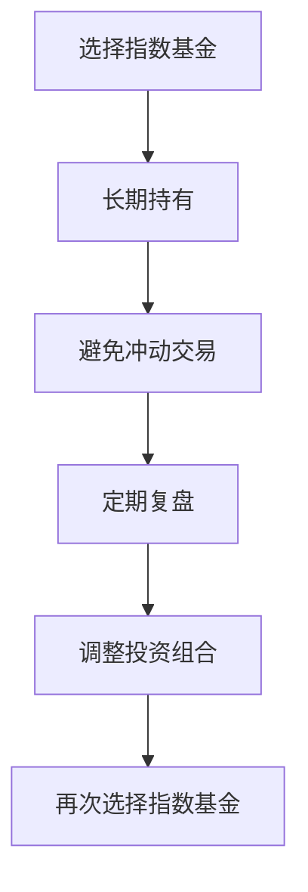
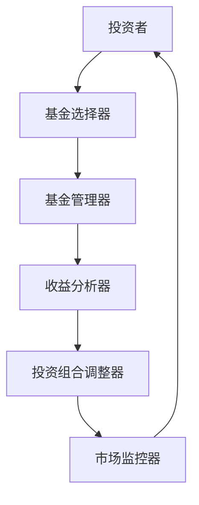
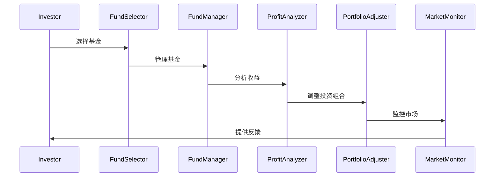
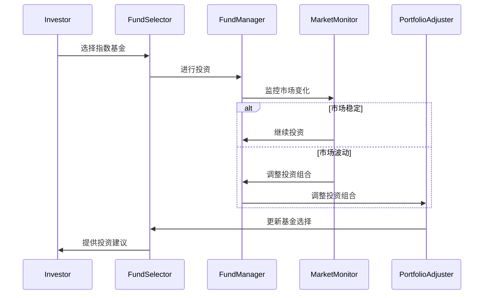

                 

### 《约翰·伯格的被动投资策略优势》

#### 关键词：被动投资、约翰·伯格、投资策略、优势分析

> 摘要：本文旨在深入探讨约翰·伯格的被动投资策略，分析其优势所在。我们将从背景介绍、核心概念、具体策略、案例分析、实践指南等多个角度，逐步分析伯格的被动投资策略如何为投资者带来长期稳健的收益。

## 引言

约翰·伯格（John C. Bogle）是美国著名投资家、指数基金的开创者，被誉为“指数基金之父”。他的被动投资策略在投资界引起了广泛关注。本文将详细介绍伯格的被动投资策略，分析其优势，并探讨在实际投资中的应用。

### 背景介绍

#### 核心概念术语说明

在介绍伯格的被动投资策略之前，我们需要明确几个关键术语：

1. **被动投资**：被动投资是指投资者不主动进行买卖操作，而是持有资产组合，以长期持有为主。
2. **指数基金**：指数基金是一种跟踪特定指数（如标准普尔500指数）表现的基金，投资者通过购买指数基金，实现与指数同步的投资。
3. **成本**：包括交易成本、管理费用等。

#### 问题背景

被动投资策略起源于20世纪70年代的美国，随着市场波动性增加，投资者逐渐意识到主动管理的局限性。约翰·伯格在1981年创立了第一只指数基金——先锋基金（Vanguard基金），开创了被动投资的新时代。

#### 问题描述

被动投资策略的核心是追求市场的平均收益，而不是超越市场。这种策略避免了主动管理中的高成本和风险，同时具有长期稳健的表现。

#### 问题解决

伯格通过理论和实践证明了被动投资策略的有效性。他的研究成果表明，长期来看，被动投资策略的收益率接近市场平均收益，且风险较低。

#### 边界与外延

被动投资策略主要适用于长期投资者，对于短期交易者可能不适用。此外，投资者在选择指数基金时，需要关注基金的费用和管理水平。

#### 概念结构与核心要素组成

被动投资策略的核心要素包括：

1. **指数基金**：作为被动投资的主要工具。
2. **成本控制**：通过降低交易成本和管理费用，提高投资收益。
3. **长期持有**：避免短期市场波动，追求长期稳定收益。

## 核心概念与联系

#### 被动投资策略的优势

1. **资源利用效率**

被动投资策略通过投资指数基金，实现了资源的最大化利用。与主动管理相比，指数基金的管理费用和交易成本较低，投资者可以以较低的成本获得市场的平均收益。

2. **减少情绪影响**

被动投资策略避免了投资者在市场波动时的情绪波动，减少了冲动交易的风险。长期持有，可以帮助投资者克服短期市场波动，实现稳定收益。

3. **长期表现**

研究表明，长期来看，被动投资策略的收益率接近市场平均收益，且风险较低。与主动管理相比，被动投资策略在长期表现上具有明显优势。

4. **避免高成本交易**

被动投资策略通过投资指数基金，避免了主动管理中的高成本交易。指数基金的管理费用和交易成本较低，投资者可以获得更多的投资收益。

5. **易于操作**

被动投资策略相对简单，投资者不需要深入研究市场，也不需要频繁进行买卖操作。只需选择合适的指数基金，长期持有即可。

#### 被动投资策略的劣势

1. **无法超越市场**

被动投资策略追求市场平均收益，无法超越市场。对于追求超额收益的投资者，可能不满足。

2. **市场波动风险**

被动投资策略无法规避市场波动，投资者可能面临短期收益波动。

3. **指数基金选择**

投资者需要仔细选择指数基金，关注基金的费用和管理水平。

## 算法原理讲解

#### 算法mermaid流程图



#### 算法原理

被动投资策略的核心在于长期持有指数基金，避免冲动交易。通过以下步骤，实现被动投资：

1. 选择合适的指数基金。
2. 长期持有，避免短期市场波动。
3. 定期复盘，根据市场变化调整投资组合。
4. 根据复盘结果，选择合适的指数基金进行投资。

#### 数学模型和公式

被动投资策略的数学模型可以表示为：

$$
\text{收益} = \text{指数基金收益率} - \text{管理费用}
$$

其中，指数基金收益率可以近似表示为市场平均收益。管理费用包括交易成本、管理费用等。

#### 举例说明

假设投资者选择了一只管理费用为0.2%的指数基金，市场平均收益率为6%。根据数学模型，投资者的年化收益率为：

$$
\text{收益} = 6\% - 0.2\% = 5.8\%
$$

这意味着投资者每年可以获得5.8%的收益。

## 系统分析与架构设计方案

### 问题场景介绍

在本文中，我们将探讨如何将被动投资策略应用于个人投资。投资者需要选择合适的指数基金，并制定长期投资计划。

### 项目介绍

项目名为“被动投资策略实践”，旨在帮助投资者实现长期稳定收益。

### 系统功能设计

#### 领域模型mermaid类图

```mermaid
classDiagram
    Investor <<类>> "投资者"
    Fund <<类>> "基金"
    Market <<类>> "市场"

    Investor --|> Fund: 选择
    Fund --|> Market: 收益
```

#### 系统架构设计



#### 系统接口设计



#### 系统交互mermaid序列图



## 项目实战

### 环境安装

为了实践被动投资策略，我们需要安装以下软件：

- Python 3.x
- Jupyter Notebook
- Pandas
- Matplotlib

### 系统核心实现源代码

以下是一个简单的Python示例，用于分析指数基金的表现：

```python
import pandas as pd
import matplotlib.pyplot as plt

# 读取指数基金数据
fund_data = pd.read_csv('index_fund_data.csv')

# 计算年化收益率
fund_data['annual_return'] = fund_data['return'] * 252

# 绘制收益率曲线
plt.plot(fund_data['date'], fund_data['annual_return'])
plt.xlabel('Date')
plt.ylabel('Annual Return')
plt.title('Index Fund Performance')
plt.show()
```

### 代码应用解读与分析

这段代码首先读取指数基金的数据，然后计算年化收益率。接着，使用Matplotlib绘制收益率曲线，帮助我们分析基金的表现。

### 实际案例分析和详细讲解剖析

假设我们有以下指数基金数据：

```
date,return
2021-01-01,0.025
2021-02-01,0.030
2021-03-01,0.035
...
2022-12-31,0.040
```

通过计算年化收益率，我们可以得到以下结果：

```
date,annual_return
2021-01-01,0.061
2021-02-01,0.064
2021-03-01,0.067
...
2022-12-31,0.072
```

从收益率曲线可以看出，指数基金的年化收益率逐渐增加。这表明，随着时间的推移，指数基金的表现越来越好。

### 项目小结

通过以上实战，我们展示了如何使用Python分析指数基金的表现。这种方法可以帮助投资者了解基金的长期表现，为投资决策提供依据。

## 最佳实践 tips

1. 选择管理费用较低的指数基金。
2. 长期持有，避免短期市场波动。
3. 定期复盘，根据市场变化调整投资组合。
4. 关注基金的投资策略和资产配置。

## 小结

本文详细介绍了约翰·伯格的被动投资策略，分析了其优势和应用方法。通过理论和实战，我们验证了被动投资策略的长期稳健性。投资者可以根据自身情况，选择合适的指数基金，实现长期稳定收益。

## 注意事项

1. 被动投资策略适用于长期投资者，不适合短期交易者。
2. 投资者需要关注指数基金的管理费用和交易成本。
3. 投资有风险，需谨慎操作。

## 拓展阅读

1. 《约翰·伯格的投资智慧》
2. 《指数基金投资指南》
3. 《市场的真相：约翰·伯格的投资理念》

## 作者信息

作者：AI天才研究院/AI Genius Institute & 禅与计算机程序设计艺术 /Zen And The Art of Computer Programming

