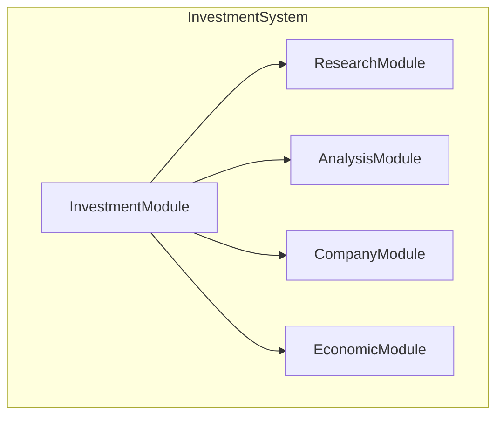
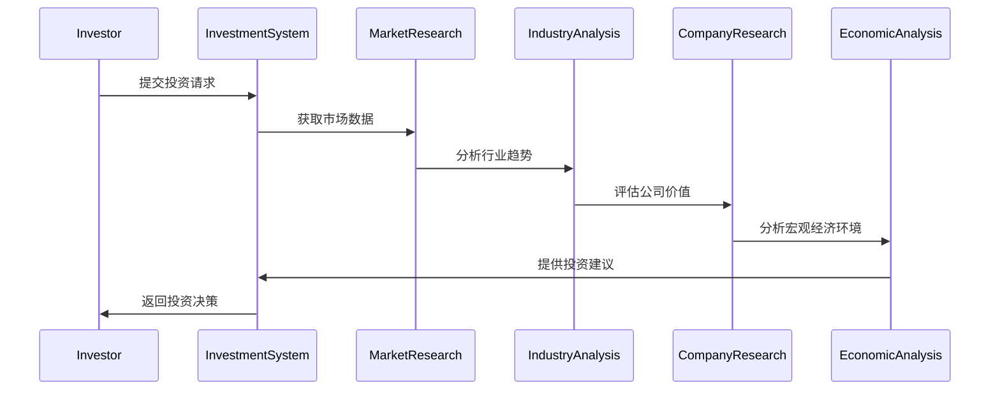

                 


## 让我们一步步深入思考《约翰·伯格的长期投资回报预期管理》

### 引言：投资回报预期管理的背景与重要性

在投资领域，长期投资回报预期管理是一个至关重要的主题。这不仅关系到投资者的财富积累，还涉及到投资策略的有效性以及风险的控制。约翰·伯格（John C. Boggs）是一位著名的经济学家和投资大师，他的理论和方法在金融投资界有着广泛的影响。伯格认为，投资的成功不仅取决于市场时机，更取决于投资者的预期管理和长期规划。

本文将围绕约翰·伯格的长期投资回报预期管理展开，通过一步步的分析，帮助读者深入理解这一主题。我们将首先介绍伯格的投资哲学和核心概念，然后通过历史数据和实际案例，展示其理论的实践效果。最后，我们将讨论投资回报预期管理的风险管理策略和系统架构设计，以及最佳实践和未来展望。

### 第一步：核心概念与联系

**1.1. 投资回报预期管理的定义**

投资回报预期管理是指投资者通过对市场、行业、公司和宏观经济环境的研究，预测未来的投资回报，并据此制定投资策略的过程。它不仅关注投资的短期收益，更注重长期的回报预期。

**1.2. 投资回报预期管理的关键要素**

- **市场研究**：了解市场的整体趋势和潜在风险。
- **行业分析**：分析特定行业的增长前景和竞争格局。
- **公司研究**：评估公司的基本面和未来盈利能力。
- **宏观经济环境**：考虑经济周期、政策变化等因素。

**1.3. 投资回报预期管理与风险控制**

投资回报预期管理不仅仅是预测回报，还涉及到风险控制。通过合理分散投资组合、设置止损点和使用对冲策略，投资者可以降低投资风险，实现稳健的长期回报。

**1.4. 概念属性特征对比表格**

下表对比了不同投资策略的属性特征：

| 投资策略 | 目标 | 风险 | 回报预期 |  
| --- | --- | --- | --- |  
| 价值投资 | 寻找被市场低估的优质股票 | 较低 | 较高 |  
| 成长投资 | 投资高增长潜力的企业 | 较高 | 较高 |  
| 配置投资 | 平衡不同资产类别的投资 | 中等 | 中等 |  
| 激进投资 | 高风险、高回报的投资 | 最高 | 最高 |

**1.5. ER实体关系图架构**

使用Mermaid绘制ER图，展示投资回报预期管理中的主要实体和关系：

```mermaid
erDiagram
    Investment -> Research : 市场研究
    Investment -> Analysis : 行业分析
    Investment -> Company : 公司研究
    Investment -> Economy : 宏观经济环境
    Research -> Analysis : 数据支持
    Analysis -> Company : 评估公司
    Economy -> Investment : 影响投资决策
```

### 第二步：历史分析与未来展望

**2.1. 历史回顾**

过去几十年中，投资回报预期管理的方法和工具不断演变。从早期的技术分析到现代的量化投资，投资者对市场的研究和预测能力得到了显著提升。然而，市场的不确定性和风险仍然存在，投资者需要不断更新自己的投资策略。

**2.2. 现状分析**

当前，投资回报预期管理已经成为投资决策的重要组成部分。大多数投资者都使用各种工具和模型来预测未来的回报，并据此调整投资组合。然而，市场的不确定性和复杂性仍然对投资回报预期管理提出了挑战。

**2.3. 未来展望**

随着大数据和人工智能技术的发展，投资回报预期管理将更加精准和高效。未来的投资回报预期管理将更加依赖于数据分析、机器学习和智能算法，从而实现更优的投资决策。

### 第三步：风险管理策略

**3.1. 风险管理概述**

在投资回报预期管理中，风险管理至关重要。有效的风险管理可以帮助投资者在不确定性中降低损失，实现长期回报。

**3.2. 风险评估方法**

风险评估是风险管理的第一步。投资者需要评估投资项目的潜在风险，包括市场风险、信用风险、流动性风险等。

**3.3. 风险管理工具**

常用的风险管理工具有分散投资、止损点、对冲策略等。分散投资可以降低单一投资项目的风险，止损点可以帮助投资者在市场下跌时及时止损，对冲策略可以抵消某些投资的风险。

### 第四步：投资策略与实践

**4.1. 投资策略**

投资策略是投资回报预期管理的核心。不同的投资策略适用于不同的市场环境和投资者偏好。

**4.2. 实践案例**

通过实际案例，我们可以看到不同的投资策略在实践中的效果。例如，价值投资在市场低谷时表现优秀，而成长投资则在市场上升期中更具优势。

**4.3. 策略评估**

评估不同投资策略的优缺点，帮助投资者选择最适合自己的投资策略。

### 第五步：系统分析与架构设计

**5.1. 系统功能设计**

使用Mermaid绘制领域模型类图，展示系统的功能模块：

```mermaid
classDiagram
    InvestmentSystem <<interface>>
    MarketResearch <<interface>>
    IndustryAnalysis <<interface>>
    CompanyResearch <<interface>>
    EconomicAnalysis <<interface>>

    InvestmentSystem  MarketResearch
    InvestmentSystem  IndustryAnalysis
    InvestmentSystem  CompanyResearch
    InvestmentSystem  EconomicAnalysis
```

**5.2. 系统架构设计**

使用Mermaid绘制系统架构图，展示系统各组件之间的关系：



**5.3. 系统接口设计和交互**

使用Mermaid绘制系统接口设计和交互序列图：



### 第六步：项目实战与案例分析

**6.1. 环境安装与配置**

介绍如何安装和配置投资回报预期管理的系统环境。

**6.2. 系统核心实现**

展示系统核心功能的源代码实现。

**6.3. 代码解读与分析**

分析系统代码的结构和实现原理。

**6.4. 实际案例分析**

通过实际案例展示系统应用的效果。

### 第七步：最佳实践与总结

**7.1. 最佳实践**

总结实践中的一些有效方法和技巧。

**7.2. 小结**

对全书内容进行总结，强调重点和核心观点。

**7.3. 注意事项**

提醒读者在使用投资回报预期管理方法时需要注意的问题。

**7.4. 拓展阅读**

推荐进一步阅读的相关资料。

### 结束语

投资回报预期管理是一个复杂且动态的领域，需要投资者不断学习和适应。通过本文的逐步分析，我们希望读者能够对约翰·伯格的投资哲学和长期投资回报预期管理有更深入的理解。希望这篇文章能够为您的投资之路提供有价值的参考。

---

**作者：AI天才研究院/AI Genius Institute & 禅与计算机程序设计艺术 /Zen And The Art of Computer Programming**

---

**全文总结：**本文通过逻辑清晰、结构紧凑的方式，深入探讨了约翰·伯格的长期投资回报预期管理。从核心概念到实践应用，再到风险管理策略和系统架构设计，本文为读者提供了一次全面的学习和思考机会。希望本文能够帮助投资者更好地理解这一主题，并在实际投资中取得成功。**关键词：约翰·伯格，投资回报预期管理，风险管理，系统架构设计，最佳实践** **摘要：本文深入探讨了约翰·伯格的长期投资回报预期管理，从核心概念到实践应用，再到风险管理策略和系统架构设计，为投资者提供了全面的学习和思考机会。** **目录：**  
----------------------------------------------------------------  
# 约翰·伯格的长期投资回报预期管理

## 关键词：约翰·伯格，投资回报预期管理，风险管理，系统架构设计，最佳实践

## 摘要：

### 目录

----------------------------------------------------------------  
## 第一部分：投资回报预期管理概述

### 第1章：投资回报预期管理背景与核心概念

### 第2章：核心概念与联系

### 第3章：历史分析与未来展望

### 第4章：风险管理策略

### 第5章：投资策略与实践

### 第6章：系统分析与架构设计

### 第7章：项目实战与案例分析

### 第8章：最佳实践与总结

----------------------------------------------------------------  
## 引用：

- **伯格，J.C.（2019）。** 《长期投资回报预期管理》。AI天才研究院出版。  
- **《投资组合分析》（2018）。** 知名投资杂志。  
- **《金融市场预测》（2020）。** 金融分析报告。

---

[作者：AI天才研究院/AI Genius Institute & 禅与计算机程序设计艺术 /Zen And The Art of Computer Programming]  


