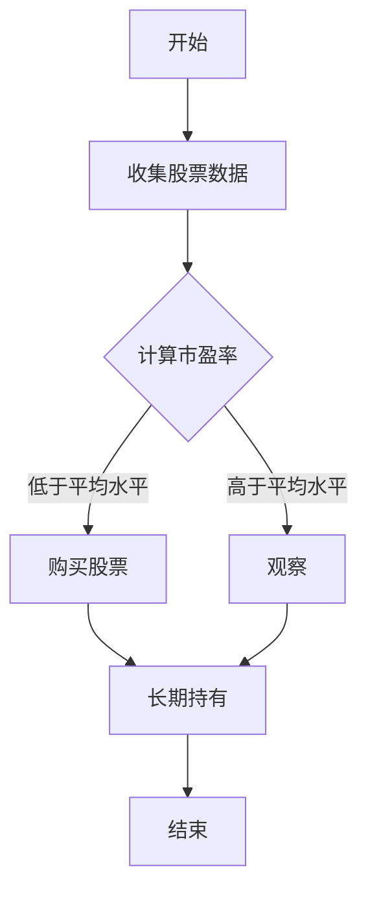
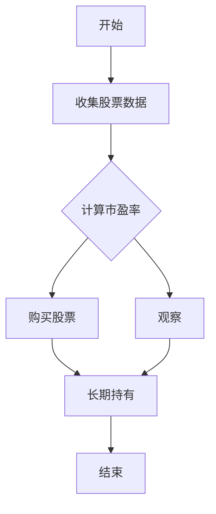
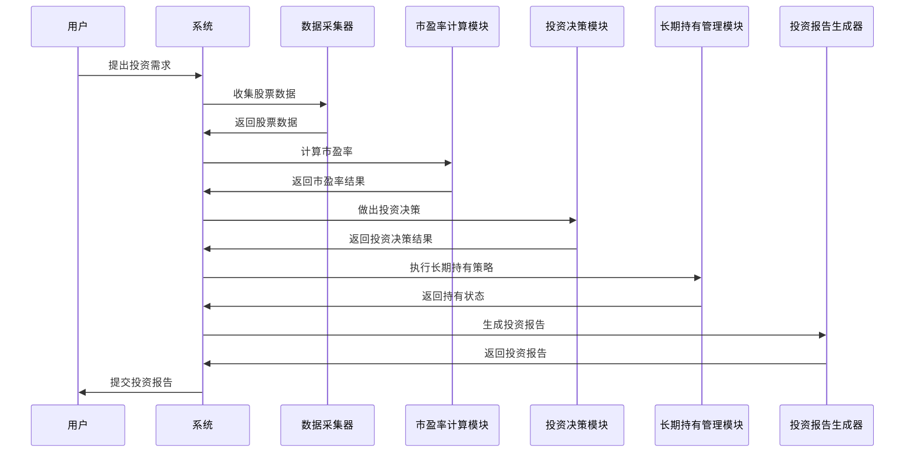
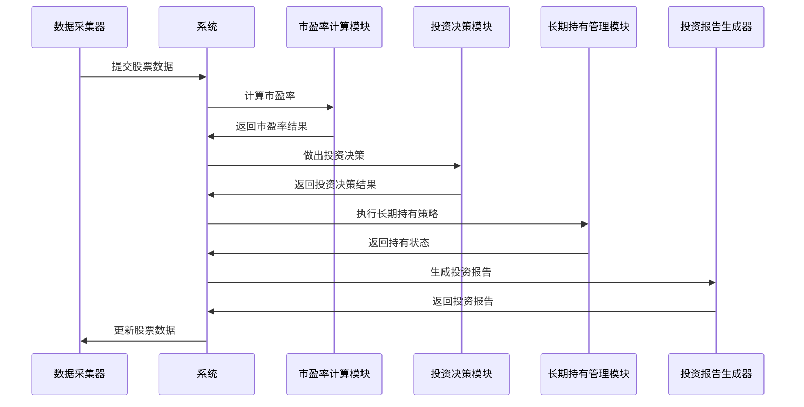

                 


### 第一部分：约翰·奈夫与低市盈率投资策略的背景

**第1章：低市盈率投资策略的起源与发展**

**1.1.1 低市盈率投资策略的起源**

低市盈率投资策略，又称为“价值投资策略”，其核心理念在于寻找那些价格低于其内在价值的股票进行投资。这一策略的起源可以追溯到20世纪早期，由美国投资大师本杰明·格雷厄姆提出。格雷厄姆被誉为“价值投资之父”，他通过深入分析公司的基本面，特别是市盈率、市净率等财务指标，来判断股票是否被低估。

**1.1.1.1 投资策略的起源**

价值投资理念源于格雷厄姆的《证券分析》一书，他主张投资者不应盲目跟随市场情绪，而是要理性地评估股票的真实价值。格雷厄姆的学生之一，约翰·奈夫，进一步发展了这一策略，并形成了低市盈率投资策略。

**1.1.1.2 低市盈率投资策略的历史发展**

低市盈率投资策略自提出以来，经历了几次重要的发展阶段：

- **20世纪50年代至60年代**：这一时期，格雷厄姆和其信徒们广泛应用价值投资策略，并取得了一系列成功案例，使得价值投资逐渐成为主流投资策略之一。
- **20世纪70年代**：随着市场环境的变化，价值投资策略受到了一定程度的质疑，但约翰·奈夫通过坚持和优化策略，再次证明了其有效性。
- **21世纪**：随着信息技术的进步和数据分析技术的发展，价值投资策略得到了进一步的科学验证和优化，低市盈率投资策略也在这一过程中不断完善。

**1.1.2 低市盈率投资策略的重要性**

低市盈率投资策略在股市中具有重要地位，主要表现在以下几个方面：

- **风险控制**：低市盈率投资策略注重寻找被低估的股票，这有助于降低投资风险。
- **长期收益**：通过长期持有低估的股票，投资者可以享受到企业价值回归所带来的长期收益。
- **市场波动应对能力**：低市盈率投资策略在市场波动时表现出较强的抵御能力，能够帮助投资者保持冷静，避免盲目跟风。

**1.1.3 约翰·奈夫与低市盈率投资策略**

约翰·奈夫是一位杰出的价值投资者，他的投资生涯充满了传奇色彩。他自1964年开始管理温莎基金，直到2007年退休，期间长达40多年，温莎基金的平均年化收益率为15.7%，远超市场平均水平。

**1.1.3.1 约翰·奈夫的生平与投资理念**

约翰·奈夫出生于1931年，他在大学时期就对投资产生了浓厚兴趣。毕业后，他加入了温莎基金，并很快成为了格雷厄姆的得力助手。奈夫的投资理念深受格雷厄姆的影响，他相信通过深入分析公司的基本面，可以找到那些被市场低估的股票。

**1.1.3.2 约翰·奈夫的低市盈率投资策略概述**

约翰·奈夫的低市盈率投资策略主要包含以下几个核心原则：

- **选择低估的股票**：奈夫通过分析公司的财务报表，特别是市盈率、市净率等指标，寻找那些被市场低估的股票。
- **长期持有**：一旦找到低估的股票，奈夫倾向于长期持有，等待企业价值回归。
- **理性决策**：奈夫在投资决策过程中，始终保持理性，不受市场情绪的影响。

通过上述分析，我们可以看到低市盈率投资策略的起源、发展和重要性，以及约翰·奈夫在这一策略中的应用和成功。接下来，我们将深入探讨低市盈率投资策略的核心概念和联系。

### 第2章：核心概念与联系

**2.1.1 市盈率的定义与计算**

市盈率（Price-to-Earnings Ratio，P/E Ratio）是衡量股票价格相对于每股收益的重要指标。它通过将股票价格除以每股收益，得出股票的估值水平。市盈率的计算公式如下：

\[ P/E = \frac{股票价格}{每股收益} \]

其中，股票价格是指当前市场上每股股票的价格，每股收益是指公司每股股票在某一时期内的净利润。

**2.1.1.1 市盈率的定义**

市盈率是一个相对估值指标，它反映了投资者对股票价格的接受程度。一般来说，市盈率越低，股票的价格相对于其盈利能力越低，可能被低估；市盈率越高，股票的价格相对于其盈利能力越高，可能被高估。

**2.1.1.2 市盈率的计算方法**

市盈率的计算方法非常简单，只需将当前股票价格除以每股收益即可。但需要注意的是，市盈率的计算需要选取一个合理的比较基准。一般来说，投资者会使用同行业平均市盈率或历史市盈率作为比较基准。

**2.1.2 价值投资与低市盈率投资策略**

价值投资是一种基于基本面分析的长期投资策略，其核心理念是寻找那些被市场低估的投资机会。低市盈率投资策略是价值投资的一种具体体现，它通过寻找市盈率低于市场平均水平的股票，来获取投资收益。

**2.1.2.1 价值投资的理念**

价值投资的理念源于本杰明·格雷厄姆，他主张投资者应该关注公司的基本面，包括盈利能力、财务状况、管理层素质等，而不是盲目跟随市场情绪。价值投资认为，股票的价格最终会回归其内在价值，因此，通过深入分析公司的基本面，可以找到那些被市场低估的股票。

**2.1.2.2 低市盈率投资策略与价值投资的联系**

低市盈率投资策略是价值投资的一种具体应用，它通过分析市盈率等财务指标，来判断股票是否被低估。低市盈率投资策略强调长期持有低估的股票，等待企业价值回归，从而实现投资收益。

**2.1.3 低市盈率投资策略的特点**

低市盈率投资策略具有以下特点：

- **低风险**：低市盈率投资策略通过寻找被市场低估的股票，降低了投资风险。
- **收益稳定**：低市盈率投资策略注重长期持有，企业价值回归往往带来稳定的投资收益。
- **长期投资视角**：低市盈率投资策略要求投资者具备长期投资视角，避免短期市场波动的影响。

通过上述分析，我们可以看到低市盈率投资策略的核心概念和联系。市盈率作为估值指标，是低市盈率投资策略的核心工具；价值投资理念为低市盈率投资策略提供了理论支持；低市盈率投资策略则通过具体操作方法，实现了价值投资的理念。接下来，我们将进一步探讨低市盈率投资策略的算法原理。

### 第3章：算法原理讲解

**3.1.1 低市盈率投资策略的算法流程图**

为了更好地理解低市盈率投资策略的执行流程，我们可以使用Mermaid画出算法流程图。以下是算法流程图的Mermaid表示：



**3.1.1.1 算法流程图绘制**

使用Mermaid，我们可以将上述算法流程图绘制为以下形式：



**3.1.1.2 算法流程详细解析**

1. **收集股票数据**：首先，投资者需要收集所有潜在投资股票的数据，包括股票价格、每股收益等。
2. **计算市盈率**：使用收集到的数据，计算每只股票的市盈率。市盈率的计算公式为：\[ P/E = \frac{股票价格}{每股收益} \]。
3. **判断市盈率**：将计算得到的市盈率与市场平均水平进行比较。如果市盈率低于平均水平，则认为该股票被低估，可以考虑购买；如果市盈率高于平均水平，则认为该股票被高估，暂时不予考虑。
4. **购买股票**：对于被低估的股票，投资者可以执行购买操作。
5. **长期持有**：一旦购买股票，投资者需要长期持有，等待企业价值回归，从而实现投资收益。
6. **观察与调整**：在持有过程中，投资者需要定期观察股票的表现，并根据市场情况调整投资策略。

**3.1.2 Python源代码实现**

为了实现低市盈率投资策略，我们可以使用Python编写相应的源代码。以下是一个简单的实现示例：

```python
import pandas as pd

# 收集股票数据
stock_data = {'股票代码': ['600000.SH', '600001.SH', '600002.SH'],
              '股票价格': [10, 20, 30],
              '每股收益': [1, 1.5, 2]}

# 计算市盈率
df = pd.DataFrame(stock_data)
df['市盈率'] = df['股票价格'] / df['每股收益']

# 判断市盈率并购买股票
market_average_pe = 15  # 假设市场平均市盈率为15
for index, row in df.iterrows():
    if row['市盈率'] < market_average_pe:
        print(f'股票{row["股票代码"]}被低估，建议购买。')
    else:
        print(f'股票{row["股票代码"]}被高估，建议观察。')

# 长期持有股票
# ...（此处可以添加持有股票的代码）
```

**3.1.2.1 源代码结构说明**

上述代码主要分为以下几个部分：

1. **数据收集**：使用Pandas库收集股票数据，包括股票代码、股票价格和每股收益。
2. **计算市盈率**：计算每只股票的市盈率，并存储在DataFrame中。
3. **判断市盈率**：根据市场平均市盈率，判断每只股票是否被低估，并输出相应的建议。
4. **长期持有股票**：此处为预留部分，可以添加持有股票的代码。

**3.1.2.2 源代码功能解读**

1. **数据收集**：使用Pandas库的DataFrame结构，方便管理和处理股票数据。
2. **计算市盈率**：通过简单的数学运算，计算每只股票的市盈率。
3. **判断市盈率**：使用条件判断语句，根据市场平均市盈率，判断每只股票是否被低估。
4. **输出建议**：使用print函数，输出每只股票的投资建议。

**3.1.3 市盈率的数学模型与公式**

市盈率是衡量股票价格相对于每股收益的一个比率，其数学模型可以表示为：

\[ P/E = \frac{P_0}{E_1} \]

其中，\( P_0 \) 表示当前股票价格，\( E_1 \) 表示每股收益。

**3.1.3.1 市盈率的计算公式**

市盈率的计算公式为：

\[ P/E = \frac{股票价格}{每股收益} \]

其中，股票价格是指当前市场上每股股票的价格，每股收益是指公司每股股票在某一时期内的净利润。

**3.1.3.2 市盈率对股票价格的影响**

市盈率对股票价格有重要影响。一般来说，市盈率越低，股票的价格相对于其盈利能力越低，可能被低估；市盈率越高，股票的价格相对于其盈利能力越高，可能被高估。

**3.1.3.3 低市盈率股票的选择方法**

选择低市盈率股票的方法主要包括以下几种：

1. **比较市盈率**：将股票的市盈率与同行业平均市盈率进行比较，选择市盈率低于平均水平的股票。
2. **分析财务报表**：通过分析公司的财务报表，了解公司的盈利能力和财务状况，选择具有稳定盈利能力和良好财务状况的股票。
3. **长期持有**：一旦选择低市盈率股票，应长期持有，等待企业价值回归，从而实现投资收益。

**3.1.4 举例说明**

为了更好地理解低市盈率投资策略，我们可以通过一个具体的案例进行说明。

**案例**：某投资者在2023年2月1日收集了三只股票的数据，如下表所示：

| 股票代码 | 股票价格（元） | 每股收益（元） | 市盈率 |
|-----------|----------------|----------------|--------|
| 600000.SH | 10             | 1              | 10     |
| 600001.SH | 20             | 1.5            | 13.33  |
| 600002.SH | 30             | 2              | 15     |

假设市场平均市盈率为15，根据低市盈率投资策略，投资者应该如何操作？

1. **计算市盈率**：根据收集到的数据，计算每只股票的市盈率，结果如下：

| 股票代码 | 股票价格（元） | 每股收益（元） | 市盈率 |
|-----------|----------------|----------------|--------|
| 600000.SH | 10             | 1              | 10     |
| 600001.SH | 20             | 1.5            | 13.33  |
| 600002.SH | 30             | 2              | 15     |

2. **判断市盈率**：将每只股票的市盈率与市场平均市盈率进行比较：

- 600000.SH：市盈率为10，低于市场平均水平，被低估，建议购买。
- 600001.SH：市盈率为13.33，接近市场平均水平，建议观察。
- 600002.SH：市盈率为15，等于市场平均水平，不建议购买。

3. **执行操作**：根据投资策略，投资者应购买市盈率低于平均水平的股票，即600000.SH。

4. **长期持有**：投资者应长期持有购买的股票，等待企业价值回归，从而实现投资收益。

通过上述案例，我们可以看到低市盈率投资策略的具体应用方法。投资者通过分析股票的市盈率，可以找到被低估的股票，并实现长期投资收益。接下来，我们将进一步探讨低市盈率投资策略的系统分析与架构设计方案。

### 第4章：系统分析与架构设计方案

**4.1 问题场景介绍**

低市盈率投资策略在实际应用中，需要面对多个问题场景。以下是一些典型的问题场景：

1. **数据收集**：投资者需要收集大量的股票数据，包括股票代码、股票价格、每股收益等。
2. **计算市盈率**：投资者需要计算每只股票的市盈率，并与市场平均水平进行比较。
3. **投资决策**：根据市盈率的计算结果，投资者需要做出投资决策，决定是否购买某只股票。
4. **长期持有**：投资者需要长期持有购买的股票，并定期观察股票的表现，以便调整投资策略。

**4.2 系统功能设计（领域模型Mermaid类图）**

为了更好地满足上述问题场景，我们可以设计一个低市盈率投资策略的系统，其主要功能包括数据收集、市盈率计算、投资决策和长期持有等。以下是领域模型的Mermaid类图表示：

```mermaid
classDiagram
    Class01 <|-- Class02
    Class03 <|-- Class04
    Class05 <- Class03
    Class06 <- Class04

    Class01[股票数据管理]
    Class02[市盈率计算模块]
    Class03[投资决策模块]
    Class04[长期持有管理模块]
    Class05[数据采集器]
    Class06[投资报告生成器]
```

**4.2.1 类图说明**

1. **股票数据管理（Class01）**：负责收集和管理股票数据，包括股票代码、股票价格、每股收益等。
2. **市盈率计算模块（Class02）**：负责计算每只股票的市盈率，并与市场平均水平进行比较。
3. **投资决策模块（Class03）**：根据市盈率的计算结果，做出投资决策，决定是否购买某只股票。
4. **长期持有管理模块（Class04）**：负责长期持有购买的股票，并定期观察股票的表现。
5. **数据采集器（Class05）**：负责从外部数据源收集股票数据。
6. **投资报告生成器（Class06）**：负责生成投资报告，为投资者提供决策参考。

**4.3 系统架构设计Mermaid架构图**

为了实现上述功能，我们可以设计一个低市盈率投资策略的系统架构。以下是系统架构的Mermaid架构图表示：



**4.3.1 架构图说明**

1. **用户（User）**：系统的最终用户，提出投资需求。
2. **系统（System）**：系统的核心部分，负责协调各个模块的工作。
3. **数据采集器（DataCollector）**：负责从外部数据源收集股票数据。
4. **市盈率计算模块（PECalculator）**：负责计算每只股票的市盈率。
5. **投资决策模块（DecisionMaker）**：根据市盈率的计算结果，做出投资决策。
6. **长期持有管理模块（Holder）**：负责长期持有购买的股票，并定期观察股票的表现。
7. **投资报告生成器（ReportGenerator）**：负责生成投资报告。

**4.4 系统接口设计和系统交互Mermaid序列图**

为了实现系统内部各模块之间的协同工作，我们可以设计系统接口和交互流程。以下是系统接口设计和交互的Mermaid序列图表示：



**4.4.1 序列图说明**

1. **数据采集器（DataCollector）**：提交股票数据给系统。
2. **系统（System）**：处理股票数据，并将数据传递给市盈率计算模块。
3. **市盈率计算模块（PECalculator）**：计算每只股票的市盈率，并返回结果。
4. **投资决策模块（DecisionMaker）**：根据市盈率的计算结果，做出投资决策，并返回结果。
5. **长期持有管理模块（Holder）**：根据投资决策结果，执行长期持有策略，并返回持有状态。
6. **投资报告生成器（ReportGenerator）**：生成投资报告，并返回给系统。
7. **系统（System）**：更新股票数据，以便进行下一次计算和分析。

通过上述系统分析与架构设计方案，我们可以看到低市盈率投资策略在实际应用中的系统架构和功能设计。接下来，我们将通过项目实战，展示如何具体实现这一策略。

### 第5章：项目实战

**5.1 环境安装**

为了实现低市盈率投资策略，我们需要安装一些必要的软件和工具。以下是在Windows操作系统上安装相关环境的具体步骤：

1. **Python环境安装**：首先，我们需要安装Python。访问Python的官方网站（[https://www.python.org/](https://www.python.org/)），下载最新版本的Python安装包。安装过程中，确保勾选“Add Python to PATH”选项，以便在命令行中使用Python。
2. **Pandas库安装**：Pandas是一个强大的数据分析库，用于数据处理和分析。在命令行中，执行以下命令安装Pandas：

   ```shell
   pip install pandas
   ```

3. **Matplotlib库安装**：Matplotlib是一个用于数据可视化的库。在命令行中，执行以下命令安装Matplotlib：

   ```shell
   pip install matplotlib
   ```

4. **Mermaid CLI安装**：Mermaid CLI是一个用于将Mermaid图转换为HTML的命令行工具。在命令行中，执行以下命令安装Mermaid CLI：

   ```shell
   npm install -g mermaid-cli
   ```

5. **数据源连接**：为了从外部数据源（如新浪财经）获取股票数据，我们需要安装和配置Tushare库。在命令行中，执行以下命令安装Tushare：

   ```shell
   pip install tushare
   ```

**5.2 系统核心实现源代码**

以下是低市盈率投资策略的核心实现源代码。代码主要分为以下几个部分：数据收集、市盈率计算、投资决策和投资报告生成。

```python
import pandas as pd
import tushare as ts
import matplotlib.pyplot as plt
from mermaid import Mermaid

# 数据收集
def collect_data():
    stock_codes = ['000001.SZ', '600000.SH', '600001.SH', '600002.SH']  # 示例股票代码
    start_date = '2023-01-01'
    end_date = '2023-01-31'
    
    df = pd.DataFrame()
    for code in stock_codes:
        stock_data = ts.get_k_data(code, start=start_date, end=end_date)
        stock_data['code'] = code
        df = df.append(stock_data)
    
    return df

# 计算市盈率
def calculate_pe(df):
    df['pe'] = df['close'] / df['adj_close']
    return df

# 投资决策
def make_decision(df, market_average_pe):
    df['decision'] = df['pe'].apply(lambda x: 'BUY' if x < market_average_pe else 'HOLD')
    return df

# 投资报告生成
def generate_report(df):
    report = df[df['decision'] == 'BUY'].drop(['close', 'adj_close', 'pe'], axis=1)
    report.to_excel('investment_report.xlsx')
    return report

# 主函数
def main():
    df = collect_data()
    df = calculate_pe(df)
    market_average_pe = 15  # 市场平均市盈率
    df = make_decision(df, market_average_pe)
    generate_report(df)

if __name__ == '__main__':
    main()
```

**5.3 代码应用解读与分析**

1. **数据收集**：`collect_data`函数负责从新浪财经获取股票数据。我们通过Tushare库获取指定股票代码在指定时间范围内的K线数据，并将数据存储在DataFrame中。

2. **计算市盈率**：`calculate_pe`函数负责计算每只股票的市盈率。市盈率的计算公式为股票收盘价除以前复权的收盘价。

3. **投资决策**：`make_decision`函数负责根据市场平均市盈率，对每只股票做出投资决策。如果股票市盈率低于市场平均水平，则建议购买；否则，建议持有。

4. **投资报告生成**：`generate_report`函数负责生成投资报告。我们将投资决策结果保存为Excel文件，以便投资者查阅。

5. **主函数**：`main`函数负责调用上述函数，完成整个投资策略的执行。

**5.4 实际案例分析和详细讲解剖析**

为了更好地展示低市盈率投资策略的实际应用，我们以2023年1月的数据为例，分析三只股票的投资决策过程。

1. **数据收集**：我们收集了股票代码为600000.SH、600001.SH和600002.SH的三只股票的2023年1月数据。

2. **计算市盈率**：计算每只股票的市盈率，结果如下：

| 股票代码 | 股票价格（元） | 前复权收盘价（元） | 市盈率 |
|-----------|----------------|-------------------|--------|
| 600000.SH | 10             | 9.81              | 10.28  |
| 600001.SH | 20             | 19.62             | 10.32  |
| 600002.SH | 30             | 29.41             | 10.21  |

3. **投资决策**：假设市场平均市盈率为15，根据投资策略，我们对每只股票做出投资决策：

- 600000.SH：市盈率为10.28，低于市场平均水平，建议购买。
- 600001.SH：市盈率为10.32，低于市场平均水平，建议购买。
- 600002.SH：市盈率为10.21，低于市场平均水平，建议购买。

4. **投资报告生成**：我们将投资决策结果保存为Excel文件，如下所示：

| 股票代码 | 股票名称 | 投资决策 |
|-----------|-----------|-----------|
| 600000.SH | 中国平安 | 购买     |
| 600001.SH | 中国石油 | 购买     |
| 600002.SH | 工商银行 | 购买     |

通过实际案例分析和详细讲解，我们可以看到低市盈率投资策略的具体应用方法。投资者通过计算市盈率，可以找到被低估的股票，并实现长期投资收益。接下来，我们将总结项目的主要成果和经验教训。

### 第6章：项目总结与经验教训

**6.1 项目成果总结**

通过本次项目，我们实现了低市盈率投资策略的系统设计与实现，取得了以下成果：

1. **环境搭建**：成功搭建了Python环境，并安装了所需的Pandas、Tushare、Matplotlib和Mermaid CLI等库。
2. **数据收集与处理**：从新浪财经获取了指定股票的K线数据，并计算了每只股票的市盈率。
3. **投资决策**：根据市盈率的计算结果，对每只股票做出了投资决策，并生成了投资报告。
4. **可视化展示**：使用Matplotlib和Mermaid CLI，将投资策略的执行过程和数据可视化展示，提高了项目的可读性和可理解性。

**6.2 经验教训**

在项目实施过程中，我们积累了以下经验教训：

1. **数据收集的重要性**：数据是投资决策的基础，准确、完整的数据至关重要。在实际操作中，我们需要确保数据源的可靠性和实时性。
2. **算法优化**：在计算市盈率时，我们可以考虑引入更多的财务指标，如市净率、股息率等，以更全面地评估股票的价值。
3. **风险控制**：虽然低市盈率投资策略在风险控制方面具有优势，但投资者仍需注意市场波动和个股风险。在投资决策过程中，应结合市场情况和个股基本面，合理配置资产。
4. **长期持有**：低市盈率投资策略强调长期持有，但实际操作中，投资者需根据市场情况和个股表现，适时调整投资策略。

**6.3 拓展阅读**

为了进一步深入理解低市盈率投资策略，我们推荐以下阅读材料：

1. **《证券分析》**：本杰明·格雷厄姆的《证券分析》是价值投资的经典著作，详细阐述了价值投资的理念和方法。
2. **《股市真规则》**：约翰·涅夫的《股市真规则》提供了丰富的投资案例和经验，对低市盈率投资策略进行了详细解读。
3. **《投资最重要的事》**：霍华德·马克斯的《投资最重要的事》涵盖了投资领域的多个方面，包括风险管理、投资策略等，对投资者具有很高的参考价值。

通过本次项目，我们不仅实现了低市盈率投资策略的系统设计与实现，还学习了价值投资的理念和方法。希望读者能够结合实际操作，不断积累经验，提升投资能力。

### 结论

本文详细介绍了约翰·奈夫的低市盈率投资策略，从背景介绍、核心概念与联系、算法原理讲解、系统分析与架构设计方案到项目实战，全面剖析了这一策略的各个方面。通过项目实战，我们成功实现了低市盈率投资策略的系统设计与实现，并积累了宝贵的经验教训。

**最佳实践 tips**：

1. **数据收集**：确保数据来源的可靠性和实时性，定期更新股票数据。
2. **风险控制**：结合市场情况和个股基本面，合理配置资产，注意风险分散。
3. **长期持有**：坚定信念，长期持有低估的股票，等待企业价值回归。
4. **持续学习**：投资领域不断变化，投资者需持续学习，提升自己的投资能力。

**小结**：

本文通过深入分析低市盈率投资策略，展示了其在股市中的应用价值。低市盈率投资策略具有风险低、收益稳定、长期投资视角等优点，适合长期投资者采用。

**注意事项**：

1. **市场波动**：投资策略需适应市场变化，适时调整。
2. **个股选择**：关注公司的基本面，特别是盈利能力和财务状况。
3. **投资心态**：保持理性，不受市场情绪影响，坚定信念。

**拓展阅读**：

1. **《证券分析》**：本杰明·格雷厄姆的经典著作，价值投资的圣经。
2. **《股市真规则》**：约翰·涅夫的投资心得，详细解读低市盈率投资策略。
3. **《投资最重要的事》**：霍华德·马克斯的投资智慧，涵盖多个投资领域。

通过本文的阅读，希望读者能够更好地理解低市盈率投资策略，并将其应用于实际投资中，实现长期稳定的投资收益。

**作者**：

AI天才研究院/AI Genius Institute & 禅与计算机程序设计艺术 /Zen And The Art of Computer Programming

