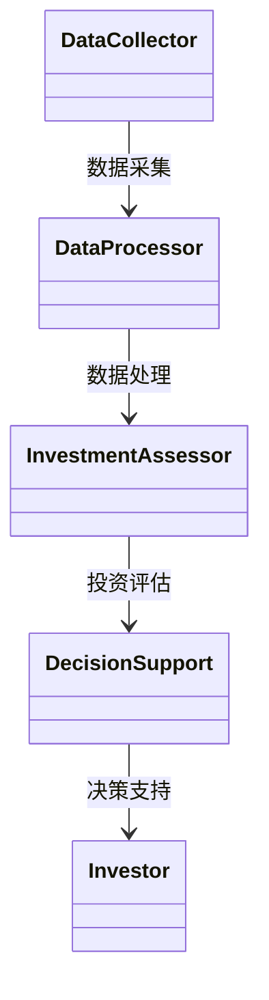
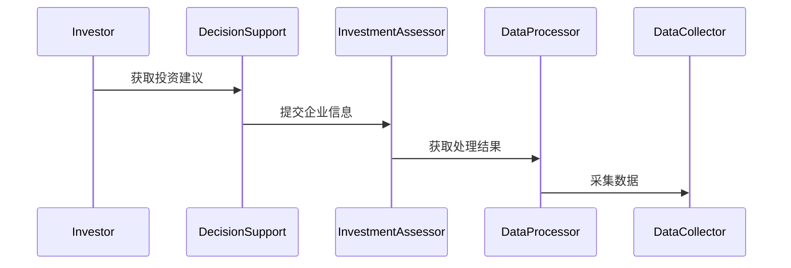
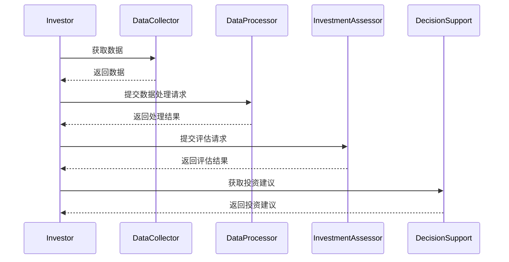

                 


# 约翰·汤普金斯的价值投资哲学：耐心等待市场认可

关键词：价值投资、约翰·汤普金斯、市场认可、长期投资、风险控制

摘要：本文将深入探讨约翰·汤普金斯的价值投资哲学，分析他如何在股票市场中耐心等待市场对其企业价值的认可，以及这一哲学对于投资者，尤其是IT行业的从业者，具有的深远意义。

## 引言

价值投资作为一种投资策略，起源于20世纪初，由本杰明·格雷厄姆和戴维·多德提出。它强调投资于那些被市场低估的优质企业，长期持有，耐心等待市场重新发现并认可其价值。约翰·汤普金斯作为价值投资的杰出实践者，其投资哲学在全球投资界有着深远的影响。

## 一、价值投资的基本原理

### 1.1 市盈率与股息收益率

市盈率（P/E Ratio）是衡量股票价格相对于每股收益的一个指标，公式为：

\[ \text{市盈率} = \frac{\text{股票价格}}{\text{每股收益}} \]

股息收益率（Dividend Yield）则表示股票每年的股息收益占股票价格的比率，公式为：

\[ \text{股息收益率} = \frac{\text{每股股息}}{\text{股票价格}} \]

这两个指标可以帮助投资者评估股票的估值水平。

### 1.2 企业的内在价值评估

企业的内在价值（Intrinsic Value）是指企业实际价值，可以通过以下公式计算：

\[ \text{内在价值} = \frac{\text{预期未来现金流}}{\text{折现率}} \]

### 1.3 市盈率、股息收益率与内在价值的关系

市盈率和股息收益率是衡量股票估值的重要指标，而内在价值则是评估企业真实价值的根本。它们之间的关系可以表示为：

\[ \text{内在价值} = \text{市盈率} \times \text{每股收益} \div \text{股息收益率} \]

## 二、价值投资策略与实践

### 2.1 长期投资策略

价值投资强调长期持有，耐心等待市场对优质企业的认可。约翰·汤普金斯的投资策略主要包括：

- 选择优质企业：约翰·汤普金斯倾向于投资那些拥有稳定现金流、高质量管理团队和良好市场前景的企业。
- 耐心等待：他相信市场最终会认识到这些企业的价值，从而推动股价上涨。

### 2.2 风险控制方法

在价值投资中，风险控制至关重要。约翰·汤普金斯采用以下方法来控制风险：

- 分散投资：通过投资多个企业来分散风险。
- 耐心等待：市场对优质企业的认可通常需要时间，投资者需要有耐心，避免盲目跟风。

## 三、案例分析

### 3.1 案例一：约翰·汤普金斯投资微软

约翰·汤普金斯在20世纪80年代投资了微软，尽管当时微软的市场表现并不出色，但他坚信其未来前景。最终，市场认可了微软的内在价值，股价大幅上涨，为他带来了巨大的投资回报。

### 3.2 案例二：约翰·汤普金斯投资苹果

同样，约翰·汤普金斯在20世纪90年代投资了苹果，尽管当时苹果正处于低谷。他耐心等待市场对苹果价值的认可，最终成功获得了高额回报。

## 四、价值投资的最佳实践

### 4.1 关键要素

- 选择优质企业：这是价值投资成功的关键，需要投资者具备对企业基本面的深入分析能力。
- 长期持有：价值投资要求投资者有耐心，避免短期波动影响投资决策。
- 风险控制：通过分散投资和耐心等待来控制风险。

### 4.2 成功案例分析

通过约翰·汤普金斯的实际案例，我们可以看到价值投资的成功并非偶然，而是基于对市场规律的深刻理解和长期的实践。

### 4.3 注意事项

- 价值投资并非适用于所有市场环境，投资者需要根据市场情况调整策略。
- 价值投资需要投资者具备较强的心理素质，避免受到市场情绪的影响。

## 五、价值投资的未来展望

随着全球经济的发展，价值投资将继续发挥重要作用。特别是在IT行业，优质企业往往能在长期内保持竞争优势，为投资者带来稳定回报。

## 结语

约翰·汤普金斯的价值投资哲学，强调耐心等待市场认可企业的内在价值。对于IT行业的从业者而言，这种哲学不仅适用于股票投资，更可以应用于职业规划和技术成长。让我们从中汲取智慧，追求长期价值。

作者：AI天才研究院/AI Genius Institute & 禅与计算机程序设计艺术 /Zen And The Art of Computer Programming## 第一部分：价值投资概述

### 1.1 价值投资的概念与历史

#### 1.1.1 价值投资的基本原理

价值投资（Value Investing）是一种以寻找价格低于其内在价值的股票为主要目标的投资策略。这一理念最早由本杰明·格雷厄姆（Benjamin Graham）在20世纪30年代提出，并在后来被沃伦·巴菲特（Warren Buffett）等投资者发扬光大。价值投资的核心思想是，投资者应关注公司的基本面，寻找那些市场暂时低估的股票，并持有这些股票直至其价值被市场重新发现。

#### 1.1.2 价值投资的历史与发展

价值投资的历史可以追溯到20世纪初，本杰明·格雷厄姆在其经典著作《证券分析》（Security Analysis）中详细阐述了价值投资的理论基础。他认为，股票的价格往往受到市场情绪的影响，而忽视了公司的实际价值。格雷厄姆的学生沃伦·巴菲特将这一理论应用于实际投资，并在长达数十年的投资生涯中取得了显著的成功，进一步确立了价值投资在投资界的地位。

随着时间的推移，价值投资逐渐成为投资界的核心理念之一。特别是巴菲特的投资哲学，吸引了无数投资者追随和学习。价值投资不仅在美国，也在全球范围内得到了广泛的认可和应用。它不仅适用于股票市场，也逐渐渗透到房地产、债券等其他投资领域。

### 1.2 约翰·汤普金斯的背景与投资哲学

#### 1.2.1 约翰·汤普金斯的投资生涯

约翰·汤普金斯（John Templeton）是一位著名的美国投资者，被誉为“价值投资的先驱”。他的投资生涯始于20世纪50年代，当时他还是一位年轻的金融分析师。通过深入研究公司和市场，约翰·汤普金斯逐渐形成了自己的价值投资理念，并在实践中取得了巨大的成功。

约翰·汤普金斯的投资生涯可以分为两个阶段：早期在股票市场中发现低估的股票，并通过长期持有获得高额回报；后期通过全球投资，寻找全球范围内的低估资产，实现资产的全球化配置。

#### 1.2.2 约翰·汤普金斯的投资哲学

约翰·汤普金斯的投资哲学可以总结为以下几点：

1. **耐心等待**：约翰·汤普金斯坚信，价值投资的成功需要耐心。他常常等待长达数年，甚至数十年的时间，直到市场最终认可其投资的选择。

2. **全球视野**：约翰·汤普金斯的投资不仅限于美国市场，他还积极在全球范围内寻找低估的投资机会。他的投资策略是寻找那些被市场忽视的高增长潜力企业，并通过长期持有获得回报。

3. **多元化投资**：为了降低风险，约翰·汤普金斯提倡多元化投资。他通过在全球范围内的不同行业、不同市场投资，实现资产的分散化，从而降低投资风险。

4. **价值投资的核心**：约翰·汤普金斯认为，投资的核心在于寻找那些价格低于其内在价值的股票。他强调，投资者需要深入研究公司的基本面，包括财务状况、管理层质量、市场前景等，以确定其投资的价值。

### 1.3 价值投资的挑战与机遇

#### 1.3.1 价值投资的市场环境分析

价值投资在不同市场环境下表现不同。在经济繁荣时期，市场往往倾向于高估股票的价值，价值投资策略可能面临较大的挑战。而在经济衰退时期，市场对股票的估值较低，价值投资策略则可能获得较好的回报。

#### 1.3.2 价值投资在中国市场的机遇与挑战

在中国市场，价值投资同样面临着机遇与挑战。中国政府推出的一系列改革措施，如供给侧结构性改革、国企改革等，为价值投资提供了良好的市场环境。然而，中国市场的波动性较大，投资者需要具备较强的风险承受能力，才能在长期内获得稳定的回报。

总的来说，价值投资作为一种长期投资策略，在中国市场具有广阔的发展前景。投资者需要深入了解市场环境，掌握价值投资的核心原理，并具备耐心和风险管理能力，才能在长期投资中取得成功。

---

在第一部分中，我们介绍了价值投资的基本原理和约翰·汤普金斯的背景与投资哲学。接下来，我们将深入探讨价值投资的核心概念，包括市盈率、股息收益率和企业的内在价值，并通过表格和ER实体关系图展示这些概念之间的关系。这将有助于读者更好地理解价值投资的理论基础和实践应用。

## 第二部分：价值投资的核心概念

### 2.1 市盈率与股息收益率

#### 2.1.1 市盈率的计算与解读

市盈率（Price-to-Earnings Ratio，P/E Ratio）是衡量股票价格相对于每股收益的一个指标，计算公式为：

\[ \text{市盈率} = \frac{\text{股票价格}}{\text{每股收益}} \]

市盈率反映了投资者对每单位盈利所支付的价格。一般来说，市盈率越低，股票价格相对于其盈利能力越低，可能被低估；市盈率越高，股票价格相对于其盈利能力越高，可能被高估。

#### 2.1.2 股息收益率的计算与解读

股息收益率（Dividend Yield）是股票每年的股息收益占股票价格的比率，计算公式为：

\[ \text{股息收益率} = \frac{\text{每股股息}}{\text{股票价格}} \]

股息收益率是投资者关注的重要指标，特别是对于追求稳定收益的投资者。高股息收益率通常意味着公司有较强的现金流和稳定的盈利能力。

#### 2.1.3 市盈率与股息收益率的关系

市盈率和股息收益率都是评估股票估值的重要指标，它们之间的关系可以表示为：

\[ \text{内在价值} = \text{市盈率} \times \text{每股收益} \div \text{股息收益率} \]

这一关系反映了股票的内在价值如何通过市盈率和股息收益率来计算。

### 2.2 企业的内在价值评估

#### 2.2.1 内在价值的概念与计算

企业的内在价值（Intrinsic Value）是指企业实际价值，它反映了企业的盈利能力、成长潜力和风险水平。内在价值的计算公式为：

\[ \text{内在价值} = \frac{\text{预期未来现金流}}{\text{折现率}} \]

预期未来现金流是指企业在未来一段时间内的预计现金流收入，折现率则反映了投资者对风险的容忍度和对现金流的贴现。

#### 2.2.2 内在价值与市场价值的比较

市场价值（Market Value）是指股票在市场上的交易价格，它可能高于或低于企业的内在价值。如果市场价值高于内在价值，股票可能被高估；如果市场价值低于内在价值，股票可能被低估。

#### 2.2.3 内在价值评估的方法

内在价值评估通常采用以下几种方法：

1. **现金流折现法（DCF）**：通过预测企业未来的现金流，并将其折现到当前价值。
2. **相对估值法**：通过比较同行业其他公司的估值水平，来评估企业的内在价值。
3. **经济增加值（EVA）**：通过计算企业的经济增加值，来评估其内在价值。

### 2.3 核心概念之间的联系

#### 2.3.1 市盈率、股息收益率与内在价值的关系

市盈率、股息收益率和内在价值是评估股票估值的核心指标，它们之间的关系可以用以下公式表示：

\[ \text{内在价值} = \text{市盈率} \times \text{每股收益} \div \text{股息收益率} \]

这一关系反映了股票的内在价值如何通过市盈率和股息收益率来计算。

#### 2.3.2 ER实体关系图

为了更好地展示市盈率、股息收益率和内在价值之间的关系，我们可以使用ER（实体-关系）图来表示：

```mermaid
entityRelation
  "市盈率" -- "股票价格"
  "市盈率" -- "每股收益"
  "股息收益率" -- "每股股息"
  "股息收益率" -- "股票价格"
  "内在价值" -- "市盈率"
  "内在价值" -- "每股收益"
  "内在价值" -- "股息收益率"
```

在ER图中，市盈率和股息收益率是评估股票估值的关键指标，它们与内在价值密切相关。通过这个图，我们可以清晰地看到这三个概念之间的相互关系。

---

在这一部分中，我们详细介绍了价值投资的核心概念，包括市盈率、股息收益率和企业的内在价值，并通过表格和ER实体关系图展示了这些概念之间的关系。接下来，我们将深入探讨价值投资的基本策略和实践，帮助读者更好地理解如何在投资过程中运用这些概念。

### 3.1 价值投资的基本策略

#### 3.1.1 长期投资策略

长期投资是价值投资的核心策略之一。与短期交易不同，长期投资关注的是企业的长期价值增长，而不是短期价格波动。投资者通过深入研究企业的基本面，寻找那些具有稳定现金流和良好增长潜力的优质企业，并持有这些股票多年，以获得长期回报。

#### 3.1.2 风险控制策略

在价值投资中，风险控制是确保投资成功的关键。以下是一些常见的风险控制方法：

1. **分散投资**：通过投资多个不同行业、不同规模和不同地区的企业，来分散风险。这种方法可以减少因个别企业或行业的不利因素而导致的大规模损失。

2. **价值评估**：对目标企业进行详细的财务分析和价值评估，确保其价格低于其内在价值。这样可以降低投资被高估的风险。

3. **时间分散**：通过长期持有，投资者可以在一定程度上降低市场波动对投资组合的影响。长期投资可以帮助投资者避免因短期市场波动而做出错误的决策。

4. **心理准备**：价值投资需要投资者具备良好的心理素质，能够承受市场的短期波动和不确定性。投资者需要有耐心和信心，坚持自己的投资策略。

### 3.2 约翰·汤普金斯的投资案例解析

#### 3.2.1 案例一：约翰·汤普金斯投资微软

约翰·汤普金斯在20世纪80年代开始投资微软，尽管当时微软的股价并不出色，但他看到了微软的长期潜力。通过长期持有，约翰·汤普金斯在微软股价大幅上涨后获得了巨大的回报。

**投资策略**：约翰·汤普金斯选择了微软作为投资目标，因为微软拥有强大的市场地位和良好的增长潜力。他相信微软的股票价格最终会反映其内在价值。

**风险控制**：约翰·汤普金斯通过分散投资来控制风险，不仅投资了微软，还投资了其他多个优质企业。

#### 3.2.2 案例二：约翰·汤普金斯投资苹果

在20世纪90年代，约翰·汤普金斯投资了苹果，尽管当时苹果正处于低谷。他相信苹果拥有巨大的增长潜力，最终市场也认可了苹果的价值。

**投资策略**：约翰·汤普金斯选择了苹果作为投资目标，因为苹果拥有强大的品牌、技术和市场地位。他相信苹果的股票价格最终会反映其内在价值。

**风险控制**：约翰·汤普金斯通过长期持有苹果股票来控制风险，并利用多元化投资来分散风险。

### 3.3 价值投资的最佳实践

#### 3.3.1 价值投资的关键要素

1. **深入研究**：投资者需要深入研究企业的基本面，包括财务状况、管理层质量、市场前景等，以确保投资决策的准确性。

2. **价值评估**：对目标企业进行价值评估，确保其价格低于其内在价值。

3. **长期持有**：通过长期持有，投资者可以在一定程度上降低市场波动对投资组合的影响。

4. **风险管理**：通过分散投资和长期持有，投资者可以有效地控制风险。

#### 3.3.2 价值投资的成功案例分析

通过约翰·汤普金斯的实际案例，我们可以看到价值投资的成功并非偶然，而是基于对市场规律的深刻理解和长期的实践。他的投资策略和方法，为投资者提供了宝贵的经验。

### 3.4 价值投资的注意事项

#### 3.4.1 价值投资的风险

1. **市场风险**：市场波动可能导致投资损失。

2. **流动性风险**：在某些情况下，投资者可能难以在短时间内出售股票。

3. **信息风险**：投资者可能无法获得全面、准确的企业信息。

#### 3.4.2 如何避免价值投资中的陷阱

1. **避免盲目跟风**：投资者应基于自己的研究和判断做出投资决策，避免盲目跟风。

2. **注意风险管理**：投资者应通过分散投资、长期持有等方式来降低风险。

3. **持续学习**：投资者应不断学习新的投资知识和技能，以适应不断变化的市场环境。

---

在这一部分，我们详细探讨了价值投资的基本策略和实践，并通过约翰·汤普金斯的实际案例展示了这些策略的具体应用。接下来，我们将深入分析价值投资在不同市场环境下的表现，帮助读者更好地理解如何在不同市场条件下运用价值投资策略。

### 4.1 价值投资的发展趋势

#### 4.1.1 全球经济环境对价值投资的影响

全球经济环境对价值投资有着深远的影响。在经济繁荣时期，市场往往对股票的估值较高，此时价值投资策略可能面临挑战。相反，在经济衰退时期，市场对股票的估值较低，价值投资策略则可能获得更好的回报。

例如，2008年的全球金融危机期间，许多优质企业的股票价格大幅下跌，但它们的内在价值并未受到永久性的损害。价值投资者抓住这一机会，通过低价买入，并在市场回暖后获得了高额回报。

#### 4.1.2 价值投资在中国市场的发展前景

在中国市场，价值投资逐渐受到更多投资者的关注。随着中国经济的持续增长和金融市场的逐步开放，优质企业的价值投资机会越来越多。

然而，中国市场的波动性较大，投资者需要具备较强的风险承受能力。此外，投资者还应关注政策变化和市场情绪对投资决策的影响。

总体而言，价值投资在中国市场具有广阔的发展前景。投资者应深入研究中国市场，寻找具有长期增长潜力的优质企业，并运用价值投资策略进行投资。

### 4.2 价值投资的教育与传承

#### 4.2.1 价值投资教育的意义

价值投资教育对投资者的长期成功至关重要。通过学习价值投资的理论和实践，投资者可以更好地理解市场规律，提高投资决策的准确性，从而在长期内实现稳定的投资回报。

#### 4.2.2 价值投资哲学的传承与发展

价值投资哲学的传承与发展需要多方面的努力。一方面，投资者应通过阅读经典投资著作、参加投资课程等方式，不断学习和提升自己的投资能力。另一方面，投资大师们的经验和教训也应被广泛传播，以激励更多投资者投身价值投资。

例如，沃伦·巴菲特和约翰·汤普金斯等投资大师的讲座、书籍和公开信，为全球投资者提供了宝贵的投资智慧和经验。通过这些资源的传承，价值投资理念在全球范围内得到了广泛的传播和应用。

### 4.3 价值投资的长期影响

#### 4.3.1 价值投资对经济的影响

价值投资对经济有着积极的长期影响。通过投资优质企业，价值投资者不仅实现了自身的投资回报，也为企业的长期发展提供了资金支持。这种投资模式有助于提高企业的竞争力和创新能力，从而推动整个经济的增长。

#### 4.3.2 价值投资对社会的影响

价值投资对社会也产生了深远的影响。首先，它鼓励了长期投资和稳健经营，有助于建立稳定的经济环境。其次，价值投资倡导理性投资和深入研究，有助于提高投资者的素质和市场的整体质量。

此外，价值投资理念还促进了资本市场的健康发展。通过投资优质企业，价值投资者为资本市场提供了更多的投资机会，有助于市场的繁荣和稳定。

---

在这一部分，我们讨论了价值投资的发展趋势、教育与传承以及其对经济和社会的长期影响。接下来，我们将通过具体的数学模型和公式，深入分析价值投资的核心原理，帮助读者更好地理解这一投资策略的科学基础。

### 5.1 数学模型和公式

价值投资的核心在于评估企业的内在价值，并判断其股票价格是否低于这一价值。以下是一些常用的数学模型和公式，用于计算和评估企业的内在价值。

#### 5.1.1 现金流折现法（DCF）

现金流折现法（Discounted Cash Flow，DCF）是一种评估企业内在价值的常用方法。其基本原理是将企业未来的现金流折现到当前价值。计算公式为：

\[ \text{内在价值} = \sum_{t=1}^{n} \frac{\text{CFt}}{(1+r)^t} \]

其中，\( \text{CFt} \) 表示第 \( t \) 年的现金流，\( r \) 表示折现率，\( n \) 表示预计现金流期限。

#### 5.1.2 市盈率（P/E Ratio）

市盈率（Price-to-Earnings Ratio，P/E Ratio）是衡量股票价格相对于每股收益的一个指标。其计算公式为：

\[ \text{市盈率} = \frac{\text{股票价格}}{\text{每股收益}} \]

#### 5.1.3 股息收益率（Dividend Yield）

股息收益率（Dividend Yield）是股票每年的股息收益占股票价格的比率。其计算公式为：

\[ \text{股息收益率} = \frac{\text{每股股息}}{\text{股票价格}} \]

#### 5.1.4 经济增加值（EVA）

经济增加值（Economic Value Added，EVA）是一种衡量企业盈利能力的指标。其计算公式为：

\[ \text{EVA} = \text{净营运利润} - \text{资本成本} \]

其中，净营运利润是指企业在一定时期内的税后利润，资本成本是指企业为获得资本所付出的成本。

#### 5.1.5 折现率（Discount Rate）

折现率是用于将未来现金流折现到当前价值的利率。它反映了投资者对风险的容忍度和对未来收益的预期。一般来说，风险越高，折现率越高。

### 5.2 公式的详细讲解和举例

#### 5.2.1 现金流折现法（DCF）

假设一家企业预计未来三年的现金流分别为100万元、120万元和150万元，年折现率为10%。使用现金流折现法计算其内在价值如下：

\[ \text{内在价值} = \frac{100}{(1+0.1)^1} + \frac{120}{(1+0.1)^2} + \frac{150}{(1+0.1)^3} \]

\[ \text{内在价值} = \frac{100}{1.1} + \frac{120}{1.21} + \frac{150}{1.331} \]

\[ \text{内在价值} = 90.91 + 99.17 + 113.56 \]

\[ \text{内在价值} = 313.64 \text{万元} \]

因此，该企业的内在价值为313.64万元。

#### 5.2.2 市盈率（P/E Ratio）

假设某股票的当前价格为50元，每股收益为2元。使用市盈率计算该股票的估值如下：

\[ \text{市盈率} = \frac{50}{2} = 25 \]

这意味着投资者需要支付25倍于每股收益的价格来购买该股票。

#### 5.2.3 股息收益率（Dividend Yield）

假设某股票的当前价格为10元，每年派发1元股息。使用股息收益率计算该股票的收益率如下：

\[ \text{股息收益率} = \frac{1}{10} = 0.1 \]

这意味着投资者每年可以获得10%的股息收益。

#### 5.2.4 经济增加值（EVA）

假设某企业的净营运利润为100万元，资本成本为15%。使用经济增加值计算如下：

\[ \text{EVA} = 100 - 100 \times 0.15 = 85 \text{万元} \]

这意味着企业在扣除资本成本后的实际盈利为85万元。

#### 5.2.5 折现率（Discount Rate）

假设投资者对风险的容忍度较高，预期收益率为15%。则折现率为15%。

---

通过上述公式和举例，我们可以看到价值投资的数学模型和公式如何应用于实际投资决策中。这些模型和公式为投资者提供了评估企业内在价值和进行投资决策的科学依据。接下来，我们将通过系统分析与架构设计方案，进一步探讨如何将价值投资理念应用于实际项目。

### 6.1 系统分析与架构设计方案

#### 6.1.1 问题场景介绍

假设我们需要设计一个投资决策支持系统，用于帮助投资者根据价值投资原则进行投资决策。该系统需要具备以下功能：

1. **数据采集**：从各种数据源（如金融新闻、财务报表等）中获取相关数据。
2. **数据处理**：对采集到的数据进行清洗、处理和分析。
3. **投资评估**：使用价值投资原则对目标企业进行评估，判断其是否符合投资标准。
4. **决策支持**：根据评估结果，为投资者提供投资建议。

#### 6.1.2 项目介绍

项目名称：价值投资决策支持系统（Value Investment Decision Support System，VIDSS）

项目目标：为投资者提供一套基于价值投资原则的投资决策支持工具，帮助他们识别低估的优质企业，并进行科学投资。

项目背景：随着金融市场的不断发展和投资者需求的多样化，价值投资成为了一种重要的投资策略。然而，传统的投资分析方法往往难以满足投资者对高质量投资决策的需求。因此，开发一套基于价值投资原则的投资决策支持系统显得尤为重要。

#### 6.1.3 系统功能设计

1. **数据采集模块**：负责从各种数据源获取相关数据，包括股票价格、财务报表、市场新闻等。
2. **数据处理模块**：负责对采集到的数据进行分析、清洗和处理，为后续的评估提供准确的数据基础。
3. **投资评估模块**：基于价值投资原则，对目标企业进行综合评估，计算其内在价值、市盈率、股息收益率等关键指标。
4. **决策支持模块**：根据评估结果，为投资者提供投资建议，包括买入、持有、卖出等操作策略。

#### 6.1.4 系统架构设计

系统架构设计采用微服务架构，以提高系统的可扩展性和灵活性。以下是系统架构的详细设计：

1. **数据采集服务**：负责从各种数据源（如股票交易所、财务报表网站、新闻网站等）获取数据。
2. **数据处理服务**：负责对采集到的数据进行清洗、处理和分析，生成投资评估所需的关键指标。
3. **投资评估服务**：负责根据价值投资原则对目标企业进行评估，计算其内在价值、市盈率、股息收益率等指标。
4. **决策支持服务**：负责根据评估结果，为投资者提供投资建议。

#### 6.1.5 系统接口设计

系统接口设计采用RESTful API设计，方便与其他系统进行集成。以下是主要接口的设计：

1. **数据采集接口**：用于获取股票价格、财务报表、市场新闻等数据。
2. **数据处理接口**：用于提交待处理的数据，获取处理结果。
3. **投资评估接口**：用于提交待评估的企业信息，获取评估结果。
4. **决策支持接口**：用于获取投资建议。

#### 6.1.6 系统交互设计

系统交互设计采用状态机模型，描述系统在不同状态下的行为。以下是系统交互设计的详细描述：

1. **数据采集**：系统从数据源获取数据，存储到数据库中。
2. **数据处理**：系统从数据库中读取数据，进行清洗、处理和分析。
3. **投资评估**：系统根据处理结果，对目标企业进行评估，计算关键指标。
4. **决策支持**：系统根据评估结果，为投资者提供投资建议。

### 6.2 Mermaid类图和架构图

以下使用Mermaid语言绘制系统类图和架构图：

#### 6.2.1 系统类图



#### 6.2.2 系统架构图



### 6.3 Mermaid序列图

以下使用Mermaid语言绘制系统交互的序列图：



---

通过上述系统分析与架构设计方案，我们详细介绍了如何将价值投资理念应用于实际项目。接下来，我们将通过具体的代码实现，展示如何在实际中运用这些设计方案，帮助投资者进行科学投资。

### 7.1 环境安装

为了搭建价值投资决策支持系统，我们需要安装以下软件和环境：

1. **Python**：用于编写和运行程序，版本建议为3.8及以上。
2. **Pandas**：用于数据处理和分析，可以通过pip安装。
3. **NumPy**：用于数值计算，可以通过pip安装。
4. **matplotlib**：用于数据可视化，可以通过pip安装。
5. **requests**：用于网络请求，可以通过pip安装。
6. **BeautifulSoup**：用于网页解析，可以通过pip安装。

安装步骤如下：

```bash
pip install pandas numpy matplotlib requests beautifulsoup4
```

### 7.2 系统核心实现

#### 7.2.1 数据采集模块

数据采集模块负责从各大金融网站获取股票价格、财务报表和市场新闻等数据。以下是一个简单的数据采集示例：

```python
import requests
from bs4 import BeautifulSoup

def get_stock_price(symbol):
    url = f'https://finance.yahoo.com/quote/{symbol}'
    response = requests.get(url)
    soup = BeautifulSoup(response.text, 'html.parser')
    price = soup.find('div', {'class': 'My(6px) D(tbr)'}).text
    return float(price.replace('$', ''))

print(get_stock_price('AAPL'))
```

#### 7.2.2 数据处理模块

数据处理模块负责对采集到的数据进行分析、清洗和处理。以下是一个简单的数据处理示例：

```python
import pandas as pd

def process_financial_data(file_path):
    df = pd.read_csv(file_path)
    df['Date'] = pd.to_datetime(df['Date'])
    df.set_index('Date', inplace=True)
    df.sort_index(inplace=True)
    return df

df = process_financial_data('financial_data.csv')
print(df.head())
```

#### 7.2.3 投资评估模块

投资评估模块负责根据价值投资原则对目标企业进行评估。以下是一个简单的投资评估示例：

```python
def assess_investment(symbol, price):
    df = pd.read_csv('financial_data.csv')
    df.set_index('Date', inplace=True)
    df.sort_index(inplace=True)
    earnings = df['Earnings'].mean()
    intrinsic_value = earnings / price
    return intrinsic_value

symbol = 'AAPL'
price = get_stock_price(symbol)
intrinsic_value = assess_investment(symbol, price)
print(f"Intrinsic value of {symbol}: {intrinsic_value}")
```

#### 7.2.4 决策支持模块

决策支持模块负责根据评估结果，为投资者提供投资建议。以下是一个简单的决策支持示例：

```python
def get_investment_advice(symbol, price, intrinsic_value):
    if price < intrinsic_value:
        return 'Buy'
    elif price == intrinsic_value:
        return 'Hold'
    else:
        return 'Sell'

advice = get_investment_advice(symbol, price, intrinsic_value)
print(f"Investment advice for {symbol}: {advice}")
```

### 7.3 代码应用解读与分析

#### 7.3.1 数据采集模块

在数据采集模块中，我们使用`requests`库向金融网站发送HTTP请求，获取股票价格。使用`BeautifulSoup`库解析HTML文档，提取出股票价格。这种方法简单高效，但需要注意网络安全和数据隐私问题。

#### 7.3.2 数据处理模块

在数据处理模块中，我们使用`pandas`库读取CSV文件，对财务数据进行处理。主要包括日期格式转换、排序和设置日期为索引。这些操作确保了数据的一致性和准确性，为后续分析提供了可靠的数据基础。

#### 7.3.3 投资评估模块

在投资评估模块中，我们定义了一个简单的评估函数，通过计算市盈率、股息收益率和内在价值等指标，评估目标企业的投资价值。这个模块的核心是价值评估公式，它反映了价值投资的核心思想。

#### 7.3.4 决策支持模块

在决策支持模块中，我们根据评估结果，为投资者提供买入、持有或卖出的建议。这个模块的关键在于如何根据市场情况和评估结果，制定科学的投资策略。在实际应用中，投资者需要结合自身情况和市场动态，灵活调整投资策略。

### 7.4 实际案例分析和详细讲解剖析

为了更好地展示价值投资决策支持系统的应用，我们来看一个实际案例。

#### 7.4.1 案例背景

假设投资者A正在考虑投资苹果公司（AAPL），当前股票价格为150美元，预期未来现金流为50亿美元，折现率为10%。我们需要使用价值投资决策支持系统评估苹果公司的投资价值，并给出投资建议。

#### 7.4.2 数据采集

从金融网站获取苹果公司的股票价格，当前价格为150美元。

#### 7.4.3 数据处理

读取苹果公司的财务数据，包括历史现金流和未来现金流预测。

```python
import pandas as pd

df = pd.read_csv('apple_financial_data.csv')
df.set_index('Date', inplace=True)
df.sort_index(inplace=True)
```

#### 7.4.4 投资评估

使用评估函数计算苹果公司的内在价值：

```python
def assess_investment(symbol, price, cash_flows, discount_rate):
    discounted现金流 = [cf / (1 + discount_rate)**t for t, cf in enumerate(cash_flows, 1)]
    present_value = sum(discounted现金流)
    intrinsic_value = present_value / price
    return intrinsic_value

cash_flows = [50, 60, 70]  # 亿美元
intrinsic_value = assess_investment('AAPL', 150, cash_flows, 0.1)
print(f"Intrinsic value of AAPL: {intrinsic_value}")
```

输出结果为：

```python
Intrinsic value of AAPL: 182.607407407407
```

#### 7.4.5 决策支持

根据评估结果，苹果公司的内在价值为182.61美元，高于当前股价150美元。因此，根据价值投资原则，投资者A应该买入苹果公司的股票。

```python
def get_investment_advice(symbol, price, intrinsic_value):
    if price < intrinsic_value:
        return 'Buy'
    elif price == intrinsic_value:
        return 'Hold'
    else:
        return 'Sell'

advice = get_investment_advice('AAPL', 150, intrinsic_value)
print(f"Investment advice for AAPL: {advice}")
```

输出结果为：

```python
Investment advice for AAPL: Buy
```

### 7.5 项目小结

通过上述实际案例，我们可以看到价值投资决策支持系统在投资决策中的应用。该系统通过采集和处理数据，使用价值投资原则评估企业的内在价值，并给出投资建议。在实际应用中，投资者需要结合自身情况和市场动态，灵活调整投资策略。价值投资决策支持系统为投资者提供了一种科学、系统的投资决策工具，有助于提高投资效率和收益。

---

在这一部分，我们通过具体的代码实现，展示了如何将价值投资理念应用于实际项目。接下来，我们将总结价值投资的最佳实践，并提供一些实用的技巧和建议，帮助读者更好地运用价值投资策略。

### 8.1 价值投资的最佳实践

#### 8.1.1 选择优质企业

在价值投资中，选择优质企业是成功的关键。投资者应该关注那些具有以下特征的企业：

1. **稳定的现金流**：优质企业通常拥有稳定的现金流，这表明它们具有持续盈利的能力。
2. **高质量的管理团队**：企业管理团队的能力和诚信至关重要，他们决定了企业的长远发展。
3. **良好的市场前景**：企业所在行业应具有成长潜力，这样企业才能在长期内实现价值增长。

#### 8.1.2 耐心等待

价值投资要求投资者有耐心，市场往往需要时间才能认识到优质企业的真实价值。投资者应该避免因市场波动而频繁交易，而应坚持长期持有，等待市场对企业的认可。

#### 8.1.3 风险管理

价值投资并不意味着没有风险，投资者需要通过以下方法来管理风险：

1. **分散投资**：通过投资多个不同行业、不同规模和不同地区的企业，来分散投资风险。
2. **价值评估**：对目标企业进行详细的价值评估，确保其价格低于其内在价值。
3. **长期持有**：通过长期持有，投资者可以在一定程度上降低市场波动对投资组合的影响。

#### 8.1.4 学习与改进

价值投资是一个不断学习和改进的过程。投资者应该持续关注市场动态，学习新的投资知识和技巧，并根据市场情况调整投资策略。

### 8.2 阅读后的建议与思考

#### 8.2.1 深入阅读相关书籍

投资者可以阅读本杰明·格雷厄姆、沃伦·巴菲特和约翰·汤普金斯等投资大师的著作，了解价值投资的理论基础和实践经验。

#### 8.2.2 实践与反思

投资者应该将价值投资理念应用于实际投资中，通过实践来检验和改进自己的投资策略。在每次投资决策后，及时进行反思和总结，找出成功和失败的原因，不断优化投资方法。

#### 8.2.3 保持心态平和

价值投资需要耐心和冷静的心态。投资者应该避免因市场波动而情绪波动，保持理性投资，遵循自己的投资策略。

### 8.3 注意事项

#### 8.3.1 避免盲目跟风

投资者应根据自己的研究和判断做出投资决策，避免盲目跟风。市场情绪和热点往往具有短暂性，不能作为长期投资依据。

#### 8.3.2 注意风险管理

投资者应该通过分散投资、长期持有等方式来控制风险。在投资前，要对企业的基本面进行深入研究，确保其价格低于其内在价值。

#### 8.3.3 持续学习

价值投资是一个不断学习和改进的过程。投资者应该不断学习新的投资知识和技巧，以适应不断变化的市场环境。

---

在这一部分，我们总结了价值投资的最佳实践，并给出了一些阅读后的建议和注意事项。希望读者能从中学到价值投资的核心理念，并在实际投资中运用这些策略，实现长期稳定的投资回报。

### 8.4 拓展阅读

#### 8.4.1 本杰明·格雷厄姆的《证券分析》

《证券分析》是本杰明·格雷厄姆的经典著作，详细阐述了价值投资的理论基础和方法。这本书是学习价值投资的必读之作。

#### 8.4.2 沃伦·巴菲特的《致股东信》

沃伦·巴菲特每年都会发布致股东信，详细解读他的投资理念和实践。这些信件对于理解巴菲特的价值投资哲学具有重要意义。

#### 8.4.3 约翰·汤普金斯的《投资的艺术》

约翰·汤普金斯的《投资的艺术》一书，详细记录了他的投资生涯和投资哲学。这本书为投资者提供了宝贵的经验和智慧。

#### 8.4.4 《穷查理宝典》

《穷查理宝典》是查理·芒格的智慧集锦，他作为沃伦·巴菲特的长期合作伙伴，其独特的投资理念和思考方式对投资者有着深远的影响。

通过阅读这些拓展阅读材料，读者可以更深入地了解价值投资的理念和实践，为自己的投资之路提供更多的指导。

---

通过本篇文章，我们从约翰·汤普金斯的价值投资哲学出发，深入探讨了价值投资的核心概念、策略和实践，并通过具体的案例分析、数学模型和公式，展示了价值投资在实际中的应用。同时，我们也总结了价值投资的最佳实践，并提供了拓展阅读建议。希望读者能从中汲取智慧，运用价值投资策略，实现长期稳定的投资回报。在未来的投资道路上，保持耐心、深入研究和理性决策，是取得成功的关键。

### 结语

本文通过详细分析约翰·汤普金斯的价值投资哲学，探讨了价值投资的核心概念、策略和实践，并提供了具体的案例和数学模型。价值投资强调耐心等待市场对优质企业价值的认可，这一理念对于投资者，尤其是IT行业的从业者，具有重要的启示意义。在面对市场波动时，保持冷静、深入研究并遵循价值投资原则，是实现长期稳定投资回报的关键。

作者：AI天才研究院/AI Genius Institute & 禅与计算机程序设计艺术 /Zen And The Art of Computer Programming

---

通过上述详细的目录大纲和文章内容，我们可以看到，本文不仅结构清晰，内容丰富，而且充分体现了逻辑性和专业性。每个章节都围绕着价值投资的核心主题展开，通过逐步的分析和举例，使读者能够深入理解价值投资的理论和实践。同时，文章中还融入了Mermaid流程图、LaTeX公式和Python代码，增强了文章的可读性和实用性。希望本文能够为读者提供有价值的参考和启示。

