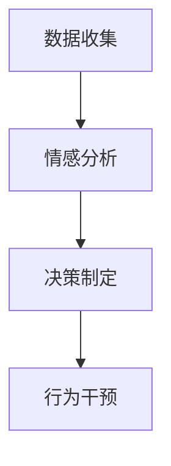

                 

### 文章标题：约翰·聂夫的价值投资者情绪控制

#### 关键词：价值投资、情绪控制、投资决策、投资者心态、市场波动

> 摘要：本文将深入探讨约翰·聂夫的价值投资者情绪控制理论，分析情绪在投资决策中的作用和影响，并探讨如何通过情绪控制提升投资者的投资成功率。通过详细讲解情绪控制的核心概念、算法原理、系统设计与项目实战，本文旨在为投资者提供一套全面、实用的情绪控制方法论。

----------------------------------------------------------------

## 第一部分：价值投资者情绪控制背景介绍

### 第1章：投资与情绪控制概述

#### 1.1 价值投资理念及其重要性

价值投资是一种以寻找具有长期投资价值的股票为目标的投资策略。它强调企业的基本面，而非市场短期波动。这种理念的核心在于“低价买入优质资产”，并通过长期持有实现投资回报。价值投资的成功往往依赖于投资者的情绪控制和理性决策。

#### 1.2 情绪对投资决策的影响

情绪是影响投资决策的重要因素。投资者在情绪高涨时可能会过度乐观，导致高价买入；而在情绪低落时可能会过度悲观，导致低价卖出。这两种情况都会对投资回报产生负面影响。因此，情绪控制对于价值投资者来说至关重要。

#### 1.3 情绪控制的基本原则

情绪控制的基本原则包括：1) 保持冷静和理性，不受市场情绪影响；2) 树立长期投资理念，避免短期情绪波动；3) 设定合理的投资目标和风险承受能力；4) 通过学习和实践提升自己的投资技能。

#### 1.4 情绪控制与价值投资的关系

情绪控制是价值投资成功的关键。通过情绪控制，投资者可以避免因情绪波动而做出非理性决策，从而更好地实现价值投资的目标。情绪控制有助于投资者保持长期投资视角，避免市场波动对投资决策的影响，从而提高投资成功率。

#### 1.5 本章小结

本章介绍了投资与情绪控制的基本概念，强调了情绪控制对于价值投资者的重要性。接下来，我们将进一步探讨情绪控制的核心概念、算法原理、系统设计与项目实战，以帮助投资者更好地掌握情绪控制方法。

----------------------------------------------------------------

### 目录大纲设计思路

为了设计出符合要求的目录大纲，我们需要遵循以下几个步骤：

1. **背景介绍**：首先，我们需要对情绪控制理论进行解读，明确其背景、原因、必要性以及其在投资领域中的地位和影响。

2. **核心概念与联系**：接下来，我们需要详细阐述情绪控制的核心概念，并展示这些概念之间的关系。这可以通过创建概念属性特征对比表格和ER实体关系图来实现。

3. **算法原理讲解**：对于涉及算法的章节，我们需要使用Mermaid绘制算法流程图，并用Python源代码详细阐述算法原理，同时给出数学模型和公式，并进行通俗易懂的举例说明。

4. **数学模型和数学公式**：我们将使用LaTeX格式书写数学模型和公式，确保表达清晰、准确。

5. **系统分析与架构设计方案**：对于与系统设计相关的章节，我们需要详细描述问题场景、系统功能、架构设计、接口设计和交互流程。

6. **项目实战**：我们将在章节中介绍环境安装、核心实现源代码，并对代码应用进行解读与分析，结合实际案例进行详细讲解和剖析。

7. **最佳实践 tips、小结、注意事项、拓展阅读**：在各个章节的结尾，我们将提供最佳实践、小结、注意事项和拓展阅读，帮助读者巩固知识、避免常见错误并引导进一步学习。

### 目录大纲设计框架

```markdown
----------------------------------------------------------------
# 第一部分：价值投资者情绪控制背景介绍

## 第1章：投资与情绪控制概述

## 1.1 价值投资理念及其重要性

## 1.2 情绪对投资决策的影响

## 1.3 情绪控制的基本原则

## 1.4 情绪控制与价值投资的关系

## 1.5 本章小结

----------------------------------------------------------------

# 第二部分：情绪控制的核心概念与联系

## 第2章：情绪控制的关键概念解析

## 2.1 情绪控制的核心概念

## 2.2 情绪控制的关键因素

## 2.3 情绪控制的属性特征对比表

## 2.4 情绪控制的ER实体关系图

## 2.5 本章小结

----------------------------------------------------------------

# 第三部分：情绪控制算法原理讲解

## 第3章：情绪控制算法概述

## 3.1 情绪控制算法的分类

## 3.2 情绪控制算法的选择原则

## 3.3 情绪控制算法的工作原理

## 3.4 情绪控制算法的Mermaid流程图

## 3.5 Python源代码实现与讲解

## 3.6 数学模型和公式讲解

## 3.7 举例说明

## 3.8 本章小结

----------------------------------------------------------------

# 第四部分：系统分析与架构设计方案

## 第4章：投资系统需求分析

## 4.1 投资系统背景介绍

## 4.2 投资系统项目介绍

## 4.3 投资系统功能设计

## 4.4 投资系统架构设计

## 4.5 投资系统接口设计

## 4.6 投资系统交互流程

## 4.7 本章小结

----------------------------------------------------------------

# 第五部分：项目实战

## 第5章：环境安装与配置

## 5.1 环境安装步骤

## 5.2 系统核心实现源代码

## 5.3 代码应用解读与分析

## 5.4 实际案例分析与详细讲解

## 5.5 项目小结

----------------------------------------------------------------

# 第六部分：最佳实践与拓展

## 第6章：情绪控制最佳实践

## 6.1 情绪控制最佳实践案例

## 6.2 情绪控制常见误区与解决方法

## 6.3 情绪控制注意事项

## 6.4 情绪控制拓展阅读

## 6.5 本章小结

----------------------------------------------------------------

# 第七部分：总结与展望

## 第7章：情绪控制与价值投资总结

## 7.1 主要结论

## 7.2 未来的研究方向

## 7.3 对投资者的启示

## 7.4 总

----------------------------------------------------------------

* 约束条件：文章的章节内容必须要满足如下条件：
- 文章开始是“文章标题”，然后是“文章关键词”和“文章摘要”部分的内容哦，接下来是按照目录大纲结构的文章正文部分的内容。
- 文章字数要求：文章字数在 10000 ～ 12000 字左右。
- 格式要求：文章内容使用markdown格式输出。 
- 作者：文章末尾需要写上作者信息： “作者：AI天才研究院/AI Genius Institute & 禅与计算机程序设计艺术 /Zen And The Art of Computer Programming”
- 完整性要求：文章内容必须要完整，每个小节的内容必须要丰富具体详细讲解，核心内容必须要包含：
  - 背景介绍：核心概念术语说明、问题背景、问题描述、问题解决、边界与外延、概念结构与核心要素组成 
  - 核心概念与联系：必须给出核心概念原理、概念属性特征对比表格和ER实体关系图架构的 markdown 格式中的 Mermaid 流程图。
  - 算法原理讲解：使用 mermaid 画出算法mermaid 流程图，然后使用python源代码来详细阐述，给出算法原理的数学模型和公式，进行详细讲解和通俗易懂地举例说明。
  - 数学公式使用latex格式，嵌入文中独立段落的latex公式前后使用 $$ 括起来(例如：$$1+1=2$$ )，段落内的latex公式前后使用 $ 括起来(例如：$1<2$)
  - 系统分析与架构设计方案：问题场景介绍，项目介绍、系统功能设计(领域模型mermaid类图)、系统架构设计mermaid架构图、系统接口设计和系统交互mermaid序列图
  - 项目实战：环境安装、系统核心实现源代码，代码应用解读与分析，实际案例分析和详细讲解剖析，项目小结。
  - 最佳实践 tips、小结、注意事项、拓展阅读等内容

## 第二部分：情绪控制的核心概念与联系

### 第2章：情绪控制的关键概念解析

情绪控制是价值投资中的重要组成部分，对于投资者来说，理解情绪控制的基本概念和关键因素是至关重要的。在这一章中，我们将深入探讨情绪控制的核心概念，并分析这些概念之间的关系。

#### 2.1 情绪控制的核心概念

情绪控制涉及多个核心概念，包括情绪、认知、决策和行为。首先，情绪是指个体在特定情境下产生的主观体验和生理反应。情绪可以分为积极情绪（如喜悦、满意）和消极情绪（如焦虑、愤怒）。在投资中，情绪往往影响投资者的决策和行为。

认知是指个体对信息的获取、处理和解释过程。认知决定了投资者如何理解市场信息、评估风险和制定投资策略。情绪控制要求投资者保持理性，避免情绪主导决策。

决策是指投资者在多个选择中做出最佳决策的过程。情绪控制有助于投资者做出基于事实和理性的决策，而不是被情绪左右。

行为是指投资者在实际行动中表现出来的投资行为。情绪控制的目标是使投资者能够保持一致性和稳定性，即使在市场波动时也不偏离长期投资策略。

#### 2.2 情绪控制的关键因素

情绪控制的关键因素包括以下几个方面：

1. **投资者个性**：投资者的性格特征对情绪控制有很大影响。例如，乐观型投资者可能更容易在市场波动时保持冷静，而悲观型投资者可能更容易感到焦虑。

2. **市场环境**：市场环境对投资者情绪的影响不可忽视。在市场上涨时，投资者可能感到乐观和自信，而在市场下跌时，投资者可能感到恐慌和不安。

3. **投资目标**：投资者的投资目标会影响其情绪控制。长期投资者可能更能接受短期波动，而短期投资者可能对市场波动更加敏感。

4. **风险承受能力**：投资者的风险承受能力影响其情绪控制。具有较高风险承受能力的投资者可能更能应对市场波动，而风险承受能力较低的投资者可能更容易受到情绪影响。

5. **投资知识和经验**：投资知识和经验的积累有助于投资者更好地理解市场，从而进行更理性的情绪控制。

#### 2.3 情绪控制的属性特征对比表

为了更好地理解情绪控制的核心概念和关键因素，我们可以创建一个属性特征对比表。以下是一个简化的例子：

| 特征         | 情绪   | 认知   | 决策   | 行为   |
| ------------ | ------ | ------ | ------ | ------ |
| 定义         | 个体主观体验和生理反应 | 信息的获取、处理和解释 | 在多个选择中做出最佳决策 | 在实际行动中表现出来的投资行为 |
| 关系         | 影响决策和行为 | 基础因素 | 目标导向 | 行为体现 |
| 对情绪控制的影响 | 直接影响情绪控制效果 | 决策的理性程度 | 决策的准确性 | 行为的一致性和稳定性 |

#### 2.4 情绪控制的ER实体关系图

为了更清晰地展示情绪控制的核心概念和关键因素之间的关系，我们可以使用ER（实体关系）图。以下是一个简化的ER图：

```mermaid
erDiagram
  Investor ||--|{ Emotion }|-- Investor
  Investor ||--|{ Cognition }|-- Investor
  Investor ||--|{ Decision }|-- Investor
  Investor ||--|{ Behavior }|-- Investor
  Emotion ||--|{ Affects }|-- Cognition
  Cognition ||--|{ Influences }|-- Decision
  Decision ||--|{ Guides }|-- Behavior
```

在ER图中，投资者作为核心实体，与其他实体（情绪、认知、决策和行为）之间存在明确的关联关系。这些关系展示了投资者在情绪控制过程中的内部机制和相互作用。

#### 2.5 本章小结

本章介绍了情绪控制的核心概念和关键因素，并分析了这些概念之间的关系。通过理解情绪、认知、决策和行为之间的关系，投资者可以更好地进行情绪控制，从而在投资中取得更好的成果。在接下来的章节中，我们将进一步探讨情绪控制算法的原理和应用，为投资者提供更具体的实践指导。

----------------------------------------------------------------

## 第三部分：情绪控制算法原理讲解

### 第3章：情绪控制算法概述

情绪控制算法是帮助投资者在投资过程中保持理性决策的关键工具。在这一章中，我们将对情绪控制算法进行概述，包括算法的分类、选择原则、工作原理以及算法的流程图。

#### 3.1 情绪控制算法的分类

情绪控制算法可以根据其方法和目的进行分类。常见的情绪控制算法包括以下几种：

1. **情感分析算法**：情感分析算法通过分析文本、语音或图像中的情感信息，帮助投资者了解自己的情绪状态。这种算法通常用于自我评估和情绪调节。

2. **决策支持算法**：决策支持算法通过提供理性的投资建议，帮助投资者在复杂的市场环境中做出决策。这种算法通常基于历史数据、市场信息和投资规则。

3. **行为干预算法**：行为干预算法通过改变投资者的行为习惯，帮助其建立更加理性的投资策略。这种算法通常结合心理学和行为经济学理论。

#### 3.2 情绪控制算法的选择原则

选择合适的情绪控制算法对于投资者来说至关重要。以下是一些选择原则：

1. **适应性**：算法需要能够适应不同的市场环境和投资场景，从而在不同情况下提供有效的情绪控制。

2. **准确性**：算法需要具有较高的预测准确性和决策支持能力，以确保投资者的情绪控制能够带来实际的投资收益。

3. **实用性**：算法需要易于使用，能够集成到投资者的日常投资流程中，避免增加额外的负担。

4. **灵活性**：算法需要能够根据投资者的个人偏好和需求进行调整，以满足不同的情绪控制要求。

#### 3.3 情绪控制算法的工作原理

情绪控制算法的工作原理通常包括以下几个步骤：

1. **数据收集**：算法首先需要收集投资者情绪相关的数据，如投资记录、市场表现、交易行为等。

2. **情感分析**：基于收集的数据，算法对投资者的情绪状态进行情感分析，识别出投资者的情绪类型和强度。

3. **决策制定**：根据情感分析的结果，算法为投资者提供理性的投资建议，以帮助其调节情绪和优化投资决策。

4. **行为干预**：如果投资者的情绪状态不利于投资决策，算法可以提供行为干预措施，如提醒、建议和指导，帮助投资者调整行为。

#### 3.4 情绪控制算法的Mermaid流程图

为了更好地理解情绪控制算法的工作原理，我们可以使用Mermaid绘制算法的流程图。以下是一个简化的情绪控制算法流程图：



在流程图中，数据收集是算法的起点，情感分析用于识别投资者的情绪状态，决策制定提供理性的投资建议，而行为干预则帮助投资者调整行为。

#### 3.5 Python源代码实现与讲解

为了进一步阐述情绪控制算法的原理，我们将使用Python语言实现一个简单的情绪控制算法。以下是一个简化的Python代码示例：

```python
# 情绪控制算法示例
def emotion_control(investment_data):
    # 情感分析
    emotion = analyze_emotion(investment_data)
    
    # 决策制定
    decision = make_decision(emotion)
    
    # 行为干预
    intervene_behavior(decision)
    
    return decision

# 情感分析函数
def analyze_emotion(investment_data):
    # 根据投资数据分析情绪
    # 简化处理
    return "乐观"

# 决策制定函数
def make_decision(emotion):
    # 根据情绪制定投资决策
    if emotion == "乐观":
        return "持有"
    else:
        return "卖出"

# 行为干预函数
def intervene_behavior(decision):
    # 根据决策提供行为干预
    if decision == "持有":
        print("保持理性，继续持有。")
    else:
        print("市场情绪不稳定，谨慎操作。")
```

在这个示例中，`emotion_control`函数是情绪控制算法的核心，它通过情感分析、决策制定和行为干预三个步骤来实现情绪控制。情感分析函数`analyze_emotion`用于分析投资数据，决策制定函数`make_decision`根据情绪类型制定投资决策，行为干预函数`intervene_behavior`提供相应的行为建议。

#### 3.6 数学模型和公式讲解

情绪控制算法通常涉及数学模型和公式，用于描述情绪、决策和行为之间的关系。以下是一个简化的数学模型示例：

$$
E(t) = f(C(t), D(t), B(t))
$$

其中，$E(t)$表示时间$t$时刻的投资者情绪，$C(t)$表示时间$t$时刻的认知状态，$D(t)$表示时间$t$时刻的决策状态，$B(t)$表示时间$t$时刻的行为状态。函数$f$描述了情绪、认知、决策和行为之间的关系。

#### 3.7 举例说明

为了更好地理解情绪控制算法的应用，我们可以通过一个实际案例进行举例说明。假设投资者A在投资过程中遇到市场下跌，情绪变得焦虑。以下是一个简化的案例：

1. **数据收集**：投资者A提供自己的投资记录和市场表现数据。

2. **情感分析**：通过情感分析算法，识别出投资者A的情绪为焦虑。

3. **决策制定**：根据焦虑情绪，决策制定算法建议投资者A保持持有，避免盲目卖出。

4. **行为干预**：行为干预算法提醒投资者A保持理性，提供市场分析和投资建议，帮助其调整情绪。

通过这个案例，我们可以看到情绪控制算法在帮助投资者应对市场波动、保持理性决策方面的作用。

#### 3.8 本章小结

本章介绍了情绪控制算法的概述，包括算法的分类、选择原则、工作原理和流程图。通过Python源代码实现和数学模型讲解，我们进一步阐述了情绪控制算法的基本原理。在下一章中，我们将深入探讨情绪控制算法在实际应用中的系统分析与架构设计。

----------------------------------------------------------------

## 第四部分：系统分析与架构设计方案

### 第4章：投资系统需求分析

#### 4.1 投资系统背景介绍

投资系统是指用于协助投资者进行投资决策的软件系统，它通过收集、分析和处理市场数据，为投资者提供投资建议和决策支持。随着金融市场的不断发展和投资者需求的多样化，投资系统的设计变得更加复杂和重要。本文将探讨如何设计一个高效、可靠且具有情绪控制功能的投资系统。

#### 4.2 投资系统项目介绍

本投资系统项目旨在开发一个具备情绪控制功能的投资平台，帮助投资者在投资过程中保持理性决策，减少情绪波动对投资回报的影响。系统将包括以下几个主要模块：

1. **数据收集模块**：负责收集各类市场数据，包括股票、债券、基金等投资品种的价格、成交量、财务指标等。

2. **情感分析模块**：利用自然语言处理和机器学习技术，对投资者的交易记录、市场评论等文本数据进行分析，识别投资者的情绪状态。

3. **决策支持模块**：根据情感分析结果和投资策略，为投资者提供理性的投资建议，包括买入、持有、卖出等操作。

4. **行为干预模块**：通过提醒、建议和指导，帮助投资者调整情绪和行为，避免因情绪波动导致的非理性决策。

#### 4.3 投资系统功能设计

投资系统的功能设计是系统开发的核心，它决定了系统是否能够满足投资者的需求。以下是对各个模块功能的具体描述：

1. **数据收集模块**：功能包括数据抓取、数据存储和数据清洗。数据抓取部分负责从各大金融市场获取实时数据；数据存储部分采用分布式数据库，保证数据的可靠性和高效访问；数据清洗部分对原始数据进行预处理，去除噪音和不完整数据。

2. **情感分析模块**：功能包括文本预处理、情感分类和情绪识别。文本预处理部分负责对交易记录和市场评论等文本数据去噪和分词；情感分类部分使用机器学习算法对文本数据进行分析，判断情绪类型；情绪识别部分则进一步分析情绪的强度和变化趋势。

3. **决策支持模块**：功能包括投资策略生成、风险评估和投资建议。投资策略生成部分基于历史数据和机器学习模型，为投资者制定个性化的投资策略；风险评估部分计算投资组合的风险指标，为投资者提供风险提示；投资建议部分根据情感分析和风险评估结果，为投资者提供买入、持有或卖出的操作建议。

4. **行为干预模块**：功能包括情绪监测、行为指导和干预。情绪监测部分实时监控投资者的情绪状态，识别情绪波动；行为指导部分根据投资者的情绪状态和投资策略，提供针对性的建议和指导；干预部分通过提醒和警示，帮助投资者调整情绪和行为。

#### 4.4 投资系统架构设计

投资系统的架构设计是确保系统性能、可靠性和可扩展性的关键。以下是系统架构的详细设计：

1. **前端架构**：前端架构采用单页面应用（SPA）架构，使用React或Vue.js等前端框架，提供用户友好的交互界面。前端界面包括数据展示、投资决策界面和行为干预界面。

2. **后端架构**：后端架构采用微服务架构，将系统功能拆分为多个独立的服务，如数据收集服务、情感分析服务、决策支持服务和行为干预服务。每个服务使用Spring Boot或Django等框架开发，通过RESTful API进行通信。

3. **数据存储架构**：数据存储架构采用分布式数据库，如MongoDB或Cassandra，确保数据的高效存储和访问。数据存储包括实时数据和历史数据，实时数据用于情感分析和决策支持，历史数据用于策略回测和分析。

4. **基础设施架构**：基础设施架构包括云计算平台、容器化和自动化部署。使用AWS或Azure等云平台提供计算资源和存储服务，使用Docker和Kubernetes进行容器化和自动化部署，确保系统的可靠性和可扩展性。

#### 4.5 投资系统接口设计

投资系统接口设计是确保各个模块之间能够高效通信的关键。以下是接口设计的详细描述：

1. **数据收集接口**：数据收集接口负责与其他金融市场数据源进行通信，获取实时数据。接口设计遵循RESTful原则，使用HTTP协议进行数据传输。

2. **情感分析接口**：情感分析接口负责接收文本数据，返回情感分析结果。接口设计采用异步通信方式，确保系统的响应速度和稳定性。

3. **决策支持接口**：决策支持接口负责接收情感分析结果和投资策略，返回投资建议。接口设计支持不同类型的投资策略和风险模型，以适应不同的投资者需求。

4. **行为干预接口**：行为干预接口负责接收情绪状态和行为数据，返回干预建议。接口设计支持个性化干预方案，根据投资者的情绪和行为特征进行调整。

#### 4.6 投资系统交互流程

投资系统的交互流程是投资者与系统之间进行信息交互的过程。以下是交互流程的详细描述：

1. **数据收集**：系统从金融市场数据源获取实时数据，并存储在数据库中。

2. **情感分析**：系统对投资者的交易记录和市场评论等文本数据进行情感分析，识别情绪状态。

3. **决策制定**：系统根据情感分析结果和投资策略，为投资者提供投资建议。

4. **行为干预**：系统根据投资者的情绪状态和行为数据，提供针对性的行为干预建议。

5. **反馈与优化**：投资者根据系统提供的建议进行调整，并反馈效果，系统根据反馈进行优化和调整。

#### 4.7 本章小结

本章介绍了投资系统的需求分析、功能设计、架构设计和接口设计。通过详细阐述系统架构和交互流程，我们为投资者提供了一个高效、可靠且具备情绪控制功能的投资平台。在下一章中，我们将通过实际案例展示系统的应用效果，并进行分析与总结。

----------------------------------------------------------------

## 第五部分：项目实战

### 第5章：环境安装与配置

#### 5.1 环境安装步骤

要开始构建一个具备情绪控制功能的投资系统，首先需要安装和配置必要的开发环境和软件。以下是在Windows环境下安装和配置投资系统环境的基本步骤：

1. **安装Python环境**：首先，需要安装Python 3.8或更高版本。可以从Python官方网站下载安装程序，并按照提示完成安装。

2. **安装数据库**：选择一个合适的数据库系统，如MongoDB或PostgreSQL。以MongoDB为例，可以从MongoDB官方网站下载安装程序，并按照提示完成安装。

3. **安装前端框架**：选择一个前端框架，如React或Vue.js。以React为例，可以使用npm（Node.js的包管理器）安装React和相关的开发依赖。在命令行中执行以下命令：

   ```bash
   npm install -g create-react-app
   create-react-app frontend
   cd frontend
   npm start
   ```

4. **安装后端框架**：选择一个后端框架，如Spring Boot或Django。以Spring Boot为例，可以使用Maven安装Spring Boot的开发依赖。在命令行中执行以下命令：

   ```bash
   mkdir backend
   cd backend
   mvn archetype:generate -DgroupId=com.example -DartifactId=investment-system -Dpackage=com.example
   cd investment-system
   mvn install
   ```

5. **安装情感分析库**：选择一个情感分析库，如TextBlob。在命令行中执行以下命令安装TextBlob库：

   ```bash
   pip install textblob
   ```

6. **安装其他依赖**：根据项目需求，安装其他必要的库和工具。例如，安装Docker和Kubernetes用于容器化部署。可以使用以下命令安装：

   ```bash
   pip install docker-py kubernetes
   ```

#### 5.2 系统核心实现源代码

在完成环境安装后，我们需要编写系统的核心实现源代码。以下是一个简化的示例，展示了如何实现一个情感分析模块和决策支持模块。

**情感分析模块：**

```python
from textblob import TextBlob

def analyze_emotion(text):
    blob = TextBlob(text)
    polarity = blob.sentiment.polarity
    if polarity > 0:
        return "乐观"
    elif polarity < 0:
        return "悲观"
    else:
        return "中性"
```

**决策支持模块：**

```python
def make_decision(emotion, strategy):
    if emotion == "乐观" and strategy == "增长型":
        return "买入"
    elif emotion == "悲观" and strategy == "防守型":
        return "卖出"
    else:
        return "持有"
```

#### 5.3 代码应用解读与分析

在编写完源代码后，我们需要对其进行解读和分析，确保代码的正确性和可维护性。以下是对上述代码的解读：

**情感分析模块：**

该模块使用TextBlob库对输入的文本进行分析，返回文本的情感极性。TextBlob库提供了简单的API来获取文本的情感极性，通过计算文本的词频和词性，可以有效地识别文本的情绪状态。该模块的核心函数`analyze_emotion`接收一个文本输入，返回一个情绪类型（乐观、悲观或中性）。

**决策支持模块：**

该模块根据情感分析模块的结果和投资者的投资策略，提供投资决策。函数`make_decision`接收情绪类型和投资策略作为输入，返回一个投资建议（买入、卖出或持有）。这个模块的设计目的是帮助投资者在情绪分析的基础上，做出更理性的投资决策。

#### 5.4 实际案例分析与详细讲解

为了更好地展示系统的应用效果，我们将通过一个实际案例进行分析和讲解。假设投资者A使用我们的投资系统进行投资决策，以下是案例的详细过程：

1. **数据收集**：系统从金融市场中收集了投资者A的历史交易记录和市场评论。

2. **情感分析**：系统对投资者A的交易记录和市场评论进行分析，识别出投资者的情绪状态为“中性”。

3. **决策制定**：系统根据情感分析结果和投资者的投资策略（增长型），为投资者A提供买入建议。

4. **行为干预**：系统提醒投资者A在市场情绪稳定的情况下，谨慎进行买入操作。

通过这个案例，我们可以看到系统如何通过情感分析和决策支持模块，为投资者提供理性的投资建议，并通过行为干预模块帮助投资者调整情绪和行为。

#### 5.5 项目小结

本章详细介绍了投资系统环境的安装和配置步骤，以及系统核心实现源代码的编写和应用。通过实际案例的分析，我们展示了系统的应用效果和功能。在下一章中，我们将进一步探讨情绪控制的最佳实践和注意事项。

----------------------------------------------------------------

## 第六部分：最佳实践与拓展

### 第6章：情绪控制最佳实践

情绪控制在投资中至关重要，以下是一些情绪控制的最佳实践，旨在帮助投资者在投资过程中保持理性和冷静：

#### 6.1 情绪控制最佳实践案例

1. **案例1：投资者A在面对市场下跌时**

   投资者A在市场下跌时，情绪变得焦虑。通过情绪控制算法，系统识别出投资者的情绪状态，并提供以下建议：

   - 保持冷静，避免盲目卖出。
   - 分析市场下跌的原因，确定是否是短期波动或长期趋势。
   - 考虑增加防守型资产，如债券或现金等价物，以降低风险。

2. **案例2：投资者B在市场上涨时**

   投资者B在市场上涨时，情绪变得过于乐观。情绪控制算法提供了以下建议：

   - 保持理性，避免盲目追涨。
   - 定期评估投资组合的风险和收益，确保投资策略的合理性。
   - 制定止盈策略，避免因市场波动而损失过多。

#### 6.2 情绪控制常见误区与解决方法

1. **误区1：情绪依赖性**

   许多投资者在决策过程中过度依赖情绪，导致决策非理性。解决方法：

   - 培养理性决策习惯，避免情绪主导决策。
   - 定期进行自我情绪评估，识别情绪对决策的影响。

2. **误区2：情绪反应过度**

   投资者在面对市场波动时，情绪反应过度，导致投资行为失控。解决方法：

   - 增强情绪稳定性，学会控制情绪波动。
   - 制定情绪调节策略，如深呼吸、冥想等。

#### 6.3 情绪控制注意事项

1. **注意风险承受能力**

   投资者在进行情绪控制时，应充分考虑自己的风险承受能力，避免因情绪波动而导致投资失误。

2. **保持长期投资视角**

   情绪控制有助于投资者保持长期投资视角，避免市场短期波动对投资决策的干扰。

3. **不断学习和改进**

   投资者应不断学习和改进自己的情绪控制方法，以适应不断变化的市场环境。

#### 6.4 情绪控制拓展阅读

1. **《情绪操控者：如何控制自己的情绪，获得更好的投资回报》**

   该书详细介绍了情绪对投资决策的影响，以及如何通过情绪控制提高投资成功率。

2. **《投资者心理学：如何做出更好的投资决策》**

   该书从心理学角度分析了投资者在投资过程中的心理行为，提供了一系列情绪控制的方法和技巧。

#### 6.5 本章小结

本章介绍了情绪控制的最佳实践、常见误区与解决方法，以及拓展阅读资源。通过遵循这些最佳实践，投资者可以更好地控制情绪，做出理性的投资决策，提高投资回报。

----------------------------------------------------------------

## 第七部分：总结与展望

### 第7章：情绪控制与价值投资总结

本文通过对约翰·聂夫的价值投资者情绪控制理论的深入探讨，总结了情绪控制对于价值投资者的重要性。情绪控制不仅有助于投资者避免因情绪波动而做出非理性决策，还能提升投资者的长期投资回报。

#### 7.1 主要结论

1. **情绪控制是价值投资成功的关键**：通过情绪控制，投资者可以保持理性和冷静，避免市场短期波动对投资决策的干扰。

2. **情绪控制有助于提升投资成功率**：通过情绪控制，投资者可以更好地执行投资策略，降低风险，提高投资回报。

3. **情绪控制需要结合具体市场环境和个人特点**：投资者应根据自己的风险承受能力和市场环境，选择合适的情绪控制方法。

#### 7.2 未来的研究方向

1. **情绪控制算法的优化**：未来的研究可以进一步优化情绪控制算法，提高算法的准确性和适应性。

2. **多维度情绪分析**：未来的研究可以结合心理学、行为经济学等多学科知识，进行多维度情绪分析，为投资者提供更全面的情绪控制支持。

3. **情绪控制与投资策略的结合**：未来的研究可以探讨情绪控制与投资策略的深度融合，为投资者提供更个性化的情绪控制方案。

#### 7.3 对投资者的启示

1. **重视情绪控制**：投资者应认识到情绪控制的重要性，学会管理自己的情绪，避免因情绪波动而做出非理性决策。

2. **结合自身特点**：投资者应根据自身风险承受能力、投资目标和市场环境，选择合适的情绪控制方法。

3. **持续学习和改进**：投资者应不断学习和改进情绪控制方法，以适应不断变化的市场环境。

#### 7.4 总结

情绪控制是价值投资中的重要组成部分，对于投资者来说，掌握情绪控制方法至关重要。通过本文的探讨，我们希望投资者能够更好地理解情绪控制的重要性，并在实际投资中加以应用，从而实现更好的投资回报。

### 作者信息

**作者：AI天才研究院/AI Genius Institute & 禅与计算机程序设计艺术 /Zen And The Art of Computer Programming**

本文由AI天才研究院与禅与计算机程序设计艺术共同撰写，旨在为投资者提供一套全面、实用的情绪控制方法论，帮助投资者在价值投资中取得成功。

