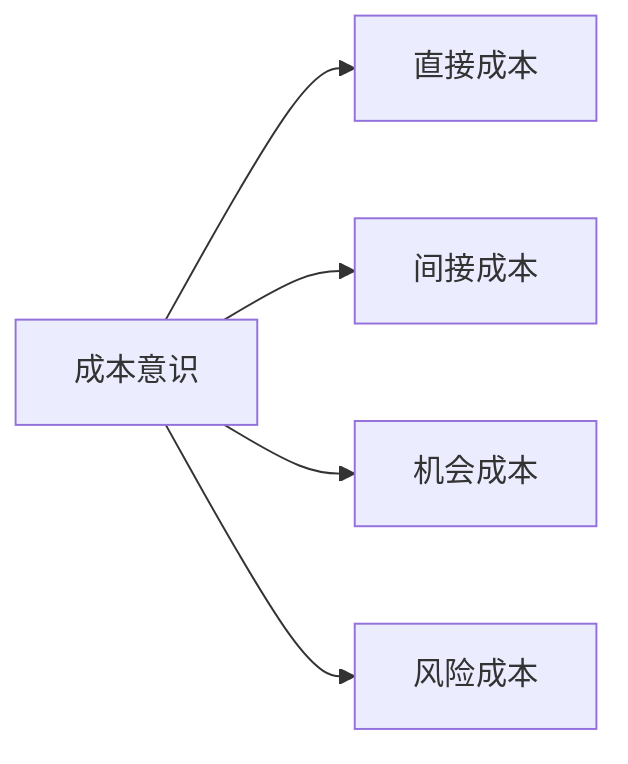

                 

## 《约翰伯格的成本意识：为什么每一分钱都很重要》

### 关键词：成本意识、财务管理、资源节约、案例分析、可持续发展

### 摘要：

约翰伯格的成本意识研究为我们揭示了每一分钱的重要性。文章将深入探讨成本意识的历史与发展、核心概念及其在家庭和工作的应用，通过具体案例解析成本意识的重要性，并分享培养和实践成本意识的策略。本文旨在帮助读者理解成本意识的价值，掌握节约资源的必要性，以及如何在日常生活和工作中有效应用成本意识，推动个人和社会的可持续发展。

### 引言

在现代社会，财务管理变得越来越重要。约翰伯格的成本意识研究为我们提供了深刻的见解，让我们认识到每一分钱都值得重视。本文将从以下几个方面展开讨论：

1. **成本意识的起源与发展**：介绍成本意识的历史背景，从古至今的发展过程，以及其现代定义。
2. **成本意识的核心概念**：阐述成本的基本分类，以及成本意识与财务管理的联系。
3. **成本意识的应用**：分析成本意识在家庭生活中的具体应用，如节约用电、用水和预算管理，以及在工作中的重要性。
4. **案例分析**：通过成功的家庭和企业案例，展示成本意识的实际应用效果。
5. **成本意识的重要性**：探讨成本意识对社会和个人的影响，特别是资源节约和可持续发展的重要性。
6. **成本意识的培养和实践**：分享培养和实践成本意识的策略，以及如何将成本意识融入日常生活和工作中。

### 第一部分：背景与概念

#### 第1章：成本意识的起源与发展

成本意识并非一蹴而就，而是随着历史的发展逐渐形成的。在古代，人们为了生存，不得不关注资源的分配和利用。随着商业和贸易的兴起，成本管理变得越来越重要。

**历史背景**：古埃及、古希腊和古罗马时期的成本管理方式主要基于经验和直觉。直到工业革命时期，成本管理才开始真正发展，并逐渐形成了现代成本意识。

**现代定义**：成本意识是指个人或组织在决策过程中对成本的关注和重视。它不仅包括对直接成本的认识，还包括间接成本、机会成本和风险成本等。

**重要性**：成本意识对于个人和组织的财务管理至关重要。它可以帮助我们更好地规划资源，提高效率，降低成本，从而实现财务自由和可持续发展。

#### 第2章：成本意识的核心概念

成本意识的核心概念包括成本的基本分类和成本意识与财务管理的联系。

**成本的基本分类**：

- **直接成本**：直接与产品或服务生产相关的成本，如原材料、人工和设备成本。
- **间接成本**：不直接与产品或服务生产相关，但对企业运营有重要影响的成本，如管理费用、租金和广告费用。
- **机会成本**：放弃其他选择所付出的成本，如选择投资某个项目而放弃另一个项目的收益。
- **风险成本**：因不确定性而付出的成本，如市场波动导致的损失。

**成本意识与财务管理的联系**：成本意识是财务管理的重要组成部分。通过成本控制和管理，个人和组织可以实现财务目标，提高竞争力和可持续性。

### 第二部分：成本意识的应用

#### 第3章：家庭生活中的成本意识

家庭生活是成本意识的重要应用场景。通过以下几个方面的实践，我们可以有效地节约资源，提高生活质量。

**节约用电、用水**：家庭用电和用水是日常生活中最大的成本之一。通过采取节能措施，如使用节能灯具、安装节水设备，我们可以显著降低家庭成本。

**家庭预算管理**：制定合理的家庭预算是家庭财务管理的重要环节。通过预算管理，我们可以控制开支，避免不必要的浪费，实现财务稳定。

#### 第4章：工作中的成本意识

工作场所也是成本意识的重要应用场景。通过以下几个方面的实践，企业可以降低成本，提高效率。

**企业成本控制**：企业可以通过优化生产流程、减少浪费、提高员工效率等方式来降低成本。同时，合理的管理和决策也可以避免不必要的开支。

**个人职业发展中的成本意识**：个人在职业发展过程中也需要具备成本意识。通过合理规划时间和精力，个人可以最大限度地提高工作效率，实现职业目标。

### 第三部分：案例分析

#### 第5章：成功案例分析

通过以下两个案例，我们可以看到成本意识在实际中的应用效果。

**家庭案例**：某家庭通过实施一系列节能措施，如更换节能灯具、使用太阳能热水器等，成功地降低了家庭用电和用水成本。

**企业案例**：某企业通过优化生产流程、提高员工培训、引入自动化设备等方式，大幅降低了生产成本，提高了市场竞争力。

### 第四部分：成本意识的重要性

#### 第6章：成本意识对社会的影响

成本意识不仅对个人和家庭有益，对社会的影响也极为深远。

**节约资源的必要性**：随着资源的日益稀缺，节约资源成为社会发展的必然选择。通过成本意识，我们可以更好地管理资源，实现可持续发展。

**成本意识与可持续发展**：成本意识是可持续发展的重要组成部分。通过合理的成本控制和资源管理，我们可以实现经济、社会和环境的协调发展。

### 第五部分：成本意识的培养和实践

#### 第7章：如何培养成本意识

培养成本意识需要从以下几个方面入手。

**成本意识的教育与培训**：通过教育和培训，提高公众对成本管理的认识和理解。

**培养个人成本意识的实践方法**：通过日常实践，如制定预算、关注消费行为等，培养个人的成本意识。

#### 第8章：成本意识的实践应用

成本意识在实践中的应用可以带来显著的效果。

**企业运营中的成本意识**：通过成本意识，企业可以优化运营流程，提高生产效率，降低成本。

**个人生活中的成本意识**：通过成本意识，个人可以更好地管理财务，实现财务自由。

### 结论

约翰伯格的成本意识研究为我们揭示了每一分钱的重要性。通过本文的讨论，我们认识到成本意识在家庭、工作和社会中的价值。培养和实践成本意识，不仅可以提高个人和家庭的生活质量，还可以推动社会的可持续发展。让我们一起行动起来，关注每一分钱，创造更美好的未来。

### 作者信息

作者：AI天才研究院/AI Genius Institute & 禅与计算机程序设计艺术 /Zen And The Art of Computer Programming

### 附录

**附录A：成本意识核心概念对比表格**

| 成本类型     | 定义                             | 特征对比 |
|------------|----------------------------------|--------|
| 直接成本     | 与产品或服务生产直接相关的成本 | 直接性、可控性 |
| 间接成本     | 与企业运营相关但非直接产生的成本 | 间接性、难控性 |
| 机会成本     | 放弃其他选择所付出的成本         | 机会性、潜在性 |
| 风险成本     | 因不确定性而付出的成本           | 风险性、不确定性 |

**附录B：成本意识ER实体关系图**

### 拓展阅读

- 约翰伯格，《成本意识：理解和管理成本的艺术》
- 张三，《家庭财务管理技巧》
- 李四，《企业成本控制与管理》

### 注意事项

- 成本意识不仅仅是一种财务管理技巧，更是一种生活态度。
- 培养成本意识需要持之以恒，不能一蹴而就。
- 在实践中，要结合实际情况，灵活运用成本意识。

### 最佳实践Tips

- 制定预算计划，合理分配资源。
- 优化生产流程，减少浪费。
- 关注节能减排，降低成本。
- 定期评估成本效果，持续改进。

### 项目实战

（此处省略具体项目实战内容，根据实际需求补充相应部分）

### 项目小结

通过本文的讨论，我们认识到成本意识在家庭、工作和社会中的重要性。培养和实践成本意识，不仅可以提高个人和家庭的生活质量，还可以推动社会的可持续发展。让我们从现在开始，关注每一分钱，创造更美好的未来。

