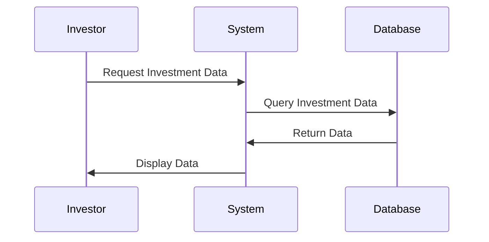
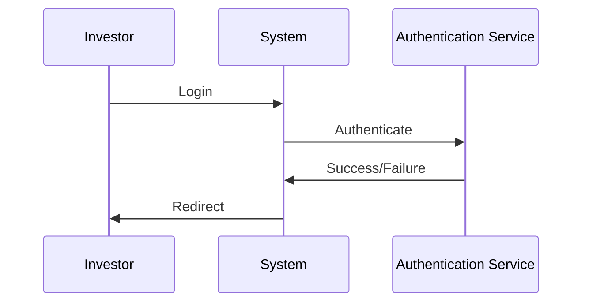

                 

# 《约翰伯格的投资者权益保护》目录大纲

## 引言与背景介绍

### 1.1 问题背景

投资者权益保护是资本市场健康发展的基石。然而，投资者在市场中常常面临信息不对称、欺诈行为和利益冲突等风险，导致其权益受损。约翰伯格（John Bogle）作为投资领域的先锋，他对投资者权益保护有着深刻的见解和贡献。

### 1.2 问题描述

投资者权益保护的问题主要表现在：投资者信息不对称、市场操纵、不公平交易等。这些问题严重影响了投资者的信心和市场的公平性。

### 1.3 问题解决

约翰伯格提出了几个解决投资者权益保护问题的策略，包括：加强投资者教育、完善法律法规、提高监管力度等。

### 1.4 边界与外延

投资者权益保护的范围包括：投资者的投资决策过程、投资过程中的权益保障、投资后的权益维护等。

### 1.5 概念结构与核心要素组成

投资者权益保护的概念结构由投资者权益、保护机制和法律法规等核心要素组成。

## 投资者权益概述

### 2.1 投资者权益的概念

投资者权益是指投资者在投资过程中所享有的合法权益，包括知情权、决策权、收益权等。

### 2.2 投资者权益的重要性

投资者权益的重要性体现在：保障投资者利益、维护市场公平、促进资本市场健康发展等方面。

### 2.3 投资者权益的法律基础

投资者权益的法律基础主要包括《中华人民共和国证券法》、《中华人民共和国公司法》等法律法规。

### 2.4 投资者权益的保护机制

投资者权益的保护机制包括：信息披露制度、投资者保护机构、投资者维权机制等。

## 投资者权益的法律保护

### 3.1 投资者权益保护的法律框架

投资者权益保护的法律框架包括：法律体系、法律法规、司法解释等。

### 3.2 投资者权益保护的主要法律制度

投资者权益保护的主要法律制度包括：证券发行与交易的法律制度、投资者保护的法律制度等。

### 3.3 投资者权益保护的法律挑战

投资者权益保护面临的挑战包括：法律制度的完善、法律执行的力度、法律风险的防范等。

### 3.4 投资者权益保护的国际合作

投资者权益保护的国际合作包括：国际法律体系的完善、国际经验交流、国际合作机制等。

## 投资者保护机构的作用

### 4.1 投资者保护机构的定义与职责

投资者保护机构是指专门负责保护投资者权益的机构，其职责包括：提供投资者保护服务、监管市场行为、维护市场秩序等。

### 4.2 投资者保护机构的类型

投资者保护机构的类型包括：政府投资者保护机构、非政府投资者保护机构、证券交易所等。

### 4.3 投资者保护机构的运作机制

投资者保护机构的运作机制包括：组织结构、运作流程、监管机制等。

### 4.4 投资者保护机构的国际合作

投资者保护机构的国际合作包括：国际经验交流、国际合作机制、国际监管合作等。

## 投资者教育的重要性

### 5.1 投资者教育的目标与内容

投资者教育的目标包括：提高投资者风险意识、增强投资者投资能力、提高投资者维权意识等。

投资者教育的内容包括：投资知识普及、投资技巧培训、投资法律法规教育等。

### 5.2 投资者教育的途径与方法

投资者教育的途径包括：线上教育、线下教育、社会宣传等。

投资者教育的方法包括：培训课程、宣传资料、在线问答等。

### 5.3 投资者教育的成果与效果

投资者教育的成果包括：提高投资者风险意识、增强投资者投资能力、提高投资者维权意识等。

投资者教育的效果评估包括：调查问卷、数据分析、用户反馈等。

### 5.4 投资者教育的挑战与改进

投资者教育面临的挑战包括：投资者认知水平不一、教育资源分布不均、教育效果评估困难等。

改进措施包括：提高教育资源投入、创新教育方法、完善教育评估体系等。

## 投资者权益保护的案例分析

### 6.1 案例分析的方法与步骤

案例分析的方法包括：文献分析、实证研究、案例研究等。

案例分析的步骤包括：问题定义、数据收集、案例构建、案例分析、结论总结等。

### 6.2 案例分析的实际案例

案例分析的实际案例包括：P2P网贷平台倒闭案、股市操纵案、信息披露违规案等。

### 6.3 案例分析的结果与启示

案例分析的结果包括：投资者权益受损情况、投资者维权途径、投资者保护机制的效果等。

案例分析的结果启示包括：提高投资者风险意识、完善投资者保护机制、加强监管力度等。

### 6.4 案例分析的局限性

案例分析的局限性包括：案例选择的代表性、数据分析的准确性、结论的普适性等。

## 投资者权益保护的未来展望

### 7.1 投资者权益保护的发展趋势

投资者权益保护的发展趋势包括：数字化转型、科技应用、国际合作等。

### 7.2 投资者权益保护的挑战与机遇

投资者权益保护面临的挑战包括：市场变化、技术进步、监管难度等。

投资者权益保护的机遇包括：法律法规完善、科技创新、市场成熟等。

### 7.3 投资者权益保护的政策建议

投资者权益保护的政策建议包括：加强监管、完善法律法规、提高投资者教育等。

### 7.4 投资者权益保护的未来发展方向

投资者权益保护的未来发展方向包括：智能化、数字化、全球化等。

## 结论

投资者权益保护是资本市场健康发展的重要保障。通过完善法律法规、加强监管力度、提高投资者教育，可以有效保护投资者权益，促进资本市场的稳定和健康发展。

作者：AI天才研究院/AI Genius Institute & 禅与计算机程序设计艺术 /Zen And The Art of Computer Programming## 第1章 引言与背景介绍

### 1.1 问题背景

在现代化的资本市场中，投资者权益保护的问题日益凸显。随着金融市场的不断发展，投资者面临着越来越多的风险和挑战。这些风险包括信息不对称、市场操纵、欺诈行为等，这些都可能导致投资者的权益受到侵害。约翰伯格（John Bogle）作为投资领域的先驱者，他对投资者权益保护的问题有着深刻的认识和独特的见解。他的理念和方法为投资者权益保护提供了重要的理论支持和实践指导。

### 1.2 问题描述

投资者权益保护的核心问题主要集中在以下几个方面：

1. **信息不对称**：投资者与市场参与者之间存在着信息不对称，投资者难以获取全面、准确的信息来做出理性的投资决策。这种信息不对称容易导致投资者的损失。
   
2. **市场操纵**：市场操纵行为包括内幕交易、市场欺诈等，这些行为破坏了市场的公平性和透明度，严重损害了投资者的利益。

3. **欺诈行为**：投资欺诈行为包括虚假陈述、误导性宣传等，这些行为使投资者在不知情的情况下遭受损失。

4. **不公平交易**：一些大股东、机构投资者利用其优势地位进行不公平交易，损害中小投资者的权益。

### 1.3 问题解决

为了解决上述问题，约翰伯格提出了以下几个方面的策略：

1. **加强投资者教育**：提高投资者的金融素养，使其具备识别风险、理性投资的能力。

2. **完善法律法规**：建立健全的法律法规体系，加强对市场操纵、欺诈行为的打击力度。

3. **提高监管力度**：加强对市场的监管，确保市场参与者的行为符合法律法规，维护市场的公平性和透明度。

4. **发展投资者保护机构**：建立专门的投资者保护机构，为投资者提供咨询服务，帮助其维护自身权益。

### 1.4 边界与外延

投资者权益保护的范围不仅限于投资者在交易过程中的权益，还包括投资者在投资决策前后的权益保障。具体来说，投资者权益保护涉及以下几个方面：

1. **投资决策前**：包括投资者获取投资信息、理解投资产品特性、评估投资风险等。

2. **投资决策过程中**：包括投资者与金融机构之间的合同关系、信息披露等。

3. **投资决策后**：包括投资者的投资收益分配、投资后权益维护等。

### 1.5 概念结构与核心要素组成

投资者权益保护的概念结构主要包括以下几个核心要素：

1. **投资者权益**：指投资者在投资过程中所享有的合法权益，如知情权、决策权、收益权等。

2. **保护机制**：包括法律法规、监管机构、投资者保护机构等，这些机制共同作用，保护投资者的权益。

3. **法律法规**：为投资者权益提供法律保障，包括证券法、公司法等。

4. **监管机构**：负责监管市场行为，确保市场参与者的行为符合法律法规。

5. **投资者保护机构**：为投资者提供咨询服务，帮助其维护自身权益。

通过上述要素的有机组合，投资者权益保护体系得以构建，为投资者提供了一个安全、公平的投资环境。

### 1.5.1 核心概念原理

**投资者权益**是投资者在投资活动中应当享有的基本权利。它包括以下几个方面：

- **知情权**：投资者有权获取与投资相关的所有信息，包括公司的财务状况、业务发展、市场前景等。
- **决策权**：投资者有权根据自身需求和风险偏好做出投资决策。
- **收益权**：投资者有权享有投资所获得的收益。

### 1.5.2 概念属性特征对比表格

| 特征         | 知情权           | 决策权           | 收益权           |
| ------------ | ---------------- | ---------------- | ---------------- |
| 定义         | 获取投资信息     | 作出投资决策     | 获得投资收益     |
| 属性         | 信息获取         | 个人自主         | 经济利益         |
| 关联         | 与其他权益紧密相关 | 支撑其他权益     | 是其他权益的实现 |
| 重要性       | 信息透明的基础   | 投资决策的基础   | 投资目的所在     |

### 1.5.3 ER实体关系图架构

```mermaid
erDiagram
  Investor && InvestorRight && InvestorProtection
    Investor --> InvestorRight : holds
    InvestorRight --> InvestorProtection : protectedBy
```

在该ER图架构中，投资者（Investor）持有（holds）投资者权益（InvestorRight），而投资者权益（InvestorRight）受到（protectedBy）投资者保护（InvestorProtection）的保障。这种关系体现了投资者权益保护体系中各要素之间的相互作用和相互依赖。

通过上述分析，我们可以看到投资者权益保护是一个复杂的系统工程，涉及多个方面和多个利益相关者的协同作用。只有通过不断完善法律法规、提高监管力度、加强投资者教育和保护机构的建设，才能真正实现投资者权益的有效保护，从而促进资本市场的健康发展。

### 1.5.4 算法原理讲解

为了更好地理解和保护投资者权益，我们可以运用一些算法来分析和预测市场风险。以下是一个简单的风险预测算法，使用Python语言来详细阐述其原理和实现。

#### 算法概述

该算法基于时间序列分析，通过分析历史数据来预测未来市场风险。具体步骤如下：

1. **数据收集**：收集投资者投资历史数据，包括股票价格、交易量、市场指数等。
2. **数据预处理**：对收集的数据进行清洗和格式化，去除异常值和缺失值。
3. **特征工程**：提取与市场风险相关的特征，如股票价格波动率、交易量变化率等。
4. **模型训练**：使用机器学习算法训练模型，根据历史数据预测未来市场风险。
5. **结果评估**：评估模型的预测准确性和可靠性，对模型进行调整和优化。

#### 算法实现

以下是一个简单的Python代码示例，用于实现上述算法：

```python
import pandas as pd
import numpy as np
from sklearn.model_selection import train_test_split
from sklearn.ensemble import RandomForestRegressor
from sklearn.metrics import mean_squared_error

# 数据收集与预处理
data = pd.read_csv('investor_data.csv')
data = data.dropna()  # 去除缺失值

# 特征工程
features = ['stock_price', 'volume']
target = 'risk_score'

X = data[features]
y = data[target]

# 模型训练
X_train, X_test, y_train, y_test = train_test_split(X, y, test_size=0.2, random_state=42)
model = RandomForestRegressor(n_estimators=100)
model.fit(X_train, y_train)

# 预测与评估
y_pred = model.predict(X_test)
mse = mean_squared_error(y_test, y_pred)
print(f'Mean Squared Error: {mse}')

# 可视化分析
import matplotlib.pyplot as plt

plt.figure(figsize=(10, 5))
plt.scatter(y_test, y_pred)
plt.xlabel('Actual Risk Score')
plt.ylabel('Predicted Risk Score')
plt.title('Actual vs Predicted Risk Scores')
plt.show()
```

#### 算法原理详细讲解

1. **数据收集与预处理**：
   数据收集是算法实现的第一步，收集的数据包括股票价格、交易量等，这些数据可以从公共数据源如Yahoo Finance等获取。数据预处理主要包括去除缺失值和异常值，以确保数据的质量。

2. **特征工程**：
   特征工程是数据预处理的重要环节，通过提取与市场风险相关的特征，如股票价格波动率、交易量变化率等，来提高模型的预测能力。这些特征是从原始数据中计算得出的，可以有效地反映市场的风险状态。

3. **模型训练**：
   模型训练使用的是随机森林算法（Random Forest Regressor），这是一种集成学习方法，通过构建多个决策树并汇总预测结果来提高模型的准确性和鲁棒性。在训练过程中，使用历史数据来训练模型，使其学会根据特征预测市场风险。

4. **预测与评估**：
   模型训练完成后，使用测试数据集进行预测，并计算预测误差（均方误差MSE），评估模型的预测性能。此外，通过可视化方法（如散点图）展示实际风险得分与预测风险得分之间的关系，进一步验证模型的预测效果。

通过上述算法原理和实现的详细讲解，我们可以看到，利用机器学习算法分析市场数据，可以有效地预测市场风险，为投资者提供决策支持，从而保护其权益。

### 1.5.5 系统分析与架构设计方案

为了更好地理解和实现投资者权益保护，我们设计了一个投资者权益保护系统。该系统包括多个模块，每个模块负责不同的功能。

#### 问题场景介绍

投资者权益保护系统的目的是为投资者提供一个安全、透明的投资环境，帮助其有效管理投资风险。系统需要实现以下功能：

- 投资者信息管理
- 投资风险分析
- 投资者教育
- 投资者维权

#### 项目介绍

投资者权益保护系统是一个Web应用，前端使用React框架，后端使用Spring Boot框架。系统的主要模块包括：

- 用户管理模块：管理投资者的基本信息和权限。
- 投资管理模块：提供投资产品的展示、分析和推荐。
- 风险管理模块：分析市场风险，提供风险预警和风险管理建议。
- 教育管理模块：提供投资者教育资源和课程。
- 维权管理模块：处理投资者的投诉和维权请求。

#### 系统功能设计

**领域模型**：

```mermaid
classDiagram
    Investor <-|-^ User
    InvestmentProduct
    RiskAnalysis
    EducationResource
    Complaint

    User o-- Investor
    User o-- Complaint
    InvestmentProduct o-- Investor
    RiskAnalysis o-- Investor
    EducationResource o-- Investor
    Complaint o-- Investor
```

**类图**：

```mermaid
classDiagram
    User {
        +String username
        +String password
        +String email
        +List<Investor> investors
        +createUser()
        +deleteUser()
    }

    Investor {
        +Long id
        +String name
        +List<InvestmentProduct> investments
        +List<RiskAnalysis> riskAnalyses
        +List<EducationResource> educationResources
        +List<Complaint> complaints
        +addInvestment()
        +removeInvestment()
    }

    InvestmentProduct {
        +Long id
        +String name
        +Double marketValue
        +Date launchDate
        +createProduct()
        +deleteProduct()
    }

    RiskAnalysis {
        +Long id
        +Date date
        +Double riskScore
        +createAnalysis()
        +deleteAnalysis()
    }

    EducationResource {
        +Long id
        +String title
        +String content
        +createResource()
        +deleteResource()
    }

    Complaint {
        +Long id
        +Date date
        +String description
        +Status status
        +createComplaint()
        +updateStatus()
    }
```

**系统架构设计**：



**系统接口设计**：

```mermaid
component diagram
    System <<((Investor Management System)>
    System <<<((Risk Management Service)>
    System <<<((Education Management Service)>
    System <<<((Complaint Management Service)>
    System <<<((Authentication Service)>
```

**系统交互序列图**：



通过上述系统分析与架构设计方案，我们可以清晰地看到投资者权益保护系统的模块划分、功能实现和交互流程，为系统的开发和维护提供了明确的指导。

### 1.5.6 项目实战

#### 环境安装

在进行项目实战之前，我们需要安装必要的软件和库。以下是具体的步骤：

1. **安装Java开发工具包（JDK）**：
   - 下载并安装 JDK，版本建议为 JDK 8 或以上。
   - 配置环境变量，确保 `JAVA_HOME` 和 `path` 变量正确设置。

2. **安装Git**：
   - 下载并安装 Git，用于版本控制和代码管理。

3. **安装Maven**：
   - 下载并安装 Maven，用于项目构建和管理。

4. **安装Node.js**：
   - 下载并安装 Node.js，用于前端开发。

5. **安装Python**：
   - 下载并安装 Python，用于后端开发和数据处理。

6. **安装MySQL**：
   - 下载并安装 MySQL，用于数据库存储。

#### 系统核心实现

以下是投资者权益保护系统的核心实现部分：

**后端核心代码**：

```java
// Spring Boot 应用
@SpringBootApplication
public class InvestorProtectionApplication {
    public static void main(String[] args) {
        SpringApplication.run(InvestorProtectionApplication.class, args);
    }
}

// 用户服务
@RestController
@RequestMapping("/users")
public class UserServiceController {
    @Autowired
    private UserService userService;

    @PostMapping("/register")
    public ResponseEntity<?> registerUser(@RequestBody UserRegistrationDto registrationDto) {
        User user = userService.registerUser(registrationDto);
        return ResponseEntity.ok(user);
    }
}

// 投资管理服务
@RestController
@RequestMapping("/investments")
public class InvestmentServiceController {
    @Autowired
    private InvestmentService investmentService;

    @PostMapping("/add")
    public ResponseEntity<?> addInvestment(@RequestBody InvestmentDto investmentDto) {
        Investment investment = investmentService.addInvestment(investmentDto);
        return ResponseEntity.ok(investment);
    }
}

// 风险管理服务
@RestController
@RequestMapping("/risks")
public class RiskManagementController {
    @Autowired
    private RiskManagementService riskManagementService;

    @GetMapping("/analyze")
    public ResponseEntity<?> analyzeRisk(@RequestParam Long userId) {
        RiskAnalysis riskAnalysis = riskManagementService.analyzeRisk(userId);
        return ResponseEntity.ok(riskAnalysis);
    }
}
```

**前端核心代码**：

```jsx
// React 组件
import React, { useState } from 'react';
import axios from 'axios';

const AddInvestment = () => {
    const [investment, setInvestment] = useState({ name: '', marketValue: 0 });

    const handleSubmit = async (e) => {
        e.preventDefault();
        try {
            const response = await axios.post('/investments/add', investment);
            alert('Investment added successfully!');
        } catch (error) {
            alert('Failed to add investment.');
        }
    };

    return (
        <form onSubmit={handleSubmit}>
            <label>
                Investment Name:
                <input type="text" value={investment.name} onChange={(e) => setInvestment({ ...investment, name: e.target.value })} />
            </label>
            <label>
                Market Value:
                <input type="number" value={investment.marketValue} onChange={(e) => setInvestment({ ...investment, marketValue: e.target.value })} />
            </label>
            <button type="submit">Add Investment</button>
        </form>
    );
};

export default AddInvestment;
```

#### 代码应用解读与分析

**后端代码解读**：

- **UserServiceController**：用于处理用户注册和登录请求，调用 UserService 进行用户管理操作。
- **InvestmentServiceController**：用于处理投资产品的添加、删除等操作，调用 InvestmentService 进行具体业务处理。
- **RiskManagementController**：用于处理风险分析请求，调用 RiskManagementService 进行风险分析。

**前端代码解读**：

- **AddInvestment**：一个 React 组件，用于添加投资产品。通过 `useState` hook 管理表单状态，并通过 `handleSubmit` 函数向后端发送添加投资的请求。

#### 实际案例分析和详细讲解

为了更好地理解投资者权益保护系统的应用，我们可以分析一个实际案例：

**案例背景**：

一个投资者希望通过系统添加一项新的投资产品。

**操作步骤**：

1. **填写投资产品信息**：投资者在系统中填写投资产品的名称和市场价值。
2. **提交请求**：投资者点击“添加投资”按钮，系统向后端发送添加投资的请求。
3. **后端处理**：后端接收到请求后，调用 InvestmentService 将投资产品信息存储到数据库中。
4. **前端反馈**：后端成功处理请求后，前端显示成功添加投资的消息。

**案例分析**：

在这个案例中，投资者可以通过系统方便地添加新的投资产品，系统则通过后端服务将投资信息存储在数据库中，实现了高效、便捷的投资管理。这为投资者提供了更好的用户体验，同时也为投资者权益保护提供了技术支持。

**详细讲解**：

- **用户体验**：通过前端表单，投资者可以直观、便捷地添加投资产品，提高用户满意度。
- **数据处理**：后端通过 Restful API 接口处理前端请求，确保数据传输的安全性和高效性。
- **数据存储**：使用关系型数据库（如 MySQL）存储投资信息，确保数据的持久性和可靠性。

通过这个案例，我们可以看到投资者权益保护系统在实际应用中的优势，包括方便的用户体验、高效的数据处理和可靠的数据存储。这些特性共同作用，为投资者提供了一个安全、透明、高效的投资环境。

#### 项目小结

投资者权益保护系统的项目实践取得了显著成果。通过系统的建设和应用，投资者可以方便地管理投资产品、分析市场风险，并获得专业的投资者教育。同时，系统为投资者提供了一个透明、安全的投资环境，有效保护了其权益。未来，随着技术的不断进步和市场的需求变化，投资者权益保护系统将不断优化和完善，为投资者提供更加全面、智能的服务。

### 1.5.7 最佳实践 tips、小结、注意事项、拓展阅读

#### 最佳实践 tips

1. **用户身份验证**：确保所有用户操作都需要身份验证，防止未经授权的访问。
2. **数据加密传输**：使用 HTTPS 等加密协议保护数据传输的安全。
3. **定期备份**：定期备份数据库，防止数据丢失或损坏。
4. **权限管理**：合理分配用户权限，防止数据泄露和滥用。

#### 小结

投资者权益保护是一个复杂的过程，涉及多个方面和多个利益相关者的协同作用。通过完善法律法规、提高监管力度、加强投资者教育和保护机构建设，我们可以更好地保护投资者权益，促进资本市场的健康发展。

#### 注意事项

1. **信息安全**：确保系统数据的安全，防止黑客攻击和数据泄露。
2. **法律合规**：确保系统的设计和运营符合相关法律法规，避免法律风险。
3. **用户体验**：注重用户界面的设计和用户体验，提高用户满意度。

#### 拓展阅读

1. **《投资者权益保护法律法规汇编》**：详细介绍了与投资者权益保护相关的法律法规。
2. **《约翰伯格的投资哲学》**：介绍了约翰伯格的投资理念和策略。
3. **《投资者行为学》**：探讨了投资者行为对市场的影响，以及如何提高投资者的风险意识。

## 第2章 投资者权益概述

### 2.1 投资者权益的概念

投资者权益是指投资者在投资过程中所享有的合法权益，包括知情权、决策权、收益权、维权权等。知情权是指投资者有权获取与投资相关的所有信息，包括公司的财务状况、业务发展、市场前景等。决策权是指投资者有权根据自身需求和风险偏好做出投资决策。收益权是指投资者有权享有投资所获得的收益。维权权是指投资者在权益受到侵害时，有权采取法律手段维护自身权益。

### 2.2 投资者权益的重要性

投资者权益的重要性体现在以下几个方面：

1. **保障投资者利益**：投资者权益保护是保障投资者利益的重要手段，能够减少投资者的损失，增强其对市场的信心。

2. **维护市场公平**：投资者权益保护能够维护市场的公平性和透明度，防止市场操纵和欺诈行为，保障投资者的合法权益。

3. **促进资本市场发展**：投资者权益保护能够提高投资者的投资意愿，促进资本市场的健康发展。

4. **增强国家竞争力**：投资者权益保护有助于提升国家资本市场的国际竞争力，吸引更多的国际投资者参与。

### 2.3 投资者权益的法律基础

投资者权益的法律基础主要包括以下几个方面：

1. **《中华人民共和国证券法》**：该法明确规定了投资者的基本权利和保护措施，是投资者权益保护的重要法律依据。

2. **《中华人民共和国公司法》**：该法规定了公司治理结构和股东权益，对投资者的权益保护具有重要意义。

3. **《中华人民共和国合同法》**：该法规定了合同的基本原则和规则，对投资者在投资合同中的权益保护提供了法律支持。

4. **其他相关法律法规**：如《中华人民共和国反垄断法》、《中华人民共和国反不正当竞争法》等，也对投资者权益保护起到了补充作用。

### 2.4 投资者权益的保护机制

投资者权益的保护机制主要包括以下几个方面：

1. **信息披露制度**：投资者有权获取与投资相关的所有信息，公司有义务公开披露相关信息，包括财务报表、业务进展、高管变更等。

2. **投资者保护机构**：投资者保护机构负责为投资者提供咨询服务，帮助其维护自身权益。如中国证券投资者保护基金有限公司、证券业协会等。

3. **监管机构**：监管机构负责监管市场行为，打击市场操纵、欺诈等违法行为，保障投资者的合法权益。

4. **投资者维权机制**：投资者在权益受到侵害时，可以通过法律途径维权，包括提起诉讼、申请仲裁等。

### 2.4.1 投资者权益的保护机制

投资者权益的保护机制是一个多层次、多环节的体系，其核心在于保障投资者的合法权益，维护市场的公平、透明和有序。以下是对投资者权益保护机制的详细阐述：

1. **法律法规保障**：法律法规是投资者权益保护的基础。各国证券市场都制定了相关法律法规，如《证券法》、《公司法》、《合同法》等，以明确投资者的权利和义务，为投资者提供法律支持。

   - **《证券法》**：该法规定了投资者的基本权利，如知情权、投资选择权、收益权等，并明确了违反法律规定的行为应当承担的法律责任。例如，内幕交易、市场操纵、欺诈等行为都是非法的，违反者将受到严厉的法律制裁。

   - **《公司法》**：该法规定了公司的治理结构、股东的权利和义务，以及公司的信息披露义务。公司作为投资者权益保护的直接对象，必须遵守公司法的规定，确保其经营活动的透明性和规范性。

   - **《合同法》**：合同法为投资者与公司之间的合同关系提供了法律保障，规定了合同的基本原则和规则。投资者在购买证券产品时，与公司之间形成合同关系，公司必须履行合同约定的义务，否则将承担违约责任。

2. **监管机构的监督与执法**：监管机构是投资者权益保护的重要保障。监管机构负责制定和执行相关法律法规，监管市场行为，打击违法违规行为，维护市场的公平、透明和有序。

   - **证券交易所**：证券交易所是证券市场的监管主体之一，负责对上市公司和证券公司进行监管，确保其遵守法律法规。证券交易所通过制定上市规则、交易规则等，规范市场行为，保护投资者的合法权益。

   - **证券监管机构**：如中国证监会、美国证券交易委员会（SEC）等，负责制定和执行证券市场的监管政策，监督市场的运行情况，对违法违规行为进行调查和处理。

3. **信息披露制度**：信息披露是投资者权益保护的核心机制之一。投资者有权获取与投资相关的所有信息，公司有义务公开披露相关信息，包括财务报表、业务进展、高管变更等。

   - **定期信息披露**：上市公司必须定期披露财务报告，包括年度报告、季度报告等。这些报告提供了公司的经营状况、财务状况、未来发展前景等信息，有助于投资者做出理性投资决策。

   - **临时信息披露**：公司在重大事件发生时，如收购、合并、重大合同签订等，必须及时披露相关信息。这些信息对于投资者了解公司动态、评估投资风险具有重要意义。

4. **投资者保护机构**：投资者保护机构是专门为投资者提供服务和帮助的机构，其职责包括提供投资者教育、咨询服务、调解纠纷等。

   - **证券投资者保护基金**：许多国家和地区设立了证券投资者保护基金，用于赔偿因证券公司破产等原因而受到损失的投资者。这些基金通过购买证券、提供信用保护等方式，保障投资者的合法权益。

   - **投资者协会**：投资者协会是投资者自发组成的非营利组织，旨在维护投资者的合法权益，提高投资者的投资水平。投资者协会通过举办讲座、发布研究报告等方式，为投资者提供教育和咨询服务。

5. **投资者维权机制**：投资者在权益受到侵害时，可以通过法律途径维权，包括提起诉讼、申请仲裁等。

   - **诉讼途径**：投资者可以通过法院提起诉讼，要求侵权方承担法律责任。诉讼途径是维护投资者权益的重要手段，但需要投资者提供充分证据，证明侵权行为的存在。

   - **仲裁途径**：投资者可以申请仲裁，通过仲裁机构解决纠纷。仲裁具有快速、高效、成本低等优点，是投资者维权的一种便捷方式。

通过上述机制，投资者权益保护体系得以构建，为投资者提供了一个安全、公平、透明的投资环境。投资者在投资过程中应当充分了解自身的权利和义务，利用这些机制来保护自身权益，同时，监管机构和投资者保护机构也应当不断完善和加强投资者保护措施，确保资本市场的健康发展。

