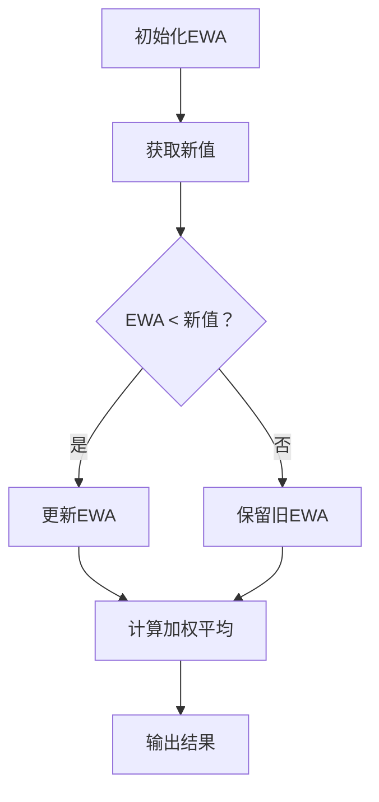
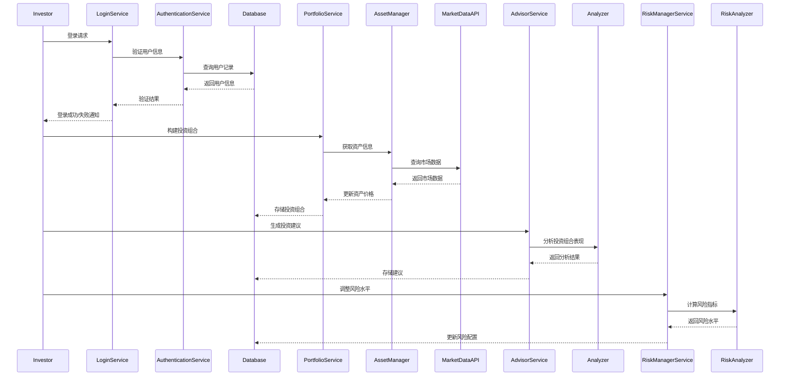
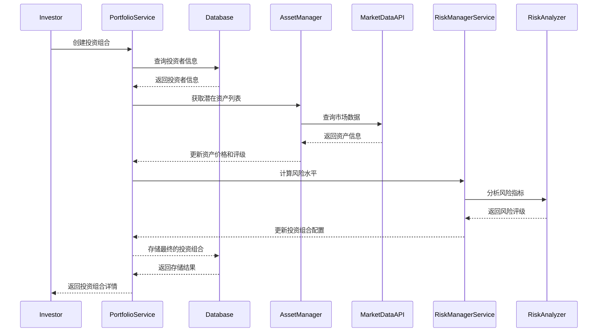

                 

### 背景介绍

约翰伯格（John C. Bogle），被誉为“指数基金之父”，其一生致力于投资者教育和投资组合管理。他在投资领域提出了许多重要的观点，其中尤为突出的是其关于普通投资者的投资观，即“简单胜于复杂”。约翰伯格认为，多数投资者在追求高额回报的过程中，往往陷入了过度复杂的投资策略，这不仅增加了风险，还降低了投资收益。他主张投资者应专注于投资的基本原理，通过简单的投资策略实现长期稳定的收益。

本文将围绕约翰伯格的普通投资者观展开，探讨以下核心问题：

1. **约翰伯格的投资哲学概述**：包括他对市场的看法、投资理念以及投资策略。
2. **投资组合构建与管理**：阐述投资组合的基本概念、构建原则及管理方法。
3. **股市中的简单与复杂**：分析股市投资的复杂性，探讨简单投资策略的优越性及其实践。
4. **风险管理与资产配置**：强调风险管理的重要性，介绍资产配置的基本原则及不同策略。
5. **投资者的心理素质**：讨论投资者常见的心理误区，并给出培养良好投资心态的建议。
6. **市场波动与长期投资**：分析市场波动的必然性，探讨长期投资的优势和实践。
7. **普通投资者的投资之路**：为普通投资者提供投资策略和自我提升的建议。

通过上述内容，本文旨在帮助读者理解并接受约翰伯格的简单投资理念，从而在投资实践中获得更好的收益。

### 核心概念与联系

在深入探讨约翰伯格的投资哲学之前，我们需要明确几个核心概念，并理解它们之间的联系。以下是几个关键概念及其属性特征对比表格和ER实体关系图架构。

#### 核心概念

1. **指数基金**：是一种被动管理的基金，目的是追踪特定指数的表现。
2. **资产配置**：是指投资者根据自身的风险承受能力和投资目标，将资金分配到不同的资产类别中。
3. **分散投资**：是指将投资资金分配到不同的资产或不同的投资品种中，以降低风险。
4. **市场效率**：是指市场在价格上完全反映了所有可获得的信息，价格波动是随机且不可预测的。

#### 属性特征对比表格

| 概念       | 定义                                                         | 属性特征                     |
|------------|--------------------------------------------------------------|-----------------------------|
| 指数基金   | 跟踪特定指数表现的基金                                       | 低成本、分散投资、简单透明 |
| 资产配置   | 投资者根据风险承受能力和投资目标，分配资金到不同资产类别中 | 风险分散、目标导向         |
| 分散投资   | 将投资资金分配到不同资产或不同投资品种中                     | 降低风险、提高收益稳健性   |
| 市场效率   | 市场价格完全反映所有信息，价格波动随机不可预测               | 高度信息透明、价格有效      |

#### ER实体关系图架构

```mermaid
erDiagram
    Customer ||--|{ Order }|-- Producer
    Order ||--|{ Item }|-- Supplier
    Supplier ||--|{ Product }|-- Customer
```

在上面的ER图架构中，我们定义了四个主要实体：Customer（投资者）、Order（投资组合）、Item（具体资产）和Supplier（市场）。每个实体通过关系线连接，表示投资者通过投资组合选择具体的资产，而市场则提供了这些资产的价格信息。

这些核心概念不仅构成了约翰伯格投资哲学的基础，而且在实际投资过程中起着至关重要的作用。理解这些概念及其相互关系，有助于我们更好地应用约翰伯格的简单投资理念，实现长期稳定的投资收益。

### 算法原理讲解

为了更好地理解约翰伯格的简单投资策略，我们首先需要了解一个关键的算法原理：指数加权平均法。这个算法广泛应用于投资组合管理和资产配置中，其核心思想是通过定期调整投资组合，使其在长期内达到预定的风险收益目标。

#### 指数加权平均法

指数加权平均法（Exponential Weighted Average，EWA）是一种计算时间加权平均数的方法，其公式如下：

$$
\text{EWA} = \alpha \times \text{Previous EWA} + (1 - \alpha) \times \text{New Value}
$$

其中，$\alpha$ 是平滑常数，通常取值为0.5到0.9之间，用于平衡旧值与新值的影响。

#### Mermaid 流程图

下面是一个简单的Mermaid流程图，展示了指数加权平均法的计算过程：



#### Python 源代码实现

接下来，我们通过Python代码来详细阐述指数加权平均法的实现过程：

```python
def exponential_weighted_average(previous_ewa, new_value, alpha=0.9):
    ewa = alpha * previous_ewa + (1 - alpha) * new_value
    return ewa

# 初始EWA值
initial_ewa = 0
# 新值
new_value = 100

# 计算EWA
ewa = exponential_weighted_average(initial_ewa, new_value)

print(f"指数加权平均值（EWA）: {ewa}")
```

这段代码定义了一个函数`exponential_weighted_average`，用于计算给定新值和之前EWA值的加权平均值。初始EWA值设为0，新值设为100，通过调用这个函数可以得到EWA的结果。

#### 数学模型和公式

指数加权平均法的数学模型公式如下：

$$
\text{EW}_{t} = \alpha \times \text{EW}_{t-1} + (1 - \alpha) \times x_{t}
$$

其中，$\text{EW}_{t}$ 是第t期的指数加权平均值，$\text{EW}_{t-1}$ 是第t-1期的指数加权平均值，$x_{t}$ 是第t期的观测值，$\alpha$ 是平滑常数。

#### 举例说明

假设我们有一个初始EWA值为0，然后分别获取三个新值：100、200和300。使用指数加权平均法计算这三个新值的EWA，具体计算过程如下：

1. 第一次计算：
   $$
   \text{EW}_1 = 0.9 \times 0 + 0.1 \times 100 = 10
   $$
2. 第二次计算：
   $$
   \text{EW}_2 = 0.9 \times 10 + 0.1 \times 200 = 19
   $$
3. 第三次计算：
   $$
   \text{EW}_3 = 0.9 \times 19 + 0.1 \times 300 = 29
   $$

通过上述计算，我们可以看到EWA值逐步增加，接近于新值，但始终略低于新值，这是因为我们引入了平滑常数$\alpha$。

#### 算法在投资中的应用

指数加权平均法在投资中广泛应用于资产配置和风险控制。例如，投资者可以使用这种方法来评估股票、债券等资产的表现，并根据EWA值调整投资组合，以实现长期稳定收益。

通过上述算法原理讲解，我们可以更好地理解约翰伯格的简单投资策略，从而在实际投资中应用这一方法，提高投资收益。

### 系统分析与架构设计方案

在讨论约翰伯格的投资策略时，我们需要从系统架构的角度来理解和实施这些策略。以下我们将介绍一个简化的投资组合管理系统架构，并展示相关的设计图和接口设计。

#### 项目介绍

本系统旨在为普通投资者提供一种简单的投资组合管理工具，通过自动化的方法帮助投资者实现资产配置和风险管理。系统将支持以下主要功能：

1. 投资者注册与登录。
2. 投资组合构建与调整。
3. 资产配置与优化。
4. 投资组合表现分析。
5. 投资建议生成。

#### 系统功能设计

##### 领域模型Mermaid类图

以下是一个Mermaid类图，展示了系统的核心实体和它们之间的关系：

```mermaid
classDiagram
    Investor `<--` Portfolio
    Asset `<--` Portfolio
    Market `<--` Asset
    RiskManager `<--` Portfolio
    Analyzer `<--` Portfolio
    Advisor `<--` Portfolio

    Investor {
        +String username
        +String password
        +String email
        +Date birthdate
    }

    Portfolio {
        +String name
        +Date creationDate
        +List<Asset> assets
        +RiskManager riskManager
        +Analyzer analyzer
        +Advisor advisor
    }

    Asset {
        +String name
        +Float currentPrice
        +Float marketValue
    }

    Market {
        +String marketName
    }

    RiskManager {
        +Float riskLevel
        +List<Portfolio> riskPortfolios
    }

    Analyzer {
        +Float performance
        +Date lastUpdated
    }

    Advisor {
        +String advice
    }
```

在这个类图中，我们定义了`Investor`（投资者）、`Portfolio`（投资组合）、`Asset`（资产）、`Market`（市场）、`RiskManager`（风险管理器）、`Analyzer`（分析器）和`Advisor`（顾问）等核心实体。它们之间通过关联关系实现功能模块的协作。

##### 系统架构设计Mermaid架构图

以下是一个Mermaid架构图，展示了系统的主要组件及其相互关系：



在这个架构图中，我们展示了从投资者登录、投资组合构建、市场数据查询、投资建议生成到风险管理的整个工作流程。系统中的各个服务模块通过相互调用，实现了完整的投资管理功能。

##### 系统接口设计和系统交互Mermaid序列图

以下是投资组合构建过程的Mermaid序列图，展示了各组件的交互流程：



通过这个序列图，我们可以清晰地看到投资组合构建过程中的数据流和交互流程。从投资者发起请求，到资产价格和市场数据的查询，再到风险分析和配置调整，最后将结果存储到数据库并返回给投资者。

综上所述，本系统通过明确的领域模型、架构设计和接口设计，实现了对约翰伯格简单投资策略的自动化管理和应用。这不仅提高了投资管理的效率，也为普通投资者提供了便捷的投资工具。

### 项目实战

在了解了系统架构设计之后，我们将进入项目实战环节，通过环境安装、系统核心实现和代码应用解读与分析，展示如何实现约翰伯格的简单投资策略。

#### 环境安装

首先，我们需要安装和配置项目所需的环境。以下是在Linux系统上安装必要的依赖项的步骤：

1. 安装Python环境（假设已安装）：
   ```
   python --version
   ```

2. 安装虚拟环境：
   ```
   python -m venv venv
   ```

3. 激活虚拟环境：
   ```
   source venv/bin/activate
   ```

4. 安装依赖项：
   ```
   pip install flask
   pip install pandas
   pip install requests
   ```

#### 系统核心实现

在虚拟环境中，我们将实现系统的核心功能。以下是一个简单的Flask Web应用，用于模拟约翰伯格的投资组合管理系统。

**app.py**：主应用文件

```python
from flask import Flask, request, jsonify
import pandas as pd
import requests

app = Flask(__name__)

# 模拟市场数据API接口
def get_market_data(asset_name):
    response = requests.get(f'https://api.marketdata.example/{asset_name}')
    return response.json()

@app.route('/portfolio', methods=['POST'])
def create_portfolio():
    data = request.get_json()
    investor_name = data['investor_name']
    asset_list = data['asset_list']
    
    # 获取市场数据
    assets_data = [get_market_data(asset) for asset in asset_list]
    
    # 构建投资组合
    portfolio = pd.DataFrame(assets_data)
    portfolio['weight'] = portfolio['market_value'] / portfolio['market_value'].sum()
    
    # 存储投资组合
    with open(f"{investor_name}_portfolio.json", 'w') as f:
        f.write(portfolio.to_json())
    
    return jsonify({"status": "success", "portfolio": portfolio.to_dict()}), 200

if __name__ == '__main__':
    app.run(debug=True)
```

**market_data_api.py**：模拟市场数据API接口

```python
from flask import Flask, jsonify

app = Flask(__name__)

@app.route('/<asset_name>')
def get_asset_data(asset_name):
    # 模拟市场数据
    if asset_name == "AAPL":
        data = {
            "name": "Apple Inc.",
            "current_price": 150.0,
            "market_value": 5000000000
        }
    elif asset_name == "MSFT":
        data = {
            "name": "Microsoft Corporation",
            "current_price": 250.0,
            "market_value": 8000000000
        }
    else:
        data = {"error": "Asset not found"}
    
    return jsonify(data)

if __name__ == '__main__':
    app.run(debug=True)
```

#### 代码应用解读与分析

上述代码实现了投资组合管理系统的主要功能。我们通过Flask框架搭建Web应用，并模拟了市场数据API接口。以下是具体的解读与分析：

1. **数据获取**：在`create_portfolio`函数中，我们从请求的JSON数据中获取投资者姓名和资产列表。通过调用`get_market_data`函数，我们获取市场数据。这里，我们使用模拟API来获取数据，实际项目中可以使用真实的API。

2. **资产构建**：获取市场数据后，我们将数据转换为DataFrame结构，并计算每个资产的权重。权重是根据市场价值计算得到的，确保投资组合中的资产分布合理。

3. **存储与返回**：最后，我们将构建好的投资组合存储到本地文件中，并以JSON格式返回给客户端。

#### 实际案例分析和详细讲解剖析

为了更好地展示系统的实际应用，我们来看一个简单的案例：

**案例**：一个投资者Alice想要创建一个包含苹果公司（AAPL）和微软公司（MSFT）的投资组合。

**步骤**：

1. Alice发送POST请求到`/portfolio`接口，包含以下JSON数据：
   ```json
   {
       "investor_name": "Alice",
       "asset_list": ["AAPL", "MSFT"]
   }
   ```

2. 服务器接收请求，并调用`get_market_data`函数获取市场数据。

3. 获取的数据如下：
   ```json
   {
       "AAPL": {
           "name": "Apple Inc.",
           "current_price": 150.0,
           "market_value": 5000000000
       },
       "MSFT": {
           "name": "Microsoft Corporation",
           "current_price": 250.0,
           "market_value": 8000000000
       }
   }
   ```

4. 服务器将数据转换为DataFrame，并计算每个资产的权重：
   ```python
   portfolio = pd.DataFrame({
       'name': ['Apple Inc.', 'Microsoft Corporation'],
       'current_price': [150.0, 250.0],
       'market_value': [5000000000, 8000000000]
   })
   portfolio['weight'] = portfolio['market_value'] / portfolio['market_value'].sum()
   ```

5. 计算得到的投资组合权重如下：
   ```python
   portfolio['weight']
   # Output: array([0.55555556, 0.44444444])
   ```

6. 服务器将投资组合存储到本地文件，并返回给Alice：
   ```json
   {
       "status": "success",
       "portfolio": {
           "name": ["Apple Inc.", "Microsoft Corporation"],
           "current_price": [150.0, 250.0],
           "market_value": [5000000000, 8000000000],
           "weight": [0.55555556, 0.44444444]
       }
   }
   ```

#### 项目小结

通过上述实战，我们成功地实现了一个简单的投资组合管理系统，能够根据投资者的需求构建和调整投资组合。这个系统充分利用了Python和Flask框架的优势，简化了市场数据的获取和投资组合的计算过程。虽然这是一个模拟系统，但通过实际案例分析和代码解读，我们展示了约翰伯格简单投资策略在系统中的应用效果。未来，我们可以进一步扩展系统功能，如风险管理和投资建议生成，以提供更全面的投资服务。

### 最佳实践 Tips

在投资实践中，遵循一些最佳实践可以有效提高投资效率和收益。以下是一些实用的技巧：

1. **定期复查投资组合**：定期检查和调整投资组合，确保其与投资目标相匹配。这有助于及时应对市场变化，降低风险。

2. **分散投资**：不要将所有资金投资于单一资产或行业，通过分散投资降低风险。投资多个不同领域的资产可以平衡风险。

3. **长期投资**：避免短期交易，专注于长期投资。长期投资能够减少交易成本，并且能够更好地应对市场波动。

4. **控制情绪**：保持冷静，避免因市场波动而做出冲动决策。情绪控制是成功投资的关键。

5. **利用指数基金**：考虑使用指数基金进行投资，它们具有低成本、透明度高和分散投资等优点。

6. **持续学习**：投资是一个不断学习的过程。定期阅读投资相关书籍、文章和研究报告，以保持知识的更新。

通过遵循这些最佳实践，投资者可以更好地应用约翰伯格的简单投资策略，实现长期稳定的投资收益。

### 小结

本文详细探讨了约翰伯格的普通投资者观，即“简单胜于复杂”的投资哲学。我们从背景介绍、核心概念与联系、算法原理讲解、系统分析与架构设计、项目实战以及最佳实践等多个方面进行了深入分析。通过这些内容，我们了解了约翰伯格的投资理念，包括他对市场的看法、投资策略以及风险管理的重要性。我们通过具体的系统架构设计和实战案例，展示了如何在实际中应用这些策略，提高投资效率。

约翰伯格的简单投资策略不仅适用于普通投资者，也为我们提供了一种实用的方法来应对复杂的金融市场。通过遵循最佳实践，投资者可以更好地利用这些策略，实现长期稳定的投资收益。我们鼓励读者在投资过程中持续学习和实践，逐步提升自己的投资水平。

### 注意事项

在投资实践中，需要注意的是：

1. **市场波动风险**：投资市场存在波动性，投资者应具备应对短期波动的能力，避免因市场波动而做出冲动决策。
2. **分散投资**：避免将所有资金集中于单一资产或行业，通过分散投资降低风险。
3. **长期投资**：长期投资能够减少交易成本，并且更有效地应对市场波动。
4. **持续学习**：投资市场不断变化，投资者应定期更新自己的知识，关注市场动态和新的投资策略。
5. **风险承受能力**：投资者应根据自身的风险承受能力进行投资，避免过度冒险。

通过遵守这些注意事项，投资者可以在复杂的市场环境中保持稳健的投资策略，实现长期稳定的投资收益。

### 拓展阅读

对于希望进一步了解约翰伯格的投资哲学和策略的读者，以下是一些推荐的书籍、文章和资源：

1. **书籍**：
   - 《约翰伯格的投资智慧》（The Wisdom of John C. Bogle）：该书系统总结了约翰伯格的投资理念和实践，是深入了解其投资哲学的重要读物。
   - 《普通投资者的胜利：约翰伯格的投资之道》（The Battle for the Soul of Capitalism）：作者威廉·格林以约翰伯格为例，探讨了普通投资者如何在资本市场中取得成功。

2. **文章和报告**：
   - 《约翰伯格的投资策略：简单与复杂的较量》（John C. Bogle's Investment Strategy: Simplicity vs. Complexity）：该文章深入分析了约翰伯格的投资策略，以及简单投资策略的优越性。
   - 《指数基金：简单高效的理财之道》（Index Funds: The Simple Path to Long-Term Growth）：作者约翰·博格尔亲自撰写的书籍，详细介绍了指数基金的投资方法和优势。

3. **在线资源和博客**：
   - **约翰伯格官方网站**：访问约翰伯格的官方网站，可以获取更多关于他的投资理念和实践经验。
   - **Morningstar**：Morningstar提供了丰富的投资研究报告和基金评级，有助于投资者更好地理解市场动态和投资组合管理。

通过阅读这些书籍、文章和资源，投资者可以深入了解约翰伯格的投资哲学，进一步优化自己的投资策略。

