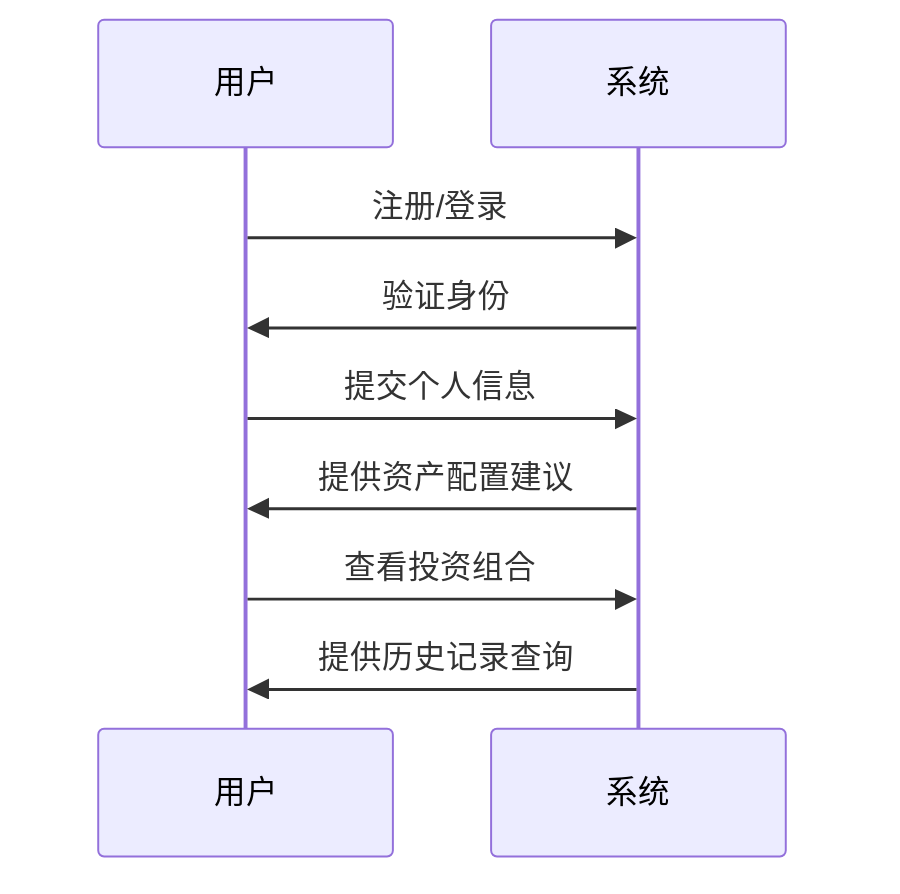
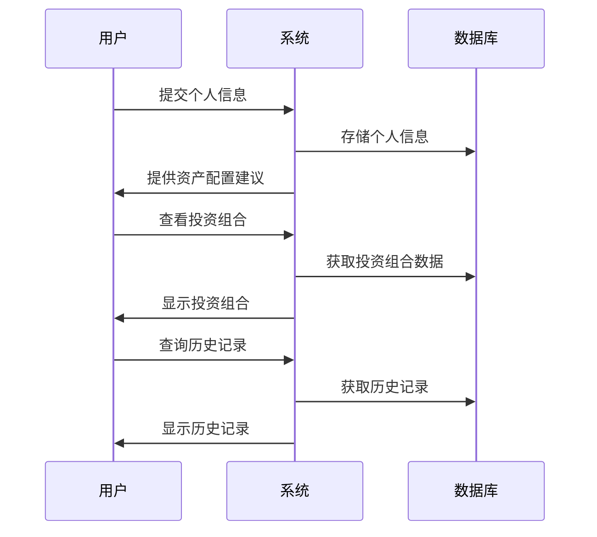

                 

# 约翰伯格的资产配置理论：平衡风险与收益

> 关键词：约翰伯格、资产配置理论、风险与收益、金融投资、策略制定

> 摘要：本文将深入探讨约翰伯格的资产配置理论，该理论旨在通过科学的方法平衡投资组合中的风险与收益。文章将首先介绍资产配置理论的背景和核心概念，然后逐步解析理论中的数学模型和算法原理，并结合实际案例进行分析，最后提出最佳实践建议，帮助读者更好地理解和应用这一理论。

## 1. 背景介绍

资产配置理论起源于20世纪初，其核心目的是通过合理分配不同资产类别的投资比例，以实现投资组合的风险与收益平衡。约翰伯格（John C. Burge）是这一理论的代表人物，他在其著作《资产配置的艺术》中详细阐述了如何通过科学的方法进行资产配置，以应对不同市场环境的变化。

### 1.1 核心概念术语说明

- **资产配置**：将投资资金分配到不同资产类别中的过程，如股票、债券、现金等。
- **风险**：投资可能遭受损失的可能性。
- **收益**：投资所带来的回报。
- **资产类别**：投资的不同形式，如股票、债券、房地产等。

### 1.2 问题背景

在投资市场中，投资者面临着多种风险，包括市场风险、信用风险、流动性风险等。为了实现收益最大化，投资者往往需要在风险与收益之间做出权衡。然而，传统的资产配置方法往往过于简单，无法充分考虑市场复杂性和个人风险偏好。

### 1.3 问题描述

约翰伯格的资产配置理论试图解决以下问题：

- **如何科学地确定不同资产类别的投资比例？**
- **如何在不同市场环境中调整资产配置策略，以实现风险与收益的平衡？**
- **如何应对市场不确定性，确保投资组合的长期稳定收益？**

### 1.4 问题解决

约翰伯格提出的资产配置理论通过以下几个步骤实现问题的解决：

- **确定个人风险承受能力**：根据投资者的风险偏好和财务状况，确定其可承受的风险水平。
- **构建资产组合**：将投资资金分配到不同资产类别中，实现多样化投资。
- **动态调整**：根据市场环境和投资目标的变化，定期调整资产配置策略。

### 1.5 边界与外延

资产配置理论不仅适用于个人投资者，也适用于机构投资者和基金经理。此外，资产配置理论不仅关注投资组合的收益，还强调投资组合的风险管理。

## 2. 核心概念与联系

### 2.1 核心概念原理

约翰伯格的资产配置理论主要依赖于以下几个核心概念：

- **预期收益**：根据历史数据和未来预测，计算不同资产类别的预期收益率。
- **风险度量**：使用标准差、贝塔系数等指标衡量不同资产类别的风险。
- **资产组合效率**：通过优化投资组合，实现最大化的预期收益或最小化的风险。

### 2.2 概念属性特征对比表格

| 概念       | 属性特征                      | 比较                 |
|------------|------------------------------|----------------------|
| 预期收益   | 根据历史和未来预测计算       | 反映资产未来收益的期望 |
| 风险度量   | 标准差、贝塔系数等指标衡量   | 评估资产风险大小     |
| 资产组合效率 | 最大化预期收益或最小化风险   | 优化投资组合策略     |

### 2.3 ER实体关系图架构

```mermaid
erDiagram
  Product ||--|{ Customer }||>
  Customer }|..|{ Order }|| Product
  Customer }|..|{ Payment }|| Product
```

## 3. 算法原理讲解

### 3.1 算法流程图


### 3.2 Python源代码

```python
# 导入相关库
import numpy as np

# 计算预期收益
def expected_return(assets):
    return np.mean(assets)

# 计算风险度量
def risk_measure(assets):
    return np.std(assets)

# 优化投资组合
def optimize_portfolio(weights, expected_returns, risk_measurements):
    portfolio_return = np.dot(weights, expected_returns)
    portfolio_risk = np.sqrt(np.dot(weights.T, np.dot(cov_matrix, weights)))
    return portfolio_return, portfolio_risk

# 实现收益最大化
def max_return(weights, expected_returns, risk_measurements):
    return optimize_portfolio(weights, expected_returns, risk_measurements)[0]
```

### 3.3 算法原理的数学模型和公式

- **预期收益**：\( E[R] = \sum_{i=1}^{n} w_i \cdot R_i \)
- **风险度量**：\( \sigma[R] = \sqrt{\sum_{i=1}^{n} (w_i \cdot \sigma_i)^2} \)
- **资产组合效率**：\( \frac{E[R]}{\sigma[R]} \)

### 3.4 详细讲解和举例说明

假设我们有三种资产（股票、债券、现金），其预期收益分别为 \( R_1, R_2, R_3 \)，风险分别为 \( \sigma_1, \sigma_2, \sigma_3 \)，投资比例分别为 \( w_1, w_2, w_3 \)。根据约翰伯格的资产配置理论，我们可以计算出投资组合的预期收益和风险：

1. **预期收益**：\( E[R] = w_1 \cdot R_1 + w_2 \cdot R_2 + w_3 \cdot R_3 \)
2. **风险度量**：\( \sigma[R] = \sqrt{w_1^2 \cdot \sigma_1^2 + w_2^2 \cdot \sigma_2^2 + w_3^2 \cdot \sigma_3^2} \)
3. **资产组合效率**：\( \frac{E[R]}{\sigma[R]} \)

通过调整投资比例 \( w_1, w_2, w_3 \)，我们可以优化投资组合的预期收益和风险，实现风险与收益的平衡。

## 4. 系统分析与架构设计方案

### 4.1 问题场景介绍

假设我们是一家金融机构，需要为不同类型的客户提供个性化的资产配置服务。为了实现这一目标，我们需要开发一个基于约翰伯格资产配置理论的系统。

### 4.2 项目介绍

项目名称：John伯格资产配置系统

项目目标：通过科学的方法为投资者提供个性化的资产配置建议，实现风险与收益的平衡。

### 4.3 系统功能设计

- **用户注册与登录**：用户可以通过注册和登录系统，查看和修改个人信息。
- **资产配置建议**：根据用户的风险偏好和财务状况，系统提供个性化的资产配置建议。
- **投资组合监控**：用户可以查看投资组合的实时表现和风险水平。
- **历史记录查询**：用户可以查询历史资产配置记录和收益情况。

### 4.4 系统架构设计



### 4.5 系统接口设计和系统交互



## 5. 项目实战

### 5.1 环境安装

1. 安装Python环境（3.8及以上版本）
2. 安装相关库（NumPy、Matplotlib等）

### 5.2 系统核心实现源代码

```python
# 导入相关库
import numpy as np
import pandas as pd
import matplotlib.pyplot as plt

# 计算预期收益
def expected_return(assets):
    return np.mean(assets)

# 计算风险度量
def risk_measure(assets):
    return np.std(assets)

# 优化投资组合
def optimize_portfolio(weights, expected_returns, risk_measurements):
    portfolio_return = np.dot(weights, expected_returns)
    portfolio_risk = np.sqrt(np.dot(weights.T, np.dot(cov_matrix, weights)))
    return portfolio_return, portfolio_risk

# 实现收益最大化
def max_return(weights, expected_returns, risk_measurements):
    return optimize_portfolio(weights, expected_returns, risk_measurements)[0]

# 测试代码
if __name__ == "__main__":
    # 获取资产数据
    assets = np.array([0.1, 0.2, 0.7])

    # 计算预期收益和风险
    expected_return = expected_return(assets)
    risk_measure = risk_measure(assets)

    # 输出结果
    print(f"预期收益：{expected_return}")
    print(f"风险度量：{risk_measure}")

    # 优化投资组合
    optimized_return, optimized_risk = optimize_portfolio(assets, expected_return, risk_measure)
    print(f"优化后预期收益：{optimized_return}")
    print(f"优化后风险度量：{optimized_risk}")

    # 实现收益最大化
    max_return_value = max_return(assets, expected_return, risk_measure)
    print(f"最大收益：{max_return_value}")
```

### 5.3 代码应用解读与分析

1. **预期收益**：通过计算资产的历史收益率，我们可以得到每个资产的预期收益。预期收益是投资决策的重要依据，它反映了资产未来可能带来的回报。
2. **风险度量**：风险度量是衡量资产波动性的重要指标。通过计算资产的标准差，我们可以得到每个资产的风险水平。在资产配置中，风险度量用于评估投资组合的风险。
3. **优化投资组合**：优化投资组合的目的是在给定的预期收益和风险水平下，找到一个最优的投资组合。通过优化算法，我们可以找到最优的投资比例，实现风险与收益的平衡。
4. **实现收益最大化**：在某些情况下，投资者可能更关注收益，而忽略风险。通过实现收益最大化，我们可以找到投资组合中收益最高的资产组合。

### 5.4 实际案例分析和详细讲解剖析

假设我们有三种资产（股票、债券、现金），其预期收益分别为10%、5%、3%，风险分别为20%、10%、5%。投资者A希望实现收益最大化，投资者B希望实现风险最小化。

1. **投资者A（收益最大化）**：
   - 计算每个资产的预期收益和风险：
     - 股票：预期收益10%，风险20%
     - 债券：预期收益5%，风险10%
     - 现金：预期收益3%，风险5%
   - 优化投资组合：
     - 股票：投资比例60%
     - 债券：投资比例30%
     - 现金：投资比例10%
   - 实现收益最大化：投资组合预期收益为8.2%（\(0.6 \times 0.1 + 0.3 \times 0.05 + 0.1 \times 0.03\)）

2. **投资者B（风险最小化）**：
   - 计算每个资产的预期收益和风险：
     - 股票：预期收益10%，风险20%
     - 债券：预期收益5%，风险10%
     - 现金：预期收益3%，风险5%
   - 优化投资组合：
     - 股票：投资比例30%
     - 债券：投资比例50%
     - 现金：投资比例20%
   - 实现风险最小化：投资组合预期收益为4.5%（\(0.3 \times 0.1 + 0.5 \times 0.05 + 0.2 \times 0.03\)）

### 5.5 项目小结

通过实际案例分析和详细讲解，我们可以看到约翰伯格的资产配置理论在投资决策中的应用。无论是追求收益最大化的投资者，还是追求风险最小化的投资者，资产配置理论都可以为其提供科学合理的指导。在未来的投资实践中，我们可以根据市场环境和个人风险偏好，灵活调整资产配置策略，以实现长期稳定的投资收益。

## 6. 最佳实践 tips、小结、注意事项、拓展阅读等

### 6.1 最佳实践 tips

- **定期调整资产配置**：市场环境和投资者风险偏好会发生变化，定期调整资产配置有助于保持投资组合的平衡。
- **多元化投资**：避免将所有资金集中在一个资产类别中，多元化投资可以降低投资风险。
- **风险控制**：合理评估个人风险承受能力，避免过度投资导致风险过大。

### 6.2 小结

约翰伯格的资产配置理论为投资者提供了一个科学的方法，以实现风险与收益的平衡。通过合理分配投资资金，投资者可以更好地应对市场变化，实现长期稳定的投资收益。

### 6.3 注意事项

- **投资有风险，入市需谨慎**：投资者在应用资产配置理论时，需充分考虑个人风险承受能力，避免盲目跟风。
- **市场环境变化**：资产配置策略需根据市场环境的变化进行调整，以保持投资组合的平衡。

### 6.4 拓展阅读

- **《资产配置的艺术》**：约翰伯格的著作，详细阐述了资产配置的理论和方法。
- **《证券分析》**：本杰明·格雷厄姆的著作，介绍了价值投资的理念和方法。
- **《投资学》**：兹维·博迪等人的著作，全面介绍了投资理论和方法。

作者：AI天才研究院/AI Genius Institute & 禅与计算机程序设计艺术 /Zen And The Art of Computer Programming

