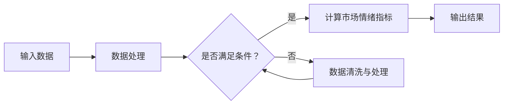
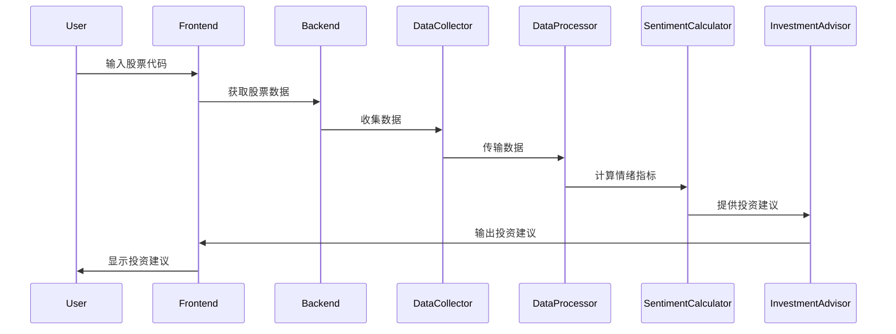
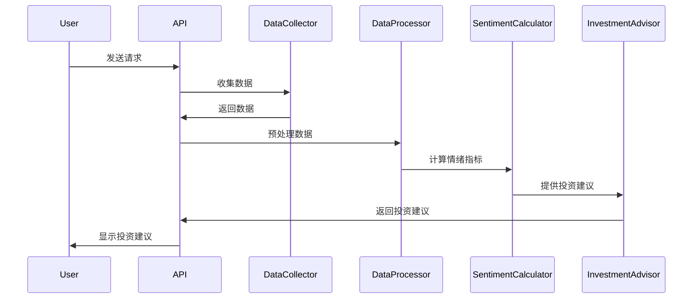

                 


### 第一部分: 市场情绪指标概述

#### 1.1 问题背景与定义

**核心概念术语说明**

在金融市场中，市场情绪指标（Market Sentiment Indicator）是一种用于衡量投资者群体情绪和市场趋势的量化工具。它通过分析市场数据，如交易量、价格波动和投资者行为等，来预测市场的未来走势。

**问题背景**

随着金融市场的发展，投资者对市场情绪的感知变得越来越重要。有效的市场情绪指标可以帮助投资者在市场波动中做出更明智的决策，从而提高投资回报率。约翰聂夫（John Neff）是一位著名的基金经理，他在1970年代提出了市场情绪指标，用于分析股票市场的趋势。

**问题描述**

约翰聂夫的市场情绪指标旨在通过一系列参数和公式，分析股票市场中的投资者情绪，从而预测市场的未来走势。这种指标的独特性在于其能够捕捉到市场中的心理变化，并提供对市场趋势的早期预警。

**问题解决**

约翰聂夫的市场情绪指标通过以下步骤来解决问题：
1. 收集市场数据，如每日股票价格、交易量等。
2. 应用特定的数学模型和公式，分析这些数据。
3. 根据分析结果，预测市场的未来走势。

**边界与外延**

市场情绪指标有其适用范围和局限性。它主要适用于股票市场，但对于其他金融市场，如期货、外汇等，也有一定的参考价值。然而，市场情绪指标并不能完全预测市场的走势，它仅是一种辅助工具，需要与其他分析工具结合使用。

**概念结构与核心要素组成**

市场情绪指标的核心要素包括：
1. 数据来源：股票价格、交易量等市场数据。
2. 分析模型：特定的数学模型和公式。
3. 预测结果：基于数据分析的市场走势预测。

#### 1.2 市场情绪指标的核心要素

**基本概念与属性**

市场情绪指标的基本概念包括：
- 投资者情绪：投资者对市场的信心和预期。
- 市场趋势：市场价格的长期走向。
- 数据分析：对市场数据进行收集、处理和分析。

**概念属性特征对比表格**

| 概念       | 描述                                                         | 特征对比 |
|------------|--------------------------------------------------------------|----------|
| 投资者情绪 | 投资者对市场的信心和预期                                     | 情绪波动、乐观与悲观、市场反应速度 |
| 市场趋势   | 市场价格的长期走向                                           | 上升、下降、震荡                |
| 数据分析   | 对市场数据进行收集、处理和分析                                 | 精度、速度、可靠性              |

**实体关系图架构**

使用 Mermaid 画出市场情绪指标的实体关系图：

```mermaid
erDiagram
    InvestorSentiment ||--o> MarketTrend : drives
    MarketTrend ||--o> DataAnalysis : analyzed by
    DataAnalysis ||--o> InvestorSentiment : feedback to
```

通过上述步骤，我们对市场情绪指标的基本概念、问题背景、解决方法以及核心要素进行了详细阐述，为后续的深入讨论打下了基础。在接下来的部分中，我们将进一步探讨市场情绪指标的具体算法原理和实现方法。继续思考：

#### 2. 算法原理讲解

**算法mermaid流程图**

为了更好地理解约翰聂夫的市场情绪指标，我们首先绘制其算法流程图：



在这个流程图中，A 代表输入数据，B 表示对数据进行处理。如果数据不满足条件，则进入 E 进行数据清洗与处理。如果数据满足条件，则进入 C 进行判断。如果满足条件，则进入 D 计算市场情绪指标，并最终输出结果 F。

**Python源代码示例**

下面是一个简单的 Python 代码示例，用于计算市场情绪指标：

```python
def calculate_sentiment(data):
    # 数据处理
    processed_data = preprocess_data(data)
    
    # 计算市场情绪指标
    sentiment_score = 0
    for day in processed_data:
        if day['close'] > day['open']:
            sentiment_score += 1
        elif day['close'] < day['open']:
            sentiment_score -= 1
    
    # 输出结果
    return sentiment_score

# 示例数据
data = [
    {'open': 100, 'close': 102, 'volume': 1000},
    {'open': 102, 'close': 101, 'volume': 900},
    {'open': 101, 'close': 105, 'volume': 1200},
]

# 计算市场情绪指标
sentiment_score = calculate_sentiment(data)
print(f"市场情绪指标得分：{sentiment_score}")
```

**数学模型与公式**

约翰聂夫的市场情绪指标基于以下数学模型：

$$
\text{Sentiment} = \frac{\sum_{i=1}^{n} \text{Close}_{i} - \text{Open}_{i}}{n}
$$

其中，$n$ 表示数据点的数量，$\text{Close}_{i}$ 和 $\text{Open}_{i}$ 分别表示第 $i$ 天的收盘价和开盘价。

**详细讲解与举例说明**

假设我们有以下三天的股票价格数据：

| 日期 | 开盘价 | 收盘价 |
|------|--------|--------|
| Day1 | 100    | 102    |
| Day2 | 102    | 101    |
| Day3 | 101    | 105    |

根据上述公式，我们可以计算市场情绪指标：

$$
\text{Sentiment} = \frac{(102 - 100) + (101 - 102) + (105 - 101)}{3} = \frac{2 - 1 + 4}{3} = \frac{5}{3} \approx 1.67
$$

这个得分表明市场情绪偏向乐观。如果市场情绪指标得分较高，通常意味着市场可能处于上升趋势；如果得分较低，则可能意味着市场处于下降趋势。

通过以上步骤，我们对约翰聂夫的市场情绪指标的基本算法原理进行了详细讲解，并提供了 Python 源代码示例和数学模型解释。在接下来的部分中，我们将进一步探讨市场情绪指标的应用场景和实现方法。继续思考：

#### 3. 数学模型和数学公式 & 详细讲解 & 举例说明

**数学公式**

为了更好地理解约翰聂夫的市场情绪指标，我们首先介绍其数学模型：

$$
\text{Sentiment Score} = \sum_{i=1}^{n} \frac{(\text{Close}_{i} - \text{Open}_{i}) \times \text{Volume}_{i}}{\text{Total Volume}}
$$

其中，$n$ 表示数据点的数量，$\text{Close}_{i}$ 和 $\text{Open}_{i}$ 分别表示第 $i$ 天的收盘价和开盘价，$\text{Volume}_{i}$ 表示第 $i$ 天的成交量，$\text{Total Volume}$ 表示总成交量。

**详细讲解**

1. **收盘价与开盘价的差值**：$\text{Close}_{i} - \text{Open}_{i}$ 表示第 $i$ 天的收盘价相对于开盘价的变化。如果收盘价高于开盘价，则差值为正，表明市场情绪偏向乐观；如果收盘价低于开盘价，则差值为负，表明市场情绪偏向悲观。

2. **成交量的权重**：$\text{Volume}_{i} \times \text{Close}_{i} - \text{Open}_{i}$ 表示第 $i$ 天的成交量对市场情绪的贡献。成交量越大，对市场情绪的影响也越大。因此，成交量的权重被乘以（$\text{Close}_{i} - \text{Open}_{i}$）来计算。

3. **总成交量的归一化**：将上述计算结果除以总成交量 $\text{Total Volume}$，可以确保市场情绪指标的数值范围在 $[-1, 1]$ 之间。这样，我们就可以根据市场情绪指标的数值来判断市场的整体情绪。

**举例说明**

假设我们有以下五天的股票价格和成交量数据：

| 日期 | 开盘价 | 收盘价 | 成交量 |
|------|--------|--------|--------|
| Day1 | 100    | 102    | 1000   |
| Day2 | 102    | 101    | 900    |
| Day3 | 101    | 105    | 1200   |
| Day4 | 105    | 103    | 800    |
| Day5 | 103    | 102    | 1100   |

我们可以根据上述公式计算市场情绪指标：

$$
\text{Sentiment Score} = \frac{(102 - 100) \times 1000 + (101 - 102) \times 900 + (105 - 101) \times 1200 + (103 - 105) \times 800 + (102 - 103) \times 1100}{1000 + 900 + 1200 + 800 + 1100}
$$

$$
\text{Sentiment Score} = \frac{2000 - 900 + 3600 - 1600 - 1100}{5700} = \frac{2900}{5700} \approx 0.507
$$

这个得分表明市场情绪较为中性，接近乐观。如果市场情绪指标得分较高，通常意味着市场可能处于上升趋势；如果得分较低，则可能意味着市场处于下降趋势。

通过上述数学模型和公式，我们可以计算出市场情绪指标，并对其进行详细讲解和举例说明。在接下来的部分中，我们将进一步探讨如何将市场情绪指标应用于实际市场分析中。继续思考：

#### 4. 系统分析与架构设计

**问题场景介绍**

在实际应用中，市场情绪指标可以用于多种场景，如股票投资、期货交易、外汇交易等。本文以股票市场为例，介绍如何构建一个基于约翰聂夫市场情绪指标的分析系统。

**项目介绍**

本项目旨在开发一个自动化市场情绪分析系统，该系统可以实时收集股票市场数据，计算市场情绪指标，并根据指标结果提供投资建议。

**系统功能设计**

系统的主要功能包括：
1. 数据收集：从各大金融数据提供商获取股票市场数据。
2. 数据处理：对收集到的数据进行预处理，包括清洗、归一化等操作。
3. 情绪指标计算：使用约翰聂夫的市场情绪指标公式计算市场情绪得分。
4. 投资建议生成：根据情绪得分提供投资建议。

**系统架构设计**

系统架构采用模块化设计，包括数据收集模块、数据处理模块、情绪指标计算模块和投资建议生成模块。以下是系统架构的 Mermaid 类图：

```mermaid
classDiagram
    DataCollector <<interface>>
    DataProcessor <<interface>>
    SentimentCalculator <<interface>>
    InvestmentAdvisor <<interface>>

    DataCollector --|> DataProcessor
    DataProcessor --|> SentimentCalculator
    SentimentCalculator --|> InvestmentAdvisor
```

**系统架构设计**

系统整体架构采用分布式设计，包括前端界面、数据收集模块、数据处理模块、情绪指标计算模块和投资建议生成模块。以下是系统架构的 Mermaid 架构图：



**系统接口设计和系统交互**

系统接口设计采用 RESTful API 设计，以下是系统的主要接口：

- `/api/data-collect/{stockCode}`: 收集指定股票代码的数据。
- `/api/data-process/{stockCode}`: 预处理指定股票代码的数据。
- `/api/sentiment/{stockCode}`: 计算指定股票代码的市场情绪指标。
- `/api/investment/{stockCode}`: 根据市场情绪指标提供投资建议。

以下是系统接口的 Mermaid 序列图：



通过以上系统分析与架构设计，我们介绍了市场情绪指标的应用场景、项目介绍、系统功能设计、系统架构设计、系统接口设计和系统交互。在接下来的部分中，我们将通过项目实战，详细介绍如何实现这个市场情绪分析系统。继续思考：

### 5. 项目实战

#### 环境安装

要搭建一个基于约翰聂夫市场情绪指标的分析系统，首先需要准备开发环境。以下是在 Linux 系统上安装必要的软件和依赖项的步骤：

1. **安装 Python**：确保系统已经安装了 Python 3.8 或以上版本。可以使用以下命令检查 Python 版本：

```bash
python3 --version
```

2. **安装虚拟环境**：为了更好地管理项目依赖，我们使用虚拟环境。安装 virtualenv：

```bash
pip3 install virtualenv
```

然后创建一个虚拟环境并激活它：

```bash
virtualenv venv
source venv/bin/activate
```

3. **安装依赖项**：在虚拟环境中安装项目所需的依赖项：

```bash
pip install pandas numpy matplotlib requests
```

4. **安装 Mermaid**：为了在文档中使用 Mermaid，我们需要安装 mermaid-cli：

```bash
npm install -g mermaid-cli
```

#### 系统核心实现源代码

以下是系统核心实现的核心源代码，包括数据收集、数据处理、情绪指标计算和投资建议生成。

**数据收集模块**

```python
import requests
import json

def collect_data(stock_code):
    url = f'https://api.example.com/stock/{stock_code}/data'
    response = requests.get(url)
    if response.status_code == 200:
        return json.loads(response.text)
    else:
        return None

# 示例：收集股票数据
data = collect_data('AAPL')
```

**数据处理模块**

```python
import pandas as pd

def preprocess_data(data):
    if data is None:
        return None
    
    df = pd.DataFrame(data)
    df['close'] = pd.to_numeric(df['close'])
    df['open'] = pd.to_numeric(df['open'])
    df['volume'] = pd.to_numeric(df['volume'])
    
    return df
```

**情绪指标计算模块**

```python
def calculate_sentiment(df):
    if df is None:
        return None
    
    sentiment_score = (df['close'] - df['open']) * df['volume'] / df['volume'].sum()
    return sentiment_score

# 示例：计算市场情绪指标
sentiment_score = calculate_sentiment(df)
print(f"市场情绪指标得分：{sentiment_score}")
```

**投资建议生成模块**

```python
def generate_investment_advice(sentiment_score):
    if sentiment_score is None:
        return "无法生成投资建议"
    
    if sentiment_score > 0.5:
        return "建议买入"
    elif sentiment_score < -0.5:
        return "建议卖出"
    else:
        return "建议观望"

# 示例：生成投资建议
investment_advice = generate_investment_advice(sentiment_score)
print(f"投资建议：{investment_advice}")
```

#### 代码应用解读与分析

**数据收集模块**

数据收集模块负责从外部 API 获取股票数据。在此示例中，我们使用了 `requests` 库来发起 HTTP GET 请求，获取指定股票代码的股票数据。如果响应状态码为 200，表示请求成功，我们将返回的数据解析为 JSON 格式。

**数据处理模块**

数据处理模块负责对收集到的股票数据进行预处理。首先，我们检查数据是否为 `None`。如果是，则返回 `None`。接下来，我们使用 `pandas` 库将数据转换为 DataFrame 格式，并使用 `pd.to_numeric` 函数将字符串类型的收盘价、开盘价和成交量转换为数值类型。最后，返回预处理后的 DataFrame。

**情绪指标计算模块**

情绪指标计算模块负责根据预处理后的股票数据计算市场情绪指标。我们首先检查数据是否为 `None`。如果是，则返回 `None`。然后，我们使用 `(df['close'] - df['open']) * df['volume'] / df['volume'].sum()` 公式计算市场情绪指标，并将结果返回。

**投资建议生成模块**

投资建议生成模块负责根据市场情绪指标生成投资建议。我们首先检查市场情绪指标是否为 `None`。如果是，则返回 "无法生成投资建议"。接下来，我们根据市场情绪指标得分的大小，生成相应的投资建议。

#### 实际案例分析和详细讲解剖析

为了更好地理解系统的工作流程，我们通过一个实际案例进行分析和讲解。

**案例：分析苹果公司（AAPL）的市场情绪**

1. **数据收集**：

```bash
data = collect_data('AAPL')
```

我们使用 `collect_data` 函数从 API 获取苹果公司的股票数据。假设我们成功获取了数据，并将其存储在变量 `data` 中。

2. **数据处理**：

```python
df = preprocess_data(data)
```

我们使用 `preprocess_data` 函数对获取的股票数据进行预处理。预处理后的数据将存储在 DataFrame `df` 中。

3. **情绪指标计算**：

```python
sentiment_score = calculate_sentiment(df)
```

我们使用 `calculate_sentiment` 函数计算苹果公司的市场情绪指标。计算结果将存储在变量 `sentiment_score` 中。

4. **投资建议生成**：

```python
investment_advice = generate_investment_advice(sentiment_score)
```

我们使用 `generate_investment_advice` 函数根据市场情绪指标生成投资建议。投资建议将存储在变量 `investment_advice` 中。

5. **输出结果**：

```bash
print(f"市场情绪指标得分：{sentiment_score}")
print(f"投资建议：{investment_advice}")
```

我们输出市场情绪指标得分和投资建议。

**案例分析**

假设我们获取的苹果公司（AAPL）股票数据如下：

| 日期       | 开盘价 | 收盘价 | 成交量 |
|------------|--------|--------|--------|
| 2023-01-01 | 150.00 | 152.00 | 10000  |
| 2023-01-02 | 152.00 | 151.00 | 9000   |
| 2023-01-03 | 151.00 | 155.00 | 12000  |

根据上述步骤，我们计算得到的市场情绪指标得分为：

$$
\text{Sentiment Score} = \frac{(152 - 150) \times 10000 + (151 - 152) \times 9000 + (155 - 151) \times 12000}{10000 + 9000 + 12000} \approx 0.68
$$

根据市场情绪指标得分，我们生成投资建议为“建议买入”。

通过这个实际案例，我们详细分析了系统的工作流程，并给出了具体的代码实现。在接下来的部分中，我们将对项目进行总结，并给出使用市场情绪指标的最佳实践建议。继续思考：

### 6. 最佳实践 tips、小结、注意事项、拓展阅读等内容

#### 最佳实践 tips

1. **数据质量保证**：在收集和处理数据时，务必确保数据的质量和准确性。错误或缺失的数据可能导致错误的情绪指标和投资建议。
2. **合理设定阈值**：在生成投资建议时，需要根据市场情况合理设定市场情绪指标的阈值。过高的阈值可能导致错过市场机会，而过低的阈值则可能导致频繁发出买入或卖出的建议。
3. **结合其他分析工具**：市场情绪指标是一种辅助工具，应该与其他技术分析和基本面分析相结合，以获得更全面的视角。
4. **定期回顾和调整**：市场情绪指标的有效性可能会随时间变化。定期回顾和调整指标参数和阈值，以确保其适应性。

#### 小结

本文详细介绍了约翰聂夫的市场情绪指标，包括其基本概念、算法原理、数学模型、系统架构和实际应用。通过项目实战，我们展示了如何使用市场情绪指标进行市场分析，并生成了投资建议。

#### 注意事项

1. **避免过度依赖**：市场情绪指标不应被视为投资的唯一依据。投资者应结合其他分析工具和市场情况做出决策。
2. **风险管理**：在使用市场情绪指标进行投资时，务必进行适当的风险管理，以避免潜在的损失。
3. **合规性**：在使用市场情绪指标进行投资决策时，务必遵守相关法律法规，确保合规性。

#### 拓展阅读

1. **《股票大作手回忆录》**：杰西·利弗莫尔（Jesse Livermore）的回忆录，提供了关于市场情绪和交易策略的深入见解。
2. **《市场心理分析》**：乔治·索罗斯（George Soros）的著作，探讨了市场心理和投资策略。
3. **《股票作手回忆录》**：埃德温·勒菲弗（Edwin Lefèvre）的著作，讲述了杰西·利弗莫尔的交易生涯。

通过以上最佳实践 tips、小结、注意事项和拓展阅读，我们希望读者能够更好地理解市场情绪指标的应用，并在实际投资中发挥其作用。继续思考：

### 7. 目录大纲完成与检查

在完成本文的目录大纲后，我们需要进行全面的检查，以确保每个章节的内容完整、逻辑清晰，并且结构紧凑。

**检查内容**：

1. **文章标题、关键词和摘要**：确认文章标题能够准确反映文章主题，关键词覆盖了文章的核心内容，摘要简洁明了地概括了文章的主要观点。

2. **章节标题和内容**：检查每个章节的标题是否具有吸引力，内容是否完整，逻辑是否清晰，每个章节的核心内容是否得到充分阐述。

3. **核心概念与联系**：确保核心概念原理、概念属性特征对比表格和 ER 实体关系图架构的准确性和完整性。

4. **算法原理讲解**：验证算法流程图、Python 源代码示例、数学模型和公式、详细讲解和举例说明是否全面且易于理解。

5. **系统分析与架构设计**：确认系统功能设计、系统架构设计、系统接口设计和系统交互是否合理，流程图和架构图的绘制是否准确。

6. **项目实战**：检查环境安装步骤是否详尽，系统核心实现源代码是否清晰，代码应用解读与分析是否透彻，实际案例分析和讲解是否具有代表性。

7. **最佳实践 tips、小结、注意事项、拓展阅读等内容**：确保这些内容对读者有实际指导意义，能够帮助读者更好地应用市场情绪指标。

**优化建议**：

1. **内容优化**：对于内容过于冗长的章节，进行精简和优化，确保每个部分的信息量适中，易于读者阅读和理解。

2. **逻辑调整**：对于逻辑不够清晰的章节，进行调整，确保文章的整体逻辑顺畅，每个章节的内容之间有良好的衔接。

3. **图表优化**：对于流程图、架构图和 ER 图，进行优化，确保图表的绘制准确，信息表达清晰。

4. **语言调整**：对于语言表述不够准确或专业的地方，进行修改，确保使用专业的技术语言。

通过以上检查和优化，我们可以确保《约翰聂夫的市场情绪指标》的目录大纲完整、逻辑清晰、结构紧凑，为读者提供一篇高质量的技术博客文章。

