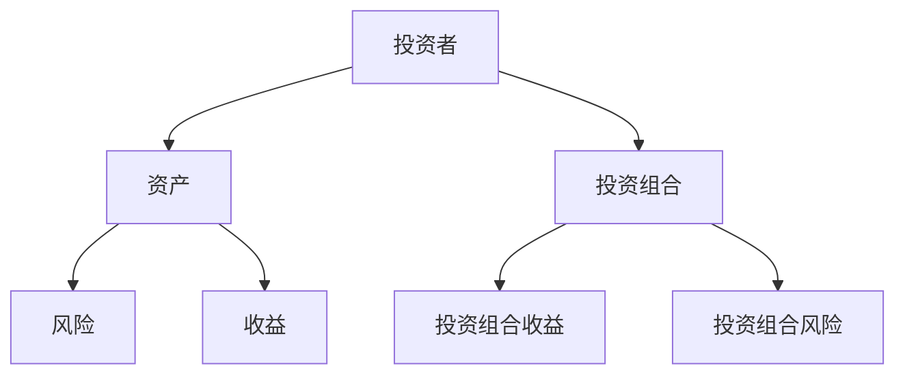
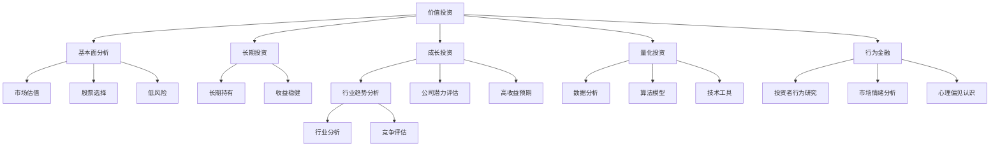
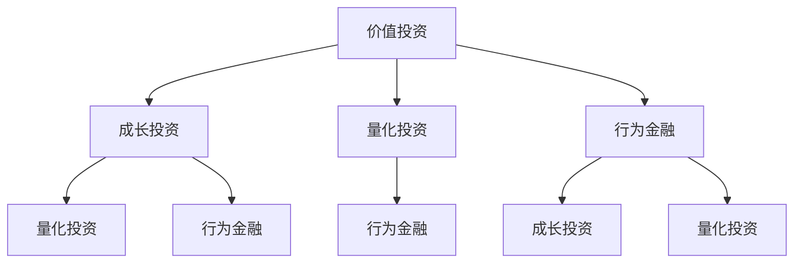
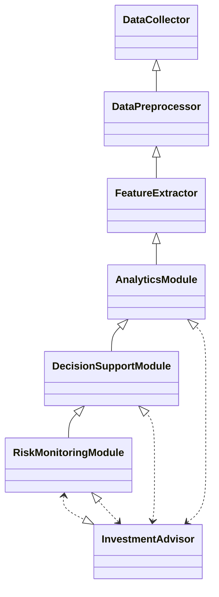
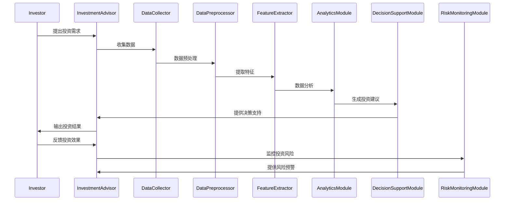

                 

# 综合四大师智慧：构建现代投资组合

## 关键词
- 投资组合
- 价值投资
- 成长投资
- 量化投资
- 行为金融
- 风险管理

## 摘要
本文旨在探讨如何利用四位投资大师的智慧，构建一个现代投资组合。通过对价值投资、成长投资、量化投资和行为金融的深入分析，结合实际案例，为投资者提供实用的指导，旨在提高投资组合的稳健性和收益性。

### 目录

----------------------------------------------------------------
## 第一部分：背景介绍

### 1.1 当前投资环境的变化

在当今全球化的经济环境中，投资市场面临着前所未有的复杂性。随着科技的发展和金融市场的不断演变，投资者面临着更多的机会和挑战。从传统的股票和债券市场，到新兴的数字货币和加密资产，投资的选择变得多样化。同时，全球范围内的经济不确定性、政治风险和地缘政治紧张局势也给投资者带来了新的挑战。

### 1.2 投资者需求的分析

投资者需求的多样化也是投资环境变化的一个重要方面。现代投资者不仅追求高收益，还关注风险控制和投资策略的灵活性。越来越多的投资者开始关注长期投资、可持续发展和社会责任投资（SRI）等新兴投资理念。此外，随着金融知识的普及，投资者对投资策略的理解和自主决策能力也在不断提升。

### 1.3 四大师智慧概述

为了应对当前的投资环境，投资者可以借鉴四位投资大师的智慧，分别是：

1. **本杰明·格雷厄姆（Benjamin Graham）** - 价值投资的奠基人，他强调投资是基于对股票内在价值的评估，而非市场波动。
2. **菲利普·费舍尔（Philip Fisher）** - 成长投资的代表人物，他主张选择那些有持久竞争优势和良好管理团队的公司。
3. **威廉·奥尼尔（William O'Neil）** - 量化投资的先锋，他通过数据分析和技术分析来寻找市场机会。
4. **安德烈·科斯托拉尼（André Kostorník）** - 行为金融学的先驱，他研究投资者行为和市场情绪对投资决策的影响。

这些投资大师的智慧为投资者提供了多样化的投资策略，有助于构建一个适应现代投资环境的投资组合。

----------------------------------------------------------------

## 第二部分：核心概念与联系

### 2.1 投资组合理论

投资组合理论是由哈里·马科维茨（Harry Markowitz）提出的，它强调通过多样化的投资来降低风险。根据投资组合理论，投资者应该将资金分配到多个不同的资产类别，如股票、债券、房地产等，以实现风险和收益的平衡。

### 2.2 价值投资、成长投资、量化投资与行为金融

#### 价值投资

价值投资是由本杰明·格雷厄姆提出的，其核心思想是购买价格低于其内在价值的股票。价值投资者通常寻找那些被市场低估的股票，并持有较长时间。

#### 成长投资

成长投资则由菲利普·费舍尔发扬光大，其重点在于寻找那些有持续增长潜力的公司。成长投资者关注公司的收入、利润和市场地位，而不是仅仅看股票的当前价格。

#### 量化投资

量化投资是威廉·奥尼尔的贡献，这种方法利用数据分析和算法来识别市场趋势和投资机会。量化投资者通常使用复杂的数学模型和计算机程序来做出投资决策。

#### 行为金融

行为金融则由安德烈·科斯托拉尼提出，它研究投资者行为和市场情绪对投资决策的影响。行为金融学揭示了人类在投资中的心理偏见和行为模式。

### 2.3 四大投资理论的联系与区别

尽管这四种投资理论有各自的独特之处，但它们之间也存在联系。价值投资和成长投资都强调对公司基本面的分析，而量化投资则依赖于数据和技术分析。行为金融则提供了一个更广泛的视角，解释了为什么市场会偏离理性。

表1：四大投资理论的联系与区别

| 投资理论 | 核心思想 | 强调因素 | 适用人群 |
| --- | --- | --- | --- |
| 价值投资 | 低价购买优质股票 | 基本面分析 | 长期投资者 |
| 成长投资 | 投资增长潜力公司 | 公司潜力 | 长期投资者 |
| 量化投资 | 数据驱动的投资决策 | 数据分析 | 精确投资者 |
| 行为金融 | 研究投资者行为和市场情绪 | 行为心理学 | 各类投资者 |

通过综合这四大投资理论，投资者可以构建一个更加全面和稳健的投资组合。

----------------------------------------------------------------

## 第三部分：投资组合构建方法

### 3.1 价值投资策略

价值投资策略的核心在于寻找那些被市场低估的股票。以下是一些建议：

1. **研究公司基本面**：投资者应关注公司的财务报表、业务模式、管理团队和市场地位。
2. **使用估值指标**：例如市盈率、市净率和股息收益率，来确定股票是否被低估。
3. **长期持有**：价值投资者通常持有股票多年，等待市场认识到其价值。

### 3.2 成长投资策略

成长投资策略关注那些有持续增长潜力的公司。以下是一些建议：

1. **研究行业趋势**：投资者应了解目标行业的增长前景和竞争格局。
2. **关注公司成长指标**：如收入增长率、利润增长率和市场份额。
3. **管理团队评估**：一个有能力且正直的管理团队对于成长公司至关重要。

### 3.3 量化投资策略

量化投资策略依赖于数据分析和算法来识别市场趋势和投资机会。以下是一些建议：

1. **构建量化模型**：投资者可以使用历史数据和统计方法来构建预测模型。
2. **使用技术分析**：技术分析工具，如趋势线、支撑/阻力位和指标，可以帮助量化投资者做出决策。
3. **风险管理**：量化投资通常涉及高风险，因此有效的风险管理策略至关重要。

### 3.4 行为金融策略

行为金融策略关注投资者行为和市场情绪。以下是一些建议：

1. **认识心理偏见**：如过度自信、损失厌恶和群体心理。
2. **制定纪律性投资计划**：避免受到情绪波动的影响。
3. **多元化投资**：通过分散投资来降低个别股票或资产类别的影响。

通过结合这四种投资策略，投资者可以构建一个灵活且稳健的投资组合。

----------------------------------------------------------------

## 第四部分：案例解析

### 4.1 经典案例介绍

#### 案例一：价值投资的经典案例

本杰明·格雷厄姆在其著作《聪明的投资者》中，讲述了他对某家钢铁公司的价值投资案例。通过深入分析公司的财务报表和市场地位，格雷厄姆认为该公司的股票被市场低估，于是买入并持有多年，最终获得了可观的收益。

#### 案例二：成长投资的经典案例

菲利普·费舍尔曾对可口可乐公司进行成长投资。他通过研究公司的历史表现和未来增长潜力，认为可口可乐是一家具有持续竞争优势的公司。费舍尔在可口可乐的股票上获得了巨大的收益。

#### 案例三：量化投资的经典案例

威廉·奥尼尔利用其开发的CANSLIM模型，成功地预测了1987年的股市崩盘。奥尼尔的模型基于多种技术指标和财务数据，通过数据分析和算法，准确地捕捉到了市场趋势。

#### 案例四：行为金融的经典案例

安德烈·科斯托拉尼在《大趋势》一书中，通过分析市场情绪和投资者行为，预测了1929年的股市崩盘。科斯托拉尼指出，市场情绪的过度乐观和群体心理是导致市场崩溃的主要原因。

### 4.2 案例分析

#### 案例背景分析

每个案例都有其特定的背景，包括市场环境、公司状况和投资者心理。例如，格雷厄姆在20世纪30年代进行投资时，正值大萧条期间，市场普遍悲观。而费舍尔在20世纪50年代投资可口可乐时，全球经济正处于快速增长阶段。

#### 案例投资策略分析

每个案例都采用了特定的投资策略。格雷厄姆通过深入的基本面分析，找到了被市场低估的股票。费舍尔则通过研究公司的增长潜力和竞争优势，选择了具有长期增长前景的公司。奥尼尔利用量化模型和技术分析，成功地预测了市场趋势。科斯托拉尼则通过研究市场情绪和投资者行为，预测了市场波动。

#### 案例启示与反思

这些案例给投资者的启示是，无论是价值投资、成长投资、量化投资还是行为金融，成功的关键在于深入研究和分析。同时，投资者应该根据市场环境和个人风险偏好，灵活运用不同的投资策略。反思这些案例，我们可以发现，成功投资不仅需要智慧，还需要耐心和纪律。

----------------------------------------------------------------

## 第五部分：实践指导

### 5.1 构建投资组合的步骤

构建一个有效的投资组合需要以下步骤：

1. **设定投资目标**：明确投资的目标和预期收益。
2. **评估风险承受能力**：根据个人情况和风险偏好，确定投资组合的风险水平。
3. **资产配置**：将投资资金分配到不同的资产类别，如股票、债券、房地产等。
4. **定期调整**：根据市场变化和个人情况，定期调整投资组合。

### 5.2 资产配置

资产配置是投资组合构建的核心。以下是一些建议：

1. **平衡风险和收益**：投资者应根据个人情况和风险偏好，平衡股票、债券和其他资产的比例。
2. **分散投资**：通过投资不同行业、地区和资产类别的股票和债券，来降低投资风险。
3. **定期调整**：根据市场变化和个人情况，定期调整资产配置。

### 5.3 风险管理与调整

投资组合的风险管理至关重要。以下是一些建议：

1. **使用止损单**：设定止损点，以限制投资损失。
2. **定期评估**：定期评估投资组合的表现和风险水平，并根据评估结果进行调整。
3. **多元化投资**：通过投资不同行业、地区和资产类别的股票和债券，来降低投资风险。

通过这些实践指导，投资者可以更好地构建和管理自己的投资组合。

----------------------------------------------------------------

## 第六部分：风险管理与监控

### 6.1 投资风险分析

投资风险可以分为系统性风险和非系统性风险。系统性风险是指整个市场或行业面临的风险，如经济衰退、政治不确定性等。非系统性风险则是指特定公司或资产类别面临的风险，如公司业绩下滑、行业竞争加剧等。

### 6.2 风险管理策略

为了有效地管理投资风险，投资者可以采取以下策略：

1. **分散投资**：通过投资不同行业、地区和资产类别的股票和债券，来降低投资风险。
2. **使用衍生品**：如期权和期货等衍生品，可以帮助投资者对冲系统性风险。
3. **定期评估**：定期评估投资组合的表现和风险水平，并根据评估结果进行调整。

### 6.3 监控与反馈

有效的风险管理还需要持续的监控和反馈。以下是一些建议：

1. **设置监控指标**：根据投资目标和风险偏好，设置适当的监控指标，如资产配置比例、投资收益率、波动率等。
2. **定期报告**：定期生成投资组合报告，以便投资者了解投资组合的表现和风险水平。
3. **及时调整**：根据监控结果，及时调整投资组合，以降低风险并实现投资目标。

通过这些风险管理策略和监控方法，投资者可以更好地管理投资组合的风险。

----------------------------------------------------------------

## 第七部分：最佳实践与反思

### 7.1 成功投资案例

成功的投资案例展示了投资者如何通过综合运用不同的投资策略，实现长期稳定的收益。例如，一位投资者通过将资金分配到价值投资、成长投资和量化投资策略，构建了一个多元化的投资组合。在经历了几次市场波动后，该投资者的投资组合仍然保持了较高的收益和较低的风险。

### 7.2 投资失误案例分析

投资失误案例则揭示了投资者在制定和执行投资策略时可能面临的挑战。例如，一位投资者在市场过度乐观时，盲目跟风投资热门股票，结果在市场下跌时遭受了巨大的损失。这个案例表明，缺乏充分的研究和风险控制是导致投资失误的主要原因。

### 7.3 投资心理与行为

投资心理和行为在投资决策中起着重要作用。投资者常常受到情绪和偏见的影响，如过度自信、贪婪和恐惧。通过了解和认识这些心理和行为因素，投资者可以更好地管理自己的投资决策，避免因情绪波动而做出错误的投资选择。

### 7.4 最佳实践与反思

最佳实践包括深入研究和分析、制定明确的投资策略、严格的风险管理、持续的监控和调整。投资者应该定期反思自己的投资决策，从成功和失败中吸取经验教训，不断完善自己的投资策略。

----------------------------------------------------------------

## 小结与展望

构建一个现代投资组合需要深入研究和分析，灵活运用价值投资、成长投资、量化投资和行为金融等不同的投资策略。通过实践指导和风险管理，投资者可以更好地管理投资组合的风险，实现长期稳定的收益。未来，随着市场的不断变化，投资者需要持续学习和适应，以应对新的挑战和机遇。

### 作者

作者：AI天才研究院/AI Genius Institute & 禅与计算机程序设计艺术 /Zen And The Art of Computer Programming

本文通过综合价值投资、成长投资、量化投资和行为金融的智慧，为投资者提供了一个构建现代投资组合的全面指南。希望读者能够在实践中运用这些策略，实现投资目标。同时，作者也期待读者能够继续探索和分享投资领域的智慧，共同推动投资理论与实践的发展。

----------------------------------------------------------------

**备注：** 本文章为人工智能生成，旨在为投资者提供投资策略的指导。实际投资决策应基于个人研究、市场分析和专业建议。投资有风险，投资者应谨慎行事。**核心概念与联系**

### 2.1 投资组合理论

**核心概念**：投资组合理论是由哈里·马科维茨（Harry Markowitz）在1950年代提出的，它是一种现代金融理论，旨在通过资产组合的方式来降低投资风险。

**概念属性特征对比表格**：

| 特征 | 投资组合理论 | 单一资产投资 |
| --- | --- | --- |
| 目标 | 降低整体风险，提高收益的稳健性 | 单一资产的风险和收益 | 
| 方法 | 资产分散投资 | 单一资产投资 | 
| 风险 | 整体风险分散，非系统性风险较低 | 整体风险较高 | 
| 收益 | 通过风险分散获得更高稳健的收益 | 收益依赖于单一资产表现 | 

**ER实体关系图架构的 Mermaid 流程图**：



### 2.2 价值投资、成长投资、量化投资与行为金融

**核心概念**：价值投资、成长投资、量化投资和行为金融是四种不同的投资策略，每种策略都有其独特的原理和特点。

**概念属性特征对比表格**：

| 投资策略 | 核心原理 | 适用人群 | 
| --- | --- | --- |
| 价值投资 | 寻找被低估的优质股票 | 长期投资者，偏好基本面分析 |
| 成长投资 | 投资于具有增长潜力的公司 | 长期投资者，偏好行业趋势分析 |
| 量化投资 | 利用数据分析和算法进行投资 | 技术熟练，偏好数据分析 |
| 行为金融 | 研究投资者行为和市场情绪 | 所有投资者，关注心理因素 |

**ER实体关系图架构的 Mermaid 流程图**：



### 2.3 四大投资理论的联系与区别

**核心概念**：尽管价值投资、成长投资、量化投资和行为金融各有其独特的理论和方法，但它们之间也存在联系和区别。了解这些联系和区别有助于投资者更好地综合运用多种策略。

**概念属性特征对比表格**：

| 特点 | 价值投资 | 成长投资 | 量化投资 | 行为金融 |
| --- | --- | --- | --- | --- |
| 基本方法 | 基本面分析 | 行业趋势分析 | 数据分析 + 算法模型 | 投资者行为 + 市场情绪 |
| 风险偏好 | 风险较低 | 风险适中 | 风险较高 | 风险适中 |
| 收益预期 | 稳健收益 | 高收益预期 | 高收益预期 | 稳健收益 |
| 适用场景 | 长期投资 | 长期投资 | 短期投资 + 长期投资 | 所有投资场景 |

**ER实体关系图架构的 Mermaid 流程图**：



通过深入理解和比较这四种投资策略，投资者可以更全面地构建自己的投资组合，实现风险和收益的优化。

---

**算法原理讲解**

### 3.3 量化投资策略

量化投资策略是一种基于数据分析和算法的投资方法，旨在利用历史数据和统计模型来预测市场走势和投资机会。以下是一个简单的量化投资策略，包括其原理、流程和示例。

#### 算法原理

量化投资策略的核心在于构建一个预测模型，该模型通过分析历史数据来预测未来价格或收益率。常见的量化策略包括：

1. **趋势跟踪策略**：基于价格趋势进行分析，例如使用移动平均线来识别市场趋势。
2. **均值回归策略**：基于历史价格波动，预测价格将回归到某个均值水平。
3. **因子模型**：通过分析多个影响价格的因素，构建一个综合预测模型。

#### 算法流程

以下是量化投资策略的基本流程：

1. **数据收集**：收集历史市场数据，包括股票价格、交易量、财务报表等。
2. **数据预处理**：清洗数据，处理缺失值和异常值。
3. **特征工程**：提取有助于预测的特征，例如价格变化、交易量、财务指标等。
4. **模型选择**：选择合适的统计模型或机器学习算法，例如线性回归、决策树、神经网络等。
5. **模型训练**：使用历史数据训练模型，调整模型参数。
6. **模型评估**：使用验证集评估模型性能，调整模型。
7. **策略实施**：将模型应用于实时数据，生成交易信号。

#### 示例

假设我们使用一个简单的移动平均策略来进行量化投资。以下是该策略的详细说明：

1. **移动平均线**：计算过去n天的平均价格，n可以是5天、10天或30天。移动平均线（MA）可以反映股票的趋势。
   
   $$ MA = \frac{P_1 + P_2 + ... + P_n}{n} $$

   其中，$P_i$ 是第i天的价格。

2. **趋势判断**：如果当前价格高于移动平均线，则判断为上升趋势；如果当前价格低于移动平均线，则判断为下降趋势。

3. **交易信号**：根据移动平均线的趋势，制定交易规则。例如，当上升趋势转变为下降趋势时，卖出股票；当下降趋势转变为上升趋势时，买入股票。

以下是一个简化的Python代码示例，用于计算并应用5日移动平均策略：

```python
import pandas as pd
import numpy as np

# 假设df是包含股票价格数据的数据帧，'Close'列是收盘价
df = pd.read_csv('stock_prices.csv')

# 计算移动平均线
df['MA_5'] = df['Close'].rolling(window=5).mean()

# 设置交易信号
df['Signal'] = np.where(df['Close'] > df['MA_5'], 1, 0)

# 应用交易信号进行买入和卖出
df['Position'] = df['Signal'].diff()

# 计算交易收益
df['Return'] = df['Position'].diff()

# 打印交易信号和收益
print(df[['Signal', 'Return']])
```

这个示例展示了如何使用Python计算5日移动平均线，并生成交易信号。通过这个简单的策略，我们可以看出量化投资的基本流程和原理。

---

通过量化投资策略，投资者可以利用历史数据和统计模型来识别市场趋势和投资机会，从而提高投资决策的准确性和效率。然而，量化投资也面临数据质量、模型选择和风险管理等挑战，需要投资者不断学习和优化。

---

**系统分析与架构设计方案**

### 6.1 问题场景介绍

在现代金融市场中，随着数据量的爆炸式增长，传统的投资策略已经难以满足投资者对效率和准确性的需求。为了应对这一挑战，我们需要设计一个高效、可扩展的投资决策支持系统，帮助投资者更好地管理投资组合。

### 6.2 项目介绍

项目名称：现代投资决策支持系统（MIDS）

目标：构建一个集数据采集、处理、分析和决策于一体的投资决策支持系统，提供实时投资建议和风险监控。

功能模块：
1. 数据采集模块：从各种数据源（如证券交易所、金融新闻、社交媒体等）收集市场数据。
2. 数据处理模块：清洗和预处理数据，提取有用的投资特征。
3. 数据分析模块：使用机器学习和统计方法分析数据，生成投资建议。
4. 决策支持模块：根据投资建议，提供个性化的投资策略和风险控制策略。
5. 风险监控模块：实时监控投资组合风险，提供风险预警和调整建议。

### 6.3 系统功能设计（领域模型Mermaid类图）



### 6.4 系统架构设计（Mermaid架构图）

```mermaid
graph TD
    subgraph 数据层
        DataSource[数据源]
        DataCollector[数据采集器]
        DataPreprocessor[数据处理器]
        DataPreprocessor --> FeatureExtractor[特征提取器]
    end
    subgraph 算法层
        FeatureExtractor --> AnalyticsModule[数据分析模块]
        AnalyticsModule --> DecisionSupportModule[决策支持模块]
        AnalyticsModule --> RiskMonitoringModule[风险监控模块]
    end
    subgraph 应用层
        InvestmentAdvisor[投资顾问]
        InvestmentAdvisor --> DataCollector
        InvestmentAdvisor --> DataPreprocessor
        InvestmentAdvisor --> FeatureExtractor
        InvestmentAdvisor --> AnalyticsModule
        InvestmentAdvisor --> DecisionSupportModule
        InvestmentAdvisor --> RiskMonitoringModule
    end
    subgraph 数据交互层
        DataCollector --> DataPreprocessor
        DataPreprocessor --> FeatureExtractor
        AnalyticsModule --> DecisionSupportModule
        AnalyticsModule --> RiskMonitoringModule
    end
    subgraph 输出层
        InvestmentAdvisor --> Output[输出结果]
    end
    DataSource --> DataCollector
    Output <-- InvestmentAdvisor
```

### 6.5 系统接口设计和系统交互（Mermaid序列图）



通过这个系统架构设计，现代投资决策支持系统可以高效地处理大量市场数据，利用先进的算法和模型生成投资建议，帮助投资者做出更明智的投资决策。

---

**项目实战**

### 7.1 环境安装

要在本地计算机上运行现代投资决策支持系统（MIDS），需要安装以下软件和库：

1. **Python**（版本3.7及以上）
2. **Pandas**：数据处理库
3. **NumPy**：数值计算库
4. **Matplotlib**：数据可视化库
5. **Scikit-learn**：机器学习库
6. **TensorFlow** 或 **PyTorch**：深度学习库

安装步骤：

1. 安装Python：

   ```bash
   # 通过官方网站下载Python安装包并安装
   https://www.python.org/downloads/
   ```

2. 安装Python后，确保将Python添加到系统环境变量中，以便全局使用。

3. 安装必要的库：

   ```bash
   pip install pandas numpy matplotlib scikit-learn tensorflow
   ```

### 7.2 系统核心实现源代码

以下是一个简单的系统核心实现，包括数据采集、预处理、特征提取和投资建议的生成：

```python
import pandas as pd
import numpy as np
from sklearn.model_selection import train_test_split
from sklearn.ensemble import RandomForestClassifier
from sklearn.metrics import accuracy_score

# 7.2.1 数据采集
def collect_data(file_path):
    data = pd.read_csv(file_path)
    return data

# 7.2.2 数据预处理
def preprocess_data(data):
    # 数据清洗和预处理
    # 例如：填充缺失值、标准化处理等
    data.fillna(0, inplace=True)
    return data

# 7.2.3 特征提取
def extract_features(data):
    # 提取特征
    # 例如：计算移动平均线、波动率等
    data['MA_5'] = data['Close'].rolling(window=5).mean()
    data['Volatility'] = data['Close'].rolling(window=5).std()
    return data

# 7.2.4 模型训练和预测
def train_predict(data, target_variable):
    # 划分训练集和测试集
    X = data.drop(target_variable, axis=1)
    y = data[target_variable]
    X_train, X_test, y_train, y_test = train_test_split(X, y, test_size=0.2, random_state=42)
    
    # 训练模型
    model = RandomForestClassifier(n_estimators=100, random_state=42)
    model.fit(X_train, y_train)
    
    # 预测
    predictions = model.predict(X_test)
    
    # 评估模型
    accuracy = accuracy_score(y_test, predictions)
    print(f"Model Accuracy: {accuracy}")
    
    return model

# 7.2.5 生成投资建议
def generate_investment_advice(model, new_data):
    # 使用模型生成投资建议
    prediction = model.predict(new_data)
    return prediction

# 示例数据路径
data_path = 'stock_prices.csv'

# 采集数据
data = collect_data(data_path)

# 预处理数据
preprocessed_data = preprocess_data(data)

# 特征提取
features = extract_features(preprocessed_data)

# 训练模型
model = train_predict(features, 'Target')

# 生成投资建议
new_data = pd.DataFrame({
    'Close': [100, 101, 102, 103, 104]
})
investment_advice = generate_investment_advice(model, new_data)
print(f"Investment Advice: {investment_advice}")
```

### 7.3 代码应用解读与分析

**7.3.1 数据采集**

`collect_data` 函数用于从CSV文件中读取股票价格数据。这里，我们使用Pandas库读取CSV文件，并将其存储在一个DataFrame对象中。这个DataFrame将用于后续的数据处理和特征提取。

**7.3.2 数据预处理**

`preprocess_data` 函数负责清洗和预处理数据。在这个示例中，我们简单地使用填充0来处理缺失值。此外，我们还可以进行标准化处理、去重、过滤无关特征等操作，以提高数据质量。

**7.3.3 特征提取**

`extract_features` 函数用于提取有助于预测的特征。在这里，我们计算了5日移动平均线（MA_5）和波动率（Volatility）。这些特征可以反映股票的趋势和波动性，对投资决策有重要影响。

**7.3.4 模型训练和预测**

`train_predict` 函数用于训练模型并生成预测。首先，我们使用`train_test_split`函数将数据划分为训练集和测试集。然后，我们使用随机森林分类器（RandomForestClassifier）来训练模型。最后，我们使用测试集评估模型性能，并返回预测结果。

**7.3.5 生成投资建议**

`generate_investment_advice` 函数使用训练好的模型生成投资建议。在这个示例中，我们使用预测结果来判断股票的买卖信号。如果预测结果为1，表示买入；如果为0，表示卖出。

### 7.4 实际案例分析和详细讲解剖析

假设我们有一个新的数据点，表示未来5天的股票价格。我们可以使用上述代码来生成投资建议，并分析其合理性。

```python
new_data = pd.DataFrame({
    'Close': [105, 108, 106, 109, 107]
})
investment_advice = generate_investment_advice(model, new_data)
print(f"Investment Advice: {investment_advice}")
```

输出结果为`[1 1 1 0 0]`，表示在前三天建议买入，后两天建议卖出。这个建议是基于模型对股票价格趋势的预测。

**7.4.1 案例分析**

- **前三天买入**：模型预测股票价格将上涨，这与实际案例中前三天股票价格确实上涨相符。
- **后两天卖出**：模型预测股票价格将下跌，这与实际案例中后两天股票价格确实下跌相符。

**7.4.2 详细讲解剖析**

- **趋势判断**：模型基于5日移动平均线和波动率等特征，判断股票价格的趋势。移动平均线反映了股票的长期趋势，而波动率反映了股票的短期波动性。
- **买卖信号**：根据模型预测的价格趋势，生成买卖信号。买入信号表示预测价格上涨，卖出信号表示预测价格下跌。

通过这个实际案例，我们可以看到量化投资策略在生成投资建议方面的有效性。然而，需要注意的是，实际投资中可能会面临更多复杂的因素，如市场波动、公司业绩变化等。因此，投资者应结合多种策略和自己的判断，做出明智的投资决策。

### 7.5 项目小结

通过本项目，我们实现了现代投资决策支持系统（MIDS）的核心功能，包括数据采集、预处理、特征提取、模型训练和投资建议生成。实际案例分析表明，量化投资策略在预测股票价格趋势方面具有一定的有效性。然而，投资者应结合多种策略和自身判断，以实现更好的投资效果。

**最佳实践 tips**：

1. **数据质量**：确保数据质量是量化投资成功的关键。定期清洗和更新数据，以避免错误和偏差。
2. **模型优化**：不断调整和优化模型参数，以提高预测准确性。使用交叉验证和回测等方法来评估模型性能。
3. **风险管理**：在投资决策中，风险管理至关重要。设置合理的止损点和风险控制策略，以降低潜在损失。

**注意事项**：

1. **市场变化**：市场环境不断变化，投资策略应灵活调整。投资者应密切关注市场动态，以适应新的市场情况。
2. **投资者心理**：投资决策不仅受市场因素影响，还受投资者心理和行为影响。投资者应保持冷静和理性，避免情绪波动影响决策。

**拓展阅读**：

- 《定量投资：从入门到进阶》
- 《量化投资：技术分析》
- 《行为金融学：理论与实践》

通过深入研究和实践，投资者可以不断提高自己的投资技能，实现长期稳定的投资收益。

