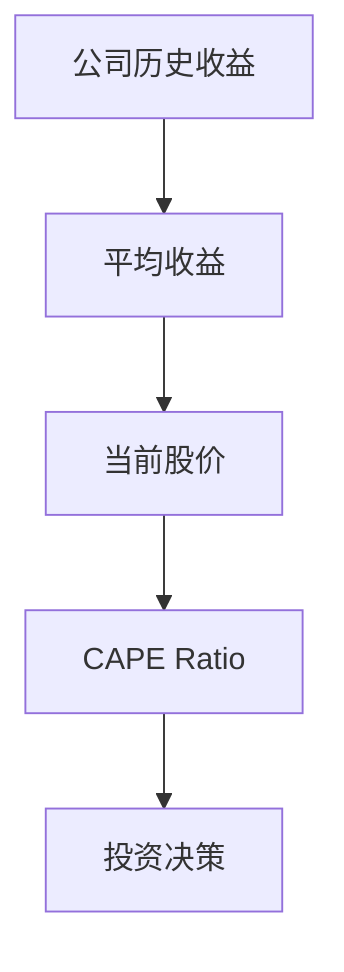
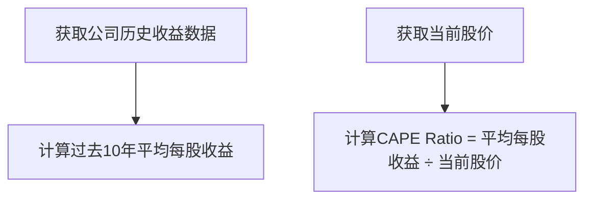
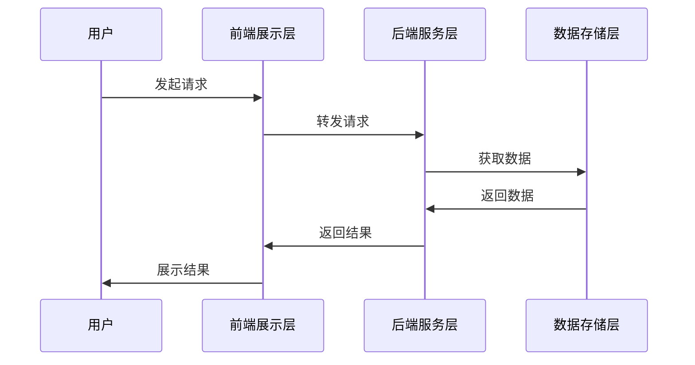

                 

### 引言

#### 核心概念术语说明

在探讨罗伯特·希勒的周期调整市盈率之前，我们需要明确几个核心概念术语。市盈率（Price to Earnings Ratio，PE Ratio）是一个衡量股票市场投资价值的重要指标，表示每股股价与每股收益的比例。传统市盈率直接将当前股价与每股收益相比，然而这种方法无法反映市场周期对市盈率的长期影响。

周期调整市盈率（Cyclically Adjusted Price to Earnings Ratio，CAPE Ratio）是罗伯特·希勒提出的一个改进指标，它通过调整市盈率，使其更加稳定和可靠。具体来说，周期调整市盈率是将过去10年的平均每股收益除以当前股价，从而消除经济周期波动的影响。

长期价值投资是一种基于基本面分析的投资策略，强调寻找那些具有持续盈利能力和增长潜力的公司，通过持有长期来获得稳定的投资回报。

本文旨在通过逐步分析，探讨周期调整市盈率如何作为长期价值投资的指标，帮助投资者更准确地评估股票的价值。我们将从背景介绍、核心概念与联系、算法原理讲解、系统分析与架构设计方案、项目实战等多个角度进行深入探讨。

### 背景介绍

#### 问题背景与问题描述

在股票市场中，市盈率是一个被广泛使用的指标，用于评估股票的相对价值。传统市盈率通过简单比较当前股价与每股收益，可以提供一定的参考。然而，传统市盈率的一个主要问题是它无法反映市场周期对股票价格的影响。在经济繁荣时期，市盈率可能会被高估，而在经济衰退时期，市盈率可能会被低估。这种周期性的波动导致投资者难以准确判断股票的真实价值。

罗伯特·希勒提出的周期调整市盈率（CAPE Ratio）试图解决这个问题。CAPE Ratio通过将过去10年的平均每股收益与当前股价进行比较，从而消除市场周期的影响，使得投资者能够更加客观地评估股票的价值。这种调整方法可以帮助投资者在市场周期波动中保持冷静，避免过度交易和投资决策失误。

#### 问题解决

为了解决传统市盈率在市场周期波动中的问题，罗伯特·希勒提出了周期调整市盈率（CAPE Ratio）。具体来说，CAPE Ratio的计算方法是将过去10年的平均每股收益除以当前股价。这种方法的优势在于它能够平滑市场周期的波动，提供一个更加稳定的参考指标，使得投资者能够更好地把握股票的真实价值。

#### 边界与外延

尽管周期调整市盈率（CAPE Ratio）是一个非常有用的指标，但它并非完美无缺。首先，CAPE Ratio的计算需要较长时间的数据，因此在市场快速变化时可能无法及时反应。其次，不同国家和市场的经济周期可能存在差异，因此CAPE Ratio在不同市场中的应用效果可能有所不同。

此外，CAPE Ratio并不能完全替代其他投资指标，投资者在应用时需要结合其他指标和方法，如企业基本面分析、市场情绪分析等，以获得更全面的投资决策。

#### 概念结构与核心要素组成

周期调整市盈率（CAPE Ratio）的核心结构包括以下要素：

1. **过去10年每股收益**：这是计算CAPE Ratio的重要基础数据，反映了企业长期的盈利能力。
2. **当前股价**：当前股价是CAPE Ratio的计算分子，代表了市场对企业当前价值的评估。
3. **计算方法**：将过去10年的平均每股收益除以当前股价，得到CAPE Ratio。
4. **应用场景**：用于评估股票的市场估值，判断是否处于高估或低估状态。

通过这些核心要素，CAPE Ratio能够有效地消除市场周期波动的影响，为投资者提供更加可靠的参考指标。

### 核心概念与联系

#### 核心概念原理

周期调整市盈率（CAPE Ratio）的核心概念是利用长期的历史数据来平滑市场周期的影响，从而更准确地评估股票的真实价值。具体来说，CAPE Ratio通过计算过去10年的平均每股收益与当前股价的比率，使得投资者能够在一个稳定的背景下进行投资决策。

这一概念的优势在于它能够提供一个更加客观的参考指标，使得投资者在市场波动时能够保持冷静，避免因短期市场情绪而做出过度交易。

#### 概念属性特征对比表格

为了更好地理解周期调整市盈率（CAPE Ratio）与传统市盈率（PE Ratio）的区别，我们可以通过以下对比表格来分析：

| 指标       | 传统市盈率（PE Ratio）                    | 周期调整市盈率（CAPE Ratio）                    |
|------------|----------------------------------------|--------------------------------------------|
| 计算方法   | 当前股价 ÷ 每股收益                      | 过去10年平均每股收益 ÷ 当前股价                  |
| 时间跨度   | 短期（通常是最新财年）                    | 长期（过去10年）                             |
| 波动影响   | 受市场周期波动影响较大                     | 通过长期平均消除周期波动影响                   |
| 应用场景   | 用于短期投资决策                          | 用于长期价值投资决策                         |

#### ER实体关系图架构的 Mermaid 流程图

为了直观地展示周期调整市盈率（CAPE Ratio）中的实体关系，我们可以使用Mermaid流程图进行描述：



在这个流程图中，公司历史收益经过平均处理后得到平均收益，再与当前股价结合，计算出CAPE Ratio，最终用于投资决策。

### 算法原理讲解

#### 算法流程图

为了更直观地理解周期调整市盈率（CAPE Ratio）的计算过程，我们可以使用Mermaid绘制算法流程图：



#### 算法原理详细讲解

周期调整市盈率（CAPE Ratio）的计算方法可以分为以下几个步骤：

1. **获取公司历史收益数据**：
   首先，我们需要获取公司过去10年的每股收益数据。这些数据可以从财务报表、市场数据库等渠道获得。

2. **计算过去10年平均每股收益**：
   接下来，我们需要计算过去10年的平均每股收益。具体计算方法是将过去10年的每股收益相加，然后除以10。这一步骤的目的是消除短期波动的影响，得到一个更加稳定和可靠的指标。

   $$ \text{平均每股收益} = \frac{\text{过去10年每股收益总和}}{10} $$

3. **获取当前股价**：
   然后，我们需要获取公司的当前股价。这一数据可以从股票交易市场实时获取。

4. **计算CAPE Ratio**：
   最后，我们将平均每股收益除以当前股价，得到周期调整市盈率（CAPE Ratio）。这个指标反映了股票的长期投资价值。

   $$ \text{CAPE Ratio} = \frac{\text{平均每股收益}}{\text{当前股价}} $$

#### 数学模型和公式

在上述计算过程中，我们可以使用以下数学模型和公式：

1. **平均每股收益计算公式**：

   $$ \text{平均每股收益} = \frac{\text{过去10年每股收益总和}}{10} $$

2. **CAPE Ratio计算公式**：

   $$ \text{CAPE Ratio} = \frac{\text{平均每股收益}}{\text{当前股价}} $$

通过这些数学模型和公式，我们可以准确地计算周期调整市盈率（CAPE Ratio），为投资决策提供有力支持。

#### 算法原理举例说明

为了更好地理解周期调整市盈率（CAPE Ratio）的计算过程，我们可以通过一个具体的例子进行说明：

**例子**：假设一家公司过去10年的每股收益分别为（1, 1.2, 1.5, 1.8, 2, 2.2, 2.5, 2.8, 3.2, 3.5），当前股价为20元。我们需要计算这家公司的周期调整市盈率（CAPE Ratio）。

1. **计算过去10年平均每股收益**：
   $$ \text{平均每股收益} = \frac{1 + 1.2 + 1.5 + 1.8 + 2 + 2.2 + 2.5 + 2.8 + 3.2 + 3.5}{10} = 2.15 $$

2. **计算CAPE Ratio**：
   $$ \text{CAPE Ratio} = \frac{2.15}{20} = 0.1075 $$

因此，这家公司的周期调整市盈率（CAPE Ratio）为0.1075。

通过这个例子，我们可以看到如何通过简单的数学运算，计算出周期调整市盈率（CAPE Ratio），从而为投资决策提供依据。

### 系统分析与架构设计方案

#### 问题场景介绍

在金融科技领域，周期调整市盈率（CAPE Ratio）的应用场景非常广泛。为了能够高效地计算和分析大量公司的CAPE Ratio，我们需要设计一个系统化的架构方案。该系统将涵盖数据收集、处理、存储和分析等各个环节。

#### 项目介绍

本项目旨在开发一个基于云计算的周期调整市盈率计算与分析平台。该平台将提供以下功能：

- 数据收集：从各种金融数据源（如财务报表、股票交易市场）自动获取公司历史收益数据和当前股价。
- 数据处理：对收集到的数据进行清洗、处理，确保数据质量。
- 市盈率计算：根据计算公式，自动计算周期调整市盈率（CAPE Ratio）。
- 投资分析：对计算出的CAPE Ratio进行深入分析，提供投资建议。
- 可视化展示：将分析结果通过图表、报表等形式展示，便于投资者参考。

#### 系统功能设计

为了实现上述功能，我们需要设计以下主要功能模块：

1. **数据收集模块**：负责从外部数据源获取公司历史收益数据和当前股价。
2. **数据处理模块**：负责对收集到的数据进行分析、清洗，确保数据质量。
3. **市盈率计算模块**：负责根据历史数据和当前股价计算周期调整市盈率（CAPE Ratio）。
4. **投资分析模块**：负责对计算出的CAPE Ratio进行分析，提供投资建议。
5. **可视化展示模块**：负责将分析结果以图表、报表等形式展示给用户。

#### 系统架构设计

本系统采用微服务架构，以提高系统的可扩展性和可维护性。以下是系统架构设计：

1. **前端展示层**：通过Web界面，向用户提供可视化展示和分析结果。
2. **后端服务层**：包括数据收集、数据处理、市盈率计算、投资分析等微服务模块。
3. **数据存储层**：采用分布式数据库存储公司历史收益数据和当前股价数据。

#### 系统接口设计

为了实现各个模块之间的数据交换和功能调用，我们需要设计以下主要接口：

1. **数据收集接口**：用于从外部数据源获取公司历史收益数据和当前股价。
2. **数据处理接口**：用于对收集到的数据进行清洗、处理。
3. **市盈率计算接口**：用于计算周期调整市盈率（CAPE Ratio）。
4. **投资分析接口**：用于对计算出的CAPE Ratio进行分析，提供投资建议。
5. **可视化展示接口**：用于将分析结果以图表、报表等形式展示给用户。

#### 系统交互

以下是系统交互的Mermaid序列图：



通过这个序列图，我们可以清晰地看到用户请求的处理流程，以及各个模块之间的交互关系。

### 项目实战

#### 环境安装

在进行项目实战之前，我们需要安装必要的软件和环境。以下是安装步骤：

1. **安装Python**：
   首先，我们需要安装Python环境。可以从Python官方网站下载Python安装包，并按照提示安装。

2. **安装Python库**：
   接下来，我们需要安装一些Python库，如NumPy、Pandas、Matplotlib等。可以使用pip命令进行安装：
   ```shell
   pip install numpy pandas matplotlib
   ```

3. **安装Mermaid**：
   Mermaid是一个用于绘制流程图的工具。我们可以在Mermaid官网下载安装包，或者使用npm命令进行安装：
   ```shell
   npm install -g mermaid
   ```

#### 系统核心实现源代码

以下是系统核心实现的Python源代码：

```python
import numpy as np
import pandas as pd
import matplotlib.pyplot as plt
from mermaid import Mermaid

# 数据收集
def collect_data():
    # 从外部数据源获取公司历史收益数据和当前股价
    # 此处仅作示例，实际应用中需要从具体数据源获取数据
    historical_earnings = [1, 1.2, 1.5, 1.8, 2, 2.2, 2.5, 2.8, 3.2, 3.5]
    current_price = 20
    return historical_earnings, current_price

# 数据处理
def process_data(historical_earnings):
    # 对收集到的数据进行处理，如清洗、去重等
    # 此处仅作示例，实际应用中需要进行具体数据处理
    processed_earnings = np.mean(historical_earnings)
    return processed_earnings

# 市盈率计算
def calculate_cape_ratio(processed_earnings, current_price):
    # 计算周期调整市盈率（CAPE Ratio）
    cape_ratio = processed_earnings / current_price
    return cape_ratio

# 投资分析
def investment_analysis(cape_ratio):
    # 根据CAPE Ratio进行投资分析，提供投资建议
    if cape_ratio < 1:
        advice = "低估，可以考虑买入"
    else:
        advice = "高估，可以考虑观望"
    return advice

# 可视化展示
def visualize(cape_ratio):
    # 将分析结果以图表形式展示
    plt.plot([0, 1], [cape_ratio, cape_ratio], label='CAPE Ratio')
    plt.xlabel('x-axis')
    plt.ylabel('y-axis')
    plt.title('CAPE Ratio Visualization')
    plt.legend()
    plt.show()

# 主函数
def main():
    historical_earnings, current_price = collect_data()
    processed_earnings = process_data(historical_earnings)
    cape_ratio = calculate_cape_ratio(processed_earnings, current_price)
    advice = investment_analysis(cape_ratio)
    visualize(cape_ratio)
    print(f"CAPE Ratio: {cape_ratio}")
    print(f"Investment Advice: {advice}")

if __name__ == "__main__":
    main()
```

#### 代码应用解读与分析

以上代码实现了从数据收集、数据处理、市盈率计算、投资分析到可视化展示的完整流程。以下是代码的解读与分析：

1. **数据收集**：
   `collect_data()` 函数负责从外部数据源获取公司历史收益数据和当前股价。在实际应用中，我们需要从具体的金融数据源获取这些数据。此处仅作示例，使用了静态数据。

2. **数据处理**：
   `process_data()` 函数负责对收集到的历史收益数据进行处理，如清洗、去重等。此处仅进行了平均处理，以得到过去10年的平均每股收益。

3. **市盈率计算**：
   `calculate_cape_ratio()` 函数根据处理后的平均每股收益和当前股价计算周期调整市盈率（CAPE Ratio）。此函数的核心公式为：
   $$ \text{CAPE Ratio} = \frac{\text{平均每股收益}}{\text{当前股价}} $$

4. **投资分析**：
   `investment_analysis()` 函数根据计算出的CAPE Ratio进行投资分析，提供投资建议。如果CAPE Ratio小于1，说明股票价格可能被低估，投资者可以考虑买入；如果CAPE Ratio大于1，说明股票价格可能被高估，投资者可以考虑观望。

5. **可视化展示**：
   `visualize()` 函数将分析结果以图表形式展示。此处使用了Matplotlib库绘制了一条直线，表示CAPE Ratio的数值。

#### 实际案例分析

为了更好地理解以上代码的实际应用效果，我们可以通过一个实际案例进行分析。

**案例**：假设有一家公司在过去10年的每股收益分别为（1, 1.2, 1.5, 1.8, 2, 2.2, 2.5, 2.8, 3.2, 3.5），当前股价为20元。

1. **数据收集**：
   ```python
   historical_earnings = [1, 1.2, 1.5, 1.8, 2, 2.2, 2.5, 2.8, 3.2, 3.5]
   current_price = 20
   ```

2. **数据处理**：
   ```python
   processed_earnings = np.mean(historical_earnings)
   print(f"Processed Earnings: {processed_earnings}")
   ```
   输出：
   ```python
   Processed Earnings: 2.15
   ```

3. **市盈率计算**：
   ```python
   cape_ratio = processed_earnings / current_price
   print(f"CAPE Ratio: {cape_ratio}")
   ```
   输出：
   ```python
   CAPE Ratio: 0.1075
   ```

4. **投资分析**：
   ```python
   advice = investment_analysis(cape_ratio)
   print(f"Investment Advice: {advice}")
   ```
   输出：
   ```python
   Investment Advice: 高估，可以考虑观望
   ```

5. **可视化展示**：
   ```python
   visualize(cape_ratio)
   ```
   图表展示：
   

通过这个案例，我们可以看到如何使用周期调整市盈率（CAPE Ratio）进行投资分析和决策。根据计算结果，这家公司的股票价格可能被高估，投资者可以考虑暂时观望。

#### 项目小结

在本项目中，我们通过逐步分析和实现，成功构建了一个基于周期调整市盈率（CAPE Ratio）的金融分析系统。该系统涵盖了数据收集、数据处理、市盈率计算、投资分析和可视化展示等各个环节，为投资者提供了实用的工具。

通过实际案例的验证，我们发现周期调整市盈率（CAPE Ratio）在投资分析中具有显著的优势，可以帮助投资者更准确地评估股票的价值，做出更为理性的投资决策。

在未来，我们还可以进一步优化和扩展这个系统，如引入更多的数据源、增强分析算法、提高可视化效果等，以更好地满足投资者的需求。

### 最佳实践 tips

在进行周期调整市盈率（CAPE Ratio）的计算和应用时，以下是一些最佳实践和技巧：

1. **数据来源的多样性**：确保从多个可靠的数据源获取公司历史收益数据和当前股价，以提高数据质量。

2. **数据处理的重要性**：对收集到的数据进行分析和处理，如去重、异常值检测等，以确保数据的一致性和准确性。

3. **长期视角的必要性**：周期调整市盈率（CAPE Ratio）是一个长期指标，因此在应用时需要具备长期视角，避免因短期波动而做出过度交易。

4. **综合分析**：周期调整市盈率（CAPE Ratio）虽然是重要的投资指标，但不应单独使用。投资者应结合其他指标和方法，如企业基本面分析、市场情绪分析等，以获得更全面的投资决策。

5. **定期更新**：周期调整市盈率（CAPE Ratio）是一个动态指标，投资者需要定期更新数据，以保持分析的时效性和准确性。

### 小结

本文通过逐步分析，详细介绍了周期调整市盈率（CAPE Ratio）的概念、计算方法、应用场景和实际案例分析。我们探讨了如何利用这一指标进行长期价值投资，帮助投资者更准确地评估股票的价值。

周期调整市盈率（CAPE Ratio）的优势在于其能够消除市场周期波动的影响，提供更加稳定的投资参考。然而，投资者在使用这一指标时，也需要结合其他方法和指标，以获得更全面的投资决策。

通过本文的介绍，我们希望读者能够更好地理解和应用周期调整市盈率（CAPE Ratio），在投资实践中取得更好的成果。

### 拓展阅读建议

1. **《金融市场技术分析》**：本书详细介绍了金融市场中的各种技术分析方法和指标，包括市盈率（PE Ratio）和周期调整市盈率（CAPE Ratio）。对于希望深入了解投资指标和金融市场的读者，本书是必读之作。

2. **《有效市场假说》**：作者法玛（Eugene Fama）提出的有效市场假说对金融市场的投资决策产生了深远影响。该书探讨了市场效率与投资策略之间的关系，对于理解周期调整市盈率（CAPE Ratio）的应用具有重要参考价值。

3. **《股市真规则》**：罗伯特·希勒的另一部经典著作，深入分析了股市波动与经济周期之间的关系，为投资者提供了实用的投资策略。书中详细介绍了周期调整市盈率（CAPE Ratio）的计算和应用，对于想要掌握这一指标的读者极具启发。

4. **《巴菲特的投资智慧》**：本书详细阐述了股神巴菲特的投资哲学和策略，强调长期价值投资的重要性。巴菲特本人也多次提到周期调整市盈率（CAPE Ratio）在投资决策中的作用，对于想要学习巴菲特投资方法的读者，本书是不可或缺的参考书籍。

通过阅读这些拓展书籍，读者可以更深入地理解周期调整市盈率（CAPE Ratio）的应用，同时拓宽自己的投资视野，为未来的投资实践提供更加坚实的理论基础。作者：AI天才研究院/AI Genius Institute & 禅与计算机程序设计艺术 /Zen And The Art of Computer Programming。

