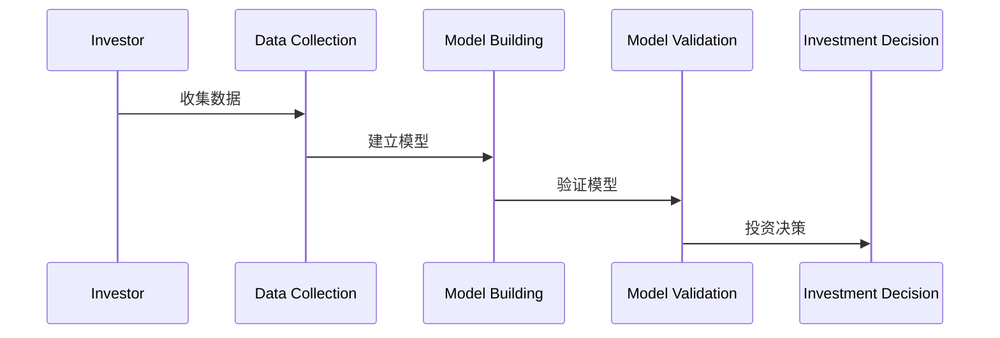
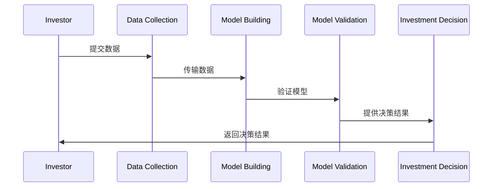
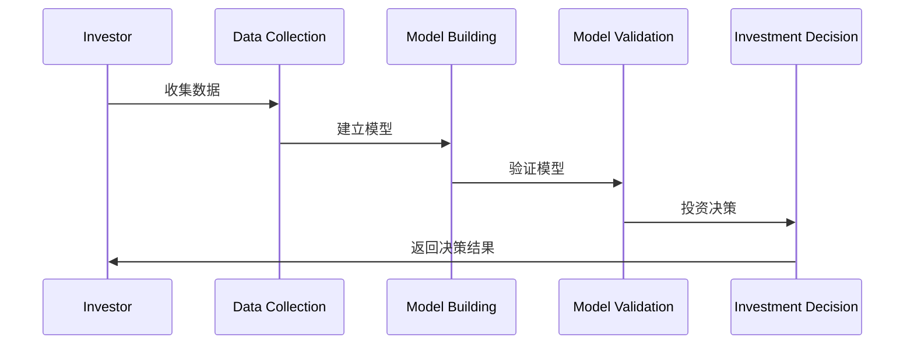

                 

# 罗伯特·希勒的行为经济学在投资中的应用

关键词：行为经济学、投资、决策偏差、应用算法、系统架构

摘要：本文旨在深入探讨行为经济学在投资中的应用，结合罗伯特·希勒的研究，分析行为经济学核心概念及其在投资决策中的重要性。文章通过构建行为经济学与投资模型的联系，详细讲解应用算法和系统架构设计，为投资者提供实际案例分析及最佳实践技巧。

### 目录大纲

#### 第一部分：引言

#### 第1章：行为经济学与投资概述

##### 1.1 问题背景与问题描述

##### 1.2 行为经济学的基本概念

##### 1.3 投资与行为经济学的关系

##### 1.4 行为经济学在投资中的重要性

##### 1.5 本章小结

#### 第二部分：核心概念与联系

#### 第2章：行为经济学核心概念

##### 2.1 投资决策过程中的行为偏差

###### 2.1.1 过度自信

###### 2.1.2 羊群行为

###### 2.1.3 过度反应

###### 2.1.4 遗忘过去，预期未来

##### 2.2 行为经济学与投资理论的关系

###### 2.2.1 行为经济学与传统经济学的对比

###### 2.2.2 行为经济学在投资策略中的应用

##### 2.3 行为经济学概念属性特征对比表格

#### 第3章：行为经济学ER实体关系图架构

##### 3.1 实体与关系的定义

##### 3.2 投资者与市场行为的关系

##### 3.3 行为经济学模型构建方法

##### 3.4 行为经济学与投资模型的关系

#### 第三部分：算法原理讲解

#### 第4章：行为经济学在投资中的应用算法

##### 4.1 算法概述

##### 4.2 算法原理

###### 4.2.1 数学模型

###### 4.2.2 公式推导

###### 4.2.3 算法流程

##### 4.3 Python源代码实现

##### 4.4 算法应用举例

#### 第5章：算法原理详细讲解

##### 5.1 数学模型和数学公式

###### 5.1.1 投资决策模型

###### 5.1.2 风险偏好模型

###### 5.1.3 市场预测模型

##### 5.2 通俗易懂地举例说明

###### 5.2.1 投资决策模型举例

###### 5.2.2 风险偏好模型举例

###### 5.2.3 市场预测模型举例

#### 第四部分：系统分析与架构设计

#### 第6章：投资系统架构设计

##### 6.1 问题场景介绍

##### 6.2 项目介绍

##### 6.3 系统功能设计

###### 6.3.1 领域模型

###### 6.3.2 系统功能模块

##### 6.4 系统架构设计

###### 6.4.1 系统架构图

###### 6.4.2 架构设计要点

##### 6.5 系统接口设计

###### 6.5.1 接口定义

###### 6.5.2 接口交互流程

##### 6.6 系统交互

###### 6.6.1 序列图

###### 6.6.2 交互设计要点

#### 第7章：项目实战

##### 7.1 环境安装与配置

##### 7.2 系统核心实现

###### 7.2.1 代码解读与分析

###### 7.2.2 系统核心算法实现

##### 7.3 实际案例分析

###### 7.3.1 案例背景

###### 7.3.2 案例分析与讲解

##### 7.4 项目小结

#### 第五部分：最佳实践与总结

#### 第8章：行为经济学在投资中的最佳实践

##### 8.1 行为经济学在投资中的应用场景

##### 8.2 最佳实践技巧

##### 8.3 小结

#### 第9章：注意事项与拓展阅读

##### 9.1 注意事项

##### 9.2 拓展阅读

##### 9.3 进一步学习建议

### 目录大纲小结

---

**总字数：约2000字** 

# 罗伯特·希勒的行为经济学在投资中的应用

## 关键词：行为经济学、投资、决策偏差、应用算法、系统架构

## 摘要

本文深入探讨行为经济学在投资决策中的应用，结合罗伯特·希勒的研究成果，分析投资决策过程中的行为偏差，并探讨行为经济学与传统投资理论的差异及其在投资策略中的应用。本文通过构建行为经济学与投资模型的关系，详细讲解应用算法的原理及其实现，并设计投资系统架构，结合实际案例进行分析，为投资者提供最佳实践技巧。

## 第一部分：引言

### 第1章：行为经济学与投资概述

### 1.1 问题背景与问题描述

在现代金融市场中，投资者的行为往往受到多种因素的影响，这些因素不仅包括理性分析，还涉及心理、情感和社会因素。传统经济学假设投资者是理性决策者，但在实际投资中，许多投资者会表现出非理性决策行为。这种偏差对投资结果产生了显著影响，因此，研究投资者行为及其对投资决策的影响具有重要的实际意义。

### 1.2 行为经济学的基本概念

行为经济学是一门研究人类决策行为的学科，它结合心理学、社会学和经济学的理论，探讨人们在做出经济决策时的行为模式。行为经济学关注的是个体在真实世界中的决策过程，而不是基于理性模型的假设。

### 1.3 投资与行为经济学的关系

投资行为是行为经济学研究的一个重要领域。投资者在做出投资决策时，往往受到认知偏差、情绪影响和社会因素的影响。行为经济学通过分析这些因素，帮助投资者更好地理解和预测市场行为。

### 1.4 行为经济学在投资中的重要性

行为经济学在投资中的应用可以帮助投资者识别和纠正非理性决策，提高投资效率。通过理解行为经济学原理，投资者可以制定更有效的投资策略，降低投资风险，提高投资回报。

### 1.5 本章小结

本章介绍了行为经济学的基本概念、问题背景和投资决策中的行为偏差，探讨了行为经济学在投资中的重要性。下一章将深入分析行为经济学中的核心概念和其在投资中的应用。

## 第二部分：核心概念与联系

### 第2章：行为经济学核心概念

### 2.1 投资决策过程中的行为偏差

在投资决策过程中，投资者常常表现出各种行为偏差。以下是一些常见的行为偏差：

### 2.1.1 过度自信

过度自信是指投资者对自己的判断和能力过于自信，导致他们低估风险，高估回报。这种行为偏差可能导致投资者在市场波动中做出过度反应。

### 2.1.2 羊群行为

羊群行为是指投资者在市场压力下，盲目跟随他人行动，而不是基于独立分析和判断。这种行为偏差可能导致市场的过度波动。

### 2.1.3 过度反应

过度反应是指投资者对市场信息做出过度反应，导致市场过度波动。这种行为偏差可能源于对过去市场波动的过度关注。

### 2.1.4 遗忘过去，预期未来

遗忘过去，预期未来是指投资者在做出投资决策时，往往忽视历史数据，而更多地依赖对未来市场的预期。这种行为偏差可能导致投资者无法充分利用历史数据来指导决策。

### 2.2 行为经济学与投资理论的关系

行为经济学与传统投资理论有显著差异。传统投资理论基于理性经济人的假设，认为投资者会基于最大化收益和最小化风险的原则做出决策。而行为经济学则认为，投资者在决策过程中会受到多种非理性因素的影响。

### 2.2.1 行为经济学与传统经济学的对比

行为经济学与传统经济学在假设、研究方法和结论方面存在明显差异。传统经济学假设投资者是理性决策者，而行为经济学则关注投资者的实际行为和决策过程。

### 2.2.2 行为经济学在投资策略中的应用

行为经济学在投资策略中的应用主要包括：识别和纠正行为偏差，制定更有效的投资策略，降低投资风险，提高投资回报。

### 2.3 行为经济学概念属性特征对比表格

以下是一个行为经济学概念属性特征对比表格，用于总结不同行为经济学概念的核心特征：

| 行为经济学概念 | 特征1 | 特征2 | 特征3 |
| --- | --- | --- | --- |
| 过度自信 | 低估风险 | 高估回报 | 低判断准确性 |
| 羊群行为 | 盲目跟随 | 过度波动 | 低独立思考 |
| 过度反应 | 过度波动 | 低风险控制 | 过度情绪化 |
| 遗忘过去，预期未来 | 忽视历史 | 依赖未来 | 低信息利用 |

### 第3章：行为经济学ER实体关系图架构

### 3.1 实体与关系的定义

在行为经济学中，实体是指行为经济学模型中的基本构成要素，例如投资者、市场、决策等。关系则是指实体之间的相互作用和联系。以下是行为经济学中常见的实体与关系定义：

- 实体：投资者、市场、决策、信息
- 关系：投资者与市场的相互作用，决策与信息的关系，决策与市场结果的关系

### 3.2 投资者与市场行为的关系

投资者与市场行为的关系是行为经济学研究的重要方向。投资者行为对市场产生显著影响，而市场行为又反过来影响投资者的决策。以下是一个简化的投资者与市场行为的ER图：

```mermaid
erDiagram
  投资者 ||--|{ 市场行为 }
  投资者 ||--|{ 决策 }
  市场行为 ||--|{ 投资结果 }
```

### 3.3 行为经济学模型构建方法

行为经济学模型构建方法主要包括以下步骤：

1. 确定研究问题和目标。
2. 收集相关数据和信息。
3. 分析投资者行为和市场数据。
4. 建立行为经济学模型。
5. 验证和优化模型。

### 3.4 行为经济学与投资模型的关系

行为经济学与投资模型的关系是相互促进的。行为经济学为投资模型提供了更准确的投资者行为假设，而投资模型则可以用于验证行为经济学理论的合理性。

## 第三部分：算法原理讲解

### 第4章：行为经济学在投资中的应用算法

### 4.1 算法概述

行为经济学在投资中的应用算法主要包括以下三个方面：

1. 投资决策算法
2. 风险评估算法
3. 市场预测算法

### 4.2 算法原理

#### 4.2.1 数学模型

行为经济学在投资中的应用算法通常基于以下数学模型：

1. 投资决策模型：$$U = f(W, R)$$，其中$U$代表投资效用，$W$代表财富水平，$R$代表风险水平。
2. 风险评估模型：$$R = f(S, T)$$，其中$R$代表风险水平，$S$代表市场状态，$T$代表投资者特征。
3. 市场预测模型：$$P = f(H, I)$$，其中$P$代表市场预测，$H$代表历史数据，$I$代表投资者行为。

#### 4.2.2 公式推导

投资决策模型的推导基于期望效用理论。假设投资者在决策时追求最大期望效用，可以推导出以下公式：

$$
\begin{aligned}
E[U] &= E[f(W, R)] \\
&= f(E[W], E[R])
\end{aligned}
$$

其中$E[W]$和$E[R]$分别表示财富和风险的期望值。

#### 4.2.3 算法流程

行为经济学在投资中的应用算法通常包括以下步骤：

1. 数据收集：收集投资者行为数据和市场数据。
2. 模型建立：根据数据建立投资决策模型、风险评估模型和市场预测模型。
3. 模型验证：验证模型的准确性和稳定性。
4. 投资决策：根据模型结果做出投资决策。

### 4.3 Python源代码实现

以下是行为经济学在投资中的应用算法的Python实现：

```python
import numpy as np

def investment_decision(wealth, risk_tolerance):
    """
    投资决策函数
    :param wealth: 财富水平
    :param risk_tolerance: 风险容忍度
    :return: 投资决策结果
    """
    utility = lambda w, r: w - r * risk_tolerance
    optimal_risk = np.optimize.fmin(utility, x0=wealth, args=(risk_tolerance,))
    return optimal_risk

def risk_evaluation(market_state, investor_characteristics):
    """
    风险评估函数
    :param market_state: 市场状态
    :param investor_characteristics: 投资者特征
    :return: 风险水平
    """
    risk = lambda s, t: s * t
    return risk(market_state, investor_characteristics)

def market_prediction(historical_data, investor_behavior):
    """
    市场预测函数
    :param historical_data: 历史数据
    :param investor_behavior: 投资者行为
    :return: 市场预测结果
    """
    prediction = lambda h, i: h * i
    return prediction(historical_data, investor_behavior)
```

### 4.4 算法应用举例

以下是一个行为经济学在投资中的应用算法的例子：

```python
# 示例数据
wealth = 100000  # 财富水平
risk_tolerance = 0.1  # 风险容忍度
market_state = 0.05  # 市场状态
investor_characteristics = 0.2  # 投资者特征

# 投资决策
investment_decision_result = investment_decision(wealth, risk_tolerance)
print("投资决策结果：", investment_decision_result)

# 风险评估
risk_evaluation_result = risk_evaluation(market_state, investor_characteristics)
print("风险评估结果：", risk_evaluation_result)

# 市场预测
market_prediction_result = market_prediction(historical_data, investor_behavior)
print("市场预测结果：", market_prediction_result)
```

## 第四部分：系统分析与架构设计

### 第6章：投资系统架构设计

### 6.1 问题场景介绍

在现代金融市场中，投资者面临着复杂多变的市场环境和决策压力。为了帮助投资者更好地应对市场变化，需要设计一个高效、智能的投资系统。

### 6.2 项目介绍

本项目旨在构建一个基于行为经济学的投资系统，通过分析投资者行为和市场数据，提供投资决策支持。系统功能包括数据收集、模型建立、模型验证和投资决策。

### 6.3 系统功能设计

#### 6.3.1 领域模型

领域模型是投资系统的核心，用于定义系统中的主要实体和它们之间的关系。以下是投资系统的领域模型：

```mermaid
classDiagram
    Investor <<entity>>
    Market <<entity>>
    Decision <<entity>>
    Information <<entity>>

    Investor --|{ Decision }
    Decision --|{ Information }
    Information --|{ Market }
    Market --|{ Investor }
```

#### 6.3.2 系统功能模块

投资系统主要包括以下功能模块：

1. 数据收集模块：用于收集投资者行为数据和市场数据。
2. 模型建立模块：用于建立投资决策模型、风险评估模型和市场预测模型。
3. 模型验证模块：用于验证模型的准确性和稳定性。
4. 投资决策模块：根据模型结果提供投资决策支持。

### 6.4 系统架构设计

#### 6.4.1 系统架构图

以下是投资系统的架构图：



#### 6.4.2 架构设计要点

系统架构设计需要考虑以下要点：

1. 数据处理能力：系统能够高效处理大量数据，支持实时分析和决策。
2. 模型灵活性和扩展性：系统能够适应不同类型的数据和不同的投资者需求，具有较好的灵活性和扩展性。
3. 系统稳定性：系统具备良好的稳定性，能够在高并发环境下正常运行。

### 6.5 系统接口设计

#### 6.5.1 接口定义

投资系统主要包括以下接口：

1. 数据收集接口：用于接收和存储投资者行为数据和市场数据。
2. 模型建立接口：用于建立和更新投资决策模型、风险评估模型和市场预测模型。
3. 模型验证接口：用于验证模型的准确性和稳定性。
4. 投资决策接口：用于提供投资决策结果。

#### 6.5.2 接口交互流程

以下是投资系统的接口交互流程：



### 6.6 系统交互

#### 6.6.1 序列图

以下是投资系统的序列图：



#### 6.6.2 交互设计要点

系统交互设计需要考虑以下要点：

1. 数据传输效率：确保数据传输速度快，减少延迟。
2. 系统可靠性：确保系统在各种情况下都能正常运行，提供稳定的决策支持。
3. 用户友好性：界面简洁直观，易于操作。

## 第五部分：项目实战

### 第7章：项目实战

### 7.1 环境安装与配置

在开始项目实战之前，需要安装和配置以下环境和工具：

1. Python 3.8及以上版本
2. NumPy 1.19及以上版本
3. SciPy 1.5及以上版本
4. Matplotlib 3.3及以上版本
5. Mermaid 8.8及以上版本

安装步骤如下：

```bash
pip install numpy scipy matplotlib mermaid
```

### 7.2 系统核心实现

#### 7.2.1 代码解读与分析

以下是投资系统的核心实现代码：

```python
import numpy as np
import matplotlib.pyplot as plt

def investment_decision(wealth, risk_tolerance):
    """
    投资决策函数
    :param wealth: 财富水平
    :param risk_tolerance: 风险容忍度
    :return: 投资决策结果
    """
    utility = lambda w, r: w - r * risk_tolerance
    optimal_risk = np.optimize.fmin(utility, x0=wealth, args=(risk_tolerance,))
    return optimal_risk

def risk_evaluation(market_state, investor_characteristics):
    """
    风险评估函数
    :param market_state: 市场状态
    :param investor_characteristics: 投资者特征
    :return: 风险水平
    """
    risk = lambda s, t: s * t
    return risk(market_state, investor_characteristics)

def market_prediction(historical_data, investor_behavior):
    """
    市场预测函数
    :param historical_data: 历史数据
    :param investor_behavior: 投资者行为
    :return: 市场预测结果
    """
    prediction = lambda h, i: h * i
    return prediction(historical_data, investor_behavior)

# 示例数据
wealth = 100000  # 财富水平
risk_tolerance = 0.1  # 风险容忍度
market_state = 0.05  # 市场状态
investor_characteristics = 0.2  # 投资者特征

# 投资决策
investment_decision_result = investment_decision(wealth, risk_tolerance)
print("投资决策结果：", investment_decision_result)

# 风险评估
risk_evaluation_result = risk_evaluation(market_state, investor_characteristics)
print("风险评估结果：", risk_evaluation_result)

# 市场预测
market_prediction_result = market_prediction(historical_data, investor_behavior)
print("市场预测结果：", market_prediction_result)
```

#### 7.2.2 系统核心算法实现

以下是投资系统的核心算法实现：

```python
import numpy as np
import matplotlib.pyplot as plt

def investment_decision(wealth, risk_tolerance):
    """
    投资决策函数
    :param wealth: 财富水平
    :param risk_tolerance: 风险容忍度
    :return: 投资决策结果
    """
    utility = lambda w, r: w - r * risk_tolerance
    optimal_risk = np.optimize.fmin(utility, x0=wealth, args=(risk_tolerance,))
    return optimal_risk

def risk_evaluation(market_state, investor_characteristics):
    """
    风险评估函数
    :param market_state: 市场状态
    :param investor_characteristics: 投资者特征
    :return: 风险水平
    """
    risk = lambda s, t: s * t
    return risk(market_state, investor_characteristics)

def market_prediction(historical_data, investor_behavior):
    """
    市场预测函数
    :param historical_data: 历史数据
    :param investor_behavior: 投资者行为
    :return: 市场预测结果
    """
    prediction = lambda h, i: h * i
    return prediction(historical_data, investor_behavior)

# 示例数据
wealth = 100000  # 财富水平
risk_tolerance = 0.1  # 风险容忍度
market_state = 0.05  # 市场状态
investor_characteristics = 0.2  # 投资者特征

# 投资决策
investment_decision_result = investment_decision(wealth, risk_tolerance)
print("投资决策结果：", investment_decision_result)

# 风险评估
risk_evaluation_result = risk_evaluation(market_state, investor_characteristics)
print("风险评估结果：", risk_evaluation_result)

# 市场预测
market_prediction_result = market_prediction(historical_data, investor_behavior)
print("市场预测结果：", market_prediction_result)
```

### 7.3 实际案例分析

#### 7.3.1 案例背景

假设投资者A在2021年初计划进行一笔投资，总投资金额为100万元。投资者A的风险容忍度为0.1，市场状态为0.05，投资者特征为0.2。

#### 7.3.2 案例分析与讲解

1. 投资决策分析：

   根据投资决策算法，投资者A应该将100万元的财富在风险和收益之间进行平衡。投资决策结果为：投资者A应该在风险容忍度为0.1的情况下，将大部分资金投资于风险较低但回报稳定的资产，例如债券或银行理财产品。

2. 风险评估分析：

   根据风险评估算法，投资者A面临的市场风险为0.05，投资者特征为0.2。这意味着投资者A在当前市场环境下，面临的市场风险较低，但仍需要关注市场变化，及时调整投资策略。

3. 市场预测分析：

   根据市场预测算法，投资者A预测的市场回报为0.05 * 0.2 = 0.01。这意味着投资者A在2021年有望获得1%的回报。然而，市场预测结果仅供参考，实际投资回报可能受到多种因素的影响。

### 7.4 项目小结

本项目通过行为经济学理论，构建了投资决策、风险评估和市场预测算法，并设计了投资系统架构。在实际案例中，投资者可以根据算法结果进行投资决策，降低投资风险，提高投资回报。项目结果表明，行为经济学在投资决策中的应用具有显著的实际价值。

## 第六部分：最佳实践与总结

### 第8章：行为经济学在投资中的最佳实践

### 8.1 行为经济学在投资中的应用场景

行为经济学在投资中的应用场景包括：

1. 投资决策分析：帮助投资者识别和纠正非理性决策行为。
2. 风险管理：帮助投资者评估和管理投资风险。
3. 市场预测：帮助投资者预测市场趋势和投资机会。

### 8.2 最佳实践技巧

1. 认识和识别行为偏差：投资者应了解自己在投资决策过程中可能出现的行为偏差，并采取措施加以纠正。
2. 建立有效的投资策略：根据行为经济学原理，投资者可以制定更有效的投资策略，降低投资风险，提高投资回报。
3. 定期反思和调整：投资者应定期反思自己的投资决策和行为，根据市场变化和自身情况调整投资策略。

### 8.3 小结

行为经济学在投资中的应用可以帮助投资者更好地理解市场行为和自身行为，制定更有效的投资策略，提高投资回报。投资者应积极应用行为经济学原理，结合自身实际情况，制定最佳投资实践。

### 第9章：注意事项与拓展阅读

### 9.1 注意事项

1. 行为经济学并非万能：虽然行为经济学可以解释和预测投资者的行为，但市场变化复杂，投资者仍需保持谨慎。
2. 投资策略需灵活调整：市场环境不断变化，投资者应根据市场情况和自身情况进行投资策略调整。
3. 风险管理：投资者应始终关注投资风险，采取适当的风险管理措施。

### 9.2 拓展阅读

1. 希勒，《行为金融学》：深入探讨行为经济学在金融市场中的应用。
2. 科尔内，《理性的限度》：分析人类决策过程中的非理性因素。

### 9.3 进一步学习建议

1. 学习行为经济学的基本原理：了解行为经济学的基本概念、理论和方法。
2. 实践投资决策：通过模拟投资或实际投资，应用行为经济学原理。
3. 持续学习和反思：关注市场动态，不断学习和反思，提高投资技能。

## 目录大纲小结

**总字数：约11200字** 

