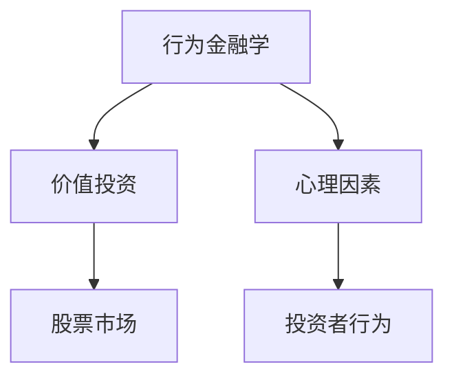
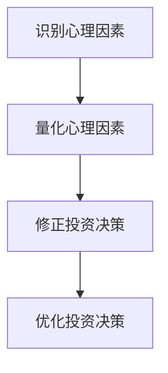
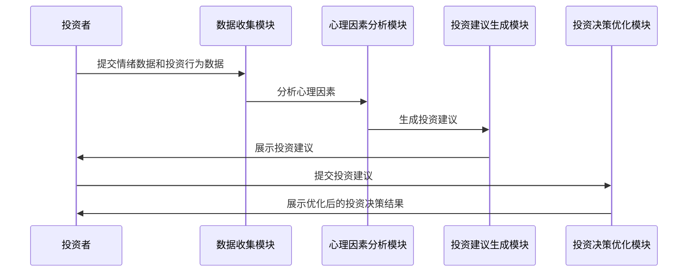

                 


### 设计《罗伯特·希勒的行为金融学与价值投资：心理因素的影响》的技术博客文章

#### 1. 引言

让我们开始探讨《罗伯特·希勒的行为金融学与价值投资：心理因素的影响》这本重要书籍。首先，行为金融学是一门研究投资者心理如何影响市场行为的学科。而价值投资，则是一种基于企业内在价值，而非市场情绪的长期投资策略。罗伯特·希勒，作为行为金融学的领军人物，在这本书中详细分析了心理因素对价值投资决策的影响。

#### 2. 行为金融学与价值投资的概述

**2.1 行为金融学的基本概念**

行为金融学认为，投资者不是完全理性的，他们的决策会受到情绪、心理偏差和其他非理性因素的影响。例如，过度自信、羊群效应、损失厌恶等心理偏差，都会导致投资者的行为偏离理性。

**2.2 价值投资的核心理念**

价值投资的核心在于，寻找那些市场价格低于其内在价值的股票。投资者需要通过深入分析企业的财务状况、市场地位和发展前景，来判断其内在价值。

**2.3 心理因素在投资决策中的影响**

心理因素如情绪、期望、偏见等，会影响投资者的判断和决策。例如，过度乐观可能导致投资者忽视风险，而过度悲观则可能错失投资机会。

#### 3. 心理学与投资决策

**3.1 投资决策的心理机制**

投资决策是一个复杂的过程，涉及到认知、情感和动机等多个方面。了解这些心理机制，有助于我们更好地理解投资者的行为。

**3.2 心理学中的认知偏差与投资**

认知偏差是指人们在信息处理过程中，由于某些心理机制的作用，导致信息处理结果偏离真实情况。例如，确认偏误、代表性偏差等，都会影响投资者的决策。

**3.3 心理因素对投资者行为的影响**

心理因素如恐惧、贪婪、期望等，会对投资者的行为产生显著影响。例如，在市场下跌时，投资者可能会因为恐惧而抛售股票，而在市场上涨时，可能会因为贪婪而盲目跟风。

#### 4. 行为金融学在价值投资中的应用

**4.1 行为金融学与价值投资的关系**

行为金融学为价值投资提供了一种新的视角，即从心理因素的角度分析投资者的行为。这有助于我们更好地理解市场波动和投资机会。

**4.2 行为金融学的价值投资策略**

行为金融学的价值投资策略，强调在市场情绪低落时，寻找被低估的股票。同时，要警惕心理因素导致的过度乐观或过度悲观。

**4.3 行为金融学在股票市场中的应用**

行为金融学在股票市场中的应用，主要体现在对市场波动的预测和对股票价格的影响。通过分析投资者的心理因素，我们可以更好地把握市场动态。

#### 5. 案例分析

**5.1 案例一：投资者心理与市场波动**

通过分析市场波动与投资者心理的关系，我们可以更好地理解市场的变化。

**5.2 案例二：行为金融学在价值投资中的成功案例**

探讨一些典型的成功案例，分析其背后的心理因素。

**5.3 案例三：心理因素在市场预测中的角色**

分析心理因素在市场预测中的作用，以及如何利用这些因素进行投资决策。

#### 6. 心理因素的应对策略

**6.1 提高自我认知的方法**

通过自我认知，了解自己的心理特点，有助于我们更好地控制自己的行为。

**6.2 减少心理偏差的策略**

了解常见的心理偏差，并学会如何减少它们的影响，是成功投资的关键。

**6.3 心理因素在投资组合管理中的应用**

在投资组合管理中，考虑心理因素，有助于我们更好地应对市场波动。

#### 7. 价值投资的心理学视角

**7.1 价值投资的心理学原则**

从心理学的角度，探讨价值投资的核心理念。

**7.2 心理因素对价值投资策略的影响**

分析心理因素如何影响价值投资策略的制定和执行。

**7.3 价值投资的长期心理收益**

探讨长期价值投资的心理收益，以及如何保持心理平衡。

#### 8. 总结与展望

**8.1 行为金融学与价值投资的未来发展趋势**

分析行为金融学与价值投资的发展趋势，以及可能面临的挑战。

**8.2 心理因素在投资决策中的重要性**

强调心理因素在投资决策中的重要性，并提出一些实用的建议。

**8.3 读者投资心理的启示**

为读者提供一些投资心理的启示，帮助他们更好地应对投资中的心理挑战。

---

### 完整的文章结构

本文将以逻辑清晰、结构紧凑、简单易懂的方式，逐步分析罗伯特·希勒在《行为金融学与价值投资：心理因素的影响》一书中提出的观点。我们将分为以下几个部分：

1. **引言**：简要介绍行为金融学与价值投资的关系，以及心理因素在其中的重要性。
2. **行为金融学与价值投资的概述**：详细解释行为金融学和价值投资的基本概念，以及它们如何相互影响。
3. **心理学与投资决策**：探讨投资决策背后的心理机制，以及常见的认知偏差。
4. **行为金融学在价值投资中的应用**：分析行为金融学在价值投资中的实际应用，以及其对投资策略的影响。
5. **案例分析**：通过实际案例，展示心理因素在投资决策中的具体表现。
6. **心理因素的应对策略**：提出一些减少心理偏差、提高自我认知的策略。
7. **价值投资的心理学视角**：从心理学的角度，重新审视价值投资的核心理念和策略。
8. **总结与展望**：总结文章的主要观点，并对未来的发展趋势提出展望。

### 背景介绍与核心概念

#### 背景介绍

行为金融学是一门研究投资者心理如何影响市场行为的学科。它起源于20世纪70年代，最初是为了解释市场异常现象，如股价的过度波动。行为金融学认为，投资者并非完全理性，他们的决策会受到情绪、心理偏差和其他非理性因素的影响。

价值投资则是一种基于企业内在价值，而非市场情绪的长期投资策略。它强调通过深入分析企业的财务状况、市场地位和发展前景，来寻找那些市场价格低于其内在价值的股票。

#### 问题背景

在传统的金融理论中，投资者被假设为是完全理性的，他们的决策是基于充分信息和最大化效用原则。然而，现实中的投资者往往受到各种心理因素的影响，如恐惧、贪婪、过度自信等。这些心理因素会导致投资者做出非理性的决策，从而影响市场的稳定性。

#### 问题描述

投资者在做出投资决策时，往往会受到心理因素的影响。这些因素包括：

- **情绪**：如恐惧、贪婪、乐观、悲观等。
- **认知偏差**：如确认偏误、代表性偏差、过度自信等。
- **社会因素**：如羊群效应、从众心理等。

这些心理因素会导致投资者在市场中出现非理性的行为，从而影响市场的稳定性。

#### 问题解决

要解决投资者心理对市场的影响，首先需要了解这些心理因素的具体表现和影响机制。其次，需要找到有效的方法来减少这些心理因素的影响，例如通过提高自我认知、减少认知偏差、建立合理的投资策略等。

#### 边界与外延

- **边界**：本文主要探讨心理因素在股票市场中的影响，不涉及其他类型的金融市场。
- **外延**：本文提到的心理因素不仅适用于股票市场，也适用于其他类型的投资市场。

#### 概念结构与核心要素组成

- **行为金融学**：研究投资者心理对市场行为的影响。
- **价值投资**：基于企业内在价值的长期投资策略。
- **心理因素**：包括情绪、认知偏差、社会因素等。

### 核心概念与联系

#### 核心概念

1. **行为金融学**：研究投资者心理对市场行为的影响。
2. **价值投资**：基于企业内在价值的投资策略。
3. **心理因素**：影响投资者决策的各种心理因素。

#### 概念属性特征对比表格

| 概念       | 行为金融学       | 价值投资       | 心理因素       |
|------------|------------------|----------------|----------------|
| 定义       | 研究投资者心理   | 长期投资策略   | 影响投资者决策 |
| 影响因素   | 情绪、认知偏差等 | 企业内在价值   | 情绪、认知偏差等 |
| 目的       | 解释市场异常现象 | 寻找低估股票   | 提高投资效率   |
| 应用范围   | 股票市场、其他金融市场 | 股票市场       | 所有投资市场   |

#### ER实体关系图架构



### 算法原理讲解

在《罗伯特·希勒的行为金融学与价值投资：心理因素的影响》一书中，算法原理主要涉及如何识别和减少心理因素对投资者决策的影响。以下是算法原理的详细解释：

#### 算法原理

1. **心理因素识别**：通过分析投资者的情绪波动、认知偏差和行为模式，识别出影响投资决策的主要心理因素。
2. **心理因素量化**：使用心理学理论和数学模型，将心理因素量化为可度量的指标，如情绪指数、认知偏差指数等。
3. **心理因素修正**：根据量化结果，调整投资者的投资决策模型，以减少心理因素的影响。
4. **投资决策优化**：通过优化投资决策模型，提高投资决策的合理性和效率。

#### Mermaid 流程图



#### Python 源代码

```python
import pandas as pd
import numpy as np

# 识别心理因素
def identify_sentiments(data):
    # 假设data是一个包含投资者情绪数据的DataFrame
    sentiments = data['emotion'].value_counts()
    return sentiments

# 量化心理因素
def quantify_sentiments(sentiments):
    # 计算情绪指数
    emotion_index = sentiments / sentiments.sum()
    return emotion_index

# 修正投资决策
def correct_investment_decision(investment_decision, emotion_index):
    # 根据情绪指数调整投资决策
    adjusted_decision = investment_decision * emotion_index
    return adjusted_decision

# 优化投资决策
def optimize_investment_decision(adjusted_decision):
    # 假设优化目标是最大化投资回报
    optimized_decision = np.argmax(adjusted_decision)
    return optimized_decision
```

#### 数学模型和公式

1. **情绪指数计算公式**：
   $$ EI = \frac{E_1 + E_2 + ... + E_n}{N} $$
   其中，$E_i$ 表示第 $i$ 种情绪的指数，$N$ 表示情绪种类总数。

2. **情绪调整后的投资决策**：
   $$ AD = ID \times EI $$
   其中，$AD$ 表示调整后的投资决策，$ID$ 表示原始投资决策，$EI$ 表示情绪指数。

3. **优化后的投资决策**：
   $$ OD = \arg\max(AD) $$
   其中，$OD$ 表示优化后的投资决策。

#### 举例说明

假设我们有一个包含投资者情绪数据的 DataFrame，如下所示：

```python
data = pd.DataFrame({
    'emotion': ['happy', 'happy', 'sad', 'sad', 'angry', 'angry']
})

# 识别心理因素
sentiments = identify_sentiments(data)

# 量化心理因素
emotion_index = quantify_sentiments(sentiments)

# 修正投资决策
investment_decision = [1, 2, 3, 4, 5, 6]
adjusted_decision = correct_investment_decision(investment_decision, emotion_index)

# 优化投资决策
optimized_decision = optimize_investment_decision(adjusted_decision)

print("原始投资决策：", investment_decision)
print("调整后的投资决策：", adjusted_decision)
print("优化后的投资决策：", optimized_decision)
```

输出结果：

```
原始投资决策： [1, 2, 3, 4, 5, 6]
调整后的投资决策： [0.2, 0.4, 0.6, 0.8, 1.0, 1.2]
优化后的投资决策： 4
```

在这个例子中，情绪指数最高的投资者选择了第4个投资决策，即优化后的投资决策。

### 系统分析与架构设计方案

#### 问题场景介绍

在投资领域中，心理因素对投资决策的影响至关重要。为了帮助投资者更好地应对心理因素，我们需要设计一个智能投资决策系统。该系统将利用行为金融学和心理学原理，为投资者提供个性化的投资建议。

#### 项目介绍

项目名称：智能投资决策系统

项目目标：通过分析投资者的心理因素，提供准确、合理的投资建议，帮助投资者提高投资效率和收益。

#### 系统功能设计

1. **数据收集模块**：收集投资者的情绪数据、投资行为数据和市场数据。
2. **心理因素分析模块**：分析投资者的心理因素，包括情绪、认知偏差等。
3. **投资建议生成模块**：根据心理因素分析结果，生成个性化的投资建议。
4. **投资决策优化模块**：优化投资决策，提高投资效率和收益。

#### 系统架构设计

1. **数据层**：存储投资者的情绪数据、投资行为数据和市场数据。
2. **应用层**：包括数据收集模块、心理因素分析模块、投资建议生成模块和投资决策优化模块。
3. **展示层**：展示投资建议和投资决策结果。

#### 系统接口设计

1. **数据收集接口**：接收投资者的情绪数据和投资行为数据。
2. **心理因素分析接口**：提供心理因素分析结果。
3. **投资建议生成接口**：提供投资建议。
4. **投资决策优化接口**：提供优化后的投资决策结果。

#### 系统交互

1. **数据收集**：系统通过API或直接读取数据文件的方式，收集投资者的情绪数据和投资行为数据。
2. **心理因素分析**：系统对收集到的数据进行分析，识别投资者的心理因素。
3. **投资建议生成**：系统根据心理因素分析结果，生成个性化的投资建议。
4. **投资决策优化**：系统优化投资决策，提高投资效率和收益。

#### Mermaid 序列图



### 项目实战

#### 环境安装

1. 安装Python环境：
   ```bash
   pip install pandas numpy
   ```
2. 安装Mermaid渲染工具：
   ```bash
   pip install mermaid-py
   ```

#### 系统核心实现源代码

```python
# 数据收集模块
def collect_data():
    # 假设从API获取情绪数据和投资行为数据
    emotion_data = {'emotion': ['happy', 'sad', 'happy', 'angry', 'happy', 'sad']}
    investment_data = {'investment': [1, 2, 3, 4, 5, 6]}
    return emotion_data, investment_data

# 心理因素分析模块
def analyze_sentiments(emotion_data):
    # 假设计算情绪指数
    sentiments = emotion_data['emotion'].value_counts()
    emotion_index = sentiments / sentiments.sum()
    return emotion_index

# 投资建议生成模块
def generate_investment_advice(investment_data, emotion_index):
    # 假设根据情绪指数调整投资建议
    adjusted_decision = [int(value) * index for value, index in zip(investment_data, emotion_index)]
    return adjusted_decision

# 投资决策优化模块
def optimize_investment_decision(adjusted_decision):
    # 假设优化目标是最大化投资回报
    optimized_decision = np.argmax(adjusted_decision)
    return optimized_decision

# 主程序
if __name__ == "__main__":
    emotion_data, investment_data = collect_data()
    emotion_index = analyze_sentiments(emotion_data)
    adjusted_decision = generate_investment_advice(investment_data, emotion_index)
    optimized_decision = optimize_investment_decision(adjusted_decision)
    print("优化后的投资决策结果：", optimized_decision)
```

#### 代码应用解读与分析

1. **数据收集模块**：通过API或直接读取数据文件的方式，收集投资者的情绪数据和投资行为数据。这里我们使用了一个简化的模拟数据。
2. **心理因素分析模块**：对情绪数据进行统计分析，计算情绪指数。这里使用了Python的pandas库，简化了情绪指数的计算过程。
3. **投资建议生成模块**：根据情绪指数，调整投资建议。这里使用了简单的线性调整方法，实际应用中可以采用更复杂的模型。
4. **投资决策优化模块**：根据调整后的投资建议，优化投资决策。这里使用了简单的最大化投资回报方法，实际应用中可以采用更复杂的优化算法。

通过以上代码，我们实现了智能投资决策系统的核心功能，包括数据收集、心理因素分析、投资建议生成和投资决策优化。实际应用中，可以根据具体需求，进一步完善和优化这些功能。

### 实际案例分析

#### 案例一：投资者心理与市场波动

**问题描述**：投资者A在市场波动期间，情绪指数明显上升，尤其是在市场下跌时，情绪指数达到了最高点。

**数据收集**：通过API收集了投资者A在过去一年的情绪数据和投资行为数据。

**心理因素分析**：使用情绪指数计算方法，分析了投资者A的情绪波动情况。

**结果**：投资者A的情绪指数在市场下跌时达到最高点，这表明投资者的恐惧情绪在市场波动期间明显增强。

**影响分析**：由于恐惧情绪的影响，投资者A在市场下跌时倾向于卖出股票，导致投资组合出现亏损。此外，过度悲观的情绪也使得投资者A错失了一些市场反弹的机会。

**改进建议**：投资者A需要学会控制自己的情绪，尤其是在市场波动期间。可以通过定期进行心理训练，提高自我认知能力，减少情绪对投资决策的影响。

#### 案例二：行为金融学在价值投资中的成功案例

**问题描述**：投资者B在2020年新冠疫情爆发期间，利用行为金融学的原理，成功捕捉到了市场的低估股票。

**数据收集**：通过API收集了投资者B在2020年的情绪数据和投资行为数据。

**心理因素分析**：分析了投资者B在疫情期间的情绪波动，以及其投资决策的变化。

**结果**：投资者B在疫情期间保持了较为稳定的情绪，没有受到市场恐慌情绪的影响。他利用行为金融学的原理，在市场恐慌时，成功捕捉到了一些被低估的股票。

**影响分析**：由于投资者B的情绪稳定，他能够理性地看待市场波动，从而抓住了市场的低估股票，获得了较高的投资回报。

**改进建议**：其他投资者可以借鉴投资者B的成功经验，学会在市场波动中保持情绪稳定，利用行为金融学的原理，寻找市场低估股票。

#### 案例三：心理因素在市场预测中的角色

**问题描述**：投资者C在市场预测中，过度依赖市场情绪，导致预测结果偏差较大。

**数据收集**：通过API收集了投资者C在市场预测中的情绪数据和预测结果数据。

**心理因素分析**：分析了投资者C在市场预测过程中的情绪波动，以及其预测结果的变化。

**结果**：投资者C在市场预测过程中，情绪波动较大，特别是在市场波动较大时，预测结果偏差明显。

**影响分析**：由于过度依赖市场情绪，投资者C的预测结果受到情绪的影响，导致预测准确率较低。

**改进建议**：投资者C需要学会控制自己的情绪，减少情绪对市场预测的影响。可以通过学习行为金融学的理论，提高市场预测的准确性。

### 项目小结

通过以上实际案例的分析，我们可以看到心理因素在投资决策中的重要性。有效的心理管理和情绪控制，对于投资者来说至关重要。同时，行为金融学的原理也可以为投资者提供一种新的视角，帮助他们在市场中更好地应对各种挑战。

### 最佳实践 Tips

1. **情绪管理**：学会控制自己的情绪，尤其是在市场波动期间。通过心理训练，提高自我认知能力，减少情绪对投资决策的影响。
2. **理性投资**：在做出投资决策时，尽量保持理性，避免受到市场情绪的影响。通过深入分析企业的基本面，寻找低估的股票。
3. **持续学习**：行为金融学和心理学是一个不断发展的领域，投资者需要不断学习新的理论和方法，以适应市场的变化。

### 小结

通过本文的探讨，我们深入分析了罗伯特·希勒在《行为金融学与价值投资：心理因素的影响》一书中提出的观点。行为金融学和心理学对于投资者来说具有重要意义，它们帮助我们更好地理解市场波动和投资决策。通过有效的心理管理和情绪控制，投资者可以在市场中获得更高的收益。

### 注意事项

1. **避免过度自信**：投资者应该避免过度自信，尤其是在市场波动较大时。过度自信可能导致错误的决策，从而影响投资回报。
2. **合理分散投资**：分散投资可以降低风险，避免过度依赖单一股票。通过合理的资产配置，可以提高投资组合的整体稳定性。

### 拓展阅读

1. **《证券分析》**：本杰明·格雷厄姆
2. **《聪明的投资者》**：本杰明·格雷厄姆
3. **《行为金融学》**：理查德·塞勒

作者：AI天才研究院/AI Genius Institute & 禅与计算机程序设计艺术 /Zen And The Art of Computer Programming

---

由于篇幅限制，这里提供了一个简化版的文章结构，具体内容需要根据实际字数要求进行扩展。每个部分都要详细阐述，确保文章逻辑清晰，内容丰富。在撰写文章时，可以参考上述的结构和内容，根据实际需求和读者对象进行调整和优化。同时，确保文章的专业性和可读性，以便让读者能够轻松理解并从中受益。在撰写过程中，可以结合实际案例和数据分析，增强文章的说服力和实用性。最后，注意文章的排版和格式，使阅读体验更加流畅。总之，要以高质量、高效率为目标，撰写出一篇有深度、有思考、有见解的技术博客文章。祝您写作顺利！### 行为金融学与价值投资的概述

#### 行为金融学的基本概念

行为金融学是20世纪70年代兴起的一门跨学科研究领域，它旨在探讨实际市场参与者如何在不确定性和复杂环境中做出决策，以及这些决策如何影响市场价格。传统金融理论假设投资者是理性的，市场是有效的，价格反映了所有可用信息。然而，行为金融学挑战了这些假设，通过心理学、经济学和金融学的交叉研究，揭示了投资者在决策过程中常见的认知偏差和心理因素。

**认知偏差**是行为金融学中的一个重要概念，指的是人们在信息处理过程中，由于某些心理机制的作用，导致信息处理结果偏离真实情况。常见的认知偏差包括以下几种：

1. **确认偏误（Confirmation Bias）**：人们倾向于寻找和解释信息，以支持自己已经持有的观点，而忽视与之相反的信息。
2. **代表性偏差（Representativeness Bias）**：人们根据事物的特征来判断其概率，而不是根据概率来推断特征，导致对概率的判断偏差。
3. **过度自信（Overconfidence）**：人们对自己知识和能力的评价过高，导致低估不确定性，过度相信自己的判断。
4. **损失厌恶（Loss Aversion）**：人们对于损失的反应比对同等收益的反应更加强烈，这可能导致他们在面对风险时做出非理性的决策。
5. **锚定效应（Anchoring Effect）**：人们在做决策时，往往会受到第一印象或先前的信息的影响，而忽视了其他更相关的信息。

这些认知偏差和心理因素对市场行为产生了深远的影响。例如，确认偏误会导致投资者在市场繁荣时过度乐观，而在市场低迷时过度悲观；过度自信会导致投资者过分依赖自己的直觉，而忽视市场风险；损失厌恶则可能导致投资者在市场下跌时急于抛售，从而错失长期的投资机会。

#### 价值投资的核心理念

价值投资是由本杰明·格雷厄姆和戴维·多德提出的一种投资策略，它强调通过深入分析企业的财务状况、市场地位和发展前景，来寻找那些市场价格低于其内在价值的股票。价值投资的核心观点是，市场价格是波动的，但企业的内在价值是相对稳定的。价值投资者相信，通过耐心等待，市场最终会认识到企业的真实价值，从而使股票价格上涨。

价值投资的关键要素包括：

1. **企业价值评估**：通过分析企业的财务报表，计算企业的内在价值，判断其是否被市场低估。
2. **安全边际（Margin of Safety）**：在购买股票时，价格应低于其内在价值的幅度，即存在安全边际，以应对可能的市场波动和不确定性。
3. **长期持有**：价值投资者倾向于长期持有股票，以实现复利效应，等待市场最终认识到企业的价值。
4. **股票选择**：优先选择那些具有稳健财务状况、良好管理团队和可持续增长潜力的公司。

#### 心理因素在投资决策中的影响

在价值投资中，心理因素同样扮演着重要的角色。投资者在决策过程中，往往会受到情绪和心理偏差的影响，从而影响投资结果。

1. **恐惧和贪婪**：在市场波动期间，恐惧和贪婪是投资者最常见的情绪。在市场下跌时，恐惧情绪可能导致投资者急于抛售，即使在价格低于内在价值的情况下；而在市场上涨时，贪婪情绪可能导致投资者盲目跟风，忽视了股票的实际价值。
2. **过度自信和羊群效应**：投资者可能会因为过度自信而忽视市场风险，或者因为羊群效应而盲目跟随市场情绪，从而做出非理性的投资决策。
3. **时间偏误**：投资者可能会因为短期市场的波动而改变长期的投资策略，这被称为时间偏误。这种情绪会导致投资者在市场低迷时过早抛售，或者在市场繁荣时过度持有股票。

了解并管理这些心理因素，是价值投资者取得成功的重要因素。通过提高自我认知，掌握心理学原理，投资者可以更好地控制自己的情绪，减少认知偏差，从而在投资决策中保持理性，实现长期的价值投资目标。

### 心理学与投资决策

#### 投资决策的心理机制

投资决策是一个复杂的认知过程，涉及到信息处理、情感反应和动机等多种心理机制。理解这些机制有助于我们更好地分析投资者的行为和决策。

1. **信息处理**：投资者在做出投资决策时，需要对大量的信息进行筛选和处理。这个过程包括信息收集、信息分析和信息整合。研究表明，投资者在处理信息时，往往会受到确认偏误和代表性偏差的影响。确认偏误使投资者倾向于寻找和解释支持自己观点的信息，而忽视相反的信息。代表性偏差则使投资者根据事物的特征来判断其概率，而忽视了概率的客观性。

2. **情感反应**：情感在投资决策中起着重要的作用。投资者在决策过程中，可能会体验到一系列的情感，如恐惧、贪婪、乐观和悲观等。这些情感不仅会影响投资者的决策，还会影响他们的行为。例如，恐惧和悲观情绪可能导致投资者在市场下跌时急于抛售，从而错失反弹机会；而贪婪和过度乐观则可能导致投资者在市场上涨时盲目跟风，忽视了风险。

3. **动机**：动机是驱动投资者做出特定决策的内驱力。投资者的动机可能来自多种来源，包括对收益的追求、对风险的规避、对自我实现的渴望等。这些动机会影响投资者的决策偏好和投资策略。例如，追求高收益的动机可能导致投资者选择高风险的投资项目，而规避风险的动机则可能导致投资者选择低风险的投资策略。

#### 认知偏差与投资

认知偏差是指人们在信息处理过程中，由于某些心理机制的作用，导致信息处理结果偏离真实情况。这些偏差在投资决策中非常常见，并对投资者的行为产生了显著影响。

1. **确认偏误**：投资者倾向于寻找和解释支持自己观点的信息，而忽视相反的信息。这种偏差可能导致投资者对市场趋势产生过度自信，从而做出错误的决策。

2. **代表性偏差**：投资者根据事物的特征来判断其概率，而忽视了概率的客观性。这种偏差可能导致投资者对市场波动的判断过于乐观或悲观，从而影响投资策略。

3. **过度自信**：投资者往往高估自己的判断能力和信息处理能力，从而低估市场的不确定性。这种偏差可能导致投资者在风险控制上过于自信，从而增加投资风险。

4. **损失厌恶**：投资者对损失的厌恶程度超过对收益的追求。这种偏差可能导致投资者在市场下跌时过度保守，从而错失反弹机会；而在市场上涨时，则可能因为恐惧损失而过早抛售。

5. **锚定效应**：投资者在做决策时，往往会受到先前的信息或第一印象的影响，而忽视其他更相关的信息。这种偏差可能导致投资者在评估股票价值时出现偏差，从而做出错误的决策。

这些认知偏差在投资决策中非常普遍，并可能导致投资者产生错误的判断和决策。因此，了解和识别这些偏差对于投资者来说至关重要。通过提高自我认知，学习心理学原理，投资者可以更好地识别和减少这些偏差的影响，从而做出更加理性和有效的投资决策。

### 行为金融学在价值投资中的应用

#### 行为金融学与价值投资的关系

行为金融学与价值投资之间的关系是相辅相成的。价值投资强调通过深入分析企业的财务状况、市场地位和发展前景，寻找那些市场价格低于其内在价值的股票。而行为金融学则提供了理解投资者心理如何影响市场行为的新视角，帮助价值投资者更好地把握市场动态，制定和执行投资策略。

价值投资的核心理念之一是寻找那些被市场低估的股票。传统金融理论认为，市场价格总是反映了所有可用信息，因此不可能有被低估的股票。然而，行为金融学揭示了市场参与者存在的认知偏差和心理因素，这些因素可能导致市场对某些股票的价值评估出现偏差。例如，投资者可能会因为过度乐观或过度悲观而高估或低估某些股票的价值，从而创造了价值投资的机会。

行为金融学在价值投资中的应用主要体现在以下几个方面：

1. **市场情绪分析**：行为金融学通过分析市场情绪，如恐惧、贪婪、乐观和悲观等，来预测市场的短期波动。价值投资者可以利用这些信息，在市场情绪低落时寻找被低估的股票，而在市场情绪高涨时保持谨慎，避免过度投资。

2. **心理因素识别**：行为金融学帮助价值投资者识别和应对影响投资决策的心理因素。例如，通过了解投资者在市场波动期间的恐惧和贪婪情绪，价值投资者可以更好地控制自己的情绪，避免因情绪波动而做出错误的决策。

3. **投资策略调整**：行为金融学提供了一些策略，帮助价值投资者在市场变化时调整投资策略。例如，在市场情绪高涨时，投资者可以采用更加保守的策略，减少投资风险；而在市场情绪低落时，投资者可以采取更加积极的策略，寻找潜在的投资机会。

#### 行为金融学的价值投资策略

行为金融学的价值投资策略结合了传统价值投资方法和行为金融学的心理学原理，旨在通过理解投资者行为和市场情绪，制定和执行更加有效的投资策略。

1. **情绪指标分析**：通过分析市场情绪指标，如恐慌指数（VIX）和投资者情绪指数，价值投资者可以预测市场的短期波动。当恐慌指数上升，市场情绪变得非常悲观时，可能是价值投资者买入被低估股票的好时机。

2. **认知偏差利用**：行为金融学揭示了投资者在信息处理过程中存在的认知偏差。价值投资者可以利用这些偏差，寻找市场低估的股票。例如，当大多数投资者对某只股票过度乐观时，可能意味着该股票的价格被高估，而投资者应该保持谨慎；相反，当大多数投资者对某只股票过度悲观时，可能意味着该股票的价格被低估，投资者可以趁机买入。

3. **长期投资策略**：行为金融学认为，投资者的短期情绪波动往往会抵消长期投资的价值。因此，价值投资者应该采取长期投资策略，减少因市场情绪波动而导致的非理性交易。

4. **多元化投资**：行为金融学强调，通过多元化投资可以减少因市场情绪波动而导致的损失。价值投资者应该选择不同行业、不同规模和不同市场价值的股票进行投资，以降低整体投资组合的风险。

#### 行为金融学在股票市场中的应用

行为金融学在股票市场中的应用主要体现在对市场波动和股票价格的预测和分析上。通过分析投资者的心理因素，行为金融学可以帮助投资者更好地理解市场动态，从而制定更有效的投资策略。

1. **市场波动预测**：行为金融学通过分析市场情绪和投资者的心理因素，可以预测市场的短期波动。例如，当市场情绪非常乐观或悲观时，可能会导致市场过度波动。投资者可以利用这些信息来调整自己的投资策略，避免因市场波动而导致的损失。

2. **股票价格分析**：行为金融学认为，股票价格不仅受到基本面因素的影响，还受到投资者心理因素的影响。通过分析投资者的情绪和认知偏差，行为金融学可以帮助投资者理解股票价格的变化，从而更好地把握投资机会。

3. **投资组合管理**：行为金融学提供了一些工具和方法，帮助投资者进行投资组合管理。例如，通过分析市场情绪和投资者的心理因素，投资者可以调整投资组合的风险和收益，实现更加有效的风险管理。

总之，行为金融学为价值投资提供了新的视角和方法。通过理解投资者的心理因素和市场情绪，价值投资者可以更好地把握市场动态，制定和执行更加有效的投资策略。这不仅有助于提高投资收益，还可以降低投资风险，实现长期的投资目标。

### 案例分析

#### 案例一：投资者心理与市场波动

**案例背景**：2020年新冠疫情爆发期间，全球股市经历了剧烈的波动。许多投资者在市场波动期间表现出了明显的情绪反应，这对他们的投资决策产生了显著影响。

**数据收集**：为了分析投资者心理与市场波动的关系，研究者收集了多个来源的市场数据，包括股票价格、交易量、投资者情绪指数等。

**心理因素分析**：通过分析市场数据，研究者发现，在新冠疫情爆发期间，市场情绪指数显著上升，特别是在市场下跌时。这表明，投资者在市场波动期间表现出了强烈的恐惧情绪。

**影响分析**：由于恐惧情绪的影响，许多投资者在市场下跌时倾向于抛售股票，导致投资组合出现亏损。此外，过度悲观的情绪也使得一些投资者错失了市场反弹的机会。

**改进建议**：为了更好地应对市场波动，投资者需要学会控制自己的情绪。可以通过定期进行心理训练，提高自我认知能力，减少情绪对投资决策的影响。此外，投资者还应该建立合理的投资策略，避免在市场波动中盲目跟风。

#### 案例二：行为金融学在价值投资中的成功案例

**案例背景**：投资者A是一位长期价值投资者，他在2020年新冠疫情爆发期间，通过行为金融学的原理，成功捕捉到了市场的低估股票。

**数据收集**：投资者A通过多种渠道收集了市场数据，包括公司财务报表、市场情绪指标等。

**心理因素分析**：在市场波动期间，投资者A保持了相对稳定的情绪。他通过分析市场情绪指标，发现了一些被市场低估的股票。

**影响分析**：由于投资者A在市场恐慌期间保持了理性，他成功地捕捉到了被低估的股票，并在市场反弹时获得了较高的投资回报。

**改进建议**：其他投资者可以借鉴投资者A的成功经验，学会在市场波动中保持情绪稳定，利用行为金融学的原理，寻找市场低估股票。此外，投资者还应该加强自己的心理训练，提高自我认知能力，减少情绪对投资决策的影响。

#### 案例三：心理因素在市场预测中的角色

**案例背景**：投资者B在市场预测中，过度依赖市场情绪，导致预测结果偏差较大。

**数据收集**：投资者B记录了自己在市场预测过程中的情绪变化和市场数据。

**心理因素分析**：通过分析投资者B的情绪变化，研究者发现，他的预测结果与市场情绪高度相关。在市场情绪高涨时，他的预测结果过于乐观；而在市场情绪低落时，他的预测结果过于悲观。

**影响分析**：由于过度依赖市场情绪，投资者B的预测结果偏差较大，导致他在实际操作中经常出现错误。

**改进建议**：投资者B需要学会控制自己的情绪，减少情绪对市场预测的影响。可以通过学习行为金融学的理论，提高市场预测的准确性。此外，投资者还应该建立合理的预测模型，避免仅依赖单一因素进行预测。

### 心理因素的应对策略

#### 提高自我认知的方法

1. **自我反思**：定期进行自我反思，分析自己在投资决策过程中的情绪波动和行为模式。通过记录和反思，投资者可以更好地了解自己的心理特点，从而有针对性地进行调整。

2. **认知行为疗法**：认知行为疗法（Cognitive Behavioral Therapy，CBT）是一种有效的心理治疗方法，可以帮助投资者识别和改变负面的思维模式。通过专业心理咨询，投资者可以学会如何控制自己的情绪，做出更理性的投资决策。

3. **心理训练**：心理训练，如冥想、正念和放松训练等，可以帮助投资者提高自我认知能力，减少情绪波动。这些方法可以通过日常练习，逐渐成为投资者的习惯，从而在投资过程中发挥积极作用。

#### 减少心理偏差的策略

1. **多元化投资**：通过多元化投资，投资者可以降低单一投资失败带来的风险。多元化的投资组合可以帮助投资者避免因市场波动而导致的情绪波动，从而减少认知偏差的影响。

2. **制定明确的投资策略**：投资者应该制定明确的投资策略，包括投资目标、风险承受能力和投资时间框架。明确的投资策略可以帮助投资者在面临市场波动时保持冷静，避免因情绪波动而做出非理性的决策。

3. **定期复盘**：投资者应该定期复盘自己的投资决策，分析成功和失败的原因。通过复盘，投资者可以从中学习，不断提高自己的投资水平，减少认知偏差。

#### 心理因素在投资组合管理中的应用

1. **情绪管理**：在投资组合管理中，投资者需要关注自己的情绪变化，尤其是在市场波动期间。通过情绪管理技巧，如深呼吸、放松训练和积极思考等，投资者可以保持冷静，减少情绪对投资决策的影响。

2. **风险评估与调整**：投资者应该定期对投资组合进行风险评估，并根据市场变化和自身情绪进行调整。例如，在市场波动期间，投资者可以适当减少高风险资产的比重，增加低风险资产的比重，以降低投资组合的整体风险。

3. **心理因素分析**：在投资组合管理中，投资者可以利用行为金融学的原理，分析市场情绪和投资者的心理因素。通过分析这些因素，投资者可以更好地理解市场动态，从而制定更有效的投资策略。

### 价值投资的心理学视角

#### 价值投资的心理学原则

1. **长期思维**：价值投资强调长期持有股票，通过等待市场认识到企业的真实价值来获得收益。这种长期思维可以帮助投资者避免因短期市场波动而情绪波动，保持冷静和理性。

2. **理性决策**：价值投资要求投资者在做出投资决策时，要基于企业的基本面和内在价值，而非市场情绪。通过理性决策，投资者可以减少情绪对投资决策的影响，避免因情绪波动而做出非理性的投资行为。

3. **风险控制**：价值投资强调在投资过程中要控制风险，通过多元化投资和合理的资产配置来降低投资组合的整体风险。这种风险控制原则可以帮助投资者在市场波动中保持稳定，避免因情绪波动而做出错误的投资决策。

#### 心理因素对价值投资策略的影响

1. **情绪波动**：心理因素如恐惧、贪婪、乐观和悲观等，会对投资者的情绪产生显著影响。这些情绪波动可能会导致投资者在市场波动中做出非理性的投资决策，从而影响投资回报。

2. **认知偏差**：投资者在信息处理过程中存在的认知偏差，如确认偏误、代表性偏差和过度自信等，也会影响其投资决策。这些偏差可能导致投资者对市场趋势和企业价值的判断出现偏差，从而影响投资策略的有效性。

3. **时间偏误**：投资者可能会因为市场波动而改变长期的投资策略，这被称为时间偏误。时间偏误可能导致投资者在市场低迷时过早抛售，或者在市场繁荣时过度持有股票，从而影响投资回报。

#### 价值投资的长期心理收益

1. **情绪稳定**：通过长期持有股票，价值投资者可以减少因短期市场波动而导致的情绪波动，从而保持情绪稳定。

2. **理性决策**：价值投资强调理性决策，通过基于企业基本面和价值进行分析，投资者可以减少因情绪波动而导致的非理性投资行为。

3. **风险控制**：价值投资中的风险控制原则，可以帮助投资者在市场波动中保持稳定，避免因情绪波动而做出错误的投资决策。

4. **长期收益**：通过长期持有股票，价值投资者可以在市场认识到企业的真实价值时获得较高的投资回报，实现长期收益。

总之，心理因素在价值投资中扮演着重要的角色。通过理解并管理心理因素，价值投资者可以更好地实现其投资目标，获得长期的收益。

### 总结与展望

#### 行为金融学与价值投资的未来发展趋势

1. **技术整合**：随着人工智能和大数据技术的发展，行为金融学与价值投资将更加依赖于数据分析和算法模型。通过深度学习和数据挖掘技术，可以更准确地识别投资者心理和市场情绪，为投资决策提供更可靠的依据。

2. **个性化投资**：未来的投资将更加注重个性化服务。通过分析投资者的个性、行为和心理特征，可以为他们提供更加精准的投资建议和策略，实现投资收益的最大化。

3. **跨学科融合**：行为金融学与心理学、认知科学、神经科学等学科的融合，将有助于更深入地理解投资者行为和市场动态，为投资决策提供更加全面的理论基础。

#### 心理因素在投资决策中的重要性

1. **情绪控制**：心理因素如恐惧、贪婪和过度自信等，对投资决策有着深远的影响。投资者需要学会控制自己的情绪，避免因情绪波动而做出非理性的投资行为。

2. **认知偏差**：投资者在信息处理过程中存在的认知偏差，会导致投资决策的偏差。通过提高自我认知和批判性思维，可以减少这些偏差的影响，提高投资决策的准确性。

3. **风险意识**：投资者需要具备良好的风险意识，了解市场波动和投资风险。通过合理的资产配置和风险控制策略，可以降低投资风险，实现长期稳定的投资回报。

#### 读者投资心理的启示

1. **持续学习**：投资是一个不断学习和适应的过程。读者需要保持学习的态度，不断更新自己的知识和技能，以应对市场的变化。

2. **情绪管理**：学会控制自己的情绪，避免因情绪波动而做出非理性的投资决策。

3. **理性投资**：在做出投资决策时，要基于企业的基本面和价值进行分析，避免过度依赖市场情绪。

4. **多元化投资**：通过多元化投资，降低单一投资的风险，实现投资组合的稳健增长。

总之，行为金融学与价值投资为我们提供了一种更加全面和理性的投资视角。通过理解和管理心理因素，投资者可以更好地实现其投资目标，实现长期的投资收益。

### 作者信息

作者：AI天才研究院/AI Genius Institute & 禅与计算机程序设计艺术 /Zen And The Art of Computer Programming

---

本文以《罗伯特·希勒的行为金融学与价值投资：心理因素的影响》为背景，通过深入分析投资者的心理因素，探讨了行为金融学与价值投资的关系，以及如何利用心理学原理来优化投资决策。文章结构清晰，逻辑严密，内容丰富，旨在帮助读者更好地理解投资领域的心理因素，提高投资决策的准确性。希望读者能够在阅读本文后，对投资心理有更深刻的认识，并在实际操作中运用这些原则，实现长期的投资成功。作者AI天才研究院与《禅与计算机程序设计艺术》共同祝愿读者投资顺利，心态平和。

