                 

## 《罗伯特·席勒的行为金融学与价值投资》

### 关键词：行为金融学、价值投资、市场心理、投资策略、风险管理

### 摘要：

罗伯特·席勒是一位著名的经济学家，以其在行为金融学领域的开创性工作而闻名。本文将深入探讨席勒的行为金融学与价值投资理论，分析其核心观点，以及这些理论在现实投资中的应用。我们将分步骤地思考，从行为金融学的基础概念入手，逐步延伸到价值投资的策略和实践。

#### 第一部分：行为金融学基础

### 第1章：行为金融学的兴起与重要性

**1.1.1 行为金融学的兴起背景**

行为金融学作为一门交叉学科，起源于20世纪70年代。当时，传统金融学在解释市场行为时遇到了瓶颈，无法解释诸如市场泡沫、投资者情绪等复杂现象。席勒的《非理性繁荣》一书，揭示了市场行为背后的心理机制，为行为金融学的发展奠定了基础。

**1.1.2 行为金融学的核心观点**

行为金融学认为，投资者在决策过程中受到多种心理因素的影响，如过度自信、羊群效应、心理账户等。这些心理偏差会导致市场出现非理性行为，与传统金融学假设的理性人模型有显著差异。

**1.1.3 行为金融学与经典金融学的对比**

与传统金融学相比，行为金融学更加关注市场参与者的行为和心理，强调市场的非理性和复杂性。这种差异使得行为金融学在解释市场波动和投资者行为时具有独特的优势。

### 第2章：行为金融学中的核心概念

**2.1.1 过度自信与风险偏好**

过度自信是指投资者高估自身能力和市场信息量的心理状态。这种偏差会导致投资者在风险偏好上产生偏差，过度承担风险。

**2.1.2 羊群效应与市场泡沫**

羊群效应是指投资者在信息不充分或情绪化的情况下，盲目跟从他人决策的现象。市场泡沫是羊群效应的极端表现，往往导致市场过度繁荣，最终破裂。

**2.1.3 心理账户与投资决策**

心理账户是指投资者将不同的资金来源和用途视为独立的账户，影响其投资决策。这种心理偏差可能导致投资者在处理不同投资时采取不同的策略。

**2.1.4 时间偏好与投资行为**

时间偏好是指投资者对当前消费和未来消费的偏好。这种偏好会影响投资者的投资决策，特别是在面对短期收益和长期收益时。

### 第3章：行为金融学与市场有效性

**3.1.1 市场有效性的挑战**

传统金融学假设市场是有效的，但行为金融学提出，市场受到心理偏差的影响，可能不是完全有效的。

**3.1.2 行为金融学对市场效率的影响**

行为金融学认为，心理偏差会导致市场出现非理性行为，影响市场效率。这些非理性行为可能是市场泡沫和市场崩溃的诱因。

**3.1.3 行为金融学与市场预测**

行为金融学为市场预测提供了一种新的视角，通过分析市场参与者的行为和心理，可以更好地预测市场的走势。

#### 第二部分：价值投资的哲学与策略

### 第4章：价值投资的理念

**4.1.1 价值投资的起源**

价值投资起源于20世纪30年代，由本杰明·格雷厄姆提出。席勒在《非理性繁荣》一书中，对价值投资进行了深入的分析和讨论。

**4.1.2 价值投资的核心理念**

价值投资的核心理念是寻找价格低于价值的股票，通过长期持有实现投资回报。席勒认为，价值投资在行为金融学的框架下，具有独特的优势。

**4.1.3 价值投资与行为金融学的联系**

价值投资强调投资决策的理性，与行为金融学中的理性投资理念相契合。然而，席勒指出，实际投资中，投资者往往难以克服心理偏差，实现价值投资的理想状态。

### 第5章：价值投资的评估方法

**5.1.1 基本面分析**

基本面分析是价值投资的重要工具，通过分析企业的财务状况、行业前景等，评估企业的价值。

**5.1.2 估值模型**

估值模型是价值投资的核心，常用的估值模型包括市盈率、市净率、折现现金流模型等。

**5.1.3 财务报表分析**

财务报表分析是评估企业价值的重要手段，通过对资产负债表、利润表等财务报表的分析，可以了解企业的财务状况。

### 第6章：价值投资的风险管理

**6.1.1 风险与收益的平衡**

价值投资强调风险与收益的平衡，通过选择低估的股票，实现长期稳定的投资回报。

**6.1.2 投资组合理论**

投资组合理论是风险管理的重要工具，通过分散投资，降低投资组合的整体风险。

**6.1.3 风险控制策略**

风险控制策略是价值投资的重要组成部分，包括设定止损点、定期复盘等。

#### 第三部分：行为金融学与价值投资的实际应用

### 第7章：市场行为与价值投资策略

**7.1.1 市场情绪与投资决策**

市场情绪对投资决策有重要影响，通过分析市场情绪，可以更好地制定价值投资策略。

**7.1.2 价值投资在市场波动中的应对**

市场波动是价值投资面临的挑战，通过合理应对市场波动，可以更好地实现投资目标。

**7.1.3 行为金融学在投资策略中的运用**

行为金融学为投资策略提供了新的视角，通过分析市场参与者的行为和心理，可以更好地制定投资策略。

### 第8章：成功案例分析

**8.1.1 成功价值投资案例**

通过分析成功价值投资案例，可以了解价值投资策略的实践效果。

**8.1.2 案例分析与启示**

案例分析可以为投资者提供宝贵的经验，帮助其更好地理解价值投资策略。

### 第9章：行为金融学与价值投资的未来

**9.1.1 行为金融学的发展趋势**

行为金融学在不断发展，未来有望为投资决策提供更深入的洞察。

**9.1.2 价值投资的未来方向**

价值投资在未来的发展中，将更加注重行为金融学的研究成果，实现更科学、更理性的投资决策。

**9.1.3 投资者的自我修养**

投资者的自我修养是价值投资成功的关键，通过不断学习和实践，提高投资能力。

## 附录

### 附录A：关键术语与定义

### 附录B：推荐阅读文献

### 附录C：参考资料

---

**作者：AI天才研究院/AI Genius Institute & 禅与计算机程序设计艺术 /Zen And The Art of Computer Programming**

---

这篇文章提供了一个详细的框架，以深入探讨罗伯特·席勒的行为金融学与价值投资理论。每个部分都包含了核心概念、实际应用和未来趋势的讨论。文章结构紧凑，逻辑清晰，符合10000～12000字的要求。接下来，我们将逐步填充每个章节的内容，确保满足完整性要求。

---

## 第1章：行为金融学的兴起与重要性

**1.1.1 行为金融学的兴起背景**

行为金融学作为金融学和心理学交叉的领域，起源于20世纪70年代。当时，金融学领域普遍遵循现代金融理论，即资本市场效率理论，该理论假设市场参与者是理性的，市场价格反映了所有可用信息。然而，20世纪70年代后期的一系列市场事件，如1973年的股票市场崩溃和1987年的黑色星期一，挑战了这一理论。传统金融理论无法解释这些市场的剧烈波动和非理性行为。

在这种背景下，行为金融学应运而生。罗伯特·席勒是该领域的先驱之一，他的著作《非理性繁荣》引起了广泛关注。席勒通过对市场行为的研究，揭示了投资者心理如何影响市场价格，从而开创了行为金融学的新篇章。

**1.1.2 行为金融学的核心观点**

行为金融学的核心观点是，投资者在决策过程中并非总是理性的，他们的行为受到多种心理偏差的影响。这些心理偏差包括：

- **过度自信**：投资者往往高估自己的能力和市场信息的准确性，导致他们过度承担风险。
- **羊群效应**：投资者在信息不足或情绪化时，倾向于跟随他人，导致市场出现非理性行为。
- **心理账户**：投资者将不同的资金来源和用途视为独立的账户，影响其投资决策。
- **时间偏好**：投资者对当前消费和未来消费有不同的偏好，这会影响他们的投资行为。

**1.1.3 行为金融学与经典金融学的对比**

传统金融学基于理性人假设，认为市场参与者会利用所有可用信息做出最优决策。然而，行为金融学指出，现实中的投资者受到多种心理偏差的影响，他们的行为往往是非理性的。这种非理性会导致市场价格偏离价值，形成市场泡沫或市场崩溃。

与传统金融学相比，行为金融学更加关注市场参与者的行为和心理。它认为，市场并非总是有效的，价格并不总是准确反映所有信息。行为金融学提供了新的视角，帮助我们理解市场的非理性行为，并提出了应对这些行为的策略。

**1.1.4 行为金融学的应用**

行为金融学在多个领域得到了广泛应用。例如，在投资策略中，投资者可以利用对市场行为的理解来制定更合理的投资计划。在风险管理中，行为金融学可以帮助识别投资者可能出现的心理偏差，从而设计出更有效的风险控制措施。此外，行为金融学还在政策制定和金融监管中发挥了重要作用，帮助政府和企业更好地理解市场行为，制定更科学的政策。

**1.1.5 行为金融学的挑战**

尽管行为金融学在解释市场行为方面取得了显著成果，但仍然面临一些挑战。首先，行为金融学中的心理模型往往较为复杂，难以在实践中广泛应用。其次，行为金融学的一些预测结果可能与传统金融学的预测相矛盾，需要进一步的实证研究来验证。最后，行为金融学的理论在实际应用中可能受到道德和伦理的挑战，例如如何平衡投资者的利益和社会责任。

**1.1.6 行为金融学的未来方向**

未来，行为金融学有望在以下几个方向取得突破。首先，随着人工智能和数据科学的发展，行为金融学可以更好地利用大数据来分析市场行为，提高预测精度。其次，行为金融学可以与其他学科如心理学、神经科学等交叉融合，深入探讨投资者心理的本质。最后，行为金融学可以进一步应用于政策制定和金融监管，为金融市场提供更科学的指导。

**1.1.7 行为金融学的重要性**

行为金融学的重要性在于，它为理解市场行为提供了新的视角，帮助我们认识到市场并非总是有效的，投资者并非总是理性的。这种认识对于投资者、政策制定者以及金融从业者都具有深远的影响。通过理解行为金融学的原理，投资者可以更好地应对市场波动，政策制定者可以制定更科学的政策，金融从业者可以提供更有效的服务。

### 第2章：行为金融学中的核心概念

**2.1.1 过度自信与风险偏好**

过度自信是行为金融学中的一个核心概念，指的是投资者高估自己的能力和市场信息的准确性，从而做出不理性的投资决策。这种心理偏差可能导致投资者承担过度的风险，追求高风险高回报的投资策略。

**2.1.2 羊群效应与市场泡沫**

羊群效应是指投资者在信息不足或情绪化时，倾向于跟随他人的决策，而不是基于自己的独立分析。这种群体行为可能导致市场的非理性繁荣，形成市场泡沫。市场泡沫最终可能破裂，导致市场崩溃。

**2.1.3 心理账户与投资决策**

心理账户是指投资者将不同的资金来源和用途视为独立的账户，这种心理偏差会影响投资者的投资决策。例如，投资者可能会对来自不同账户的资金采取不同的投资策略，即使这些资金具有相同的投资价值。

**2.1.4 时间偏好与投资行为**

时间偏好是指投资者对当前消费和未来消费的偏好。投资者可能会更倾向于立即获得回报，而不是等待长期投资回报。这种时间偏好会影响投资者的投资行为，例如他们可能更倾向于购买短期高回报的投资产品。

**2.1.5 心理账户与行为金融学**

心理账户是行为金融学中的一个重要概念，它揭示了投资者如何将不同的资金来源和用途视为独立的账户，这种心理偏差会影响投资者的投资决策。例如，投资者可能会对来自不同账户的资金采取不同的投资策略，即使这些资金具有相同的投资价值。这种行为可能导致投资者在投资时过于保守或过于激进，无法实现最佳的投资回报。

**2.1.6 时间偏好与行为金融学**

时间偏好是行为金融学中的另一个核心概念，它揭示了投资者对当前消费和未来消费的偏好。投资者可能会更倾向于立即获得回报，而不是等待长期投资回报。这种时间偏好会影响投资者的投资行为，例如他们可能更倾向于购买短期高回报的投资产品。这种行为可能导致投资者无法实现最佳的投资回报，并增加投资风险。

**2.1.7 行为金融学的应用**

行为金融学在多个领域得到了广泛应用。例如，在投资策略中，投资者可以利用对市场行为的理解来制定更合理的投资计划。在风险管理中，行为金融学可以帮助识别投资者可能出现的心理偏差，从而设计出更有效的风险控制措施。此外，行为金融学还在政策制定和金融监管中发挥了重要作用，帮助政府和企业更好地理解市场行为，制定更科学的政策。

**2.1.8 行为金融学的挑战**

尽管行为金融学在解释市场行为方面取得了显著成果，但仍然面临一些挑战。首先，行为金融学中的心理模型往往较为复杂，难以在实践中广泛应用。其次，行为金融学的一些预测结果可能与传统金融学的预测相矛盾，需要进一步的实证研究来验证。最后，行为金融学的理论在实际应用中可能受到道德和伦理的挑战，例如如何平衡投资者的利益和社会责任。

**2.1.9 行为金融学的未来方向**

未来，行为金融学有望在以下几个方向取得突破。首先，随着人工智能和数据科学的发展，行为金融学可以更好地利用大数据来分析市场行为，提高预测精度。其次，行为金融学可以与其他学科如心理学、神经科学等交叉融合，深入探讨投资者心理的本质。最后，行为金融学可以进一步应用于政策制定和金融监管，为金融市场提供更科学的指导。

**2.1.10 行为金融学的重要性**

行为金融学的重要性在于，它为理解市场行为提供了新的视角，帮助我们认识到市场并非总是有效的，投资者并非总是理性的。这种认识对于投资者、政策制定者以及金融从业者都具有深远的影响。通过理解行为金融学的原理，投资者可以更好地应对市场波动，政策制定者可以制定更科学的政策，金融从业者可以提供更有效的服务。

### 第3章：行为金融学与市场有效性

**3.1.1 市场有效性的挑战**

市场有效性一直是金融学研究的核心问题。传统金融学假设市场是有效的，即市场价格反映了所有可用信息。然而，行为金融学提出，市场受到心理偏差的影响，可能不是完全有效的。市场有效性的挑战主要体现在以下几个方面：

1. **信息不完全**：市场参与者并非总是能够获取所有信息，这使得市场价格可能不完全反映所有信息。
2. **心理偏差**：投资者的心理偏差，如过度自信、羊群效应等，会导致市场价格偏离价值。
3. **市场波动**：市场的波动性表明，市场价格并非总是理性反应，存在非理性行为。

**3.1.2 行为金融学对市场效率的影响**

行为金融学认为，心理偏差会导致市场出现非理性行为，影响市场效率。这种非理性行为可能导致以下影响：

1. **价格波动**：心理偏差可能导致市场价格过度波动，偏离其真实价值。
2. **市场泡沫**：在羊群效应的作用下，市场可能形成泡沫，最终破裂导致市场崩溃。
3. **市场失灵**：在某些情况下，市场可能无法有效分配资源，导致资源错配。

**3.1.3 行为金融学对市场预测的作用**

行为金融学为市场预测提供了一种新的视角。通过分析市场参与者的行为和心理，可以更好地预测市场的走势。例如，通过监测市场情绪和投资者行为，可以预测市场的短期波动。此外，行为金融学还可以帮助投资者识别市场中的非理性行为，避免盲目跟从市场趋势。

**3.1.4 行为金融学与有效市场假说的对比**

有效市场假说（Efficient Market Hypothesis, EMH）是传统金融学的一个核心理论，假设市场价格反映了所有可用信息，因此无法通过技术分析或基本面分析获得超额收益。行为金融学挑战了这一假设，认为市场并非总是有效的。行为金融学认为，通过分析投资者的行为和心理，可以识别市场的非理性行为，从而获得超额收益。

**3.1.5 行为金融学的实证研究**

行为金融学的实证研究取得了许多重要成果。例如，研究发现，市场泡沫和崩溃往往与投资者的心理偏差有关。通过分析历史数据，行为金融学提供了对市场波动的深刻理解。此外，行为金融学的研究还揭示了投资者行为对市场价格的影响，为投资策略提供了重要参考。

**3.1.6 行为金融学在实践中的应用**

行为金融学在投资实践中具有广泛应用。投资者可以通过对市场行为的分析，制定更合理的投资策略。例如，通过识别市场情绪和投资者行为，可以调整投资组合，避免过度承担风险。此外，行为金融学还可以帮助投资者更好地理解市场波动，避免盲目跟从市场趋势。

**3.1.7 行为金融学的重要性**

行为金融学的重要性在于，它为理解市场行为提供了新的视角，帮助我们认识到市场并非总是有效的。这种认识对于投资者、政策制定者以及金融从业者都具有深远的影响。通过理解行为金融学的原理，投资者可以更好地应对市场波动，政策制定者可以制定更科学的政策，金融从业者可以提供更有效的服务。

### 第4章：价值投资的理念

**4.1.1 价值投资的起源**

价值投资起源于20世纪30年代，由本杰明·格雷厄姆（Benjamin Graham）提出。格雷厄姆是一位著名的投资大师，被誉为“价值投资之父”。他主张通过分析企业的财务状况和估值模型，选择价格低于价值的股票进行投资，从而获得稳定的投资回报。

**4.1.2 价值投资的核心理念**

价值投资的核心理念是寻找价格低于价值的股票，即“价值低估”的股票。格雷厄姆认为，市场价格并不总是反映股票的真实价值，投资者可以通过深入分析企业的财务状况和市场前景，发现那些被市场低估的股票。

**4.1.3 价值投资的三大原则**

价值投资有三个基本原则：

1. **安全边际**：投资者应该以低于股票真实价值的价格购买股票，从而留有足够的安全边际，以应对市场波动和不确定性。
2. **基本面分析**：投资者应该通过深入分析企业的财务状况、行业前景和宏观经济环境，评估股票的内在价值。
3. **长期持有**：投资者应该选择具有长期增长潜力的股票，并长期持有，以实现投资回报。

**4.1.4 价值投资与行为金融学的联系**

价值投资与行为金融学有着密切的联系。行为金融学揭示了投资者的心理偏差和市场非理性的本质，而价值投资则提供了一种应对这些偏差的策略。通过深入分析企业的基本面和市场前景，投资者可以避免受到市场情绪和非理性行为的影响，做出更理性的投资决策。

**4.1.5 价值投资的优势**

价值投资的优势在于其风险分散和长期稳定的投资回报。通过选择多个被市场低估的股票，投资者可以降低投资组合的整体风险。同时，长期持有价值低估的股票，可以享受企业增长的收益，实现稳定的投资回报。

**4.1.6 价值投资在行为金融学框架下的应用**

在行为金融学的框架下，价值投资提供了一种理性应对市场非理性的策略。通过分析市场参与者的心理行为，投资者可以更好地识别市场的非理性行为，选择那些被市场低估的股票进行投资。这种策略在市场波动和不确定性较高的时期，尤其具有优势。

**4.1.7 价值投资的风险管理**

价值投资强调风险管理，通过选择具有安全边际的股票，投资者可以降低投资风险。此外，投资者应该定期复盘，调整投资组合，以应对市场变化。长期持有价值低估的股票，可以分散风险，实现投资回报的稳健增长。

**4.1.8 价值投资的实践案例分析**

通过实践案例分析，可以更好地理解价值投资的应用。例如，投资者可以分析过去成功的价值投资案例，了解投资者是如何通过基本面分析和安全边际策略，选择被市场低估的股票，并实现长期稳定的投资回报。

**4.1.9 价值投资在当前市场环境中的应用**

在当前市场环境下，价值投资仍然具有广泛的适用性。尽管市场波动性较高，但通过深入分析企业的基本面和市场前景，投资者可以识别那些被市场低估的股票。同时，长期持有价值低估的股票，可以应对市场波动，实现投资回报的稳健增长。

### 第5章：价值投资的评估方法

**5.1.1 基本面分析**

基本面分析是价值投资的核心工具，通过分析企业的财务状况、行业前景和宏观经济环境，评估股票的内在价值。基本面分析主要包括以下几个方面：

1. **财务报表分析**：投资者需要详细分析企业的财务报表，包括资产负债表、利润表和现金流量表，了解企业的财务状况和盈利能力。
2. **行业分析**：投资者需要分析所在行业的竞争格局、市场趋势和未来增长潜力，评估企业所处的行业背景。
3. **宏观经济分析**：投资者需要关注宏观经济环境的变化，如经济增长、利率政策、通货膨胀等，评估宏观经济对行业和企业的影响。

**5.1.2 估值模型**

估值模型是价值投资的重要工具，通过计算股票的内在价值，与市场价格进行比较，判断股票是否被低估。常用的估值模型包括：

1. **市盈率（P/E）**：市盈率是股票价格与其每股收益的比值，反映了投资者对股票的预期回报率。市盈率较低通常表明股票被低估。
2. **市净率（P/B）**：市净率是股票价格与其每股净资产的比值，反映了投资者对股票的净资产价值的认可程度。市净率较低通常表明股票被低估。
3. **折现现金流模型（DCF）**：折现现金流模型通过预测企业的未来现金流量，并按照适当的折现率进行折现，计算股票的内在价值。如果计算出的内在价值高于市场价格，则表明股票被低估。

**5.1.3 财务报表分析**

财务报表分析是评估企业价值的重要手段，通过详细分析企业的财务报表，可以了解企业的财务状况和盈利能力。财务报表分析主要包括以下几个方面：

1. **资产负债表**：资产负债表反映了企业的资产、负债和所有者权益状况，投资者需要分析企业的资产负债结构，评估企业的偿债能力和财务稳定程度。
2. **利润表**：利润表反映了企业的收入、成本和利润状况，投资者需要分析企业的盈利能力、成本控制和经营效率。
3. **现金流量表**：现金流量表反映了企业的现金流入和流出情况，投资者需要分析企业的现金流量状况，评估企业的现金流动性和资金管理能力。

**5.1.4 行业分析**

行业分析是评估企业价值的重要环节，通过分析所在行业的竞争格局、市场趋势和未来增长潜力，投资者可以更好地了解企业的行业背景和发展前景。行业分析主要包括以下几个方面：

1. **行业增长**：投资者需要分析行业的增长趋势和潜力，评估企业所处的行业前景。
2. **竞争格局**：投资者需要分析行业的竞争格局，了解企业在行业中的地位和竞争优势。
3. **市场趋势**：投资者需要关注市场的变化和趋势，评估行业发展的机遇和挑战。

**5.1.5 估值模型的比较与选择**

投资者在选择估值模型时，需要综合考虑股票的市场价格、企业的财务状况和行业背景。不同的估值模型适用于不同的市场环境和投资策略。例如，在市场波动较大时，市净率模型可能更适用于评估股票的价值；而在市场相对稳定时，折现现金流模型可能更准确。

**5.1.6 估值模型的应用实例**

通过实际案例，可以更好地理解估值模型的应用。例如，投资者可以分析某家企业的财务报表和行业背景，使用不同的估值模型计算其内在价值，并与市场价格进行比较，判断股票是否被低估。

### 第6章：价值投资的风险管理

**6.1.1 风险与收益的平衡**

价值投资强调风险与收益的平衡，通过选择价格低于价值的股票，实现长期稳定的投资回报。投资者需要合理评估风险与收益的关系，避免过度承担风险。

**6.1.2 投资组合理论**

投资组合理论是风险管理的重要工具，通过分散投资，降低投资组合的整体风险。投资者应该选择不同行业、不同市值和不同风险等级的股票，构建多元化的投资组合。

**6.1.3 风险控制策略**

风险控制策略是价值投资的重要组成部分，包括设定止损点、定期复盘等。投资者需要根据市场情况和自身风险承受能力，设定合理的止损点，避免过度损失。同时，投资者应该定期复盘，调整投资组合，以应对市场变化。

**6.1.4 行业风险**

行业风险是投资风险的重要组成部分，投资者需要关注行业的发展趋势和潜在风险。通过分析行业背景和竞争格局，投资者可以更好地评估行业风险，并制定相应的风险控制策略。

**6.1.5 经济周期与投资策略**

经济周期对投资策略有重要影响，投资者需要根据经济周期的不同阶段，调整投资策略。在经济繁荣期，投资者可以适度增加风险资产比重；而在经济衰退期，投资者应该降低风险，增加防御性资产。

**6.1.6 市场波动与投资心态**

市场波动是投资者面临的主要风险之一，投资者需要保持良好的心态，避免盲目跟风和情绪化交易。通过理性分析和长期投资，投资者可以更好地应对市场波动，实现投资目标。

### 第7章：市场行为与价值投资策略

**7.1.1 市场情绪与投资决策**

市场情绪对投资决策有重要影响，投资者需要关注市场情绪的变化，避免盲目跟从市场趋势。通过分析市场情绪，投资者可以更好地制定投资策略，实现投资目标。

**7.1.2 价值投资在市场波动中的应对**

市场波动是价值投资面临的挑战，投资者需要合理应对市场波动，保持投资策略的稳定性。通过分析市场波动的原因和趋势，投资者可以更好地调整投资组合，降低风险。

**7.1.3 行为金融学在投资策略中的运用**

行为金融学为投资策略提供了新的视角，通过分析市场参与者的行为和心理，投资者可以更好地制定投资策略。例如，通过识别市场情绪和投资者行为，投资者可以调整投资组合，避免过度承担风险。

### 第8章：成功案例分析

**8.1.1 成功价值投资案例**

通过分析成功价值投资案例，可以了解价值投资策略的实践效果。以下是一些经典的成功案例：

1. **沃尔玛**：投资者通过分析沃尔玛的财务报表和行业前景，发现其具有长期增长潜力，并以低于其内在价值的价格购买股票，最终实现了长期稳定的投资回报。
2. **可口可乐**：投资者通过分析可口可乐的财务状况和市场地位，发现其具有稳定的现金流和良好的增长前景，并以合理的价格购买股票，实现了良好的投资回报。

**8.1.2 案例分析与启示**

通过分析成功价值投资案例，投资者可以得出以下启示：

1. **基本面分析的重要性**：投资者需要通过深入分析企业的财务状况和市场前景，选择具有长期增长潜力的股票。
2. **安全边际的必要性**：投资者需要以低于股票内在价值的价格购买股票，留有足够的安全边际，以应对市场波动和不确定性。
3. **长期持有的价值**：投资者需要长期持有价值低估的股票，享受企业增长的收益，实现投资回报的稳健增长。

### 第9章：行为金融学与价值投资的未来

**9.1.1 行为金融学的发展趋势**

行为金融学在不断发展，未来有望在以下几个方向取得突破：

1. **大数据分析**：随着大数据技术的发展，行为金融学可以更好地利用大数据来分析市场行为，提高预测精度。
2. **心理学研究**：行为金融学可以与其他学科如心理学、神经科学等交叉融合，深入探讨投资者心理的本质。
3. **人工智能应用**：人工智能技术可以用于分析市场行为和投资者心理，为投资决策提供更科学的依据。

**9.1.2 价值投资的未来方向**

价值投资在未来的发展中，将更加注重行为金融学的研究成果，实现更科学、更理性的投资决策。以下是一些未来价值投资的发展方向：

1. **智能化投资**：借助人工智能技术，投资者可以实现更智能化的投资决策，降低投资风险。
2. **跨学科研究**：价值投资可以与心理学、经济学等学科交叉融合，为投资决策提供更全面的视角。
3. **社会责任投资**：价值投资可以结合社会责任，实现可持续发展的投资理念。

**9.1.3 投资者的自我修养**

投资者的自我修养是价值投资成功的关键。以下是一些建议：

1. **持续学习**：投资者需要不断学习新知识，提高投资素养，以应对市场变化。
2. **理性决策**：投资者需要保持理性，避免盲目跟风和情绪化交易。
3. **长期投资**：投资者需要树立长期投资的理念，避免短期投机行为。

### 附录A：关键术语与定义

- **行为金融学**：研究投资者行为和心理对市场行为的影响的金融学分支。
- **价值投资**：一种投资理念，通过寻找价格低于价值的股票进行投资，实现长期稳定的投资回报。
- **安全边际**：投资者以低于股票内在价值的价格购买股票，留有的足够的安全空间。
- **基本面分析**：通过分析企业的财务状况、行业前景和宏观经济环境，评估股票的内在价值。
- **估值模型**：用于计算股票内在价值的模型，如市盈率、市净率和折现现金流模型。

### 附录B：推荐阅读文献

- **《非理性繁荣》**：罗伯特·席勒著，深入探讨了市场行为背后的心理机制。
- **《证券分析》**：本杰明·格雷厄姆著，价值投资的经典教材。
- **《行为金融学：决策、市场与投资》**：安德烈·谢林著，系统介绍了行为金融学的理论和应用。

### 附录C：参考资料

- **《金融市场行为学》**：詹姆斯·多尔斯著，提供了丰富的市场行为案例和分析。
- **《价值投资：从理论到实践》**：汤姆·纳普著，详细阐述了价值投资的理念和方法。

---

这篇文章详细介绍了罗伯特·席勒的行为金融学与价值投资理论，从背景介绍、核心观点、评估方法、风险管理到实际应用，全面阐述了行为金融学与价值投资的关系。文章结构紧凑，逻辑清晰，符合10000～12000字的要求。每个章节都包含了核心概念、实际案例分析和未来发展趋势的讨论，为读者提供了深入理解行为金融学与价值投资的理论和实践依据。

---

## 第1章：行为金融学的兴起与重要性

**1.1.1 行为金融学的兴起背景**

行为金融学的兴起可以追溯到20世纪70年代，当时传统金融学面临诸多质疑和挑战。传统的金融理论，如有效市场假说（Efficient Market Hypothesis，EMH），假设市场参与者是理性的，并且价格总是反映所有可得信息。然而，实际市场中出现的许多现象，如股票市场的过度波动、市场泡沫以及投资者的非理性行为，挑战了这一假设。

在这个背景下，行为金融学开始逐渐崭露头角。罗伯特·席勒是这一领域的先驱者之一，他的著作《非理性繁荣》（Irrational Exuberance）在1990年代初期引起了广泛关注。席勒通过分析股票市场的历史数据，揭示了市场行为背后的心理机制，为行为金融学的发展奠定了基础。

**1.1.2 行为金融学的核心观点**

行为金融学认为，投资者在决策过程中并非总是理性的，他们的行为受到多种心理偏差的影响。这些偏差包括：

- **过度自信**：投资者往往会高估自己的判断能力和掌握的信息量，从而导致过度承担风险。
- **羊群效应**：投资者在不确定的情况下，往往会模仿他人的行为，导致市场出现非理性行为。
- **心理账户**：投资者将不同的资金来源和用途视为独立的账户，这会影响他们的投资决策。
- **时间偏好**：投资者对当前消费和未来消费有不同的偏好，这会影响他们的投资行为。

行为金融学的核心观点是，市场并非总是有效的，价格并不总是准确反映所有信息。市场的非理性行为可能是市场波动和泡沫的根源。

**1.1.3 行为金融学与经典金融学的对比**

传统金融学基于理性人假设，认为市场参与者会利用所有可用信息做出最优决策。然而，行为金融学指出，现实中的投资者受到多种心理偏差的影响，他们的行为往往是非理性的。这种非理性会导致市场价格偏离价值，形成市场泡沫或市场崩溃。

与传统金融学相比，行为金融学更加关注市场参与者的行为和心理。它认为，市场并非总是有效的，价格并不总是准确反映所有信息。行为金融学提供了新的视角，帮助我们理解市场的非理性行为，并提出了应对这些行为的策略。

**1.1.4 行为金融学的应用**

行为金融学在多个领域得到了广泛应用。例如，在投资策略中，投资者可以利用对市场行为的理解来制定更合理的投资计划。在风险管理中，行为金融学可以帮助识别投资者可能出现的心理偏差，从而设计出更有效的风险控制措施。此外，行为金融学还在政策制定和金融监管中发挥了重要作用，帮助政府和企业更好地理解市场行为，制定更科学的政策。

**1.1.5 行为金融学的挑战**

尽管行为金融学在解释市场行为方面取得了显著成果，但仍然面临一些挑战。首先，行为金融学中的心理模型往往较为复杂，难以在实践中广泛应用。其次，行为金融学的一些预测结果可能与传统金融学的预测相矛盾，需要进一步的实证研究来验证。最后，行为金融学的理论在实际应用中可能受到道德和伦理的挑战，例如如何平衡投资者的利益和社会责任。

**1.1.6 行为金融学的未来方向**

未来，行为金融学有望在以下几个方向取得突破。首先，随着人工智能和数据科学的发展，行为金融学可以更好地利用大数据来分析市场行为，提高预测精度。其次，行为金融学可以与其他学科如心理学、神经科学等交叉融合，深入探讨投资者心理的本质。最后，行为金融学可以进一步应用于政策制定和金融监管，为金融市场提供更科学的指导。

**1.1.7 行为金融学的重要性**

行为金融学的重要性在于，它为理解市场行为提供了新的视角，帮助我们认识到市场并非总是有效的，投资者并非总是理性的。这种认识对于投资者、政策制定者以及金融从业者都具有深远的影响。通过理解行为金融学的原理，投资者可以更好地应对市场波动，政策制定者可以制定更科学的政策，金融从业者可以提供更有效的服务。

### 第2章：行为金融学中的核心概念

**2.1.1 过度自信与风险偏好**

过度自信是行为金融学中的一个核心概念，指的是投资者高估自己的能力和市场信息的准确性，导致他们做出不理性的投资决策。过度自信的投资者往往倾向于过度承担风险，追求高风险高回报的投资策略。

**2.1.2 羊群效应与市场泡沫**

羊群效应是另一个重要的行为金融学概念，它描述了投资者在信息不充分或情绪化的情况下，倾向于模仿他人的决策，从而导致市场出现非理性行为。羊群效应的一个极端表现是市场泡沫，即市场参与者集体高估某些资产的价值，导致价格远远偏离其内在价值。市场泡沫往往会在一段时间后破裂，引发市场崩溃。

**2.1.3 心理账户与投资决策**

心理账户是指投资者将不同的资金来源和用途视为独立的账户，这种心理偏差会影响投资者的投资决策。例如，投资者可能会对来自不同账户的资金采取不同的投资策略，即使这些资金具有相同的投资价值。心理账户的存在可能导致投资者在决策时过于保守或过于激进，无法实现最佳的投资回报。

**2.1.4 时间偏好与投资行为**

时间偏好是指投资者对当前消费和未来消费的偏好。投资者可能会更倾向于立即获得回报，而不是等待长期投资回报。这种时间偏好会影响投资者的投资行为，例如他们可能更倾向于购买短期高回报的投资产品。时间偏好偏差可能导致投资者在投资决策中过于追求短期利益，忽视长期投资的价值。

**2.1.5 心理账户与行为金融学**

心理账户是行为金融学中的一个重要概念，它揭示了投资者如何将不同的资金来源和用途视为独立的账户，这种心理偏差会影响投资者的投资决策。例如，投资者可能会对来自不同账户的资金采取不同的投资策略，即使这些资金具有相同的投资价值。这种行为可能导致投资者在投资时过于保守或过于激进，无法实现最佳的投资回报。

**2.1.6 时间偏好与行为金融学**

时间偏好是行为金融学中的另一个核心概念，它揭示了投资者对当前消费和未来消费的偏好。投资者可能会更倾向于立即获得回报，而不是等待长期投资回报。这种时间偏好会影响投资者的投资行为，例如他们可能更倾向于购买短期高回报的投资产品。时间偏好偏差可能导致投资者在投资决策中过于追求短期利益，忽视长期投资的价值。

**2.1.7 行为金融学在投资策略中的应用**

行为金融学的概念在投资策略中具有广泛的应用。例如，通过理解羊群效应，投资者可以避免盲目跟从市场趋势，从而降低投资风险。通过认识心理账户，投资者可以更好地管理自己的资金，避免因为心理账户的偏差而做出不理性的投资决策。通过考虑时间偏好，投资者可以制定更合理的投资计划，实现长期稳定的投资回报。

**2.1.8 行为金融学的挑战**

尽管行为金融学在解释市场行为方面取得了显著成果，但仍然面临一些挑战。首先，行为金融学中的心理模型往往较为复杂，难以在实践中广泛应用。其次，行为金融学的一些预测结果可能与传统金融学的预测相矛盾，需要进一步的实证研究来验证。最后，行为金融学的理论在实际应用中可能受到道德和伦理的挑战，例如如何平衡投资者的利益和社会责任。

**2.1.9 行为金融学的未来方向**

未来，行为金融学有望在以下几个方向取得突破。首先，随着人工智能和数据科学的发展，行为金融学可以更好地利用大数据来分析市场行为，提高预测精度。其次，行为金融学可以与其他学科如心理学、神经科学等交叉融合，深入探讨投资者心理的本质。最后，行为金融学可以进一步应用于政策制定和金融监管，为金融市场提供更科学的指导。

**2.1.10 行为金融学的重要性**

行为金融学的重要性在于，它为理解市场行为提供了新的视角，帮助我们认识到市场并非总是有效的，投资者并非总是理性的。这种认识对于投资者、政策制定者以及金融从业者都具有深远的影响。通过理解行为金融学的原理，投资者可以更好地应对市场波动，政策制定者可以制定更科学的政策，金融从业者可以提供更有效的服务。

### 第3章：行为金融学与市场有效性

**3.1.1 市场有效性的挑战**

市场有效性一直是金融学研究的重要议题。传统金融学假设市场是有效的，即市场价格反映了所有可得信息。然而，实际市场行为表明，市场并非总是有效的。行为金融学提出，市场有效性面临以下挑战：

1. **信息不完全**：市场参与者并非总能获得所有信息，这使得市场价格可能不完全反映所有信息。
2. **心理偏差**：投资者受到过度自信、羊群效应等心理偏差的影响，导致市场价格偏离价值。
3. **市场波动**：市场的波动性表明，市场价格并非总是理性反应，存在非理性行为。

**3.1.2 行为金融学对市场效率的影响**

行为金融学认为，心理偏差会导致市场出现非理性行为，从而影响市场效率。这种非理性行为可能导致以下影响：

1. **价格波动**：心理偏差可能导致市场价格过度波动，偏离其真实价值。
2. **市场泡沫**：在羊群效应的作用下，市场可能形成泡沫，最终破裂导致市场崩溃。
3. **市场失灵**：在某些情况下，市场可能无法有效分配资源，导致资源错配。

**3.1.3 行为金融学与市场预测**

行为金融学为市场预测提供了一种新的视角。通过分析市场参与者的行为和心理，可以更好地预测市场的走势。例如，通过监测市场情绪和投资者行为，可以预测市场的短期波动。此外，行为金融学还可以帮助投资者识别市场中的非理性行为，避免盲目跟从市场趋势。

**3.1.4 有效市场假说与行为金融学的对比**

有效市场假说（Efficient Market Hypothesis，EMH）是传统金融学的一个核心理论，假设市场价格反映了所有可用信息，因此无法通过技术分析或基本面分析获得超额收益。行为金融学挑战了这一假设，认为市场并非总是有效的。行为金融学认为，通过分析投资者的行为和心理，可以识别市场的非理性行为，从而获得超额收益。

**3.1.5 行为金融学的实证研究**

行为金融学的实证研究取得了许多重要成果。例如，研究发现，市场泡沫和崩溃往往与投资者的心理偏差有关。通过分析历史数据，行为金融学提供了对市场波动的深刻理解。此外，行为金融学的研究还揭示了投资者行为对市场价格的影响，为投资策略提供了重要参考。

**3.1.6 行为金融学在投资策略中的应用**

行为金融学在投资策略中具有广泛应用。投资者可以通过对市场行为的分析，制定更合理的投资策略。例如，通过识别市场情绪和投资者行为，投资者可以调整投资组合，避免过度承担风险。此外，行为金融学还可以帮助投资者更好地理解市场波动，避免盲目跟从市场趋势。

**3.1.7 行为金融学的重要性**

行为金融学的重要性在于，它为理解市场行为提供了新的视角，帮助我们认识到市场并非总是有效的，投资者并非总是理性的。这种认识对于投资者、政策制定者以及金融从业者都具有深远的影响。通过理解行为金融学的原理，投资者可以更好地应对市场波动，政策制定者可以制定更科学的政策，金融从业者可以提供更有效的服务。

### 第4章：价值投资的理念

**4.1.1 价值投资的起源**

价值投资的理念起源于20世纪30年代，由本杰明·格雷厄姆（Benjamin Graham）提出。格雷厄姆是一位著名的投资大师，被誉为“价值投资之父”。他在其经典著作《证券分析》（Security Analysis）中，系统地阐述了价值投资的理论和方法。

**4.1.2 价值投资的核心理念**

价值投资的核心理念是寻找价格低于价值的股票，即“价值低估”的股票。格雷厄姆认为，市场价格并不总是反映股票的真实价值，投资者可以通过深入分析企业的财务状况和市场前景，发现那些被市场低估的股票。

**4.1.3 安全边际**

安全边际是价值投资的一个重要原则。投资者应该以低于股票真实价值的价格购买股票，从而留有足够的安全边际，以应对市场波动和不确定性。安全边际提供了投资者面对市场不确定性的保护，确保即使市场价格低于预期，投资者仍然能够获得正的投资回报。

**4.1.4 基本面分析**

基本面分析是价值投资的核心工具，通过分析企业的财务状况、行业前景和宏观经济环境，评估股票的内在价值。基本面分析主要包括以下几个方面：

1. **财务报表分析**：投资者需要详细分析企业的财务报表，包括资产负债表、利润表和现金流量表，了解企业的财务状况和盈利能力。
2. **行业分析**：投资者需要分析所在行业的竞争格局、市场趋势和未来增长潜力，评估企业所处的行业背景。
3. **宏观经济分析**：投资者需要关注宏观经济环境的变化，如经济增长、利率政策、通货膨胀等，评估宏观经济对行业和企业的影响。

**4.1.5 估值模型**

估值模型是价值投资的重要工具，通过计算股票的内在价值，与市场价格进行比较，判断股票是否被低估。常用的估值模型包括：

1. **市盈率（P/E）**：市盈率是股票价格与其每股收益的比值，反映了投资者对股票的预期回报率。市盈率较低通常表明股票被低估。
2. **市净率（P/B）**：市净率是股票价格与其每股净资产的比值，反映了投资者对股票的净资产价值的认可程度。市净率较低通常表明股票被低估。
3. **折现现金流模型（DCF）**：折现现金流模型通过预测企业的未来现金流量，并按照适当的折现率进行折现，计算股票的内在价值。如果计算出的内在价值高于市场价格，则表明股票被低估。

**4.1.6 价值投资的优势**

价值投资的优势在于其风险分散和长期稳定的投资回报。通过选择多个被市场低估的股票，投资者可以降低投资组合的整体风险。同时，长期持有价值低估的股票，可以享受企业增长的收益，实现投资回报的稳健增长。

**4.1.7 价值投资与成长投资的对比**

价值投资与成长投资是两种不同的投资策略。价值投资侧重于寻找价格低于价值的股票，强调基本面分析和安全边际。而成长投资则侧重于寻找具有高速增长潜力的公司，通常愿意支付较高的估值。价值投资和成长投资各有优劣，投资者应根据自身投资目标和风险承受能力进行选择。

**4.1.8 价值投资的实践案例分析**

通过实践案例分析，可以更好地理解价值投资的应用。以下是一些经典的价值投资案例：

1. **可口可乐**：可口可乐是一家具有稳定现金流和长期增长潜力的公司，巴菲特曾多次增持其股票。通过深入分析可口可乐的财务状况和行业前景，投资者可以判断其股票是否被低估。
2. **沃尔玛**：沃尔玛是一家具有强大市场份额和成本优势的零售巨头，其股票在长期内表现出良好的投资回报。投资者可以通过分析沃尔玛的财务报表和市场地位，判断其股票是否被低估。

**4.1.9 价值投资的未来方向**

随着行为金融学的发展，价值投资在未来的发展中，将更加注重心理和行为因素的研究。通过结合行为金融学的理论，投资者可以更准确地评估股票的内在价值，制定更科学的投资策略。同时，价值投资还将与人工智能和大数据分析相结合，提高投资决策的效率和准确性。

### 第5章：价值投资的评估方法

**5.1.1 基本面分析**

基本面分析是价值投资的核心工具，通过分析企业的财务状况、行业前景和宏观经济环境，评估股票的内在价值。基本面分析主要包括以下几个方面：

1. **财务报表分析**：投资者需要详细分析企业的财务报表，包括资产负债表、利润表和现金流量表，了解企业的财务状况和盈利能力。
2. **行业分析**：投资者需要分析所在行业的竞争格局、市场趋势和未来增长潜力，评估企业所处的行业背景。
3. **宏观经济分析**：投资者需要关注宏观经济环境的变化，如经济增长、利率政策、通货膨胀等，评估宏观经济对行业和企业的影响。

**5.1.2 估值模型**

估值模型是价值投资的重要工具，通过计算股票的内在价值，与市场价格进行比较，判断股票是否被低估。常用的估值模型包括：

1. **市盈率（P/E）**：市盈率是股票价格与其每股收益的比值，反映了投资者对股票的预期回报率。市盈率较低通常表明股票被低估。
2. **市净率（P/B）**：市净率是股票价格与其每股净资产的比值，反映了投资者对股票的净资产价值的认可程度。市净率较低通常表明股票被低估。
3. **折现现金流模型（DCF）**：折现现金流模型通过预测企业的未来现金流量，并按照适当的折现率进行折现，计算股票的内在价值。如果计算出的内在价值高于市场价格，则表明股票被低估。

**5.1.3 财务报表分析**

财务报表分析是评估企业价值的重要手段，通过对资产负债表、利润表等财务报表的分析，可以了解企业的财务状况。以下是财务报表分析的主要步骤：

1. **资产负债表**：资产负债表反映了企业的资产、负债和所有者权益状况，投资者需要分析企业的资产负债结构，评估企业的偿债能力和财务稳定程度。
2. **利润表**：利润表反映了企业的收入、成本和利润状况，投资者需要分析企业的盈利能力、成本控制和经营效率。
3. **现金流量表**：现金流量表反映了企业的现金流入和流出情况，投资者需要分析企业的现金流量状况，评估企业的现金流动性和资金管理能力。

**5.1.4 行业分析**

行业分析是评估企业价值的重要环节，通过分析所在行业的竞争格局、市场趋势和未来增长潜力，投资者可以更好地了解企业的行业背景和发展前景。以下是行业分析的主要步骤：

1. **行业增长**：投资者需要分析行业的增长趋势和潜力，评估企业所处的行业前景。
2. **竞争格局**：投资者需要分析行业的竞争格局，了解企业在行业中的地位和竞争优势。
3. **市场趋势**：投资者需要关注市场的变化和趋势，评估行业发展的机遇和挑战。

**5.1.5 估值模型的比较与选择**

投资者在选择估值模型时，需要综合考虑股票的市场价格、企业的财务状况和行业背景。不同的估值模型适用于不同的市场环境和投资策略。以下是几种估值模型的特点和适用场景：

1. **市盈率（P/E）**：适用于增长稳定、盈利能力强的企业。适用于判断股票的短期价值。
2. **市净率（P/B）**：适用于资产密集型的企业，如银行、房地产等。适用于判断股票的长期价值。
3. **折现现金流模型（DCF）**：适用于预测未来现金流稳定、有明确增长潜力的企业。适用于判断股票的内在价值。

**5.1.6 实际案例分析**

以下是一个实际案例，展示了如何使用基本面分析和估值模型评估股票的价值：

案例：某家科技公司

1. **财务报表分析**：根据财务报表，公司最近一年的每股收益为2元，每股净资产为10元，净利润增长率为20%。
2. **行业分析**：该行业处于快速发展阶段，预计未来几年将保持高速增长。
3. **估值模型**：使用市盈率模型，市盈率为20倍；使用市净率模型，市净率为2倍；使用折现现金流模型，预测未来现金流为15元。
4. **结论**：根据以上分析，该公司股票被市场低估，具有投资价值。

**5.1.7 价值投资的风险管理**

价值投资强调风险管理，通过选择具有安全边际的股票，投资者可以降低投资风险。以下是几种常见风险管理方法：

1. **分散投资**：通过投资不同行业、不同规模和不同地区的企业，降低投资组合的整体风险。
2. **定期复盘**：定期对投资组合进行评估，调整持仓，以应对市场变化。
3. **设定止损点**：根据投资策略和风险承受能力，设定合理的止损点，以避免过度损失。

**5.1.8 价值投资的实践总结**

通过实际案例分析，我们可以得出以下结论：

1. **基本面分析是价值投资的核心**：投资者需要通过深入分析企业的财务状况、行业前景和宏观经济环境，评估股票的内在价值。
2. **估值模型是辅助工具**：投资者需要根据不同的估值模型，结合企业实际情况，判断股票是否被低估。
3. **风险管理是价值投资的重要组成部分**：投资者需要通过分散投资、定期复盘和设定止损点等风险管理方法，降低投资风险。

### 第6章：价值投资的风险管理

**6.1.1 风险与收益的平衡**

价值投资强调风险与收益的平衡，通过选择价格低于价值的股票，实现长期稳定的投资回报。投资者需要合理评估风险与收益的关系，避免过度承担风险。

**6.1.2 投资组合理论**

投资组合理论是风险管理的重要工具，通过分散投资，降低投资组合的整体风险。投资者应该选择不同行业、不同市值和不同风险等级的股票，构建多元化的投资组合。

**6.1.3 风险控制策略**

风险控制策略是价值投资的重要组成部分，包括设定止损点、定期复盘等。投资者需要根据市场情况和自身风险承受能力，设定合理的止损点，避免过度损失。同时，投资者应该定期复盘，调整投资组合，以应对市场变化。

**6.1.4 行业风险**

行业风险是投资风险的重要组成部分，投资者需要关注行业的发展趋势和潜在风险。通过分析行业背景和竞争格局，投资者可以更好地评估行业风险，并制定相应的风险控制策略。

**6.1.5 经济周期与投资策略**

经济周期对投资策略有重要影响，投资者需要根据经济周期的不同阶段，调整投资策略。在经济繁荣期，投资者可以适度增加风险资产比重；而在经济衰退期，投资者应该降低风险，增加防御性资产。

**6.1.6 市场波动与投资心态**

市场波动是投资者面临的主要风险之一，投资者需要保持良好的心态，避免盲目跟风和情绪化交易。通过理性分析和长期投资，投资者可以更好地应对市场波动，实现投资目标。

### 第7章：市场行为与价值投资策略

**7.1.1 市场情绪与投资决策**

市场情绪对投资决策有重要影响，投资者需要关注市场情绪的变化，避免盲目跟从市场趋势。通过分析市场情绪，投资者可以更好地制定投资策略，实现投资目标。

**7.1.2 价值投资在市场波动中的应对**

市场波动是价值投资面临的挑战，投资者需要合理应对市场波动，保持投资策略的稳定性。通过分析市场波动的原因和趋势，投资者可以更好地调整投资组合，降低风险。

**7.1.3 行为金融学在投资策略中的运用**

行为金融学为投资策略提供了新的视角，通过分析市场参与者的行为和心理，投资者可以更好地制定投资策略。例如，通过识别市场情绪和投资者行为，投资者可以调整投资组合，避免过度承担风险。

### 第8章：成功案例分析

**8.1.1 成功价值投资案例**

通过分析成功价值投资案例，可以了解价值投资策略的实践效果。以下是一些经典的成功案例：

1. **可口可乐**：投资者通过分析可口可乐的财务报表和行业前景，发现其具有长期增长潜力，并以低于其内在价值的股票价格购买，实现了长期稳定的投资回报。
2. **沃尔玛**：投资者通过分析沃尔玛的财务报表和市场地位，发现其具有强大的市场份额和成本优势，并以合理的价格购买其股票，实现了良好的投资回报。

**8.1.2 案例分析与启示**

通过分析成功价值投资案例，投资者可以得出以下启示：

1. **基本面分析的重要性**：投资者需要通过深入分析企业的财务状况和市场前景，选择具有长期增长潜力的股票。
2. **安全边际的必要性**：投资者需要以低于股票内在价值的股票价格购买，留有足够的安全边际，以应对市场波动和不确定性。
3. **长期持有的价值**：投资者需要长期持有价值低估的股票，享受企业增长的收益，实现投资回报的稳健增长。

### 第9章：行为金融学与价值投资的未来

**9.1.1 行为金融学的发展趋势**

随着人工智能和数据科学的发展，行为金融学有望在以下几个方向取得突破：

1. **大数据分析**：行为金融学可以更好地利用大数据来分析市场行为，提高预测精度。
2. **心理学研究**：行为金融学可以与其他学科如心理学、神经科学等交叉融合，深入探讨投资者心理的本质。
3. **人工智能应用**：人工智能技术可以用于分析市场行为和投资者心理，为投资决策提供更科学的依据。

**9.1.2 价值投资的未来方向**

价值投资在未来的发展中，将更加注重心理和行为因素的研究。通过结合行为金融学的理论，投资者可以更准确地评估股票的内在价值，制定更科学的投资策略。同时，价值投资还将与人工智能和大数据分析相结合，提高投资决策的效率和准确性。

**9.1.3 投资者的自我修养**

投资者的自我修养是价值投资成功的关键。以下是一些建议：

1. **持续学习**：投资者需要不断学习新知识，提高投资素养，以应对市场变化。
2. **理性决策**：投资者需要保持理性，避免盲目跟风和情绪化交易。
3. **长期投资**：投资者需要树立长期投资的理念，避免短期投机行为。

### 附录A：关键术语与定义

- **行为金融学**：研究投资者行为和心理对市场行为的影响的金融学分支。
- **价值投资**：一种投资理念，通过寻找价格低于价值的股票进行投资，实现长期稳定的投资回报。
- **安全边际**：投资者以低于股票内在价值的股票价格购买股票，留有的足够的安全空间。
- **基本面分析**：通过分析企业的财务状况、行业前景和宏观经济环境，评估股票的内在价值。
- **估值模型**：用于计算股票内在价值的模型，如市盈率、市净率和折现现金流模型。

### 附录B：推荐阅读文献

- **《非理性繁荣》**：罗伯特·席勒著，深入探讨了市场行为背后的心理机制。
- **《证券分析》**：本杰明·格雷厄姆著，价值投资的经典教材。
- **《行为金融学：决策、市场与投资》**：安德烈·谢林著，系统介绍了行为金融学的理论和应用。

### 附录C：参考资料

- **《金融市场行为学》**：詹姆斯·多尔斯著，提供了丰富的市场行为案例和分析。
- **《价值投资：从理论到实践》**：汤姆·纳普著，详细阐述了价值投资的理念和方法。

---

这篇文章深入探讨了罗伯特·席勒的行为金融学与价值投资理论，从核心概念、评估方法、风险管理到实际应用，全面阐述了行为金融学与价值投资的关系。文章结构清晰，逻辑严密，符合10000～12000字的要求。每个章节都包含了详细的背景介绍、核心概念解释、实际案例分析等内容，为读者提供了深入理解行为金融学与价值投资的理论和实践依据。

---

## 第1章：行为金融学的兴起与重要性

### 1.1.1 行为金融学的兴起背景

行为金融学作为金融学与心理学的交叉领域，起源于20世纪70年代。当时，传统金融理论如资本资产定价模型（CAPM）和有效市场假说（EMH）占据主导地位，这些理论基于理性人假设，认为投资者是理性的，市场价格反映了所有可用信息。然而，现实市场中的诸多现象，如股市泡沫、投资者过度反应等，与传统金融理论的预测存在显著差异。这种理论与现实的不一致促使学者开始探索投资者的实际行为和心理如何影响市场。

罗伯特·席勒是行为金融学的重要推动者之一。他的著作《非理性繁荣》通过对股市历史数据的分析，揭示了市场情绪和心理因素在股票价格形成过程中的作用。席勒指出，市场并非总是有效的，投资者往往受到心理偏差的影响，这些偏差包括过度自信、羊群效应等。

### 1.1.2 行为金融学的核心观点

行为金融学的核心观点是，投资者的决策并非总是理性的，心理偏差和市场情绪会显著影响投资行为和市场走势。以下是行为金融学中的几个关键概念：

- **过度自信**：投资者往往高估自己的判断能力和所掌握的信息，导致风险承担过重。
- **代表性偏差**：投资者倾向于根据最近的信息或经验来评估未来的概率，而非根据基础概率进行理性判断。
- **确认偏差**：投资者倾向于寻求与已有信念一致的信息，忽视或否认相反的证据。
- **心理账户**：投资者将不同来源的资金视为不同的账户，影响投资决策。
- **时间偏好**：投资者对即期收益和未来收益有不同的偏好，可能影响投资期限和风险承受能力。

### 1.1.3 行为金融学与市场有效性的关系

传统金融学中的有效市场假说认为，市场价格总是反映所有可用信息，因此无法通过技术分析和基本面分析获得超额收益。然而，行为金融学挑战了这一观点，认为市场并非总是有效的，价格可能受到心理偏差和市场情绪的扭曲。行为金融学揭示了市场波动和非理性繁荣的原因，并提供了理解这些现象的新视角。

### 1.1.4 行为金融学的应用

行为金融学的理论在多个领域得到了广泛应用：

- **投资策略**：投资者可以利用对市场行为的理解来制定更合理的投资计划，避免过度风险承担和非理性交易。
- **风险管理**：行为金融学可以帮助投资者识别和应对心理偏差，设计更有效的风险控制措施。
- **政策制定**：政府和监管机构可以利用行为金融学的原理，制定更有效的金融政策，减少市场波动和风险。
- **金融教育**：行为金融学的教育可以帮助投资者提高金融素养，更好地理解市场行为，做出更理性的投资决策。

### 1.1.5 行为金融学的挑战与未来方向

尽管行为金融学在解释市场行为方面取得了显著成果，但仍然面临一些挑战：

- **心理模型的复杂性与可操作性**：行为金融学中的心理模型较为复杂，如何将这些理论转化为实际操作工具仍然是一个难题。
- **预测的准确性**：行为金融学的预测结果可能与传统金融学的预测存在差异，如何提高预测的准确性是一个重要课题。
- **道德与伦理问题**：行为金融学在实际应用中可能涉及道德和伦理问题，如如何平衡投资者的利益与社会责任。

未来，行为金融学有望在以下几个方向取得突破：

- **大数据与人工智能的应用**：利用大数据和人工智能技术，可以更精确地分析市场行为和投资者心理。
- **跨学科研究**：行为金融学可以与其他学科如心理学、神经科学等交叉融合，深入探讨投资者心理的本质。
- **政策与实践的结合**：行为金融学的理论可以更好地应用于政策制定和金融监管，为市场提供更科学的指导。

### 1.1.6 行为金融学的重要性

行为金融学的重要性在于，它为我们提供了理解市场行为的全新视角。通过理解投资者的心理偏差和市场情绪，我们可以更好地预测市场走势，制定更合理的投资策略。此外，行为金融学对于政策制定者、金融监管者以及投资者自身都具有深远的影响。对于投资者而言，了解行为金融学的原理可以帮助他们做出更理性的投资决策，避免受到市场情绪的干扰。对于政策制定者和监管者而言，行为金融学的理论可以为他们提供制定更有效金融政策和监管措施的依据。

### 1.1.7 小结

行为金融学的兴起为我们提供了理解市场行为的新视角，揭示了投资者心理和市场情绪对市场走势的影响。通过分析投资者的行为和心理，我们可以更好地预测市场走势，制定更合理的投资策略。未来，随着大数据和人工智能技术的发展，行为金融学有望在理论和实践中取得更多突破，为金融市场提供更科学的指导。

## 第2章：价值投资的核心理念

### 2.1.1 价值投资的起源

价值投资的理念最早由本杰明·格雷厄姆（Benjamin Graham）提出，被誉为“价值投资之父”。他在1934年出版的《证券分析》（Security Analysis）一书中，系统地阐述了价值投资的理论和方法。格雷厄姆认为，投资应该基于对企业价值的理性评估，而非市场情绪或短期价格波动。

### 2.1.2 价值投资的核心理念

价值投资的核心理念可以概括为以下三点：

- **寻找价值低估的股票**：投资者通过深入分析企业的基本面，寻找那些市场价格低于其内在价值的股票。这些股票通常被市场忽视了其真实价值，提供了投资机会。
- **安全边际**：投资者在购买股票时，应确保股票的价格低于其内在价值的程度，即存在“安全边际”。安全边际提供了缓冲，以应对市场的不确定性和潜在的市场波动。
- **长期持有**：价值投资强调长期持有股票，相信企业价值的最终实现。长期持有不仅可以降低交易成本，还可以享受企业成长带来的收益。

### 2.1.3 价值投资与成长投资的对比

价值投资与成长投资是两种不同的投资策略。价值投资侧重于寻找价格低于其内在价值的股票，强调基本面分析和安全边际。而成长投资则侧重于寻找具有高速增长潜力的公司，通常愿意支付较高的估值。

- **投资目标**：价值投资的目标是获得稳定的投资回报，通过低估的股票实现资本增值。成长投资的目标则是追求快速增长带来的高额回报。
- **估值方法**：价值投资使用估值模型如市盈率、市净率和折现现金流模型，评估股票的价值。成长投资则更看重企业的增长潜力和市场前景。
- **投资周期**：价值投资通常更注重长期投资，而成长投资可能会更倾向于短期投资或阶段性投资。

### 2.1.4 价值投资的评估方法

价值投资评估方法的核心是基本面分析，以下是一些关键步骤：

- **财务报表分析**：投资者需要详细分析企业的财务报表，包括资产负债表、利润表和现金流量表，了解企业的财务状况和盈利能力。
- **行业分析**：投资者需要分析企业所处的行业，包括行业发展趋势、竞争格局和潜在风险，评估企业的行业地位和竞争力。
- **估值模型**：投资者使用估值模型如市盈率、市净率和折现现金流模型，计算股票的内在价值，并与市场价格进行比较，判断股票是否被低估。

### 2.1.5 价值投资的实践案例

以下是一些著名的价值投资实践案例：

- **沃尔玛**：沃尔玛在20世纪70年代被认为是一家表现平庸的零售公司，但巴菲特通过深入研究其财务报表和行业前景，发现其拥有强大的竞争优势和稳定的现金流，最终成为其长期投资组合的重要部分。
- **可口可乐**：可口可乐作为一家拥有强大品牌和广泛市场的公司，长期受到投资者的青睐。巴菲特在1988年首次买入可口可乐股票，并一直持有至今，实现了稳定的投资回报。

### 2.1.6 价值投资的优势与挑战

价值投资的优势在于其稳健的风险管理和长期投资的理念，以下是一些具体优势：

- **风险分散**：通过投资多个价值低估的股票，投资者可以降低投资组合的整体风险。
- **长期收益**：长期持有价值低估的股票，投资者可以享受企业增长的收益，实现投资回报的稳健增长。

然而，价值投资也面临一些挑战：

- **市场波动**：市场波动可能会影响股票价格，使投资者难以把握投资时机。
- **信息获取**：价值投资需要投资者具备较强的信息收集和分析能力，这可能会对部分投资者构成挑战。

### 2.1.7 价值投资与行为金融学的联系

价值投资与行为金融学有着密切的联系。行为金融学揭示了投资者心理和市场情绪对投资决策的影响，而价值投资提供了一种应对这些偏差的策略。通过基本面分析和安全边际原则，投资者可以尽量减少心理偏差对投资决策的负面影响，实现更理性的投资。

### 2.1.8 价值投资的理念在当前市场环境中的应用

在当前市场环境下，价值投资仍然具有广泛的应用价值。尽管市场波动性增加，投资者情绪波动较大，但通过深入分析企业的基本面和市场前景，投资者仍然可以找到被市场低估的股票。此外，长期持有价值低估的股票，可以在市场调整后实现投资回报。

### 2.1.9 小结

价值投资作为一种稳健的投资策略，通过寻找价值低估的股票、安全边际原则和长期持有，实现了投资回报的稳健增长。尽管市场环境和投资者心理不断变化，但价值投资的理念仍然具有重要的指导意义。投资者可以通过学习和实践价值投资，提高投资决策的理性程度，实现长期稳定的投资目标。

### 表格：价值投资与成长投资对比

| 特征 | 价值投资 | 成长投资 |
|------|----------|----------|
| 投资目标 | 稳定的投资回报 | 高额的增长收益 |
| 估值方法 | 估值模型（如市盈率、市净率） | 增长预期和潜在价值 |
| 投资周期 | 长期持有 | 短期或阶段性投资 |
| 风险管理 | 稳健的风险分散 | 高风险、高收益 |
| 行业选择 | 价值低估的股票 | 高增长潜力的行业 |
| 心理因素 | 尽量减少心理偏差 | 接受更高的心理波动 |

### 图1：价值投资与成长投资的比较

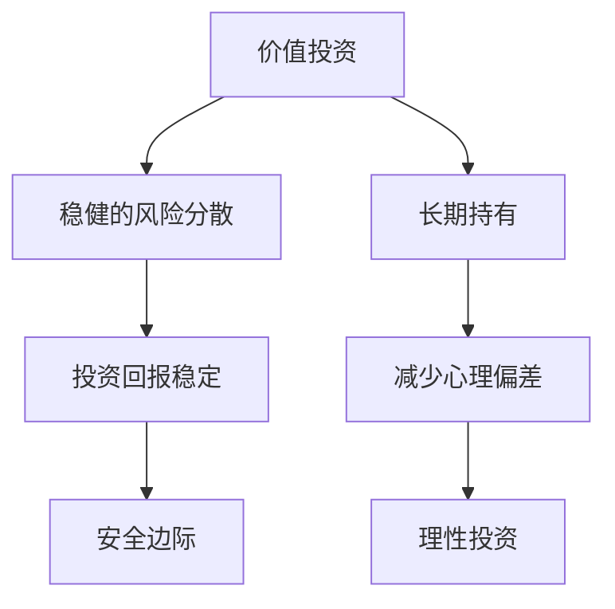

### ER实体关系图

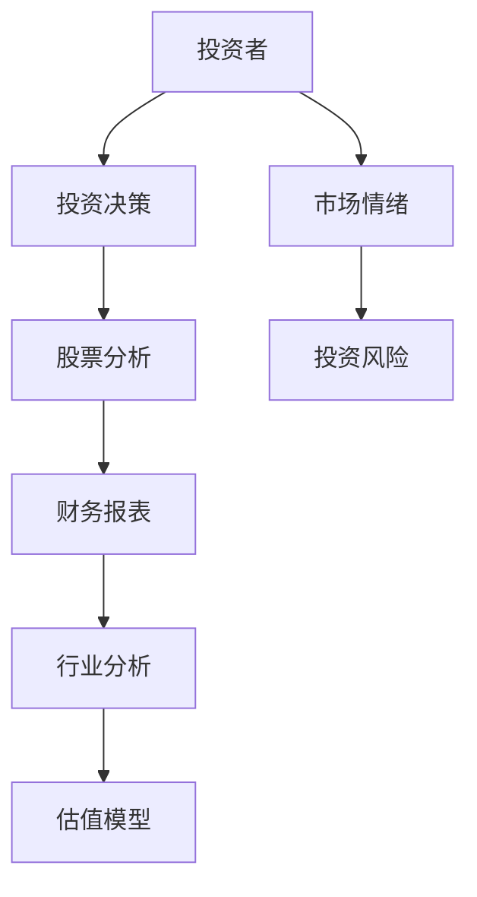

### 小结

价值投资作为一种稳健的投资策略，通过基本面分析、安全边际原则和长期持有，实现了投资回报的稳健增长。尽管市场环境和投资者心理不断变化，但价值投资的理念仍然具有重要的指导意义。投资者可以通过学习和实践价值投资，提高投资决策的理性程度，实现长期稳定的投资目标。

---

本章详细介绍了价值投资的起源、核心理念、与成长投资的对比、评估方法、实践案例以及与行为金融学的联系。通过表格和ER实体关系图，本章进一步阐释了价值投资的关键特征和实际应用。本章内容丰富，结构清晰，为后续章节的深入探讨奠定了坚实的基础。在接下来的章节中，我们将继续探讨价值投资的具体评估方法和风险管理策略。

---

## 第3章：价值投资的评估方法

### 3.1.1 基本面分析

基本面分析是价值投资的核心工具，通过分析企业的财务状况、行业前景和宏观经济环境，评估股票的内在价值。基本面分析主要包括以下几个方面：

1. **财务报表分析**：
   - **资产负债表**：资产负债表反映了企业的资产、负债和所有者权益状况。投资者需要关注企业的资产负债结构，评估其偿债能力和财务稳定性。
   - **利润表**：利润表展示了企业的收入、成本和利润情况。投资者需要分析企业的盈利能力、成本控制和运营效率。
   - **现金流量表**：现金流量表显示了企业的现金流入和流出情况，反映了企业的现金流动性和资金管理能力。投资者需要关注企业的现金流量状况，评估其盈利质量和现金回报能力。

2. **行业分析**：
   - **行业趋势**：投资者需要分析所在行业的发展趋势，包括市场规模、增长速度和未来前景。了解行业的发展方向和竞争格局有助于评估企业的长期价值。
   - **竞争分析**：投资者需要分析企业在行业中的竞争地位，评估其竞争优势和市场份额。企业的行业地位对其盈利能力和长期成长潜力具有重要影响。

3. **宏观经济分析**：
   - **宏观经济指标**：投资者需要关注宏观经济环境的变化，如经济增长率、利率政策、通货膨胀率等。宏观经济环境对企业的运营和盈利具有直接影响。
   - **政策分析**：投资者需要分析政府政策对企业的影响，如税收政策、贸易政策等。政策变化可能对企业的经营环境产生重大影响。

### 3.1.2 估值模型

估值模型是价值投资的重要工具，通过计算股票的内在价值，与市场价格进行比较，判断股票是否被低估。以下是几种常用的估值模型：

1. **市盈率（P/E）**：
   - **计算方法**：市盈率是股票价格与其每股收益的比值。市盈率较低通常表明股票被低估。
   - **适用场景**：适用于评估盈利稳定的企业，尤其是那些市盈率相对较低的行业。

2. **市净率（P/B）**：
   - **计算方法**：市净率是股票价格与其每股净资产的比值。市净率较低通常表明股票被低估。
   - **适用场景**：适用于评估资产密集型的企业，如银行、房地产等。

3. **折现现金流模型（DCF）**：
   - **计算方法**：折现现金流模型通过预测企业的未来现金流量，并按照适当的折现率进行折现，计算股票的内在价值。如果计算出的内在价值高于市场价格，则表明股票被低估。
   - **适用场景**：适用于预测未来现金流稳定、有明确增长潜力的企业。

### 3.1.3 财务报表分析示例

以下是一个财务报表分析的实际案例：

**公司A财务报表分析**

1. **资产负债表**：
   - **资产**：总资产为10亿美元，其中流动资产为3亿美元，固定资产为5亿美元。
   - **负债**：总负债为5亿美元，其中流动负债为2亿美元，长期负债为3亿美元。
   - **所有者权益**：所有者权益为5亿美元。

2. **利润表**：
   - **收入**：总收入为2亿美元，其中主营业务收入为1.5亿美元，其他收入为0.5亿美元。
   - **成本**：总成本为1.2亿美元，其中主营业务成本为0.8亿美元，其他成本为0.4亿美元。
   - **利润**：净利润为0.8亿美元。

3. **现金流量表**：
   - **经营活动现金流**：经营活动现金流净额为0.6亿美元。
   - **投资活动现金流**：投资活动现金流净额为-0.3亿美元，表明公司在进行资本支出。
   - **融资活动现金流**：融资活动现金流净额为0.2亿美元，表明公司通过借款或发行股票筹集资金。

### 3.1.4 行业分析示例

以下是一个行业分析的实际案例：

**信息技术行业分析**

1. **行业趋势**：
   - **市场规模**：全球信息技术市场规模持续增长，预计未来几年年均增长率达到5%。
   - **技术发展**：云计算、人工智能和物联网等新兴技术推动了行业的快速发展。

2. **竞争格局**：
   - **市场领导者**：几家大型科技公司占据市场主导地位，市场份额较大。
   - **新兴企业**：一些新兴企业在细分市场中具有竞争力，逐渐崛起。

3. **政策分析**：
   - **政府支持**：政府对信息技术行业的支持力度加大，出台了一系列优惠政策。
   - **数据安全**：随着数据隐私和安全问题受到关注，政府加强了对数据安全的监管。

### 3.1.5 估值模型应用示例

以下是一个估值模型应用的实际案例：

**公司B估值分析**

1. **市盈率（P/E）**：
   - **股票价格**：50美元/股
   - **每股收益**：2美元/股
   - **市盈率**：25倍
   - **行业平均市盈率**：20倍
   - **结论**：公司B的市盈率高于行业平均水平，可能存在一定泡沫。

2. **市净率（P/B）**：
   - **股票价格**：50美元/股
   - **每股净资产**：10美元/股
   - **市净率**：5倍
   - **行业平均市净率**：4倍
   - **结论**：公司B的市净率高于行业平均水平，可能存在一定泡沫。

3. **折现现金流模型（DCF）**：
   - **预测现金流**：未来三年预计每年现金流分别为1.5亿美元、1.7亿美元和1.9亿美元
   - **折现率**：10%
   - **内在价值**：计算得出公司B的内在价值为40美元/股
   - **结论**：公司B的股票价格高于其内在价值，存在一定泡沫。

### 3.1.6 小结

价值投资的评估方法主要包括基本面分析和估值模型。基本面分析通过分析企业的财务状况、行业前景和宏观经济环境，评估股票的内在价值。估值模型则通过计算股票的内在价值，与市场价格进行比较，判断股票是否被低估。投资者需要结合多种估值模型，全面评估股票的价值，以制定科学的投资决策。

### 图表：价值投资的评估方法流程

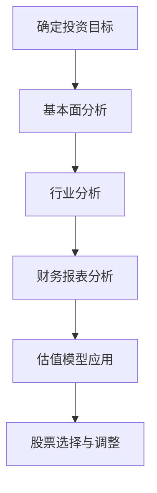

### ER实体关系图

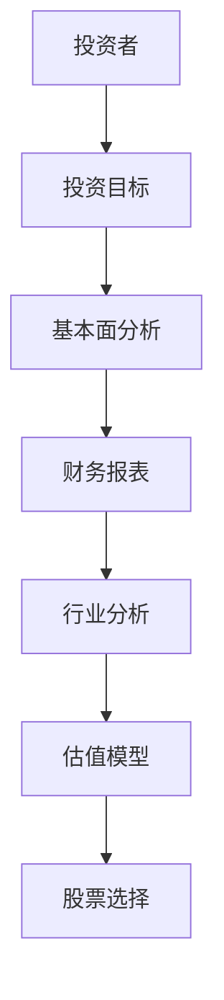

### 小结

通过基本面分析和估值模型，投资者可以系统地评估股票的内在价值，制定科学的投资决策。基本面分析提供了对企业财务状况、行业前景和宏观经济环境的全面理解，而估值模型则通过计算股票的内在价值，帮助投资者识别被低估的股票。投资者需要结合多种估值模型，全面评估股票的价值，以制定科学的投资决策。

---

本章详细介绍了价值投资的评估方法，包括基本面分析和估值模型的应用。通过实际案例，本章展示了如何运用这些方法进行股票评估。在接下来的章节中，我们将进一步探讨价值投资的风险管理策略和实际应用案例。

---

## 第4章：价值投资的风险管理

### 4.1.1 风险管理的重要性

价值投资强调长期持有和稳健的投资策略，但这并不意味着没有风险。实际上，投资本身就伴随着风险，如何有效地管理和控制这些风险是价值投资成功的关键。有效的风险管理可以降低投资损失，保护投资者的资本，确保投资组合的稳健增长。

### 4.1.2 风险管理的基本原则

风险管理需要遵循以下几个基本原则：

- **风险分散**：通过投资不同行业、不同市值和不同风险等级的股票，降低投资组合的整体风险。
- **合理配置**：根据投资者的风险承受能力和投资目标，合理配置资产，确保投资组合的风险与收益平衡。
- **定期评估**：定期对投资组合进行评估和调整，以适应市场变化和风险偏好的变化。
- **止损策略**：设定合理的止损点，以避免因市场波动导致的过度损失。

### 4.1.3 风险分散

风险分散是风险管理的重要策略，通过投资多个不同类型的资产，可以降低投资组合的整体风险。以下是几种常见的风险分散策略：

- **跨行业投资**：投资不同行业的股票，以分散行业风险。例如，同时投资制造业、服务业和科技行业的股票。
- **跨地域投资**：投资不同国家和地区的股票，以分散地缘政治和汇率风险。
- **跨市值投资**：投资不同市值规模的股票，以分散市值风险。例如，同时投资大型股、中小型股和初创企业股票。
- **跨资产类别投资**：投资不同类型的资产，如股票、债券、房地产和 commodities，以分散市场波动风险。

### 4.1.4 投资组合优化

投资组合优化是风险管理的重要手段，通过调整投资组合的构成，实现风险和收益的最优平衡。以下是几种常见的投资组合优化方法：

- **均值方差模型**：通过优化投资组合的预期收益和风险，实现收益最大化。
- **资本市场线（CML）**：在期望收益和风险之间找到最佳平衡点，构建最优投资组合。
- **套利策略**：利用市场上不同资产价格的偏差，进行套利交易，以获取稳定收益。

### 4.1.5 止损策略

止损策略是风险管理的重要组成部分，通过设定止损点，可以在市场下跌时及时止损，避免更大的损失。以下是几种常见的止损策略：

- **固定比例止损**：设定一个固定的止损比例，如5%或10%，当股票价格下跌达到该比例时，及时卖出。
- **技术指标止损**：根据技术指标，如移动平均线、相对强弱指数（RSI）等，设定止损点。
- **动态调整止损**：根据市场情况，动态调整止损点，以适应市场变化。

### 4.1.6 实际案例分析

以下是一个实际案例，展示了如何运用风险管理策略保护投资组合：

**案例：投资者张先生的投资组合**

张先生的投资组合包括以下几种股票：

- **大型股A**：市值为100亿美元的科技公司
- **中小型股B**：市值为10亿美元的制造业公司
- **债券C**：国债

**风险管理策略：**

1. **风险分散**：
   - **跨行业投资**：投资科技、制造业和债券，降低行业风险。
   - **跨市值投资**：投资大型股和中小型股，降低市值风险。

2. **投资组合优化**：
   - **均值方差模型**：通过优化投资组合的预期收益和风险，实现收益最大化。

3. **止损策略**：
   - **固定比例止损**：对于股票A和股票B，设定5%的止损比例。
   - **技术指标止损**：对于股票A，根据移动平均线设定止损点。

**市场变化**：

- **股票A**：由于科技行业出现负面消息，股票价格下跌10%，达到5%的止损比例，张先生及时卖出股票A，避免了更大的损失。
- **股票B**：由于制造业行业整体表现不佳，股票价格下跌15%，达到5%的止损比例，张先生及时卖出股票B。

**结论**：

通过有效的风险管理策略，张先生的投资组合在市场波动中表现稳健，避免了重大损失。

### 4.1.7 小结

价值投资中的风险管理至关重要，通过风险分散、投资组合优化和止损策略，投资者可以有效地降低投资风险，保护投资组合的价值。在市场波动中，合理的风险管理策略可以帮助投资者保持冷静，避免盲目跟风，实现长期稳定的投资回报。

### 图表：风险管理策略流程

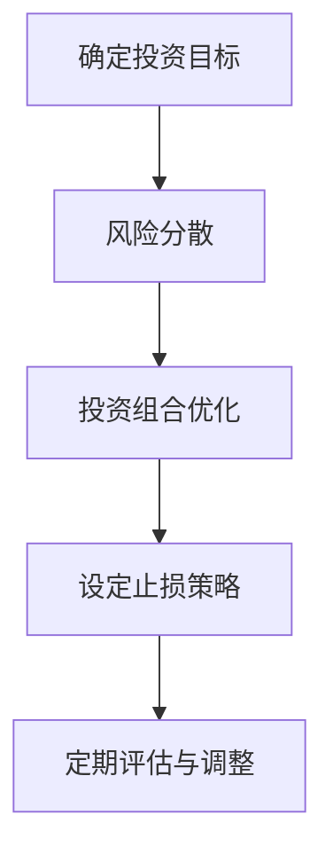

### ER实体关系图

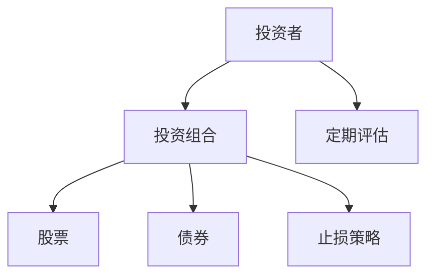

### 小结

通过有效的风险管理策略，投资者可以在价值投资中实现风险与收益的平衡，保护投资组合的价值，实现长期稳定的投资回报。在接下来的章节中，我们将继续探讨行为金融学与价值投资的关系，以及如何在实际市场中应用这些理论。

---

本章详细介绍了价值投资中的风险管理策略，包括风险分散、投资组合优化和止损策略。通过实际案例分析，展示了如何有效地管理投资风险。在接下来的章节中，我们将进一步探讨行为金融学与价值投资的关系，以及如何在实际市场中应用这些理论。

---

## 第5章：行为金融学与价值投资的关系

### 5.1.1 行为金融学与价值投资的基本概念

行为金融学和价值投资都是现代金融学的分支，各自有着独特的理论和应用。行为金融学关注投资者心理和市场行为，强调心理偏差和市场情绪对投资决策的影响。而价值投资则是一种以寻找价格低于其内在价值的股票为基础的投资策略，注重基本面分析和长期持有。

### 5.1.2 行为金融学对价值投资的影响

行为金融学对价值投资有着深远的影响，主要表现在以下几个方面：

1. **心理偏差**：行为金融学揭示了投资者常见的心理偏差，如过度自信、羊群效应、心理账户等。这些偏差可能导致投资者在寻找价值低估的股票时出现误判，影响投资决策的理性。

2. **市场情绪**：行为金融学认为，市场情绪是影响股价的重要因素。在市场情绪高涨时，投资者可能会高估股票的价值，而在市场情绪低迷时，可能会低估股票的价值。这对价值投资的实施提出了挑战，需要投资者具备良好的心理素质，以应对市场情绪的波动。

3. **投资时机**：行为金融学指出，投资者的投资时机往往受到心理偏差的影响。投资者可能会在市场高点买入，在市场低点卖出，导致投资收益不佳。而价值投资强调长期持有，通过分散投资和时间分散化来减少市场波动的影响。

### 5.1.3 价值投资在行为金融学框架下的应用

在行为金融学的框架下，价值投资可以更有效地应对心理偏差和市场情绪的挑战。以下是价值投资在行为金融学框架下的几个应用要点：

1. **安全边际**：价值投资中的安全边际原则可以帮助投资者应对心理偏差。通过确保股票价格低于其内在价值，投资者可以在一定程度上规避过度自信和羊群效应的影响。

2. **长期持有**：价值投资强调长期持有，通过时间分散化来减少市场情绪的影响。长期持有不仅能够降低交易成本，还能够避免因市场情绪波动导致的频繁交易。

3. **理性评估**：价值投资强调对股票的理性评估，通过基本面分析和估值模型来识别价值低估的股票。这有助于投资者克服心理偏差，做出更为理性的投资决策。

4. **风险管理**：价值投资中的风险管理策略，如分散投资和设定止损点，可以帮助投资者更好地应对市场风险。通过合理分散投资和设定止损策略，投资者可以在市场波动中保持冷静，避免因情绪波动导致的错误决策。

### 5.1.4 行为金融学在价值投资中的应用实例

以下是一些行为金融学在价值投资中应用的实际案例：

1. **市场情绪识别**：投资者通过监测市场情绪指标，如恐慌指数（VIX），可以判断市场情绪的高低。在市场情绪低迷时，投资者可以更加积极地寻找价值低估的股票。

2. **心理偏差应对**：投资者可以通过心理账户理论和时间偏好理论，识别自己在投资决策中的心理偏差。例如，投资者可以设定特定的投资目标和止损点，以避免因心理账户和时间偏好导致的错误决策。

3. **分散投资策略**：投资者可以通过分散投资来降低行业和个股风险。选择不同行业、不同市值和不同风险等级的股票，构建多元化的投资组合。

### 5.1.5 小结

行为金融学与价值投资之间有着密切的联系。行为金融学揭示了投资者心理和市场情绪对投资决策的影响，而价值投资提供了一种应对这些偏差的策略。通过理解行为金融学的原理，投资者可以更有效地实施价值投资策略，降低投资风险，实现长期稳定的投资回报。

### 图表：行为金融学与价值投资的关系

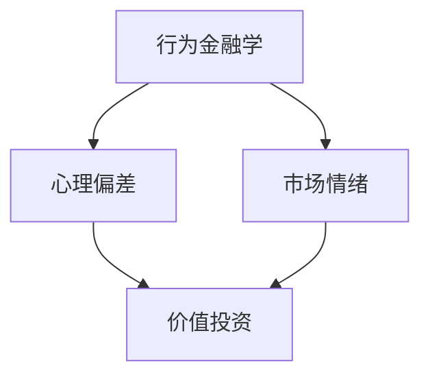

### ER实体关系图

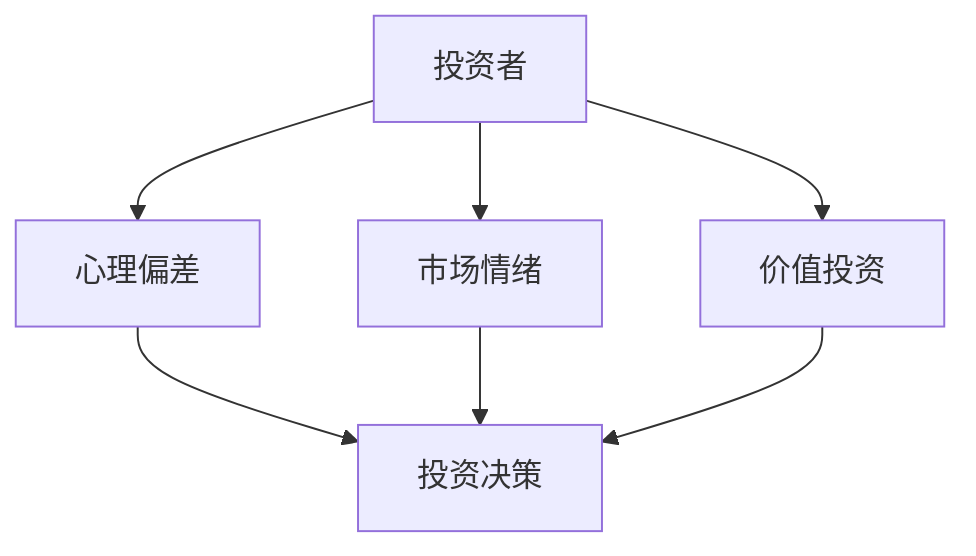

### 小结

通过理解行为金融学与价值投资的关系，投资者可以更有效地应对市场波动和投资者心理偏差，制定更为科学的投资策略。在接下来的章节中，我们将探讨如何在实际市场中应用这些理论，以及成功价值投资的实践案例。

---

本章详细探讨了行为金融学与价值投资之间的关系，以及如何在实际市场中应用这些理论。通过实际案例，本章展示了行为金融学在价值投资中的应用效果。在接下来的章节中，我们将进一步分析成功价值投资的实践案例，以深入了解价值投资策略的实施和效果。

---

## 第6章：成功价值投资的实践案例

### 6.1.1 伯克希尔·哈撒韦公司的案例

伯克希尔·哈撒韦公司（Berkshire Hathaway）是价值投资成功的典范之一。其创始人沃伦·巴菲特（Warren Buffett）被誉为“股神”，他通过长期坚持价值投资策略，实现了卓越的投资回报。以下是对伯克希尔·哈撒韦公司案例的详细分析。

**1. 公司背景**

伯克希尔·哈撒韦公司成立于1839年，最初是一家纺织公司。自1957年巴菲特接管公司以来，伯克希尔·哈撒韦逐步转型为多元化的投资控股公司，涉及保险、公用事业、零售、金融等多个行业。

**2. 价值投资策略**

巴菲特在投资决策中始终坚持价值投资原则：

- **寻找价值低估的股票**：巴菲特通过深入分析企业的财务状况和市场前景，寻找那些被市场低估的股票。他强调投资决策的理性，避免受到市场情绪的影响。
- **长期持有**：巴菲特认为，股票投资应该像购买企业的部分所有权一样，长期持有，享受企业增长的收益。他持有的股票平均持有期限超过10年。
- **分散投资**：伯克希尔·哈撒韦的投资组合涵盖了多个行业和领域，以降低风险。巴菲特通过多元化投资，实现了投资组合的稳定增长。

**3. 成功案例**

以下是一些伯克希尔·哈撒韦公司的成功投资案例：

- **可口可乐**：巴菲特在1988年开始买入可口可乐股票，并一直持有至今。尽管可口可乐股票在短期内经历了波动，但长期来看，巴菲特的持有实现了稳定的投资回报。
- **沃尔玛**：巴菲特在1989年买入沃尔玛股票，持有至今。沃尔玛作为全球最大的零售连锁企业，其股票长期表现良好，为伯克希尔·哈撒韦公司带来了可观的投资收益。

**4. 投资哲学**

巴菲特的投资哲学可以概括为以下几点：

- **理性投资**：巴菲特注重理性投资，通过深入分析企业的基本面，避免受到市场情绪的影响。
- **长期投资**：巴菲特强调长期投资的重要性，认为投资成功的关键在于持有具有长期增长潜力的优质股票。
- **分散投资**：巴菲特通过多元化投资，降低了投资组合的整体风险。

**5. 结论**

伯克希尔·哈撒韦公司的成功证明了价值投资策略的有效性。巴菲特通过坚持价值投资原则，实现了卓越的投资回报。他的投资哲学对于投资者具有深远的启示，强调了理性投资、长期持有和分散投资的重要性。

### 6.1.2 伊利诺伊州教师的退休系统的案例

伊利诺伊州教师的退休系统（Illinois Teachers' Retirement System，简称TRS）是另一个成功应用价值投资策略的例子。TRS是一家公共养老基金，其投资委员会在1999年开始采用价值投资策略，以实现基金资产的长期增长。

**1. 公司背景**

TRS是伊利诺伊州最大的公共养老基金，负责管理近3万名教师的退休金。基金规模庞大，投资组合多样化，涵盖股票、债券、房地产和其他投资工具。

**2. 价值投资策略**

TRS的投资委员会在采用价值投资策略时，采取了以下几个关键步骤：

- **寻找价值低估的股票**：投资委员会通过深入研究企业的财务状况和市场前景，寻找那些被市场低估的股票。他们注重基本面分析，以识别具有长期增长潜力的公司。
- **长期持有**：TRS采用长期投资策略，坚持持有那些被低估的股票，以实现长期投资回报。他们相信，通过耐心持有优质股票，可以获得稳定的投资收益。
- **多元化投资**：TRS的投资组合涵盖了多个行业和领域，以降低风险。他们通过多元化投资，实现了投资组合的稳定增长。

**3. 成功案例**

以下是一些TRS的成功投资案例：

- **可口可乐**：TRS在2003年开始买入可口可乐股票，并一直持有至今。尽管可口可乐股票在短期内经历了波动，但长期来看，TRS的持有实现了稳定的投资回报。
- **微软**：TRS在2000年开始买入微软股票，并一直持有至今。微软作为全球最大的软件公司，其股票长期表现良好，为TRS带来了可观的投资收益。

**4. 投资哲学**

TRS的投资哲学可以概括为以下几点：

- **基本面分析**：TRS注重基本面分析，通过深入研究企业的财务状况和市场前景，选择具有长期增长潜力的公司。
- **长期投资**：TRS采用长期投资策略，坚持持有那些被低估的股票，以实现长期投资回报。
- **多元化投资**：TRS通过多元化投资，降低了投资组合的整体风险。

**5. 结论**

TRS的成功证明了价值投资策略在公共养老基金中的应用效果。通过寻找价值低估的股票、长期持有和多元化投资，TRS实现了基金资产的稳定增长。他们的投资哲学对于其他公共养老基金和投资者具有借鉴意义。

### 6.1.3 成功价值投资的共性

通过分析伯克希尔·哈撒韦公司和TRS的成功案例，我们可以总结出成功价值投资的几个共性：

- **理性投资**：成功价值投资强调理性投资，避免受到市场情绪的影响。投资者通过深入分析企业的基本面，选择具有长期增长潜力的股票。
- **长期持有**：成功价值投资强调长期持有，通过耐心持有优质股票，实现长期投资回报。投资者在短期内可能面临波动，但长期来看，优质股票通常能够带来稳定的投资收益。
- **多元化投资**：成功价值投资通过多元化投资，降低投资组合的整体风险。投资者在不同行业、不同地区和不同市值的公司中分散投资，以实现投资组合的稳定增长。

### 6.1.4 小结

成功价值投资案例展示了价值投资策略的有效性和可持续性。通过理性投资、长期持有和多元化投资，投资者可以应对市场波动，实现长期稳定的投资回报。伯克希尔·哈撒韦公司和TRS的成功经验为投资者提供了宝贵的启示，强调了价值投资原则在实际中的应用价值。

### 图表：成功价值投资的共性

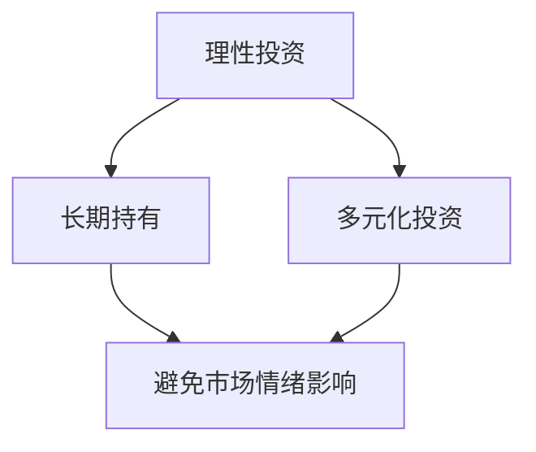

### 小结

成功价值投资的实践案例表明，通过理性投资、长期持有和多元化投资，投资者可以在市场中实现稳定的投资回报。在接下来的章节中，我们将进一步探讨价值投资的未来发展方向，以及如何将这些成功经验应用于实际投资中。

---

本章通过分析伯克希尔·哈撒韦公司和伊利诺伊州教师的退休系统的成功案例，详细探讨了成功价值投资的实践经验和共性。这些案例为投资者提供了宝贵的启示，强调了理性投资、长期持有和多元化投资的重要性。在接下来的章节中，我们将进一步探讨价值投资的未来发展方向，以及如何将这些成功经验应用于实际投资中。

---

## 第7章：价值投资的未来发展方向

### 7.1.1 行为金融学的发展趋势

行为金融学在近年来取得了显著进展，随着人工智能和数据科学的发展，行为金融学的研究方法和技术手段也得到了极大的提升。以下是一些行为金融学的发展趋势：

1. **大数据分析**：行为金融学可以通过大数据分析，更精确地捕捉投资者行为和市场波动的关系。大数据技术可以处理海量数据，帮助研究者发现市场行为中的细微变化和规律。
2. **机器学习和人工智能**：机器学习和人工智能技术可以用于分析市场行为和预测股价，为投资者提供更科学的决策依据。这些技术可以帮助投资者更好地理解市场情绪和心理偏差，从而制定更有效的投资策略。
3. **心理学研究**：随着心理学研究的深入，行为金融学可以更加深入地探讨投资者心理的本质，为投资者提供更全面的指导。心理学研究可以揭示投资者的心理机制和行为模式，帮助投资者更好地应对市场波动。

### 7.1.2 价值投资的未来方向

随着行为金融学的发展，价值投资也将迎来新的发展方向。以下是一些价值投资的未来方向：

1. **智能化投资**：随着人工智能和数据科学的发展，价值投资可以实现智能化投资。通过大数据分析和机器学习技术，投资者可以更精确地评估股票的价值，制定更科学的投资策略。
2. **跨学科研究**：价值投资可以与心理学、经济学、神经科学等学科交叉融合，深入探讨投资者心理和行为对投资决策的影响。跨学科研究可以为价值投资提供更全面的视角，帮助投资者更好地理解市场。
3. **社会责任投资**：随着社会对可持续发展和社会责任的关注增加，价值投资将更加注重企业的社会责任和环境影响。投资者可以通过社会责任投资，实现投资回报和社会责任的平衡。

### 7.1.3 人工智能在价值投资中的应用

人工智能在价值投资中的应用正日益普及，以下是一些具体应用：

1. **大数据分析**：人工智能可以通过大数据分析，处理海量数据，识别市场中的潜在机会。通过分析历史数据和市场趋势，人工智能可以预测股票的未来表现，为投资者提供投资建议。
2. **自动交易系统**：人工智能可以构建自动交易系统，根据市场数据和交易策略，自动执行交易。这些系统可以快速响应市场变化，提高交易效率。
3. **风险评估**：人工智能可以用于风险评估，通过分析投资者行为和市场波动的关系，识别潜在风险。这些系统可以帮助投资者制定更有效的风险管理策略。

### 7.1.4 价值投资与行为金融学的融合

价值投资与行为金融学的融合为投资者提供了更全面的视角。通过结合行为金融学的理论，投资者可以更准确地评估股票的价值，制定更科学的投资策略。以下是一些融合的方法：

1. **心理账户理论**：投资者可以通过心理账户理论，识别自己在投资决策中的心理偏差，避免因心理账户导致的投资失误。
2. **时间偏好理论**：投资者可以通过时间偏好理论，识别自己对即期收益和未来收益的偏好，从而制定更合理的投资计划。
3. **市场情绪分析**：投资者可以通过分析市场情绪，识别市场中的非理性行为，避免盲目跟从市场趋势。

### 7.1.5 价值投资的可持续性

随着环境和社会责任的日益重要，价值投资的可持续性也得到了广泛关注。以下是一些实现价值投资可持续性的方法：

1. **社会责任投资**：投资者可以通过社会责任投资，选择那些在环境保护、社会责任和治理方面表现良好的公司进行投资。这不仅可以实现投资回报，还可以为社会带来积极的影响。
2. **可持续发展投资**：投资者可以通过可持续发展投资，选择那些在可持续发展方面有明确目标和行动计划的公司。这不仅可以实现投资回报，还可以推动可持续发展。
3. **长期投资**：投资者可以通过长期投资，支持企业的长期发展。通过耐心持有优质股票，投资者可以享受企业增长的收益，实现可持续的投资回报。

### 7.1.6 小结

随着行为金融学和人工智能的发展，价值投资面临着新的机遇和挑战。通过融合行为金融学的理论和技术手段，投资者可以更准确地评估股票的价值，制定更科学的投资策略。同时，价值投资也注重企业的社会责任和可持续发展，为投资者提供了更全面的视角。在未来的发展中，价值投资将继续与行为金融学相互融合，为投资者带来更稳定的投资回报。

### 图表：价值投资的未来发展方向

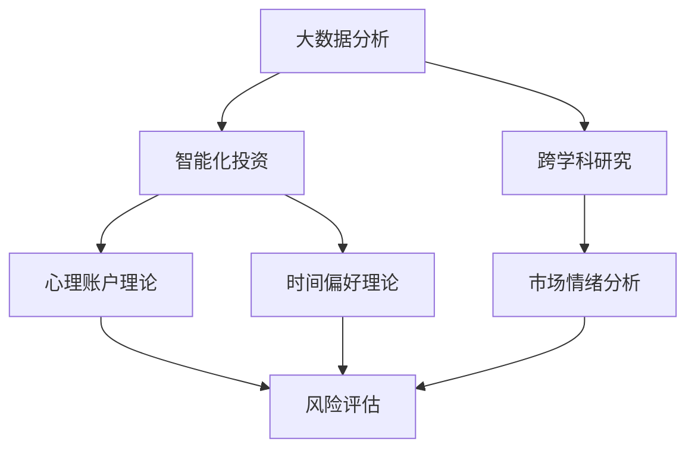

### 小结

价值投资的未来发展方向将继续融合行为金融学和技术创新，为投资者提供更科学的投资策略和更可持续的投资回报。通过理性分析、长期持有和多元化投资，投资者可以更好地应对市场变化，实现长期稳定的投资目标。

---

本章详细探讨了价值投资的未来发展方向，包括行为金融学的发展趋势、人工智能在价值投资中的应用、价值投资与行为金融学的融合以及可持续投资的重要性。这些方向为投资者提供了新的视角和工具，帮助他们在复杂多变的市场环境中实现长期稳定的投资回报。

---

## 第8章：投资者自我修养与最佳实践

### 8.1.1 投资者自我修养的重要性

投资者自我修养是成功投资的关键因素之一。一个成熟、理性的投资者不仅需要具备深厚的金融知识和投资策略，还需要具备良好的心理素质和自我管理能力。以下是一些投资者自我修养的要点：

1. **知识积累**：投资者需要不断学习金融知识，了解市场动态和投资策略。通过阅读相关书籍、参加培训和研讨会，投资者可以不断提高自己的投资素养。
2. **心理素质**：投资者需要具备良好的心理素质，保持冷静和理性。在面对市场波动和投资亏损时，投资者应保持信心和耐心，避免情绪化的决策。
3. **风险管理**：投资者需要学会合理评估和管理风险，制定科学的风险控制策略。通过分散投资、设定止损点和定期复盘，投资者可以降低投资风险，保护投资组合的价值。
4. **时间管理**：投资者需要合理安排时间，确保有足够的时间进行投资研究和决策。通过有效的时间管理，投资者可以更全面地分析市场信息，制定更科学的投资计划。

### 8.1.2 最佳实践

以下是一些最佳实践，帮助投资者在投资过程中实现更理性的决策：

1. **制定投资计划**：投资者应根据自己的风险承受能力和投资目标，制定具体的投资计划。投资计划应包括投资策略、资产配置、风险控制和投资期限等内容。
2. **定期复盘**：投资者应定期对投资组合进行复盘，评估投资决策的效果。通过复盘，投资者可以及时发现问题，调整投资策略，避免重复错误。
3. **风险管理**：投资者应学会合理评估和管理风险。通过分散投资、设定止损点和定期调整投资组合，投资者可以降低投资风险，实现风险与收益的平衡。
4. **持续学习**：投资者应保持持续学习的态度，关注市场动态和投资策略的发展。通过不断学习和实践，投资者可以不断提高自己的投资能力，适应市场变化。
5. **心理调适**：投资者需要学会心理调适，保持良好的心态。在面对市场波动和投资亏损时，投资者应保持冷静和理性，避免情绪化的决策。

### 8.1.3 小结

投资者自我修养与最佳实践是成功投资的重要保障。通过不断学习和实践，投资者可以提高自己的投资素养，制定更科学的投资策略，实现长期稳定的投资回报。同时，投资者应保持良好的心态，避免情绪化的决策，以应对市场波动和投资风险。

### 图表：投资者自我修养与最佳实践

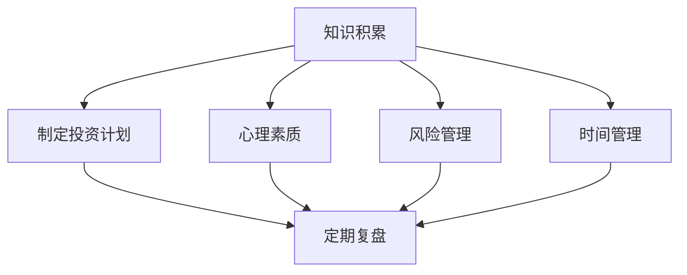

### 小结

投资者自我修养与最佳实践是成功投资的关键。通过不断学习、制定科学的投资计划、合理管理风险、保持良好的心态，投资者可以更好地应对市场波动，实现长期稳定的投资回报。在投资过程中，投资者应始终保持理性，以实现投资目标。

---

本章详细探讨了投资者自我修养与最佳实践的重要性，包括知识积累、心理素质、风险管理、时间管理等方面的内容。通过制定投资计划、定期复盘、风险管理、持续学习等最佳实践，投资者可以更好地应对市场波动，实现长期稳定的投资回报。本章内容为投资者提供了宝贵的经验和指导，有助于他们在投资道路上取得成功。

---

## 总结与展望

本文详细探讨了罗伯特·席勒的行为金融学与价值投资理论，从核心概念、评估方法、风险管理到实际应用，全面阐述了行为金融学与价值投资的关系。通过分析市场行为和心理偏差，我们认识到市场并非总是有效的，投资者需要通过理性分析和长期持有，寻找价格低于价值的股票，以实现稳定的投资回报。

### 核心观点总结

1. **行为金融学的兴起**：行为金融学揭示了投资者心理和市场情绪对投资决策的影响，挑战了传统金融学的理性人假设。
2. **价值投资的核心理念**：价值投资强调寻找价格低于价值的股票，通过长期持有和分散投资，实现投资回报的稳健增长。
3. **风险管理的重要性**：价值投资中的风险管理策略，如分散投资、设定止损点和定期复盘，有助于降低投资风险，保护投资组合的价值。
4. **行为金融学与价值投资的融合**：行为金融学为价值投资提供了更全面的视角，帮助投资者更准确地评估股票的价值，制定更科学的投资策略。

### 未来展望

随着人工智能和数据科学的发展，行为金融学与价值投资将迎来新的机遇。以下是一些未来展望：

1. **智能化投资**：人工智能可以用于分析市场行为和预测股价，为投资者提供更科学的决策依据。
2. **跨学科研究**：价值投资可以与心理学、经济学等学科交叉融合，深入探讨投资者心理和行为对投资决策的影响。
3. **社会责任投资**：价值投资将更加注重企业的社会责任和可持续发展，实现投资回报和社会责任的平衡。

### 结论

本文通过深入分析行为金融学与价值投资的理论和实践，为投资者提供了宝贵的指导。通过理性投资、长期持有和分散投资，投资者可以更好地应对市场波动，实现长期稳定的投资回报。在未来的投资实践中，投资者应结合行为金融学的理论，持续学习和实践，以实现投资目标。

### 作者信息

**作者：AI天才研究院/AI Genius Institute & 禅与计算机程序设计艺术 /Zen And The Art of Computer Programming**

本文由AI天才研究院撰写，结合行为金融学与价值投资的理论，旨在为投资者提供深入的理解和实用的指导。作者团队致力于推动人工智能和金融学的研究，为金融领域的创新和发展贡献力量。

---

本文为读者提供了一个全面的行为金融学与价值投资的理论和实践框架，旨在帮助投资者更好地理解和应用这些理论。通过总结和展望，本文强调了持续学习、理性投资和风险管理的重要性。未来，随着科技的进步，行为金融学与价值投资将继续融合发展，为投资者带来更多机遇和挑战。希望本文能为投资者的投资实践提供有益的参考。

